# AI Orchestrator - Especificação Técnica Completa

> **Versão:** 1.1.0  
> **Última Atualização:** Maio 2026  
> **Projeto:** Câmara na Mão  
> **Classificação:** Documentação Técnica Interna  
>
> **Notas CHB (Maio/2026):** fluxo centralizado no `ai-orchestrator` (sem workflow N8N legado); `metadata.journey_snapshot` para retomada; FE modular (`useJourneyTracker`, `useChatOrchestratorStream`); precedência de atalhos em [AI_ORCHESTRATOR_SHORTCUT_PRECEDENCE.md](./AI_ORCHESTRATOR_SHORTCUT_PRECEDENCE.md).

---

## Índice

1. [Visão Geral do Orquestrador](#1-visão-geral-do-orquestrador)
2. [Catálogo de Ferramentas](#2-catálogo-de-ferramentas)
3. [Jornada: Relato Urbano](#3-jornada-relato-urbano)
4. [Jornada: Diagnóstico de Transporte](#4-jornada-diagnóstico-de-transporte)
5. [Jornada: Avaliação de Serviço](#5-jornada-avaliação-de-serviço)
6. [Jornadas Leves](#6-jornadas-leves)
7. [Guardrails e Regras de Ouro](#7-guardrails-e-regras-de-ouro)
8. [Proibições Explícitas](#8-proibições-explícitas)
9. [Cenários de Borda](#9-cenários-de-borda)
10. [Limites e Rate Limiting](#10-limites-e-rate-limiting)
11. [Motor Determinístico](#11-motor-determinístico)
12. [Categorias Urbanas](#12-categorias-urbanas)
13. [Tipos de Transporte](#13-tipos-de-transporte)
14. [Marcadores de Sincronização](#14-marcadores-de-sincronização)
15. [Sistema de Priorização automacao](#15-sistema-de-priorização-automacao)
16. [Matriz de Prioridade](#16-matriz-de-prioridade)
17. [Fatores de Pontuação](#17-fatores-de-pontuação)
18. [Regras de Override](#18-regras-de-override)
19. [Payload automacao](#19-payload-automacao)
20. [Sistema de Encaminhamento](#20-sistema-de-encaminhamento)
21. [Algoritmo de Sugestão de Vereadores](#21-algoritmo-de-sugestão-de-vereadores)
22. [Ciclo de Vida do Encaminhamento](#22-ciclo-de-vida-do-encaminhamento)
23. [Notificações](#23-notificações)
24. [Integrações Externas](#24-integrações-externas)
    - 24.1 [Visão Geral](#241-visão-geral-das-integrações)
    - 24.2 [automacao Workflow Engine](#242-automacao-workflow-engine)
    - 24.3 [Google Places API](#243-google-places-api-new)
    - 24.4 [ViaCEP](#244-viacep)
    - 24.5 [SP Legis API - Vereadores](#245-sp-legis-api---vereadores)
    - 24.6 [Portal CMSP - Notícias](#246-portal-cmsp---notícias-wordpress)
    - 24.7 [Portal CMSP - Agenda](#247-portal-cmsp---agenda-e-audiências-wordpress)
    - 24.8 [Provedor LLM (OpenAI-compatible)](#248-provedor-llm-openai-compatible)
    - 24.9 [Estratégia de Cache e Fallback](#249-estratégia-de-cache-e-fallback)
25. [Segurança e Auditoria](#25-segurança-e-auditoria)
26. [Testes E2E Obrigatórios](#26-testes-e2e-obrigatórios)
27. [Apêndice A: Keywords por Categoria](#apêndice-a-keywords-por-categoria)
28. [Apêndice B: Regex de Validação](#apêndice-b-regex-de-validação)
29. [Apêndice C: Mapa de Erros](#apêndice-c-mapa-de-erros)
30. [Apêndice D: Glossário Técnico](#apêndice-d-glossário-técnico)
31. [Apêndice E: Diagramas Mermaid](#apêndice-e-diagramas-mermaid)

---

## 1. Visão Geral do Orquestrador

### 1.1 Arquitetura Fundamental

O AI Orchestrator é um **assistente conversacional único** que gerencia todas as interações do cidadão com a plataforma Câmara na Mão. Diferente de arquiteturas com múltiplos agentes especializados ou dispatchers, o sistema utiliza um único modelo de linguagem com ferramentas (tools) que são acionadas conforme o contexto da conversa.

```
┌─────────────────────────────────────────────────────────────────┐
│                        FRONTEND (React)                         │
├─────────────────────────────────────────────────────────────────┤
│  AgentChatArea → useUnifiedAIChat → ChatMessageBubble           │
│       ↓                                                         │
│  DataCollectionTracker ← [COLLECTION_PROGRESS] markers          │
└─────────────────────────────────────────────────────────────────┘
                              ↕ SSE Stream
┌─────────────────────────────────────────────────────────────────┐
│                   BACKEND (Edge Function)                       │
├─────────────────────────────────────────────────────────────────┤
│  ai-orchestrator/index.ts                                       │
│       ↓                                                         │
│  System Prompt + Tools + Context                                │
│       ↓                                                         │
│  Provedor LLM (AI_CHAT_BASE_URL — vLLM / OpenAI-compatible)     │
│       ↓                                                         │
│  Tool Execution (12 tools disponíveis)                          │
│       ↓                                                         │
│  Supabase (PostgreSQL + Edge Functions)                         │
└─────────────────────────────────────────────────────────────────┘
```

### 1.2 Princípios de Design

| Princípio | Descrição | Exemplo |
|-----------|-----------|---------|
| **Empático** | Linguagem acolhedora, nunca técnica | "Entendi que você está enfrentando um problema..." |
| **Educacional** | Explica processos quando relevante | "Seu relato será analisado pela Comissão de Urbanismo..." |
| **Acessível** | Frases curtas, vocabulário simples | Máximo 2 frases por resposta durante coleta |
| **Objetivo** | Vai direto ao ponto | Sem saudações longas ou preâmbulos |
| **Resiliente** | Nunca bloqueia o fluxo | Fallback para categoria "outro" se necessário |
| **Transparente** | Indica fonte das informações | "Segundo a agenda da Câmara..." |

### 1.3 Fluxo de Mensagem

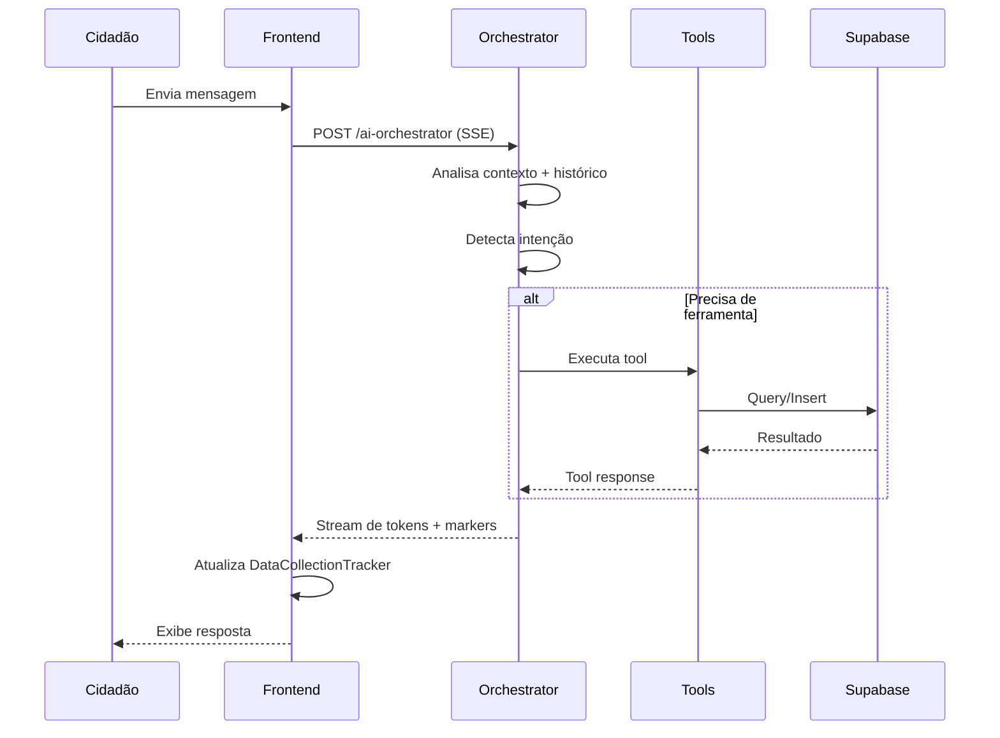

### 1.4 Gerenciamento de Contexto

O orquestrador mantém contexto através de:

1. **Histórico de Mensagens**: Últimas N mensagens da conversa
2. **Journey State**: Jornada ativa (urbano, transporte, avaliação, etc.)
3. **Accumulated Fields**: Campos já coletados na jornada atual
4. **User Profile**: Dados do perfil (endereço, preferências)
5. **Light Journey Memory**: Jornadas leves ativas (não requerem coleta)

---

## 2. Catálogo de Ferramentas

O orquestrador dispõe de **12 ferramentas** categorizadas por comportamento de persistência:

### 2.1 Visão Geral

| Tool | Categoria | Persistência | Marcadores Emitidos |
|------|-----------|--------------|---------------------|
| `classify_report_category` | Session | Temporária | `[COLLECTION_PROGRESS]` |
| `classify_transport_type` | Session | Temporária | `[COLLECTION_PROGRESS]` |
| `validate_cep` | Session | Temporária | - |
| `detect_user_intent` | Session | Temporária | `[JOURNEY_SWITCH_PROMPT]` |
| `create_urban_report` | Permanente | Supabase | `[REPORT_CREATED:id]` |
| `create_transport_report` | Permanente | Supabase | `[REPORT_CREATED:id]` |
| `create_service_rating` | Permanente | Supabase | `[REPORT_CREATED:id]` |
| `search_knowledge_base` | Read-Only | Nenhuma | - |
| `find_nearby_services` | Read-Only | Nenhuma | - |
| `search_audiencias` | Read-Only | Nenhuma | - |
| `suggest_council_member` | Read-Only | Nenhuma | - |
| `get_citizen_history` | Read-Only | Nenhuma | - |

---

### 2.2 Ferramentas de Sessão (Session State)

#### 2.2.1 classify_report_category

**Descrição**: Classifica automaticamente a categoria de um relato urbano baseado na descrição do cidadão.

**Parâmetros**:
```typescript
{
  description: string;      // Obrigatório. Mín 10 chars.
  user_location?: string;   // Opcional. Bairro/região.
}
```

**Regras de Acionamento**:
| QUANDO CHAMAR | QUANDO NÃO CHAMAR |
|---------------|-------------------|
| Descrição >= 10 caracteres específicos | Mensagens genéricas ("quero relatar") |
| Contém detalhes do problema | Apenas intenção sem detalhes |
| Primeira descrição da jornada urbana | Categoria já confirmada |

**Resposta**:
```typescript
{
  category: string;           // Código da categoria
  subcategory?: string;       // Subcategoria se aplicável
  subcategory_label?: string; // Label amigável para "outro"
  confidence: number;         // 0.0 a 1.0
  reasoning: string;          // Explicação da classificação
  suggested_label?: string;   // Label sugerido se confiança < 0.8
}
```

**Comportamento de Fallback**:
- Se `confidence < 0.8`: Pergunta ao usuário para confirmar
- Se nenhuma categoria identificada: Usa `category: "outro"` com `subcategory_label` gerado

**Exemplo de Conversa**:
```
👤 Cidadão: Tem muito barulho de obra todo dia de manhã cedo
🤖 [Tool: classify_report_category]
   Input: { description: "muito barulho de obra todo dia de manhã cedo" }
   Output: { 
     category: "poluicao", 
     subcategory_label: "Perturbação Sonora - Obra",
     confidence: 0.92 
   }
🤖 Assistente: Entendi, você está relatando um problema de perturbação sonora 
   causado por uma obra. Qual o endereço?
```

---

#### 2.2.2 classify_transport_type

**Descrição**: Classifica o tipo de problema de transporte público.

**Parâmetros**:
```typescript
{
  description: string;    // Obrigatório. Mín 10 chars.
  line_code?: string;     // Opcional. Código da linha.
}
```

**Tipos Disponíveis**:
| Tipo | Keywords | Prioridade Base |
|------|----------|-----------------|
| `atraso` | atras*, demor*, esperando | Média |
| `lotacao` | lot*, cheio, superlot* | Média |
| `seguranca` | assédio, roubo, briga, perigo | Alta |
| `acessibilidade` | elevador, rampa, cadeirante | Alta |
| `limpeza` | sujo, fedido, nojento | Baixa |
| `conducao` | motorista, freada, imprudente | Alta |
| `outro` | fallback | Média |

**Exemplo de Conversa**:
```
👤 Cidadão: O motorista do ônibus estava dirigindo muito rápido e freando bruscamente
🤖 [Tool: classify_transport_type]
   Input: { description: "motorista dirigindo muito rápido freando bruscamente" }
   Output: { 
     report_type: "conducao", 
     subcategory_label: "Condução Imprudente",
     confidence: 0.95 
   }
🤖 Assistente: Entendi, um problema de condução imprudente. Qual linha era?
```

---

#### 2.2.3 validate_cep

**Descrição**: Valida um CEP via API ViaCEP e retorna dados estruturados.

**Parâmetros**:
```typescript
{
  cep: string;  // Obrigatório. Formato: XXXXX-XXX ou XXXXXXXX
}
```

**Validações**:
- Formato: 8 dígitos numéricos
- Cidade: DEVE ser "São Paulo"
- Existe: CEP válido na base ViaCEP

**Resposta Sucesso**:
```typescript
{
  valid: true;
  street: string;
  neighborhood: string;
  city: "São Paulo";
  state: "SP";
  formatted: string;  // "Rua X, Bairro Y - São Paulo/SP"
}
```

**Resposta Erro**:
```typescript
{
  valid: false;
  error: "CEP_INVALID" | "CEP_NOT_FOUND" | "CITY_NOT_SP";
  message: string;  // Mensagem amigável
}
```

**Exemplo de Conversa**:
```
👤 Cidadão: CEP 01310-100
🤖 [Tool: validate_cep]
   Input: { cep: "01310-100" }
   Output: { 
     valid: true,
     street: "Avenida Paulista",
     neighborhood: "Bela Vista",
     city: "São Paulo",
     formatted: "Avenida Paulista, Bela Vista - São Paulo/SP"
   }
🤖 Assistente: Avenida Paulista, Bela Vista. Qual o número ou referência?
```

---

#### 2.2.4 detect_user_intent

**Descrição**: Detecta a intenção do usuário e possíveis trocas de jornada.

**Parâmetros**:
```typescript
{
  message: string;           // Mensagem do usuário
  current_journey?: string;  // Jornada atual
  collected_fields?: number; // Quantidade de campos coletados
}
```

**Intenções Detectáveis**:
| Intenção | Jornada | Keywords Exemplo |
|----------|---------|------------------|
| `urban_report` | Estruturada | buraco, lixo, iluminação, esgoto |
| `transport_report` | Estruturada | ônibus, metrô, trem, transporte |
| `service_rating` | Estruturada | avaliar, UBS, escola, nota |
| `nearby_services` | Leve | perto de mim, serviços próximos |
| `audiencias` | Leve | audiência, participar, evento |
| `history` | Leve | meus relatos, histórico, contribuições |
| `general_question` | Leve | o que é, como funciona, dúvida |
| `vereador_info` | Leve | vereador, política, comissão |
| `news` | Leve | notícias, novidades, agenda |
| `feedback` | Estruturada | feedback, sugestão, câmara |

**Resposta**:
```typescript
{
  intent: string;
  confidence: number;
  requires_journey_switch: boolean;
  switch_prompt?: string;  // Mensagem de confirmação
  reasoning: string;
}
```

**Regra de Transição**:
```
SE collected_fields < 2:
   → Troca automática (sem confirmação)
SE collected_fields >= 2:
   → Emite [JOURNEY_SWITCH_PROMPT] e aguarda confirmação
```

---

### 2.3 Ferramentas de Persistência Permanente

#### 2.3.1 create_urban_report

**Descrição**: Cria um relato urbano no banco de dados após validação completa.

**Parâmetros Obrigatórios**:
```typescript
{
  category: string;           // Categoria validada
  description: string;        // Mín 30 chars
  street: string;             // Rua/Avenida
  neighborhood: string;       // Bairro
}
```

**Parâmetros Condicionais** (obrigatórios para categorias de risco):
```typescript
{
  // Obrigatório se category in [via_publica, iluminacao, esgoto, area_verde]
  risk_level?: "low" | "moderate" | "critical";
  
  // Obrigatório se risk_level in [moderate, critical]
  affected_scope?: "local" | "block" | "region";
  
  // Opcional mas recomendado
  affected_estimate?: number;
  street_number?: string;
  cep?: string;
  reference_point?: string;
  latitude?: number;
  longitude?: number;
  photos?: string[];
  subcategory?: string;
  subcategory_label?: string;
}
```

**Validações Hard (Bloqueiam Criação)**:
| Validação | Mensagem de Erro |
|-----------|------------------|
| `description.length < 30` | "Pode me contar mais detalhes sobre o problema?" |
| `category` não informada | "Qual tipo de problema você está relatando?" |
| `street` não informada | "Qual o endereço do problema?" |
| `risk_level` ausente em categoria de risco | "Esse problema oferece risco para pessoas?" |
| `affected_scope` ausente se risco alto | "Quantas pessoas são afetadas?" |

**Resposta Sucesso**:
```typescript
{
  success: true;
  report_id: string;
  protocol_code: string;  // URB-2026-NNNNNN
  message: string;
  marker: "[REPORT_CREATED:uuid]"
}
```

**Exemplo de Conversa Completa**:
```
👤 Cidadão: Quero relatar um problema na minha rua
🤖 Assistente: O que está acontecendo? [FIELD_REQUEST:description]

👤 Cidadão: Tem um buraco enorme que está causando acidentes com motos
🤖 [Tool: classify_report_category]
🤖 Assistente: Entendi, um buraco na via. Qual o CEP ou endereço? [ADDRESS_PICKER]

👤 Cidadão: Rua Augusta, 500, Consolação
🤖 Assistente: Rua Augusta, 500 - Consolação. Esse buraco oferece risco para 
   pedestres ou veículos? [FIELD_REQUEST:risk_level]

👤 Cidadão: Sim, já vi moto quase cair
🤖 Assistente: Quantas pessoas você estima que são afetadas diariamente? 
   [FIELD_REQUEST:affected_scope]

👤 Cidadão: Centenas, é uma rua muito movimentada
🤖 [Tool: create_urban_report]
   Input: {
     category: "via_publica",
     description: "Tem um buraco enorme que está causando acidentes com motos",
     street: "Rua Augusta",
     street_number: "500",
     neighborhood: "Consolação",
     risk_level: "critical",
     affected_scope: "block",
     affected_estimate: 500
   }
🤖 Assistente: ✅ Relato registrado! 

   📋 **Protocolo:** URB-2026-000123
   📍 **Local:** Rua Augusta, 500 - Consolação
   🏷️ **Categoria:** Buraco na Via Pública
   ⚠️ **Prioridade:** Alta (risco crítico)
   
   Seu relato será encaminhado para análise. Você pode acompanhar 
   em "Minhas Contribuições". [REPORT_CREATED:abc123]
```

---

#### 2.3.2 create_transport_report

**Descrição**: Cria um relato de transporte público.

**Parâmetros Obrigatórios**:
```typescript
{
  report_type: string;      // Tipo validado
  description: string;      // Mín 15 chars (+ keyword) ou 20 chars
  occurrence_date: string;  // YYYY-MM-DD
  date_confirmed: boolean;  // Usuário confirmou a data
}
```

**Parâmetros Opcionais**:
```typescript
{
  line_id?: string;           // ID da linha no banco
  line_code_custom?: string;  // Código informado pelo usuário
  occurrence_time?: string;   // HH:MM
  location?: string;          // Local específico
  severity?: "low" | "medium" | "high";
  impact_description?: string;
  subcategory_label?: string;
}
```

**Validações**:
```
description.length >= 15 + keyword_transporte OU
description.length >= 20

occurrence_date <= hoje
occurrence_date >= hoje - 7 dias (alerta se > 7 dias)
```

**Exemplo de Conversa**:
```
👤 Cidadão: O ônibus 875A-10 atrasou 40 minutos hoje de manhã
🤖 [Tool: classify_transport_type]
🤖 Assistente: Entendi, um atraso na linha 875A-10. Isso foi hoje? [DATE_PICKER]

👤 Cidadão: Sim, hoje
🤖 Assistente: Por volta de que horas isso aconteceu? [TIME_PICKER]

👤 Cidadão: Umas 7h30
🤖 [Tool: create_transport_report]
   Input: {
     report_type: "atraso",
     description: "O ônibus 875A-10 atrasou 40 minutos hoje de manhã",
     line_code_custom: "875A-10",
     occurrence_date: "2026-01-12",
     date_confirmed: true,
     occurrence_time: "07:30",
     severity: "high"
   }
🤖 Assistente: ✅ Relato registrado!

   📋 **Protocolo:** TRP-2026-000456
   🚌 **Linha:** 875A-10
   📅 **Data:** Hoje às 07:30
   🏷️ **Tipo:** Atraso de Veículo
   
   Obrigado por contribuir! [REPORT_CREATED:def456]
```

---

#### 2.3.3 create_service_rating

**Descrição**: Cria uma avaliação de serviço público.

**Parâmetros Obrigatórios**:
```typescript
{
  service_type: "ubs" | "school" | "ceu" | "hospital" | "library" | "sports_center" | "other";
  service_id: string;         // ID do serviço no banco
  service_name: string;       // Nome do serviço
  service_address_confirmed: boolean;
  rating_stars: 1 | 2 | 3 | 4 | 5;
  rating_text: string;        // Mín 10 chars
  visit_id: string;           // ID da visita (se existir)
}
```

**Parâmetros Opcionais**:
```typescript
{
  service_neighborhood?: string;  // Se endereço não confirmado
  is_anonymous?: boolean;
}
```

**Validações Hard**:
| Validação | Mensagem |
|-----------|----------|
| `rating_stars` não é 1-5 | "Qual nota de 1 a 5 você dá?" |
| `rating_text.length < 10` | "Pode contar mais sobre sua experiência?" |
| `service_address_confirmed === false` sem `service_neighborhood` | "Em qual bairro fica esse serviço?" |

**Exemplo de Conversa**:
```
👤 Cidadão: Quero avaliar a UBS que visitei
🤖 Assistente: Qual tipo de serviço? [SERVICE_TYPE_PICKER]

👤 Cidadão: UBS
🤖 Assistente: Qual UBS você visitou? [SERVICE_PICKER]

👤 Cidadão: UBS Vila Mariana
🤖 Assistente: UBS Vila Mariana, Rua Domingos de Morais, 2564. 
   É esse o local? [SERVICE_ADDRESS_CONFIRM]

👤 Cidadão: Sim
🤖 Assistente: De 1 a 5 estrelas, qual nota você dá? [RATING_PICKER]

👤 Cidadão: 4 estrelas
🤖 Assistente: O que motivou essa nota?

👤 Cidadão: Atendimento muito bom, mas esperei quase 2 horas
🤖 [Tool: create_service_rating]
🤖 Assistente: ✅ Avaliação registrada!

   🏥 **Serviço:** UBS Vila Mariana
   ⭐ **Nota:** 4/5
   
   Obrigado por contribuir para a melhoria dos serviços públicos!
```

---

### 2.4 Ferramentas Read-Only

#### 2.4.1 search_knowledge_base

**Descrição**: Busca na base de conhecimento usando RAG (Retrieval Augmented Generation).

**Parâmetros**:
```typescript
{
  query: string;                // Pergunta do usuário
  content_type?: string;        // Filtro: "legislativo", "servicos", "audiencias"
  match_count?: number;         // Padrão: 5
  match_threshold?: number;     // Padrão: 0.7
}
```

**Uso Obrigatório**:
- Perguntas sobre funcionamento da Câmara
- Dúvidas sobre legislação
- Informações institucionais

**Exemplo**:
```
👤 Cidadão: O que faz um vereador?
🤖 [Tool: search_knowledge_base]
   Input: { query: "funções e atribuições de vereador" }
🤖 Assistente: Segundo a Lei Orgânica do Município, os vereadores têm 
   como principais funções:
   
   1. **Legislar**: Criar, alterar e votar leis municipais
   2. **Fiscalizar**: Acompanhar os atos do Poder Executivo
   3. **Representar**: Defender os interesses da população
   
   Fonte: Lei Orgânica do Município de São Paulo, Art. 13.
```

---

#### 2.4.2 find_nearby_services

**Descrição**: Busca serviços públicos próximos à localização do usuário.

**Parâmetros**:
```typescript
{
  latitude?: number;
  longitude?: number;
  neighborhood?: string;      // Alternativa se não tiver coords
  service_type?: string;      // Filtro por tipo
  radius_km?: number;         // Padrão: 2km
  limit?: number;             // Padrão: 5
}
```

**Filosofia "Nunca Negativa"**:
```
SE não encontrar no bairro:
   → Buscar na região (5km)
   
SE não encontrar na região:
   → Buscar na cidade
   
SE ainda não encontrar:
   → Sugerir tipos de serviço similares
```

**Exemplo**:
```
👤 Cidadão: Tem alguma UBS perto de mim?
🤖 [Tool: find_nearby_services]
   Input: { 
     neighborhood: "Vila Mariana",
     service_type: "ubs",
     radius_km: 2
   }
🤖 Assistente: Encontrei 3 UBS próximas a você:

   1. 🏥 **UBS Vila Mariana** - 800m
      Rua Domingos de Morais, 2564
      ⭐ 4.2 (127 avaliações)
   
   2. 🏥 **UBS Santa Cruz** - 1.2km
      Rua Santa Cruz, 1191
      ⭐ 3.8 (89 avaliações)
   
   3. 🏥 **UBS Saúde** - 1.8km
      Av. do Cursino, 1099
      ⭐ 4.0 (156 avaliações)
   
   Quer mais detalhes sobre alguma delas?
```

---

#### 2.4.3 search_audiencias

**Descrição**: Busca audiências públicas por tema, data ou status.

**Parâmetros**:
```typescript
{
  tema?: string;
  status?: "agendada" | "em_andamento" | "realizada";
  data_inicio?: string;
  data_fim?: string;
  limit?: number;
}
```

**Exemplo**:
```
👤 Cidadão: Tem alguma audiência sobre transporte essa semana?
🤖 [Tool: search_audiencias]
🤖 Assistente: Encontrei 1 audiência sobre transporte:

   📅 **Quinta-feira, 16/01 às 14h**
   📍 Plenário 1º de Maio
   🎯 Tema: Mobilidade Urbana na Zona Sul
   
   Deseja se inscrever para participar?
```

---

#### 2.4.4 suggest_council_member

**Descrição**: Sugere vereadores relevantes para encaminhamento de relatos.

**Parâmetros**:
```typescript
{
  report_type: "urban" | "transport" | "service_rating";
  category: string;
  neighborhood: string;
  severity?: string;
}
```

**Resposta**:
```typescript
{
  suggestions: Array<{
    id: string;
    name: string;
    party: string;
    photo: string;
    commissions: string[];
    matchScore: number;
    matchReasons: string[];
  }>;
}
```

---

#### 2.4.5 get_citizen_history

**Descrição**: Retorna histórico de contribuições do cidadão.

**Parâmetros**:
```typescript
{
  user_id: string;
  type?: "urban" | "transport" | "rating" | "all";
  limit?: number;
  status?: string;
}
```

---

## 3. Jornada: Relato Urbano

### 3.1 Diagrama de Fluxo Completo

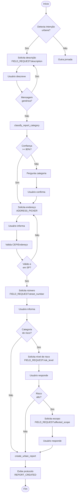

### 3.2 Campos da Jornada

| Campo | Tipo | Obrigatório | Validação | Marcador |
|-------|------|-------------|-----------|----------|
| `description` | string | ✅ | >= 30 chars | `[FIELD_REQUEST:description]` |
| `category` | enum | ✅ | Categoria válida | - |
| `street` | string | ✅ | Não vazio | `[ADDRESS_PICKER]` |
| `neighborhood` | string | ✅ | Bairro de SP | - |
| `street_number` | string | ⚠️ | - | `[FIELD_REQUEST:street_number]` |
| `cep` | string | ⚠️ | 8 dígitos | - |
| `reference_point` | string | ⚠️ | - | - |
| `risk_level` | enum | ⚠️* | low/moderate/critical | `[FIELD_REQUEST:risk_level]` |
| `affected_scope` | enum | ⚠️** | local/block/region | `[FIELD_REQUEST:affected_scope]` |
| `affected_estimate` | number | ❌ | > 0 | - |
| `photos` | string[] | ❌ | URLs válidas | - |

> ⚠️* Obrigatório para: `via_publica`, `iluminacao`, `esgoto`, `area_verde`
> ⚠️** Obrigatório se `risk_level` = `moderate` ou `critical`

### 3.3 Exemplo de Conversa: Fluxo Completo com Risco

```
👤 Cidadão: Quero relatar um problema na cidade
🤖 Assistente: O que está acontecendo?

👤 Cidadão: A rua está alagando toda vez que chove
🤖 [Tool: classify_report_category] → category: "esgoto", confidence: 0.88
🤖 Assistente: Entendi, um problema de alagamento/esgoto. 
   Qual o endereço? [ADDRESS_PICKER]

👤 Cidadão: 05510-000
🤖 [Tool: validate_cep] → Rua Cardeal Arcoverde, Pinheiros
🤖 Assistente: Rua Cardeal Arcoverde, Pinheiros. Qual o número ou ponto 
   de referência?

👤 Cidadão: Em frente ao número 2000
🤖 Assistente: Esse alagamento representa risco para moradores ou 
   pedestres?

👤 Cidadão: Sim, a água invade as casas e o trânsito para
🤖 Assistente: Quantas pessoas ou residências você estima que são 
   afetadas?

👤 Cidadão: Todo o quarteirão, umas 50 casas
🤖 [Tool: create_urban_report]
🤖 Assistente: ✅ Relato registrado!

   📋 **Protocolo:** URB-2026-000789
   📍 **Local:** Rua Cardeal Arcoverde, 2000 - Pinheiros
   🏷️ **Categoria:** Alagamento/Esgoto
   ⚠️ **Prioridade:** CRÍTICA
   👥 **Afetados:** ~50 residências (quarteirão)
   
   Devido à gravidade, seu relato receberá análise prioritária.
   [REPORT_CREATED:xyz789]
```

### 3.4 Exemplo de Conversa: Fluxo Simples (sem risco)

```
👤 Cidadão: Tem muito lixo acumulado na praça do bairro
🤖 [Tool: classify_report_category] → category: "lixo", confidence: 0.95
🤖 Assistente: Entendi, lixo acumulado em uma praça. 
   Qual praça e bairro? [ADDRESS_PICKER]

👤 Cidadão: Praça da República, centro
🤖 Assistente: Praça da República, Centro. Há algum ponto de referência 
   específico onde o lixo está acumulado?

👤 Cidadão: Perto do coreto
🤖 [Tool: create_urban_report]
🤖 Assistente: ✅ Relato registrado!

   📋 **Protocolo:** URB-2026-000790
   📍 **Local:** Praça da República (próximo ao coreto) - Centro
   🏷️ **Categoria:** Lixo Acumulado
   
   Obrigado pela contribuição! [REPORT_CREATED:abc790]
```

### 3.5 Exemplo: Fallback para Categoria "Outro"

```
👤 Cidadão: Tem um problema muito estranho na minha rua
🤖 Assistente: Pode me contar mais detalhes?

👤 Cidadão: Apareceu um buraco muito profundo que parece ser uma mina 
   antiga ou algo do tipo
🤖 [Tool: classify_report_category] → category: null, confidence: 0.45
   → Fallback: category: "outro", subcategory_label: "Buraco profundo - 
   possível estrutura antiga"
🤖 Assistente: Entendi, um problema incomum envolvendo um buraco profundo. 
   Vou registrar para análise especializada. Qual o endereço?
   [ADDRESS_PICKER]

[... fluxo continua ...]
```

---

## 4. Jornada: Diagnóstico de Transporte

### 4.1 Diagrama de Fluxo

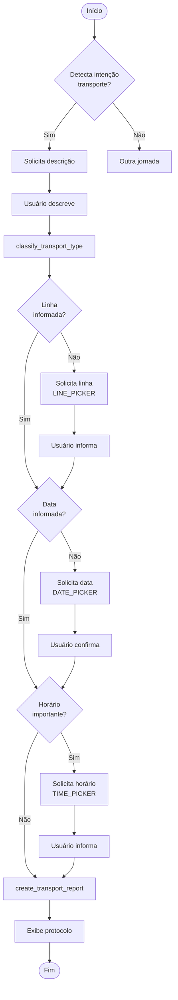

### 4.2 Campos da Jornada

| Campo | Tipo | Obrigatório | Validação |
|-------|------|-------------|-----------|
| `report_type` | enum | ✅ | Tipo válido |
| `description` | string | ✅ | >= 15 chars + keyword OU >= 20 chars |
| `occurrence_date` | date | ✅ | <= hoje, >= hoje - 30 dias |
| `date_confirmed` | boolean | ✅ | true |
| `line_id` | string | ⚠️ | ID válido no banco |
| `line_code_custom` | string | ⚠️ | Código informado |
| `occurrence_time` | time | ❌ | HH:MM |
| `location` | string | ❌ | Não vazio |
| `severity` | enum | ❌ | low/medium/high |
| `impact_description` | string | ❌ | - |

### 4.3 Exemplo de Conversa: Fluxo Completo

```
👤 Cidadão: O metrô linha verde tá sempre lotado
🤖 [Tool: classify_transport_type] → report_type: "lotacao", confidence: 0.92
🤖 Assistente: Entendi, superlotação na Linha 2-Verde. 
   Quando isso aconteceu? [DATE_PICKER]

👤 Cidadão: Hoje de manhã
🤖 Assistente: Por volta de que horas?

👤 Cidadão: 8h
🤖 Assistente: Em qual estação você embarcou?

👤 Cidadão: Consolação
🤖 [Tool: create_transport_report]
🤖 Assistente: ✅ Relato registrado!

   📋 **Protocolo:** TRP-2026-000321
   🚇 **Linha:** 2-Verde (Metrô)
   📅 **Data:** Hoje, 08:00
   📍 **Estação:** Consolação
   🏷️ **Tipo:** Superlotação
   
   Seu relato ajuda a monitorar a qualidade do transporte!
   [REPORT_CREATED:trp321]
```

### 4.4 Exemplo: Inferência de Data "Hoje"/"Ontem"

```
👤 Cidadão: O ônibus da linha 917H não passou ontem
🤖 [Tool: classify_transport_type] 
   → report_type: "atraso", 
   → extracted_date: "2026-01-11",  // ontem
   → date_confirmed: true
🤖 Assistente: Entendi, a linha 917H não passou ontem (11/01). 
   Você esperou em qual parada?

👤 Cidadão: Av. Paulista, em frente ao MASP
🤖 [Tool: create_transport_report]
🤖 Assistente: ✅ Relato registrado!

   📋 **Protocolo:** TRP-2026-000322
   🚌 **Linha:** 917H
   📅 **Data:** 11/01/2026
   📍 **Local:** Av. Paulista (MASP)
   🏷️ **Tipo:** Veículo não passou
   
   [REPORT_CREATED:trp322]
```

### 4.5 Exemplo: Problema de Segurança (Prioridade Alta)

```
👤 Cidadão: Sofri assédio no trem da CPTM linha 7
🤖 [Tool: classify_transport_type] 
   → report_type: "seguranca",
   → severity: "high" (automático)
🤖 Assistente: Sinto muito que isso tenha acontecido. 
   Quando foi isso? [DATE_PICKER]

👤 Cidadão: Hoje à tarde
🤖 Assistente: Por volta de que horas?

👤 Cidadão: Umas 17h
🤖 Assistente: Em qual estação você estava?

👤 Cidadão: Entre Francisco Morato e Caieiras
🤖 [Tool: create_transport_report]
🤖 Assistente: ✅ Relato registrado com PRIORIDADE ALTA.

   📋 **Protocolo:** TRP-2026-000323
   🚆 **Linha:** 7-Rubi (CPTM)
   📅 **Data:** Hoje, 17:00
   📍 **Trecho:** Francisco Morato → Caieiras
   🏷️ **Tipo:** Problema de Segurança
   ⚠️ **Prioridade:** ALTA
   
   Seu relato será encaminhado para análise imediata.
   
   💡 **Importante:** Em situações de emergência, ligue 190 (Polícia)
   ou acione o botão de emergência do trem.
   [REPORT_CREATED:trp323]
```

---

## 5. Jornada: Avaliação de Serviço

### 5.1 Diagrama de Fluxo

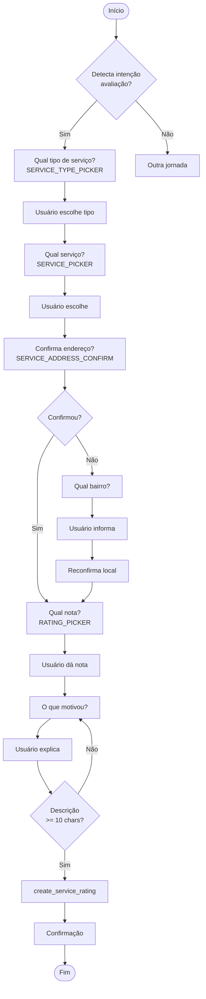

### 5.2 Campos da Jornada

| Campo | Tipo | Obrigatório | Validação |
|-------|------|-------------|-----------|
| `service_type` | enum | ✅ | Tipo válido |
| `service_id` | string | ✅ | ID no banco |
| `service_name` | string | ✅ | Não vazio |
| `service_address_confirmed` | boolean | ✅ | true |
| `service_neighborhood` | string | ⚠️* | Bairro SP |
| `rating_stars` | 1-5 | ✅ | Inteiro 1-5 |
| `rating_text` | string | ✅ | >= 10 chars |
| `visit_id` | string | ⚠️ | Se visita pendente |
| `is_anonymous` | boolean | ❌ | - |

> ⚠️* Obrigatório se `service_address_confirmed` = false

### 5.3 Exemplo de Conversa: Fluxo Completo

```
👤 Cidadão: Quero dar uma nota para uma escola
🤖 Assistente: Qual tipo de escola? [SERVICE_TYPE_PICKER]
   - Escola Municipal
   - CEU
   - Creche
   - Biblioteca

👤 Cidadão: CEU
🤖 Assistente: Qual CEU você visitou? [SERVICE_PICKER]

👤 Cidadão: CEU Butantã
🤖 Assistente: CEU Butantã, Av. Engenheiro Heitor Antônio Eiras Garcia, 1870.
   É esse o local? [SERVICE_ADDRESS_CONFIRM]
   ✅ Sim, correto | ❌ Não, outro local

👤 Cidadão: Sim, correto
🤖 Assistente: De 1 a 5 estrelas, qual nota você dá ao CEU Butantã?
   [RATING_PICKER]
   ⭐ | ⭐⭐ | ⭐⭐⭐ | ⭐⭐⭐⭐ | ⭐⭐⭐⭐⭐

👤 Cidadão: 5 estrelas
🤖 Assistente: Excelente! O que motivou essa nota?

👤 Cidadão: Ótima estrutura, muitas atividades culturais e professores 
   dedicados
🤖 [Tool: create_service_rating]
🤖 Assistente: ✅ Avaliação registrada!

   🏫 **Serviço:** CEU Butantã
   ⭐ **Nota:** 5/5 estrelas
   
   Sua avaliação ajuda outros cidadãos e contribui para a melhoria
   contínua dos serviços públicos. Obrigado!
```

### 5.4 Exemplo: Endereço Não Confirmado

```
👤 Cidadão: Quero avaliar a UBS que fui
🤖 Assistente: Qual UBS você visitou? [SERVICE_PICKER]

👤 Cidadão: UBS perto da minha casa
🤖 Assistente: Encontrei algumas UBS próximas a você:
   1. UBS Vila Madalena
   2. UBS Pinheiros
   3. UBS Sumaré
   Qual delas?

👤 Cidadão: UBS Vila Madalena
🤖 Assistente: UBS Vila Madalena, Rua Harmonia, 592.
   É esse o local? [SERVICE_ADDRESS_CONFIRM]

👤 Cidadão: Não, é outra
🤖 Assistente: Em qual bairro fica a UBS que você visitou?

👤 Cidadão: Fica no Butantã
🤖 Assistente: Encontrei a UBS Butantã, Rua Waldemar Ferreira, 235.
   É essa? [SERVICE_ADDRESS_CONFIRM]

👤 Cidadão: Sim
🤖 Assistente: De 1 a 5, qual nota você dá? [RATING_PICKER]

[... fluxo continua ...]
```

### 5.5 Exemplo: Avaliação Negativa (1-2 estrelas)

```
👤 Cidadão: Preciso avaliar o hospital que fui
🤖 Assistente: Qual hospital? [SERVICE_PICKER]

👤 Cidadão: Hospital Municipal Dr. Cármino Caricchio
🤖 Assistente: Hospital do Tatuapé, Av. Celso Garcia, 4815.
   Correto? [SERVICE_ADDRESS_CONFIRM]

👤 Cidadão: Sim
🤖 Assistente: De 1 a 5 estrelas, qual nota? [RATING_PICKER]

👤 Cidadão: 1 estrela
🤖 Assistente: Sinto muito pela experiência ruim. 
   O que aconteceu?

👤 Cidadão: Esperei 8 horas para ser atendido e o médico foi grosseiro
🤖 [Tool: create_service_rating]
🤖 Assistente: ✅ Avaliação registrada.

   🏥 **Serviço:** Hospital Municipal Dr. Cármino Caricchio
   ⭐ **Nota:** 1/5
   
   Lamentamos sua experiência. Sua avaliação é importante para
   identificar problemas e cobrar melhorias.
   
   💡 Deseja encaminhar seu relato para um vereador da Comissão 
   de Saúde? [SUGGESTION_PROMPT]
```

---

## 6. Jornadas Leves

Jornadas leves são fluxos informativos que não requerem coleta estruturada de dados.

### 6.1 Busca de Serviços Próximos

```
👤 Cidadão: Onde tem um posto de saúde perto de mim?
🤖 [Tool: find_nearby_services]
🤖 Assistente: Encontrei 3 unidades de saúde próximas:

   1. 🏥 **UBS Vila Mariana** - 500m
      Rua Domingos de Morais, 2564
      ⭐ 4.2 (127 avaliações)
      ⏰ Seg-Sex: 7h-19h
   
   2. 🏥 **AMA Saúde** - 1.1km
      Rua Loefgren, 1654
      ⭐ 3.9 (89 avaliações)
   
   3. 🏥 **UPA Vila Mariana** - 2.0km
      Rua Vergueiro, 8155
      ⭐ 3.5 (203 avaliações)
      ⏰ 24 horas
   
   Quer ver rotas ou mais detalhes?
```

### 6.2 Audiências Públicas

```
👤 Cidadão: Quais audiências vão ter essa semana?
🤖 [Tool: search_audiencias]
🤖 Assistente: Esta semana na Câmara:

   📅 **Terça, 14/01 - 10h**
   🎯 Orçamento Municipal 2026
   📍 Plenário 1º de Maio
   👥 Vagas: 45 disponíveis
   [Inscrever-se]
   
   📅 **Quinta, 16/01 - 14h**
   🎯 Mobilidade Urbana na Zona Sul
   📍 Plenário Paulo Kobayashi
   👥 Vagas: 30 disponíveis
   [Inscrever-se]
   
   📅 **Sexta, 17/01 - 9h** (Online)
   🎯 Política de Habitação Popular
   🔗 Transmissão pelo YouTube
   [Lembrete]
   
   Quer se inscrever em alguma?
```

### 6.3 Histórico de Contribuições

```
👤 Cidadão: Quero ver meus relatos
🤖 [Tool: get_citizen_history]
🤖 Assistente: Suas contribuições recentes:

   📋 **URB-2026-000123** - Buraco na via
   📍 Rua Augusta, 500 - Consolação
   📅 12/01/2026
   🔄 Status: Em análise
   
   📋 **TRP-2026-000321** - Lotação metrô
   🚇 Linha 2-Verde
   📅 10/01/2026
   ✅ Status: Concluído
   
   ⭐ **Avaliação** - UBS Vila Mariana
   📅 05/01/2026
   Nota: 4/5
   
   Total: 15 contribuições | 8 resolvidas
   
   Quer detalhes de algum relato específico?
```

### 6.4 Dúvidas Gerais (RAG)

```
👤 Cidadão: Como funciona uma CPI?
🤖 [Tool: search_knowledge_base]
🤖 Assistente: Uma **CPI (Comissão Parlamentar de Inquérito)** é uma 
   investigação conduzida por vereadores para apurar irregularidades:

   📌 **Como é criada:**
   Precisa de 1/3 dos vereadores (19 assinaturas) ou requerimento
   do público com 10.000 assinaturas.

   📌 **Poderes:**
   - Convocar testemunhas
   - Requisitar documentos
   - Realizar diligências

   📌 **Prazo:**
   Máximo de 120 dias, prorrogável uma vez.

   📌 **Resultado:**
   Relatório final encaminhado ao Ministério Público se houver
   indícios de crime.

   Fonte: Lei Orgânica do Município, Art. 48.
   
   Quer saber mais sobre algum aspecto?
```

### 6.5 Informações sobre Vereadores

```
👤 Cidadão: Quem é o vereador da minha região?
🤖 [Tool: suggest_council_member]
🤖 Assistente: Baseado na sua localização (Vila Mariana), estes 
   vereadores têm atuação na sua região:

   👤 **Vereador A** (PARTIDO-A)
   📊 Comissões: Saúde, Urbanismo
   📍 Base: Zona Sul
   📱 Gabinete: (11) 3396-XXXX
   
   👤 **Vereadora B** (PARTIDO-B)
   📊 Comissões: Educação, Mobilidade
   📍 Base: Vila Mariana
   📱 Gabinete: (11) 3396-YYYY
   
   Quer mais detalhes sobre algum deles?
```

### 6.6 Feedback para Câmara

```
👤 Cidadão: Quero dar uma sugestão para a Câmara
🤖 Assistente: Ótimo! Qual é sua sugestão?

👤 Cidadão: Deveria ter mais audiências públicas online para quem 
   trabalha não poder ir presencialmente
🤖 Assistente: Excelente sugestão! Vou registrar:

   💡 **Tipo:** Sugestão de Melhoria
   📝 **Tema:** Acessibilidade às Audiências Públicas
   📄 **Descrição:** Ampliar oferta de audiências online para
   aumentar participação de trabalhadores
   
   Deseja adicionar mais algum detalhe?

👤 Cidadão: Não, está bom
🤖 [Tool: create_chamber_feedback]
🤖 Assistente: ✅ Sugestão registrada!
   
   Sua contribuição será encaminhada para a Comissão de 
   Participação Popular.
   
   Obrigado por ajudar a melhorar a Câmara! 🙌
```

---

## 7. Guardrails e Regras de Ouro

### 7.1 Regras Fundamentais

| Código | Regra | Descrição | Exemplo |
|--------|-------|-----------|---------|
| **RN-IA-001** | NUNCA BLOQUEAR O FLUXO | Se não conseguir classificar, usar "outro" + label | Descrição confusa → `category: "outro", label: "Problema não especificado"` |
| **RN-IA-002** | Threshold de Confiança 80% | Auto-classificar apenas se >= 80% | 0.75 → Perguntar; 0.85 → Auto |
| **RN-IA-003** | Descrição Flexível | 30 chars OU 15 chars + keyword | "buraco grande" (12) + "rua" = OK |
| **RN-IA-004** | Filtrar Mensagens Genéricas | "Quero relatar" NÃO é descrição | Ignorar e pedir detalhes |
| **RN-IA-005** | Confirmar Data Transporte | "hoje"/"ontem" marca `date_confirmed: true` | Extrair e confirmar |
| **RN-IA-006** | Transição de Jornadas | < 2 campos: auto; >= 2: confirmar | Preservar dados se possível |
| **RN-IA-007** | Filosofia "Nunca Negativa" | Sempre oferecer alternativa | Não encontrou → Buscar mais longe |
| **RN-IA-008** | Reset ao Trocar Jornada | Limpar campos acumulados | Evitar contaminação de dados |
| **RN-IA-009** | Perguntas Atômicas | Máximo 1 pergunta por resposta | NUNCA perguntar 2 coisas |
| **RN-IA-010** | Respostas Concisas | Máximo 2 frases durante coleta | Ir direto ao ponto |

### 7.2 Regras de Coleta de Dados

| Código | Regra | Validação |
|--------|-------|-----------|
| **RN-COL-001** | Descrição mínima | >= 30 chars (urbano) ou >= 20 chars (transporte) |
| **RN-COL-002** | Endereço obrigatório | Rua + Bairro (urbano) |
| **RN-COL-003** | Data obrigatória | Data + confirmação (transporte) |
| **RN-COL-004** | Nota obrigatória | 1-5 estrelas (avaliação) |
| **RN-COL-005** | Validar CEP | 8 dígitos, cidade = São Paulo |
| **RN-COL-006** | Validar coordenadas | Dentro de SP capital |
| **RN-COL-007** | Campos condicionais | Risco → Escopo se alto |

### 7.3 Regras de Comunicação

| Código | Regra | Exemplo Correto | Exemplo Incorreto |
|--------|-------|-----------------|-------------------|
| **RN-COM-001** | Linguagem simples | "Onde fica o problema?" | "Informe as coordenadas geográficas" |
| **RN-COM-002** | Tom empático | "Sinto muito que isso tenha acontecido" | "Relatando ocorrência..." |
| **RN-COM-003** | Sem jargões | "Seu relato foi registrado" | "Instância criada no banco" |
| **RN-COM-004** | Confirmar entendimento | "Entendi, um buraco na via" | "Processando..." |
| **RN-COM-005** | Oferecer ajuda | "Posso ajudar com mais alguma coisa?" | Silêncio |
| **RN-COM-006** | Indicar fonte | "Segundo a agenda da Câmara..." | Afirmar sem fonte |

---

## 8. Proibições Explícitas

### 8.1 Proibições de Comportamento

```
❌ PROIBIDO: Fazer mais de uma pergunta por mensagem
   Errado: "Qual o endereço? E em que horário aconteceu?"
   Correto: "Qual o endereço?"

❌ PROIBIDO: Usar linguagem técnica com o cidadão
   Errado: "Informe o payload de geolocalização"
   Correto: "Qual o endereço do problema?"

❌ PROIBIDO: Bloquear fluxo por falha de classificação
   Errado: "Não consegui entender. Tente novamente."
   Correto: "Vou registrar para análise especializada."

❌ PROIBIDO: Aceitar mensagens genéricas como descrição
   Errado: Aceitar "quero relatar um problema" como descrição
   Correto: "O que está acontecendo exatamente?"

❌ PROIBIDO: Criar relato sem confirmação de endereço
   Errado: Criar sem validar CEP/endereço
   Correto: Sempre confirmar com o usuário

❌ PROIBIDO: Aceitar nota 0 ou > 5 em avaliações
   Errado: Aceitar rating_stars: 0 ou 6
   Correto: Validar 1-5 apenas

❌ PROIBIDO: Trocar jornada sem confirmar se >= 2 campos
   Errado: Trocar silenciosamente perdendo dados
   Correto: "Você já informou alguns dados. Deseja continuar ou mudar?"

❌ PROIBIDO: Repetir a mesma pergunta mais de 3 vezes
   Errado: Perguntar endereço 4x
   Correto: Após 3x, registrar com dados disponíveis ou escalar

❌ PROIBIDO: Responder sem indicar fonte da informação
   Errado: "Os vereadores ganham X" (sem fonte)
   Correto: "Segundo a Lei X, Art. Y..."

❌ PROIBIDO: Atender localizações fora de São Paulo capital
   Errado: Registrar relato em Santos
   Correto: "No momento, atendo apenas São Paulo capital."

❌ PROIBIDO: Permitir mais de 10 relatos/dia por usuário
   Errado: Permitir 15 relatos no mesmo dia
   Correto: "Você atingiu o limite diário. Tente amanhã!"

❌ PROIBIDO: Mencionar termos técnicos internos
   Errado: "Acionando tool create_urban_report..."
   Correto: "Registrando seu relato..."
```

### 8.2 Proibições de Dados

```
❌ PROIBIDO: Armazenar dados pessoais sensíveis na descrição
   - CPF, RG, dados bancários
   - Endereço residencial completo do usuário
   - Informações de saúde identificáveis

❌ PROIBIDO: Expor dados de outros cidadãos
   - Nomes de reclamantes anteriores
   - Dados de localização de terceiros

❌ PROIBIDO: Fabricar informações
   - Inventar estatísticas
   - Criar protocolos falsos
   - Simular respostas de vereadores

❌ PROIBIDO: Alterar relatos já criados
   - Modificar descrição após criação
   - Mudar categoria retroativamente
```

### 8.3 Proibições de Sistema

```
❌ PROIBIDO: Chamar ferramentas de criação sem dados mínimos
   - create_urban_report sem category
   - create_transport_report sem occurrence_date
   - create_service_rating sem rating_stars

❌ PROIBIDO: Ignorar marcadores do frontend
   - [JOURNEY_DECLINED] deve cancelar troca
   - [ADDRESS_SELECTED] deve usar endereço

❌ PROIBIDO: Emitir marcadores inválidos
   - Formato incorreto
   - Dados malformados
   - JSON inválido em [COLLECTION_PROGRESS]

❌ PROIBIDO: Processar mensagens fora do contexto
   - Ignorar histórico de conversa
   - Não considerar jornada ativa
```

---

## 9. Cenários de Borda

### 9.1 Conflito de Classificação (Urbano vs Transporte)

**Cenário**: Usuário descreve problema que pode ser urbano ou transporte.

```
👤 Cidadão: O ponto de ônibus está sem cobertura e quando chove alaga
```

**Resolução**:
1. Detectar ambiguidade (keywords de ambas jornadas)
2. Perguntar ao usuário qual aspecto quer priorizar
3. Registrar na jornada escolhida com menção ao outro aspecto

```
🤖 Assistente: Entendi que há um problema no ponto de ônibus. 
   Você quer relatar:
   
   1. 🚌 **Problema no ponto** (infraestrutura de transporte)
   2. 🌧️ **Alagamento na via** (problema urbano)
   
   Qual deles é mais urgente para você?
```

### 9.2 Timeout de Sessão

**Cenário**: Usuário abandona conversa e retorna após 30 minutos.

**Resolução**:
1. Detectar gap temporal > 30 min entre mensagens
2. Verificar campos já coletados
3. Oferecer continuar ou recomeçar

```
🤖 Assistente: Oi de novo! 👋 
   
   Você estava relatando um problema de iluminação na Rua Augusta.
   
   Quer continuar de onde paramos ou começar um novo relato?
   
   ▶️ Continuar | 🔄 Novo relato
```

### 9.3 Limite de Tentativas

**Cenário**: Usuário não consegue informar endereço válido após 3 tentativas.

**Resolução**:
1. Após 3 tentativas, oferecer alternativas
2. Permitir descrição textual livre
3. Marcar para revisão administrativa

```
🤖 Assistente: Estou com dificuldade para localizar o endereço. 
   
   Você pode descrever o local de outra forma?
   Por exemplo: "Perto do Shopping X" ou "Ao lado da Escola Y"

👤 Cidadão: Fica perto do Mercadão da Lapa

🤖 [Registra como reference_point, marca para geocodificação manual]
```

### 9.4 Detecção de Duplicatas

**Cenário**: Usuário tenta criar relato idêntico ao anterior.

**Resolução**:
1. Verificar relatos do usuário nas últimas 24h
2. Comparar: mesmo bairro + categoria similar
3. Alertar e oferecer alternativas

```
🤖 Assistente: Percebi que você já relatou um problema parecido 
   há 2 horas:
   
   📋 URB-2026-000123 - Buraco na via
   📍 Rua Augusta, Consolação
   🔄 Status: Em análise
   
   Quer:
   1. ➕ Adicionar informação ao relato existente
   2. 📝 Criar um novo relato (problema diferente)
   3. 📊 Ver status do relato anterior
```

### 9.5 Localização Fora de São Paulo

**Cenário**: Usuário informa endereço de outra cidade.

```
👤 Cidadão: Rua XV de Novembro, 100, Santos

🤖 [Tool: validate_cep ou geocodificação]
   → city: "Santos" ≠ "São Paulo"

🤖 Assistente: Este endereço fica em Santos. 
   
   No momento, o Câmara na Mão atende apenas São Paulo capital. 
   
   Para problemas em Santos, recomendo o canal de ouvidoria 
   da Prefeitura de Santos: 📞 156
   
   Posso ajudar com algo em São Paulo?
```

### 9.6 Mensagem Muito Longa

**Cenário**: Usuário envia texto com > 5000 caracteres.

```
👤 Cidadão: [texto de 6000 caracteres descrevendo problema]

🤖 [Trunca para 5000 chars, preserva início]
🤖 [Extrai informações principais via classificação]

🤖 Assistente: Obrigado pelo relato detalhado! Identifiquei que você 
   está relatando um problema de [categoria].
   
   Para registrar, preciso confirmar o endereço: onde exatamente 
   fica o problema?
```

### 9.7 Usuário Agressivo ou Frustrado

**Cenário**: Usuário expressa frustração ou usa linguagem agressiva.

```
👤 Cidadão: VOCÊS NÃO RESOLVEM NADA! Já reclamei 10 vezes desse 
   buraco e continua lá!

🤖 Assistente: Entendo sua frustração e lamento que o problema 
   ainda persista. 
   
   Deixa eu verificar suas contribuições anteriores...
   
   [Tool: get_citizen_history]
   
   Vi que você tem 3 relatos sobre buracos na Rua Augusta:
   - URB-2025-001234 (há 45 dias) - Concluído
   - URB-2025-002345 (há 30 dias) - Em análise
   - URB-2026-000123 (há 5 dias) - Em análise
   
   Quer que eu encaminhe diretamente para um vereador da 
   Comissão de Urbanismo? Isso pode acelerar a resolução.
```

### 9.8 Problema Fora do Escopo

**Cenário**: Usuário relata problema que não é competência municipal.

```
👤 Cidadão: Quero denunciar uma empresa que está poluindo o rio Tietê

🤖 Assistente: Questões de poluição de rios são fiscalizadas pela 
   CETESB (órgão estadual).
   
   📞 **CETESB - Denúncia Ambiental:** 0800-113560
   🌐 **Site:** cetesb.sp.gov.br
   
   Porém, se quiser, posso registrar seu relato como **feedback 
   para a Câmara**. Assim, vereadores podem cobrar ações do 
   Governo Estadual.
   
   Deseja registrar?
```

---

## 10. Limites e Rate Limiting

### 10.1 Limites por Recurso

| Recurso | Limite | Período | Comportamento |
|---------|--------|---------|---------------|
| Mensagens ao chat | 60 | por minuto | Throttling com aviso |
| Criação de relatos urbanos | 10 | por dia | Bloqueio + mensagem |
| Criação de relatos transporte | 10 | por dia | Bloqueio + mensagem |
| Avaliações de serviço | 20 | por dia | Bloqueio + mensagem |
| Encaminhamentos a vereadores | 5 | por dia | Bloqueio + mensagem |
| Buscas na base de conhecimento | 30 | por hora | Cache de resultados |
| Uploads de foto | 5 | por relato | Máximo atingido |
| Tamanho de mensagem | 5000 | caracteres | Truncamento |

### 10.2 Mensagens de Limite

```
// Limite de relatos diários
🤖 Assistente: Você atingiu o limite de 10 relatos por dia. 
   
   Isso ajuda a manter a qualidade das informações no sistema.
   
   ⏰ Você poderá criar novos relatos amanhã a partir das 00:00.
   
   Enquanto isso, você pode:
   - 📊 Acompanhar seus relatos existentes
   - 🔍 Buscar serviços próximos
   - 📅 Ver audiências públicas

// Limite de mensagens por minuto
🤖 Assistente: Aguarde um momento! Você está enviando muitas 
   mensagens rapidamente.
   
   ⏳ Tente novamente em alguns segundos.

// Limite de encaminhamentos
🤖 Assistente: Você já fez 5 encaminhamentos hoje.
   
   Para garantir que os gabinetes consigam responder a todos,
   limitamos a 5 encaminhamentos por dia.
   
   Amanhã você poderá fazer novos encaminhamentos.
```

### 10.3 Limites de Sistema

| Parâmetro | Valor | Justificativa |
|-----------|-------|---------------|
| Histórico de conversa | 50 mensagens | Performance de contexto |
| Timeout de requisição | 30 segundos | UX responsiva |
| Tamanho de foto | 5 MB | Storage e upload |
| Fotos por relato | 5 | Relevância |
| Sessão ativa | 30 minutos | Segurança |
| Conversas simultâneas | 1 | Consistência de estado |

---

## 11. Motor Determinístico

### 11.1 Função accumulateFieldsFromHistory

O motor determinístico é responsável por extrair e acumular campos das mensagens do histórico, garantindo que dados já informados não sejam solicitados novamente.

**Localização**: `supabase/functions/ai-orchestrator/index.ts`

```typescript
function accumulateFieldsFromHistory(
  messages: Message[],
  journeyType: 'urban_report' | 'transport_report' | 'service_rating' | null
): AccumulatedFields {
  const fields: AccumulatedFields = {};
  
  for (const message of messages) {
    // 1. Detectar troca de jornada e resetar
    if (message.content.includes('[JOURNEY_SWITCHED]')) {
      Object.keys(fields).forEach(key => delete fields[key]);
      continue;
    }
    
    // 2. Extrair dados de pickers (alta prioridade)
    extractPickerData(message, fields);
    
    // 3. Extrair dados de linguagem natural
    extractNaturalLanguageData(message, fields, journeyType);
    
    // 4. Processar marcadores de progresso
    if (message.content.includes('[COLLECTION_PROGRESS')) {
      parseCollectionProgress(message, fields);
    }
  }
  
  return fields;
}
```

### 11.2 Regras de Extração

#### Extração de Pickers (Prioridade Alta)

| Padrão | Campo | Exemplo |
|--------|-------|---------|
| `Endereço selecionado: X` | `street`, `neighborhood` | "Rua Augusta, Consolação" |
| `CEP: XXXXX-XXX` | `cep` | "01310-100" |
| `Número: X` | `street_number` | "500" |
| `Linha: X` | `line_code` | "875A-10" |
| `Data: DD/MM/YYYY` | `occurrence_date` | "12/01/2026" |
| `Horário: HH:MM` | `occurrence_time` | "08:30" |
| `Tipo de serviço: X` | `service_type` | "UBS" |
| `Serviço: X` | `service_name`, `service_id` | "UBS Vila Mariana" |
| `Nota: X estrelas` | `rating_stars` | "4" |

#### Extração de Linguagem Natural

| Padrão | Campo | Validação |
|--------|-------|-----------|
| Texto com >= 30 chars | `description` | Não genérico |
| CEP (8 dígitos) | `cep` | Formato válido |
| "hoje"/"ontem" | `occurrence_date` | + `date_confirmed` |
| Horário (HH:MM) | `occurrence_time` | 00:00-23:59 |
| "sim"/"correto" após confirmar | Flag de confirmação | Contexto de pergunta |

### 11.3 Filtro de Mensagens Genéricas

```typescript
function isGenericIntentText(text: string): boolean {
  const genericPatterns = [
    /^(quero|preciso|gostaria de) (relatar|reportar|informar|avaliar)/i,
    /^sim$/i,
    /^ok$/i,
    /^pode ser$/i,
    /^isso( mesmo)?$/i,
    /^certo$/i,
  ];
  
  // Mensagens curtas demais
  if (text.length < 8) return true;
  
  // Padrões genéricos
  return genericPatterns.some(p => p.test(text.trim()));
}
```

### 11.4 Reset de Campos

O reset ocorre quando:
1. Marcador `[JOURNEY_SWITCHED]` é detectado
2. Usuário confirma troca de jornada
3. Timeout de 30 minutos sem atividade

```typescript
// Exemplo de reset
if (message.content.includes('[JOURNEY_SWITCHED')) {
  const match = message.content.match(/\[JOURNEY_SWITCHED:(\w+)\]/);
  if (match) {
    console.log(`Journey switched to: ${match[1]}, resetting fields`);
    Object.keys(accumulatedFields).forEach(key => {
      delete accumulatedFields[key];
    });
  }
}
```

---

## 12. Categorias Urbanas

### 12.1 Tabela de Categorias

| Código | Label | Keywords (weight 9) | Requer Risco |
|--------|-------|---------------------|--------------|
| `via_publica` | Via Pública | buraco, asfalto, cratera, semáforo, sinalização | ✅ |
| `iluminacao` | Iluminação | poste, luz, lâmpada, escuro, apagado | ✅ |
| `esgoto` | Esgoto/Alagamento | alagamento, bueiro, vazamento, esgoto, enchente | ✅ |
| `area_verde` | Área Verde | praça, árvore, mato, poda, parque, jardim | ✅ |
| `lixo` | Lixo/Entulho | lixo, entulho, coleta, resíduo, descarte | ❌ |
| `calcada` | Calçada | calçada, passeio, piso, rampa, acessibilidade | ❌ |
| `poluicao` | Poluição/Ruído | barulho, som, música, festa, poluição, fumaça | ❌ |
| `animais` | Animais | rato, pombo, cachorro, animal, bicho | ❌ |
| `transito` | Trânsito | congestionamento, trânsito, acidente | ❌ |
| `outro` | Outro | [fallback] | ❌ |
| `feedback_camara` | Feedback Câmara | sugestão, reclamação, elogio, câmara | ❌ |

### 12.2 Pesos de Classificação

```typescript
const CATEGORY_WEIGHTS: Record<string, CategoryConfig> = {
  poluicao: {
    keywords: [
      { term: 'som alto', weight: 9 },
      { term: 'barulho', weight: 9 },
      { term: 'festa', weight: 9 },
      { term: 'música', weight: 8 },
      { term: 'ruído', weight: 8 },
    ],
    default_label: 'Perturbação Sonora'
  },
  via_publica: {
    keywords: [
      { term: 'buraco', weight: 9 },
      { term: 'cratera', weight: 9 },
      { term: 'asfalto', weight: 8 },
      { term: 'semáforo', weight: 8 },
    ],
    default_label: 'Problema na Via'
  },
  // ... outras categorias
};
```

### 12.3 Geração de Label para "Outro"

Quando a categoria é `outro`, o sistema gera um `subcategory_label` intuitivo:

```typescript
function generateSubcategoryLabel(description: string): string {
  // Extrai as primeiras 5 palavras significativas
  const words = description
    .toLowerCase()
    .replace(/[^\w\sáéíóúâêô]/g, '')
    .split(/\s+/)
    .filter(w => w.length > 3)
    .slice(0, 5);
  
  // Capitaliza e junta
  return words
    .map(w => w.charAt(0).toUpperCase() + w.slice(1))
    .join(' ');
}

// Exemplo:
// Input: "apareceu uma estrutura estranha no terreno"
// Output: "Estrutura Estranha Terreno"
```

---

## 13. Tipos de Transporte

### 13.1 Tabela de Tipos

| Código | Label | Keywords | Prioridade Base |
|--------|-------|----------|-----------------|
| `atraso` | Atraso de Veículo | atras*, demor*, esperando, não passou | Média |
| `lotacao` | Superlotação | lot*, cheio, superlot*, apertado | Média |
| `seguranca` | Segurança | assédio, roubo, briga, perigo, furto, violência | Alta |
| `acessibilidade` | Acessibilidade | elevador, rampa, cadeirante, deficiente, pcd | Alta |
| `limpeza` | Limpeza | sujo, fedido, nojento, lixo, imundo | Baixa |
| `conducao` | Condução | motorista, freada, imprudente, velocidade, rápido | Alta |
| `acidente` | Acidente | acidente, batida, colisão, capotou | Crítica |
| `outro` | Outro Problema | [fallback] | Média |

### 13.2 Modais Suportados

| Modal | Prefixos de Linha | Exemplo |
|-------|-------------------|---------|
| **Ônibus** | Numérico, letra-numérico | 875A-10, 917H, 5100 |
| **Metrô** | Linha 1-5 + cor | Linha 1-Azul, 4-Amarela |
| **CPTM** | Linha 7-13 + cor | Linha 7-Rubi, 9-Esmeralda |
| **VLT** | VLT + número | VLT 1 |
| **Monotrilho** | Linha 15 | Linha 15-Prata |

---

## 14. Marcadores de Sincronização

### 14.1 Tabela de Marcadores

| Marcador | Emissor | Direção | Função |
|----------|---------|---------|--------|
| `[FIELD_REQUEST:campo]` | Backend | → Frontend | Indica próximo campo a coletar |
| `[COLLECTION_PROGRESS:type:json]` | Backend | → Frontend | Estado completo da coleta |
| `[JOURNEY_SWITCH_PROMPT]` | Backend | → Frontend | Oferece troca de jornada |
| `[JOURNEY_SWITCHED:type]` | Frontend | → Backend | Confirma troca |
| `[JOURNEY_DECLINED:type]` | Frontend | → Backend | Recusa troca |
| `[LIGHT_JOURNEY:type]` | Backend | → Frontend | Indica jornada leve ativa |
| `[REPORT_CREATED:id]` | Backend | → Frontend | Confirma criação de relato |
| `[ADDRESS_PICKER]` | Backend | → Frontend | Ativa seletor de endereço |
| `[LINE_PICKER]` | Backend | → Frontend | Ativa seletor de linha |
| `[DATE_PICKER]` | Backend | → Frontend | Ativa seletor de data |
| `[TIME_PICKER]` | Backend | → Frontend | Ativa seletor de horário |
| `[RATING_PICKER]` | Backend | → Frontend | Ativa seletor de nota |
| `[SERVICE_TYPE_PICKER]` | Backend | → Frontend | Ativa seletor de tipo |
| `[SERVICE_PICKER]` | Backend | → Frontend | Ativa seletor de serviço |
| `[SERVICE_ADDRESS_CONFIRM]` | Backend | → Frontend | Ativa confirmação de endereço |

### 14.2 Formato do COLLECTION_PROGRESS

```json
[COLLECTION_PROGRESS:urban_report:{
  "category": "via_publica",
  "description": "Buraco enorme na rua",
  "street": "Rua Augusta",
  "neighborhood": "Consolação",
  "street_number": "500",
  "risk_level": null,
  "affected_scope": null,
  "_progress": 5,
  "_total": 7,
  "_missing": ["risk_level", "affected_scope"]
}]
```

### 14.3 Sanitização no Frontend

Os marcadores são removidos antes de exibir ao usuário:

```typescript
// src/lib/sanitizeMarkers.ts
export function sanitizeMessageContent(content: string): string {
  return content
    .replace(/\[FIELD_REQUEST:\w+\]/g, '')
    .replace(/\[COLLECTION_PROGRESS:[^\]]+\]/g, '')
    .replace(/\[JOURNEY_SWITCH_PROMPT\]/g, '')
    .replace(/\[JOURNEY_SWITCHED:\w+\]/g, '')
    .replace(/\[JOURNEY_DECLINED:\w+\]/g, '')
    .replace(/\[LIGHT_JOURNEY:\w+\]/g, '')
    .replace(/\[REPORT_CREATED:[^\]]+\]/g, '')
    .replace(/\[(ADDRESS|LINE|DATE|TIME|RATING|SERVICE_TYPE|SERVICE)_PICKER\]/g, '')
    .replace(/\[SERVICE_ADDRESS_CONFIRM\]/g, '')
    .trim();
}
```

---

## 15. Sistema de Priorização automacao

### 15.1 Visão Geral

O automacao (self-hosted) atua como motor de workflow para processamento inteligente de manifestações. Quando um relato é criado, o sistema automaticamente:

1. Envia dados para o automacao via webhook
2. automacao processa, classifica e prioriza
3. automacao retorna dados enriquecidos via callback
4. Sistema atualiza o relato com prioridade e tags

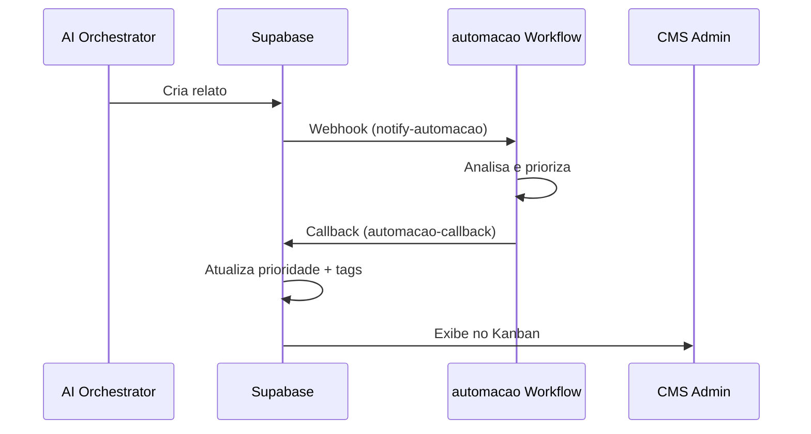

### 15.2 Payload de Entrada (notify-automacao)

```typescript
interface automacaoNotifyPayload {
  event_type: 'urban_report_created' | 'transport_report_created' | 'service_rating_created';
  report_id: string;
  report_type: 'urban' | 'transport' | 'service_rating';
  created_at: string;
  
  // Dados comuns
  description: string;
  category: string;
  subcategory?: string;
  subcategory_label?: string;
  severity?: string;
  
  // Localização (urbano)
  location?: {
    street: string;
    street_number?: string;
    neighborhood: string;
    cep?: string;
    latitude?: number;
    longitude?: number;
  };
  
  // Impacto (urbano com risco)
  impact?: {
    risk_level: 'low' | 'moderate' | 'critical';
    affected_scope: 'local' | 'block' | 'region';
    affected_estimate?: number;
    risk_types?: string[];
    active_consequences?: string[];
  };
  
  // Transporte
  transport?: {
    line_code: string;
    occurrence_date: string;
    occurrence_time?: string;
    modal: string;
  };
  
  // Avaliação
  rating?: {
    service_type: string;
    service_name: string;
    rating_stars: number;
    rating_text: string;
  };
  
  // Contexto do usuário
  user_context: {
    user_id: string;
    previous_reports_count: number;
    user_region?: string;
  };
  
  // Callback
  callback_url: string;
}
```

---

## 16. Matriz de Prioridade

### 16.1 Níveis de Prioridade

| Score | Prioridade | Cor | SLA | Ação Automática |
|-------|------------|-----|-----|-----------------|
| 80-100 | **CRÍTICA** | 🔴 Vermelho | 2 horas | Notificação imediata a gestores |
| 60-79 | **ALTA** | 🟠 Laranja | 24 horas | Destaque no Kanban |
| 40-59 | **MÉDIA** | 🟡 Amarelo | 72 horas | Processamento normal |
| 0-39 | **BAIXA** | 🟢 Verde | 7 dias | Processamento em lote |

### 16.2 Cálculo de Score

```
SCORE = (
  factor_risco * peso_risco +
  factor_escopo * peso_escopo +
  factor_keywords * peso_keywords +
  factor_tipo * peso_tipo +
  bonus_horario +
  bonus_reincidencia
)

// Normalizado para 0-100
SCORE = Math.min(100, Math.max(0, SCORE))
```

### 16.3 Thresholds de SLA

| Prioridade | Tempo para 1ª Resposta | Tempo para Resolução |
|------------|------------------------|----------------------|
| CRÍTICA | 1 hora | 24 horas |
| ALTA | 4 horas | 72 horas |
| MÉDIA | 24 horas | 7 dias |
| BAIXA | 72 horas | 30 dias |

---

## 17. Fatores de Pontuação

### 17.1 Fatores - Relato Urbano

| Fator | Peso Máximo | Cálculo |
|-------|-------------|---------|
| **Nível de Risco** | 40 pts | critical=40, moderate=25, low=10 |
| **Escopo de Afetação** | 25 pts | region=25, block=15, local=5 |
| **Pessoas Afetadas** | 15 pts | >100=15, 50-100=10, 10-50=5, <10=2 |
| **Keywords Críticas** | 20 pts | "criança"=10, "acidente"=8, "urgente"=5 |

**Exemplo de Cálculo:**
```
Descrição: "Buraco enorme causando acidentes, crianças passam por ali"
- risk_level: critical → 40 pts
- affected_scope: block → 15 pts
- affected_estimate: 50 → 5 pts
- keywords: "acidentes" + "crianças" → 18 pts

TOTAL = 40 + 15 + 5 + 18 = 78 → PRIORIDADE ALTA
```

### 17.2 Fatores - Relato de Transporte

| Fator | Peso Máximo | Cálculo |
|-------|-------------|---------|
| **Tipo de Problema** | 30 pts | seguranca=30, acidente=30, acessibilidade=25, conducao=20 |
| **Horário de Pico** | 15 pts | 7-9h ou 17-19h = 15 pts |
| **Linha de Alta Demanda** | 10 pts | Linhas prioritárias = 10 pts |
| **Keywords** | 20 pts | "assédio"=10, "acidente"=10, "travou"=5 |
| **Reincidência** | 15 pts | Mesma linha/problema em 7 dias |
| **Sentimento** | 10 pts | Análise de polaridade |

**Exemplo de Cálculo:**
```
Descrição: "Motorista do 875A dirigindo perigosamente, quase atropelou pedestre"
- report_type: conducao → 20 pts
- occurrence_time: 08:30 → 15 pts (pico)
- keywords: "perigosamente", "atropelou" → 15 pts

TOTAL = 20 + 15 + 15 = 50 → PRIORIDADE MÉDIA
```

### 17.3 Fatores - Avaliação de Serviço

| Fator | Peso Máximo | Cálculo |
|-------|-------------|---------|
| **Nota do Cidadão** | 25 pts | 1★=25, 2★=20, 3★=10, 4★=5, 5★=0 |
| **Tipo de Serviço** | 20 pts | hospital/upa=20, ubs=15, escola=10 |
| **Análise de Sentimento** | 15 pts | negativo_forte=15, negativo=10 |
| **Keywords Críticas** | 20 pts | "negligência"=10, "mau atendimento"=8 |
| **Histórico do Serviço** | 10 pts | Rating médio < 2.5 = 10 pts |
| **Volume de Reclamações** | 10 pts | > 5 em 7 dias = 10 pts |

**Exemplo de Cálculo:**
```
Avaliação: 1 estrela em UPA, "Esperei 10 horas e fui tratado com negligência"
- rating_stars: 1 → 25 pts
- service_type: upa → 20 pts
- sentiment: negativo_forte → 15 pts
- keywords: "negligência" → 10 pts

TOTAL = 25 + 20 + 15 + 10 = 70 → PRIORIDADE ALTA
```

---

## 18. Regras de Override

### 18.1 Overrides de Prioridade Crítica

| Condição | Resultado | Justificativa |
|----------|-----------|---------------|
| `"criança"` + `"risco"` na descrição | CRÍTICA | Vulnerável + perigo |
| `risk_level=critical` + `scope=region` | CRÍTICA | Alto impacto geográfico |
| `report_type=acidente` | CRÍTICA | Emergência |
| `report_type=seguranca` + `"assédio"` | CRÍTICA | Crime |
| Nota 1★ em Hospital/UPA | ALTA (mínimo) | Serviço essencial |
| Descrição contém `"morte"` ou `"morrer"` | CRÍTICA | Risco de vida |

### 18.2 Overrides de Prioridade Baixa

| Condição | Resultado | Justificativa |
|----------|-----------|---------------|
| Categoria `lixo` sem keywords críticas | BAIXA (máximo) | Rotineiro |
| Avaliação 4-5★ sem reclamação | BAIXA | Positiva |
| Descrição < 50 chars sem keywords | BAIXA | Pouco detalhada |

### 18.3 Código de Override

```typescript
function applyOverrides(
  baseScore: number, 
  report: ReportData
): { score: number; reason?: string } {
  // Override CRÍTICO: criança + risco
  if (
    report.description.match(/crian[çc]a/i) &&
    report.description.match(/risco|perigo|acidente/i)
  ) {
    return { score: 100, reason: 'OVERRIDE: Criança em risco' };
  }
  
  // Override CRÍTICO: região + risco crítico
  if (
    report.impact?.risk_level === 'critical' &&
    report.impact?.affected_scope === 'region'
  ) {
    return { score: 95, reason: 'OVERRIDE: Risco crítico regional' };
  }
  
  // Override CRÍTICO: acidente de transporte
  if (report.report_type === 'acidente') {
    return { score: 100, reason: 'OVERRIDE: Acidente' };
  }
  
  // Sem override
  return { score: baseScore };
}
```

---

## 19. Payload automacao

### 19.1 Payload de Callback (automacao-callback)

```typescript
interface automacaoCallbackPayload {
  report_id: string;
  report_type: 'urban' | 'transport' | 'service_rating';
  
  processed_data: {
    // Prioridade calculada
    priority: 'critica' | 'alta' | 'media' | 'baixa';
    priority_score: number;  // 0-100
    priority_reason?: string;  // Override reason
    
    // Detalhes do scoring
    scoring_factors: {
      risk: number;
      scope: number;
      keywords: number;
      type: number;
      bonus: number;
    };
    
    // SLA
    sla_hours: number;
    sla_deadline: string;  // ISO datetime
    
    // Classificação validada
    validated_category: string;
    validated_subcategory?: string;
    
    // Tags automáticas
    tags: string[];
    
    // Dados enriquecidos
    enriched_data: {
      similar_reports_count?: number;
      affected_services?: string[];
      suggested_commission?: string;
      sentiment_analysis?: {
        polarity: 'positive' | 'neutral' | 'negative';
        score: number;
        keywords: string[];
      };
    };
    
    // Metadata do processamento
    workflow_id: string;
    processed_at: string;
    processing_time_ms: number;
  };
}
```

### 19.2 Exemplo Completo

```json
{
  "report_id": "abc123-uuid",
  "report_type": "urban",
  "processed_data": {
    "priority": "alta",
    "priority_score": 72,
    "priority_reason": null,
    "scoring_factors": {
      "risk": 40,
      "scope": 15,
      "keywords": 12,
      "type": 0,
      "bonus": 5
    },
    "sla_hours": 24,
    "sla_deadline": "2026-01-13T14:30:00Z",
    "validated_category": "via_publica",
    "validated_subcategory": "buraco",
    "tags": [
      "risco-alto",
      "via-publica",
      "zona-sul",
      "consolacao"
    ],
    "enriched_data": {
      "similar_reports_count": 3,
      "affected_services": [],
      "suggested_commission": "Comissão de Urbanismo",
      "sentiment_analysis": {
        "polarity": "negative",
        "score": -0.7,
        "keywords": ["perigoso", "acidente", "moto"]
      }
    },
    "workflow_id": "wf_urban_triage_v2",
    "processed_at": "2026-01-12T14:30:45Z",
    "processing_time_ms": 1250
  }
}
```

---

## 20. Sistema de Encaminhamento

### 20.1 Modelo de Roteamento

**Regra Fundamental:**
> Os relatos são encaminhados para **COMISSÕES TEMÁTICAS** da Câmara Municipal, não para vereadores individuais. Isso evita conflitos políticos e garante roteamento institucional adequado.

### 20.2 Mapeamento de Comissões

| Tipo de Relato | Categoria | Comissão Primária | Comissões Secundárias |
|----------------|-----------|-------------------|----------------------|
| Urbano | iluminacao | Urbanismo e Obras | - |
| Urbano | via_publica | Urbanismo e Obras | Trânsito e Transportes |
| Urbano | esgoto | Meio Ambiente | Urbanismo |
| Urbano | area_verde | Meio Ambiente | Urbanismo |
| Urbano | lixo | Meio Ambiente | Administração Pública |
| Urbano | poluicao | Meio Ambiente | Saúde |
| Transporte | * | Trânsito e Transportes | Urbanismo |
| Avaliação | ubs/hospital | Saúde | Administração Pública |
| Avaliação | escola/ceu | Educação | Administração Pública |
| Avaliação | biblioteca | Cultura | Educação |
| Feedback | * | Participação Popular | Administração Pública |

### 20.3 Fluxo de Encaminhamento

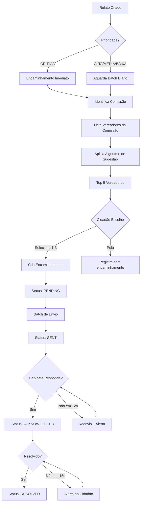

---

## 21. Algoritmo de Sugestão de Vereadores

### 21.1 Fatores de Pontuação

| Fator | Peso Máximo | Descrição |
|-------|-------------|-----------|
| **Região de Atuação** | 30 pts | Match entre bairro do relato e base eleitoral |
| **Comissão Temática** | 40 pts | Vereador participa de comissão relacionada |
| **Tipo de Relato** | 20 pts | Histórico de atuação em temas similares |
| **Severidade (Bonus)** | 10 pts | Prioridade alta/crítica |

### 21.2 Fórmula de Cálculo

```typescript
function calculateVereadorScore(
  vereador: Vereador,
  report: Report
): number {
  let score = 0;
  
  // Região (30 pts)
  if (vereador.base_regions.includes(report.neighborhood)) {
    score += 30;
  } else if (vereador.base_zones.includes(getZone(report.neighborhood))) {
    score += 15;
  }
  
  // Comissão (40 pts)
  const reportCommission = getCommissionForCategory(report.category);
  if (vereador.commissions.includes(reportCommission)) {
    score += 40;
  } else if (vereador.commissions.some(c => isRelated(c, reportCommission))) {
    score += 20;
  }
  
  // Tipo/Histórico (20 pts)
  const relevantHistory = vereador.history.filter(h => 
    h.category === report.category
  );
  score += Math.min(20, relevantHistory.length * 4);
  
  // Bonus severidade (10 pts)
  if (['critica', 'alta'].includes(report.priority)) {
    score += 10;
  }
  
  return Math.min(100, score);
}
```

### 21.3 Regras de Seleção

1. **Top 5**: Retornar os 5 vereadores com maior score
2. **Threshold Mínimo**: Score > 0 para ser incluído
3. **Fallback**: Se nenhum match, retornar 3 vereadores aleatórios da comissão primária
4. **Diversidade**: Garantir representação de pelo menos 2 partidos diferentes

### 21.4 Resposta da Sugestão

```typescript
interface SuggestionResult {
  vereador: {
    id: string;
    name: string;
    party: string;
    photo_url: string;
    email: string;
    phone: string;
    commissions: string[];
    base_region: string;
  };
  matchScore: number;
  matchReasons: string[];
}

// Exemplo
{
  vereador: {
    id: "ver123",
    name: "João Silva",
    party: "PARTIDO-X",
    photo_url: "https://...",
    email: "joao.silva@camara.sp.gov.br",
    phone: "(11) 3396-4000",
    commissions: ["Urbanismo e Obras", "Trânsito"],
    base_region: "Zona Sul"
  },
  matchScore: 85,
  matchReasons: [
    "Membro da Comissão de Urbanismo e Obras",
    "Atua na Zona Sul (sua região)",
    "Histórico de 12 atuações em via pública"
  ]
}
```

---

## 22. Ciclo de Vida do Encaminhamento

### 22.1 Estados do Workflow

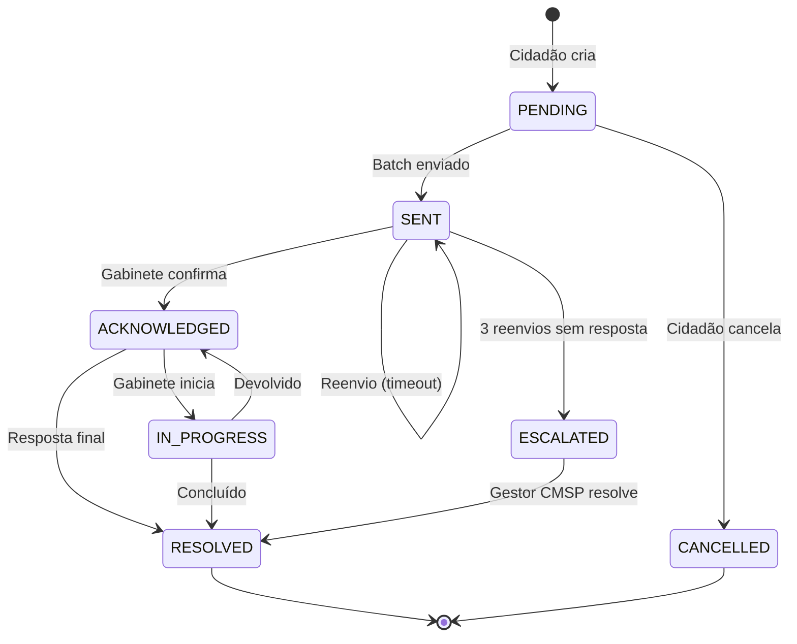

### 22.2 SLAs por Status

| Transição | SLA | Ação se Expirar |
|-----------|-----|-----------------|
| PENDING → SENT | 24 horas | Envio forçado no batch noturno |
| SENT → ACKNOWLEDGED | 72 horas | Reenvio de e-mail + log |
| ACKNOWLEDGED → Resposta | 7 dias | Alerta ao cidadão |
| Total sem resolução | 30 dias | Fechamento automático como "expirado" |

### 22.3 Ações por Status

| Status | Ações Disponíveis (Cidadão) | Ações Disponíveis (Gabinete) |
|--------|----------------------------|------------------------------|
| PENDING | Cancelar, Editar mensagem | - |
| SENT | Cancelar | Confirmar recebimento |
| ACKNOWLEDGED | Adicionar informação | Responder, Iniciar análise |
| IN_PROGRESS | Adicionar informação | Atualizar, Concluir |
| RESOLVED | Avaliar resposta | Reabrir (se necessário) |

---

## 23. Notificações

### 23.1 Notificações ao Cidadão (In-App)

| Evento | Título | Mensagem | Prioridade |
|--------|--------|----------|------------|
| Encaminhamento criado | "Relato encaminhado" | "Seu relato foi encaminhado para {vereador}." | Normal |
| Status → SENT | "Encaminhamento enviado" | "Seu encaminhamento foi enviado ao gabinete de {vereador}." | Normal |
| Status → ACKNOWLEDGED | "Vereador recebeu" | "O(A) vereador(a) {nome} confirmou o recebimento." | Alta |
| Resposta recebida | "Nova resposta" | "O gabinete de {nome} respondeu ao seu encaminhamento." | Alta |
| Status → RESOLVED | "Encaminhamento resolvido" | "Seu encaminhamento foi marcado como resolvido." | Normal |
| Timeout 7 dias | "Aguardando resposta" | "Seu encaminhamento está há 7 dias aguardando resposta." | Normal |
| Fechamento automático | "Encaminhamento expirado" | "Seu encaminhamento foi fechado após 30 dias." | Baixa |

### 23.2 Template de E-mail ao Gabinete

```html
Assunto: [Câmara na Mão] Novo encaminhamento cidadão - {categoria}

Prezado(a) Vereador(a) {nome},

Um cidadão encaminhou o seguinte relato através do aplicativo 
Câmara na Mão:

━━━━━━━━━━━━━━━━━━━━━━━━━━━━━━━━━━━━━━━━━━━━

📋 RESUMO DO RELATO

• Tipo: {tipo_relato}
• Categoria: {categoria}  
• Prioridade: {prioridade}
• Data do relato: {data_criacao}
• Localização: {bairro}, {rua}
• Protocolo: {protocolo}

━━━━━━━━━━━━━━━━━━━━━━━━━━━━━━━━━━━━━━━━━━━━

📝 DESCRIÇÃO COMPLETA

{descricao_completa}

━━━━━━━━━━━━━━━━━━━━━━━━━━━━━━━━━━━━━━━━━━━━

💬 MENSAGEM DO CIDADÃO

{mensagem_cidadao}

━━━━━━━━━━━━━━━━━━━━━━━━━━━━━━━━━━━━━━━━━━━━

📊 POR QUE ESTE RELATO FOI DIRECIONADO A V.EXA:

• {motivo_1}
• {motivo_2}
• {motivo_3}

━━━━━━━━━━━━━━━━━━━━━━━━━━━━━━━━━━━━━━━━━━━━

🔗 AÇÕES

[Visualizar detalhes] {link_cms}
[Confirmar recebimento] {link_acknowledge}
[Responder ao cidadão] {link_responder}

━━━━━━━━━━━━━━━━━━━━━━━━━━━━━━━━━━━━━━━━━━━━

Este e-mail foi gerado automaticamente pelo sistema Câmara na Mão.
Para ajustar preferências de notificação, acesse {link_preferencias}.

Atenciosamente,
Equipe Câmara na Mão
```

### 23.3 Regras de Notificação

| Código | Regra | Implementação |
|--------|-------|---------------|
| RN-NOT-001 | Horário permitido | Apenas 8h-20h (dias úteis) |
| RN-NOT-002 | Limite diário | Máximo 20 notificações/dia/usuário |
| RN-NOT-003 | Agrupamento | Agrupar notificações similares em 1h |
| RN-NOT-004 | Prioridade CRÍTICA | Envio imediato, ignora limite |
| RN-NOT-005 | Preferências | Respeitar opt-out do usuário |
| RN-NOT-006 | Retry | 3 tentativas com backoff exponencial |

---

## 24. Integrações Externas

> Esta seção documenta todas as APIs externas consumidas pela plataforma Câmara na Mão, incluindo endpoints, fluxos de dados, estratégias de cache e fallback, além de hooks frontend associados.

### 24.1 Visão Geral das Integrações

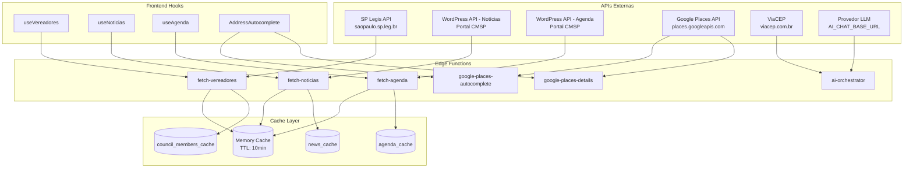

| API | Status | Edge Function | Tabela de Cache | Hook Frontend |
|-----|--------|---------------|-----------------|---------------|
| SP Legis Vereadores | ✅ Produção | `fetch-vereadores` | `council_members_cache` | `useVereadores` |
| WordPress Notícias | ✅ Produção | `fetch-noticias` | `news_cache` | `useNoticias` |
| WordPress Agenda | ✅ Produção | `fetch-agenda` | `agenda_cache` | `useAgenda` |
| Google Places | ✅ Produção | `google-places-*` | Nenhuma | Componentes |
| ViaCEP | ✅ Produção | inline no orquestrador | Nenhuma | - |
| Provedor LLM (OpenAI-compatible) | ✅ Produção | `ai-orchestrator`, etc. | Nenhuma | `useUnifiedAIChat` |
| automacao Workflow | ✅ Produção | `notify-automacao`, `automacao-callback` | Logs apenas | - |

---

### 24.2 automacao Workflow Engine

**Propósito**: Processamento inteligente e triagem de manifestações.

**Status**: ✅ Implementado

**Endpoints Internos**:
| Endpoint | Método | Descrição |
|----------|--------|-----------|
| `/functions/v1/notify-automacao` | POST | Notifica novo relato para automacao processar |
| `/functions/v1/automacao-callback` | POST | Recebe dados processados do automacao |

**Eventos Suportados**:
- `urban_report_created` / `urban_report_updated`
- `transport_report_created` / `transport_report_updated`
- `service_rating_created`
- `referral_created` / `referral_status_changed`

**Fluxo de Integração**:
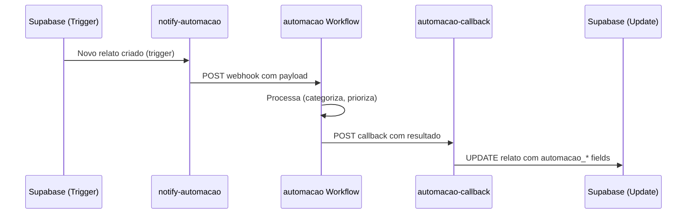

---

### 24.3 Google Places API (New)

**Propósito**: Autocompletar e geocodificar endereços em São Paulo.

**Status**: ✅ Implementado

**API Externa**:
| Endpoint | Método | Descrição |
|----------|--------|-----------|
| `https://places.googleapis.com/v1/places:autocomplete` | POST | Sugestões de endereço |
| `https://places.googleapis.com/v1/places/{placeId}` | GET | Detalhes e coordenadas |

**Edge Functions**:
| Edge Function | Endpoint Interno | Descrição |
|---------------|------------------|-----------|
| `google-places-autocomplete` | `/functions/v1/google-places-autocomplete` | Sugestões com bias para SP |
| `google-places-details` | `/functions/v1/google-places-details` | Geocodificação |

**Headers de Autenticação**:
```
X-Goog-Api-Key: ${GOOGLE_PLACES_API_KEY}
Content-Type: application/json
```

**Location Bias (São Paulo)**:
```json
{
  "locationBias": {
    "circle": {
      "center": { "latitude": -23.5505, "longitude": -46.6333 },
      "radius": 40000
    }
  }
}
```

**Session Token**: Implementado para otimização de custos (agrupa autocomplete + details em uma sessão).

**Resposta Estruturada**:
```typescript
interface StructuredAddress {
  street: string;
  street_number?: string;
  neighborhood: string;
  city: string;
  state: string;
  cep?: string;
  latitude: number;
  longitude: number;
  formatted_address: string;
  place_id: string;
}
```

**Componente Frontend**: `AddressAutocomplete` em `src/components/address/`

---

### 24.4 ViaCEP

**Propósito**: Validação e lookup de CEPs brasileiros.

**Status**: ✅ Implementado

**API Externa**:
| Endpoint | Método | Descrição |
|----------|--------|-----------|
| `https://viacep.com.br/ws/{cep}/json/` | GET | Dados do endereço por CEP |

**Implementação**: Inline no `ai-orchestrator` via tool `validate_cep`.

**Validação Obrigatória**:
```typescript
if (response.localidade !== 'São Paulo') {
  throw new Error('CEP_NOT_IN_SP');
}
```

**Resposta**:
```typescript
interface ViaCEPResponse {
  cep: string;        // "01310-100"
  logradouro: string; // "Avenida Paulista"
  bairro: string;     // "Bela Vista"
  localidade: string; // "São Paulo" - DEVE ser SP
  uf: string;         // "SP"
  erro?: boolean;     // true se CEP não existe
}
```

---

### 24.5 SP Legis API - Vereadores

**Propósito**: Sincronização de dados oficiais dos vereadores da Câmara Municipal de São Paulo.

**Status**: ✅ Implementado

**API Externa**:
| Campo | Valor |
|-------|-------|
| **URL** | `https://saopaulo.sp.leg.br/vereadores-json/` |
| **Método** | GET |
| **Autenticação** | Não requer |
| **Formato** | JSON Array |

**Edge Function**: `fetch-vereadores`

**Fluxo de Dados**:
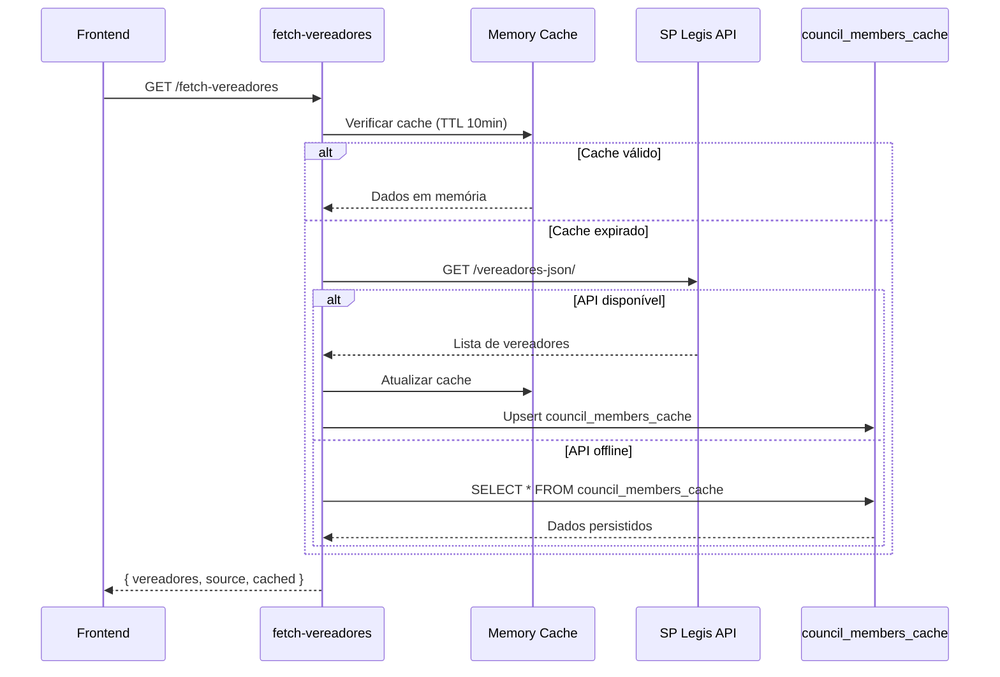

**Estrutura de Dados da API**:
```typescript
// Resposta da API SP Legis
interface VereadorAPI {
  nome: string;
  partido: string;
  foto: string;
  telefone?: string;
  email?: string;
  sala?: string;
  andar?: string;
  gv?: string;
  lider_partido?: string;      // "1" se líder
  lider_governo?: string;      // "1" se líder do governo
  suplente?: string;           // "1" se suplente
  licenciado?: string;         // "1" se licenciado
}
```

**Estrutura Transformada**:
```typescript
interface Vereador {
  id: string;           // Slug gerado do nome (ex: "rubinho-nunes")
  name: string;         // Nome completo
  party: string;        // Partido político
  photo: string;        // URL da foto oficial
  phone: string;        // Telefone do gabinete
  email: string;        // E-mail oficial
  initials: string;     // Iniciais para avatar fallback
  sala?: string;        // Número da sala
  andar?: string;       // Andar no prédio
  gv?: string;          // Gabinete virtual
  isLeader: boolean;    // Líder de partido
  isGovernmentLeader: boolean; // Líder do governo
  isSubstitute: boolean; // Suplente
  isOnLeave: boolean;   // Licenciado
}
```

**Tabela de Cache**: `public.council_members_cache`

| Coluna | Tipo | Descrição |
|--------|------|-----------|
| `id` | text | Slug gerado |
| `name` | text | Nome completo |
| `party` | text | Partido |
| `photo` | text | URL foto |
| `phone` | text | Telefone |
| `email` | text | E-mail |
| `initials` | text | Iniciais |
| `sala` | text | Sala |
| `andar` | text | Andar |
| `gv` | text | Gabinete virtual |
| `is_leader` | boolean | Líder de partido |
| `is_government_leader` | boolean | Líder do governo |
| `is_substitute` | boolean | Suplente |
| `is_on_leave` | boolean | Licenciado |
| `cached_at` | timestamptz | Data do cache |
| `updated_at` | timestamptz | Última atualização |

**Hook Frontend**: `useVereadores()` em `src/hooks/useVereadores.ts`

```typescript
// Uso no frontend
const { data: vereadores, isLoading, error } = useVereadores();
const { vereador, isLoading } = useVereador("rubinho-nunes");
```

**TTL**:
- Memória: 10 minutos
- Banco: Persistente (atualizado a cada fetch da API)

---

### 24.6 Portal CMSP - Notícias (WordPress)

**Propósito**: Exibição de notícias oficiais da Câmara Municipal.

**Status**: ✅ Implementado

**API Externa**:
| Campo | Valor |
|-------|-------|
| **URL** | `https://www.saopaulo.sp.leg.br/wp-json/wp/v2/posts` |
| **Método** | GET |
| **Parâmetros** | `?per_page=30&_fields=id,date,title,content,link,excerpt` |
| **Autenticação** | Não requer |

**Edge Function**: `fetch-noticias`

**Fluxo de Dados**:


**Transformações Aplicadas**:

| Campo WordPress | Campo Interno | Transformação |
|-----------------|---------------|---------------|
| `id` | `id` | `String(id)` |
| `title.rendered` | `title` | `stripHtml()` |
| `content.rendered` | `fullContent` | `stripHtml()` |
| `excerpt.rendered` | `description` | `stripHtml()`, limit 200 chars |
| `link` | `link` | Direto |
| `date` | `pubDate` | ISO format |
| `content.rendered` | `imageUrl` | `extractImageUrl()` - primeira `` |
| `content.rendered` | `readTime` | `calculateReadTime()` (200 palavras/min) |
| `link + content` | `category` | `mapCategory()` |

**Mapeamento de Categorias**:

| Categoria | Keywords/Patterns |
|-----------|-------------------|
| `legislativo` | `/leg/`, lei, projeto, votação, PL |
| `institucional` | institucional, câmara, administração |
| `eventos` | evento, audiência, sessão, homenagem |
| `cultura` | cultura, arte, exposição |
| `saude` | saúde, hospital, ubs |
| `educacao` | educação, escola, creche |
| `outros` | fallback padrão |

**Estrutura Transformada**:
```typescript
interface Noticia {
  id: string;
  title: string;
  description: string;      // Resumo até 200 chars
  fullContent: string;      // Conteúdo completo (sem HTML)
  link: string;             // URL original
  pubDate: string;          // Data ISO
  category: NewsCategory;   // legislativo | institucional | eventos | ...
  imageUrl: string | null;  // Primeira imagem extraída
  readTime: string;         // "3 min de leitura"
  source: string;           // "Portal CMSP"
}
```

**Tabela de Cache**: `public.news_cache`

| Coluna | Tipo | Descrição |
|--------|------|-----------|
| `id` | text | ID do post |
| `title` | text | Título |
| `description` | text | Resumo |
| `full_content` | text | Conteúdo completo |
| `link` | text | URL original |
| `pub_date` | timestamptz | Data de publicação |
| `category` | text | Categoria mapeada |
| `image_url` | text | URL da imagem |
| `read_time` | text | Tempo de leitura |
| `cached_at` | timestamptz | Data do cache |

**Hook Frontend**: `useNoticias()` em `src/hooks/useNoticias.ts`

```typescript
// Uso no frontend
const { data: noticias, isLoading, error } = useNoticias();
const { noticia, isLoading } = useNoticiaById("12345");
```

---

### 24.7 Portal CMSP - Agenda e Audiências (WordPress)

**Propósito**: Exibição de eventos e audiências públicas da Câmara.

**Status**: ✅ Implementado

**API Externa**:
| Campo | Valor |
|-------|-------|
| **URL** | `https://www.saopaulo.sp.leg.br/wp-json/wp/v2/agenda_cerimonial` |
| **Método** | GET |
| **Parâmetros** | `?per_page=50&orderby=date&order=desc` |
| **Autenticação** | Não requer |

**Edge Function**: `fetch-agenda`

**Fluxo de Dados**:
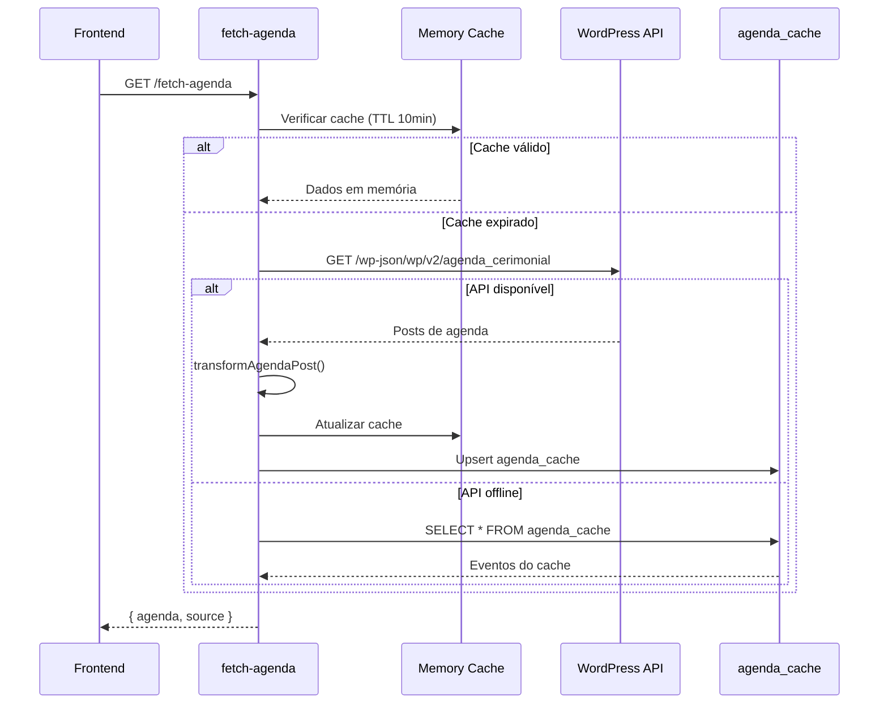

**Tipos de Evento**:

| Tipo | Descrição | Keywords |
|------|-----------|----------|
| `audiencia` | Audiências Públicas | audiência, ouvir |
| `sessao` | Sessões Plenárias | sessão, plenário |
| `comissao` | Reuniões de Comissões | comissão, reunião |
| `evento` | Eventos Gerais (fallback) | homenagem, lançamento |

**Extração de Dados do Conteúdo**:

| Dado | Função | Padrão Regex |
|------|--------|--------------|
| `eventDate` | `extractEventDate()` | `DD/MM/YYYY` ou `YYYY-MM-DD` |
| `eventTime` | `extractEventTime()` | `HH:MM` ou `Hh` |
| `location` | `extractLocation()` | Após "Local:", "Onde:" |
| `organizer` | `extractOrganizer()` | Após "Organização:", nomes de comissões |
| `eventType` | `mapEventType()` | Keywords no título/conteúdo |

**Estrutura Transformada**:
```typescript
interface AgendaItem {
  id: string;
  title: string;
  description: string;
  eventDate: string;        // YYYY-MM-DD
  eventTime?: string;       // HH:MM
  location?: string;        // Local do evento
  eventType: 'audiencia' | 'sessao' | 'comissao' | 'evento';
  organizer?: string;       // Comissão/organizador
  link: string;             // URL original
  registrationUrl?: string; // URL de inscrição (se disponível)
}
```

**Tabela de Cache**: `public.agenda_cache`

| Coluna | Tipo | Descrição |
|--------|------|-----------|
| `id` | text | ID do evento |
| `title` | text | Título |
| `description` | text | Descrição |
| `event_date` | text | Data YYYY-MM-DD |
| `event_time` | text | Hora HH:MM |
| `location` | text | Local |
| `event_type` | text | Tipo de evento |
| `organizer` | text | Organizador |
| `link` | text | URL original |
| `cached_at` | timestamptz | Data do cache |

**Hooks Frontend**: `useAgenda()` em `src/hooks/useAgenda.ts`

```typescript
// Uso no frontend
const { data: agenda, isLoading } = useAgenda();           // Todos
const { data: upcoming } = useUpcomingAgenda(5);           // Próximos 5
const { data: past } = usePastAgenda();                    // Passados
const { data: filtered } = useAgendaByType('audiencia');   // Por tipo
const { agendaItem, isLoading } = useAgendaById("xyz");    // Específico
```

---

### 24.8 Provedor LLM (OpenAI-compatible)

**Propósito**: Acesso a modelos de IA para o AI Orchestrator e demais funcionalidades.

**Status**: ✅ Implementado

**API**:
| Campo | Valor |
|-------|-------|
| **URL** | `${AI_CHAT_BASE_URL}/chat/completions` |
| **Método** | POST |
| **Autenticação** | `Authorization: Bearer ${AI_API_KEY}` |
| **Streaming** | SSE (Server-Sent Events) |

**Edge Functions que Utilizam**:

| Edge Function | Modelo Preferido | Propósito |
|---------------|------------------|-----------|
| `ai-orchestrator` | `google/gemini-2.5-flash` | Chat conversacional principal |
| `analyze-sentiment` | `google/gemini-2.5-flash` | Análise de sentimento de relatos |
| `generate-embeddings` | `openai/gpt-5-mini` | Vetorização para busca semântica |
| `recommend-services` | `google/gemini-2.5-flash` | Recomendações personalizadas |
| `suggest-council-members` | `google/gemini-2.5-flash` | Sugestão de vereadores por tema |
| `populate-knowledge-base` | `google/gemini-2.5-flash` | Enriquecimento da base de conhecimento |

**Modelos Disponíveis**:

| Modelo | Uso Recomendado |
|--------|-----------------|
| `google/gemini-2.5-flash` | Velocidade + custo (padrão) |
| `google/gemini-2.5-pro` | Reasoning complexo |
| `openai/gpt-5-mini` | Embeddings de alta qualidade |
| `openai/gpt-5` | Tarefas críticas de alta precisão |

**Exemplo de Request**:
```typescript
const response = await fetch(`${Deno.env.get('AI_CHAT_BASE_URL')}/chat/completions`, {
  method: 'POST',
  headers: {
    'Authorization': `Bearer ${Deno.env.get('AI_API_KEY')}`,
    'Content-Type': 'application/json',
  },
  body: JSON.stringify({
    model: 'google/gemini-2.5-flash',
    messages: [
      { role: 'system', content: systemPrompt },
      ...conversationHistory,
      { role: 'user', content: userMessage }
    ],
    tools: toolDefinitions,
    stream: true
  })
});
```

---

### 24.9 Estratégia de Cache e Fallback

**Arquitetura de Resiliência (3 Camadas)**:

Todas as integrações com APIs externas institucionais (SP Legis, WordPress) seguem um padrão de 3 camadas para garantir alta disponibilidade:

```
┌─────────────────────────────────────────────────────────┐
│                    1ª PRIORIDADE                        │
│                  Memory Cache (10min)                   │
│      Dados em memória da Edge Function (stateless)      │
└──────────────────────────┬──────────────────────────────┘
                           │ cache miss ou expirado
                           ▼
┌─────────────────────────────────────────────────────────┐
│                    2ª PRIORIDADE                        │
│               Fetch da API Externa                      │
│     SP Legis / WordPress Portal CMSP                    │
└──────────────────────────┬──────────────────────────────┘
                           │ falha (timeout, erro, offline)
                           ▼
┌─────────────────────────────────────────────────────────┐
│                    3ª PRIORIDADE                        │
│            Database Cache (Supabase)                    │
│   *_cache tables (persistente, stale-while-revalidate)  │
└─────────────────────────────────────────────────────────┘
```

**Tabelas de Cache no Banco**:

| Tabela | API Fonte | Atualização | Volume Esperado |
|--------|-----------|-------------|-----------------|
| `council_members_cache` | SP Legis Vereadores | A cada fetch bem-sucedido | ~55 registros |
| `news_cache` | WordPress Posts | A cada fetch bem-sucedido | ~30 registros |
| `agenda_cache` | WordPress Agenda | A cada fetch bem-sucedido | ~50 registros |

**Padrão de Implementação**:

```typescript
// Padrão implementado em todas as Edge Functions de conteúdo externo
async function handler(req: Request): Promise<Response> {
  try {
    // 1. Verificar cache em memória
    if (memoryCache.data && memoryCache.timestamp > Date.now() - CACHE_TTL) {
      return json({ 
        data: memoryCache.data, 
        source: 'memory', 
        cached: true 
      });
    }
    
    // 2. Buscar da API externa
    const freshData = await fetchFromExternalAPI();
    
    // Atualizar caches (background - não bloqueia resposta)
    memoryCache = { data: freshData, timestamp: Date.now() };
    updateDatabaseCache(supabase, freshData); // async, não await
    
    return json({ 
      data: freshData, 
      source: 'api', 
      cached: false 
    });
    
  } catch (apiError) {
    console.error('[fetch-*] API error, trying fallbacks:', apiError.message);
    
    // 3. Fallback para cache stale em memória
    if (memoryCache.data) {
      return json({ 
        data: memoryCache.data, 
        source: 'memory', 
        stale: true,
        warning: 'API offline, dados podem estar desatualizados'
      });
    }
    
    // 4. Fallback para banco de dados
    const cachedData = await fetchFromDatabaseCache(supabase);
    if (cachedData.length > 0) {
      return json({ 
        data: cachedData, 
        source: 'database', 
        stale: true,
        warning: 'API offline, dados podem estar desatualizados'
      });
    }
    
    // 5. Erro fatal - sem dados disponíveis
    throw new Error('Nenhum dado disponível');
  }
}
```

**Resposta com Metadados**:

```typescript
interface CachedResponse<T> {
  data: T;                      // Dados retornados
  source: 'api' | 'memory' | 'database';  // Origem dos dados
  cached: boolean;              // true se veio de cache
  stale?: boolean;              // true se dados podem estar desatualizados
  cachedAt?: string;            // timestamp do cache (se aplicável)
  warning?: string;             // mensagem de alerta (se fallback)
  error?: string;               // erro que causou fallback (debug)
}
```

**TTL e Configurações**:

| Recurso | TTL | Justificativa |
|---------|-----|---------------|
| Memory Cache | 10 minutos | Balance entre freshness e performance |
| Database Cache | Persistente | Fallback para offline, sem expiração |
| Stale-While-Revalidate | Sempre serve | Prioriza disponibilidade sobre freshness |
| Hook `staleTime` | 10 minutos | Alinhado com memory cache |
| Hook `gcTime` | 30 minutos | Mantém dados no React Query |

**Monitoramento e Logs**:

Cada Edge Function loga:
- Origem dos dados (`[fetch-*] Serving from {source}`)
- Erros de API (`[fetch-*] API error: {message}`)
- Fallbacks acionados (`[fetch-*] Falling back to {source}`)
- Atualizações de cache (`[fetch-*] Cache updated with {count} items`)

---

## 25. Segurança e Auditoria

### 25.1 Logging Obrigatório

| Evento | Campos Logados | Retenção |
|--------|----------------|----------|
| Intent Detection | intent, confidence, user_id, timestamp | 90 dias |
| Tool Execution | tool_name, params, result, duration_ms | 90 dias |
| Report Creation | report_id, type, user_id, ip_address | Permanente |
| Journey Switch | from_journey, to_journey, fields_count | 90 dias |
| Error | error_type, message, stack, user_id | 180 dias |
| Auth Event | event_type, user_id, ip, user_agent | 365 dias |

### 25.2 Validações de Segurança

```typescript
// Sanitização de Input
function sanitizeInput(text: string): string {
  return text
    .replace(/<script\b[^<]*(?:(?!<\/script>)<[^<]*)*<\/script>/gi, '')
    .replace(/javascript:/gi, '')
    .replace(/on\w+=/gi, '')
    .slice(0, 5000);  // Limite de tamanho
}

// Validação de Token JWT
function validateToken(token: string): boolean {
  const decoded = jwt.verify(token, process.env.JWT_SECRET);
  return decoded && decoded.exp > Date.now() / 1000;
}

// Rate Limiting
const rateLimiter = {
  windowMs: 60 * 1000,  // 1 minuto
  max: 60,  // requisições
  keyGenerator: (req) => req.user?.id || req.ip,
};
```

### 25.3 Dados Sensíveis

| Dado | Tratamento | Mascaramento |
|------|------------|--------------|
| E-mail | Hash + últimos 4 chars | j***@g***.com |
| Telefone | Hash + últimos 4 dígitos | (11) ****-1234 |
| CPF | NUNCA armazenar | - |
| Endereço completo | Separar em campos | Rua + Bairro (sem número) |
| Localização GPS | Precisão reduzida (3 casas) | -23.550, -46.633 |

### 25.4 Auditoria de Ações

```typescript
interface AuditLog {
  id: string;
  action: 'CREATE' | 'UPDATE' | 'DELETE' | 'VIEW' | 'EXPORT';
  entity_type: 'urban_report' | 'transport_report' | 'service_rating' | 'referral';
  entity_id: string;
  user_id: string;
  ip_address: string;
  user_agent: string;
  old_values?: Record<string, any>;
  new_values?: Record<string, any>;
  metadata?: Record<string, any>;
  created_at: string;
}
```

---

## 26. Testes E2E Obrigatórios

### 26.1 Checklist de Testes

#### Fluxo Urbano
- [ ] Criação completa com todos os campos obrigatórios
- [ ] Classificação automática com confiança >= 80%
- [ ] Classificação com confirmação (confiança < 80%)
- [ ] Fallback para categoria "outro"
- [ ] Validação de CEP válido em SP
- [ ] Rejeição de CEP fora de SP
- [ ] Coleta de campos de risco (via_publica)
- [ ] Geração de protocolo URB-YYYY-NNNNNN
- [ ] Emissão de [REPORT_CREATED] marker

#### Fluxo Transporte
- [ ] Criação com linha informada
- [ ] Criação sem linha (opcional)
- [ ] Inferência de data "hoje"/"ontem"
- [ ] Validação de data futura (bloqueio)
- [ ] Tipos de problema: todos os 7 tipos
- [ ] Geração de protocolo TRP-YYYY-NNNNNN

#### Fluxo Avaliação
- [ ] Seleção de tipo de serviço
- [ ] Busca de serviço
- [ ] Confirmação de endereço
- [ ] Fluxo com endereço não confirmado
- [ ] Validação de nota 1-5
- [ ] Descrição mínima 10 caracteres

#### Troca de Jornada
- [ ] Troca automática (< 2 campos)
- [ ] Confirmação de troca (>= 2 campos)
- [ ] Reset de campos após troca
- [ ] Recusa de troca (continue)
- [ ] Marker [JOURNEY_SWITCHED] emitido
- [ ] Marker [JOURNEY_DECLINED] respeitado

#### Mensagens e Validações
- [ ] Filtro de mensagens genéricas
- [ ] Descrição mínima (30/20 chars)
- [ ] Limite de 3 tentativas por campo
- [ ] Timeout de sessão (30 min)
- [ ] Rate limiting

#### Sincronização
- [ ] [COLLECTION_PROGRESS] em todas as mensagens
- [ ] DataCollectionTracker atualizado
- [ ] [FIELD_REQUEST] para próximo campo
- [ ] Pickers ativados corretamente

### 26.2 Estrutura de Teste

```typescript
// tests/e2e/urban-flow.spec.ts
import { test, expect } from '@playwright/test';

test.describe('Fluxo Urbano Completo', () => {
  test('deve criar relato com risco crítico', async ({ page }) => {
    await page.goto('/');
    await page.waitForSelector('[data-testid="chat-input"]');
    
    // 1. Iniciar relato
    await page.fill('[data-testid="chat-input"]', 'Quero relatar um problema');
    await page.click('[data-testid="send-button"]');
    
    // 2. Descrever problema
    await page.waitForSelector('text=O que está acontecendo');
    await page.fill('[data-testid="chat-input"]', 
      'Tem um buraco enorme na rua que está causando acidentes');
    await page.click('[data-testid="send-button"]');
    
    // 3. Informar endereço
    await page.waitForSelector('[data-testid="address-picker"]');
    await page.fill('[data-testid="address-input"]', '01310-100');
    await page.click('[data-testid="address-suggestion"]');
    
    // 4. Confirmar risco
    await page.waitForSelector('text=oferece risco');
    await page.fill('[data-testid="chat-input"]', 'Sim, muito perigoso');
    await page.click('[data-testid="send-button"]');
    
    // 5. Informar escopo
    await page.waitForSelector('text=quantas pessoas');
    await page.fill('[data-testid="chat-input"]', 'Todo o quarteirão');
    await page.click('[data-testid="send-button"]');
    
    // 6. Verificar sucesso
    await page.waitForSelector('text=Relato registrado');
    await expect(page.locator('text=URB-2026')).toBeVisible();
    await expect(page.locator('[data-testid="tracker-complete"]')).toBeVisible();
  });
});
```

---

## Apêndice A: Keywords por Categoria

### A.1 Categorias Urbanas

```typescript
const URBAN_KEYWORDS = {
  via_publica: [
    'buraco', 'buracos', 'cratera', 'crateras',
    'asfalto', 'pavimento', 'pavimentação',
    'semáforo', 'semaforo', 'sinal', 'sinalização',
    'faixa', 'lombada', 'quebra-mola'
  ],
  iluminacao: [
    'poste', 'postes', 'luz', 'luzes', 'lâmpada', 'lampada',
    'escuro', 'escuridão', 'apagado', 'apagada',
    'iluminação', 'iluminacao'
  ],
  esgoto: [
    'alagamento', 'alagado', 'enchente', 'inundação',
    'bueiro', 'bueiros', 'boca de lobo',
    'vazamento', 'esgoto', 'água', 'agua'
  ],
  area_verde: [
    'praça', 'praca', 'parque', 'jardim',
    'árvore', 'arvore', 'árvores', 'arvores',
    'mato', 'capim', 'poda', 'corte'
  ],
  lixo: [
    'lixo', 'lixos', 'entulho', 'entulhos',
    'coleta', 'descarte', 'resíduo', 'residuo',
    'reciclagem', 'lixeira', 'lixeiras'
  ],
  calcada: [
    'calçada', 'calcada', 'calçadas', 'calcadas',
    'passeio', 'piso', 'pisos', 'rampa', 'rampas',
    'acessibilidade', 'degrau', 'degraus'
  ],
  poluicao: [
    'barulho', 'ruído', 'ruido', 'som', 'música', 'musica',
    'festa', 'festas', 'obra', 'obras',
    'poluição', 'poluicao', 'fumaça', 'fumaca'
  ],
  animais: [
    'rato', 'ratos', 'ratazana', 'ratazanas',
    'pombo', 'pombos', 'cachorro', 'cachorros',
    'gato', 'gatos', 'animal', 'animais',
    'bicho', 'bichos', 'carniça', 'carnica'
  ]
};
```

### A.2 Tipos de Transporte

```typescript
const TRANSPORT_KEYWORDS = {
  atraso: [
    'atraso', 'atrasado', 'atrasou', 'demora', 'demorou',
    'esperando', 'espera', 'não passou', 'não veio',
    'sumiu', 'desapareceu'
  ],
  lotacao: [
    'lotado', 'lotada', 'lotação', 'cheio', 'cheia',
    'superlotado', 'superlotada', 'apertado', 'apertada',
    'espremido', 'espremida'
  ],
  seguranca: [
    'assédio', 'assediada', 'assediado', 'roubo', 'roubado',
    'furto', 'furtado', 'briga', 'violência', 'violencia',
    'perigo', 'perigoso', 'perigosa', 'medo'
  ],
  acessibilidade: [
    'elevador', 'escada rolante', 'rampa', 'cadeirante',
    'deficiente', 'PCD', 'acessibilidade', 'inacessível'
  ],
  limpeza: [
    'sujo', 'suja', 'sujeira', 'imundo', 'imunda',
    'fedido', 'fedida', 'fedor', 'nojento', 'nojenta',
    'lixo', 'pichado', 'pichada'
  ],
  conducao: [
    'motorista', 'condutor', 'freada', 'freou',
    'imprudente', 'imprudência', 'velocidade', 'rápido',
    'acelerou', 'fechou', 'xingou', 'grosso', 'grossa'
  ],
  acidente: [
    'acidente', 'batida', 'bateu', 'colisão', 'colidiu',
    'capotou', 'capotamento', 'atropelou', 'atropelamento'
  ]
};
```

---

## Apêndice B: Regex de Validação

### B.1 Expressões Regulares

```typescript
const REGEX_PATTERNS = {
  // CEP brasileiro (com ou sem hífen)
  cep: /^(\d{5})-?(\d{3})$/,
  
  // Data no formato brasileiro
  date_br: /^(\d{1,2})\/(\d{1,2})\/(\d{4})$/,
  
  // Horário (várias formas)
  time: /(\d{1,2})[h:](\d{0,2})/i,
  
  // Referência a "hoje" ou "ontem"
  relative_date: /(hoje|ontem|anteontem)/i,
  
  // Código de linha (ônibus, metrô, CPTM)
  line_code: /^(\d{3,4}[A-Z]?-?\d{0,2}|Linha\s?\d{1,2})/i,
  
  // Telefone brasileiro
  phone_br: /^\(?\d{2}\)?\s?\d{4,5}-?\d{4}$/,
  
  // Email básico
  email: /^[^\s@]+@[^\s@]+\.[^\s@]+$/,
  
  // Protocolo de relato
  protocol: /^(URB|TRP)-\d{4}-\d{6}$/,
  
  // UUID
  uuid: /^[0-9a-f]{8}-[0-9a-f]{4}-[0-9a-f]{4}-[0-9a-f]{4}-[0-9a-f]{12}$/i,
  
  // Marcadores de progresso
  collection_progress: /\[COLLECTION_PROGRESS:(\w+):(\{[^}]+\})\]/,
  
  // Qualquer marcador
  any_marker: /\[([A-Z_]+)(?::([^\]]+))?\]/g,
};
```

### B.2 Validadores

```typescript
// Validar CEP de São Paulo (faixas válidas)
function isValidSpCep(cep: string): boolean {
  const cleaned = cep.replace(/\D/g, '');
  if (cleaned.length !== 8) return false;
  
  const prefix = parseInt(cleaned.slice(0, 5));
  // São Paulo capital: 01000-000 a 05999-999 e 08000-000 a 08499-999
  return (prefix >= 1000 && prefix <= 5999) || 
         (prefix >= 8000 && prefix <= 8499);
}

// Validar data não futura
function isValidPastDate(dateStr: string): boolean {
  const [day, month, year] = dateStr.split('/').map(Number);
  const date = new Date(year, month - 1, day);
  return date <= new Date();
}

// Validar horário
function isValidTime(timeStr: string): boolean {
  const match = timeStr.match(/(\d{1,2})[h:](\d{0,2})/i);
  if (!match) return false;
  
  const hours = parseInt(match[1]);
  const minutes = parseInt(match[2] || '0');
  
  return hours >= 0 && hours <= 23 && minutes >= 0 && minutes <= 59;
}
```

---

## Apêndice C: Mapa de Erros

### C.1 Erros de Validação

| Código | Mensagem Técnica | Mensagem ao Cidadão |
|--------|------------------|---------------------|
| `CEP_INVALID` | CEP não possui 8 dígitos | "O CEP informado parece estar incompleto. Pode verificar?" |
| `CEP_NOT_FOUND` | CEP não encontrado na base ViaCEP | "Não encontrei esse CEP. Pode verificar se está correto?" |
| `CEP_NOT_SP` | CEP não pertence a São Paulo capital | "Esse endereço fica fora de São Paulo capital. No momento, atendo apenas a capital." |
| `DESCRIPTION_TOO_SHORT` | Descrição com menos de 30 caracteres | "Pode me contar mais detalhes sobre o problema? Isso ajuda a entender melhor." |
| `RATING_INVALID` | Nota fora do range 1-5 | "A nota precisa ser de 1 a 5 estrelas. Qual nota você dá?" |
| `DATE_FUTURE` | Data informada é futura | "Essa data é no futuro. Quando o problema aconteceu?" |
| `DATE_TOO_OLD` | Data > 30 dias | "Esse problema aconteceu há mais de 30 dias. Ele ainda persiste?" |
| `FIELD_REQUIRED` | Campo obrigatório não preenchido | "Preciso dessa informação para continuar. Pode me informar?" |
| `RATE_LIMIT_EXCEEDED` | Limite de requisições atingido | "Você está enviando muitas mensagens. Aguarde alguns segundos." |
| `DAILY_LIMIT_EXCEEDED` | Limite diário de relatos atingido | "Você atingiu o limite de 10 relatos por dia. Tente novamente amanhã!" |

### C.2 Erros de Sistema

| Código | Mensagem Técnica | Ação | Log |
|--------|------------------|------|-----|
| `TOOL_EXECUTION_FAILED` | Falha ao executar ferramenta | Retry 3x, depois fallback | ERROR |
| `DATABASE_ERROR` | Erro de banco de dados | Retry, notificar admin | ERROR |
| `EXTERNAL_API_ERROR` | API externa indisponível | Usar cache/fallback | WARN |
| `TOKEN_EXPIRED` | Token JWT expirado | Renovar sessão | INFO |
| `CONTEXT_OVERFLOW` | Histórico muito longo | Truncar mensagens antigas | WARN |
| `STREAM_INTERRUPTED` | Stream SSE interrompido | Reconectar | WARN |

### C.3 Tratamento de Erros no Frontend

```typescript
function handleChatError(error: ChatError): string {
  const errorMessages: Record<string, string> = {
    'CEP_INVALID': 'O CEP informado parece estar incompleto.',
    'CEP_NOT_FOUND': 'Não encontrei esse CEP. Pode verificar?',
    'CEP_NOT_SP': 'Esse endereço fica fora de São Paulo.',
    'DESCRIPTION_TOO_SHORT': 'Pode me contar mais detalhes?',
    'RATING_INVALID': 'A nota precisa ser de 1 a 5 estrelas.',
    'DATE_FUTURE': 'Essa data é no futuro. Quando aconteceu?',
    'RATE_LIMIT_EXCEEDED': 'Aguarde alguns segundos...',
    'DAILY_LIMIT_EXCEEDED': 'Limite de 10 relatos/dia atingido.',
    'GENERIC_ERROR': 'Algo deu errado. Tente novamente.',
  };
  
  return errorMessages[error.code] || errorMessages['GENERIC_ERROR'];
}
```

---

## Apêndice D: Glossário Técnico

| Termo | Definição |
|-------|-----------|
| **Accumulated Fields** | Campos já coletados na jornada atual, armazenados em memória |
| **CEP** | Código de Endereçamento Postal brasileiro (8 dígitos) |
| **Comissão Temática** | Grupo de vereadores especializado em determinado tema |
| **CMS** | Content Management System - Área administrativa |
| **Collection Progress** | Estado atual da coleta de dados de uma jornada |
| **Edge Function** | Função serverless executada no Supabase Edge |
| **Encaminhamento** | Envio de relato para gabinete de vereador |
| **Fallback** | Comportamento alternativo quando o principal falha |
| **Guardrail** | Regra que impede comportamento indesejado da IA |
| **Intent Detection** | Detecção automática da intenção do usuário |
| **Journey** | Fluxo completo de coleta de dados (urbano, transporte, etc.) |
| **Marker** | Tag especial no conteúdo para sincronização frontend-backend |
| **automacao** | Plataforma de automação de workflows (self-hosted) |
| **Picker** | Componente de UI para seleção de dados (data, endereço, etc.) |
| **Priority Score** | Pontuação 0-100 que determina prioridade do relato |
| **Protocol Code** | Código único de identificação do relato (URB/TRP-YYYY-NNNNNN) |
| **RAG** | Retrieval Augmented Generation - busca + geração de resposta |
| **RLS** | Row Level Security - política de segurança no Supabase |
| **Sanitization** | Remoção de marcadores técnicos antes de exibir ao usuário |
| **SLA** | Service Level Agreement - tempo máximo de resposta |
| **SSE** | Server-Sent Events - protocolo de streaming |
| **Tool** | Ferramenta que a IA pode acionar para executar ações |
| **Webhook** | Endpoint que recebe notificações de eventos |

---

## Apêndice E: Diagramas Mermaid

### E.1 Arquitetura do Sistema

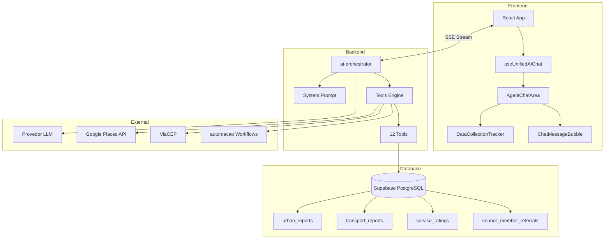

### E.2 Fluxo de Classificação

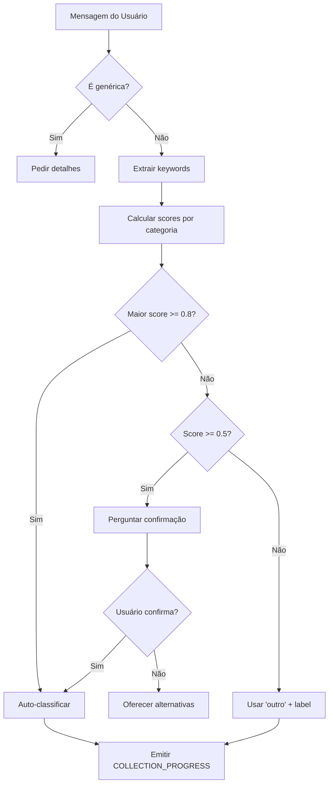

### E.3 Pipeline automacao

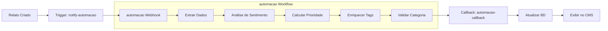

### E.4 Ciclo de Encaminhamento

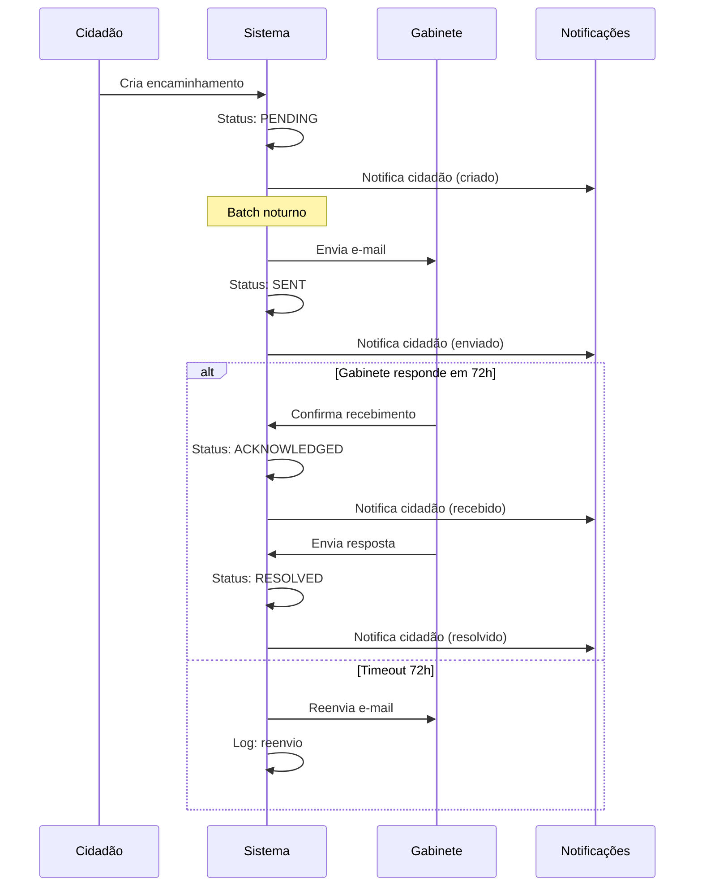

### E.5 Estados do DataCollectionTracker

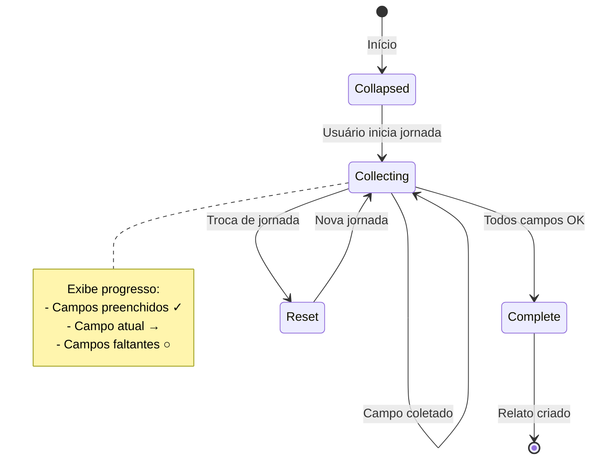

### E.6 Integrações de APIs Externas

```mermaid
flowchart TB
    subgraph "Fontes de Dados Externas"
        SPL["🏛️ SP Legis API<br/>saopaulo.sp.leg.br/vereadores-json/"]
        WPN["📰 WordPress - Notícias<br/>saopaulo.sp.leg.br/wp-json/wp/v2/posts"]
        WPA["📅 WordPress - Agenda<br/>saopaulo.sp.leg.br/wp-json/wp/v2/agenda_cerimonial"]
        GP["📍 Google Places API<br/>places.googleapis.com/v1/places"]
        VC["📮 ViaCEP<br/>viacep.com.br/ws/{cep}/json"]
        LAI["🤖 Provedor LLM<br/>AI_CHAT_BASE_URL"]
        automacao["⚙️ automacao Workflow<br/>Self-hosted"]
    end
    
    subgraph "Edge Functions (Supabase)"
        FV[fetch-vereadores]
        FN[fetch-noticias]
        FA[fetch-agenda]
        GPA[google-places-autocomplete]
        GPD[google-places-details]
        AIO[ai-orchestrator]
        NN8[notify-automacao]
        CB8[automacao-callback]
    end
    
    subgraph "Camada de Cache"
        MC[("💾 Memory Cache<br/>TTL: 10min")]
        CMC[("🗃️ council_members_cache")]
        NC[("🗃️ news_cache")]
        AC[("🗃️ agenda_cache")]
    end
    
    subgraph "Frontend (React)"
        UV["useVereadores()"]
        UN["useNoticias()"]
        UA["useAgenda()"]
        AAC["AddressAutocomplete"]
        UAI["useUnifiedAIChat()"]
    end
    
    %% Conexões de APIs para Edge Functions
    SPL --> FV
    WPN --> FN
    WPA --> FA
    GP --> GPA
    GP --> GPD
    VC --> AIO
    LAI --> AIO
    automacao <--> NN8
    automacao <--> CB8
    
    %% Conexões de Edge Functions para Cache
    FV --> MC
    FV --> CMC
    FN --> MC
    FN --> NC
    FA --> MC
    FA --> AC
    
    %% Conexões de Frontend para Edge Functions
    UV --> FV
    UN --> FN
    UA --> FA
    AAC --> GPA
    AAC --> GPD
    UAI --> AIO
    
    %% Estilo
    classDef api fill:#e1f5fe,stroke:#01579b
    classDef edge fill:#fff3e0,stroke:#e65100
    classDef cache fill:#f3e5f5,stroke:#7b1fa2
    classDef frontend fill:#e8f5e9,stroke:#2e7d32
    
    class SPL,WPN,WPA,GP,VC,LAI,automacao api
    class FV,FN,FA,GPA,GPD,AIO,NN8,CB8 edge
    class MC,CMC,NC,AC cache
    class UV,UN,UA,AAC,UAI frontend
```

**Legenda:**
- 🏛️ APIs Institucionais (SP Legis, Portal CMSP)
- 📍 APIs de Geolocalização (Google Places, ViaCEP)
- 🤖 APIs de IA (provedor LLM configurável)
- ⚙️ Automação (automacao)
- 💾 Cache em memória (volátil)
- 🗃️ Cache em banco (persistente)

---

# PARTE 9: CMS ADMINISTRATIVO

---

## 27. Visão Geral do CMS

### 27.1 Arquitetura de Layout

O CMS Administrativo é a interface de gestão da plataforma Câmara na Mão, destinada a gestores públicos, administradores e equipe da Câmara Municipal.

```
┌─────────────────────────────────────────────────────────────────┐
│                     AdminLayout (h-screen)                      │
├──────────────┬──────────────────────────────────────────────────┤
│              │                    AdminHeader                   │
│   AdminSidebar│  ┌──────────────────────────────────────────────┤
│   (Colapsável)│  │                                              │
│              │  │              Área de Conteúdo                 │
│  - Dashboard │  │            (overflow-y-auto)                  │
│  - Relatos   │  │                                               │
│  - Analytics │  │         <Suspense fallback=PageSkeleton>      │
│  - Usuários  │  │              {children}                       │
│  - Auditoria │  │         </Suspense>                           │
│  - Alertas   │  │                                               │
│  - Exports   │  │                                               │
│  - Settings  │  │                                               │
│              │  └──────────────────────────────────────────────┘
└──────────────┴──────────────────────────────────────────────────┘
```

**Características Técnicas:**
- Layout full-screen (`h-screen`) com scroll interno
- Sidebar colapsável (desktop) / Sheet drawer (mobile)
- Header fixo com notificações e menu de usuário
- Wrapper `<Suspense>` com `<PageSkeleton>` para rotas lazy-loaded
- Proteção via `ProtectedAdminRoute` (verifica papel não-cidadão)

### 27.2 Hierarquia de Navegação

```
/admin                    → Dashboard Executivo
/admin/reports            → Gestão de Relatos (Lista/Kanban)
/admin/analytics          → Análise de Relatos (Dashboards)
/admin/referrals          → Gestão de Encaminhamentos
/admin/users              → Gestão de Usuários
/admin/notifications      → Central de Alertas
/admin/audit-logs         → Logs de Auditoria
/admin/exports            → Logs de Exportação
/admin/settings/automacao       → Configuração automacao
/admin/settings/automacao-monitoring → Monitoramento automacao
/admin/settings/accessibility → Configurações de Acessibilidade
```

### 27.3 Fluxo de Acesso

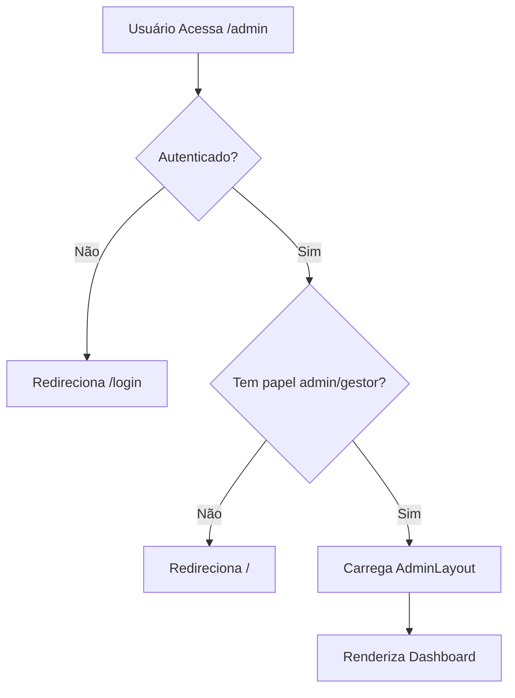

---

## 28. Papéis e Permissões (RBAC)

### 28.1 Matriz de Papéis

| Papel | Código DB | Descrição | Cor Badge | Nível |
|-------|-----------|-----------|-----------|-------|
| **Administrador** | `admin` | Controle total do sistema | 🔴 Vermelho | 5 |
| **Gestor** | `gestor` | Análises avançadas e gestão operacional | 🟣 Roxo | 4 |
| **Vereador** | `vereador` | Acesso aos dados do gabinete e encaminhamentos | 🔵 Azul | 3 |
| **Assessor** | `assessor` | Suporte ao gabinete do vereador | 🟢 Verde | 2 |
| **Cidadão** | `cidadao` | Acesso público padrão (sem CMS) | ⚪ Cinza | 1 |

### 28.2 Matriz de Acesso por Módulo

| Módulo | Admin | Gestor | Vereador | Assessor | Cidadão |
|--------|:-----:|:------:|:--------:|:--------:|:-------:|
| Dashboard | ✅ | ✅ | ⚠️ | ⚠️ | ❌ |
| Gestão de Relatos | ✅ | ✅ | 👁️ | 👁️ | ❌ |
| Análise de Relatos | ✅ | ✅ | ⚠️ | ❌ | ❌ |
| Gestão de Encaminhamentos | ✅ | ✅ | ✅* | ✅* | ❌ |
| Gestão de Usuários | ✅ | ❌ | ❌ | ❌ | ❌ |
| Logs de Auditoria | ✅ | 👁️ | ❌ | ❌ | ❌ |
| Exportação de Dados | ✅ | ✅ | ⚠️ | ❌ | ❌ |
| Configurações automacao | ✅ | ⚠️ | ❌ | ❌ | ❌ |
| Central de Alertas | ✅ | ✅ | ✅ | ✅ | ❌ |

**Legenda:**
- ✅ Acesso total
- ⚠️ Acesso limitado
- 👁️ Somente leitura
- ✅* Apenas próprios/gabinete
- ❌ Sem acesso

### 28.3 Regras de Atribuição de Papéis

| Código | Regra | Validação |
|--------|-------|-----------|
| **RN-ROLE-001** | Um usuário pode ter múltiplos papéis simultaneamente | Array em `user_roles` |
| **RN-ROLE-002** | Apenas `admin` pode atribuir/remover papéis | Verificação de papel no frontend e RLS |
| **RN-ROLE-003** | Admin não pode remover seu próprio papel de admin | Validação no `UserRoleModal` |
| **RN-ROLE-004** | Novos usuários recebem papel `cidadao` por padrão | Trigger no registro |
| **RN-ROLE-005** | Alterações de papel são registradas em `audit_logs` | Trigger automático |
| **RN-ROLE-006** | Papel mais alto determina nível de acesso | `Math.max(userRoles.map(r => r.level))` |

### 28.4 Verificação de Acesso no Frontend

```typescript
// useUserRole.ts
function useUserRole() {
  const [roles, setRoles] = useState<string[]>([]);
  
  const hasRole = (role: string) => roles.includes(role);
  const hasAnyRole = (requiredRoles: string[]) => 
    requiredRoles.some(r => roles.includes(r));
  const isAdmin = () => hasRole('admin');
  const isGestor = () => hasRole('gestor') || isAdmin();
  const canAccessCMS = () => hasAnyRole(['admin', 'gestor', 'vereador', 'assessor']);
  
  return { roles, hasRole, hasAnyRole, isAdmin, isGestor, canAccessCMS };
}
```

---

## 29. Módulo: Dashboard Executivo

### 29.1 Localização e Rota

- **Rota:** `/admin`
- **Componente:** `src/pages/admin/AdminDashboard.tsx`
- **Hooks:** `useAdminDashboardStats`, `useReportsAnalytics`, `useSentimentAnalytics`, `useImpactAnalytics`

### 29.2 KPIs Principais

| KPI | Descrição | Fonte | Cálculo | Cor |
|-----|-----------|-------|---------|-----|
| **Total de Relatos** | Soma unificada | RPC | `urban + transport + ratings` | Azul |
| **Urgentes** | Severidade crítica | Query filtrada | `severity = 'critical'` | Vermelho |
| **Pendentes** | Aguardando análise | Query filtrada | `status = 'pending'` | Âmbar |
| **Resolvidos** | Finalizados | Query filtrada | `status = 'resolved'` | Verde |

### 29.3 Visualizações do Dashboard

| Componente | Descrição | Dados |
|------------|-----------|-------|
| `KPICard` (x4) | Cards de métricas com trend | Stats agregados |
| `SentimentGauge` | Índice de satisfação (0-100) | Média de ratings + sentimento |
| `StatusDonut` | Distribuição por status | Contagem por status |
| `RiskDistribution` | Distribuição por nível de risco | Contagem por risk_level |

### 29.4 Quick Links

| Link | Destino | Badge |
|------|---------|-------|
| Ver Relatos | `/admin/reports` | Contagem de pendentes |
| Análise Detalhada | `/admin/analytics` | - |
| Gestão de Usuários | `/admin/users` | - |

### 29.5 Regras do Dashboard

| Código | Regra |
|--------|-------|
| **RN-DASH-001** | KPIs são carregados em paralelo (Promise.all) |
| **RN-DASH-002** | Skeleton é exibido durante carregamento inicial |
| **RN-DASH-003** | Erro em um KPI não bloqueia os outros |
| **RN-DASH-004** | Botão "Atualizar" refaz todas as queries |
| **RN-DASH-005** | Trend é calculado vs 7 dias anteriores |

---

## 30. Módulo: Gestão de Relatos

### 30.1 Localização e Rota

- **Rota:** `/admin/reports`
- **Componente:** `src/pages/admin/ReportsManagement.tsx`
- **Hooks:** `useReportsAdmin`
- **Subcomponentes:** `KanbanBoard`, `UnifiedReportDrawer`, `ManifestCard`

### 30.2 Tipos de Manifestações Unificados

| Tipo | Código | Tabela Fonte | Ícone | Cor Badge |
|------|--------|--------------|-------|-----------|
| Urbana | `urban` | `urban_reports` | Building2 | Azul |
| Transporte | `transport` | `transport_reports` | Bus | Roxo |
| Avaliação | `evaluation` | `service_ratings` | Star | Âmbar |
| Feedback | `feedback` | `urban_reports` (cat=feedback_camara) | MessageSquare | Ciano |

### 30.3 KPIs do Módulo

| KPI | Query |
|-----|-------|
| Total | `count: 'exact'` em todas as tabelas |
| Pendentes | `status = 'pending'` |
| Urbanas | Contagem `urban_reports` |
| Transporte | Contagem `transport_reports` |
| Avaliações | Contagem `service_ratings` |
| Urgentes | `severity = 'critical'` OR `automacao_priority = 'critica'` |

### 30.4 Sistema de Filtros

| Filtro | Tipo UI | Valores | Persistência |
|--------|---------|---------|--------------|
| Busca | Input texto | Descrição, endereço, categoria | URL param |
| Tipo | Select | all, urban, transport, evaluation, feedback | URL param |
| Categoria | Select | Dinâmico (categorias existentes) | URL param |
| Status | Select | all, pending, in_progress, resolved, rejected | URL param |
| Região | Select | Dinâmico (bairros do banco) | URL param |
| Período | DateRange | Data início → Data fim | URL param |

### 30.5 Modos de Visualização

#### 30.5.1 Modo Lista

```typescript
interface ListViewConfig {
  breakpoints: {
    mobile: '<640px',    // Cards verticais
    tablet: '640-1023px', // Linhas compactas
    desktop: '>=1024px'   // Layout horizontal completo
  };
  itemsPerPage: 20;
  scrollHeight: 'h-[calc(100vh-420px)]';
  features: ['checkbox', 'pagination', 'sort'];
}
```

**Campos Exibidos por Breakpoint:**

| Campo | Mobile | Tablet | Desktop |
|-------|:------:|:------:|:-------:|
| Checkbox | ✅ | ✅ | ✅ |
| Tipo (ícone) | ✅ | ✅ | ✅ |
| Descrição (truncada) | ✅ | ✅ | ✅ |
| Categoria | ❌ | ✅ | ✅ |
| Status (badge) | ✅ | ✅ | ✅ |
| Região | ❌ | ❌ | ✅ |
| Data | ❌ | ✅ | ✅ |
| Ações | Menu | Menu | Inline + Menu |

#### 30.5.2 Modo Kanban

```typescript
interface KanbanConfig {
  columns: [
    { id: 'pending', title: 'Pendente', color: 'amber' },
    { id: 'in_progress', title: 'Em Andamento', color: 'blue' },
    { id: 'resolved', title: 'Resolvido', color: 'green' },
    { id: 'rejected', title: 'Rejeitado', color: 'red' }
  ];
  dragAndDrop: {
    enabled: true;
    collisionDetection: 'closestCorners';
    modifiers: ['restrictToVerticalAxis'];
  };
  stateManagement: 'optimistic'; // Atualiza UI antes do BD
}
```

### 30.6 Ações Individuais

| Ação | Descrição | Permissão | Componente |
|------|-----------|-----------|------------|
| Ver Detalhes | Abre drawer lateral | Todos | `UnifiedReportDrawer` |
| Alterar Status | Dropdown inline | Admin, Gestor | `Select` |
| Encaminhar | Abre wizard de encaminhamento | Todos (exceto Avaliações) | `ReferralWizard` |
| Excluir | Confirmação modal | Admin | `DeleteReportConfirmDialog` |

### 30.7 Ações em Lote (Bulk Actions)

| Ação | Descrição | Permissão | Confirmação |
|------|-----------|-----------|-------------|
| Marcar Em Andamento | `status = 'in_progress'` | Admin, Gestor | Não |
| Resolver | `status = 'resolved'` | Admin, Gestor | Não |
| Rejeitar | `status = 'rejected'` | Admin, Gestor | Sim |
| Excluir | Remove permanentemente | Admin | Sim (dupla) |
| Limpar Seleção | Desmarca todos | Todos | Não |

### 30.8 Drawer de Detalhes (UnifiedReportDrawer)

**Seções:**

1. **Header**
   - Protocolo, tipo (badge), status (badge editável)
   - Data de criação, última atualização

2. **Descrição**
   - Texto completo do relato
   - Categoria e subcategoria

3. **Localização**
   - Endereço formatado
   - Mapa estático (se coords disponíveis)

4. **Dados de Impacto** (se aplicável)
   - Nível de risco
   - Escopo afetado
   - Estimativa de pessoas

5. **Dados automacao** (se processado)
   - Prioridade calculada (badge)
   - Tags automáticas
   - Categoria validada
   - Score de prioridade

6. **Mídia**
   - Galeria de fotos (se houver)

7. **Autor**
   - Nome, avatar
   - Link para perfil

8. **Ações**
   - Alterar status
   - Encaminhar para vereador
   - Excluir

### 30.9 Regras de Gestão de Relatos

| Código | Regra |
|--------|-------|
| **RN-REP-001** | Consultas usam projeções mínimas na lista (sem fotos/dados pesados) |
| **RN-REP-002** | Detalhes completos são carregados apenas ao abrir drawer |
| **RN-REP-003** | Busca é debounced (300ms) |
| **RN-REP-004** | Filtros são sincronizados com URL params |
| **RN-REP-005** | Mudança de status no Kanban é otimista (UI antes do BD) |
| **RN-REP-006** | Erro no Kanban reverte estado local |
| **RN-REP-007** | Exclusão requer confirmação com digitação |
| **RN-REP-008** | Ações em lote limitadas a 50 itens |

---

## 31. Módulo: Análise de Relatos

### 31.1 Localização e Rota

- **Rota:** `/admin/analytics`
- **Componente:** `src/pages/admin/ReportsAnalyticsPage.tsx`
- **Hooks:** `useReportsAnalytics`, `useSentimentAnalytics`, `useImpactAnalytics`, `useCorrelationAnalytics`

### 31.2 Filtros Demográficos Cruzados

| Filtro | Valores | Fonte |
|--------|---------|-------|
| Gênero | Masculino, Feminino, Não-binário, Prefiro não informar | `user_demographics.gender` |
| Raça | Branca, Preta, Parda, Indígena, Amarela, Não informado | `user_demographics.race` |
| Classe Social | A, B, C, D, E, Não informado | `user_demographics.social_class` |
| Faixa Etária | 18-24, 25-34, 35-44, 45-54, 55-64, 65+ | Calculado de `birth_date` |

**Implementação Técnica:**

```sql
-- RPC: get_reports_with_demographics (SECURITY DEFINER)
-- Permite admins acessarem dados agregados sem violar RLS individual
CREATE OR REPLACE FUNCTION get_reports_with_demographics(
  p_start_date TIMESTAMPTZ,
  p_end_date TIMESTAMPTZ,
  p_gender TEXT DEFAULT NULL,
  p_race TEXT DEFAULT NULL,
  p_social_class TEXT DEFAULT NULL,
  p_min_age INT DEFAULT NULL,
  p_max_age INT DEFAULT NULL
) RETURNS TABLE (...) 
SECURITY DEFINER
```

### 31.3 Abas de Análise

#### Aba: Geral

| Componente | Descrição |
|------------|-----------|
| `RegionalHotspots` | Lista de bairros com mais relatos |
| `TimeDistributionChart` | Distribuição por hora/dia da semana |
| `CategoryBarChart` | Barras horizontais por categoria |
| `StatusDonut` | Pizza de distribuição de status |

#### Aba: Sentimento

| Componente | Descrição |
|------------|-----------|
| `SentimentGauge` | Gauge 0-100 de satisfação geral |
| `SentimentDonut` | Pizza positivo/neutro/negativo |
| `WordCloud` | Nuvem de palavras frequentes |
| `SentimentTrend` | Linha temporal de sentimento |
| `SentimentDrivers` | Fatores que impactam sentimento |
| `AIInsightsCard` | Insights gerados por IA |

#### Aba: Demografia

| Componente | Descrição |
|------------|-----------|
| `DemographicsPieChart` (gênero) | Distribuição por gênero |
| `DemographicsPieChart` (raça) | Distribuição por raça |
| `DemographicsPieChart` (classe) | Distribuição por classe social |
| `AgePyramid` | Pirâmide etária dos relatores |

#### Aba: Engajamento

| Componente | Descrição |
|------------|-----------|
| KPIs | Total de apoios, comentários, compartilhamentos |
| `EngagementFunnel` | Funil: visualizações → apoios → comentários |
| `TopReportsList` | Relatos mais engajados |

#### Aba: Criticidade

| Componente | Descrição |
|------------|-----------|
| `CriticalityGauge` | Índice geral de criticidade |
| `RiskDistribution` | Distribuição por nível de risco |
| `PatternAlerts` | Padrões detectados automaticamente |

### 31.4 Drill-Down Interativo

```typescript
interface DrillDownConfig {
  enabled: true;
  supportedDimensions: ['region', 'category', 'time', 'sentiment'];
  behavior: {
    onChartClick: (dimension: string, value: string) => {
      // Adiciona filtro e recarrega dados
      addFilter(dimension, value);
      refetchData();
    };
    onBreadcrumbClick: (index: number) => {
      // Remove filtros após o índice
      removeFiltersAfter(index);
      refetchData();
    };
  };
  maxDepth: 3;
}
```

### 31.5 Regras de Analytics

| Código | Regra |
|--------|-------|
| **RN-ANA-001** | Dados demográficos são agregados (nunca individuais) |
| **RN-ANA-002** | Filtros demográficos usam RPC SECURITY DEFINER |
| **RN-ANA-003** | "Não informado" é exibido para registros incompletos |
| **RN-ANA-004** | Drill-down preserva filtros anteriores |
| **RN-ANA-005** | Exportação PDF inclui filtros aplicados |
| **RN-ANA-006** | Gráficos são capturados via html2canvas |
| **RN-ANA-007** | Estados de erro exibem "Tentar Novamente" |

---

## 32. Módulo: Gestão de Encaminhamentos

### 32.1 Localização e Rota

- **Rota:** `/admin/referrals`
- **Componente:** `src/pages/admin/ReferralsManagement.tsx`
- **Hook:** `useReferralsAdmin`

### 32.2 Campos Exibidos

| Campo | Descrição |
|-------|-----------|
| Tipo de Relato | Urbano/Transporte/Avaliação |
| Descrição (resumo) | Primeiros 100 chars |
| Vereador | Nome + partido |
| Status | PENDING/SENT/ACKNOWLEDGED/RESOLVED |
| Data de Criação | Timestamp formatado |
| Última Atualização | Timestamp formatado |

### 32.3 Ações

| Ação | Descrição | Permissão |
|------|-----------|-----------|
| Ver Detalhes | Abre modal com informações completas | Todos |
| Reenviar | Dispara novo e-mail ao gabinete | Admin, Gestor |
| Cancelar | Marca como cancelado | Admin, Gestor |
| Marcar Resolvido | Finaliza encaminhamento | Admin, Gestor |

### 32.4 Regras de Encaminhamentos

| Código | Regra |
|--------|-------|
| **RN-ENC-001** | Vereadores veem apenas encaminhamentos do próprio gabinete |
| **RN-ENC-002** | Assessores herdam acesso do vereador vinculado |
| **RN-ENC-003** | Reenvio é limitado a 3 tentativas |
| **RN-ENC-004** | Após 30 dias sem resposta, status = 'expired' |
| **RN-ENC-005** | Notificação é enviada ao cidadão a cada mudança de status |

---

## 33. Módulo: Gestão de Usuários

### 33.1 Localização e Rota

- **Rota:** `/admin/users`
- **Componente:** `src/pages/admin/UserManagement.tsx`
- **Hook:** `useAdminUsers`

### 33.2 Campos Exibidos

| Campo | Desktop | Mobile |
|-------|:-------:|:------:|
| Avatar + Nome | ✅ | ✅ |
| Email | ✅ | ❌ |
| Telefone | ✅ | ❌ |
| Roles (badges) | ✅ | ✅ |
| Data de Cadastro | ✅ | ❌ |
| Onboarding Completo | ✅ | ❌ |
| Ações | ✅ | ✅ |

### 33.3 Ações

| Ação | Descrição | Componente |
|------|-----------|------------|
| Editar Roles | Abre modal de edição | `UserRoleModal` |
| Excluir Usuário | Confirmação + exclusão | `DeleteUserDialog` |

### 33.4 Modal de Edição de Roles

```typescript
interface UserRoleModalProps {
  userId: string;
  currentRoles: string[];
  onSave: (newRoles: string[]) => Promise<void>;
}

// Checkboxes disponíveis:
const AVAILABLE_ROLES = [
  { value: 'admin', label: 'Administrador', color: 'red' },
  { value: 'gestor', label: 'Gestor', color: 'purple' },
  { value: 'vereador', label: 'Vereador', color: 'blue' },
  { value: 'assessor', label: 'Assessor', color: 'green' },
];
```

### 33.5 Regras de Exclusão de Usuário

| Código | Regra |
|--------|-------|
| **RN-USER-001** | Apenas `admin` pode excluir usuários |
| **RN-USER-002** | Admin não pode excluir a si mesmo |
| **RN-USER-003** | Exclusão chama Edge Function `delete-user` |
| **RN-USER-004** | Edge Function remove: auth.users, profiles, user_roles |
| **RN-USER-005** | Dados de relatos são anonimizados, não excluídos |
| **RN-USER-006** | Exclusão é registrada em `audit_logs` |
| **RN-USER-007** | Confirmação requer digitar email do usuário |

---

## 34. Módulo: Logs de Auditoria

### 34.1 Localização e Rota

- **Rota:** `/admin/audit-logs`
- **Componente:** `src/pages/admin/AuditLogs.tsx`
- **Hook:** `useAuditLog`

### 34.2 Campos Registrados

| Campo | Tipo | Descrição |
|-------|------|-----------|
| `id` | UUID | Identificador único |
| `action` | string | login, logout, create, update, delete, export |
| `entity_type` | string | user_role, urban_report, transport_report, etc. |
| `entity_id` | UUID | ID da entidade afetada |
| `user_id` | UUID | Quem executou a ação |
| `ip_address` | string | IP do cliente |
| `user_agent` | string | Navegador/dispositivo |
| `old_values` | JSONB | Valores anteriores (para updates) |
| `new_values` | JSONB | Valores novos |
| `metadata` | JSONB | Dados adicionais contextuais |
| `created_at` | timestamp | Data/hora da ação |

### 34.3 Eventos Auditados Automaticamente

| Evento | Trigger | Dados Capturados |
|--------|---------|------------------|
| Login | `auth.on('SIGNED_IN')` | user_id, ip, user_agent |
| Logout | `auth.on('SIGNED_OUT')` | user_id |
| Criar Relato | Trigger BD | Todos os campos |
| Atualizar Status | Trigger BD | old_status, new_status |
| Alterar Roles | Frontend + BD | old_roles, new_roles |
| Excluir Usuário | Edge Function | user_id, email |
| Exportar Dados | Frontend | export_type, filters, row_count |

### 34.4 Filtros

| Filtro | Valores |
|--------|---------|
| Busca | Texto livre (entity_id, metadata) |
| Ação | login, create, update, delete, export, all |
| Tipo de Entidade | user_role, urban_report, transport_report, etc. |
| Período | Date range |

### 34.5 Exportação

**Formato:** CSV
**Colunas:** Data, Usuário, Ação, Tipo, ID Entidade, IP, User Agent

### 34.6 Regras de Auditoria

| Código | Regra |
|--------|-------|
| **RN-AUD-001** | Logs são imutáveis (sem UPDATE/DELETE) |
| **RN-AUD-002** | Retenção mínima de 365 dias |
| **RN-AUD-003** | Apenas admin pode visualizar logs |
| **RN-AUD-004** | Gestor tem acesso somente leitura |
| **RN-AUD-005** | Exportação de logs é registrada em novo log |
| **RN-AUD-006** | IPs são anonimizados após 180 dias |

---

## 35. Módulo: Central de Alertas

### 35.1 Localização e Rota

- **Rota:** `/admin/notifications`
- **Componente:** `src/pages/admin/AdminNotifications.tsx`

### 35.2 Tipos de Notificação Admin

| Tipo | Descrição | Prioridade | Auto-gerado |
|------|-----------|------------|-------------|
| `new_urban_report` | Novo relato urbano | Normal | Trigger BD |
| `new_transport_report` | Novo relato transporte | Normal | Trigger BD |
| `critical_report` | Relato prioridade crítica | Alta | automacao callback |
| `new_user` | Novo usuário cadastrado | Baixa | Trigger BD |
| `referral_created` | Novo encaminhamento | Normal | Frontend |
| `referral_acknowledged` | Vereador confirmou | Normal | Webhook |
| `automacao_error` | Erro no workflow automacao | Alta | Webhook |
| `sla_warning` | SLA próximo de vencer | Alta | Cron job |

### 35.3 Campos Exibidos

| Campo | Descrição |
|-------|-----------|
| Ícone | Baseado no tipo |
| Título | Resumo da notificação |
| Mensagem | Detalhes |
| Data | Timestamp relativo (há X minutos) |
| Status | Lida/Não lida (badge) |
| Prioridade | Alta/Normal/Baixa (cor) |

### 35.4 Ações

| Ação | Descrição |
|------|-----------|
| Marcar como lida | Individual ou em lote |
| Marcar todas como lidas | Ação em massa |
| Excluir | Confirmação necessária |
| Ir para | Navega para entidade relacionada |

### 35.5 Regras de Notificações Admin

| Código | Regra |
|--------|-------|
| **RN-NOT-001** | Cada admin recebe cópia individual (RLS) |
| **RN-NOT-002** | Prioridade alta é destacada visualmente |
| **RN-NOT-003** | Badge no header mostra contagem de não lidas |
| **RN-NOT-004** | Notificações críticas têm som (opcional) |
| **RN-NOT-005** | Limite de 50 notificações na consulta inicial |

---

## 36. Módulo: Exportação de Dados

### 36.1 Localização e Rota

- **Rota:** `/admin/exports`
- **Componente:** `src/pages/admin/ExportLogs.tsx`

### 36.2 Formatos Suportados

| Formato | Extensão | Descrição | Uso |
|---------|----------|-----------|-----|
| CSV | .csv | Valores separados | Análise em Excel/Sheets |
| PDF | .pdf | Relatório formatado | Apresentações/Arquivo |

### 36.3 Tipos de Exportação

| Tipo | Dados | Permissão |
|------|-------|-----------|
| `reports` | Relatos (urban + transport) | Admin, Gestor |
| `analytics` | KPIs, tendências, distribuições | Admin, Gestor |
| `ratings` | Avaliações de serviços | Admin, Gestor |
| `users` | Lista de usuários | Admin |
| `audit` | Logs de auditoria | Admin |

### 36.4 Limites

| Recurso | Limite |
|---------|--------|
| Registros por exportação | 10.000 |
| Exportações por dia (usuário) | 20 |
| Tamanho máximo de arquivo | 50 MB |
| Período máximo | 365 dias |

### 36.5 Registro de Exportação

```typescript
interface ExportLog {
  id: string;
  user_id: string;
  export_type: 'reports' | 'analytics' | 'users' | 'audit';
  format: 'csv' | 'pdf';
  filters: Record<string, any>;
  row_count: number;
  status: 'pending' | 'completed' | 'failed';
  created_at: string;
  completed_at: string | null;
}
```

### 36.6 Estrutura do PDF

```typescript
interface PDFExportContent {
  header: {
    brasao: string;           // Brasão institucional
    titulo: "Relatório de Análise";
    subtitulo: string;        // Período dos dados
    data_geracao: string;     // Timestamp
  };
  kpis: {
    total: number;
    criticos: number;
    pendentes: number;
    resolvidos: number;
  };
  graficos: {
    status_donut: ImageCapture;
    categoria_bar: ImageCapture;
    sentimento_gauge: ImageCapture;
  };
  filtros_aplicados: {
    genero?: string;
    raca?: string;
    classe?: string;
    regiao?: string;
    periodo?: string;
  };
  footer: {
    texto: "Câmara Municipal de São Paulo - Câmara na Mão";
    pagina: string;
  };
}
```

### 36.7 Regras de Exportação

| Código | Regra |
|--------|-------|
| **RN-EXP-001** | Exportação é registrada em `export_logs` |
| **RN-EXP-002** | PDF usa jspdf + html2canvas |
| **RN-EXP-003** | CSV usa encoding UTF-8 com BOM |
| **RN-EXP-004** | Dados sensíveis são mascarados |
| **RN-EXP-005** | Limite de 10.000 registros por export |
| **RN-EXP-006** | Filtros aplicados são incluídos no arquivo |

---

## 37. Módulo: Configurações

### 37.1 Integração automacao

- **Rota:** `/admin/settings/automacao`
- **Configurações:**
  - Webhook URL
  - Secret Key
  - Eventos habilitados (checkboxes)
  - Status de conexão (teste)

### 37.2 Monitoramento automacao

- **Rota:** `/admin/settings/automacao-monitoring`
- **Visualizações:**
  - Logs de integração recentes
  - Taxa de sucesso/falha
  - Tempo médio de processamento
  - Alertas de erro

### 37.3 Acessibilidade do Sistema

- **Rota:** `/admin/settings/accessibility`
- **Configurações globais:**
  - Tamanho de fonte padrão
  - Modo de leitura
  - Alto contraste
  - Espaçamento de texto

---

## 38. Regras de Negócio do CMS

### 38.1 Regras Gerais

| Código | Regra | Implementação |
|--------|-------|---------------|
| **RN-CMS-001** | Acesso ao CMS requer papel diferente de `cidadao` | `ProtectedAdminRoute` |
| **RN-CMS-002** | Todas as ações são registradas em `audit_logs` | Triggers + Frontend |
| **RN-CMS-003** | Dados sensíveis são mascarados para papéis inferiores | RLS + Frontend |
| **RN-CMS-004** | Sessão expira após 8 horas de inatividade | Supabase Auth config |
| **RN-CMS-005** | Tentativas de acesso não autorizado são logadas | RLS + Audit |

### 38.2 Regras de Performance

| Código | Regra | Implementação |
|--------|-------|---------------|
| **RN-CMS-006** | Contagens usam `{ count: 'exact', head: true }` | Supabase query |
| **RN-CMS-007** | Buscas são debounced (300ms) | `useDebounce` hook |
| **RN-CMS-008** | Detalhes pesados são lazy-loaded | Drawer on-demand |
| **RN-CMS-009** | Consultas paralelas com Promise.all | Hooks de dados |
| **RN-CMS-010** | Limite de 1000 registros por query | Supabase default |

### 38.3 Regras de UI

| Código | Regra | Implementação |
|--------|-------|---------------|
| **RN-CMS-011** | Estados de erro exibem "Tentar Novamente" | Error boundaries |
| **RN-CMS-012** | Skeletons apenas no primeiro carregamento | `isInitialLoading` state |
| **RN-CMS-013** | Scroll interno preserva header/sidebar | `overflow-y-auto` em main |
| **RN-CMS-014** | Responsividade: Mobile/Tablet/Desktop | Tailwind breakpoints |
| **RN-CMS-015** | Ações destrutivas requerem confirmação | `AlertDialog` |

### 38.4 Regras do Kanban

| Código | Regra | Implementação |
|--------|-------|---------------|
| **RN-KAN-001** | Estado local atualizado otimisticamente | `useState` local |
| **RN-KAN-002** | Collision detection por coluna | `closestCorners` strategy |
| **RN-KAN-003** | Drag overlay customizado | `KanbanCardDragPreview` |
| **RN-KAN-004** | Erro reverte estado local | try/catch + rollback |
| **RN-KAN-005** | Mudança persiste imediatamente | Supabase update |

---

## 39. Cenários de Uso do CMS

### 39.1 Cenário: Triagem de Relatos Críticos

**Ator:** Gestor
**Pré-condição:** Existem relatos com prioridade crítica pendentes

**Fluxo:**
```
1. Gestor acessa Dashboard (/admin)
2. Visualiza KPI "Urgentes" com badge vermelho (ex: 3)
3. Clica no KPI → Navega para /admin/reports?severity=critical
4. Lista exibe apenas relatos críticos
5. Seleciona primeiro relato → Abre UnifiedReportDrawer
6. Analisa descrição, fotos, dados de impacto, localização
7. Altera status para "Em Andamento" via dropdown
8. Clica em "Encaminhar" → Abre ReferralWizard
9. Seleciona vereador sugerido da Comissão de Urbanismo
10. Adiciona mensagem contextual
11. Confirma encaminhamento
12. Sistema registra ação em audit_logs
13. Cidadão recebe notificação
```

**Regras Aplicadas:** RN-CMS-002, RN-REP-002, RN-ENC-005

### 39.2 Cenário: Análise Demográfica para Política Pública

**Ator:** Gestor
**Objetivo:** Identificar padrões de reclamação por grupo demográfico

**Fluxo:**
```
1. Gestor acessa Analytics (/admin/analytics)
2. Aplica filtros:
   - Gênero: Feminino
   - Região: Zona Sul
   - Período: Últimos 30 dias
3. Visualiza gráficos filtrados
4. Observa pico de reclamações de "Iluminação"
5. Clica na categoria "Iluminação" → Drill-down
6. Visualiza mapa de calor da Zona Sul
7. Identifica bairro mais afetado: Campo Belo
8. Clica em "Exportar PDF"
9. Sistema gera PDF com brasão + dados + filtros
10. Gestor baixa PDF para apresentação
```

**Regras Aplicadas:** RN-ANA-002, RN-ANA-004, RN-EXP-006

### 39.3 Cenário: Atribuição de Papel a Novo Assessor

**Ator:** Admin
**Objetivo:** Dar acesso ao CMS para novo assessor de gabinete

**Fluxo:**
```
1. Admin acessa Gestão de Usuários (/admin/users)
2. Busca por nome: "Maria Silva"
3. Localiza usuário na lista
4. Clica em "Editar Roles"
5. UserRoleModal exibe checkboxes
6. Marca checkbox "Assessor"
7. Clica em "Salvar"
8. Sistema atualiza user_roles
9. Sistema registra em audit_logs:
   - action: 'update'
   - entity_type: 'user_role'
   - old_values: { roles: ['cidadao'] }
   - new_values: { roles: ['cidadao', 'assessor'] }
10. Toast confirma: "Papel atualizado com sucesso"
```

**Regras Aplicadas:** RN-ROLE-002, RN-ROLE-005, RN-CMS-002

### 39.4 Cenário: Investigação de Ação Suspeita

**Ator:** Admin
**Objetivo:** Investigar exclusão suspeita de relato

**Fluxo:**
```
1. Admin recebe alerta de exclusão em massa
2. Acessa Logs de Auditoria (/admin/audit-logs)
3. Filtra por:
   - Ação: delete
   - Período: Hoje
4. Identifica múltiplas exclusões do mesmo user_id
5. Clica em log para ver detalhes
6. Visualiza old_values com dados do relato excluído
7. Identifica padrão: todos relatos de mesma região
8. Anota IP e horário
9. Acessa Gestão de Usuários
10. Localiza usuário pelo ID
11. Toma ação administrativa (remove papel, notifica)
12. Documenta incidente
```

**Regras Aplicadas:** RN-AUD-001, RN-AUD-003, RN-CMS-002

### 39.5 Cenário: Gestão de Relatos via Kanban

**Ator:** Gestor
**Objetivo:** Organizar fluxo de trabalho visual

**Fluxo:**
```
1. Gestor acessa Gestão de Relatos (/admin/reports)
2. Clica em "Kanban" para alternar visualização
3. Visualiza 4 colunas: Pendente | Em Andamento | Resolvido | Rejeitado
4. Identifica card na coluna "Pendente"
5. Arrasta card para "Em Andamento"
6. UI atualiza imediatamente (otimista)
7. Sistema persiste status no banco
8. Card permanece na nova coluna
9. Se erro: card retorna para coluna original + toast de erro
```

**Regras Aplicadas:** RN-KAN-001, RN-KAN-004, RN-KAN-005

---

## 40. Diagrama de Navegação do CMS

```mermaid
flowchart TD
    subgraph Auth["Autenticação"]
        LOGIN[/login] --> CHECK{Papel?}
        CHECK -->|cidadao| REDIRECT[Redireciona /]
        CHECK -->|admin/gestor| CMS
    end

    subgraph CMS["CMS Administrativo"]
        DASH[Dashboard] 
        
        DASH --> REPORTS[Gestão de Relatos]
        DASH --> ANALYTICS[Análise de Relatos]
        DASH --> REFERRALS[Encaminhamentos]
        DASH --> USERS[Usuários]
        DASH --> AUDIT[Auditoria]
        DASH --> NOTIF[Alertas]
        DASH --> EXPORTS[Exportações]
        DASH --> SETTINGS[Configurações]
        
        REPORTS --> LIST[Modo Lista]
        REPORTS --> KANBAN[Modo Kanban]
        
        LIST --> DRAWER[Drawer Detalhes]
        KANBAN --> DRAWER
        
        DRAWER --> REFERRAL_WIZ[Wizard Encaminhamento]
        DRAWER --> DELETE_CONFIRM[Confirmar Exclusão]
        
        ANALYTICS --> TAB_GERAL[Aba Geral]
        ANALYTICS --> TAB_SENT[Aba Sentimento]
        ANALYTICS --> TAB_DEMO[Aba Demografia]
        ANALYTICS --> TAB_ENG[Aba Engajamento]
        ANALYTICS --> TAB_CRIT[Aba Criticidade]
        
        TAB_GERAL --> DRILL[Drill-Down]
        TAB_SENT --> DRILL
        TAB_DEMO --> DRILL
        
        ANALYTICS --> EXPORT_PDF[Exportar PDF]
        
        USERS --> ROLE_MODAL[Modal de Roles]
        USERS --> DEL_USER[Excluir Usuário]
        
        SETTINGS --> automacao[Config automacao]
        SETTINGS --> automacao_MON[Monitor automacao]
        SETTINGS --> ACCESS[Acessibilidade]
    end
```

---

## 41. Fluxo de Dados do CMS

```mermaid
sequenceDiagram
    participant U as Usuário Admin
    participant F as Frontend (React)
    participant H as Hooks
    participant S as Supabase
    participant N as automacao
    
    U->>F: Acessa /admin
    F->>H: useAdminDashboardStats()
    H->>S: Promise.all([...queries])
    S-->>H: Dados agregados
    H-->>F: { total, pending, critical, ... }
    F-->>U: Renderiza Dashboard
    
    U->>F: Clica em relato
    F->>H: fetchReportDetails(id)
    H->>S: SELECT * WHERE id = ?
    S-->>H: Dados completos + automacao data
    H-->>F: Report details
    F-->>U: Abre Drawer
    
    U->>F: Altera status (drag Kanban)
    F->>F: Atualiza estado local (otimista)
    F->>H: updateReportStatus(id, newStatus)
    H->>S: UPDATE reports SET status = ?
    S-->>H: Success
    
    alt Sucesso
        H-->>F: Confirma
    else Erro
        H-->>F: Reverte estado local
        F-->>U: Toast de erro
    end
```

---

## Histórico de Versões

| Versão | Data | Autor | Alterações |
|--------|------|-------|------------|
| 1.0.0 | Jan 2026 | Equipe CMSP | Versão inicial completa |
| 1.1.0 | Jan 2026 | Equipe CMSP | Adicionada PARTE 9: CMS Administrativo (seções 27-41) |
| 1.2.0 | Jan 2026 | Equipe CMSP | Seção 24 expandida: documentação completa de APIs externas (SP Legis, WordPress, Google Places, provedor LLM), estratégias de cache/fallback e diagramas de fluxo |

---

> **Nota**: Este documento é a especificação técnica oficial do AI Orchestrator e CMS Administrativo para o projeto Câmara na Mão. Todas as implementações devem seguir estas definições. Alterações devem ser documentadas no histórico de versões.
