# Documento de Arquitetura de Software
## CMSP Connect - Aplicativo de Participação Cidadã

---

| **Informação** | **Valor** |
|----------------|-----------|
| **Projeto** | CMSP Connect |
| **Versão** | 1.0 |
| **Data** | Dezembro 2025 |
| **Status** | Em Desenvolvimento |
| **Classificação** | Documento Técnico |

---

## Sumário

1. [Introdução](#1-introdução)
2. [Objetivos e Restrições Arquiteturais](#2-objetivos-e-restrições-arquiteturais)
3. [Visão Geral da Arquitetura](#3-visão-geral-da-arquitetura)
4. [Casos de Uso](#4-casos-de-uso)
5. [Visão Lógica](#5-visão-lógica)
6. [Visão de Dados](#6-visão-de-dados)
7. [Visão de Implantação](#7-visão-de-implantação)
8. [Especificação Técnica](#8-especificação-técnica)
9. [Integrações](#9-integrações)
10. [Segurança](#10-segurança)
11. [Infraestrutura e Ambiente de Produção](#11-infraestrutura-e-ambiente-de-produção)
12. [Requisitos Não Funcionais](#12-requisitos-não-funcionais)
13. [Registros de Decisão Arquitetural (ADRs)](#13-registros-de-decisão-arquitetural-adrs)
14. [Glossário](#14-glossário)
15. [Anexos](#15-anexos)

---

## 1. Introdução

### 1.1 Propósito

Este documento descreve a arquitetura de software do **CMSP Connect**, aplicativo móvel de participação cidadã desenvolvido para a Câmara Municipal de São Paulo. O documento serve como referência técnica para equipes de desenvolvimento, arquitetura, infraestrutura e stakeholders do projeto.

### 1.2 Escopo

O CMSP Connect é uma plataforma digital que utiliza inteligência artificial para:

- Conectar cidadãos aos serviços e representantes da Câmara Municipal
- Facilitar o registro e acompanhamento de manifestações urbanas
- Promover transparência sobre atividades legislativas
- Disponibilizar informações sobre serviços públicos municipais
- Coletar e analisar feedback dos cidadãos sobre serviços públicos

### 1.3 Definições e Acrônimos

| Termo | Definição |
|-------|-----------|
| API | Application Programming Interface |
| CDN | Content Delivery Network |
| FCM | Firebase Cloud Messaging |
| JWT | JSON Web Token |
| LGPD | Lei Geral de Proteção de Dados |
| RAG | Retrieval-Augmented Generation |
| RLS | Row Level Security |
| RPO | Recovery Point Objective |
| RTO | Recovery Time Objective |
| WAF | Web Application Firewall |
| WCAG | Web Content Accessibility Guidelines |

### 1.4 Referências

- Especificação Refinada CMSP Connect v1.0
- Ordem de Serviço OS 01/2025 - Diagnóstico Técnico
- Lei Geral de Proteção de Dados (LGPD) - Lei nº 13.709/2018
- WCAG 2.1 - Web Content Accessibility Guidelines
- RFC 7519 - JSON Web Token (JWT)

---

## 2. Objetivos e Restrições Arquiteturais

### 2.1 Objetivos de Negócio

| ID | Objetivo | Prioridade |
|----|----------|------------|
| OBJ-01 | Aumentar a participação cidadã nas atividades legislativas | Alta |
| OBJ-02 | Simplificar o acesso a informações sobre serviços públicos | Alta |
| OBJ-03 | Facilitar o registro de manifestações urbanas | Alta |
| OBJ-04 | Promover transparência nas ações da Câmara Municipal | Alta |
| OBJ-05 | Coletar dados para análise e melhoria de serviços | Média |

### 2.2 Objetivos Arquiteturais

| ID | Objetivo | Métrica |
|----|----------|---------|
| ARQ-01 | Escalabilidade | Suportar 100.000+ usuários simultâneos |
| ARQ-02 | Alta Disponibilidade | 99.5% de uptime mensal |
| ARQ-03 | Performance | Tempo de resposta < 2s para 95% das requisições |
| ARQ-04 | Segurança | Conformidade com LGPD e padrões OWASP |
| ARQ-05 | Acessibilidade | Conformidade WCAG 2.1 nível AA |

### 2.3 Restrições

| ID | Restrição | Justificativa |
|----|-----------|---------------|
| RES-01 | Desenvolvimento em tecnologia híbrida móvel (Flutter ou React Native) | Otimização de recursos e time-to-market |
| RES-02 | Hospedagem em nuvem pública | Escalabilidade e conformidade governamental |
| RES-03 | Integração com sistemas existentes da CMSP | Reutilização de dados e processos existentes |
| RES-04 | Suporte offline para funcionalidades críticas | Garantir acesso em áreas com conectividade limitada |
| RES-05 | Conformidade com padrões de acessibilidade | Inclusão digital e requisitos legais |

### 2.4 Princípios Arquiteturais

```
┌─────────────────────────────────────────────────────────────────┐
│                    PRINCÍPIOS ARQUITETURAIS                     │
├─────────────────────────────────────────────────────────────────┤
│                                                                 │
│  ┌──────────────┐  ┌──────────────┐  ┌──────────────┐          │
│  │ Mobile-First │  │  API-First   │  │   Security   │          │
│  │              │  │              │  │  by Design   │          │
│  └──────────────┘  └──────────────┘  └──────────────┘          │
│                                                                 │
│  ┌──────────────┐  ┌──────────────┐  ┌──────────────┐          │
│  │ Offline-First│  │  Separation  │  │   Fail-Safe  │          │
│  │              │  │ of Concerns  │  │   Defaults   │          │
│  └──────────────┘  └──────────────┘  └──────────────┘          │
│                                                                 │
└─────────────────────────────────────────────────────────────────┘
```

---

## 3. Visão Geral da Arquitetura

### 3.1 Diagrama de Contexto (C4 - Nível 1)

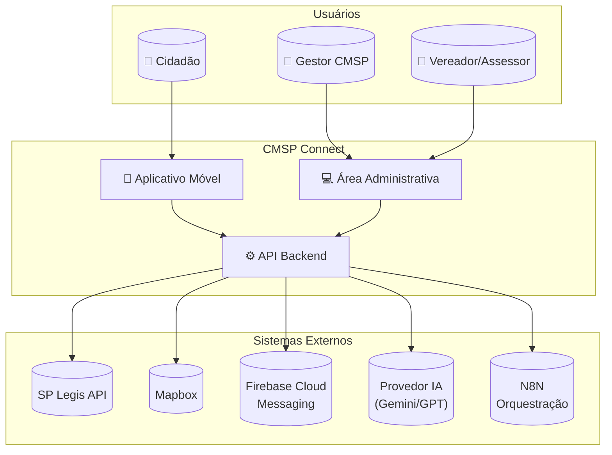

### 3.2 Diagrama de Containers (C4 - Nível 2)

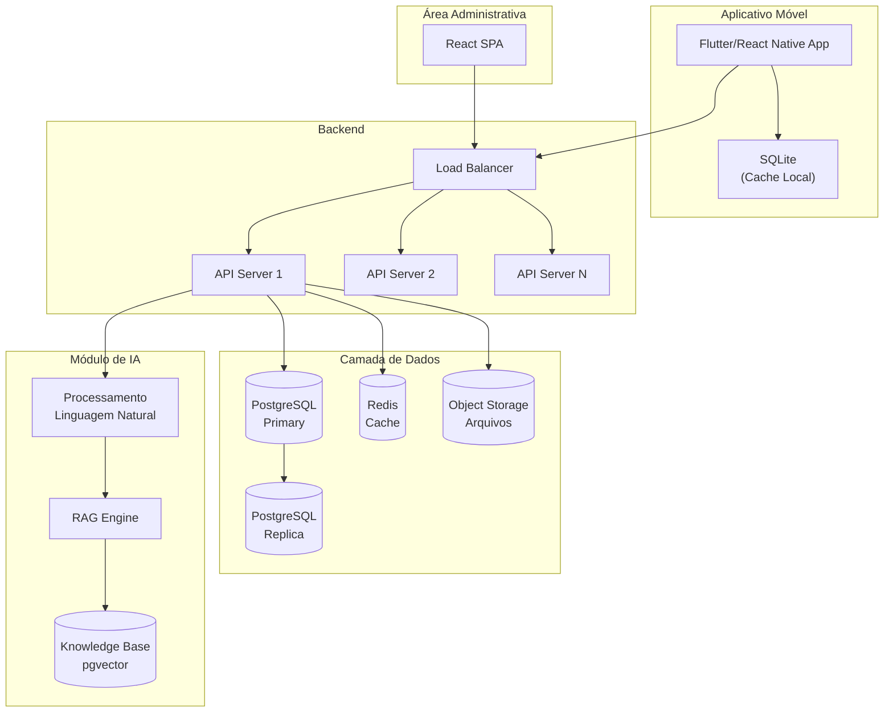

### 3.3 Arquitetura em Camadas

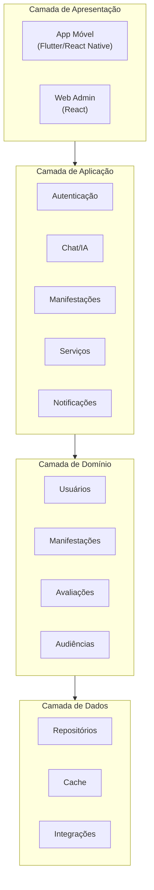

### 3.4 Arquitetura do Módulo de IA

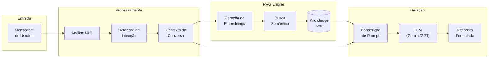

---

## 4. Casos de Uso

### 4.1 Mapa Funcional

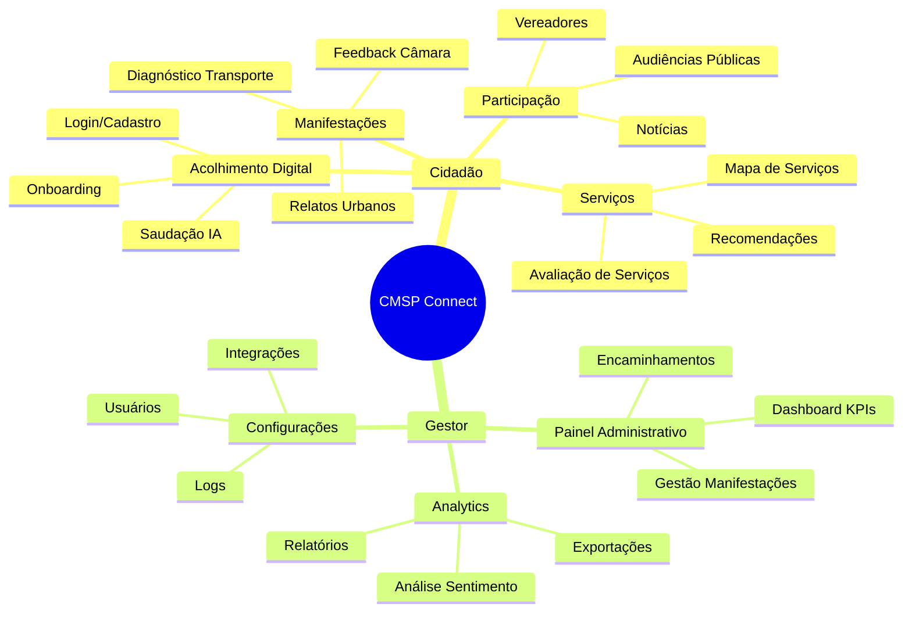

### 4.2 Casos de Uso Principais

| ID | Caso de Uso | Ator Principal | Prioridade |
|----|-------------|----------------|------------|
| CSU001 | Acolhimento Digital com IA | Cidadão | Alta |
| CSU002 | Gestão de Audiências Públicas | Cidadão | Alta |
| CSU003 | Navegação Institucional | Cidadão | Média |
| CSU004 | Avaliação de Serviços Públicos | Cidadão | Alta |
| CSU005 | Diagnóstico de Transporte | Cidadão | Alta |
| CSU006 | Análises Multidimensionais | Gestor | Alta |
| CSU007 | Mapa de Serviços Públicos | Cidadão | Alta |
| CSU008 | Relatos Urbanos via Chatbot | Cidadão | Alta |

### 4.3 Fluxo Principal - Relato Urbano

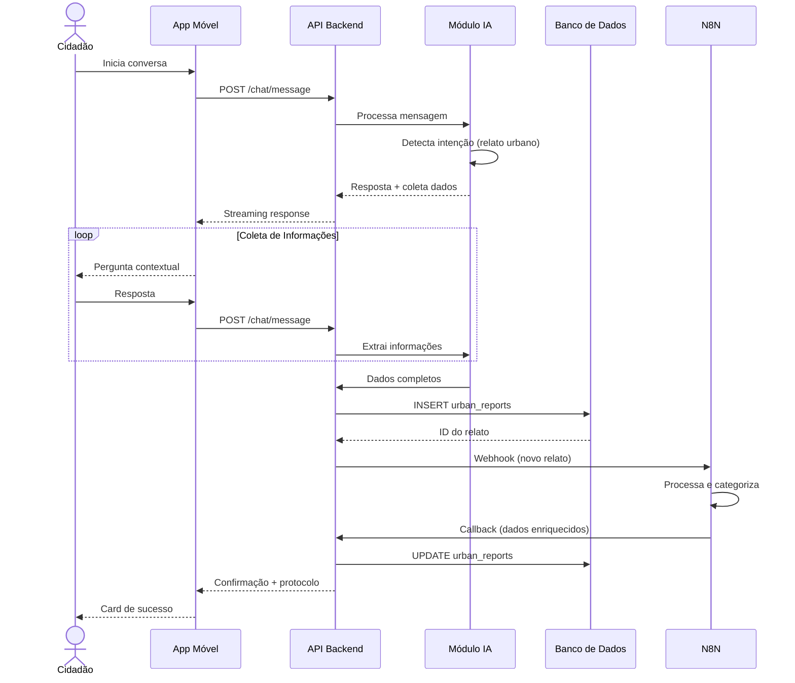

---

## 5. Visão Lógica

### 5.1 Decomposição em Módulos

#### 5.1.1 Aplicativo Móvel

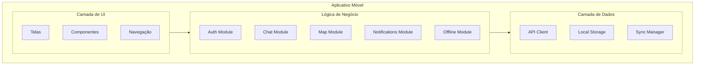

| Módulo | Responsabilidade |
|--------|------------------|
| AUTH | Autenticação, sessão, tokens |
| CHAT | Interface conversacional, histórico |
| MAP | Geolocalização, visualização de serviços |
| NOTIF | Push notifications, alertas |
| OFFLINE | Cache, sincronização, queue de operações |

#### 5.1.2 API Backend

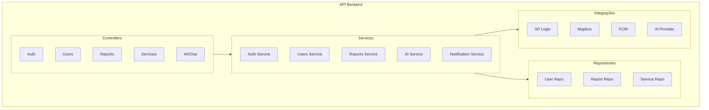

| Módulo | Responsabilidade |
|--------|------------------|
| USERS | Perfis, preferências, demographics |
| REPORTS | Manifestações urbanas, transporte |
| ANALYTICS | Dashboards, métricas, exportações |
| INTEGRATIONS | Conectores externos |
| AI_SVC | Processamento de linguagem, RAG |

### 5.2 Padrões de Design

| Padrão | Aplicação | Justificativa |
|--------|-----------|---------------|
| Repository | Acesso a dados | Abstração da persistência |
| Service Layer | Lógica de negócio | Separação de responsabilidades |
| Observer | Notificações, real-time | Comunicação assíncrona |
| Strategy | Provedores de IA | Flexibilidade de implementação |
| Factory | Criação de objetos | Encapsulamento de complexidade |
| Circuit Breaker | Integrações externas | Resiliência a falhas |

---

## 6. Visão de Dados

### 6.1 Modelo Entidade-Relacionamento

```mermaid
erDiagram
    PROFILES ||--o{ USER_ADDRESSES : "possui"
    PROFILES ||--o| USER_DEMOGRAPHICS : "possui"
    PROFILES ||--o{ USER_INTERESTS : "possui"
    PROFILES ||--o| USER_PREFERENCES : "possui"
    PROFILES ||--o{ URBAN_REPORTS : "cria"
    PROFILES ||--o{ TRANSPORT_REPORTS : "cria"
    PROFILES ||--o{ SERVICE_RATINGS : "avalia"
    PROFILES ||--o{ AI_CONVERSATIONS : "conversa"
    PROFILES ||--o{ NOTIFICATIONS : "recebe"
    
    PUBLIC_SERVICES ||--o{ SERVICE_RATINGS : "recebe"
    PUBLIC_SERVICES ||--o{ SERVICE_VISITS : "registra"
    
    AUDIENCIAS ||--o{ AUDIENCIA_INSCRICOES : "possui"
    PROFILES ||--o{ AUDIENCIA_INSCRICOES : "inscreve"
    
    URBAN_REPORTS ||--o{ URBAN_REPORT_COMMENTS : "possui"
    URBAN_REPORTS ||--o{ URBAN_REPORT_LIKES : "recebe"
    URBAN_REPORTS ||--o{ COUNCIL_MEMBER_REFERRALS : "encaminha"
    
    TRANSPORT_REPORTS ||--o{ TRANSPORT_REPORT_RESPONSES : "possui"
    TRANSPORT_REPORTS ||--o{ COUNCIL_MEMBER_REFERRALS : "encaminha"
    TRANSPORT_REPORTS }o--|| TRANSPORT_LINES : "refere"
    
    PROFILES {
        uuid id PK
        string full_name
        string phone
        string avatar_url
        timestamp created_at
        timestamp updated_at
    }
    
    URBAN_REPORTS {
        uuid id PK
        uuid user_id FK
        string category
        string subcategory
        string description
        string severity
        string status
        float latitude
        float longitude
        string location_address
        json ai_classification
        boolean n8n_processed
        timestamp created_at
    }
    
    TRANSPORT_REPORTS {
        uuid id PK
        uuid user_id FK
        uuid line_id FK
        string report_type
        string severity
        string status
        string description
        date occurrence_date
        string ai_sentiment
        boolean n8n_processed
        timestamp created_at
    }
    
    SERVICE_RATINGS {
        uuid id PK
        uuid user_id FK
        uuid service_id FK
        uuid visit_id FK
        int rating_stars
        string rating_text
        string sentiment
        boolean is_anonymous
        timestamp created_at
    }
    
    PUBLIC_SERVICES {
        uuid id PK
        string name
        enum service_type
        string address
        string district
        float latitude
        float longitude
        float average_rating
        int total_ratings
        json opening_hours
    }
    
    AI_CONVERSATIONS {
        uuid id PK
        uuid user_id FK
        string journey_id
        json messages
        string status
        timestamp last_message_at
    }
    
    AUDIENCIAS {
        uuid id PK
        string titulo
        string tema
        date data
        time hora
        string local
        string status
        boolean inscricoes_abertas
        int vagas_disponiveis
    }
    
    KNOWLEDGE_BASE {
        uuid id PK
        string content
        string content_type
        string title
        vector embedding
        json metadata
    }
```

### 6.2 Dicionário de Dados

#### Entidades Principais

| Entidade | Descrição | Volume Estimado |
|----------|-----------|-----------------|
| profiles | Dados básicos dos usuários | 500.000+ |
| urban_reports | Manifestações urbanas | 50.000/ano |
| transport_reports | Relatos de transporte | 30.000/ano |
| service_ratings | Avaliações de serviços | 100.000/ano |
| public_services | Serviços públicos cadastrados | 5.000 |
| ai_conversations | Histórico de conversas | 1.000.000/ano |
| audiencias | Audiências públicas | 500/ano |
| knowledge_base | Base de conhecimento para RAG | 10.000 |

#### Enumerações

| Enum | Valores |
|------|---------|
| app_role | admin, gestor, vereador, assessor, cidadao |
| service_type | ubs, school, ceu, hospital, library, sports_center, other |
| referral_status | pending, sent, acknowledged, resolved |
| visit_status | pending, completed, expired, skipped |

### 6.3 Estratégia de Persistência

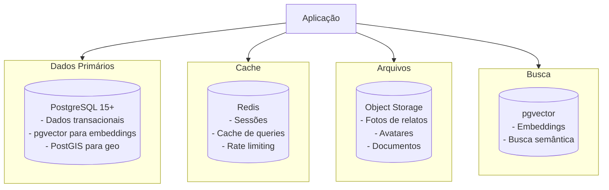

---

## 7. Visão de Implantação

### 7.1 Ambiente de Produção

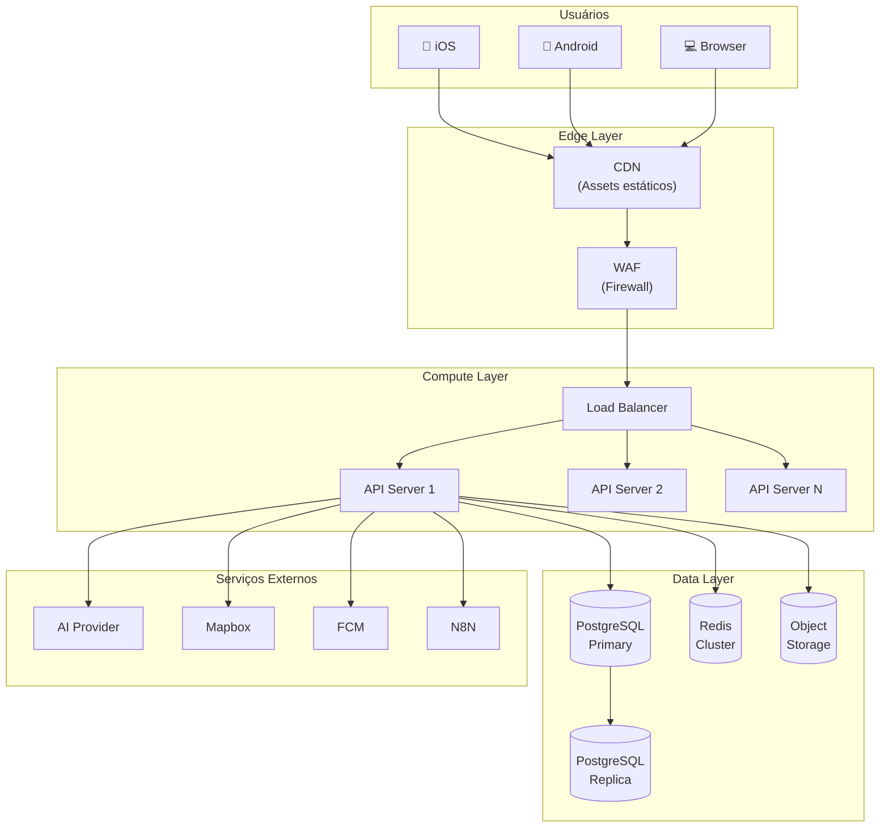

### 7.2 Ambientes

| Ambiente | Propósito | Infraestrutura |
|----------|-----------|----------------|
| Development | Desenvolvimento local | Docker Compose |
| Staging | Testes e homologação | Cluster reduzido |
| Production | Ambiente produtivo | Cluster completo + HA |

### 7.3 Estratégia de Escalabilidade

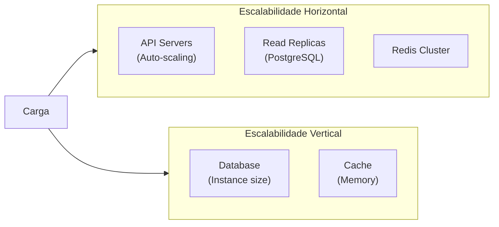

| Componente | Estratégia | Trigger |
|------------|------------|---------|
| API Servers | Auto-scaling horizontal | CPU > 70% ou Latência > 500ms |
| Database | Read replicas + connection pooling | Queries/s > threshold |
| Cache | Cluster mode + sharding | Memory > 80% |
| CDN | Edge locations | Latência geográfica |

---

## 8. Especificação Técnica

### 8.1 Stack Tecnológico

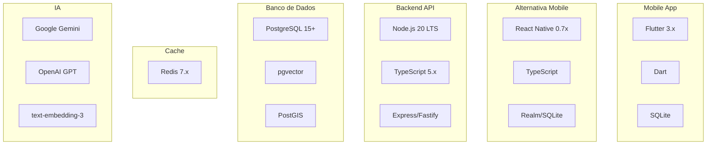

### 8.2 Frameworks e Bibliotecas

#### Mobile (Flutter)

| Categoria | Tecnologia | Versão | Justificativa |
|-----------|------------|--------|---------------|
| Framework | Flutter | 3.x | Cross-platform, performance nativa |
| Linguagem | Dart | 3.x | Tipagem forte, async nativo |
| State Management | Riverpod/BLoC | Latest | Gerenciamento de estado reativo |
| HTTP Client | Dio | Latest | Interceptors, retry, cache |
| Local Storage | Hive/SQLite | Latest | Persistência offline |
| Maps | flutter_map | Latest | Mapas interativos |

#### Mobile (React Native - Alternativa)

| Categoria | Tecnologia | Versão | Justificativa |
|-----------|------------|--------|---------------|
| Framework | React Native | 0.7x | Ecossistema React, comunidade ampla |
| Linguagem | TypeScript | 5.x | Tipagem estática |
| State Management | Zustand/Redux | Latest | Estado global previsível |
| HTTP Client | Axios | Latest | Amplamente adotado |
| Local Storage | MMKV/Realm | Latest | Performance em mobile |
| Maps | react-native-maps | Latest | Mapas nativos |

#### Backend

| Categoria | Tecnologia | Versão | Justificativa |
|-----------|------------|--------|---------------|
| Runtime | Node.js | 20 LTS | Async I/O, ecossistema npm |
| Framework | Express/Fastify | Latest | Maduro, alta performance |
| Linguagem | TypeScript | 5.x | Type safety |
| ORM | Prisma/TypeORM | Latest | Type-safe queries |
| Validation | Zod | Latest | Schema validation |
| Auth | JWT + bcrypt | - | Stateless authentication |

### 8.3 Análise Comparativa: Flutter vs React Native

| Critério | Flutter | React Native | Recomendação |
|----------|---------|--------------|--------------|
| Performance | Excelente (compilação nativa) | Muito boa (bridge otimizado) | Flutter |
| UI Consistency | Alta (widgets próprios) | Média (componentes nativos) | Flutter |
| Ecossistema | Crescente | Maduro | React Native |
| Curva de aprendizado | Dart (nova linguagem) | JavaScript/TypeScript | React Native |
| Hot Reload | Excelente | Excelente | Empate |
| Tamanho do app | ~10-15MB | ~7-12MB | React Native |
| Comunidade | Grande e ativa | Muito grande | React Native |

**Nota:** Ambas as tecnologias são adequadas para o projeto. A escolha final deve considerar a expertise da equipe de desenvolvimento.

---

## 9. Integrações

### 9.1 Mapa de Integrações

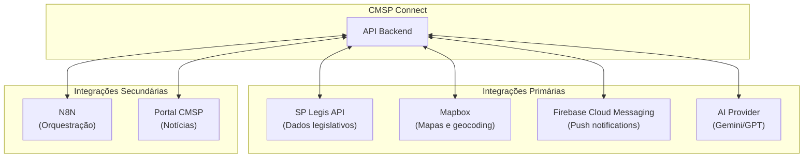

### 9.2 Especificação de Integrações

| Sistema | Tipo | Protocolo | Autenticação | Finalidade |
|---------|------|-----------|--------------|------------|
| SP Legis API | REST | HTTPS | API Key | Dados de vereadores, comissões, projetos |
| Mapbox | REST | HTTPS | Access Token | Geocoding, mapas, direções |
| Firebase Cloud Messaging | REST | HTTPS | Service Account | Push notifications |
| AI Provider (Gemini/GPT) | REST | HTTPS | API Key | Processamento de linguagem natural |
| N8N | Webhook | HTTPS | Secret Key | Orquestração de workflows |

### 9.3 Fluxo de Integração - Manifestação com N8N

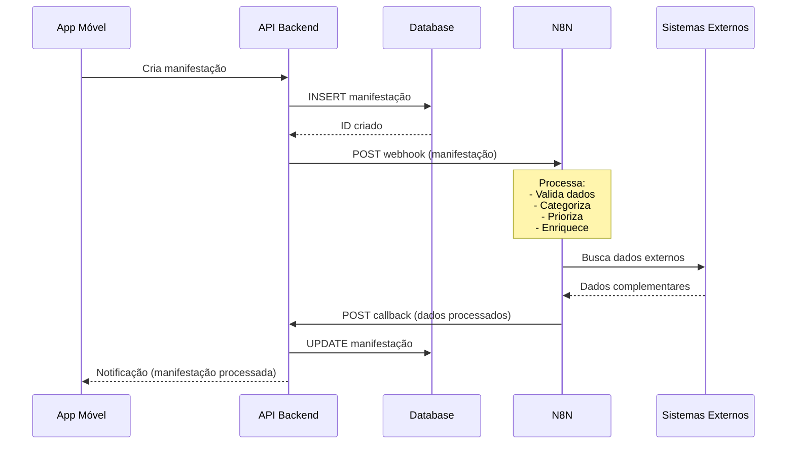

### 9.4 Tratamento de Falhas

| Integração | Estratégia | Fallback |
|------------|------------|----------|
| SP Legis | Retry com exponential backoff | Cache local + dados em memória |
| Mapbox | Circuit breaker | Mapa simplificado + coordenadas brutas |
| FCM | Queue com retry | Notificação in-app |
| AI Provider | Timeout + retry | Respostas pré-definidas |
| N8N | Queue assíncrona | Processamento manual |

---

## 10. Segurança

### 10.1 Modelo de Segurança

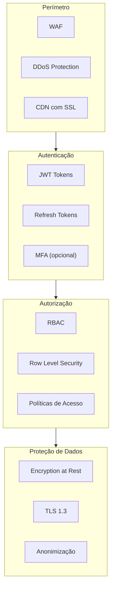

### 10.2 Autenticação

| Aspecto | Implementação |
|---------|---------------|
| Método | JWT (JSON Web Tokens) |
| Algoritmo | RS256 (RSA + SHA-256) |
| Expiração Access Token | 15 minutos |
| Expiração Refresh Token | 7 dias |
| Armazenamento Mobile | Secure Storage (Keychain/Keystore) |
| Logout | Invalidação de refresh token |

### 10.3 Autorização (RBAC)

| Role | Permissões |
|------|------------|
| cidadao | Criar manifestações, avaliar serviços, participar audiências |
| assessor | cidadao + visualizar encaminhamentos do vereador |
| vereador | assessor + responder encaminhamentos |
| gestor | Gerenciar manifestações, analytics, encaminhamentos |
| admin | Acesso total + gerenciar usuários e configurações |

### 10.4 Conformidade LGPD

| Requisito | Implementação |
|-----------|---------------|
| Consentimento | Opt-in explícito no cadastro |
| Direito de Acesso | Exportação de dados pessoais |
| Direito de Retificação | Edição de perfil |
| Direito de Exclusão | Anonimização ou deleção |
| Portabilidade | Exportação em formato estruturado |
| Minimização | Coleta apenas de dados necessários |
| Retenção | Políticas de expiração definidas |

### 10.5 Auditoria

| Evento | Dados Registrados |
|--------|-------------------|
| Login/Logout | user_id, timestamp, IP, user_agent |
| CRUD em dados sensíveis | user_id, action, entity, old_values, new_values |
| Exportações | user_id, export_type, filters, row_count |
| Alterações de permissão | user_id, target_user, old_role, new_role |
| Acesso administrativo | user_id, action, entity_type, entity_id |

---

## 11. Infraestrutura e Ambiente de Produção

### 11.1 Visão Geral da Infraestrutura

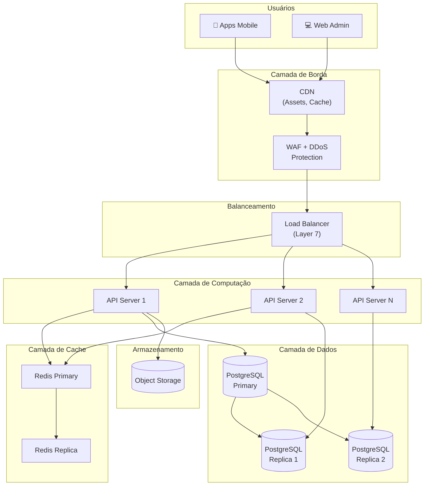

### 11.2 Provedores de Nuvem

| Componente | AWS | Google Cloud | Azure |
|------------|-----|--------------|-------|
| Compute | EC2 / ECS / EKS | Compute Engine / GKE | Virtual Machines / AKS |
| Database | RDS PostgreSQL | Cloud SQL | Azure Database for PostgreSQL |
| Cache | ElastiCache | Memorystore | Azure Cache for Redis |
| Object Storage | S3 | Cloud Storage | Blob Storage |
| CDN | CloudFront | Cloud CDN | Azure CDN |
| Load Balancer | ALB/NLB | Cloud Load Balancing | Application Gateway |
| DNS | Route 53 | Cloud DNS | Azure DNS |
| WAF | AWS WAF | Cloud Armor | Azure WAF |
| Secrets | Secrets Manager | Secret Manager | Key Vault |
| Monitoring | CloudWatch | Cloud Monitoring | Azure Monitor |
| Logs | CloudWatch Logs | Cloud Logging | Log Analytics |

**Nota:** A escolha do provedor deve considerar requisitos de conformidade, custos e expertise da equipe de operações.

### 11.3 Banco de Dados

#### Arquitetura PostgreSQL

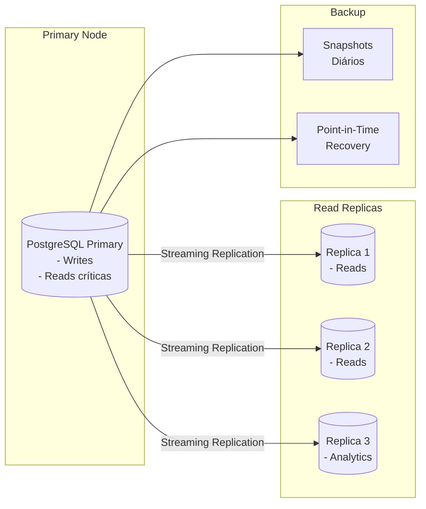

#### Especificações

| Aspecto | Especificação |
|---------|---------------|
| Versão | PostgreSQL 15+ |
| Extensões | pgvector, PostGIS, pg_stat_statements |
| Tamanho inicial | 100GB SSD |
| IOPS | 3000+ |
| Conexões | 200 (com PgBouncer) |
| Replicação | Streaming assíncrona |
| Backup | Diário completo + WAL contínuo |
| Retenção | 30 dias |

### 11.4 Cache e Performance

#### Camadas de Cache

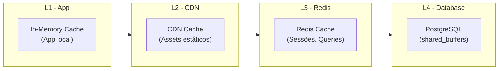

#### Estratégias de Cache

| Tipo de Dado | TTL | Estratégia |
|--------------|-----|------------|
| Sessões de usuário | 15min | Write-through |
| Dados de serviços | 1 hora | Cache-aside |
| Configurações | 24 horas | Cache-aside com invalidação |
| Assets estáticos | 7 dias | CDN |
| Respostas de API (lista) | 5 minutos | Cache-aside |

#### Redis

| Aspecto | Especificação |
|---------|---------------|
| Versão | Redis 7.x |
| Modo | Cluster (3 shards) |
| Memória | 8GB por nó |
| Persistência | AOF + RDB |
| Eviction Policy | allkeys-lru |

### 11.5 CDN

| Conteúdo | TTL | Cache-Control |
|----------|-----|---------------|
| Imagens de assets | 30 dias | public, max-age=2592000 |
| JavaScript/CSS | 1 ano | public, max-age=31536000, immutable |
| Fontes | 1 ano | public, max-age=31536000 |
| Fotos de relatos | 7 dias | public, max-age=604800 |
| API responses | Não cachear | no-store |

### 11.6 Segurança de Rede

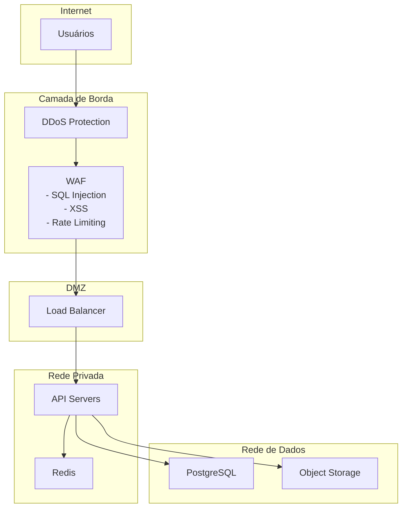

#### Regras de Firewall

| Origem | Destino | Porta | Protocolo | Ação |
|--------|---------|-------|-----------|------|
| Internet | Load Balancer | 443 | HTTPS | Allow |
| Load Balancer | API Servers | 3000 | HTTP | Allow |
| API Servers | PostgreSQL | 5432 | TCP | Allow |
| API Servers | Redis | 6379 | TCP | Allow |
| API Servers | Object Storage | 443 | HTTPS | Allow |
| * | * | * | * | Deny |

#### WAF Rules

| Regra | Descrição | Ação |
|-------|-----------|------|
| SQLi | SQL Injection patterns | Block |
| XSS | Cross-site scripting | Block |
| RFI/LFI | File inclusion | Block |
| Rate Limit | 100 req/min por IP | Throttle |
| Geo Block | Países não autorizados | Block |

### 11.7 Escalabilidade

#### Auto-scaling

| Métrica | Threshold | Ação |
|---------|-----------|------|
| CPU > 70% | 5 min | Scale out (+1 instância) |
| CPU < 30% | 15 min | Scale in (-1 instância) |
| Latência p95 > 500ms | 3 min | Scale out |
| Conexões DB > 80% | 3 min | Scale out |

#### Capacidade Estimada

| Componente | Mínimo | Máximo | Unidade |
|------------|--------|--------|---------|
| API Servers | 2 | 10 | Instâncias |
| PostgreSQL Replicas | 2 | 5 | Instâncias |
| Redis Nodes | 3 | 6 | Nodes |
| Requests/segundo | 1.000 | 10.000 | req/s |
| Usuários simultâneos | 10.000 | 100.000 | Conexões |

### 11.8 Object Storage

#### Estrutura de Buckets

| Bucket | Conteúdo | Acesso | Retenção |
|--------|----------|--------|----------|
| cmsp-avatars | Fotos de perfil | Público (CDN) | Indefinido |
| cmsp-reports | Fotos de relatos | Privado (signed URLs) | 2 anos |
| cmsp-documents | Documentos audiências | Privado | 5 anos |
| cmsp-exports | Exportações de dados | Privado | 30 dias |
| cmsp-backups | Backups de banco | Privado | 90 dias |

#### Lifecycle Policies

| Bucket | Regra | Ação |
|--------|-------|------|
| cmsp-exports | age > 30 days | Delete |
| cmsp-reports | age > 2 years | Archive (Glacier/Coldline) |
| cmsp-backups | age > 90 days | Delete |

### 11.9 Monitoramento e Observabilidade

#### Stack de Monitoramento

| Ferramenta | Finalidade |
|------------|------------|
| Prometheus/Grafana | Métricas e dashboards |
| ELK Stack / Cloud Logging | Logs centralizados |
| Jaeger/Zipkin | Distributed tracing |
| APM (Datadog/New Relic) | Application performance |
| PagerDuty/OpsGenie | Alertas e on-call |
| Uptime Robot/Pingdom | Synthetic monitoring |

#### Dashboards Principais

| Dashboard | Métricas |
|-----------|----------|
| Health Overview | Uptime, error rate, latência p50/p95/p99 |
| API Performance | Requests/s, response time, errors by endpoint |
| Database | Conexões, queries/s, replication lag, disk usage |
| Cache | Hit rate, memory usage, evictions |
| Business | Usuários ativos, manifestações/dia, avaliações |

#### Alertas Críticos

| Alerta | Condição | Severidade | Ação |
|--------|----------|------------|------|
| API Down | Error rate > 50% | Critical | PagerDuty + Slack |
| Database Offline | Connection failed | Critical | PagerDuty + Slack |
| High Latency | p95 > 2s por 5min | Warning | Slack |
| Disk Full | Usage > 85% | Warning | Email + Slack |
| Security Breach | WAF blocks > 1000/min | Critical | PagerDuty |

### 11.10 Disaster Recovery

#### Objetivos

| Métrica | Objetivo | Descrição |
|---------|----------|-----------|
| RPO | 1 hora | Perda máxima de dados |
| RTO | 4 horas | Tempo máximo de recuperação |
| Uptime | 99.5% | Disponibilidade mensal |

#### Procedimentos de Backup

| Componente | Frequência | Tipo | Retenção |
|------------|------------|------|----------|
| PostgreSQL | Contínuo | WAL Archiving | 7 dias |
| PostgreSQL | Diário | Full snapshot | 30 dias |
| Redis | Diário | RDB snapshot | 7 dias |
| Object Storage | Automático | Cross-region replication | Indefinido |
| Configurações | A cada change | Git + versioning | Indefinido |

#### DR Runbook (Resumo)

1. **Detecção**: Alertas automáticos + verificação manual
2. **Declaração**: Incident commander declara DR
3. **Ativação**: Promover replica para primary
4. **DNS**: Atualizar registros para nova infraestrutura
5. **Validação**: Smoke tests + verificação de dados
6. **Comunicação**: Notificar stakeholders
7. **Post-mortem**: Análise de causa raiz

---

## 12. Requisitos Não Funcionais

### 12.1 Performance

| Métrica | Requisito | Medição |
|---------|-----------|---------|
| Tempo de carregamento inicial | < 3s (3G) | First Contentful Paint |
| Tempo de resposta API | < 500ms (p95) | Latência server-side |
| Tempo de resposta Chatbot | < 3s | Primeira resposta |
| Tamanho do app | < 50MB | Download inicial |
| Consumo de bateria | < 5%/hora uso ativo | Medição em dispositivo |

### 12.2 Disponibilidade

| Métrica | Requisito |
|---------|-----------|
| Uptime mensal | 99.5% |
| Downtime máximo programado | 4h/mês (janela de manutenção) |
| RPO (Recovery Point Objective) | 1 hora |
| RTO (Recovery Time Objective) | 4 horas |

### 12.3 Acessibilidade

| Requisito | Padrão |
|-----------|--------|
| Conformidade | WCAG 2.1 Nível AA |
| Contraste mínimo | 4.5:1 (texto normal) |
| Navegação por teclado | Todas as funcionalidades |
| Screen readers | VoiceOver (iOS), TalkBack (Android) |
| Ajuste de fonte | 100% a 200% |
| Redução de movimento | Respeitar preferência do sistema |

### 12.4 Compatibilidade

| Plataforma | Versão Mínima |
|------------|---------------|
| iOS | 14.0 |
| Android | 8.0 (API 26) |
| Browsers (Admin) | Chrome 90+, Firefox 88+, Safari 14+, Edge 90+ |

---

## 13. Registros de Decisão Arquitetural (ADRs)

### ADR-001: Tecnologia Mobile Híbrida

| Aspecto | Descrição |
|---------|-----------|
| **Status** | Aprovado |
| **Contexto** | Necessidade de desenvolver aplicativo para iOS e Android com recursos limitados |
| **Decisão** | Adotar desenvolvimento híbrido com Flutter ou React Native |
| **Alternativas** | (1) Desenvolvimento nativo separado, (2) PWA |
| **Justificativa** | Redução de 40% no esforço de desenvolvimento, single codebase, performance adequada |
| **Consequências** | (+) Time-to-market reduzido, (-) Dependência do framework |

### ADR-002: Arquitetura de Backend

| Aspecto | Descrição |
|---------|-----------|
| **Status** | Aprovado |
| **Contexto** | Definição da arquitetura do backend para suportar o aplicativo |
| **Decisão** | API REST com Node.js/TypeScript, PostgreSQL, Redis |
| **Alternativas** | (1) GraphQL, (2) Microserviços, (3) Serverless puro |
| **Justificativa** | REST é amplamente conhecido, Node.js permite code sharing com React Native, PostgreSQL oferece extensões necessárias (pgvector, PostGIS) |
| **Consequências** | (+) Stack familiar, (-) Overhead de REST para algumas operações |

### ADR-003: Sistema RAG para IA

| Aspecto | Descrição |
|---------|-----------|
| **Status** | Aprovado |
| **Contexto** | Necessidade de respostas contextualizadas com dados da Câmara |
| **Decisão** | Implementar RAG com pgvector para busca semântica |
| **Alternativas** | (1) Fine-tuning de modelo, (2) Prompt engineering simples |
| **Justificativa** | RAG permite atualização dinâmica da base de conhecimento sem retreinamento |
| **Consequências** | (+) Respostas atualizadas, (-) Complexidade de manutenção da knowledge base |

### ADR-004: Orquestração com N8N

| Aspecto | Descrição |
|---------|-----------|
| **Status** | Aprovado |
| **Contexto** | Necessidade de processamento assíncrono de manifestações |
| **Decisão** | Utilizar N8N para orquestração de workflows |
| **Alternativas** | (1) Queue tradicional (RabbitMQ/SQS), (2) Desenvolvimento custom |
| **Justificativa** | N8N oferece interface visual, fácil integração, extensibilidade |
| **Consequências** | (+) Flexibilidade de workflows, (-) Dependência externa |

---

## 14. Glossário

| Termo | Definição |
|-------|-----------|
| Audiência Pública | Sessão aberta para participação popular em discussões legislativas |
| Comissão | Grupo temático de vereadores responsável por áreas específicas |
| Embedding | Representação vetorial de texto para busca semântica |
| Encaminhamento | Direcionamento de manifestação para comissão responsável |
| Knowledge Base | Base de conhecimento estruturada para consulta pela IA |
| LLM | Large Language Model - modelo de linguagem de grande escala |
| Manifestação | Relato, reclamação, sugestão ou elogio registrado por cidadão |
| PWA | Progressive Web App - aplicação web com capacidades offline |
| RAG | Retrieval-Augmented Generation - técnica de IA que combina busca com geração |
| RLS | Row Level Security - segurança a nível de linha no banco de dados |
| SP Legis | Sistema legislativo da Câmara Municipal de São Paulo |
| Sub-agente | Módulo especializado do chatbot para domínios específicos |

---

## 15. Anexos

### Anexo A: Mapa de Telas

```
CMSP Connect
├── 🚀 Splash Screen
├── 👋 Welcome (Onboarding)
│   ├── Slide 1: Voz na Câmara
│   ├── Slide 2: Assistente IA
│   ├── Slide 3: Serviços Próximos
│   └── Slide 4: Transparência
├── 🔐 Autenticação
│   ├── Login
│   ├── Cadastro
│   │   ├── Dados Básicos
│   │   ├── Senha
│   │   ├── Sobre Você (opcional)
│   │   ├── Localização (opcional)
│   │   └── Interesses (opcional)
│   └── Recuperar Senha
├── 🏠 Hub Principal (/ia)
│   ├── Saudação Contextual
│   ├── Feed de Notícias/Eventos
│   ├── Quick Actions
│   └── Chat Input
├── 💬 Jornadas de Chat
│   ├── Tudo Sobre a Câmara (geral)
│   ├── Fala Cidadão! (relatos urbanos)
│   ├── Transporte (diagnóstico)
│   ├── Serviços (mapa e info)
│   └── Avaliar (serviços públicos)
├── 📍 Mapa de Serviços
│   ├── Visualização de Mapa
│   ├── Filtros por Tipo
│   ├── Detalhes do Serviço
│   └── Rotas/Direções
├── 📋 Audiências Públicas
│   ├── Lista de Audiências
│   ├── Detalhes
│   └── Inscrição
├── 📰 Institucional
│   ├── Notícias
│   │   └── Detalhe da Notícia
│   ├── Vereadores
│   │   └── Detalhe do Vereador
│   ├── Agenda CMSP
│   ├── Conheça a Câmara
│   ├── Câmara Explica
│   └── Escola do Parlamento
├── 👤 Perfil
│   ├── Dados Pessoais
│   ├── Endereço
│   ├── Demografia
│   ├── Interesses
│   └── Preferências
├── 🔔 Notificações
├── ⭐ Favoritos
├── ⚙️ Configurações
│   └── Acessibilidade
└── 📊 Área Administrativa
    ├── Dashboard
    ├── Gestão de Manifestações
    │   ├── Urbanas
    │   ├── Transporte
    │   ├── Avaliações
    │   └── Feedback Câmara
    ├── Encaminhamentos
    ├── Analytics
    │   ├── Relatórios
    │   ├── Análise de Sentimento
    │   └── Dashboards Públicos
    ├── Gestão de Usuários
    ├── Logs de Auditoria
    ├── Configurações
    │   ├── Acessibilidade
    │   └── Integração N8N
    └── Logs de Exportação
```

### Anexo B: Checklist de Conformidade

#### LGPD

- [ ] Política de privacidade disponível
- [ ] Consentimento explícito para coleta de dados
- [ ] Mecanismo de exportação de dados pessoais
- [ ] Mecanismo de exclusão de conta
- [ ] Anonimização de dados sensíveis
- [ ] Registro de consentimentos
- [ ] Notificação de vazamentos (procedimento)

#### WCAG 2.1 AA

- [ ] Contraste mínimo 4.5:1
- [ ] Texto redimensionável até 200%
- [ ] Navegação por teclado completa
- [ ] Labels em todos os inputs
- [ ] Alt text em todas as imagens
- [ ] Captions em vídeos
- [ ] Formulários com mensagens de erro claras
- [ ] Timeout ajustável ou desabilitável

### Anexo C: Contatos e Responsáveis

| Função | Responsabilidade |
|--------|------------------|
| Product Owner | Definição de requisitos e priorização |
| Tech Lead | Decisões técnicas e arquiteturais |
| DevOps Lead | Infraestrutura e CI/CD |
| Security Officer | Conformidade e segurança |
| QA Lead | Qualidade e testes |

---

## Histórico de Revisões

| Versão | Data | Autor | Descrição |
|--------|------|-------|-----------|
| 1.0 | Dezembro 2025 | Equipe Técnica | Versão inicial |

---

*Documento gerado como parte do projeto CMSP Connect - Câmara Municipal de São Paulo*
