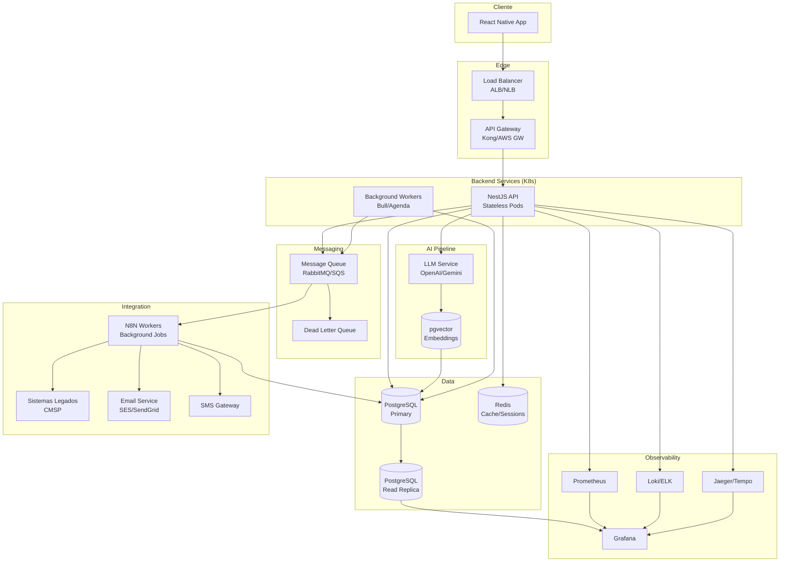
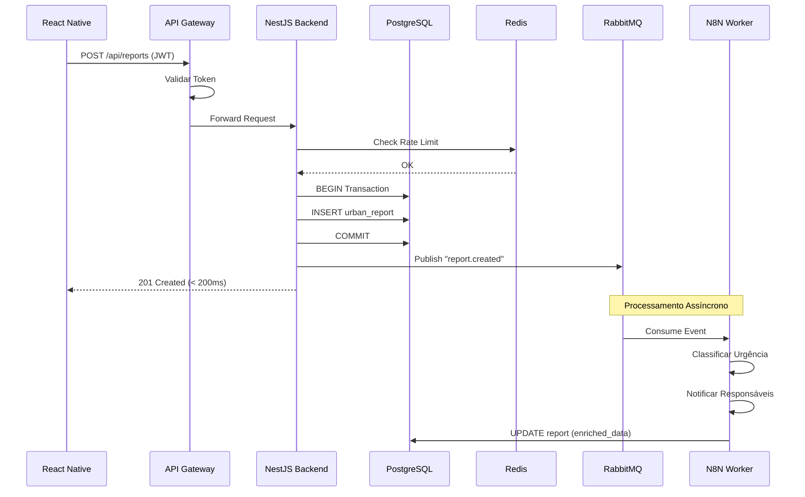
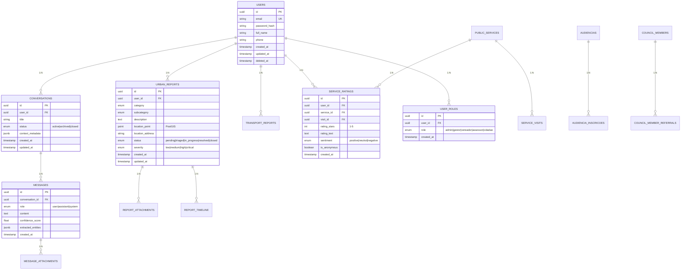
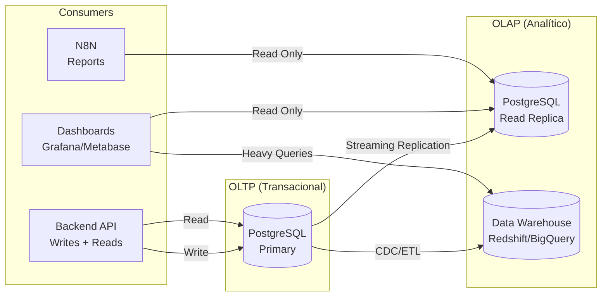
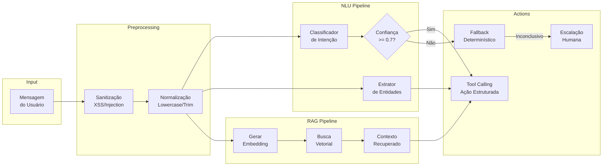
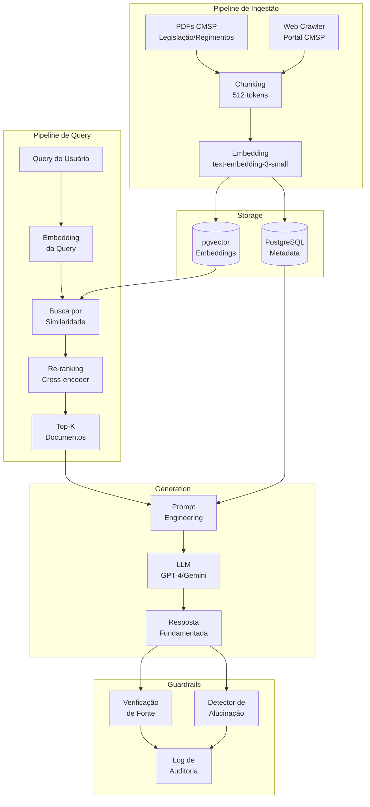
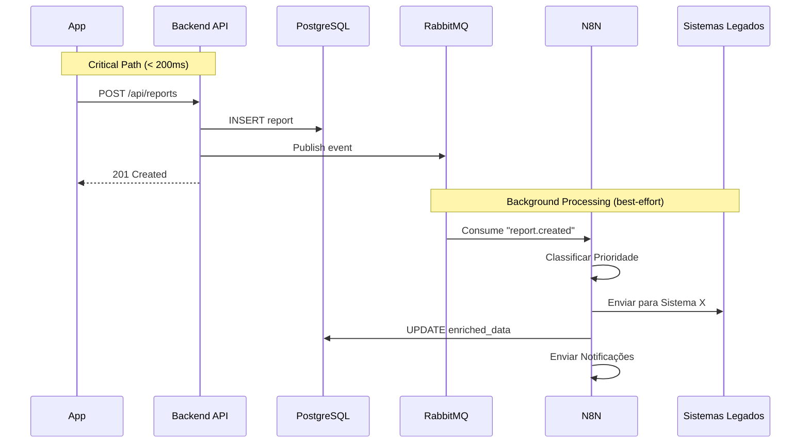
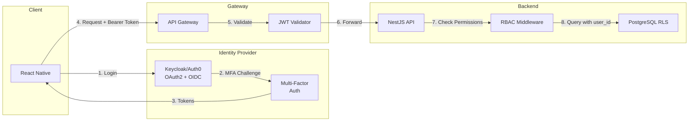
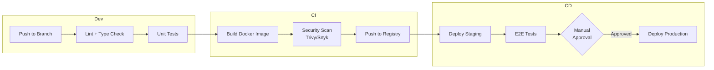

# CMSP Connect - Arquitetura Técnica v2.0

## Documento de Arquitetura de Alto Nível

**Versão:** 2.0  
**Classificação:** Interno - Equipe de Engenharia  
**Última Atualização:** Dezembro 2024

---

## 1. Visão Geral da Solução

O CMSP Connect é uma plataforma de participação cidadã que conecta munícipes aos serviços legislativos da Câmara Municipal de São Paulo. A arquitetura segue princípios de **Event-Driven Architecture (EDA)**, **Separation of Concerns** e **Fail-Fast**, garantindo escalabilidade, manutenibilidade e resiliência.

### 1.1 Camadas Arquiteturais

| Camada | Responsabilidade | Tecnologia |
|--------|------------------|------------|
| **Apresentação** | Interface móvel multiplataforma | React Native + TypeScript |
| **API Gateway** | Roteamento, rate limiting, autenticação | Kong / AWS API Gateway |
| **Backend Core** | Lógica de negócio, processamento síncrono | NestJS (Node.js + TypeScript) |
| **Persistência** | Armazenamento transacional | PostgreSQL (RDS/Azure DB) |
| **Cache** | Sessões, dados frequentes | Redis (ElastiCache) |
| **Mensageria** | Comunicação assíncrona | RabbitMQ / AWS SQS |
| **Orquestração** | Workflows de integração (background) | N8N |
| **IA/ML** | Processamento de linguagem natural | LLM + pgvector (RAG) |

### 1.2 Princípios Arquiteturais

1. **Desacoplamento:** Serviços comunicam-se via eventos, não chamadas síncronas diretas
2. **Idempotência:** Operações podem ser repetidas sem efeitos colaterais
3. **Observabilidade:** Métricas, logs e traces em todas as camadas
4. **Graceful Degradation:** Sistema mantém funcionalidade core mesmo com falhas parciais
5. **Security by Design:** Autenticação/autorização em todas as camadas

---

## 2. Diagrama de Arquitetura

### 2.1 Visão de Alto Nível



### 2.2 Fluxo de Requisição Típico



---

## 3. Stack Tecnológico Decisivo

### 3.1 Frontend Mobile

| Tecnologia | Versão | Justificativa Técnica |
|------------|--------|----------------------|
| **React Native** | 0.73+ | Cross-platform (iOS/Android) com codebase único. Comunidade madura, ecossistema extenso, tipagem estática com TypeScript. Performance near-native via JSI/TurboModules. |
| **TypeScript** | 5.x | Type safety, melhor DX, detecção de erros em compile-time. |
| **React Navigation** | 6.x | Navegação performática, deep linking, gestos nativos. |
| **TanStack Query** | 5.x | Cache de dados, sincronização, offline-first capabilities. |
| **Zustand** | 4.x | Estado global leve, sem boilerplate, performance otimizada. |

### 3.2 Backend Core

| Tecnologia | Versão | Justificativa Técnica |
|------------|--------|----------------------|
| **NestJS** | 10.x | Framework enterprise para Node.js. Arquitetura modular, injeção de dependência, decorators TypeScript, suporte nativo a microservices. |
| **TypeScript** | 5.x | Consistência com frontend, contratos tipados, refactoring seguro. |
| **TypeORM** | 0.3.x | ORM maduro com suporte a migrations, transações, query builder. |
| **Passport.js** | 0.7.x | Estratégias de autenticação modulares (JWT, OAuth2). |
| **class-validator** | 0.14.x | Validação de DTOs com decorators, sanitização de input. |

### 3.3 Persistência e Cache

| Tecnologia | Configuração | Justificativa Técnica |
|------------|--------------|----------------------|
| **PostgreSQL** | 15.x (RDS db.r6g.large) | ACID compliance, extensibilidade (pgvector, PostGIS), maturidade em produção. Configuração Multi-AZ para HA. |
| **pgvector** | 0.5.x | Extensão para embeddings vetoriais. Integração nativa, sem infra adicional para RAG. |
| **PostGIS** | 3.4.x | Dados geoespaciais para `location_point` em relatos. Queries espaciais otimizadas. |
| **Redis** | 7.x (ElastiCache r6g.large) | Cache de sessões (TTL 24h), rate limiting, cache de consultas frequentes (lista de vereadores, audiências). Throughput: 100k ops/s. |

### 3.4 Mensageria e Orquestração

| Tecnologia | Configuração | Justificativa Técnica |
|------------|--------------|----------------------|
| **RabbitMQ** | 3.12.x (Cluster 3 nós) | Message broker com garantia de entrega, DLQ, routing flexível. Alternativa: AWS SQS para menor overhead operacional. |
| **N8N** | Self-hosted (2 workers) | Requisito do cliente para manutenibilidade. Opera **exclusivamente** em background, consumindo eventos da fila. Não participa do critical path. Latência de integração: best-effort, não impacta UX. |

### 3.5 Observabilidade

| Tecnologia | Função | Justificativa Técnica |
|------------|--------|----------------------|
| **OpenTelemetry** | Instrumentação | Padrão aberto para traces, métricas, logs. Vendor-agnostic. |
| **Prometheus** | Métricas | Time-series DB para métricas de sistema. Alertmanager para notificações. |
| **Grafana** | Visualização | Dashboards unificados, alertas, correlação de dados. |
| **Loki** | Logs | Log aggregation escalável, integração nativa com Grafana. |
| **Jaeger** | Traces | Distributed tracing para debug de latência. |

---

## 4. Estratégia de Dados (Modelagem Normalizada)

### 4.1 Princípios de Modelagem

1. **Normalização Estrita:** Terceira Forma Normal (3NF) para dados transacionais
2. **Proibição de JSONB para dados core:** Histórico de chat, avaliações, relatos são tabelas relacionais
3. **Tipos Específicos:** PostGIS para geolocalização, ENUM para status/categorias
4. **Soft Delete:** `deleted_at` para exclusão lógica, preservando auditoria
5. **Timestamps:** `created_at`, `updated_at` em todas as tabelas

### 4.2 Modelo de Dados Principal



### 4.3 Estrutura de Conversas (Normalizada)

```sql
-- Tabela principal de conversas
CREATE TABLE conversations (
    id UUID PRIMARY KEY DEFAULT gen_random_uuid(),
    user_id UUID NOT NULL REFERENCES users(id) ON DELETE CASCADE,
    title VARCHAR(255),
    status VARCHAR(20) DEFAULT 'active' CHECK (status IN ('active', 'archived', 'closed')),
    context_type VARCHAR(50), -- 'urban_report', 'transport', 'general'
    context_reference_id UUID, -- FK para entidade relacionada
    created_at TIMESTAMPTZ DEFAULT NOW(),
    updated_at TIMESTAMPTZ DEFAULT NOW()
);

-- Tabela de mensagens (1:N com conversations)
CREATE TABLE messages (
    id UUID PRIMARY KEY DEFAULT gen_random_uuid(),
    conversation_id UUID NOT NULL REFERENCES conversations(id) ON DELETE CASCADE,
    role VARCHAR(20) NOT NULL CHECK (role IN ('user', 'assistant', 'system')),
    content TEXT NOT NULL,
    confidence_score DECIMAL(3,2), -- 0.00 a 1.00 para respostas da IA
    intent_detected VARCHAR(100),
    entities_extracted JSONB, -- entidades extraídas (mantido como JSONB por ser output de ML)
    tokens_used INTEGER,
    latency_ms INTEGER,
    created_at TIMESTAMPTZ DEFAULT NOW(),
    
    -- Índices para queries frequentes
    INDEX idx_messages_conversation (conversation_id),
    INDEX idx_messages_created (created_at DESC)
);

-- Attachments de mensagens
CREATE TABLE message_attachments (
    id UUID PRIMARY KEY DEFAULT gen_random_uuid(),
    message_id UUID NOT NULL REFERENCES messages(id) ON DELETE CASCADE,
    file_type VARCHAR(50) NOT NULL,
    file_url TEXT NOT NULL,
    file_size_bytes BIGINT,
    created_at TIMESTAMPTZ DEFAULT NOW()
);
```

### 4.4 Estratégia de Leitura (OLTP vs OLAP)



**Separação de Carga:**
- **Primary:** Escritas e leituras transacionais (API)
- **Read Replica:** Dashboards operacionais, queries de N8N
- **Data Warehouse:** Análises históricas, relatórios complexos, ML training

---

## 5. Estratégia de Inteligência Artificial

### 5.1 Pipeline de Processamento de Intenção



### 5.2 Arquitetura RAG (Retrieval-Augmented Generation)



### 5.3 Guardrails e Validação

| Guardrail | Implementação | Ação |
|-----------|---------------|------|
| **Verificação de Fonte** | Toda resposta sobre legislação DEVE citar documento fonte | Rejeitar resposta sem citação |
| **Threshold de Confiança** | Score de similaridade mínimo: 0.75 | Abaixo: responder "Não encontrei informação oficial" |
| **Detector de Alucinação** | Cross-check com base de conhecimento | Flag para revisão humana |
| **Rate Limiting IA** | Max 10 queries/min por usuário | 429 Too Many Requests |
| **Content Filter** | Bloquear conteúdo ofensivo/político | Resposta padrão de recusa |
| **Audit Trail** | Log de todas as queries e respostas | Retenção: 90 dias |

### 5.4 Fallback Determinístico

Quando a confiança da IA é baixa (< 0.7), o sistema aciona uma árvore de decisão:

```typescript
// Pseudocódigo do Fallback
function handleLowConfidence(intent: IntentResult): Response {
  // Árvore de decisão por categoria detectada
  switch (intent.topCategory) {
    case 'urban_report':
      return startGuidedFlow('urban_report_wizard');
    
    case 'transport_issue':
      return startGuidedFlow('transport_report_wizard');
    
    case 'legislation_query':
      return suggestContactChannels(['ouvidoria', 'atendimento']);
    
    default:
      // Último recurso: oferecer menu de opções
      return showMainMenuOptions();
  }
}
```

---

## 6. Papel do N8N (Arquitetura Assíncrona)

### 6.1 Posicionamento Arquitetural

O N8N **NÃO** participa do critical path da requisição do usuário. Sua função é processar eventos em background após a resposta já ter sido enviada ao cliente.



### 6.2 Eventos Consumidos pelo N8N

| Evento | Trigger | Ações do N8N |
|--------|---------|--------------|
| `report.created` | Novo relato urbano/transporte | Classificação ML, notificação responsáveis, integração CMSP |
| `rating.created` | Nova avaliação de serviço | Análise de sentimento, alerta se < 2 estrelas |
| `referral.requested` | Encaminhamento para vereador | Notificar gabinete, criar ticket interno |
| `audiencia.reminder` | 24h antes de audiência | Enviar push/email para inscritos |
| `user.created` | Novo cadastro | Email de boas-vindas, atribuir perfil inicial |

### 6.3 Configuração de Resiliência

```yaml
# Configuração do Worker N8N
queue:
  connection: amqp://rabbitmq:5672
  prefetch: 10
  retry:
    max_attempts: 3
    backoff: exponential
    initial_delay: 1000ms
  dead_letter_queue: n8n.dlq

monitoring:
  healthcheck: /health
  metrics: /metrics (Prometheus format)
```

---

## 7. Segurança e Privacidade

### 7.1 Autenticação e Autorização



### 7.2 Gestão de Tokens

| Tipo | TTL | Armazenamento | Rotação |
|------|-----|---------------|---------|
| **Access Token** | 15 minutos | Memória (não persistir) | A cada request se expirado |
| **Refresh Token** | 7 dias | Secure Storage (Keychain/Keystore) | A cada uso |
| **ID Token** | 1 hora | Memória | Junto com Access Token |

**Rotação de Chaves:**
- Chaves RSA (RS256) com rotação automática a cada 30 dias
- JWKS endpoint público para validação distribuída
- Revogação via blacklist em Redis (TTL = max token lifetime)

### 7.3 Criptografia

| Contexto | Algoritmo | Implementação |
|----------|-----------|---------------|
| **Em Trânsito** | TLS 1.3 | Nginx/ALB termination, mTLS entre serviços |
| **Em Repouso (DB)** | AES-256 | RDS encryption, column-level para PII |
| **Em Repouso (Files)** | AES-256-GCM | S3 SSE-KMS |
| **Hashing Senhas** | Argon2id | cost=3, memory=64MB, parallelism=4 |
| **Anonimização** | SHA-256 + salt | Hash irreversível para dados anônimos |

### 7.4 Compliance LGPD

| Requisito | Implementação |
|-----------|---------------|
| **Consentimento** | Registro em tabela `consent_logs` com timestamp e versão de política |
| **Direito de Acesso** | Endpoint `/api/me/data-export` (JSON/PDF) |
| **Direito ao Esquecimento** | Soft delete + anonimização após 30 dias + hard delete após 1 ano |
| **Portabilidade** | Export em formato interoperável (JSON Schema padronizado) |
| **Minimização** | Coleta apenas dados necessários para funcionalidade |
| **Isolamento de PII** | Schema separado `pii.*` com RLS restritivo |

### 7.5 Row-Level Security (RLS)

```sql
-- Política para cidadãos verem apenas seus próprios dados
CREATE POLICY "users_own_data" ON urban_reports
    FOR ALL
    USING (user_id = current_setting('app.current_user_id')::uuid);

-- Política para gestores verem dados de sua região
CREATE POLICY "gestores_regional" ON urban_reports
    FOR SELECT
    USING (
        EXISTS (
            SELECT 1 FROM user_roles ur
            JOIN user_regions reg ON ur.user_id = reg.user_id
            WHERE ur.user_id = current_setting('app.current_user_id')::uuid
            AND ur.role = 'gestor'
            AND ST_Contains(reg.geometry, urban_reports.location_point)
        )
    );

-- Função security definer para check de roles
CREATE OR REPLACE FUNCTION public.has_role(_user_id uuid, _role app_role)
RETURNS boolean
LANGUAGE sql
STABLE
SECURITY DEFINER
SET search_path = public
AS $$
    SELECT EXISTS (
        SELECT 1 FROM public.user_roles
        WHERE user_id = _user_id AND role = _role
    )
$$;
```

---

## 8. Requisitos Não Funcionais (SLA/SLO)

### 8.1 Objetivos de Nível de Serviço (SLOs)

| Métrica | Target | Medição | Justificativa |
|---------|--------|---------|---------------|
| **Disponibilidade** | 99.5% | Uptime mensal | ~3.6h downtime/mês, adequado para órgão público |
| **Latência P50** | < 100ms | API responses | Experiência fluida para maioria |
| **Latência P95** | < 200ms | API responses | Edge cases aceitáveis |
| **Latência P99** | < 500ms | API responses | Outliers não degradam UX |
| **Error Rate** | < 0.1% | HTTP 5xx / Total | Alta confiabilidade |
| **Throughput** | 1000 req/s | Pico sustentado | Dimensionado para população SP |

### 8.2 Recovery Objectives

| Objetivo | Target | Estratégia |
|----------|--------|------------|
| **RPO (Recovery Point Objective)** | 1 hora | Backups incrementais a cada hora, WAL archiving |
| **RTO (Recovery Time Objective)** | 4 horas | Runbook documentado, infra as code, DR site warm |

### 8.3 Capacidade Estimada

| Recurso | Baseline | Pico | Observações |
|---------|----------|------|-------------|
| **Usuários Ativos** | 10k DAU | 50k | Eventos como audiências públicas |
| **Requests/segundo** | 200 | 1000 | Escalonamento horizontal automático |
| **Armazenamento DB** | 100 GB | 500 GB/ano | Crescimento linear com relatos |
| **Armazenamento Files** | 500 GB | 2 TB/ano | Fotos de relatos urbanos |

### 8.4 Monitoramento e Alertas

```yaml
# Configuração de Alertas (Prometheus)
groups:
  - name: slo_alerts
    rules:
      - alert: HighErrorRate
        expr: rate(http_requests_total{status=~"5.."}[5m]) / rate(http_requests_total[5m]) > 0.001
        for: 5m
        labels:
          severity: critical
        annotations:
          summary: "Error rate acima de 0.1%"

      - alert: HighLatency
        expr: histogram_quantile(0.95, rate(http_request_duration_seconds_bucket[5m])) > 0.2
        for: 5m
        labels:
          severity: warning
        annotations:
          summary: "Latência P95 acima de 200ms"

      - alert: LowAvailability
        expr: up{job="api"} == 0
        for: 1m
        labels:
          severity: critical
        annotations:
          summary: "API indisponível"
```

---

## 9. Estratégia de Deploy e Infraestrutura

### 9.1 Ambientes

| Ambiente | Propósito | Infra | Dados |
|----------|-----------|-------|-------|
| **Development** | Desenvolvimento local | Docker Compose | Fixtures |
| **Staging** | QA e homologação | K8s (1 réplica) | Cópia anonimizada |
| **Production** | Produção | K8s (3+ réplicas, Multi-AZ) | Dados reais |

### 9.2 Pipeline CI/CD



### 9.3 Estratégia de Rollout

- **Canary Deployment:** 5% do tráfego para nova versão, monitorar métricas por 30min
- **Rollback Automático:** Se error rate > 1% ou latência P95 > 500ms
- **Blue-Green:** Para mudanças de schema ou breaking changes

---

## 10. Anexos

### 10.1 Glossário Técnico

| Termo | Definição |
|-------|-----------|
| **Critical Path** | Sequência de operações síncronas que impactam diretamente a latência percebida pelo usuário |
| **RAG** | Retrieval-Augmented Generation - técnica que combina busca vetorial com geração de texto |
| **RLS** | Row-Level Security - políticas de acesso a nível de linha no PostgreSQL |
| **SLO/SLA** | Service Level Objective/Agreement - metas e acordos de nível de serviço |
| **WAL** | Write-Ahead Log - mecanismo de durabilidade do PostgreSQL |

### 10.2 Referências

- [NestJS Documentation](https://docs.nestjs.com/)
- [PostgreSQL 15 Documentation](https://www.postgresql.org/docs/15/)
- [pgvector Extension](https://github.com/pgvector/pgvector)
- [OpenTelemetry Specification](https://opentelemetry.io/docs/)
- [LGPD - Lei Geral de Proteção de Dados](http://www.planalto.gov.br/ccivil_03/_ato2015-2018/2018/lei/l13709.htm)

---

**Documento Técnico - Uso Interno**  
**Equipe de Engenharia - CMSP Connect**
