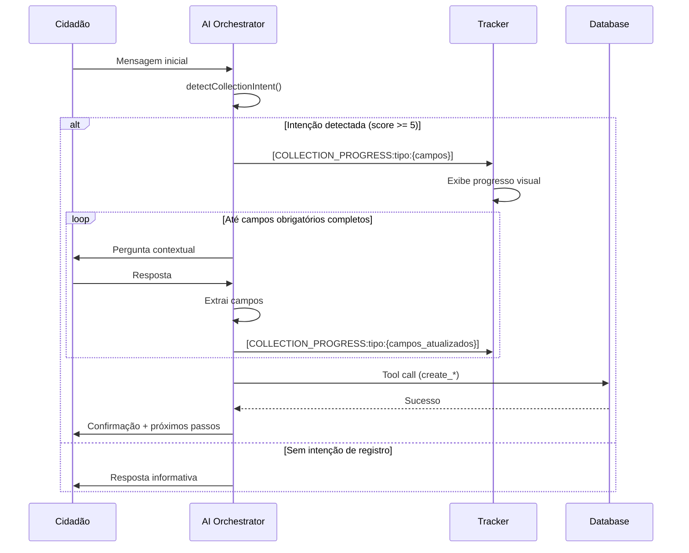

# Documentação: Coleta de Dados Estruturados

> Última atualização: 30/12/2024

Este documento descreve o formato de coleta de dados estruturados para cada tipo de manifestação no CMSP Connect, incluindo campos obrigatórios, opcionais, regras de negócio e validações.

---

## Índice

1. [Visão Geral](#visão-geral)
2. [Relato Urbano (Urban Report)](#1-relato-urbano-urban-report)
3. [Feedback sobre Vereador/Câmara](#2-feedback-sobre-vereadorcâmara)
4. [Relato de Transporte (Transport Report)](#3-relato-de-transporte-transport-report)
5. [Avaliação de Serviço (Service Rating)](#4-avaliação-de-serviço-service-rating)
6. [Regras de Validação Inteligente](#regras-de-validação-inteligente)
7. [Fluxo de Coleta](#fluxo-de-coleta)

---

## Visão Geral

O sistema utiliza um **agente conversacional unificado** que coleta dados de forma natural durante a conversa. O progresso da coleta é exibido visualmente ao cidadão através do componente `DataCollectionTracker`.

### Componentes Envolvidos

| Componente | Arquivo | Responsabilidade |
|------------|---------|------------------|
| DataCollectionTracker | `src/components/ai/DataCollectionTracker.tsx` | Exibe progresso visual dos campos coletados |
| AI Orchestrator | `supabase/functions/ai-orchestrator/index.ts` | Processa mensagens, extrai campos, chama tools |
| Tools | Definidos no AI Orchestrator | Executam ações de registro no banco de dados |

### Tipos de Manifestação

```
urban_report ────┬── Problemas urbanos físicos (buraco, iluminação, lixo)
                 └── Feedback sobre Câmara (category = 'feedback_camara')
                 
transport_report ─── Problemas de transporte público

service_rating ───── Avaliação de serviços públicos municipais
```

---

## 1. Relato Urbano (Urban Report)

Registra problemas físicos na cidade como buracos, iluminação, lixo, calçadas, áreas verdes.

### Campos

| Campo | Label | Tipo | Obrigatório | Valores Aceitos |
|-------|-------|------|-------------|-----------------|
| `category` | Categoria | enum | ✅ Sim | `iluminacao`, `calcada`, `via_publica`, `lixo`, `area_verde`, `feedback_camara`, `outro` |
| `description` | Descrição | string | ✅ Sim | Mínimo 15 caracteres |
| `location_address` | Localização | string | ✅ Sim | Rua, endereço ou ponto de referência |
| `neighborhood` | Bairro | string | ❌ Não | Inferido do endereço quando possível |

### Regras de Negócio

1. **Localização Obrigatória**: O agente NÃO deve finalizar um relato urbano sem coletar localização mínima
2. **Inferência de Categoria**: O agente infere automaticamente a categoria baseado em palavras-chave:
   - "poste", "luz", "escuro" → `iluminacao`
   - "buraco", "asfalto" → `via_publica`
   - "calçada", "passeio" → `calcada`
   - "lixo", "entulho", "sujeira" → `lixo`
   - "árvore", "praça", "poda", "mato" → `area_verde`
3. **Bairro Inferido**: Detectado automaticamente via regex quando cidadão menciona "bairro X", "região Y"

### Exemplo de Coleta

```
Cidadão: "Tem um buraco enorme na Rua Augusta"
→ Campos inferidos: { category: "via_publica", location_address: "Rua Augusta" }
→ Falta: description (mais detalhes)

Agente: "Pode descrever melhor o tamanho e como está afetando a via?"

Cidadão: "É um buraco de uns 50cm que está causando acidentes"
→ Campos completos: { category: "via_publica", location_address: "Rua Augusta", description: "Buraco de 50cm causando acidentes" }
→ Tool chamada: create_urban_report
```

---

## 2. Feedback sobre Vereador/Câmara

Armazenado como `urban_report` com `category = 'feedback_camara'`. Permite elogios, reclamações ou sugestões sobre vereadores ou serviços da Câmara.

### Campos

| Campo | Label | Tipo | Obrigatório | Valores Aceitos |
|-------|-------|------|-------------|-----------------|
| `subcategory` | Tipo | enum | ✅ Sim | `elogio`, `reclamacao`, `sugestao` |
| `council_member_name` | Vereador(a) | string | ❌ Não | Nome COMPLETO validado contra lista oficial |
| `council_member_party` | Partido | string | ❌ Não | Partido do vereador (para desambiguação) |
| `description` | Detalhes | string | ✅ Sim | Detalhes do feedback |

### Regras de Negócio

1. **Validação de Vereador (CRÍTICO)**:
   - Se cidadão mencionar apenas primeiro nome (ex: "José"), o agente DEVE perguntar:
     > "Qual José? Temos José Turin (Republicanos), José Ferreira (MDB)..."
   - O nome deve ser confirmado contra a lista oficial antes de registrar

2. **Lista Oficial de Vereadores** (mantida no AI Orchestrator):
   ```
   Milton Leite (UNIÃO), Rubinho Nunes (UNIÃO), Rodrigo Goulart (PSD),
   Celso Giannazi (PSOL), Soninha Francine (CIDADANIA), Erika Hilton (PSOL),
   Amanda Paschoal (PSOL), Luna Zarattini (PT), Janaína Lima (PP),
   Rinaldi Digilio (REPUBLICANOS), José Turin (REPUBLICANOS), José Ferreira (MDB),
   Juliana Cardoso (PT), Eduardo Suplicy (PT), Rute Costa (PL),
   Thammy Miranda (PL), Ricardo Teixeira (UNIÃO), Eliseu Gabriel (PSB),
   Atílio Francisco (REPUBLICANOS), Eli Corrêa (UNIÃO), Zé Luiz (REPUBLICANOS),
   Professor Toninho Vespoli (PSOL), Sandra Tadeu (PL), Fabio Riva (MDB),
   Senival Moura (PT), Tito Bernardes (PSDB)
   ```

3. **Inferência de Subcategoria**:
   - "elogiar", "agradecer", "parabenizar" → `elogio`
   - "reclamar", "denunciar" → `reclamacao`
   - "sugestão", "sugerir" → `sugestao`

### Exemplo de Coleta

```
Cidadão: "Quero reclamar do vereador José"
→ Campos inferidos: { category: "feedback_camara", subcategory: "reclamacao", council_member_name: "José" }
→ Detecção de ambiguidade: _ambiguous_name = true

Agente: "Qual José? Temos José Turin (Republicanos) ou José Ferreira (MDB)?"

Cidadão: "José Turin"
→ Campos atualizados: { ..., council_member_name: "José Turin", council_member_party: "REPUBLICANOS" }

Agente: "Qual é sua reclamação sobre o vereador José Turin?"

Cidadão: "Ele prometeu ajudar meu bairro e nunca apareceu"
→ Campos completos, tool chamada
```

---

## 3. Relato de Transporte (Transport Report)

Registra problemas no transporte público: ônibus, metrô, CPTM.

### Campos

| Campo | Label | Tipo | Obrigatório | Valores Aceitos |
|-------|-------|------|-------------|-----------------|
| `report_type` | Tipo | enum | ✅ Sim | `atraso`, `lotacao`, `seguranca`, `acessibilidade`, `limpeza`, `outro` |
| `description` | Descrição | string | ✅ Sim | Mínimo 10 caracteres |
| `occurrence_date` | Data | date | ✅ Sim | Formato YYYY-MM-DD |
| `occurrence_time` | Horário | time | ❌ Não | Formato HH:MM |
| `line_code` | Linha | string | ❌ Não | Código da linha (ex: 8022-10, 875A) |
| `location` | Local | string | ❌ Não | Estação, ponto ou trecho |
| `severity` | Gravidade | enum | ❌ Não | `baixa`, `media`, `alta`, `critica` |
| `impact_description` | Impacto | string | ❌ Não | Como afetou a rotina |

### Regras de Negócio

1. **Data Automática**: Se o cidadão disser "hoje" ou não especificar, inferir data atual
2. **Horário Aproximado**:
   - "manhã" ou "cedo" → 08:00
   - "tarde" → 14:00
   - "noite" → 19:00
3. **Inferência de Tipo**:
   - "atraso", "demora", "não passou" → `atraso`
   - "lotado", "cheio", "superlotado" → `lotacao`
   - "assalto", "roubo", "segurança" → `seguranca`
   - "sujo", "fedendo" → `limpeza`
   - "cadeirante", "elevador" → `acessibilidade`
4. **Inferência de Gravidade**:
   - "acidente", "agressão", "ferido" → `critica`
   - "mais de 30 minutos", "horas esperando" → `alta`
   - "20 minutos", "meia hora" → `media`
   - "desconfortável", "chato" → `baixa`
5. **Detecção de Linha**: Regex para formatos como `linha 8022-10`, `linha 875A`

### Exemplo de Coleta

```
Cidadão: "O ônibus 875A atrasou muito hoje de manhã"
→ Campos inferidos: {
    report_type: "atraso",
    occurrence_date: "2024-12-30",
    occurrence_time: "08:00",
    line_code: "875A"
  }
→ Falta: description, severity

Agente: "Quanto tempo esperou? Isso afetou algum compromisso?"

Cidadão: "Esperei 40 minutos e perdi uma entrevista de emprego"
→ Campos completos: {
    ...,
    description: "Esperei 40 minutos e perdi entrevista",
    severity: "alta",
    impact_description: "Perdi entrevista de emprego"
  }
```

---

## 4. Avaliação de Serviço (Service Rating)

Avalia serviços públicos municipais visitados pelo cidadão.

### Campos

| Campo | Label | Tipo | Obrigatório | Valores Aceitos |
|-------|-------|------|-------------|-----------------|
| `service_type` | Tipo | enum | ✅ Sim | `ubs`, `school`, `ceu`, `hospital`, `library`, `sports_center`, `other` |
| `service_name` | Serviço | string | ✅ Sim | Nome do serviço |
| `service_neighborhood` | Bairro | string | ❌ Não | Bairro onde fica o serviço |
| `rating_stars` | Nota | int | ✅ Sim | 1 a 5 estrelas |
| `rating_text` | Comentário | string | ✅ Sim | Mínimo 10 caracteres |
| `sentiment` | Sentimento | enum | ✅ Sim* | `positive`, `neutral`, `negative` |

*O sentiment é **inferido automaticamente** pelo agente com base no rating_text.

### Regras de Negócio

1. **Ordem de Coleta**: Perguntar PRIMEIRO o tipo de serviço, depois nome/bairro
2. **Inferência de Tipo de Serviço**:
   - "UBS", "posto de saúde" → `ubs`
   - "hospital" → `hospital`
   - "escola" → `school`
   - "CEU" → `ceu`
   - "biblioteca" → `library`
   - "centro esportivo" → `sports_center`
3. **Inferência de Sentiment**:
   - "péssimo", "horrível", "ruim", "terrível" → `negative`
   - "bom", "ótimo", "excelente", "muito bom" → `positive`
   - Outros → `neutral`
4. **Detecção de Nota**: Regex para "X estrelas" ou "nota X"
5. **Sugestão de Serviços**: O agente deve sugerir serviços existentes no banco quando possível

### Exemplo de Coleta

```
Cidadão: "Quero avaliar a UBS do meu bairro"
→ Campos inferidos: { service_type: "ubs" }

Agente: "Qual UBS? Qual bairro fica?"

Cidadão: "UBS Jardim Miriam na Zona Sul"
→ Campos atualizados: { service_type: "ubs", service_name: "UBS Jardim Miriam", service_neighborhood: "Zona Sul" }

Agente: "De 1 a 5 estrelas, que nota você dá? Por quê?"

Cidadão: "4 estrelas, atendimento excelente mas demora pra conseguir consulta"
→ Campos completos: {
    ...,
    rating_stars: 4,
    rating_text: "Atendimento excelente mas demora pra conseguir consulta",
    sentiment: "positive"
  }
```

---

## Regras de Validação Inteligente

### Palavras-Chave de Intenção (OBRIGATÓRIAS)

O tracker de coleta só é ativado quando o cidadão demonstra intenção clara. Palavras-chave:

```
quero reclamar, preciso relatar, quero reportar, aconteceu,
tem um problema, está com problema, não está funcionando,
quero avaliar, quero elogiar, quero denunciar, preciso informar,
gostaria de registrar, vim falar sobre um, tenho uma reclamação,
quero fazer, preciso fazer, quero registrar, tive um problema,
sofri um, passei por, enfrentei, reclamar sobre, reclamar do,
agradecer, parabenizar, sugerir, dar uma sugestão
```

### Sistema de Pontuação

Cada tipo de manifestação recebe pontos baseado em palavras-chave detectadas:

| Tipo | Palavras de Domínio (+4 pts) | Palavras de Problema (+2-3 pts) | Threshold |
|------|------------------------------|--------------------------------|-----------|
| Transport | ônibus, metrô, trem, CPTM, estação, terminal | lotado, atraso, demora, não passou, quebrou | 5 pts |
| Urban | buraco, poste, iluminação, lixo, calçada, esgoto | quebrado, apagado, vazando, caindo | 5 pts |
| Service | UBS, hospital, escola, CEU, biblioteca | avaliar, avaliação, nota, atendimento | 5 pts |
| Chamber | vereador, câmara, parlamentar, gabinete, CMSP | elogio, reclamação, sugestão, denunciar | 5 pts |

O tipo com maior pontuação (acima do threshold) é selecionado.

---

## Fluxo de Coleta



---

## Referências

- **DataCollectionTracker**: `src/components/ai/DataCollectionTracker.tsx`
- **AI Orchestrator**: `supabase/functions/ai-orchestrator/index.ts`
- **Tipos Supabase**: `src/integrations/supabase/types.ts`
- **Arquitetura Técnica**: `docs/ARQUITETURA_TECNICA_V2.md`
- **Modelo de Dados**: `docs/MODELO_DADOS_V3.md`
