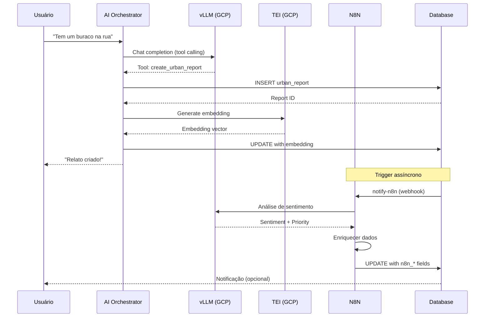

# Comparativo: 2 VMs no GCP vs N8N

**Versão:** 1.0  
**Data:** 2026-01-27  
**Projeto:** Câmara na Mão - Plataforma de Participação Cidadã

---

## Sumário Executivo

Este documento compara duas abordagens arquiteturais para processamento de IA e automação no sistema Câmara na Mão:

1. **2 VMs no GCP**: Infraestrutura self-hosted para LLM (vLLM) e embeddings (TEI)
2. **N8N**: Plataforma de automação de workflows para processamento assíncrono

**Conclusão preliminar**: As duas abordagens são **complementares**, não mutuamente exclusivas. Recomenda-se usar ambas em conjunto para máxima eficiência e redundância.

---

## 1. Visão Geral das Abordagens

### 1.1 2 VMs no GCP (Self-hosted)

**Arquitetura:**
- **VM 1 (llm-chat-gpu)**: vLLM rodando Qwen2.5-7B-Instruct para chat/completions
- **VM 2 (llm-embeddings-cpu)**: Text Embeddings Inference (TEI) rodando BAAI/bge-m3 para embeddings

**Características:**
- Infraestrutura dedicada e controlada
- Processamento síncrono e assíncrono
- Custo fixo mensal (independente de uso)
- Controle total sobre modelos e configurações

### 1.2 N8N (Workflow Automation)

**Arquitetura:**
- Plataforma de automação baseada em workflows visuais
- Processamento assíncrono de relatos
- Integração com múltiplos serviços
- Execução baseada em eventos (webhooks)

**Características:**
- Processamento assíncrono apenas
- Custo variável (baseado em execuções)
- Interface visual para criação de workflows
- Integração nativa com APIs externas

---

## 2. Comparativo Detalhado

### 2.1 Casos de Uso

| Caso de Uso | 2 VMs GCP | N8N | Melhor Opção |
|-------------|-----------|-----|--------------|
| **Chat em tempo real** | ✅ Ideal | ❌ Não adequado | **2 VMs GCP** |
| **Tool calling síncrono** | ✅ Ideal | ❌ Não adequado | **2 VMs GCP** |
| **Enriquecimento de relatos** | ✅ Possível | ✅ Ideal | **N8N** |
| **Processamento em lote** | ✅ Possível | ✅ Ideal | **N8N** |
| **Análise de sentimento** | ✅ Possível | ✅ Ideal | **N8N** |
| **Geração de embeddings** | ✅ Ideal | ❌ Não adequado | **2 VMs GCP** |
| **Priorização automática** | ⚠️ Complexo | ✅ Ideal | **N8N** |
| **Integração com APIs externas** | ⚠️ Requer código | ✅ Ideal | **N8N** |
| **Notificações e alertas** | ⚠️ Requer código | ✅ Ideal | **N8N** |
| **RAG (Retrieval Augmented Generation)** | ✅ Ideal | ❌ Não adequado | **2 VMs GCP** |

### 2.2 Performance e Latência

| Métrica | 2 VMs GCP | N8N | Vencedor |
|---------|-----------|-----|-----------|
| **Latência de chat** | 1-3 segundos | N/A (assíncrono) | **2 VMs GCP** |
| **Throughput de embeddings** | ~100 req/s | N/A | **2 VMs GCP** |
| **Processamento paralelo** | Limitado por GPU | ✅ Ilimitado | **N8N** |
| **Tempo de resposta (assíncrono)** | 5-30 segundos | 2-10 segundos | **N8N** |
| **Escalabilidade horizontal** | ⚠️ Manual | ✅ Automática | **N8N** |

### 2.3 Custos

#### 2 VMs no GCP (Custo Fixo Mensal)

**VM 1 - Chat (GPU):**
- Tipo: `n1-standard-4` + NVIDIA T4
- Região: `us-central1-b`
- Preemptible: Sim
- **Custo estimado**: ~$150-200/mês (preemptible) ou ~$300-400/mês (não preemptible)

**VM 2 - Embeddings (CPU):**
- Tipo: `e2-standard-4`
- Região: `southamerica-east1-b`
- **Custo estimado**: ~$50-80/mês

**Total estimado**: **$200-280/mês** (preemptible) ou **$350-480/mês** (não preemptible)

**Vantagens de custo:**
- ✅ Custo fixo previsível
- ✅ Sem custos por requisição
- ✅ Ideal para alto volume (1000+ conversas/dia)

**Desvantagens de custo:**
- ❌ Custo mesmo sem uso
- ❌ Requer gerenciamento de infraestrutura

#### N8N (Custo Variável)

**N8N Cloud:**
- Plano Starter: ~$20/mês (até 5.000 execuções)
- Plano Pro: ~$50/mês (até 20.000 execuções)
- Plano Enterprise: Customizado

**N8N Self-hosted:**
- Custo de infraestrutura (VM ou container)
- Estimativa: ~$30-50/mês para VM básica

**Vantagens de custo:**
- ✅ Paga apenas pelo que usa
- ✅ Escala automaticamente
- ✅ Ideal para baixo/médio volume

**Desvantagens de custo:**
- ❌ Custo cresce com volume
- ❌ Pode ficar caro em alto volume

### 2.4 Manutenção e Operação

| Aspecto | 2 VMs GCP | N8N | Vencedor |
|---------|-----------|-----|----------|
| **Configuração inicial** | ⚠️ Complexa (Docker, drivers, etc.) | ✅ Simples (UI visual) | **N8N** |
| **Atualização de modelos** | ⚠️ Requer restart/redeploy | ✅ Via UI ou API | **N8N** |
| **Monitoramento** | ⚠️ Requer setup (Cloud Monitoring) | ✅ Dashboard nativo | **N8N** |
| **Logs e debugging** | ⚠️ Docker logs + Cloud Logging | ✅ Interface visual | **N8N** |
| **Backup e recuperação** | ⚠️ Manual (snapshots) | ✅ Automático (n8n.cloud) | **N8N** |
| **Escalabilidade** | ⚠️ Manual (criar novas VMs) | ✅ Automática | **N8N** |
| **Controle de versão** | ✅ Git + Docker | ⚠️ Export/import JSON | **2 VMs GCP** |

### 2.5 Segurança e Compliance

| Aspecto | 2 VMs GCP | N8N | Vencedor |
|---------|-----------|-----|----------|
| **Dados não saem do GCP** | ✅ Total controle | ⚠️ Depende da configuração | **2 VMs GCP** |
| **Compliance (LGPD)** | ✅ Dados no Brasil (se configurado) | ⚠️ Depende da região | **2 VMs GCP** |
| **Autenticação** | ✅ API keys + firewall | ✅ Secret keys + HTTPS | **Empate** |
| **Isolamento** | ✅ VMs dedicadas | ⚠️ Compartilhado (cloud) | **2 VMs GCP** |
| **Auditoria** | ✅ Cloud Logging completo | ✅ Logs de execução | **Empate** |

### 2.6 Flexibilidade e Customização

| Aspecto | 2 VMs GCP | N8N | Vencedor |
|---------|-----------|-----|----------|
| **Escolha de modelos** | ✅ Qualquer modelo compatível | ⚠️ Limitado a APIs disponíveis | **2 VMs GCP** |
| **Fine-tuning** | ✅ Possível (com infra adicional) | ❌ Não suportado | **2 VMs GCP** |
| **Customização de prompts** | ✅ Total controle | ✅ Via workflows | **Empate** |
| **Integração com serviços** | ⚠️ Requer código | ✅ 400+ integrações nativas | **N8N** |
| **Lógica de negócio complexa** | ⚠️ Requer desenvolvimento | ✅ Visual + Code nodes | **N8N** |

### 2.7 Confiabilidade e Disponibilidade

| Aspecto | 2 VMs GCP | N8N | Vencedor |
|---------|-----------|-----|----------|
| **Uptime** | ⚠️ Depende de manutenção | ✅ 99.9% (n8n.cloud) | **N8N** |
| **Preemptible VMs** | ⚠️ Podem ser interrompidas | ✅ Sempre disponível | **N8N** |
| **Fallback automático** | ⚠️ Requer configuração | ✅ Retry nativo | **N8N** |
| **Recuperação de falhas** | ⚠️ Manual | ✅ Automática | **N8N** |
| **Redundância** | ⚠️ Requer múltiplas VMs | ✅ Incluído (cloud) | **N8N** |

---

## 3. Análise por Cenário de Uso

### 3.1 Cenário 1: Chat em Tempo Real (Síncrono)

**Requisitos:**
- Resposta em < 3 segundos
- Tool calling em tempo real
- Contexto de conversa mantido

**Análise:**

| Abordagem | Adequação | Justificativa |
|-----------|-----------|---------------|
| **2 VMs GCP** | ✅ **Ideal** | Latência baixa, controle total, sem dependências externas |
| **N8N** | ❌ **Não adequado** | Assíncrono por natureza, latência alta para chat |

**Recomendação**: Usar **2 VMs GCP** para chat em tempo real.

### 3.2 Cenário 2: Enriquecimento de Relatos (Assíncrono)

**Requisitos:**
- Processamento após criação do relato
- Análise de sentimento
- Priorização automática
- Enriquecimento com tags

**Análise:**

| Abordagem | Adequação | Justificativa |
|-----------|-----------|---------------|
| **2 VMs GCP** | ⚠️ **Possível mas complexo** | Requer desenvolvimento de workers, filas, retry logic |
| **N8N** | ✅ **Ideal** | Workflows visuais, retry automático, integração fácil |

**Recomendação**: Usar **N8N** para enriquecimento assíncrono.

### 3.3 Cenário 3: Geração de Embeddings (RAG)

**Requisitos:**
- Embeddings de alta qualidade
- Processamento em lote
- Integração com pgvector

**Análise:**

| Abordagem | Adequação | Justificativa |
|-----------|-----------|---------------|
| **2 VMs GCP** | ✅ **Ideal** | TEI otimizado para embeddings, controle total |
| **N8N** | ❌ **Não adequado** | Não tem suporte nativo para embeddings, requer API externa |

**Recomendação**: Usar **2 VMs GCP** para embeddings.

### 3.4 Cenário 4: Processamento em Lote

**Requisitos:**
- Processar múltiplos relatos simultaneamente
- Priorização inteligente
- Integração com múltiplos serviços

**Análise:**

| Abordagem | Adequação | Justificativa |
|-----------|-----------|---------------|
| **2 VMs GCP** | ⚠️ **Possível mas limitado** | Requer desenvolvimento de sistema de filas |
| **N8N** | ✅ **Ideal** | Processamento paralelo nativo, escalabilidade automática |

**Recomendação**: Usar **N8N** para processamento em lote.

---

## 4. Arquitetura Híbrida Recomendada

### 4.1 Visão Geral

A arquitetura híbrida combina o melhor dos dois mundos:

```
┌─────────────────────────────────────────────────────────────┐
│                    FRONTEND (React/Mobile)                   │
└───────────────────────────┬───────────────────────────────────┘
                            │
                            ▼
┌─────────────────────────────────────────────────────────────┐
│              AI ORCHESTRATOR (Edge Function)                │
│              ┌─────────────────────────────────┐            │
│              │  Chat Síncrono (Tempo Real)     │            │
│              │  Tool Calling                   │            │
│              │  RAG (Embeddings)               │            │
│              └─────────────────────────────────┘            │
└───────────────┬───────────────────────┬─────────────────────┘
                │                       │
                ▼                       ▼
    ┌───────────────────┐    ┌───────────────────┐
    │   2 VMs GCP       │    │      N8N          │
    │                   │    │                   │
    │  • vLLM (Chat)    │    │  • Enriquecimento │
    │  • TEI (Embed)    │    │  • Análise        │
    │  • RAG            │    │  • Priorização    │
    │  • Tool Calling   │    │  • Notificações   │
    └───────────────────┘    └───────────────────┘
```

### 4.2 Divisão de Responsabilidades

#### 2 VMs GCP (Síncrono e RAG)

**Responsabilidades:**
- ✅ Chat em tempo real
- ✅ Tool calling síncrono
- ✅ Geração de embeddings
- ✅ RAG (Retrieval Augmented Generation)
- ✅ Classificação de categorias em tempo real

**Quando usar:**
- Interações que requerem resposta imediata
- Operações que precisam de contexto de conversa
- Geração de embeddings para busca semântica

#### N8N (Assíncrono e Automação)

**Responsabilidades:**
- ✅ Enriquecimento de relatos após criação
- ✅ Análise de sentimento em lote
- ✅ Priorização automática
- ✅ Integração com APIs externas
- ✅ Notificações e alertas
- ✅ Processamento em lote

**Quando usar:**
- Operações que podem ser processadas após a criação
- Workflows complexos com múltiplas etapas
- Integrações com serviços externos
- Processamento que não requer resposta imediata

### 4.3 Fluxo Híbrido Completo



---

## 5. Prós e Contras Detalhados

### 5.1 2 VMs no GCP

#### ✅ Prós

1. **Controle Total**
   - Escolha de modelos (qualquer modelo compatível com vLLM)
   - Configuração personalizada de parâmetros
   - Fine-tuning possível (com infra adicional)

2. **Performance**
   - Latência baixa para chat (< 3 segundos)
   - Throughput alto para embeddings
   - Sem limites de rate (exceto hardware)

3. **Custo Previsível**
   - Custo fixo mensal
   - Sem surpresas de faturamento
   - Ideal para alto volume (1000+ conversas/dia)

4. **Privacidade e Compliance**
   - Dados não saem do GCP
   - Controle total sobre localização dos dados
   - Compliance com LGPD (se configurado no Brasil)

5. **Independência**
   - Não depende de serviços externos
   - Funciona mesmo se Lovable/n8n estiver offline
   - Sem vendor lock-in

6. **RAG Otimizado**
   - TEI otimizado especificamente para embeddings
   - Integração direta com pgvector
   - Processamento em lote eficiente

#### ❌ Contras

1. **Complexidade de Manutenção**
   - Requer conhecimento de Docker, NVIDIA drivers, vLLM
   - Atualizações de modelos requerem restart
   - Monitoramento requer setup adicional

2. **Custo Fixo**
   - Custo mesmo sem uso
   - Preemptible VMs podem ser interrompidas
   - Não preemptible é mais caro

3. **Escalabilidade Limitada**
   - Escalabilidade horizontal requer criação manual de VMs
   - GPU é recurso limitado e caro
   - Não escala automaticamente

4. **Desenvolvimento Necessário**
   - Integrações requerem código
   - Lógica de negócio complexa requer desenvolvimento
   - Sem interface visual para configuração

5. **Infraestrutura**
   - Requer gerenciamento de VMs, firewalls, backups
   - Monitoramento e alertas precisam ser configurados
   - Recuperação de falhas é manual

### 5.2 N8N

#### ✅ Prós

1. **Facilidade de Uso**
   - Interface visual para criação de workflows
   - Sem necessidade de código para workflows simples
   - Configuração rápida e intuitiva

2. **Integrações Nativas**
   - 400+ integrações pré-configuradas
   - Conectores para APIs populares
   - Suporte a webhooks nativo

3. **Escalabilidade Automática**
   - Escala automaticamente com volume
   - Processamento paralelo ilimitado
   - Sem necessidade de gerenciar infraestrutura

4. **Confiabilidade**
   - 99.9% uptime (n8n.cloud)
   - Retry automático em caso de falha
   - Recuperação automática

5. **Custo Variável**
   - Paga apenas pelo que usa
   - Ideal para baixo/médio volume
   - Sem custos de infraestrutura (cloud)

6. **Monitoramento Nativo**
   - Dashboard visual de execuções
   - Logs detalhados de cada workflow
   - Alertas configuráveis

7. **Flexibilidade de Workflows**
   - Lógica complexa via Code nodes
   - Condicionais e loops visuais
   - Fácil modificação e iteração

#### ❌ Contras

1. **Assíncrono Apenas**
   - Não adequado para chat em tempo real
   - Latência alta para interações síncronas
   - Requer webhook/callback pattern

2. **Custo Variável**
   - Custo cresce com volume
   - Pode ficar caro em alto volume
   - Sem controle sobre custos fixos

3. **Dependência Externa**
   - Depende de n8n.cloud ou infraestrutura própria
   - Vendor lock-in (formato de workflows)
   - Dados podem sair do GCP (dependendo da configuração)

4. **Limitações de Modelos**
   - Limitado a APIs disponíveis
   - Não suporta fine-tuning
   - Depende de provedores externos para IA

5. **Performance**
   - Latência maior que self-hosted
   - Throughput limitado por plano
   - Não otimizado para embeddings

6. **Compliance**
   - Dados podem sair do GCP (dependendo da região)
   - Requer configuração cuidadosa para LGPD
   - Auditoria pode ser limitada

---

## 6. Recomendações por Volume de Uso

### 6.1 Baixo Volume (< 100 conversas/dia)

**Recomendação**: **N8N apenas** (com Lovable AI como fallback)

**Justificativa:**
- Custo variável é mais econômico
- Não justifica custo fixo de VMs
- N8N atende todas as necessidades

**Configuração:**
- N8N para processamento assíncrono
- Lovable AI Gateway para chat (via `LOVABLE_API_KEY`)
- Sem VMs no GCP

**Custo estimado**: $20-50/mês

### 6.2 Médio Volume (100-500 conversas/dia)

**Recomendação**: **N8N + 1 VM GCP (Chat apenas)**

**Justificativa:**
- Custo ainda gerenciável
- Melhor latência para chat
- N8N para processamento assíncrono

**Configuração:**
- 1 VM GCP (vLLM) para chat síncrono
- N8N para enriquecimento assíncrono
- Lovable AI como fallback

**Custo estimado**: $200-250/mês

### 6.3 Alto Volume (500-1000+ conversas/dia)

**Recomendação**: **2 VMs GCP + N8N (Híbrido Completo)**

**Justificativa:**
- Custo fixo é mais econômico que variável
- Performance otimizada
- Redundância e fallback

**Configuração:**
- 2 VMs GCP (vLLM + TEI) para chat e embeddings
- N8N para enriquecimento assíncrono
- Lovable AI como fallback secundário

**Custo estimado**: $250-350/mês

---

## 7. Matriz de Decisão

Use esta matriz para decidir qual abordagem usar:

| Critério | Peso | 2 VMs GCP | N8N | Vencedor |
|----------|------|-----------|-----|----------|
| **Latência de chat** | Alto | 9/10 | 2/10 | **2 VMs GCP** |
| **Custo (alto volume)** | Alto | 8/10 | 4/10 | **2 VMs GCP** |
| **Facilidade de uso** | Médio | 4/10 | 9/10 | **N8N** |
| **Escalabilidade** | Médio | 5/10 | 9/10 | **N8N** |
| **Controle e privacidade** | Alto | 10/10 | 6/10 | **2 VMs GCP** |
| **Integrações** | Médio | 4/10 | 10/10 | **N8N** |
| **Manutenção** | Médio | 5/10 | 8/10 | **N8N** |
| **Confiabilidade** | Alto | 7/10 | 9/10 | **N8N** |

**Pontuação Total:**
- **2 VMs GCP**: 48/80 (60%)
- **N8N**: 57/80 (71%)

**Conclusão**: Para a maioria dos casos, **N8N é mais adequado**, mas para chat em tempo real e alto volume, **2 VMs GCP são essenciais**.

---

## 8. Arquitetura Recomendada Final

### 8.1 Para o Projeto Câmara na Mão

**Recomendação**: **Arquitetura Híbrida**

```
┌─────────────────────────────────────────────────────────────┐
│                    CAMADA DE APLICAÇÃO                      │
│  Frontend Web + Mobile App                                  │
└───────────────────────────┬─────────────────────────────────┘
                            │
                            ▼
┌─────────────────────────────────────────────────────────────┐
│              AI ORCHESTRATOR (Edge Function)                │
│  • Chat síncrono                                            │
│  • Tool calling                                             │
│  • RAG (com embeddings)                                     │
└───────────────┬───────────────────────┬─────────────────────┘
                │                       │
        ┌───────┴────────┐      ┌──────┴────────┐
        │                │      │               │
        ▼                ▼      ▼               ▼
┌──────────────┐  ┌──────────────┐  ┌──────────────────┐
│  vLLM (GCP) │  │  TEI (GCP)   │  │  N8N Workflows    │
│             │  │              │  │                   │
│  • Chat     │  │  • Embeddings│  │  • Enriquecimento │
│  • Tool     │  │  • RAG       │  │  • Análise        │
│  • RAG      │  │              │  │  • Priorização    │
└──────┬──────┘  └──────┬───────┘  └────────┬──────────┘
       │                │                    │
       └────────────────┴────────────────────┘
                        │
                        ▼
              ┌──────────────────┐
              │  Lovable AI      │
              │  (Fallback)      │
              └──────────────────┘
```

### 8.2 Divisão de Responsabilidades

#### Síncrono (2 VMs GCP)
- ✅ Chat em tempo real
- ✅ Tool calling
- ✅ Geração de embeddings
- ✅ RAG (busca semântica)
- ✅ Classificação de categorias

#### Assíncrono (N8N)
- ✅ Enriquecimento de relatos
- ✅ Análise de sentimento
- ✅ Priorização automática
- ✅ Integração com APIs externas
- ✅ Notificações e alertas

#### Fallback (Lovable AI)
- ✅ Backup quando vLLM está offline
- ✅ Redundância para alta disponibilidade
- ✅ Desenvolvimento/testes

### 8.3 Fluxo de Dados Recomendado

1. **Usuário envia mensagem** → AI Orchestrator
2. **AI Orchestrator** → vLLM (chat síncrono)
3. **vLLM retorna** → Tool calling ou resposta
4. **Se tool criar relato** → Database + Trigger
5. **Trigger** → N8N (webhook)
6. **N8N processa** → vLLM (análise) → Callback
7. **Callback atualiza** → Database
8. **Frontend recebe** → Atualização via Realtime

---

## 9. Custos Comparativos por Volume

### 9.1 Baixo Volume (100 conversas/dia)

| Abordagem | Custo Mensal | Observações |
|-----------|--------------|-------------|
| **N8N apenas** | $20-50 | Mais econômico |
| **2 VMs GCP** | $200-280 | Custo fixo alto |
| **Híbrido** | $220-330 | Overhead desnecessário |

**Recomendação**: **N8N apenas**

### 9.2 Médio Volume (500 conversas/dia)

| Abordagem | Custo Mensal | Observações |
|-----------|--------------|-------------|
| **N8N apenas** | $50-150 | Custo cresce com volume |
| **2 VMs GCP** | $200-280 | Custo fixo, melhor performance |
| **Híbrido** | $250-350 | Melhor custo-benefício |

**Recomendação**: **Híbrido (1 VM + N8N)**

### 9.3 Alto Volume (1000+ conversas/dia)

| Abordagem | Custo Mensal | Observações |
|-----------|--------------|-------------|
| **N8N apenas** | $150-500+ | Custo pode explodir |
| **2 VMs GCP** | $200-280 | Custo fixo, melhor ROI |
| **Híbrido** | $250-350 | Redundância e performance |

**Recomendação**: **Híbrido Completo (2 VMs + N8N)**

---

## 10. Conclusões e Recomendações Finais

### 10.1 Conclusão Principal

**As duas abordagens são complementares, não mutuamente exclusivas.**

- **2 VMs GCP**: Essenciais para chat em tempo real, RAG e alto volume
- **N8N**: Ideal para processamento assíncrono, automação e integrações

### 10.2 Recomendação para Câmara na Mão

**Arquitetura Híbrida** (2 VMs GCP + N8N):

1. **2 VMs GCP** para:
   - Chat síncrono em tempo real
   - Geração de embeddings (RAG)
   - Tool calling
   - Alto volume com custo previsível

2. **N8N** para:
   - Enriquecimento assíncrono de relatos
   - Análise de sentimento
   - Priorização automática
   - Integrações com APIs externas

3. **Lovable AI** como:
   - Fallback quando vLLM está offline
   - Redundância para alta disponibilidade
   - Ambiente de desenvolvimento/testes

### 10.3 Justificativa da Recomendação

1. **Performance**: Chat em tempo real requer latência baixa (vLLM)
2. **Custo**: Alto volume justifica custo fixo das VMs
3. **Flexibilidade**: N8N facilita automações e integrações
4. **Redundância**: Lovable AI como fallback garante disponibilidade
5. **Escalabilidade**: Híbrido permite escalar cada componente independentemente

### 10.4 Próximos Passos

1. ✅ **Manter 2 VMs GCP** (já configuradas)
2. ✅ **Manter N8N** (já configurado)
3. ✅ **Configurar Lovable AI** como fallback (seguir guia)
4. ⚠️ **Monitorar custos** mensalmente
5. ⚠️ **Ajustar conforme volume** (escalar VMs ou N8N conforme necessário)

---

## 11. Referências

- [Documento de Arquitetura](./DOCUMENTO_ARQUITETURA.md)
- [Diagrama de Integrações](./DIAGRAMA_INTEGRACOES.md)
- [Guia de Configuração N8N](./GUIA_CONFIGURACAO_N8N_PASSO_A_PASSO.md)
- [Guia de Configuração Lovable AI](./GUIA_CONFIGURACAO_LOVABLE_AI.md)
- [Especificação do AI Orchestrator](./AI_ORCHESTRATOR_SPECIFICATION.md)

---

**Última atualização:** 2026-01-27  
**Mantido por:** Equipe de Desenvolvimento Câmara na Mão
