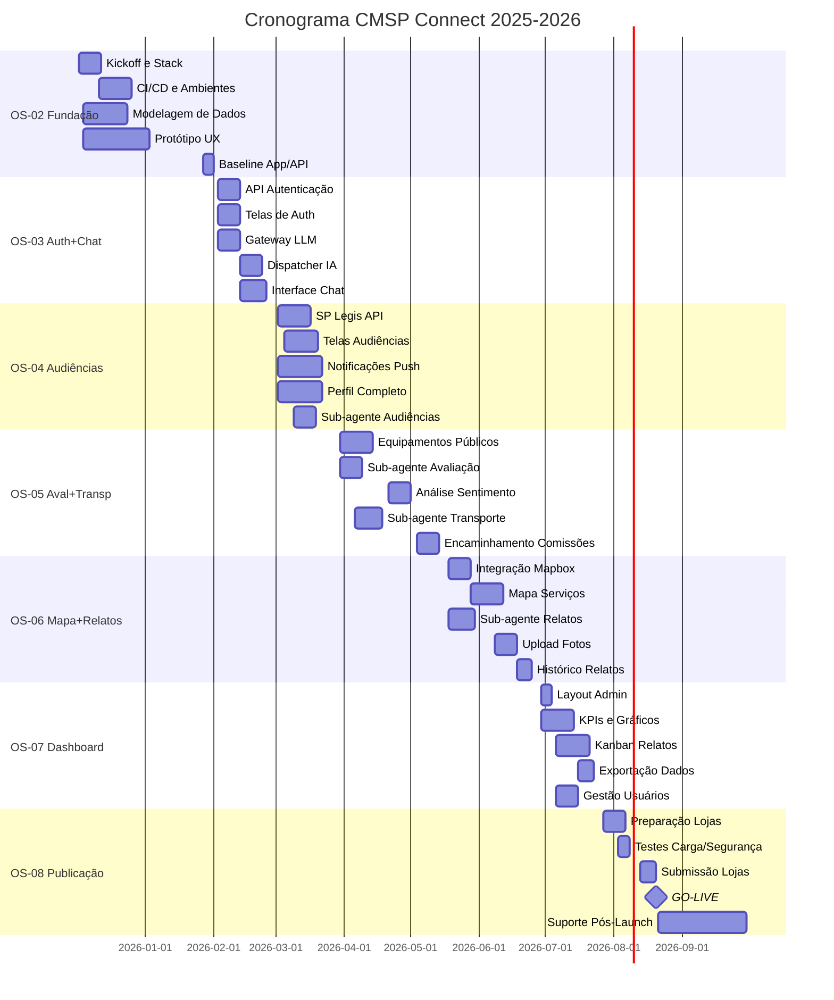

# Cronograma de Execução do Projeto
## CMSP Connect — Aplicativo de Participação Cidadã

---

| **Documento** | Cronograma de Execução |
|---------------|------------------------|
| **Projeto** | CMSP Connect |
| **Cliente** | Câmara Municipal de São Paulo |
| **Versão** | 1.0 |
| **Data** | Dezembro/2025 |
| **Elaborado por** | M-TECH Consultoria em Tecnologia |

---

## Sumário

1. [Resumo Executivo](#1-resumo-executivo)
2. [Visão Geral do Cronograma](#2-visão-geral-do-cronograma)
3. [Legenda de Responsáveis](#3-legenda-de-responsáveis)
4. [Detalhamento por Ordem de Serviço](#4-detalhamento-por-ordem-de-serviço)
   - [OS-02: Arquitetura e Fundação](#os-02-arquitetura-e-fundação)
   - [OS-03: Autenticação e Chatbot](#os-03-autenticação-e-chatbot)
   - [OS-04: Audiências e Perfil](#os-04-audiências-e-perfil)
   - [OS-05: Avaliações e Transporte](#os-05-avaliações-e-transporte)
   - [OS-06: Mapa e Relatos Urbanos](#os-06-mapa-e-relatos-urbanos)
   - [OS-07: Dashboard e Administração](#os-07-dashboard-e-administração)
   - [OS-08: Publicação e Suporte](#os-08-publicação-e-suporte)
5. [Marcos Principais (Milestones)](#5-marcos-principais-milestones)
6. [Diagrama Gantt](#6-diagrama-gantt)
7. [Critérios de Aceite por OS](#7-critérios-de-aceite-por-os)
8. [Riscos ao Cronograma](#8-riscos-ao-cronograma)
9. [Observações Gerais](#9-observações-gerais)

---

## 1. Resumo Executivo

Este documento apresenta o cronograma detalhado de execução do projeto **CMSP Connect**, contemplando todas as atividades necessárias para entrega do aplicativo móvel de participação cidadã da Câmara Municipal de São Paulo.

### Período de Execução
- **Início:** Dezembro/2025
- **Término:** Setembro/2026
- **Duração Total:** 10 meses

### Distribuição por Fase

| Fase | Período | Duração | Foco Principal |
|------|---------|---------|----------------|
| Fundação | Dez/2025 - Jan/2026 | 2 meses | Arquitetura, ambiente, protótipo UX |
| Core | Jan - Mar/2026 | 3 meses | Autenticação, chatbot IA, audiências |
| Módulos | Mar - Jun/2026 | 4 meses | Avaliações, transporte, mapa, relatos |
| Entrega | Jun - Jul/2026 | 1 mês | Dashboard, administração, publicação |
| Suporte | Ago - Set/2026 | 2 meses | Acompanhamento pós-publicação |

### Equipe Estimada
- **Tech Lead:** 1
- **Desenvolvedores:** 3-4
- **Especialista IA:** 1
- **UX Designer:** 1
- **QA:** 1
- **DevOps:** 1
- **Product Owner (CMSP):** 1

---

## 2. Visão Geral do Cronograma

| OS | Nome | Início | Término | Dias Úteis | Status |
|----|------|--------|---------|------------|--------|
| OS-01 | Diagnóstico (concluída) | Out/2025 | Nov/2025 | 40 | ✅ Concluída |
| OS-02 | Arquitetura e Fundação | 02/12/2025 | 31/01/2026 | 45 | 🔵 Planejada |
| OS-03 | Autenticação e Chatbot | 03/02/2026 | 27/02/2026 | 40 | 🔵 Planejada |
| OS-04 | Audiências e Perfil | 02/03/2026 | 27/03/2026 | 35 | 🔵 Planejada |
| OS-05 | Avaliações e Transporte | 30/03/2026 | 15/05/2026 | 50 | 🔵 Planejada |
| OS-06 | Mapa e Relatos Urbanos | 18/05/2026 | 26/06/2026 | 45 | 🔵 Planejada |
| OS-07 | Dashboard e Administração | 29/06/2026 | 24/07/2026 | 35 | 🔵 Planejada |
| OS-08 | Publicação e Suporte | 27/07/2026 | 30/09/2026 | 50 | 🔵 Planejada |

**Total de dias úteis estimados:** ~340 dias úteis

---

## 3. Legenda de Responsáveis

| Sigla | Cargo | Responsabilidades |
|-------|-------|-------------------|
| **TL** | Tech Lead | Decisões técnicas, revisão de código, arquitetura |
| **DEV-FE** | Desenvolvedor Frontend | Interfaces mobile, componentes visuais |
| **DEV-BE** | Desenvolvedor Backend | APIs, banco de dados, integrações |
| **DEV-FS** | Desenvolvedor Full-stack | Funcionalidades end-to-end |
| **IA** | Especialista em IA | Modelos LLM, sub-agentes, análise de sentimento |
| **UX** | UX Designer | Protótipos, fluxos, design system |
| **QA** | Quality Assurance | Testes funcionais, integração, E2E |
| **OPS** | DevOps | Infraestrutura, CI/CD, deploy, monitoramento |
| **DBA** | Arquiteto de Dados | Modelagem, performance, migrações |
| **PO** | Product Owner | Validações, priorização, aceite |
| **CP** | Coordenador de Projeto | Gestão, comunicação, entregas |

---

## 4. Detalhamento por Ordem de Serviço

### OS-02: Arquitetura e Fundação
**Período:** 02/12/2025 a 31/01/2026 | **Duração:** 45 dias úteis

| ID | Atividade | Dias | Início | Término | Dep. | Responsável | Observações |
|----|-----------|------|--------|---------|------|-------------|-------------|
| 02.01 | Kickoff do projeto e alinhamento | 2 | 02/12 | 03/12 | - | CP, PO | Reunião com stakeholders CMSP |
| 02.02 | Definição de stack tecnológica | 5 | 04/12 | 10/12 | 02.01 | TL | Flutter vs React Native |
| 02.03 | Configuração de repositório Git | 2 | 11/12 | 12/12 | 02.02 | OPS | Monorepo ou multi-repo |
| 02.04 | Setup de pipeline CI/CD | 5 | 13/12 | 19/12 | 02.03 | OPS | GitHub Actions ou equivalente |
| 02.05 | Configuração ambiente DEV | 3 | 20/12 | 24/12 | 02.04 | OPS | Cloud (AWS/Azure/GCP) |
| 02.06 | Configuração ambiente HOMOLOG | 3 | 06/01 | 08/01 | 02.05 | OPS | Espelho de produção |
| 02.07 | Modelagem de dados (PostgreSQL) | 10 | 04/12 | 17/12 | 02.01 | DBA | Entidades principais |
| 02.08 | Revisão de modelagem | 3 | 18/12 | 22/12 | 02.07 | TL, DBA | Ajustes e otimizações |
| 02.09 | Criação de migrations | 5 | 06/01 | 10/01 | 02.08 | DBA | Scripts versionados |
| 02.10 | Setup de RLS e políticas | 5 | 13/01 | 17/01 | 02.09 | DBA | Row Level Security |
| 02.11 | Protótipo UX navegável | 15 | 04/12 | 24/12 | 02.01 | UX | Fluxos principais |
| 02.12 | Validação de protótipo | 5 | 06/01 | 10/01 | 02.11 | UX, PO | Com stakeholders CMSP |
| 02.13 | Ajustes no protótipo | 5 | 13/01 | 17/01 | 02.12 | UX | Incorporar feedback |
| 02.14 | Design System documentado | 5 | 20/01 | 24/01 | 02.13 | UX | Componentes, cores, tipografia |
| 02.15 | Documentação de arquitetura | 5 | 20/01 | 24/01 | 02.06 | TL | Diagramas C4, decisões |
| 02.16 | Baseline do projeto mobile | 5 | 27/01 | 31/01 | 02.02, 02.04 | DEV-FE | Estrutura inicial do app |
| 02.17 | Baseline da API REST | 5 | 27/01 | 31/01 | 02.09 | DEV-BE | Endpoints iniciais |

**Entregáveis OS-02:**
- ✅ Repositório configurado com CI/CD
- ✅ Ambientes DEV e HOMOLOG operacionais
- ✅ Modelo de dados implementado
- ✅ Protótipo UX validado
- ✅ Design System documentado
- ✅ Baseline do aplicativo mobile

---

### OS-03: Autenticação e Chatbot
**Período:** 03/02/2026 a 27/02/2026 | **Duração:** 40 dias úteis

| ID | Atividade | Dias | Início | Término | Dep. | Responsável | Observações |
|----|-----------|------|--------|---------|------|-------------|-------------|
| 03.01 | API de autenticação (login/cadastro) | 8 | 03/02 | 12/02 | 02.17 | DEV-BE | JWT + refresh tokens |
| 03.02 | Tela de splash e onboarding | 3 | 03/02 | 05/02 | 02.16 | DEV-FE | Primeiras impressões |
| 03.03 | Telas de login e cadastro | 5 | 06/02 | 12/02 | 03.02 | DEV-FE | Validações, feedback |
| 03.04 | Integração auth frontend/backend | 3 | 13/02 | 17/02 | 03.01, 03.03 | DEV-FS | Token management |
| 03.05 | Recuperação de senha | 3 | 18/02 | 20/02 | 03.04 | DEV-FS | Email de reset |
| 03.06 | Integração com Gateway LLM | 8 | 03/02 | 12/02 | 02.17 | IA | Google Gemini / OpenAI |
| 03.07 | Implementação do Dispatcher | 10 | 13/02 | 26/02 | 03.06 | IA | Agente principal |
| 03.08 | System prompt e persona | 5 | 13/02 | 19/02 | 03.06 | IA | "Luana" - tom acolhedor |
| 03.09 | Interface de chat | 8 | 13/02 | 24/02 | 03.04 | DEV-FE | Bolhas, input, loading |
| 03.10 | Histórico de conversas | 5 | 18/02 | 24/02 | 03.09 | DEV-BE | Persistência em BD |
| 03.11 | Menu lateral (drawer) | 3 | 21/02 | 25/02 | 03.09 | DEV-FE | Navegação institucional |
| 03.12 | Testes de autenticação | 3 | 23/02 | 25/02 | 03.05 | QA | Fluxos de login/cadastro |
| 03.13 | Testes do chatbot | 3 | 25/02 | 27/02 | 03.07 | QA | Respostas, contexto |
| 03.14 | Revisão de código sprint | 2 | 26/02 | 27/02 | 03.13 | TL | Code review geral |

**Entregáveis OS-03:**
- ✅ Sistema de autenticação completo
- ✅ Chatbot conversacional funcional (Dispatcher)
- ✅ Persona "Luana" configurada
- ✅ Interface de chat implementada
- ✅ Histórico de conversas persistido

---

### OS-04: Audiências e Perfil
**Período:** 02/03/2026 a 27/03/2026 | **Duração:** 35 dias úteis

| ID | Atividade | Dias | Início | Término | Dep. | Responsável | Observações |
|----|-----------|------|--------|---------|------|-------------|-------------|
| 04.01 | Estudo da SP Legis API | 3 | 02/03 | 04/03 | - | DEV-BE | Documentação e endpoints |
| 04.02 | Integração SP Legis - audiências | 8 | 05/03 | 16/03 | 04.01 | DEV-BE | Consumo de dados |
| 04.03 | Cache e fallback de audiências | 3 | 17/03 | 19/03 | 04.02 | DEV-BE | Contingência offline |
| 04.04 | Tela de listagem de audiências | 5 | 05/03 | 11/03 | 03.11 | DEV-FE | Filtros, ordenação |
| 04.05 | Tela de detalhes da audiência | 5 | 12/03 | 18/03 | 04.04 | DEV-FE | Informações, docs |
| 04.06 | Sistema de inscrição | 5 | 17/03 | 23/03 | 04.03 | DEV-FS | Confirmar presença |
| 04.07 | Notificações push - setup | 5 | 02/03 | 06/03 | 02.05 | OPS | Firebase/OneSignal |
| 04.08 | Notificações de audiências | 5 | 19/03 | 25/03 | 04.06, 04.07 | DEV-BE | Lembretes automáticos |
| 04.09 | Sub-agente de Audiências | 8 | 09/03 | 18/03 | 03.07 | IA | Perguntas sobre audiências |
| 04.10 | Perfil - dados pessoais | 3 | 02/03 | 04/03 | 03.04 | DEV-FE | Nome, avatar, telefone |
| 04.11 | Perfil - endereço | 5 | 05/03 | 11/03 | 04.10 | DEV-FS | CEP, bairro, coords |
| 04.12 | Perfil - interesses | 3 | 12/03 | 16/03 | 04.11 | DEV-FE | Temas de interesse |
| 04.13 | Perfil - preferências | 3 | 17/03 | 19/03 | 04.12 | DEV-FE | Notificações, privacidade |
| 04.14 | Integração perfil com IA | 3 | 20/03 | 24/03 | 04.13, 04.09 | IA | Contexto personalizado |
| 04.15 | Testes funcionais | 3 | 24/03 | 26/03 | 04.14 | QA | Fluxos de audiência e perfil |
| 04.16 | Homologação com PO | 1 | 27/03 | 27/03 | 04.15 | PO | Validação de entregas |

**Entregáveis OS-04:**
- ✅ Integração com SP Legis API
- ✅ Módulo de audiências públicas completo
- ✅ Sistema de notificações push
- ✅ Perfil de usuário completo
- ✅ Sub-agente de audiências funcional

---

### OS-05: Avaliações e Transporte
**Período:** 30/03/2026 a 15/05/2026 | **Duração:** 50 dias úteis

| ID | Atividade | Dias | Início | Término | Dep. | Responsável | Observações |
|----|-----------|------|--------|---------|------|-------------|-------------|
| 05.01 | Cadastro de equipamentos públicos | 8 | 30/03 | 08/04 | 02.09 | DEV-BE | UBS, escolas, CEUs |
| 05.02 | Importação de dados de serviços | 5 | 09/04 | 15/04 | 05.01 | DBA | Carga inicial |
| 05.03 | Sistema de visitas (geofencing) | 8 | 09/04 | 20/04 | 05.01 | DEV-BE | Detecção de presença |
| 05.04 | Sub-agente de Avaliação | 10 | 30/03 | 14/04 | 03.07 | IA | Coleta conversacional |
| 05.05 | Fluxo de avaliação no chat | 8 | 15/04 | 24/04 | 05.04, 05.03 | DEV-FS | Integração visita + chat |
| 05.06 | Análise de sentimento | 8 | 21/04 | 30/04 | 05.04 | IA | Classificação automática |
| 05.07 | Armazenamento de avaliações | 5 | 27/04 | 01/05 | 05.05 | DEV-BE | service_ratings |
| 05.08 | Cadastro de linhas de transporte | 5 | 30/03 | 03/04 | 02.09 | DEV-BE | Ônibus, metrô |
| 05.09 | Sub-agente de Transporte | 10 | 06/04 | 17/04 | 03.07 | IA | Diagnóstico de problemas |
| 05.10 | Fluxo de relato de transporte | 8 | 20/04 | 29/04 | 05.09 | DEV-FS | Via chatbot |
| 05.11 | Classificação de problemas | 5 | 30/04 | 06/05 | 05.10 | IA | Categorias automáticas |
| 05.12 | Identificação de padrões | 8 | 04/05 | 13/05 | 05.11 | IA | Alertas de recorrência |
| 05.13 | Sistema de encaminhamento | 8 | 04/05 | 13/05 | 05.07, 05.11 | DEV-BE | Para Comissões da CMSP |
| 05.14 | Tela de sugestão de vereador | 5 | 06/05 | 12/05 | 05.13 | DEV-FE | Encaminhamento opcional |
| 05.15 | Testes integrados | 5 | 11/05 | 15/05 | 05.14 | QA | Avaliação + Transporte |
| 05.16 | Homologação com PO | 1 | 15/05 | 15/05 | 05.15 | PO | Validação de entregas |

**Entregáveis OS-05:**
- ✅ Sistema de avaliação de serviços públicos
- ✅ Análise de sentimento implementada
- ✅ Diagnóstico de transporte via chatbot
- ✅ Identificação de padrões de problemas
- ✅ Encaminhamento a Comissões da CMSP

---

### OS-06: Mapa e Relatos Urbanos
**Período:** 18/05/2026 a 26/06/2026 | **Duração:** 45 dias úteis

| ID | Atividade | Dias | Início | Término | Dep. | Responsável | Observações |
|----|-----------|------|--------|---------|------|-------------|-------------|
| 06.01 | Integração Mapbox GL | 8 | 18/05 | 27/05 | 02.16 | DEV-FE | SDK mobile |
| 06.02 | Mapa de serviços públicos | 10 | 28/05 | 10/06 | 06.01, 05.02 | DEV-FE | Markers, clusters |
| 06.03 | Filtros por tipo de serviço | 5 | 28/05 | 03/06 | 06.02 | DEV-FE | UBS, escola, CEU |
| 06.04 | Seletor de raio de busca | 3 | 04/06 | 08/06 | 06.03 | DEV-FE | 500m a 5km |
| 06.05 | Detalhes de equipamento | 5 | 09/06 | 15/06 | 06.02 | DEV-FE | Info + avaliações |
| 06.06 | Rotas e navegação | 5 | 11/06 | 17/06 | 06.05 | DEV-FE | Directions API |
| 06.07 | Sub-agente de Relatos Urbanos | 10 | 18/05 | 29/05 | 03.07 | IA | Coleta conversacional |
| 06.08 | Fluxo de relato via chat | 8 | 01/06 | 10/06 | 06.07 | DEV-FS | Descrição + localização |
| 06.09 | Classificação automática | 5 | 11/06 | 17/06 | 06.08 | IA | Categoria + severidade |
| 06.10 | Upload de fotos | 8 | 08/06 | 17/06 | 06.08 | DEV-FS | Storage + compressão |
| 06.11 | Confirmação de endereço | 3 | 18/06 | 22/06 | 06.08 | DEV-FE | Mapa + reverse geocoding |
| 06.12 | Card de sucesso do relato | 2 | 23/06 | 24/06 | 06.11 | DEV-FE | Feedback visual |
| 06.13 | Histórico de meus relatos | 5 | 18/06 | 24/06 | 06.08 | DEV-FS | Listagem + status |
| 06.14 | Testes E2E do mapa | 3 | 22/06 | 24/06 | 06.06 | QA | Navegação e interação |
| 06.15 | Testes E2E de relatos | 3 | 23/06 | 25/06 | 06.13 | QA | Fluxo completo |
| 06.16 | Homologação com PO | 1 | 26/06 | 26/06 | 06.15 | PO | Validação de entregas |

**Entregáveis OS-06:**
- ✅ Mapa interativo de serviços públicos
- ✅ Filtros e busca por proximidade
- ✅ Relatos urbanos via chatbot
- ✅ Upload de fotos nos relatos
- ✅ Classificação automática de relatos

---

### OS-07: Dashboard e Administração
**Período:** 29/06/2026 a 24/07/2026 | **Duração:** 35 dias úteis

| ID | Atividade | Dias | Início | Término | Dep. | Responsável | Observações |
|----|-----------|------|--------|---------|------|-------------|-------------|
| 07.01 | Layout da área administrativa | 5 | 29/06 | 03/07 | 02.16 | DEV-FE | Sidebar, header, nav |
| 07.02 | Dashboard - KPIs principais | 8 | 29/06 | 08/07 | 07.01 | DEV-FE | Cards de métricas |
| 07.03 | Gráficos de linha/barra | 5 | 06/07 | 10/07 | 07.02 | DEV-FE | Recharts/Chart.js |
| 07.04 | Gráfico de sentimento | 3 | 09/07 | 13/07 | 07.03 | DEV-FE | Donut + tendência |
| 07.05 | Drill-down por categoria | 5 | 13/07 | 17/07 | 07.03 | DEV-FS | Detalhamento |
| 07.06 | Drill-across comparativo | 3 | 16/07 | 20/07 | 07.05 | DEV-FS | Entre períodos |
| 07.07 | Kanban de relatos urbanos | 8 | 06/07 | 15/07 | 07.01 | DEV-FE | Drag & drop |
| 07.08 | Kanban de transporte | 5 | 16/07 | 22/07 | 07.07 | DEV-FE | Mesmo padrão |
| 07.09 | Modal de detalhes do relato | 5 | 13/07 | 17/07 | 07.07 | DEV-FE | Info + ações |
| 07.10 | Exportação CSV/XLS | 5 | 16/07 | 22/07 | 07.06 | DEV-BE | Dados filtrados |
| 07.11 | Gestão de usuários | 5 | 06/07 | 10/07 | 03.01 | DEV-BE | CRUD + roles |
| 07.12 | Tela de usuários admin | 3 | 13/07 | 15/07 | 07.11 | DEV-FE | Listagem + edição |
| 07.13 | Logs de auditoria | 5 | 13/07 | 17/07 | 07.11 | DEV-BE | Ações registradas |
| 07.14 | Visualização de logs | 3 | 20/07 | 22/07 | 07.13 | DEV-FE | Filtros + busca |
| 07.15 | Testes da área admin | 3 | 21/07 | 23/07 | 07.14 | QA | Funcionalidades |
| 07.16 | Homologação com PO | 1 | 24/07 | 24/07 | 07.15 | PO | Validação final |

**Entregáveis OS-07:**
- ✅ Dashboard analítico com KPIs
- ✅ Gráficos interativos (drill-down/across)
- ✅ Kanban de gestão de relatos
- ✅ Exportação de dados
- ✅ Gestão de usuários e logs de auditoria

---

### OS-08: Publicação e Suporte
**Período:** 27/07/2026 a 30/09/2026 | **Duração:** 50 dias úteis

| ID | Atividade | Dias | Início | Término | Dep. | Responsável | Observações |
|----|-----------|------|--------|---------|------|-------------|-------------|
| 08.01 | Preparação de assets (ícones, screenshots) | 5 | 27/07 | 31/07 | 07.16 | UX | App Store + Play Store |
| 08.02 | Textos de descrição das lojas | 3 | 27/07 | 29/07 | - | CP, PO | Português |
| 08.03 | Configuração ambiente PROD | 5 | 27/07 | 31/07 | 02.06 | OPS | Infraestrutura final |
| 08.04 | Testes de carga | 5 | 03/08 | 07/08 | 08.03 | QA, OPS | Stress test |
| 08.05 | Testes de segurança | 5 | 03/08 | 07/08 | 08.03 | QA | Penetration test básico |
| 08.06 | Build de release iOS | 3 | 10/08 | 12/08 | 08.04 | OPS | Certificados Apple |
| 08.07 | Build de release Android | 3 | 10/08 | 12/08 | 08.04 | OPS | Keystore Google |
| 08.08 | Submissão App Store | 5 | 13/08 | 19/08 | 08.06 | OPS | Review Apple |
| 08.09 | Submissão Play Store | 5 | 13/08 | 19/08 | 08.07 | OPS | Review Google |
| 08.10 | Configuração de monitoramento | 5 | 10/08 | 14/08 | 08.03 | OPS | APM, logs, alertas |
| 08.11 | Publicação em produção | 1 | 20/08 | 20/08 | 08.08, 08.09 | OPS | 🚀 Go-live |
| 08.12 | Correções críticas pós-launch | 10 | 21/08 | 03/09 | 08.11 | DEV-FS | Hotfixes |
| 08.13 | Monitoramento intensivo | 10 | 21/08 | 03/09 | 08.11 | OPS | 24/7 primeira semana |
| 08.14 | Documentação técnica final | 10 | 03/08 | 14/08 | 07.16 | TL | API, arquitetura |
| 08.15 | Manual do usuário | 5 | 17/08 | 21/08 | 08.14 | UX | Guia ilustrado |
| 08.16 | Treinamento gestores CMSP | 5 | 24/08 | 28/08 | 08.15, 08.11 | CP | Área administrativa |
| 08.17 | Treinamento equipe suporte | 3 | 31/08 | 02/09 | 08.16 | CP | Atendimento |
| 08.18 | Acompanhamento pós-go-live | 20 | 07/09 | 30/09 | 08.12 | DEV-FS | Suporte contínuo |
| 08.19 | Relatório de encerramento | 3 | 28/09 | 30/09 | 08.18 | CP | Lições aprendidas |

**Entregáveis OS-08:**
- ✅ Aplicativo publicado na App Store e Play Store
- ✅ Infraestrutura de produção configurada
- ✅ Monitoramento e alertas ativos
- ✅ Documentação técnica completa
- ✅ Equipe CMSP treinada

---

## 5. Marcos Principais (Milestones)

| Marco | Data | Descrição |
|-------|------|-----------|
| 🏁 M1 | 31/01/2026 | Fundação completa (ambientes + protótipo validado) |
| 🏁 M2 | 27/02/2026 | Chatbot IA funcional com autenticação |
| 🏁 M3 | 27/03/2026 | Audiências e perfil de usuário |
| 🏁 M4 | 15/05/2026 | Avaliações e transporte operacionais |
| 🏁 M5 | 26/06/2026 | Mapa e relatos urbanos completos |
| 🏁 M6 | 24/07/2026 | Dashboard administrativo pronto |
| 🚀 M7 | 20/08/2026 | **GO-LIVE** - Publicação nas lojas |
| ✅ M8 | 30/09/2026 | Encerramento do projeto |

---

## 6. Diagrama Gantt

---

## 7. Critérios de Aceite por OS

### OS-02: Arquitetura e Fundação
- [ ] Repositório Git configurado com branches (main, develop, feature/*)
- [ ] Pipeline CI/CD executando build e testes automaticamente
- [ ] Ambiente DEV acessível pela equipe
- [ ] Ambiente HOMOLOG acessível para validação
- [ ] Modelo de dados implementado com RLS
- [ ] Protótipo UX aprovado pelo Product Owner
- [ ] Design System documentado (Figma ou equivalente)

### OS-03: Autenticação e Chatbot
- [ ] Usuário consegue criar conta e fazer login
- [ ] Recuperação de senha funcionando via email
- [ ] Chatbot responde perguntas gerais sobre a CMSP
- [ ] Persona "Luana" com tom acolhedor configurada
- [ ] Histórico de conversas persistido e recuperável

### OS-04: Audiências e Perfil
- [ ] Listagem de audiências atualizada via SP Legis
- [ ] Usuário consegue se inscrever em audiência
- [ ] Notificação push recebida 24h antes da audiência
- [ ] Perfil completo (dados, endereço, interesses) editável
- [ ] Sub-agente responde perguntas sobre audiências

### OS-05: Avaliações e Transporte
- [ ] Sistema detecta visita a equipamento público
- [ ] Avaliação coletada via conversa com chatbot
- [ ] Sentimento da avaliação classificado automaticamente
- [ ] Relato de transporte registrado via chatbot
- [ ] Padrões de problemas identificados
- [ ] Encaminhamento a Comissão realizado

### OS-06: Mapa e Relatos Urbanos
- [ ] Mapa exibe serviços públicos próximos
- [ ] Filtros por tipo de serviço funcionando
- [ ] Rotas/direções para equipamento funcionando
- [ ] Relato urbano criado via chatbot
- [ ] Foto anexada ao relato
- [ ] Relato classificado automaticamente

### OS-07: Dashboard e Administração
- [ ] Dashboard exibe KPIs principais
- [ ] Gráficos interativos com drill-down
- [ ] Kanban permite gerenciar relatos
- [ ] Exportação CSV/XLS funcionando
- [ ] Gestão de usuários e roles operacional
- [ ] Logs de auditoria registrados

### OS-08: Publicação e Suporte
- [ ] App aprovado na App Store
- [ ] App aprovado na Play Store
- [ ] Monitoramento de erros configurado
- [ ] Alertas de performance ativos
- [ ] Documentação técnica entregue
- [ ] Equipe CMSP treinada

---

## 8. Riscos ao Cronograma

| Risco | Probabilidade | Impacto | Mitigação |
|-------|---------------|---------|-----------|
| Atraso na definição de stack | Média | Alto | Decisão nas primeiras 2 semanas |
| Instabilidade da SP Legis API | Média | Médio | Base interna como contingência |
| Rejeição nas lojas de aplicativos | Baixa | Alto | Seguir guidelines desde o início |
| Escopo adicional solicitado | Alta | Médio | Change request formal |
| Indisponibilidade de recursos | Média | Alto | Buffer de 10% no cronograma |
| Problemas de performance LLM | Baixa | Médio | Cache e otimização de prompts |
| Atrasos em aprovações CMSP | Média | Médio | Reuniões semanais de alinhamento |

---

## 9. Observações Gerais

### Premissas do Cronograma
1. Equipe completa e dedicada conforme especificado
2. Ambientes cloud provisionados no início do projeto
3. Acesso à SP Legis API disponibilizado pela CMSP
4. Aprovações do Product Owner em até 2 dias úteis
5. Sem mudanças significativas de escopo durante execução

### Reuniões Previstas
- **Daily standup:** Diária, 15 min
- **Sprint planning:** Quinzenal
- **Sprint review:** Quinzenal
- **Reunião de status com CMSP:** Semanal

### Metodologia
- **Framework:** Scrum adaptado
- **Sprints:** 2 semanas
- **Ferramenta de gestão:** Jira, Azure DevOps ou equivalente

### Contatos do Projeto
| Papel | Responsabilidade |
|-------|------------------|
| **Product Owner (CMSP)** | Validações, priorização, aceite |
| **Coordenador de Projeto (M-TECH)** | Gestão, comunicação, entregas |
| **Tech Lead (M-TECH)** | Decisões técnicas, arquitetura |

---

**Documento elaborado por M-TECH Consultoria em Tecnologia**

*Versão 1.0 — Dezembro/2025*
