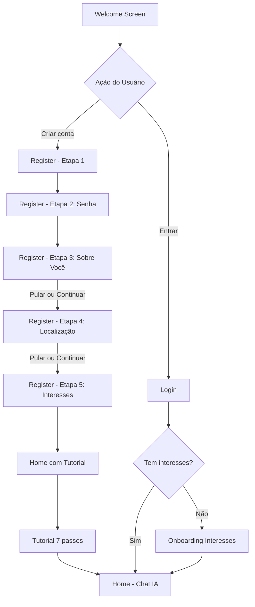
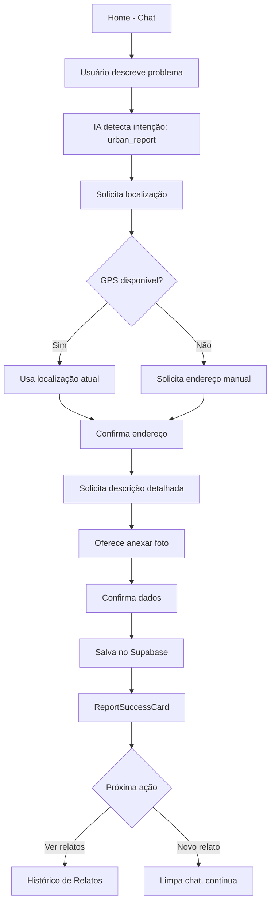
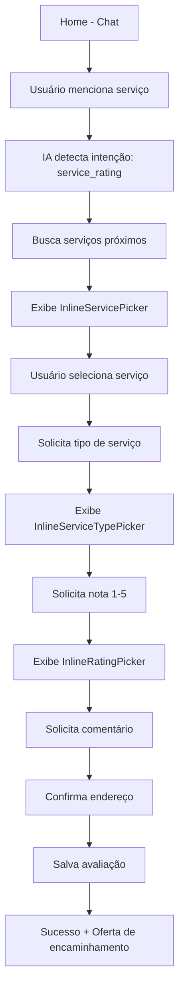
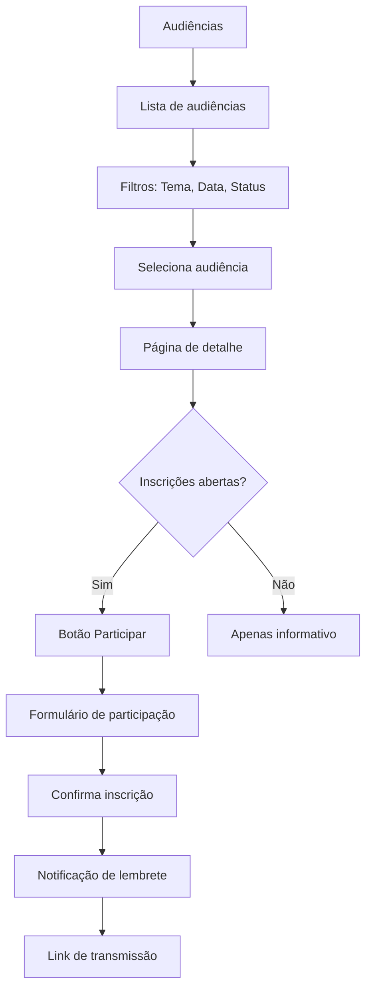

# Design e UX - CMSP Connect

> **Versão:** 1.0  
> **Última atualização:** Janeiro 2026  
> **Público-alvo:** Designers, Desenvolvedores, Product Managers

Este documento serve como guia completo para entender os padrões de interface, fluxos de usuário e componentes implementados no CMSP Connect.

---

## Sumário

1. [UX/UI do Onboarding](#1-uxui-do-onboarding)
2. [Arquitetura da Informação](#2-arquitetura-da-informação)
3. [Arquitetura da Informação Validada](#3-arquitetura-da-informação-validada)
4. [Fluxos Macro dos Usuários](#4-fluxos-macro-dos-usuários)
5. [Telas de Login, Cadastro e Recuperação de Senha](#5-telas-de-login-cadastro-e-recuperação-de-senha)
6. [Estados de Erro, Loading e Feedback](#6-estados-de-erro-loading-e-feedback)

---

## 1. UX/UI do Onboarding

O sistema de onboarding foi projetado para guiar novos usuários de forma progressiva, educando sobre as funcionalidades enquanto coleta informações essenciais para personalização.

### 1.1 Tela de Boas-Vindas (`/welcome`)

**Arquivo:** `src/pages/Welcome.tsx`

A tela inicial apresenta um carrossel animado que comunica a proposta de valor do aplicativo.

#### Estrutura Visual

```
┌─────────────────────────────────┐
│  [Logo]              [Pular →] │
├─────────────────────────────────┤
│                                 │
│         [Ícone Animado]         │
│                                 │
│      Título do Slide            │
│      Descrição breve            │
│                                 │
│         ● ○ ○ ○                 │
│                                 │
├─────────────────────────────────┤
│     [ Entrar ]  [ Criar conta ] │
│                                 │
│     São Paulo • Saiba mais      │
└─────────────────────────────────┘
```

#### Slides do Carrossel

| # | Ícone | Título | Descrição |
|---|-------|--------|-----------|
| 1 | 🏛️ Landmark | Bem-vindo à Câmara na Mão | Conecte-se com a Câmara Municipal de São Paulo de forma simples e direta |
| 2 | 💬 MessageSquare | Converse com a IA | Tire dúvidas, registre demandas e acompanhe projetos através do nosso assistente inteligente |
| 3 | 📊 BarChart3 | Acompanhe em Tempo Real | Visualize estatísticas, projetos de lei e atividades dos vereadores |
| 4 | 👥 Users | Participe Ativamente | Sua voz importa! Contribua com sugestões e participe das decisões da sua cidade |

#### Especificações Técnicas

- **Carrossel:** Embla Carousel com plugin de autoplay (5s por slide)
- **Animações:** Framer Motion com variantes de fade, slide e scale
- **Indicadores:** Dots clicáveis com transição de opacidade e escala
- **Header:** Fixo com logo (brasão SP + título) e botão "Pular"
- **Footer:** Rodapé fixo com CTAs e link para documentação

#### Animações

```tsx
// Ícone principal - pulsação suave
animate={{ 
  scale: [1, 1.05, 1],
  opacity: [0.9, 1, 0.9]
}}
transition={{ 
  duration: 3, 
  repeat: Infinity 
}}

// Movimento sutil de flutuação
animate={{ y: [0, -5, 0] }}
transition={{ 
  duration: 2, 
  repeat: Infinity 
}}
```

---

### 1.2 Tutorial do App (`AppOnboardingTutorial`)

**Arquivo:** `src/components/onboarding/AppOnboardingTutorial.tsx`

Tutorial guiado de 7 passos que apresenta as principais funcionalidades do aplicativo.

#### Estrutura Visual

```
┌─────────────────────────────────┐
│                            [X]  │
├─────────────────────────────────┤
│                                 │
│      [Ícone/Imagem Animado]     │
│                                 │
│         Título do Passo         │
│         Descrição detalhada     │
│                                 │
│      ━━━━━━━━━━━━━━━━━━━━━━     │
│          Passo 1 de 7           │
│                                 │
├─────────────────────────────────┤
│   [← Anterior]    [Próximo →]   │
└─────────────────────────────────┘
```

#### Passos do Tutorial

| # | Ícone | Cor | Título | Descrição |
|---|-------|-----|--------|-----------|
| 1 | Sparkles | cyan | Bem-vindo ao CMSP Connect! | Seu assistente pessoal para participar ativamente da vida política de São Paulo |
| 2 | MapPin | green | Relatos Urbanos | Reporte problemas como buracos, lixo ou iluminação. Acompanhe o status em tempo real |
| 3 | Bus | pink | Transporte Público | Avalie linhas de ônibus e metrô. Suas avaliações ajudam a melhorar o transporte |
| 4 | Users | blue | Audiências Públicas | Participe de audiências, acompanhe pautas e contribua com sua opinião |
| 5 | Building2 | purple | Serviços Públicos | Encontre e avalie UBS, escolas e outros serviços próximos a você |
| 6 | MessageSquare | amber | Assistente Inteligente | Converse naturalmente. Nossa IA entende o que você precisa e ajuda a resolver |
| 7 | [Imagem] | — | Tudo pronto! | Comece agora a fazer a diferença na sua cidade |

#### Especificações Técnicas

- **Navegação:** Botões "Anterior" e "Próximo" (ou "Começar" no último passo)
- **Progresso:** Barra de progresso + texto "Passo X de 7"
- **Saída:** Botão X no canto superior direito (chama `onSkip`)
- **Callbacks:** `onComplete()` ao finalizar, `onSkip()` ao pular
- **Animações:** AnimatePresence com fade e slide entre passos

#### Gradientes de Cor

```tsx
const gradients = {
  cyan: "from-cyan-500/20 to-cyan-600/30",
  green: "from-green-500/20 to-green-600/30",
  pink: "from-pink-500/20 to-pink-600/30",
  blue: "from-blue-500/20 to-blue-600/30",
  purple: "from-purple-500/20 to-purple-600/30",
  amber: "from-amber-500/20 to-amber-600/30"
}
```

---

### 1.3 Seleção de Interesses (`/onboarding`)

**Arquivo:** `src/pages/Onboarding.tsx`

Tela de seleção de categorias de interesse para personalização do feed e notificações.

#### Estrutura Visual

```
┌─────────────────────────────────┐
│  Personalize sua experiência    │
│  Selecione pelo menos 3 áreas   │
├─────────────────────────────────┤
│  ┌───────┐  ┌───────┐          │
│  │ 📜    │  │ 🚌    │          │
│  │Legisla│  │Mobilid│          │
│  │ tivo  │  │ ade   │          │
│  └───────┘  └───────┘          │
│  ┌───────┐  ┌───────┐          │
│  │ 🎭    │  │ 🏥    │          │
│  │Cultura│  │ Saúde │          │
│  └───────┘  └───────┘          │
│  ...                            │
│                                 │
│       3 de 8 selecionados       │
├─────────────────────────────────┤
│         [ Continuar ]           │
└─────────────────────────────────┘
```

#### Categorias Disponíveis

| ID | Label | Emoji | Descrição |
|----|-------|-------|-----------|
| legislativo | Legislativo | 📜 | Projetos de lei e votações |
| mobilidade | Mobilidade | 🚌 | Transporte e trânsito |
| cultura | Cultura | 🎭 | Eventos culturais |
| saude | Saúde | 🏥 | Políticas de saúde |
| educacao | Educação | 📚 | Escolas e universidades |
| meio_ambiente | Meio Ambiente | 🌳 | Sustentabilidade |
| habitacao | Habitação | 🏠 | Moradia e urbanismo |
| economia | Economia | 💼 | Emprego e comércio |

#### Especificações Técnicas

- **Layout:** Grid 2 colunas com gap de 12px
- **Seleção:** Toggle visual com borda e background
- **Validação:** Mínimo 3 seleções para habilitar botão
- **Feedback:** Contador dinâmico "X de 8 selecionados"
- **Persistência:** Salva na tabela `user_interests` do Supabase

#### Estados Visuais dos Cards

```tsx
// Não selecionado
"border-border bg-card hover:border-primary/50"

// Selecionado
"border-primary bg-primary/10"
```

---

## 2. Arquitetura da Informação

### 2.1 Mapa de Rotas

O aplicativo possui mais de 50 rotas organizadas hierarquicamente.

#### Rotas Públicas (Sem Autenticação)

| Rota | Componente | Descrição |
|------|------------|-----------|
| `/welcome` | Welcome | Tela inicial com carrossel |
| `/login` | Login | Formulário de login |
| `/register` | Register | Cadastro em 5 etapas |
| `/reset-password` | ResetPassword | Solicitar recuperação |
| `/nova-senha` | UpdatePassword | Definir nova senha |
| `/docs/overview` | PublicDocumentationPage | Documentação pública |

#### Rotas do Cidadão (Autenticado)

| Rota | Componente | Descrição |
|------|------------|-----------|
| `/` | Home | Chat com assistente IA |
| `/conversas` | ConversationsPage | Histórico de conversas |
| `/notificacoes` | Notifications | Central de notificações |
| `/busca` | Search | Busca global |

#### Rotas de Perfil

| Rota | Componente | Descrição |
|------|------------|-----------|
| `/perfil` | Profile | Página principal do perfil |
| `/perfil/dados-pessoais` | PersonalInfoPage | Nome, email, telefone |
| `/perfil/endereco` | AddressPage | CEP e endereço completo |
| `/perfil/demograficos` | DemographicsPage | Idade, gênero, renda |
| `/perfil/interesses` | InterestsPage | Categorias de interesse |
| `/perfil/preferencias` | PreferencesPage | Notificações, tema |

#### Rotas de Manifestações

| Rota | Componente | Descrição |
|------|------------|-----------|
| `/relatos` | ReportsHub | Hub de contribuições |
| `/relato-urbano` | UrbanReportPage | Relato via chat |
| `/relato-urbano/manual` | ManualReportPage | Formulário manual |
| `/relato-urbano/historico` | ReportHistoryPage | Meus relatos urbanos |
| `/transporte/novo` | NewReportPage | Novo relato de transporte |
| `/transporte/meus-relatos` | MyReportsPage | Meus relatos de transporte |
| `/transporte/padroes` | PatternsPage | Padrões detectados |

#### Rotas de Serviços

| Rota | Componente | Descrição |
|------|------------|-----------|
| `/servicos-proximos` | NearbyServicesPage | Mapa de serviços |
| `/servico/:id` | ServiceDetailPage | Detalhe do serviço |
| `/avaliar` | EvaluationPage | Avaliar serviço |

#### Rotas de Audiências

| Rota | Componente | Descrição |
|------|------------|-----------|
| `/audiencias` | Audiencias | Lista de audiências |
| `/audiencias/:id` | AudienciaDetailPage | Detalhe da audiência |
| `/audiencias/:id/participar` | ParticipacaoPage | Formulário de participação |

#### Rotas Institucionais

| Rota | Componente | Descrição |
|------|------------|-----------|
| `/institucional/agenda` | AgendaCMSP | Agenda da Câmara |
| `/institucional/vereadores` | Vereadores | Lista de vereadores |
| `/institucional/vereadores/:id` | VereadorDetailPage | Perfil do vereador |
| `/institucional/noticias` | Noticias | Lista de notícias |
| `/institucional/noticias/:id` | NoticiaDetailPage | Detalhe da notícia |
| `/institucional/conheca-camara` | ConhecaCamara | Sobre a Câmara |
| `/institucional/camara-explica` | CamaraExplica | Educação legislativa |
| `/institucional/escola-parlamento` | EscolaParlamento | Cursos e formação |

#### Rotas de Analytics

| Rota | Componente | Descrição |
|------|------------|-----------|
| `/paineis` | AnalyticsDashboard | Dashboards públicos |
| `/paineis/avancado` | AdvancedAnalytics | Análises avançadas |
| `/paineis/criar` | CreateDashboard | Criar dashboard |

#### Rotas Administrativas

| Rota | Componente | Proteção | Descrição |
|------|------------|----------|-----------|
| `/admin` | AdminDashboard | Admin/Gestor | Dashboard principal |
| `/admin/reports` | ReportsManagement | Admin/Gestor | Gestão de relatos |
| `/admin/analytics` | ReportsAnalyticsPage | Admin/Gestor | Analytics de relatos |
| `/admin/users` | UserManagement | Admin | Gestão de usuários |
| `/admin/referrals` | ReferralsManagement | Admin/Gestor | Encaminhamentos |
| `/admin/notifications` | AdminNotifications | Admin/Gestor | Notificações do sistema |
| `/admin/audit-logs` | AuditLogs | Admin | Logs de auditoria |
| `/admin/exports` | ExportLogs | Admin/Gestor | Histórico de exportações |
| `/admin/settings/n8n` | N8NIntegration | Admin | Integração n8n |
| `/admin/settings/n8n-monitoring` | N8NMonitoring | Admin | Monitoramento n8n |
| `/admin/settings/accessibility` | AccessibilitySettings | Admin | Config. acessibilidade |

---

### 2.2 Menu Drawer (Navegação Principal)

**Arquivo:** `src/components/MenuDrawer.tsx`

O menu lateral é o principal ponto de navegação do aplicativo.

#### Estrutura do Menu

```
┌─────────────────────────────────┐
│  [Avatar]  Olá, João!      [X]  │
│            Bom dia              │
├─────────────────────────────────┤
│  MINHA CONTA                    │
│  ├─ 👤 Meu Perfil              │
│  ├─ 💬 Conversas               │
│  ├─ 📋 Meus Relatos *          │
│  └─ 📊 Painéis Analíticos *    │
├─────────────────────────────────┤
│  NAVEGAÇÃO INSTITUCIONAL        │
│  ├─ 📅 Agenda da Câmara        │
│  ├─ 👥 Vereadores              │
│  ├─ 🏛️ Conheça a Câmara        │
│  ├─ 📖 Câmara Explica          │
│  ├─ 🎓 Escola do Parlamento    │
│  └─ 📰 Notícias                │
├─────────────────────────────────┤
│  ÁREA ADMINISTRATIVA **         │
│  └─ ⚙️ Painel Administrativo   │
├─────────────────────────────────┤
│  Política de privacidade        │
│  [ 🚪 Sair ]                    │
└─────────────────────────────────┘

* Visível apenas para cidadão_engajado+
** Visível apenas para admin/gestor
```

#### Saudação Contextual

```typescript
const getGreeting = () => {
  const hour = new Date().getHours();
  if (hour < 12) return "Bom dia";
  if (hour < 18) return "Boa tarde";
  return "Boa noite";
};
```

#### Lógica de Itens Condicionais

```typescript
const accountOptions = [
  { icon: User, label: "Meu Perfil", path: "/perfil" },
  { icon: MessageSquare, label: "Conversas", path: "/conversas" },
  // Condicional: apenas cidadão_engajado+
  ...(canAccessReportsHub ? [{ icon: ClipboardList, label: "Meus Relatos", path: "/relatos" }] : []),
  // Condicional: apenas cidadão_engajado+
  ...(canAccessAdvancedAnalytics ? [{ icon: BarChart3, label: "Painéis Analíticos", path: "/paineis" }] : []),
];
```

---

### 2.3 Header Global

**Arquivo:** `src/components/layout/AppLayout.tsx`

O header é persistente em todas as páginas (exceto rotas especiais).

#### Estrutura

```
┌─────────────────────────────────────────────┐
│  [←]  Título da Página  [🔔]  [≡]           │
└─────────────────────────────────────────────┘
```

#### Rotas sem Header

```typescript
const HEADERLESS_ROUTES = [
  "/login", "/register", "/welcome", 
  "/reset-password", "/nova-senha", "/onboarding"
];
```

#### Títulos das Rotas

```typescript
const ROUTE_TITLES: Record<string, string> = {
  "/": "Início",
  "/perfil": "Meu Perfil",
  "/conversas": "Minhas Conversas",
  "/notificacoes": "Notificações",
  "/busca": "Buscar",
  "/audiencias": "Audiências Públicas",
  "/servicos-proximos": "Serviços Próximos",
  "/avaliar": "Avaliar Serviço",
  // ... mais rotas
};
```

---

## 3. Arquitetura da Informação Validada

### 3.1 Sistema de Permissões (RBAC)

**Arquivo:** `src/hooks/useUserRole.ts`

O sistema implementa Role-Based Access Control com 4 perfis hierárquicos.

#### Matriz de Permissões

| Funcionalidade | Cidadão | Cidadão Engajado | Gestor | Admin |
|----------------|---------|------------------|--------|-------|
| Criar manifestações | ✅ | ✅ | ✅ | ✅ |
| Avaliar serviços | ✅ | ✅ | ✅ | ✅ |
| Participar de audiências | ✅ | ✅ | ✅ | ✅ |
| Encaminhar para vereador | ❌ | ✅ | ✅ | ✅ |
| Criar dashboards | ❌ | ✅ | ✅ | ✅ |
| Acessar Hub de Relatos | ❌ | ✅ | ✅ | ✅ |
| Responder manifestações | ❌ | ❌ | ✅ | ✅ |
| Visualizar analytics admin | ❌ | ❌ | ✅ | ✅ |
| Gerenciar usuários | ❌ | ❌ | ❌ | ✅ |
| Configurar sistema | ❌ | ❌ | ❌ | ✅ |

#### Enum de Roles

```typescript
type UserRole = 'admin' | 'gestor' | 'cidadao_engajado' | 'cidadao';
```

#### Flags de Permissão

```typescript
const {
  isAdmin,
  isGestor,
  isCidadaoEngajado,
  isStaff,                    // admin || gestor
  canAccessAdvancedAnalytics, // cidadao_engajado+
  canManageReports,           // gestor+
  canManageUsers,             // admin only
  canConfigureSystem,         // admin only
} = useUserRole();
```

---

### 3.2 Componentes de Proteção de Rotas

#### ProtectedAdminRoute

**Arquivo:** `src/components/admin/ProtectedAdminRoute.tsx`

Permite acesso para `admin` OU `gestor`.

```tsx
<Route element={<ProtectedAdminRoute />}>
  <Route path="/admin" element={<AdminDashboard />} />
  <Route path="/admin/reports" element={<ReportsManagement />} />
</Route>
```

#### ProtectedAdminOnlyRoute

**Arquivo:** `src/components/admin/ProtectedAdminOnlyRoute.tsx`

Permite acesso APENAS para `admin`.

```tsx
<Route element={<ProtectedAdminOnlyRoute />}>
  <Route path="/admin/users" element={<UserManagement />} />
  <Route path="/admin/audit-logs" element={<AuditLogs />} />
</Route>
```

---

### 3.3 Redirects de Compatibilidade

**Arquivo:** `src/App.tsx`

Rotas legadas em inglês redirecionam para equivalentes em português.

```tsx
// Redirects EN → PT-BR
<Route path="/profile" element={<Navigate to="/perfil" replace />} />
<Route path="/settings" element={<Navigate to="/perfil/preferencias" replace />} />
<Route path="/search" element={<Navigate to="/busca" replace />} />
<Route path="/notifications" element={<Navigate to="/notificacoes" replace />} />
```

---

## 4. Fluxos Macro dos Usuários

### 4.1 Jornada de Primeiro Acesso



### 4.2 Jornada de Relato Urbano



### 4.3 Jornada de Avaliação de Serviço



### 4.4 Jornada de Participação em Audiência



### 4.5 Jornada de Recuperação de Senha

```mermaid
graph TD
    A[Login] --> B[Esqueci minha senha]
    B --> C[Reset Password]
    C --> D[Insere email]
    D --> E[Envia link por email]
    E --> F[Tela de sucesso]
    F --> G[Usuário clica no email]
    G --> H[/nova-senha com token]
    H --> I[Verifica sessão de recuperação]
    I --> J{Sessão válida?}
    J -->|Sim| K[Formulário nova senha]
    J -->|Não| L[Erro + link para retry]
    K --> M[Atualiza senha]
    M --> N[Sign out]
    N --> O[Redirect para Login]
```

---

## 5. Telas de Login, Cadastro e Recuperação de Senha

### 5.1 Tela de Login (`/login`)

**Arquivo:** `src/pages/Login.tsx`

#### Layout Visual

```
┌─────────────────────────────────┐
│  [←]     [Logo + Título]        │
├─────────────────────────────────┤
│ ┌─────────────────────────────┐ │
│ │                             │ │
│ │  📧  email@exemplo.com  ✓   │ │
│ │                             │ │
│ └─────────────────────────────┘ │
│ ┌─────────────────────────────┐ │
│ │                             │ │
│ │  🔒  ••••••••••••      👁   │ │
│ │                             │ │
│ └─────────────────────────────┘ │
│                                 │
│ ☑ Manter logado                 │
│                Esqueci a senha → │
│                                 │
│ ┌─────────────────────────────┐ │
│ │        Continuar            │ │
│ └─────────────────────────────┘ │
│                                 │
│ ─────────── ou ─────────────    │
│                                 │
│    [G]    [f]    [🍎]          │
│                                 │
│ Não tem conta? Cadastre-se      │
│       Conheça a plataforma →    │
└─────────────────────────────────┘
```

#### Especificações de Estilo

```tsx
// Container principal
"min-h-screen flex flex-col bg-gradient-to-b from-gray-900 to-gray-800"

// Card branco (mobile)
"rounded-t-[32px] bg-white flex-1"

// Input fields
"h-14 pl-12 pr-4 rounded-xl bg-gray-50 border-0"

// Botão primário
"h-14 w-full rounded-xl bg-gray-900 text-white"

// Botões sociais
"w-12 h-12 rounded-full border-2 border-gray-200"
```

#### Validações

- **Email:** Formato válido com Zod
- **Senha:** Mínimo 6 caracteres
- **Feedback:** Toast de erro traduzido para PT-BR

---

### 5.2 Tela de Cadastro (`/register`)

**Arquivo:** `src/pages/Register.tsx`

Formulário de cadastro em 5 etapas progressivas.

#### Etapa 1 - Dados Básicos

```
┌─────────────────────────────────┐
│  [←]        Criar conta         │
│          ━━━━ ○ ○ ○ ○           │
├─────────────────────────────────┤
│  Vamos começar!                 │
│  Preencha seus dados básicos    │
│                                 │
│  ┌─────────────────────────┐    │
│  │ 👤 Nome completo        │    │
│  └─────────────────────────┘    │
│  ┌─────────────────────────┐    │
│  │ 📧 E-mail               │    │
│  └─────────────────────────┘    │
│  ┌─────────────────────────┐    │
│  │ 📱 Celular              │    │
│  └─────────────────────────┘    │
│                                 │
│  [ Continuar ]                  │
│                                 │
│  Já tem conta? Faça login       │
└─────────────────────────────────┘
```

#### Etapa 2 - Senha

```
┌─────────────────────────────────┐
│  [←]       Crie sua senha       │
│          ━━━━ ━━━━ ○ ○ ○        │
├─────────────────────────────────┤
│  Crie uma senha forte           │
│                                 │
│  ┌─────────────────────────┐    │
│  │ 🔒 Senha           👁   │    │
│  └─────────────────────────┘    │
│                                 │
│  Força: ━━━━━━━━━━━━━━━━━━━    │
│         Média                   │
│                                 │
│  ┌─────────────────────────┐    │
│  │ 🔒 Confirmar senha  👁   │    │
│  └─────────────────────────┘    │
│                                 │
│  [ Criar conta ]                │
└─────────────────────────────────┘
```

**Indicador de Força da Senha:**

```typescript
const getPasswordStrength = () => {
  const password = formData.password;
  if (password.length < 6) return { label: "Muito fraca", color: "bg-red-500", width: "20%" };
  if (password.length < 8) return { label: "Fraca", color: "bg-orange-500", width: "40%" };
  
  const hasLower = /[a-z]/.test(password);
  const hasUpper = /[A-Z]/.test(password);
  const hasNumber = /[0-9]/.test(password);
  const hasSpecial = /[!@#$%^&*]/.test(password);
  
  const strength = [hasLower, hasUpper, hasNumber, hasSpecial].filter(Boolean).length;
  
  if (strength >= 3 && password.length >= 10) 
    return { label: "Forte", color: "bg-green-500", width: "100%" };
  if (strength >= 2) 
    return { label: "Média", color: "bg-yellow-500", width: "60%" };
  return { label: "Fraca", color: "bg-orange-500", width: "40%" };
};
```

#### Etapa 3 - Sobre Você (Opcional)

**Arquivo:** `src/components/register/AboutYouStep.tsx`

```
┌─────────────────────────────────┐
│  [←]       Sobre você           │
│          ━━━━ ━━━━ ━━━━ ○ ○     │
├─────────────────────────────────┤
│ ┌─────────────────────────────┐ │
│ │ ℹ Por que pedimos isso?     │ │
│ │ [Expandir/Recolher]         │ │
│ └─────────────────────────────┘ │
│                                 │
│  Data de nascimento             │
│  ┌─────────────────────────┐    │
│  │ DD/MM/AAAA              │    │
│  └─────────────────────────┘    │
│                                 │
│  Como você se identifica?       │
│  ○ Feminino  ○ Masculino        │
│  ○ Não-binário  ○ Prefiro não   │
│                                 │
│  Cor/Raça                       │
│  ○ Branca  ○ Preta  ○ Parda     │
│  ○ Amarela ○ Indígena           │
│                                 │
│  Renda familiar                 │
│  ○ Até 2 SM  ○ 2-5 SM           │
│  ○ 5-10 SM   ○ Acima de 10 SM   │
│                                 │
│  [ Continuar ]                  │
│  [ Pular esta etapa ]           │
└─────────────────────────────────┘
```

#### Etapa 4 - Localização (Opcional)

**Arquivo:** `src/components/register/LocationStep.tsx`

```
┌─────────────────────────────────┐
│  [←]      Sua localização       │
│          ━━━━ ━━━━ ━━━━ ━━━━ ○  │
├─────────────────────────────────┤
│ ┌─────────────────────────────┐ │
│ │ ℹ Por que pedimos seu CEP?  │ │
│ └─────────────────────────────┘ │
│                                 │
│  CEP                            │
│  ┌─────────────────────────┐    │
│  │ 00000-000          🔄/✓ │    │
│  └─────────────────────────┘    │
│                                 │
│  ┌─ Endereço encontrado ──────┐ │
│  │ Rua: Av. Paulista          │ │
│  │ Bairro: Bela Vista         │ │
│  │ Cidade: São Paulo - SP     │ │
│  └────────────────────────────┘ │
│                                 │
│  [ Continuar ]                  │
│  [ Pular esta etapa ]           │
└─────────────────────────────────┘
```

**Integração ViaCEP:**

```typescript
const handleCEPChange = async (value: string) => {
  const formattedCEP = formatCEP(value);
  onChange({ ...data, cep: formattedCEP });
  
  if (formattedCEP.length === 9) {
    setLoading(true);
    const cleanCEP = formattedCEP.replace(/\D/g, '');
    const response = await fetch(`https://viacep.com.br/ws/${cleanCEP}/json/`);
    const result = await response.json();
    
    if (!result.erro) {
      onChange({
        ...data,
        cep: formattedCEP,
        street: result.logradouro,
        neighborhood: result.bairro,
        city: `${result.localidade} - ${result.uf}`,
        state: result.uf,
      });
      setAddressFound(true);
    }
    setLoading(false);
  }
};
```

#### Etapa 5 - Interesses (Obrigatório)

**Arquivo:** `src/components/register/InterestsStep.tsx`

Reutiliza a mesma lógica da tela `/onboarding` com grid de 8 categorias.

---

### 5.3 Indicador de Etapas (StepIndicator)

**Arquivo:** `src/components/register/StepIndicator.tsx`

```tsx
// Etapa atual: expandida com label
"flex items-center gap-2 px-4 py-2 rounded-full bg-primary text-primary-foreground"

// Etapas anteriores: pill preenchida
"w-10 h-2 rounded-full bg-primary"

// Etapas futuras: pill vazia
"w-10 h-2 rounded-full bg-muted"
```

---

### 5.4 Recuperação de Senha (`/reset-password`)

**Arquivo:** `src/pages/ResetPassword.tsx`

#### Estado: Formulário

```
┌─────────────────────────────────┐
│  [←]    Recuperar senha         │
├─────────────────────────────────┤
│                                 │
│  Digite seu e-mail para         │
│  receber o link de recuperação  │
│                                 │
│  ┌─────────────────────────┐    │
│  │ 📧 E-mail               │    │
│  └─────────────────────────┘    │
│                                 │
│  [ Enviar link de recuperação ] │
│                                 │
│  Lembrou a senha? Voltar        │
└─────────────────────────────────┘
```

#### Estado: Sucesso

```
┌─────────────────────────────────┐
│  [←]    Recuperar senha         │
├─────────────────────────────────┤
│                                 │
│           ✅                    │
│                                 │
│     E-mail enviado!             │
│                                 │
│  Verifique sua caixa de entrada │
│  e clique no link para criar    │
│  uma nova senha.                │
│                                 │
│  [ Voltar para o Login ]        │
└─────────────────────────────────┘
```

---

### 5.5 Nova Senha (`/nova-senha`)

**Arquivo:** `src/pages/UpdatePassword.tsx`

#### Estado: Carregando

```
┌─────────────────────────────────┐
│                                 │
│           🔄                    │
│                                 │
│  Verificando link de            │
│  recuperação...                 │
│                                 │
└─────────────────────────────────┘
```

#### Estado: Formulário

```
┌─────────────────────────────────┐
│  [←]      Nova senha            │
├─────────────────────────────────┤
│                                 │
│  Crie uma nova senha segura     │
│                                 │
│  ┌─────────────────────────┐    │
│  │ 🔒 Nova senha       👁   │    │
│  └─────────────────────────┘    │
│  ✓ Mínimo 6 caracteres          │
│                                 │
│  ┌─────────────────────────┐    │
│  │ 🔒 Confirmar senha  👁   │    │
│  └─────────────────────────┘    │
│  ✓ Senhas coincidem             │
│                                 │
│  [ Atualizar senha ]            │
└─────────────────────────────────┘
```

#### Estado: Sucesso

```
┌─────────────────────────────────┐
│                                 │
│           ✅                    │
│                                 │
│    Senha atualizada!            │
│                                 │
│  Redirecionando para o login... │
│                                 │
└─────────────────────────────────┘
```

---

## 6. Estados de Erro, Loading e Feedback

### 6.1 Estados de Loading

#### Skeletons (6 Variantes)

**Arquivo:** `src/components/skeletons/PageSkeleton.tsx`

| Variante | Uso | Estrutura |
|----------|-----|-----------|
| `PageSkeleton` | Genérico | Título + 3 cards |
| `ListPageSkeleton` | Listas | 3 stat cards + 5 list items |
| `ProfileSkeleton` | Perfil | Avatar + nome + 2 cards largos |
| `NotificationsSkeleton` | Notificações | Header + tabs + 4 items |
| `AudienciasSkeleton` | Audiências | Search + 2 stats + 2 cards |
| `ServicesSkeleton` | Serviços | Mapa grande + 2 cards |
| `AnalyticsSkeleton` | Analytics | 4 KPIs + 2 charts |

**Anatomia do Skeleton:**

```tsx
<Skeleton className="h-8 w-48" />     // Título
<Skeleton className="h-32 w-full" />  // Card
<Skeleton className="h-4 w-full" />   // Linha de texto
<Skeleton className="h-12 w-12 rounded-full" /> // Avatar
```

#### PageLoader

**Arquivo:** `src/components/ui/page-loader.tsx`

Spinner centralizado para Suspense boundaries.

```tsx
<div className="flex flex-col items-center justify-center min-h-[60vh]">
  <Loader2 className="h-8 w-8 animate-spin text-primary" />
  {message && <p className="mt-4 text-muted-foreground">{message}</p>}
</div>
```

#### Loaders Inline

Usados em botões e inputs durante processamento:

```tsx
<Button disabled={loading}>
  {loading ? (
    <Loader2 className="mr-2 h-4 w-4 animate-spin" />
  ) : null}
  {loading ? "Processando..." : "Enviar"}
</Button>
```

---

### 6.2 Estados de Erro

#### 404 Not Found

**Arquivo:** `src/pages/NotFound.tsx`

```
┌─────────────────────────────────┐
│                                 │
│            404                  │
│                                 │
│   Página não encontrada         │
│                                 │
│   [ Voltar para o início ]      │
│                                 │
└─────────────────────────────────┘
```

#### Offline Mode

**Arquivo:** `src/components/ai/OfflineMode.tsx`

```
┌─────────────────────────────────┐
│                                 │
│         📶❌                    │
│                                 │
│    Sem conexão com a internet   │
│                                 │
│  Tentando reconectar em 5s...   │
│                                 │
│  [ 🔄 Tentar agora ]            │
│                                 │
│ ┌─────────────────────────────┐ │
│ │ 💡 Enquanto aguarda:        │ │
│ │ • Verifique sua conexão     │ │
│ │ • Mova-se para área com     │ │
│ │   melhor sinal              │ │
│ │ • Tente Wi-Fi se possível   │ │
│ └─────────────────────────────┘ │
└─────────────────────────────────┘
```

**Lógica de Retry Automático:**

```tsx
useEffect(() => {
  const interval = setInterval(() => {
    setCountdown((prev) => {
      if (prev <= 1) {
        handleRetry();
        return 5; // Reset countdown
      }
      return prev - 1;
    });
  }, 1000);

  return () => clearInterval(interval);
}, [handleRetry]);
```

#### Erros de Formulário

**Arquivo:** `src/components/ui/form.tsx`

```tsx
<FormMessage>
  <p 
    role="alert" 
    aria-live="assertive"
    className="text-sm font-medium text-destructive"
  >
    {error.message}
  </p>
</FormMessage>
```

#### Erros de Permissão

```typescript
// Em ProtectedAdminRoute.tsx
if (!isAdmin && !isGestor) {
  toast.error("Acesso negado", {
    description: "Você não tem permissão para acessar esta área.",
  });
  return <Navigate to="/" replace />;
}
```

---

### 6.3 Estados de Sucesso

#### ReportSuccessCard

**Arquivo:** `src/components/shared/ReportSuccessCard.tsx`

```
┌─────────────────────────────────┐
│  🌟 gradient verde 🌟           │
│                                 │
│         ✅                      │
│                                 │
│  Relato registrado com sucesso! │
│                                 │
│  Obrigado por contribuir para   │
│  uma São Paulo melhor!          │
│                                 │
│  ⏱️ Tempo estimado de análise:  │
│     Até 5 dias úteis            │
│                                 │
│  [ Ver meus relatos ]           │
│  [ Fazer outro relato ]         │
└─────────────────────────────────┘
```

**Animações:**

```tsx
<motion.div
  initial={{ scale: 0, rotate: -180 }}
  animate={{ scale: 1, rotate: 0 }}
  transition={{ 
    type: "spring", 
    stiffness: 260, 
    damping: 20 
  }}
>
  <CheckCircle2 className="w-16 h-16 text-green-600" />
</motion.div>
```

#### Toasts (Sonner)

**Configuração:** `src/components/ui/sonner.tsx`

| Tipo | Cor | Uso |
|------|-----|-----|
| `toast.success()` | Verde | Ações completadas |
| `toast.error()` | Vermelho | Erros e falhas |
| `toast.info()` | Azul | Informações |
| `toast.warning()` | Amarelo | Alertas |

**Exemplos de Uso:**

```typescript
// Sucesso
toast.success("Relato enviado com sucesso!");

// Erro com descrição
toast.error("Erro ao enviar relato", {
  description: "Verifique sua conexão e tente novamente.",
});

// Ação custom
toast.success("Arquivo exportado", {
  action: {
    label: "Baixar",
    onClick: () => downloadFile(),
  },
});
```

---

### 6.4 Estados Vazios

Padrão visual para listas sem conteúdo:

```tsx
<div className="flex flex-col items-center justify-center py-12 text-center">
  <FileText className="w-12 h-12 text-muted-foreground/50 mb-4" />
  <h3 className="text-lg font-medium text-foreground">
    Nenhum relato encontrado
  </h3>
  <p className="text-sm text-muted-foreground mt-1">
    Seus relatos aparecerão aqui
  </p>
  <Button className="mt-4" onClick={handleCreateNew}>
    Fazer primeiro relato
  </Button>
</div>
```

---

### 6.5 Feedback Visual Inline

#### Validação de Email

```tsx
{isValidEmail && (
  <Check className="absolute right-4 top-1/2 -translate-y-1/2 h-5 w-5 text-green-500" />
)}
```

#### Validação de CEP

```tsx
{loading && (
  <Loader2 className="absolute right-4 top-1/2 -translate-y-1/2 h-4 w-4 animate-spin text-muted-foreground" />
)}
{addressFound && !loading && (
  <Check className="absolute right-4 top-1/2 -translate-y-1/2 h-5 w-5 text-green-500" />
)}
```

#### Força de Senha

```tsx
<div className="mt-2 h-1.5 w-full bg-gray-200 rounded-full overflow-hidden">
  <motion.div
    className={`h-full ${strength.color}`}
    initial={{ width: 0 }}
    animate={{ width: strength.width }}
    transition={{ duration: 0.3 }}
  />
</div>
<span className="text-xs text-muted-foreground">
  Força: {strength.label}
</span>
```

#### Contador de Seleções

```tsx
<div className="text-center text-sm text-muted-foreground">
  {selectedInterests.length} de 8 selecionados
</div>
```

---

## Glossário

| Termo | Definição |
|-------|-----------|
| **RBAC** | Role-Based Access Control - controle de acesso baseado em papéis |
| **Skeleton** | Placeholder animado exibido durante carregamento |
| **Toast** | Notificação temporária sobreposta à interface |
| **CTA** | Call-to-Action - elemento que convida à ação |
| **SPA** | Single Page Application - navegação sem reload |
| **Inline Picker** | Componente de seleção embutido no chat |

---

## Referências

- [WCAG 2.1 Guidelines](https://www.w3.org/WAI/WCAG21/quickref/)
- [Shadcn/ui Components](https://ui.shadcn.com/)
- [Framer Motion](https://www.framer.com/motion/)
- [Tailwind CSS](https://tailwindcss.com/)
- [Lucide Icons](https://lucide.dev/)

---

> **Nota:** Este documento deve ser atualizado sempre que novos padrões de interface forem implementados ou modificados.
