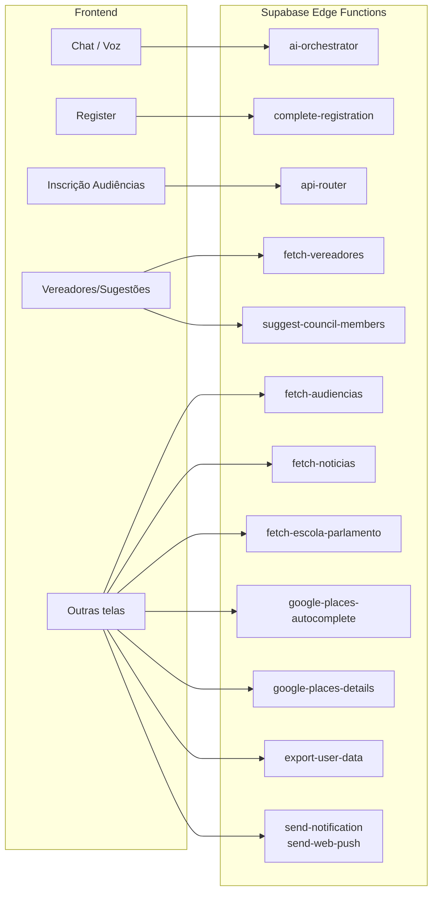

# Diagrama de Arquitetura e Ordem de Execução

Este documento descreve o funcionamento atual do sistema: **frontend**, **Supabase** (Auth, DB, Edge Functions) e **GCP** (Vertex AI, RAG), incluindo a ordem das execuções.

---

## 1. Visão geral dos componentes

```mermaid
flowchart TB
  subgraph Frontend["Frontend (React/Vite)"]
    UI[Telas e componentes]
    useUnifiedAIChat[useUnifiedAIChat]
    AuthContext[AuthContext]
    Register[Register / Cadastro]
  end

  subgraph Supabase["Supabase"]
    Auth[Auth (GoTrue)]
    DB[(PostgreSQL)]
    Edge[Edge Functions]
  end

  subgraph GCP["Google Cloud (GCP)"]
    VertexToken[Cloud Function\nvertex-token\n(opcional)]
    VertexAI[Vertex AI\nchat/completions]
    VertexRAG[Vertex AI Search\nData Store RAG]
  end

  UI --> useUnifiedAIChat
  UI --> AuthContext
  UI --> Register
  AuthContext --> Auth
  Register --> Auth
  Register --> Edge
  useUnifiedAIChat --> Edge
  Edge --> Auth
  Edge --> DB
  Edge --> VertexToken
  Edge --> VertexAI
  Edge --> VertexRAG
  VertexToken -.->|Bearer token| VertexAI
  VertexToken -.->|Bearer token| VertexRAG
```

- **Frontend:** consome Supabase (Auth + REST/Realtime) e chama Edge Functions (fetch direto com `Authorization: Bearer <JWT>`).
- **Supabase:** autenticação, banco de dados e execução das Edge Functions (Deno).
- **GCP:** Vertex AI para o chat (modelo Gemini/OpenAI-compatible), Vertex AI Search para RAG (base de conhecimento) e, se configurado, uma Cloud Function que devolve o token do Vertex (`VERTEX_TOKEN_URL`).

---

## 2. Fluxo de autenticação e cadastro

```mermaid
sequenceDiagram
  participant U as Usuário
  participant F as Frontend
  participant Auth as Supabase Auth
  participant DB as Supabase DB
  participant EF as Edge Function\ncomplete-registration

  Note over U,EF: Cadastro (Register)

  U->>F: Preenche e-mail, senha, nome, telefone (Step 1–2)
  F->>Auth: signUp(email, password)
  Auth-->>F: { user } ou erro (ex.: e-mail já existe)

  alt Usuário criado
    F->>DB: upsert profiles (id, full_name, phone)
    F->>DB: grant_consent (termos, privacidade)
    F->>U: Step 3: Sobre você (demográficos)
    U->>F: Step 4: Endereço (CEP, número, etc.)
    U->>F: Step 5: Interesses (≥3)
    U->>F: Finalizar cadastro

    F->>Auth: refreshSession() + getSession()
    F->>EF: POST /functions/v1/complete-registration\nBody: userId, fullName, phone, birthDate, gender, race, incomeRange, endereço, interests\nAuthorization: Bearer &lt;session.access_token&gt;

    Note over EF: verify_jwt = false (aceita anon ou user)
    EF->>Auth: admin.getUserById(userId) [service role]
    EF->>DB: profiles (onboarding_completed_at)
    EF->>DB: user_demographics (birth_date, gender, race, social_class)
    EF->>DB: user_addresses (insert)
    EF->>DB: user_interests (insert)
    EF->>DB: notification_settings, notifications (boas-vindas)
    EF-->>F: { success: true }

    F->>F: toast "Cadastro concluído! Faça login..."
    F->>Auth: signOut()
    F->>U: navigate("/login")
  end
```

**Ordem resumida (cadastro):**

1. Frontend chama **Supabase Auth** `signUp`.
2. Frontend grava **profiles** e consentimentos no **DB** (com JWT do usuário).
3. Usuário avança pelos steps 3 (Sobre você), 4 (Endereço), 5 (Interesses).
4. Ao finalizar: Frontend obtém sessão (`refreshSession` + `getSession`) e chama a Edge Function **complete-registration** com o body (userId, demográficos, endereço, interesses).
5. **complete-registration** (service role) valida o usuário (criado nos últimos 30 min), depois faz upsert/insert em **profiles**, **user_demographics**, **user_addresses**, **user_interests**, **notification_settings** e **notifications**.
6. Frontend faz **signOut** e redireciona para **/login**.

---

## 3. Fluxo do chat com IA (ai-orchestrator)

```mermaid
sequenceDiagram
  participant U as Usuário
  participant F as Frontend\n(useUnifiedAIChat)
  participant EF as Edge Function\nai-orchestrator
  participant Auth as Supabase Auth
  participant DB as Supabase DB
  participant GCP as GCP (Vertex)
  participant VertexRAG as Vertex AI Search\n(RAG)
  participant VertexAI as Vertex AI\n(chat/completions)

  U->>F: Envia mensagem no chat
  F->>Auth: getSession() [token]
  F->>EF: POST /functions/v1/ai-orchestrator\nBody: { messages, conversationId, collectionType }\nAuthorization: Bearer &lt;JWT&gt;

  Note over EF: 1) Carrega env (AI_BASE_URL, VERTEX_RAG_DATASTORE, etc.)

  alt VERTEX_TOKEN_URL configurado
    EF->>GCP: GET VERTEX_TOKEN_URL\nHeader: X-Token-Secret
    GCP-->>EF: { token } (Bearer para Vertex)
  end

  EF->>Auth: getUser(JWT) [valida usuário]
  Auth-->>EF: user

  EF->>EF: Parse body (messages, collectionType)
  EF->>EF: detectCollectionIntent(lastUserMsg, messages)
  EF->>EF: accumulateFieldsFromHistory(messages, collectionType)

  Note over EF: 2) Short-circuit determinístico (relato/transporte/avaliação)
  alt Intent estruturado e próximo campo conhecido
    EF->>EF: getNextMissingField(...) → nextFieldInfo
    alt Todos os campos preenchidos
      EF->>DB: executeTool(create_urban_report | create_transport_report | create_service_rating)
      DB-->>EF: resultado
      EF-->>F: SSE stream (resposta + [COLLECTION_PROGRESS])
    else Falta campo
      EF-->>F: SSE stream (pergunta determinística + picker)
    end
  end

  Note over EF: 3) RAG Vertex (intent = general)
  alt collectionIntent === 'general' e VERTEX_RAG_DATASTORE
    EF->>VertexRAG: generateContent (Vertex AI Search)\ncontents: [user message]\ntools: retrieval (datastore)
    VertexRAG-->>EF: candidates[0].content.parts[0].text
    EF->>EF: Injeta bloco [Contexto da base de conhecimento...] no system prompt
    EF->>EF: effectiveTools = tools SEM search_knowledge_base
  end

  Note over EF: 4) Chamada ao modelo de IA (streaming)
  EF->>VertexAI: POST .../chat/completions\nmodel, messages (system + últimas 10), tools, tool_choice
  VertexAI-->>EF: stream (SSE)

  loop Stream de chunks
    EF-->>F: data: { choices: [{ delta: { content } }] }
  end

  Note over EF: 5) Se o modelo retornar tool_calls (vLLM/OpenAI)
  alt tool_calls presentes
    EF->>EF: Parse tool_calls
    EF->>DB: executeTool(nome, args, userId, supabase)
    DB-->>EF: resultado
    EF->>VertexAI: Nova chamada com tool result (ou resposta final)
    VertexAI-->>EF: stream
    EF-->>F: SSE
  end

  EF-->>F: data: [DONE]
  F->>U: Atualiza mensagens e UI
```

**Ordem resumida (chat):**

1. Frontend envia mensagens + `collectionType` para **ai-orchestrator** (Bearer JWT).
2. **ai-orchestrator** carrega env; opcionalmente obtém token do Vertex em **VERTEX_TOKEN_URL** (GCP).
3. Valida JWT com **Supabase Auth** (`getUser`).
4. Faz **detectCollectionIntent** e **accumulateFieldsFromHistory** (lib).
5. **Short-circuit determinístico:** para relato urbano, transporte ou avaliação de serviço, calcula próximo campo; se todos preenchidos, chama **executeTool** (create_urban_report, create_transport_report ou create_service_rating) no **Supabase DB** e devolve resposta em SSE; senão devolve pergunta determinística (e pickers).
6. **RAG:** se intent = `general` e há `VERTEX_RAG_DATASTORE`, chama **Vertex AI Search** (generateContent com retrieval no data store), injeta o texto no system prompt e remove a tool `search_knowledge_base` das tools.
7. Chama **Vertex AI** `chat/completions` (streaming) com system prompt, últimas 10 mensagens e `effectiveTools`.
8. Se a resposta vier com **tool_calls**, executa as tools no **DB** (lib.executeTool) e pode fazer nova chamada ao modelo; o stream é repassado ao frontend em SSE até `[DONE]`.

---

## 4. Onde cada coisa roda

| Componente | Onde roda | Observação |
|------------|-----------|------------|
| **Auth (login, signUp, JWT)** | Supabase (GoTrue) | Frontend usa `supabase.auth.*` |
| **Banco de dados (profiles, reports, etc.)** | Supabase (PostgreSQL) | Acesso via REST (RLS) ou service role nas Edge Functions |
| **complete-registration** | Supabase Edge Function | `verify_jwt = false`; usa service role para escrever no DB |
| **ai-orchestrator** | Supabase Edge Function | `verify_jwt = false`; valida JWT no código; chama Vertex e DB |
| **Token do Vertex** | GCP (Cloud Function em VERTEX_TOKEN_URL) | Opcional; retorna Bearer para Vertex AI |
| **Modelo de chat (Gemini, etc.)** | GCP Vertex AI | Endpoint `chat/completions` (OpenAI-compatible) |
| **RAG (base de conhecimento)** | GCP Vertex AI Search | Data store (site/documentos); chamada `generateContent` com retrieval |

---

## 5. Edge Functions e quem as chama



- **ai-orchestrator:** único ponto de entrada do chat; faz detecção de intent, RAG (Vertex), chamada ao modelo e execução de tools no DB.
- **complete-registration:** só o fluxo de cadastro (finalizar).
- **api-router:** inscrição em audiências (e possíveis outros endpoints).
- **fetch-vereadores / suggest-council-members:** sugestão de vereadores (relato urbano, etc.).
- **fetch-audiencias, fetch-noticias, fetch-escola-parlamento:** dados para listagens/agenda.
- **google-places-***:** autocomplete e detalhes de endereço.
- **export-user-data, send-notification, send-web-push:** exportação de dados e notificações.

---

## 6. Fluxo de dados GCP (Vertex + RAG)

```mermaid
flowchart TB
  subgraph Supabase["Supabase"]
    EF[ai-orchestrator]
  end

  subgraph GCP["GCP"]
    Token[VERTEX_TOKEN_URL\n(Cloud Function)]
    VertexAI[Vertex AI\nsouthamerica-east1]
    RAG[Vertex AI Search\nData Store\nglobal]
  end

  EF -->|1. GET token| Token
  Token -->|2. Bearer token| EF
  EF -->|3a. generateContent + retrieval| RAG
  RAG -->|3b. Texto grounded| EF
  EF -->|4. chat/completions (stream)| VertexAI
  VertexAI -->|5. SSE| EF
```

1. **Token:** ai-orchestrator chama `VERTEX_TOKEN_URL` com `X-Token-Secret` e recebe `{ "token": "..." }` para usar como Bearer nas APIs do Vertex.
2. **RAG:** para intent `general`, chama Vertex AI `generateContent` com tool de retrieval no **Data Store** (Vertex AI Search); o texto retornado é injetado no system prompt e a tool `search_knowledge_base` é removida.
3. **Chat:** a mesma Edge Function chama o endpoint **chat/completions** do Vertex (modelo configurado em `AI_CHAT_MODEL`), em streaming, e repassa o SSE ao frontend.

---

## 7. Resumo da ordem de execução (chat, uma mensagem)

1. Frontend: `sendMessage` → `getSession()` → `POST /functions/v1/ai-orchestrator` com `messages` e `collectionType`.
2. ai-orchestrator: carrega env; opcionalmente obtém token em `VERTEX_TOKEN_URL` (GCP).
3. ai-orchestrator: valida JWT (Supabase Auth).
4. ai-orchestrator: detecta intent e acumula campos (lib).
5. Se for jornada estruturada e todos os campos preenchidos → executa tool de criação no Supabase DB e retorna SSE.
6. Se for intent `general` e houver RAG → chama Vertex AI Search (generateContent + datastore), injeta contexto no prompt e remove `search_knowledge_base`.
7. ai-orchestrator: chama Vertex AI `chat/completions` (stream) com prompt e tools.
8. Se houver tool_calls na resposta → executa tools no Supabase DB (lib.executeTool) e pode chamar de novo o modelo.
9. Stream SSE é enviado ao frontend até `[DONE]`.

Se quiser, posso detalhar um fluxo específico (por exemplo só RAG ou só cadastro) em outro diagrama ou seção.
