# Diagrama de Integrações - Câmara na Mão

**Versão:** 1.0  
**Data:** 2026-01-27  
**Projeto:** Câmara na Mão - Plataforma de Participação Cidadã

---

## Sumário

Este documento apresenta os diagramas de integração do sistema Câmara na Mão, mostrando como os diferentes componentes se comunicam e interagem com serviços externos.

---

## 1. Diagrama Geral de Integrações

### 1.1 Visão de Alto Nível

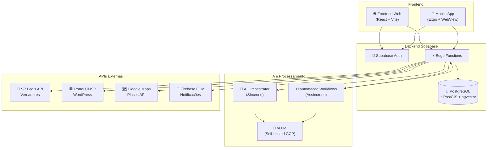

### 1.2 Legenda de Componentes

| Símbolo | Componente | Tipo |
|---------|------------|------|
| 🌐 | Frontend Web | React SPA |
| 📱 | Mobile App | Expo + WebView |
| 🔐 | Autenticação | Supabase Auth |
| 💾 | Banco de Dados | PostgreSQL |
| ⚡ | Edge Functions | Supabase Functions |
| 🤖 | AI Orchestrator | Processamento síncrono |
| 🧠 | vLLM | LLM self-hosted |
| ⚙️ | automacao | Workflow automation |
| 📜 | SP Legis | API externa |
| 🏛️ | Portal CMSP | WordPress API |
| 🗺️ | Google Maps | Places API |
| 📲 | Firebase FCM | Push notifications |

---

## 2. Integração: Frontend ↔ Supabase

### 2.1 Diagrama de Sequência

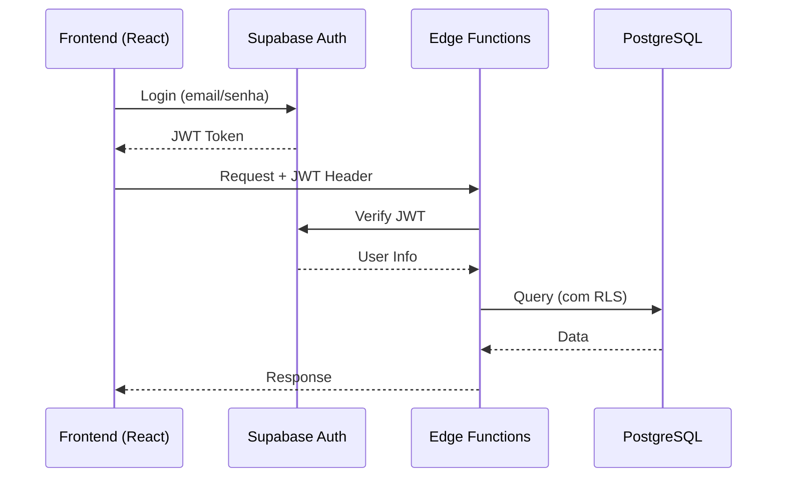

### 2.2 Endpoints Principais

| Endpoint | Método | Propósito |
|----------|--------|-----------|
| `/functions/v1/ai-orchestrator` | POST | Chat com IA |
| `/functions/v1/generate-embeddings` | POST | Gerar embeddings |
| `/functions/v1/recommend-services` | POST | Recomendar serviços |
| `/rest/v1/profiles` | GET/POST | Perfis de usuário |
| `/rest/v1/urban_reports` | GET/POST | Relatos urbanos |
| `/rest/v1/transport_reports` | GET/POST | Relatos de transporte |

### 2.3 Autenticação

- **Método**: JWT (JSON Web Tokens)
- **Provider**: Supabase Auth
- **Header**: `Authorization: Bearer <token>`
- **Validação**: Automática via Supabase (RLS)

---

## 3. Integração: AI Orchestrator ↔ LLM

### 3.1 Diagrama de Fluxo

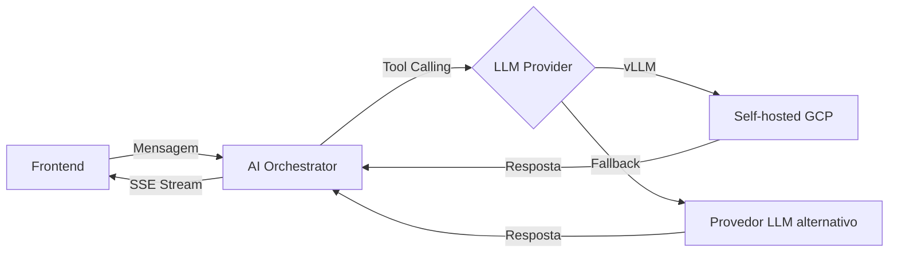

### 3.2 Configuração de LLM

**Provider Primário (vLLM):**
- **URL**: `http://35.193.16.137:8000/v1`
- **Modelo**: `Qwen/Qwen2.5-7B-Instruct`
- **API**: OpenAI-compatible

**Provedor LLM (configurável):**
- **URL**: `AI_CHAT_BASE_URL` (Supabase Secrets)
- **Modelo**: `google/gemini-2.5-flash`
- **API**: OpenAI-compatible

### 3.3 Fluxo de Tool Calling

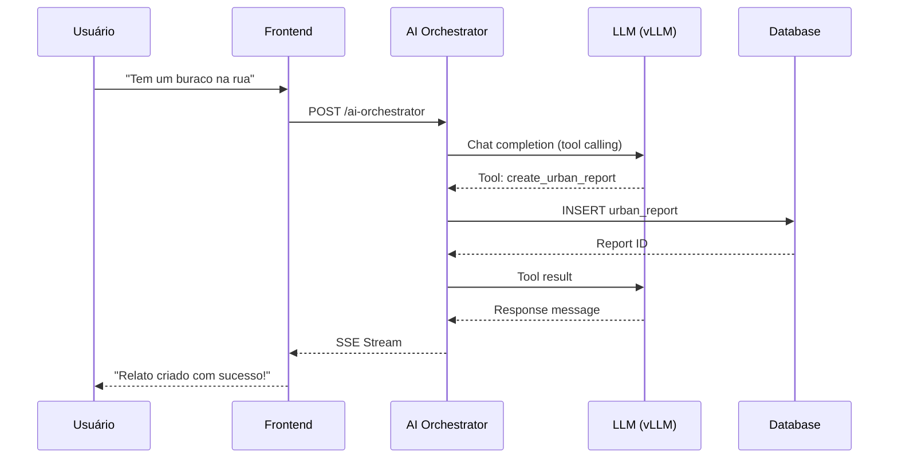

---

## 4. Integração: Supabase ↔ automacao

### 4.1 Diagrama de Sequência Completo

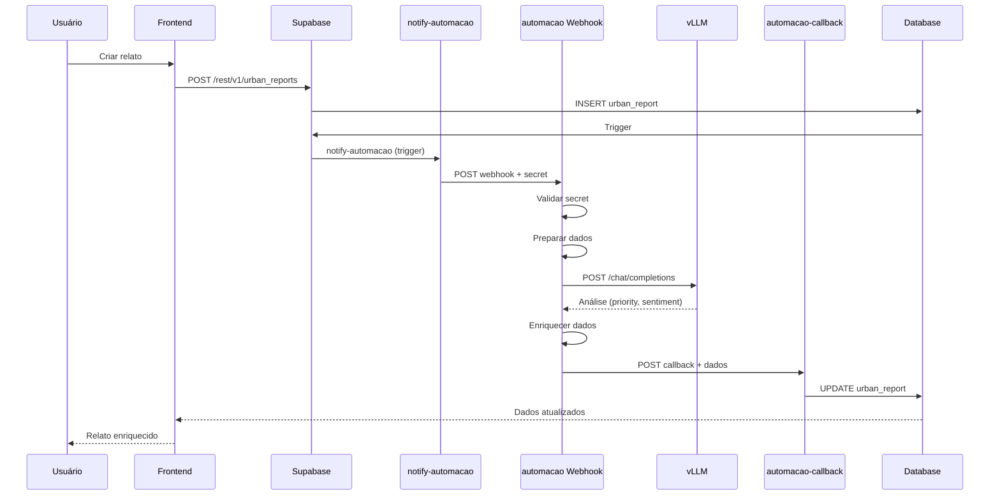

### 4.2 Fluxo Detalhado do Workflow automacao

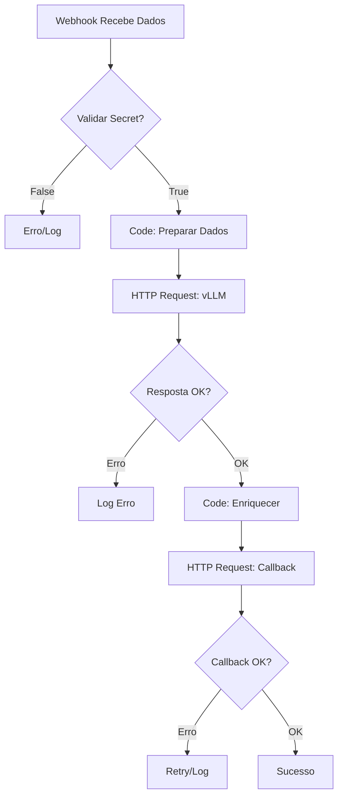

### 4.3 Payloads de Integração

**Webhook → automacao:**
```json
{
  "event": "urban_report_created",
  "timestamp": "2026-01-27T10:00:00.000Z",
  "report": {
    "id": "uuid",
    "type": "urban",
    "description": "Buraco na rua",
    "category": "pavimentacao"
  },
  "callback_url": "https://.../functions/v1/automacao-callback"
}
```

**automacao → Callback:**
```json
{
  "report_id": "uuid",
  "report_type": "urban",
  "processed_data": {
    "priority": "high",
    "sentiment": "negative",
    "summary": "Buraco grande na via"
  }
}
```

---

## 5. Integração: Edge Functions ↔ APIs Externas

### 5.1 Diagrama de Integrações Externas

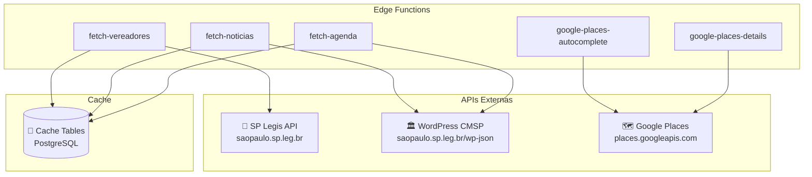

### 5.2 Tabela de Integrações

| API Externa | Edge Function | Cache Table | Hook Frontend | TTL |
|-------------|---------------|-------------|---------------|-----|
| SP Legis (Vereadores) | `fetch-vereadores` | `council_members_cache` | `useVereadores` | 24h |
| WordPress (Notícias) | `fetch-noticias` | `news_cache` | `useNoticias` | 10min |
| WordPress (Agenda) | `fetch-agenda` | `agenda_cache` | `useAgenda` | 10min |
| Google Places (Autocomplete) | `google-places-autocomplete` | Nenhum | `AddressAutocomplete` | N/A |
| Google Places (Details) | `google-places-details` | Nenhum | `AddressAutocomplete` | N/A |
| ViaCEP | Inline no orchestrator | Nenhum | - | N/A |

### 5.3 Fluxo de Cache

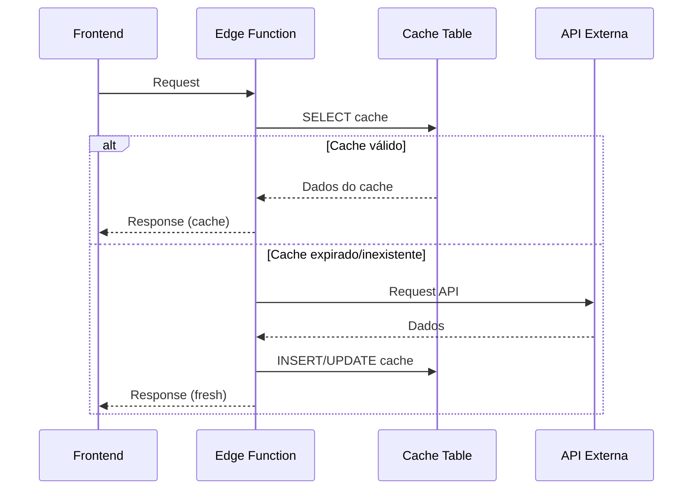

---

## 6. Integração: Mobile ↔ Frontend Web

### 6.1 Arquitetura Mobile

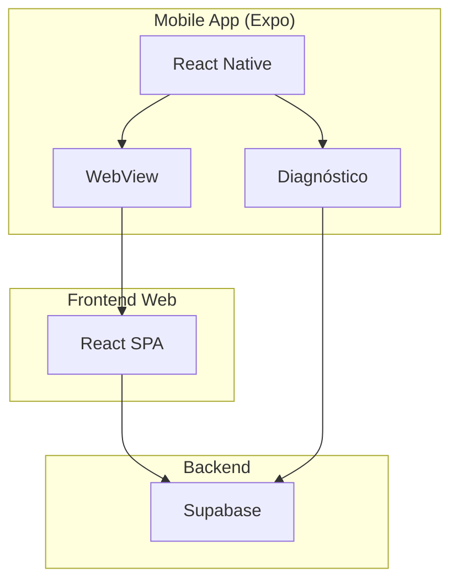

### 6.2 Configuração

- **WebView URL**: `EXPO_PUBLIC_WEB_URL` → Cloud Run
- **Comunicação**: HTTP/HTTPS
- **Autenticação**: Compartilhada via Supabase Auth

---

## 7. Integração: automacao ↔ vLLM

### 7.1 Diagrama de Comunicação

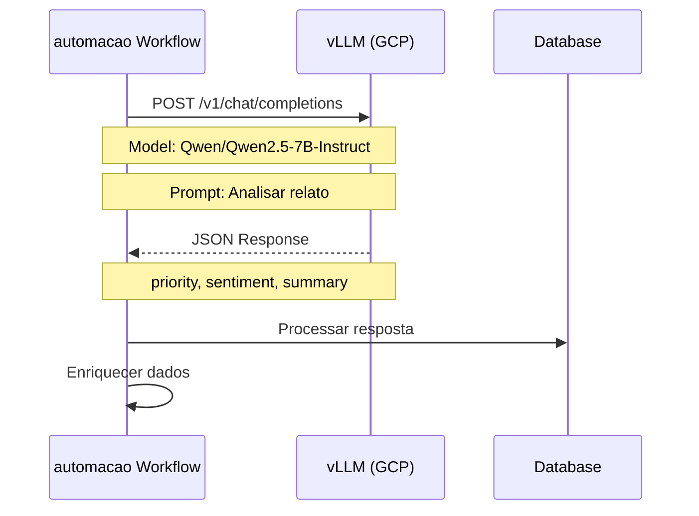

### 7.2 Configuração vLLM

**Infraestrutura:**
- **VM**: `llm-chat-gpu` (us-central1-b)
- **Tipo**: n1-standard-4 + NVIDIA T4
- **Container**: `vllm/vllm-openai:latest`
- **Porta**: 8000
- **Firewall**: Porta 8000 aberta no GCP

**Endpoint:**
- **URL**: `http://35.193.16.137:8000/v1/chat/completions`
- **Método**: POST
- **Formato**: OpenAI-compatible API

**Request Example:**
```json
{
  "model": "Qwen/Qwen2.5-7B-Instruct",
  "messages": [
    {
      "role": "system",
      "content": "Analise o relato e retorne JSON com priority, sentiment, summary"
    },
    {
      "role": "user",
      "content": "Buraco grande na rua Paulista"
    }
  ],
  "temperature": 0.3,
  "response_format": { "type": "json_object" },
  "max_tokens": 500
}
```

---

## 8. Fluxo Completo: Criação de Relato com Enriquecimento

### 8.1 Diagrama de Fluxo Completo

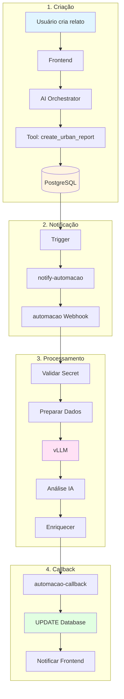

### 8.2 Timeline de Execução

```
T+0ms:   Usuário envia mensagem
T+100ms: AI Orchestrator processa
T+200ms: Tool cria relato no DB
T+300ms: Trigger dispara notify-automacao
T+400ms: automacao recebe webhook
T+500ms: automacao valida e prepara
T+1000ms: automacao chama vLLM
T+3000ms: vLLM retorna análise
T+3100ms: automacao enriquece dados
T+3200ms: automacao envia callback
T+3300ms: Database atualizado
T+3400ms: Frontend recebe atualização
```

---

## 9. Integração: Autenticação e Autorização

### 9.1 Fluxo de Autenticação

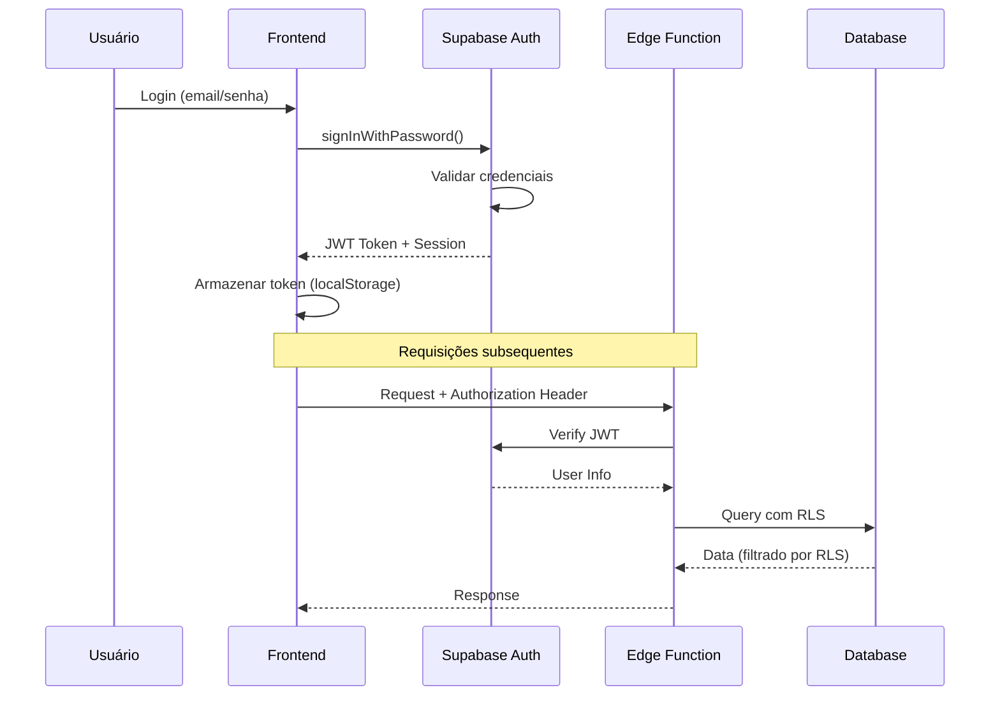

### 9.2 RBAC (Role-Based Access Control)

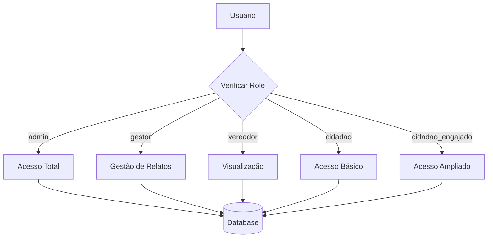

---

## 10. Integração: Notificações Push

### 10.1 Fluxo de Notificações

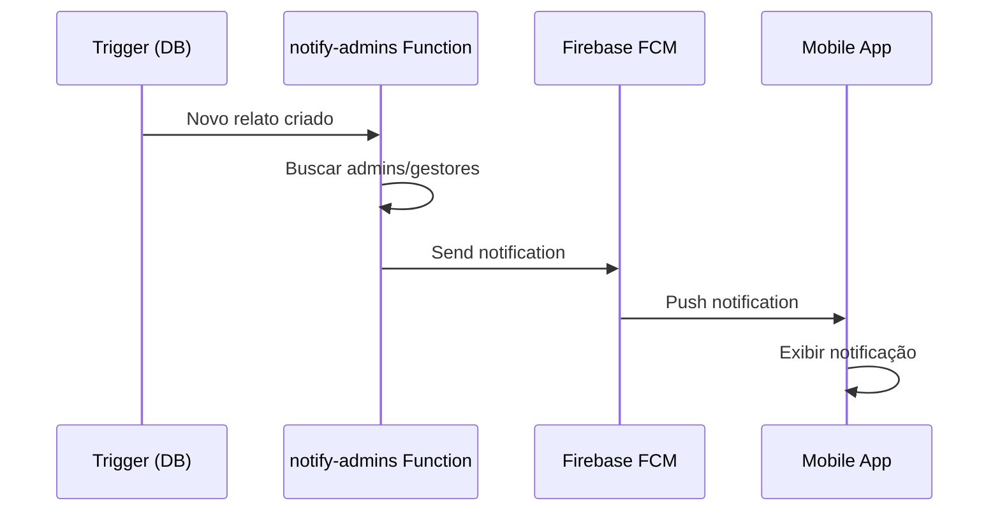

---

## 11. Protocolos e Autenticação

### 11.1 Protocolos Utilizados

| Integração | Protocolo | Autenticação |
|------------|-----------|--------------|
| Frontend ↔ Supabase | HTTPS | JWT (Bearer Token) |
| Edge Functions ↔ APIs | HTTPS | API Keys |
| automacao ↔ Supabase | HTTPS | Secret Key (Header) |
| automacao ↔ vLLM | HTTP | Opcional (API Key) |
| Mobile ↔ Frontend | HTTPS | JWT (via Supabase) |

### 11.2 Headers de Autenticação

**Supabase API:**
```
Authorization: Bearer <jwt_token>
apikey: <supabase_anon_key>
```

**automacao Webhook:**
```
x-automacao-secret: <secret_key>
Content-Type: application/json
```

**vLLM:**
```
Authorization: Bearer <api_key> (opcional)
Content-Type: application/json
```

**Google Places:**
```
X-Goog-Api-Key: <google_api_key>
Content-Type: application/json
```

---

## 12. Endpoints e URLs

### 12.1 Endpoints Internos (Supabase)

| Endpoint | Método | Descrição |
|----------|--------|-----------|
| `/functions/v1/ai-orchestrator` | POST | Chat com IA |
| `/functions/v1/notify-automacao` | POST | Notificar automacao |
| `/functions/v1/automacao-callback` | POST | Callback do automacao |
| `/functions/v1/generate-embeddings` | POST | Gerar embeddings |
| `/functions/v1/fetch-vereadores` | GET | Buscar vereadores |
| `/functions/v1/fetch-noticias` | GET | Buscar notícias |
| `/functions/v1/fetch-agenda` | GET | Buscar agenda |
| `/functions/v1/google-places-autocomplete` | POST | Autocomplete de endereços |
| `/functions/v1/google-places-details` | POST | Detalhes de endereço |

### 12.2 Endpoints Externos

| Serviço | URL | Descrição |
|---------|-----|-----------|
| automacao Webhook | `https://felipemtechautomacao.app.automacao.cloud/webhook/camara-na-mao` | Webhook de entrada |
| vLLM | `http://35.193.16.137:8000/v1` | API do LLM self-hosted |
| SP Legis | `https://saopaulo.sp.leg.br/vereadores-json/` | API de vereadores |
| Portal CMSP | `https://saopaulo.sp.leg.br/wp-json/wp/v2/` | WordPress API |
| Google Places | `https://places.googleapis.com/v1/` | Places API |
| ViaCEP | `https://viacep.com.br/ws/{cep}/json` | API de CEP |

---

## 13. Tratamento de Erros e Retry

### 13.1 Estratégia de Retry

```mermaid
flowchart TB
    A[Request] --> B{Sucesso?}
    B -->|Sim| C[Processar]
    B -->|Não| D{Erro Retryable?}
    D -->|Sim| E[Wait]
    E --> F[Retry (max 3x)]
    F --> B
    D -->|Não| G[Log Erro]
    C --> H[Sucesso]
    G --> I[Notificar]
```

### 13.2 Retry Logic

- **automacao**: Retry automático (3 tentativas)
- **Edge Functions**: Retry manual via código
- **vLLM**: Timeout de 30s, sem retry automático
- **APIs Externas**: Cache como fallback

---

## 14. Monitoramento e Logs

### 14.1 Pontos de Log

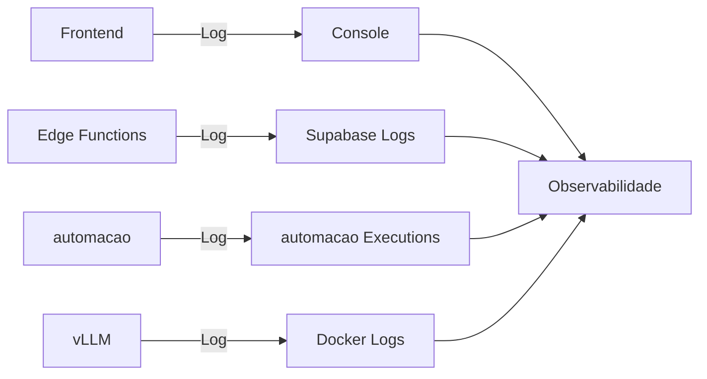

### 14.2 Métricas Importantes

- **Latência**: Tempo de resposta de cada integração
- **Taxa de Erro**: % de requisições falhadas
- **Throughput**: Requisições por segundo
- **Cache Hit Rate**: % de hits no cache

---

## 15. Segurança

### 15.1 Camadas de Segurança

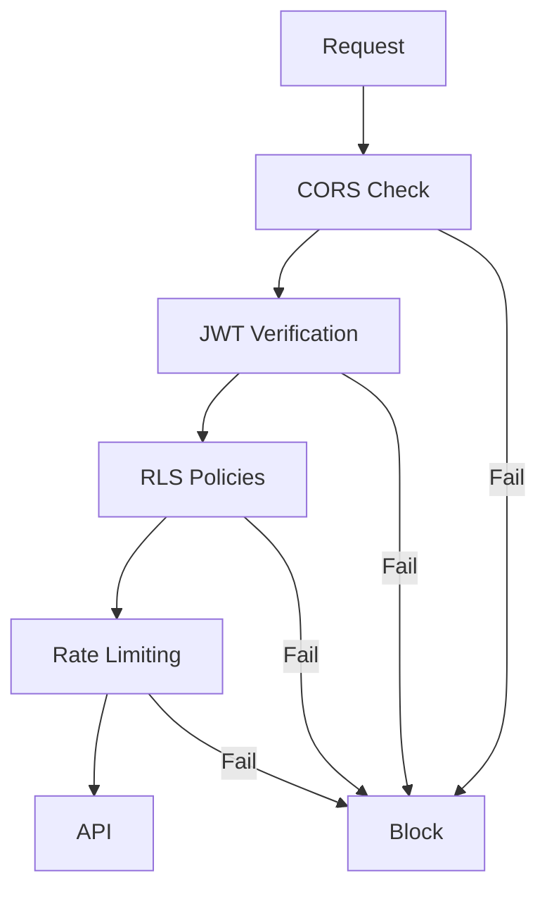

### 15.2 Validações

- **CORS**: Configurado por origem
- **JWT**: Verificação em todas as Edge Functions
- **RLS**: Row Level Security no PostgreSQL
- **Secret Keys**: Validação em webhooks automacao
- **Rate Limiting**: Implementado no Supabase

---

## 16. Referências

- [Documento de Arquitetura](./DOCUMENTO_ARQUITETURA.md)
- [Guia de Configuração automacao](./GUIA_CONFIGURACAO_automacao_PASSO_A_PASSO.md)
- [Especificação do AI Orchestrator](./AI_ORCHESTRATOR_SPECIFICATION.md)
- [Guia de Integração automacao](./automacao_INTEGRATION_GUIDE.md)

---

**Última atualização:** 2026-01-27  
**Mantido por:** Equipe de Desenvolvimento Câmara na Mão
