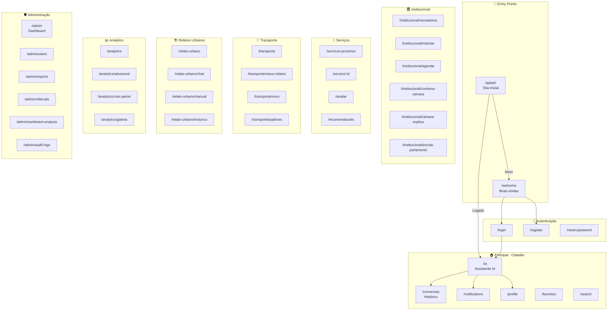
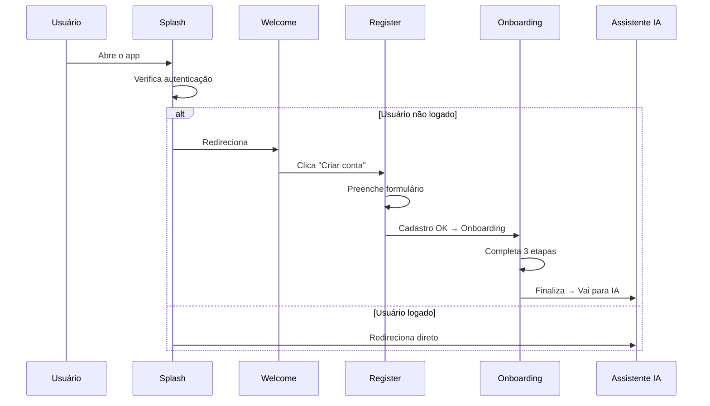
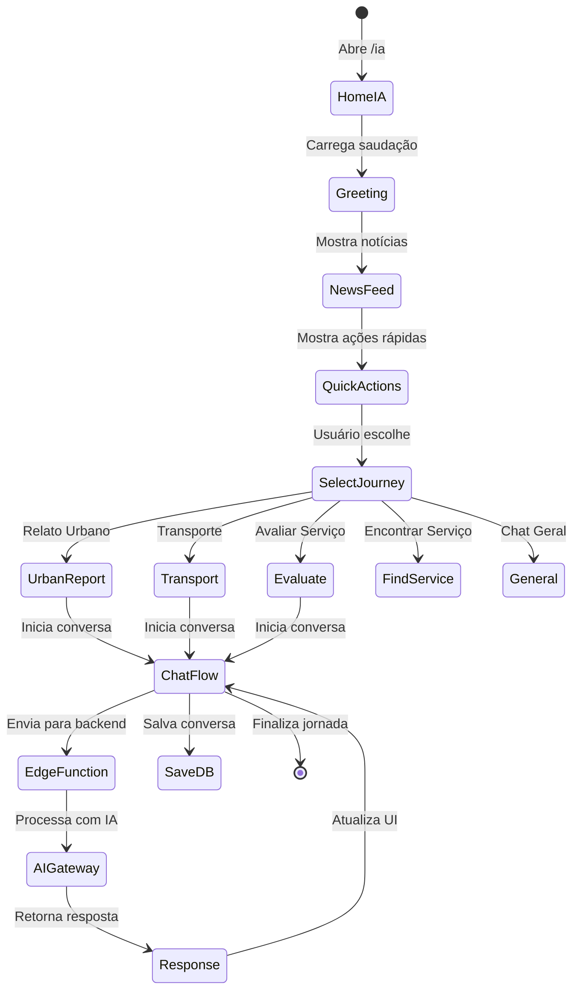
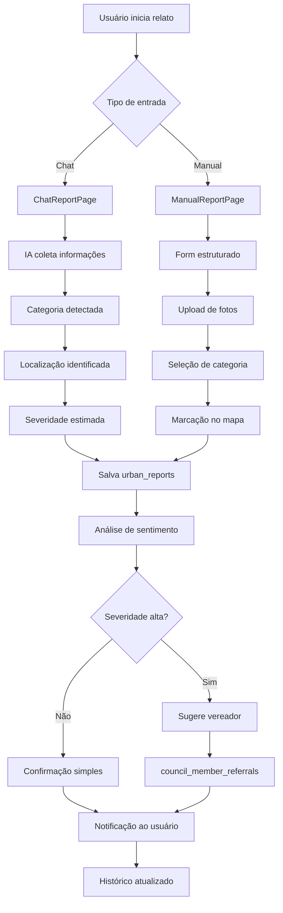
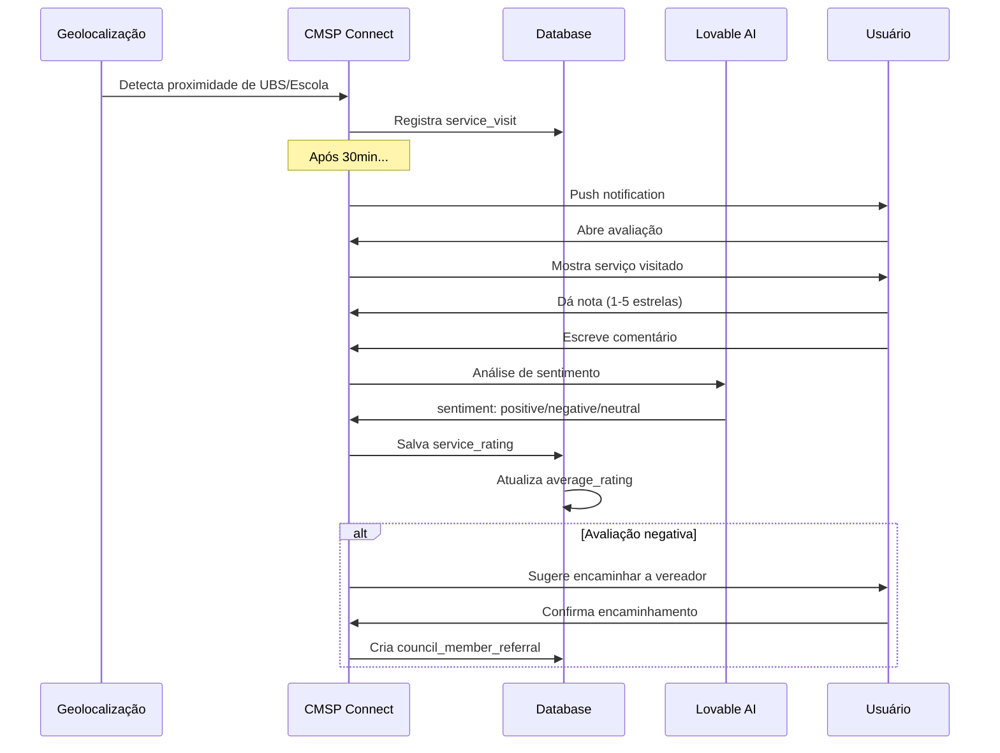
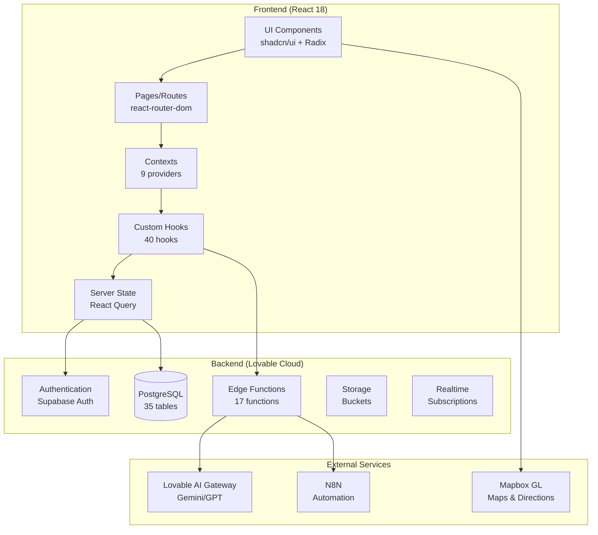
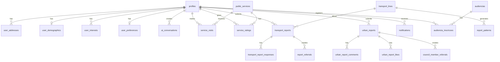

# 📋 DOCUMENTAÇÃO TÉCNICA COMPLETA - CMSP CONNECT

> **Versão:** 1.0  
> **Data:** Dezembro 2024  
> **Projeto:** CMSP Connect - Aplicativo de Participação Cidadã  
> **Desenvolvido para:** Câmara Municipal de São Paulo

---

## 📑 ÍNDICE

1. [Exportação de Código](#1-exportação-de-código)
   - [1.1 Estrutura de Diretórios](#11-estrutura-de-diretórios)
   - [1.2 Arquivos de Configuração](#12-arquivos-de-configuração)
   - [1.3 Dependências do Projeto](#13-dependências-do-projeto)
2. [Documentação de Arquitetura](#2-documentação-de-arquitetura)
   - [2.1 Mapeamento de Rotas](#21-mapeamento-de-rotas)
   - [2.2 Catálogo de Componentes](#22-catálogo-de-componentes)
   - [2.3 Fluxos de Navegação](#23-fluxos-de-navegação)
   - [2.4 Estrutura de Dados](#24-estrutura-de-dados)
3. [Guia de Funcionalidades](#3-guia-de-funcionalidades)
   - [3.1 Módulos Funcionais](#31-módulos-funcionais)
   - [3.2 Jornadas do Usuário](#32-jornadas-do-usuário)
   - [3.3 Integrações](#33-integrações)
   - [3.4 Pontos de Entrada](#34-pontos-de-entrada)
4. [Especificações Técnicas](#4-especificações-técnicas)
   - [4.1 Stack Tecnológico](#41-stack-tecnológico)
   - [4.2 Padrões de Design](#42-padrões-de-design)
   - [4.3 Componentes UI/UX](#43-componentes-uiux)
   - [4.4 Modelo de Dados](#44-modelo-de-dados)

---

# 1. EXPORTAÇÃO DE CÓDIGO

## 1.1 Estrutura de Diretórios

```
cmsp-connect/
├── 📁 docs/                          # Documentação do projeto
│   ├── ARQUITETURA_CMSP_CONNECT.md
│   ├── CMSP_CONNECT_REQUIREMENTS_SPEC.md
│   ├── CRONOGRAMA_CMSP_CONNECT.md
│   ├── ESPECIFICACAO_ESCOPO_CMSP_CONNECT.md
│   ├── ESPECIFICACAO_REFINADA_CMSP_CONNECT.md
│   ├── JOURNEY_ARCHITECTURE.md
│   ├── MODELO_DADOS_CMSP_CONNECT.md
│   ├── N8N_INTEGRATION_GUIDE.md
│   ├── OS_01_DIAGNOSTICO_CMSP_CONNECT.md
│   ├── OS_CMSP_CONNECT.md
│   ├── OVERVIEW_CMSP_CONNECT.md
│   └── n8n-workflow-template.json
│
├── 📁 public/                        # Arquivos estáticos públicos
│   ├── favicon-cmsp.png
│   ├── icon-192.png
│   ├── icon-512.png
│   └── robots.txt
│
├── 📁 src/                           # Código-fonte principal
│   ├── 📁 assets/                    # Recursos estáticos
│   │   ├── 📁 lottie/                # Animações Lottie
│   │   │   ├── ai-assistant.json
│   │   │   ├── community.json
│   │   │   ├── location.json
│   │   │   └── transparency.json
│   │   ├── avatar-luana.jpg
│   │   ├── brasao-sp.png
│   │   ├── bus-sptrans.png
│   │   ├── camara-aberta-logo.png
│   │   ├── camara-logo.png
│   │   ├── ia-icone.png
│   │   ├── map-location.png
│   │   └── splash-bg.png
│   │
│   ├── 📁 components/                # Componentes React (120+)
│   │   ├── 📁 admin/                 # Componentes administrativos (15)
│   │   ├── 📁 ai/                    # Componentes de IA (24)
│   │   ├── 📁 analytics/             # Componentes analíticos (20)
│   │   ├── 📁 audiencias/            # Audiências públicas (2)
│   │   ├── 📁 docs/                  # Documentação (5)
│   │   ├── 📁 evaluation/            # Avaliação de serviços (4)
│   │   ├── 📁 favorites/             # Favoritos (1)
│   │   ├── 📁 filters/               # Filtros (5)
│   │   ├── 📁 home/                  # Home (1)
│   │   ├── 📁 institucional/         # Institucional (2)
│   │   ├── 📁 map/                   # Mapas (5)
│   │   ├── 📁 onboarding/            # Onboarding (1)
│   │   ├── 📁 profile/               # Perfil (5)
│   │   ├── 📁 referral/              # Encaminhamentos (3)
│   │   ├── 📁 register/              # Registro (5)
│   │   ├── 📁 transport/             # Transporte (7)
│   │   ├── 📁 ui/                    # Componentes UI base (52)
│   │   ├── 📁 urban/                 # Relatos urbanos (4)
│   │   └── MenuDrawer.tsx
│   │
│   ├── 📁 config/                    # Configurações
│   │   └── aiJourneys.ts             # Jornadas de IA
│   │
│   ├── 📁 constants/                 # Constantes
│   │   └── notificationTypes.ts
│   │
│   ├── 📁 contexts/                  # Contextos React (9)
│   │   ├── AIContext.tsx
│   │   ├── AIJourneyContext.tsx
│   │   ├── AuthContext.tsx
│   │   ├── EvaluationContext.tsx
│   │   ├── FavoritesContext.tsx
│   │   ├── MenuContext.tsx
│   │   ├── NotificationsContext.tsx
│   │   ├── OnboardingContext.tsx
│   │   └── TransportContext.tsx
│   │
│   ├── 📁 data/                      # Dados estáticos/mock
│   │   ├── mockVoiceResponses.ts
│   │   ├── noticias.ts
│   │   ├── searchData.ts
│   │   ├── transportProblems.ts
│   │   └── vereadores.ts
│   │
│   ├── 📁 hooks/                     # Hooks customizados (35)
│   │   ├── use-mobile.tsx
│   │   ├── use-toast.ts
│   │   ├── useAccessibility.ts
│   │   ├── useAdminDashboardStats.ts
│   │   ├── useAdminStats.ts
│   │   ├── useAdminUsers.ts
│   │   ├── useAIConversations.ts
│   │   ├── useAuditLog.ts
│   │   ├── useCouncilMemberSuggestions.ts
│   │   ├── useDebounce.ts
│   │   ├── useDrillInsight.ts
│   │   ├── useFilters.ts
│   │   ├── useGeolocation.ts
│   │   ├── useJourneyDraft.ts
│   │   ├── useMapboxDirections.ts
│   │   ├── useN8NMonitoring.ts
│   │   ├── useNearbyServices.ts
│   │   ├── usePendingRatings.ts
│   │   ├── useProfile.ts
│   │   ├── useProfileCompletion.ts
│   │   ├── useReferralsAdmin.ts
│   │   ├── useReportPatterns.ts
│   │   ├── useReportsAdmin.ts
│   │   ├── useReportsAnalytics.ts
│   │   ├── useSearchHistory.ts
│   │   ├── useSentimentAnalytics.ts
│   │   ├── useServiceRating.ts
│   │   ├── useSystemSettings.ts
│   │   ├── useTransportLines.ts
│   │   ├── useTransportReport.ts
│   │   ├── useUnifiedAIChat.ts
│   │   ├── useUrbanReportComments.ts
│   │   ├── useUrbanReportInteractions.ts
│   │   ├── useUserRole.ts
│   │   └── useWebSpeechChat.ts
│   │
│   ├── 📁 integrations/              # Integrações
│   │   └── 📁 supabase/
│   │       ├── client.ts             # Cliente Supabase (auto-gerado)
│   │       └── types.ts              # Tipos TypeScript (auto-gerado)
│   │
│   ├── 📁 layouts/                   # Layouts
│   │   └── AdminLayout.tsx
│   │
│   ├── 📁 lib/                       # Utilitários
│   │   ├── imageUtils.ts
│   │   ├── mapUtils.ts
│   │   ├── utils.ts
│   │   └── validations.ts
│   │
│   ├── 📁 pages/                     # Páginas (77 rotas)
│   │   ├── 📁 admin/                 # Área administrativa
│   │   │   ├── 📁 settings/
│   │   │   │   ├── AccessibilitySettings.tsx
│   │   │   │   ├── N8NIntegration.tsx
│   │   │   │   └── N8NMonitoring.tsx
│   │   │   ├── AdminDashboard.tsx
│   │   │   ├── AuditLogs.tsx
│   │   │   ├── ExportLogs.tsx
│   │   │   ├── ReferralsManagement.tsx
│   │   │   ├── ReportsAnalytics.tsx
│   │   │   ├── ReportsManagement.tsx
│   │   │   ├── SentimentAnalysis.tsx
│   │   │   └── UserManagement.tsx
│   │   ├── 📁 analytics/             # Analytics avançado
│   │   │   ├── AdvancedAnalytics.tsx
│   │   │   ├── AnalyticsDashboard.tsx
│   │   │   ├── CreateDashboard.tsx
│   │   │   └── PublicDashboards.tsx
│   │   ├── 📁 audiencias/            # Audiências públicas
│   │   │   ├── AudienciaDetailPage.tsx
│   │   │   └── ParticipacaoPage.tsx
│   │   ├── 📁 docs/                  # Documentação pública
│   │   │   └── PublicDocumentationPage.tsx
│   │   ├── 📁 institucional/         # Conteúdo institucional
│   │   │   ├── AgendaCMSP.tsx
│   │   │   ├── CamaraExplica.tsx
│   │   │   ├── ConhecaCamara.tsx
│   │   │   ├── EscolaParlamento.tsx
│   │   │   ├── NoticiaDetailPage.tsx
│   │   │   ├── Noticias.tsx
│   │   │   ├── VereadorDetailPage.tsx
│   │   │   └── Vereadores.tsx
│   │   ├── 📁 profile/               # Perfil do usuário
│   │   │   ├── AddressPage.tsx
│   │   │   ├── DemographicsPage.tsx
│   │   │   ├── InterestsPage.tsx
│   │   │   ├── PersonalInfoPage.tsx
│   │   │   └── PreferencesPage.tsx
│   │   ├── 📁 settings/              # Configurações
│   │   │   └── AccessibilityPage.tsx
│   │   ├── 📁 transport/             # Transporte
│   │   │   ├── MyReportsPage.tsx
│   │   │   ├── NewReportPage.tsx
│   │   │   ├── PatternsPage.tsx
│   │   │   ├── ReferralPage.tsx
│   │   │   └── UrgentReportPage.tsx
│   │   ├── 📁 urban/                 # Relatos urbanos
│   │   │   ├── ChatReportPage.tsx
│   │   │   ├── ManualReportPage.tsx
│   │   │   └── ReportHistoryPage.tsx
│   │   ├── Audiencias.tsx
│   │   ├── ConversationsPage.tsx
│   │   ├── EvaluationPage.tsx
│   │   ├── FavoritesPage.tsx
│   │   ├── IA.tsx
│   │   ├── Login.tsx
│   │   ├── NearbyServicesPage.tsx
│   │   ├── NotFound.tsx
│   │   ├── Notifications.tsx
│   │   ├── Onboarding.tsx
│   │   ├── Profile.tsx
│   │   ├── Register.tsx
│   │   ├── ResetPassword.tsx
│   │   ├── Search.tsx
│   │   ├── ServiceDetailPage.tsx
│   │   ├── ServiceRecommendationsPage.tsx
│   │   ├── Splash.tsx
│   │   ├── TransportReportPage.tsx
│   │   ├── UrbanReportPage.tsx
│   │   ├── Voz.tsx
│   │   └── Welcome.tsx
│   │
│   ├── 📁 types/                     # Tipos TypeScript
│   │
│   ├── 📁 types/                     # Tipos TypeScript
│   │   ├── analytics.ts
│   │   └── speech.d.ts
│   │
│   ├── App.css                       # Estilos globais
│   ├── App.tsx                       # Componente raiz
│   ├── index.css                     # Tailwind + Design tokens
│   ├── main.tsx                      # Entry point
│   └── vite-env.d.ts                 # Tipos Vite
│
├── 📁 supabase/                      # Backend Lovable Cloud
│   ├── 📁 functions/                 # Edge Functions (17)
│   │   ├── 📁 ai-chat/
│   │   ├── 📁 analyze-sentiment/
│   │   ├── 📁 delete-user/
│   │   ├── 📁 diagnose-transport/
│   │   ├── 📁 evaluate-service/
│   │   ├── 📁 generate-embeddings/
│   │   ├── 📁 n8n-callback/
│   │   ├── 📁 n8n-webhook/
│   │   ├── 📁 notify-n8n/
│   │   ├── 📁 populate-knowledge-base/
│   │   ├── 📁 recommend-services/
│   │   ├── 📁 send-notification/
│   │   ├── 📁 shared/
│   │   │   └── intent-patterns.ts
│   │   ├── 📁 suggest-council-members/
│   │   ├── 📁 text-to-voice/
│   │   ├── 📁 urban-report-chat/
│   │   └── 📁 voice-to-text/
│   └── config.toml                   # Configuração Supabase
│
├── 📁 tests/                         # Testes E2E
│   └── 📁 e2e/
│       ├── ai-chat.spec.ts
│       ├── audiencias.spec.ts
│       ├── auth.spec.ts
│       ├── evaluation.spec.ts
│       ├── transport.spec.ts
│       └── urban.spec.ts
│
├── .env                              # Variáveis de ambiente (auto-gerado)
├── eslint.config.js                  # Configuração ESLint
├── index.html                        # HTML principal
├── package.json                      # Dependências
├── playwright.config.ts              # Configuração Playwright
├── tailwind.config.ts                # Configuração Tailwind
├── tsconfig.json                     # Configuração TypeScript
└── vite.config.ts                    # Configuração Vite
```

## 1.2 Arquivos de Configuração

### `package.json` - Dependências e Scripts

```json
{
  "name": "cmsp-connect",
  "private": true,
  "version": "1.0.0",
  "type": "module",
  "scripts": {
    "dev": "vite",
    "build": "vite build",
    "preview": "vite preview",
    "lint": "eslint .",
    "test": "playwright test"
  }
}
```

### `vite.config.ts` - Build Configuration

```typescript
import { defineConfig } from 'vite'
import react from '@vitejs/plugin-react-swc'
import path from 'path'

export default defineConfig({
  plugins: [react()],
  resolve: {
    alias: {
      "@": path.resolve(__dirname, "./src"),
    },
  },
  server: {
    host: "::",
    port: 8080,
  },
})
```

### `tailwind.config.ts` - Design System

```typescript
// Configuração do sistema de design com tokens semânticos
// - Cores primárias: rose-600 (institucional CMSP)
// - Cores secundárias: pink, gray
// - Border radius, shadows, animações customizadas
// - Dark mode via class strategy
```

### `tsconfig.json` - TypeScript

```json
{
  "compilerOptions": {
    "target": "ES2020",
    "useDefineForClassFields": true,
    "lib": ["ES2020", "DOM", "DOM.Iterable"],
    "module": "ESNext",
    "skipLibCheck": true,
    "moduleResolution": "bundler",
    "resolveJsonModule": true,
    "isolatedModules": true,
    "jsx": "react-jsx",
    "strict": true,
    "baseUrl": ".",
    "paths": {
      "@/*": ["./src/*"]
    }
  }
}
```

## 1.3 Dependências do Projeto

### Dependências de Produção (47 pacotes)

| Categoria | Pacote | Versão | Propósito |
|-----------|--------|--------|-----------|
| **Framework** | react | ^18.3.1 | Biblioteca UI principal |
| | react-dom | ^18.3.1 | Renderização DOM |
| | react-router-dom | ^6.30.1 | Roteamento SPA |
| **UI Components** | @radix-ui/* | ^1.x | Componentes acessíveis headless |
| | class-variance-authority | ^0.7.1 | Variantes de componentes |
| | clsx | ^2.1.1 | Classnames condicionais |
| | tailwind-merge | ^2.6.0 | Merge de classes Tailwind |
| | tailwindcss-animate | ^1.0.7 | Animações Tailwind |
| **Formulários** | react-hook-form | ^7.61.1 | Gerenciamento de formulários |
| | @hookform/resolvers | ^3.10.0 | Resolvers de validação |
| | zod | ^3.25.76 | Schema validation |
| **Estado** | @tanstack/react-query | ^5.83.0 | Server state management |
| **Backend** | @supabase/supabase-js | ^2.84.0 | Cliente Supabase |
| **Mapas** | mapbox-gl | ^3.16.0 | Mapas interativos |
| **Animações** | framer-motion | ^12.23.24 | Animações declarativas |
| | lottie-react | ^2.4.1 | Animações Lottie |
| **Gráficos** | recharts | ^2.15.4 | Visualização de dados |
| | mermaid | ^11.12.2 | Diagramas |
| **Data** | date-fns | ^3.6.0 | Manipulação de datas |
| **Markdown** | react-markdown | ^10.1.0 | Renderização Markdown |
| | remark-gfm | ^4.0.1 | GitHub Flavored Markdown |
| **DnD** | @dnd-kit/* | ^6.x | Drag and drop |
| **UI Extras** | lucide-react | ^0.462.0 | Ícones |
| | sonner | ^1.7.4 | Toasts |
| | vaul | ^0.9.9 | Drawer mobile |
| | cmdk | ^1.1.1 | Command palette |
| | input-otp | ^1.4.2 | Input OTP |
| | react-day-picker | ^8.10.1 | Date picker |
| | embla-carousel-react | ^8.6.0 | Carrossel |
| | react-easy-crop | ^5.5.5 | Crop de imagens |
| | react-resizable-panels | ^2.1.9 | Painéis redimensionáveis |
| | next-themes | ^0.3.0 | Gerenciamento de tema |

---

# 2. DOCUMENTAÇÃO DE ARQUITETURA

## 2.1 Mapeamento de Rotas

### Diagrama de Navegação



### Lista Completa de Rotas (77)

#### Rotas Públicas (Autenticação)

| Rota | Componente | Descrição |
|------|------------|-----------|
| `/splash` | `Splash.tsx` | Tela de carregamento inicial |
| `/welcome` | `Welcome.tsx` | Tela de boas-vindas para novos usuários |
| `/login` | `Login.tsx` | Formulário de login |
| `/register` | `Register.tsx` | Formulário de cadastro |
| `/reset-password` | `ResetPassword.tsx` | Recuperação de senha |

#### Rotas do Cidadão (Requer Autenticação)

| Rota | Componente | Descrição |
|------|------------|-----------|
| `/ia` | `IA.tsx` | Interface principal do assistente IA |
| `/conversas` | `ConversationsPage.tsx` | Histórico de conversas com IA |
| `/notifications` | `Notifications.tsx` | Central de notificações |
| `/profile` | `Profile.tsx` | Perfil do usuário |
| `/profile/personal` | `PersonalInfoPage.tsx` | Dados pessoais |
| `/profile/address` | `AddressPage.tsx` | Endereços |
| `/profile/demographics` | `DemographicsPage.tsx` | Dados demográficos |
| `/profile/interests` | `InterestsPage.tsx` | Interesses temáticos |
| `/profile/preferences` | `PreferencesPage.tsx` | Preferências do app |
| `/favoritos` | `FavoritesPage.tsx` | Serviços e conteúdos favoritos |
| `/search` | `Search.tsx` | Busca global |
| `/onboarding` | `Onboarding.tsx` | Tutorial inicial |
| `/voz` | `Voz.tsx` | Interface de voz |

#### Rotas Institucionais

| Rota | Componente | Descrição |
|------|------------|-----------|
| `/institucional/vereadores` | `Vereadores.tsx` | Lista de vereadores |
| `/institucional/vereadores/:id` | `VereadorDetailPage.tsx` | Perfil do vereador |
| `/institucional/noticias` | `Noticias.tsx` | Feed de notícias |
| `/institucional/noticias/:id` | `NoticiaDetailPage.tsx` | Detalhe da notícia |
| `/institucional/agenda` | `AgendaCMSP.tsx` | Agenda legislativa |
| `/audiencias` | `Audiencias.tsx` | Audiências públicas |
| `/audiencias/:id` | `AudienciaDetailPage.tsx` | Detalhe da audiência |
| `/audiencias/:id/participar` | `ParticipacaoPage.tsx` | Participação na audiência |
| `/institucional/conheca-camara` | `ConhecaCamara.tsx` | Sobre a Câmara |
| `/institucional/camara-explica` | `CamaraExplica.tsx` | Conteúdo educativo |
| `/institucional/escola-parlamento` | `EscolaParlamento.tsx` | Escola do Parlamento |
| `/docs/overview` | `PublicDocumentationPage.tsx` | Documentação pública |

#### Rotas de Serviços Públicos

| Rota | Componente | Descrição |
|------|------------|-----------|
| `/servicos-proximos` | `NearbyServicesPage.tsx` | Serviços próximos (mapa) |
| `/servico/:id` | `ServiceDetailPage.tsx` | Detalhe do serviço |
| `/avaliar` | `EvaluationPage.tsx` | Avaliar serviço visitado |
| `/avaliar/:visitId` | `EvaluationPage.tsx` | Avaliar visita específica |
| `/recomendacoes` | `ServiceRecommendationsPage.tsx` | Recomendações personalizadas |

#### Rotas de Transporte

| Rota | Componente | Descrição |
|------|------------|-----------|
| `/transporte` | `TransportReportPage.tsx` | Hub de transporte |
| `/transporte/meus-relatos` | `MyReportsPage.tsx` | Meus relatos de transporte |
| `/transporte/novo` | `NewReportPage.tsx` | Novo relato |
| `/transporte/padroes` | `PatternsPage.tsx` | Padrões identificados |
| `/transporte/encaminhar/:reportId` | `ReferralPage.tsx` | Encaminhamento a vereador |
| `/transporte/urgente` | `UrgentReportPage.tsx` | Relato urgente |

#### Rotas de Relatos Urbanos

| Rota | Componente | Descrição |
|------|------------|-----------|
| `/relato-urbano` | `UrbanReportPage.tsx` | Hub de relatos urbanos |
| `/relato-urbano/chat` | `ChatReportPage.tsx` | Relato via chat IA |
| `/relato-urbano/manual` | `ManualReportPage.tsx` | Relato manual |
| `/relato-urbano/historico` | `ReportHistoryPage.tsx` | Histórico de relatos |
| `/meus-relatos-urbanos` | `ReportHistoryPage.tsx` | Alias para histórico |

#### Rotas de Analytics

| Rota | Componente | Descrição |
|------|------------|-----------|
| `/analytics` | `AnalyticsDashboard.tsx` | Dashboard principal |
| `/analytics/advanced` | `AdvancedAnalytics.tsx` | Analytics avançado |
| `/analytics/criar-painel` | `CreateDashboard.tsx` | Criar dashboard |
| `/analytics/galeria` | `PublicDashboards.tsx` | Galeria de dashboards públicos |

#### Rotas Administrativas (Requer Role Admin)

| Rota | Componente | Descrição |
|------|------------|-----------|
| `/admin` | `AdminDashboard.tsx` | Dashboard admin |
| `/admin/analytics` | `AnalyticsDashboard.tsx` | Analytics admin |
| `/admin/analytics/advanced` | `AdvancedAnalytics.tsx` | Analytics avançado |
| `/admin/users` | `UserManagement.tsx` | Gestão de usuários |
| `/admin/exports` | `ExportLogs.tsx` | Logs de exportação |
| `/admin/audit-logs` | `AuditLogs.tsx` | Logs de auditoria |
| `/admin/reports` | `ReportsManagement.tsx` | Gestão unificada de relatos |
| `/admin/referrals` | `ReferralsManagement.tsx` | Gestão de encaminhamentos |
| `/admin/reports-analytics` | `ReportsAnalytics.tsx` | Analytics de relatos |
| `/admin/sentiment-analysis` | `SentimentAnalysis.tsx` | Análise de sentimento |
| `/admin/settings/n8n` | `N8NIntegration.tsx` | Integração N8N |
| `/admin/settings/n8n-monitoring` | `N8NMonitoring.tsx` | Monitoramento N8N |
| `/admin/settings/accessibility` | `AccessibilitySettings.tsx` | Config. acessibilidade |

#### Rotas de Configurações

| Rota | Componente | Descrição |
|------|------------|-----------|
| `/settings/accessibility` | `AccessibilityPage.tsx` | Acessibilidade |

---

### 📌 Nota sobre Nomenclatura de Rotas

O CMSP Connect adota **nomenclatura em português brasileiro** para todas as rotas públicas, priorizando:
- **Acessibilidade linguística** para cidadãos brasileiros
- **Clareza semântica** nas URLs
- **Inclusão digital** para usuários não técnicos

#### Tabela de Correspondência: Documentação vs Rotas Reais

| Termo em Documentação | Rota Real no App | Justificativa |
|-----------------------|------------------|---------------|
| `conversations` | `/conversas` | Português BR |
| `favorites` | `/favoritos` | Português BR |
| `nearby-services` | `/servicos-proximos` | Português BR |
| `evaluation` | `/avaliar` | Português BR |
| `recommendations` | `/recomendacoes` | Português BR |
| `transport/*` | `/transporte/*` | Português BR |
| `urban-report/*` | `/relato-urbano/*` | Português BR |
| `analytics/create` | `/analytics/criar-painel` | Português BR |
| `analytics/public` | `/analytics/galeria` | Português BR |
| `/vereadores` | `/institucional/vereadores` | Hierarquia organizada |
| `/noticias` | `/institucional/noticias` | Hierarquia organizada |
| `/agenda` | `/institucional/agenda` | Hierarquia organizada |

## 2.2 Catálogo de Componentes

### Componentes de IA (21)

```
src/components/ai/
├── AIAvatar.tsx              # Avatar animado da IA
├── AgentChatArea.tsx         # Área principal do chat
├── AgentChatLayout.tsx       # Layout do agente
├── AgentHeader.tsx           # Cabeçalho do chat
├── AnimatedAIAvatar.tsx      # Avatar com animações Lottie
├── ChatConversationItem.tsx  # Item de conversa no histórico
├── ChatInput.tsx             # Input de mensagem
├── ChatMessageBubble.tsx     # Bolha de mensagem
├── ChatSidebar.tsx           # Sidebar de conversas
├── ContextualFeed.tsx        # Feed contextual (notícias)
├── ContextualGreeting.tsx    # Saudação personalizada
├── DeleteConversationDialog.tsx # Dialog de exclusão
├── DraftRecoveryBanner.tsx   # Banner de rascunho
├── EscapeValveDialog.tsx     # Dialog de saída
├── IntentDetectionIndicator.tsx # Indicador de intenção
├── JourneyProgressTracker.tsx   # Tracker de progresso
├── JourneySuggestionCard.tsx    # Card de sugestão
├── OfflineMode.tsx           # Modo offline
├── QuickActionsCarousel.tsx  # Carrossel de ações
├── ReportSuccessCard.tsx     # Card de sucesso
└── TypingIndicator.tsx       # Indicador de digitação
```

### Componentes de Admin (15)

```
src/components/admin/
├── AddTransportResponseForm.tsx  # Form de resposta
├── AdminHeader.tsx               # Header admin
├── AdminSidebar.tsx              # Sidebar admin
├── BulkActionsBar.tsx            # Ações em lote
├── DeleteReportConfirmDialog.tsx # Confirmar exclusão
├── DeleteUserDialog.tsx          # Excluir usuário
├── KanbanBoard.tsx               # Board Kanban
├── KanbanCard.tsx                # Card Kanban
├── KanbanColumn.tsx              # Coluna Kanban
├── ManifestCard.tsx              # Card de manifestação
├── ProtectedAdminRoute.tsx       # Route guard admin
├── ReportKPIs.tsx                # KPIs de relatos
├── ResponsiveTable.tsx           # Tabela responsiva
├── TransportResponseHistory.tsx  # Histórico de respostas
├── UnifiedReportDrawer.tsx       # Drawer unificado
└── UserRoleModal.tsx             # Modal de roles
```

### Componentes de Analytics (20)

```
src/components/analytics/
├── AIInsightsCard.tsx         # Insights de IA
├── AgePyramid.tsx             # Pirâmide etária
├── CategoryBarChart.tsx       # Gráfico de barras
├── ChartCard.tsx              # Card de gráfico
├── ComparisonChart.tsx        # Comparação
├── CriticalityGauge.tsx       # Gauge de criticidade
├── DashboardBuilder.tsx       # Builder de dashboard
├── DashboardCard.tsx          # Card do dashboard
├── DashboardPreview.tsx       # Preview
├── DemographicsPieChart.tsx   # Pizza demográfica
├── DrillAcrossComparison.tsx  # Drill across
├── DrillDownDrawer.tsx        # Drawer drill down
├── DrillInsightPanel.tsx      # Painel de insights
├── DrillThroughTable.tsx      # Tabela drill through
├── EngagementFunnel.tsx       # Funil de engajamento
├── ExportDialog.tsx           # Dialog de exportação
├── FilterBar.tsx              # Barra de filtros
├── HeatmapChart.tsx           # Mapa de calor
├── KPICard.tsx                # Card de KPI
├── PatternAlerts.tsx          # Alertas de padrões
├── SentimentDonut.tsx         # Donut de sentimento
├── SentimentDrivers.tsx       # Drivers de sentimento
├── SentimentGauge.tsx         # Gauge de sentimento
├── SentimentTrend.tsx         # Tendência
├── StatusDonut.tsx            # Status em donut
├── TopReportsList.tsx         # Lista de top relatos
├── TreeMapChart.tsx           # Treemap
├── WidgetRenderer.tsx         # Renderizador de widgets
├── WidgetSelector.tsx         # Seletor de widgets
└── WordCloud.tsx              # Nuvem de palavras
```

### Componentes UI Base (52 - shadcn/ui)

```
src/components/ui/
├── accordion.tsx        # Acordeão expansível
├── alert-dialog.tsx     # Dialog de alerta
├── alert.tsx            # Mensagem de alerta
├── aspect-ratio.tsx     # Proporção de aspecto
├── avatar.tsx           # Avatar de usuário
├── badge.tsx            # Badge/tag
├── breadcrumb.tsx       # Navegação breadcrumb
├── button.tsx           # Botão (variantes)
├── calendar.tsx         # Calendário
├── card.tsx             # Card container
├── carousel.tsx         # Carrossel
├── chart.tsx            # Container de gráficos
├── checkbox.tsx         # Checkbox
├── collapsible.tsx      # Seção colapsável
├── command.tsx          # Command palette
├── context-menu.tsx     # Menu de contexto
├── dialog.tsx           # Modal dialog
├── drawer.tsx           # Drawer/sidebar
├── dropdown-menu.tsx    # Menu dropdown
├── form.tsx             # Form com validação
├── hover-card.tsx       # Card em hover
├── input-otp.tsx        # Input OTP
├── input.tsx            # Input de texto
├── label.tsx            # Label de form
├── lazy-lottie.tsx      # Lottie lazy loaded
├── menubar.tsx          # Barra de menu
├── navigation-menu.tsx  # Menu de navegação
├── page-header.tsx      # Header de página
├── page-loader.tsx      # Loader de página
├── pagination.tsx       # Paginação
├── popover.tsx          # Popover
├── progress.tsx         # Barra de progresso
├── radio-group.tsx      # Grupo de radio
├── resizable.tsx        # Painéis redimensionáveis
├── scroll-area.tsx      # Área com scroll
├── select.tsx           # Select dropdown
├── separator.tsx        # Separador visual
├── sheet.tsx            # Sheet/drawer lateral
├── sidebar.tsx          # Sidebar completa
├── skeleton.tsx         # Placeholder skeleton
├── slider.tsx           # Slider de valor
├── sonner.tsx           # Toast notifications
├── switch.tsx           # Toggle switch
├── table.tsx            # Tabela
├── tabs.tsx             # Abas
├── textarea.tsx         # Área de texto
├── toast.tsx            # Toast (alternativo)
├── toaster.tsx          # Container de toasts
├── toggle-group.tsx     # Grupo de toggles
├── toggle.tsx           # Toggle button
├── tooltip.tsx          # Tooltip
└── use-toast.ts         # Hook de toast
```

## 2.3 Fluxos de Navegação

### Fluxo de Onboarding



### Fluxo de Jornada IA



### Fluxo de Relato Urbano



### Fluxo de Avaliação de Serviço



## 2.4 Estrutura de Dados

### Contextos Globais (9)

| Contexto | Arquivo | Responsabilidade |
|----------|---------|------------------|
| `AuthContext` | `AuthContext.tsx` | Autenticação, sessão, usuário |
| `AIContext` | `AIContext.tsx` | Estado global do chat IA |
| `AIJourneyContext` | `AIJourneyContext.tsx` | Jornada atual, conversa ativa |
| `MenuContext` | `MenuContext.tsx` | Estado do menu drawer |
| `NotificationsContext` | `NotificationsContext.tsx` | Notificações, contador |
| `FavoritesContext` | `FavoritesContext.tsx` | Favoritos do usuário |
| `EvaluationContext` | `EvaluationContext.tsx` | Avaliações pendentes |
| `TransportContext` | `TransportContext.tsx` | Estado de transporte |
| `OnboardingContext` | `OnboardingContext.tsx` | Progresso do onboarding |

### Hooks Customizados por Categoria (40)

#### Hooks de IA

| Hook | Arquivo | Propósito |
|------|---------|-----------|
| `useAIChat` | `useAIChat.ts` | Chat com IA, streaming, intent detection |
| `useAIConversations` | `useAIConversations.ts` | CRUD de conversas |
| `useUnifiedAIChat` | `useUnifiedAIChat.ts` | Chat unificado multi-jornada |
| `useVoiceChat` | `useVoiceChat.ts` | Chat por voz |
| `useWebSpeechChat` | `useWebSpeechChat.ts` | Web Speech API |
| `useJourneyDraft` | `useJourneyDraft.ts` | Rascunhos de jornada |

#### Hooks de Admin

| Hook | Arquivo | Propósito |
|------|---------|-----------|
| `useAdminStats` | `useAdminStats.ts` | Estatísticas admin |
| `useAdminDashboardStats` | `useAdminDashboardStats.ts` | Dashboard admin |
| `useAdminUsers` | `useAdminUsers.ts` | Gestão de usuários |
| `useReportsAdmin` | `useReportsAdmin.ts` | Gestão de relatos |
| `useReferralsAdmin` | `useReferralsAdmin.ts` | Gestão de encaminhamentos |
| `useAuditLog` | `useAuditLog.ts` | Logs de auditoria |
| `useUserRole` | `useUserRole.ts` | Verificação de roles |
| `useSystemSettings` | `useSystemSettings.ts` | Configurações do sistema |
| `useN8NMonitoring` | `useN8NMonitoring.ts` | Monitoramento N8N |

#### Hooks de Analytics

| Hook | Arquivo | Propósito |
|------|---------|-----------|
| `useAnalyticsDrill` | `useAnalyticsDrill.ts` | Drill down/across/through |
| `useDrillInsight` | `useDrillInsight.ts` | Insights de drill |
| `useReportsAnalytics` | `useReportsAnalytics.ts` | Analytics de relatos |
| `useSentimentAnalytics` | `useSentimentAnalytics.ts` | Analytics de sentimento |
| `useFilters` | `useFilters.ts` | Filtros genéricos |

#### Hooks de Serviços

| Hook | Arquivo | Propósito |
|------|---------|-----------|
| `useNearbyServices` | `useNearbyServices.ts` | Serviços próximos |
| `useServiceRating` | `useServiceRating.ts` | Avaliação de serviço |
| `usePendingRatings` | `usePendingRatings.ts` | Avaliações pendentes |
| `useCouncilMemberSuggestions` | `useCouncilMemberSuggestions.ts` | Sugestão de vereadores |

#### Hooks de Transporte

| Hook | Arquivo | Propósito |
|------|---------|-----------|
| `useTransportLines` | `useTransportLines.ts` | Linhas de transporte |
| `useTransportReport` | `useTransportReport.ts` | Relatos de transporte |
| `useReportPatterns` | `useReportPatterns.ts` | Padrões de relatos |

#### Hooks de Perfil

| Hook | Arquivo | Propósito |
|------|---------|-----------|
| `useProfile` | `useProfile.ts` | Dados do perfil |
| `useProfileCompletion` | `useProfileCompletion.ts` | Progresso do perfil |
| `useFirstAccess` | `useFirstAccess.ts` | Primeiro acesso |

#### Hooks Utilitários

| Hook | Arquivo | Propósito |
|------|---------|-----------|
| `useMobile` | `use-mobile.tsx` | Detecção mobile |
| `useToast` | `use-toast.ts` | Toasts |
| `useDebounce` | `useDebounce.ts` | Debounce de valores |
| `useGeolocation` | `useGeolocation.ts` | Geolocalização |
| `useMapboxDirections` | `useMapboxDirections.ts` | Direções Mapbox |
| `useSearchHistory` | `useSearchHistory.ts` | Histórico de busca |
| `useAccessibility` | `useAccessibility.ts` | Acessibilidade |
| `useSessionContext` | `useSessionContext.ts` | Contexto de sessão |
| `useUrbanReportComments` | `useUrbanReportComments.ts` | Comentários |
| `useUrbanReportInteractions` | `useUrbanReportInteractions.ts` | Likes/interações |

### Tipos TypeScript Principais

#### JourneyType (Jornada IA)

```typescript
interface JourneyType {
  id: string;           // 'urban_report' | 'transport' | 'services' | 'evaluate' | 'general'
  label: string;        // "Relato Urbano" | "Transporte" | ...
  edgeFunction: string; // 'ai-chat' | 'urban-report-chat' | 'diagnose-transport'
  initialMessage: string;
  color: string;        // 'rose' | 'blue' | 'green' | 'amber' | 'purple'
  icon: LucideIcon;
}
```

#### AIConversation

```typescript
interface AIConversation {
  id: string;
  title: string;
  messages: Message[];
  journeyId: string;
  status: 'active' | 'archived';
  created_at: string;
  updated_at: string;
}

interface Message {
  id: string;
  role: 'user' | 'assistant';
  content: string;
  timestamp: string;
  source?: string;
}
```

#### AnalyticsState

```typescript
interface AnalyticsState {
  currentView: 'aggregate' | 'detail' | 'comparison' | 'raw';
  dimensions: string[];
  metrics: string[];
  drillPath: DrillPathItem[];
  comparisons: ComparisonItem[];
  filters: Record<string, any>;
}

interface DrillPathItem {
  dimension: string;
  value: string;
  label: string;
}
```

---

# 3. GUIA DE FUNCIONALIDADES

## 3.1 Módulos Funcionais

### CSU001 - Acolhimento Digital com IA

**Descrição:** Módulo de entrada do aplicativo que recebe o cidadão com saudação personalizada e fornece acesso rápido às funcionalidades.

**Componentes principais:**
- `ContextualGreeting.tsx` - Saudação baseada em horário e histórico
- `ContextualFeed.tsx` - Feed de notícias relevantes
- `QuickActionsCarousel.tsx` - Carrossel de ações rápidas
- `JourneySuggestionCard.tsx` - Cards de sugestão de jornadas

**Fluxo:**
1. Usuário abre o app → `/ia`
2. Sistema carrega saudação personalizada
3. Exibe feed de notícias legislativas
4. Mostra ações rápidas baseadas no perfil
5. Usuário seleciona uma jornada ou inicia chat livre

**Dados utilizados:**
- `profiles` - Nome do usuário
- `noticias` - Notícias recentes
- `ai_conversations` - Histórico de conversas

---

### CSU002 - Audiências Públicas e Gestão de Interesse

**Descrição:** Permite ao cidadão descobrir, se inscrever e participar de audiências públicas da Câmara.

**Componentes principais:**
- `AudienciaCard.tsx` - Card de audiência
- `AudienciaFilters.tsx` - Filtros por tema/data

**Páginas:**
- `/audiencias` - Lista de audiências
- `/audiencia/:id` - Detalhe
- `/audiencia/:id/participar` - Formulário de participação

**Fluxo:**
1. Usuário acessa lista de audiências
2. Filtra por tema de interesse
3. Visualiza detalhes
4. Se inscreve (se vagas disponíveis)
5. Recebe notificação de lembrete

**Dados utilizados:**
- `audiencias` - Lista de audiências
- `audiencia_inscricoes` - Inscrições do usuário
- `notifications` - Lembretes

---

### CSU003 - Navegação Institucional

**Descrição:** Oferece acesso ao conteúdo institucional da Câmara: vereadores, notícias, educação legislativa.

**Componentes principais:**
- `InstitutionalLayout.tsx` - Layout padrão
- `GlobalSearch.tsx` - Busca global
- `ContentArticle.tsx` - Artigo de conteúdo

**Páginas:**
- `/vereadores` - Lista de vereadores (55)
- `/vereador/:id` - Perfil do vereador
- `/noticias` - Feed de notícias
- `/noticia/:id` - Detalhe da notícia
- `/agenda` - Agenda legislativa
- `/conheca-camara` - Sobre a Câmara
- `/camara-explica` - Conteúdo educativo
- `/escola-parlamento` - Escola do Parlamento

**Dados utilizados:**
- `vereadores.ts` (mock) - Dados dos vereadores
- `noticias` - Notícias do banco

---

### CSU004 - Avaliação Geolocalizada de Serviços

**Descrição:** Detecta visitas a serviços públicos e solicita avaliação do cidadão.

**Componentes principais:**
- `ChatEvaluation.tsx` - Avaliação via chat
- `RatingStars.tsx` - Componente de estrelas
- `ServiceCard.tsx` - Card de serviço
- `PendingRatingsBanner.tsx` - Banner de pendências

**Páginas:**
- `/evaluation` - Página de avaliação
- `/nearby-services` - Mapa de serviços
- `/service/:id` - Detalhe do serviço

**Fluxo:**
1. GPS detecta proximidade de UBS/escola
2. Sistema registra `service_visit`
3. Após 30 minutos, envia push notification
4. Usuário avalia com estrelas + comentário
5. IA analisa sentimento
6. Sistema atualiza média do serviço

**Dados utilizados:**
- `public_services` - Lista de serviços
- `service_visits` - Visitas detectadas
- `service_ratings` - Avaliações

---

### CSU005 - Diagnóstico de Transporte

**Descrição:** Coleta relatos estruturados sobre problemas no transporte público.

**Componentes principais:**
- `ChatTransportDiagnosis.tsx` - Diagnóstico via chat
- `LineSearchInput.tsx` - Busca de linha
- `ProblemTypeSelector.tsx` - Seletor de problema
- `SeveritySlider.tsx` - Slider de severidade
- `PatternAlert.tsx` - Alerta de padrão

**Páginas:**
- `/transport` - Hub de transporte
- `/transport/new-report` - Novo relato
- `/transport/my-reports` - Meus relatos
- `/transport/patterns` - Padrões identificados

**Fluxo:**
1. Usuário seleciona linha de transporte
2. Escolhe tipo de problema (atraso, lotação, etc.)
3. Indica severidade
4. Descreve ocorrência
5. Sistema detecta padrões
6. Sugere encaminhamento a vereador

**Dados utilizados:**
- `transport_lines` - Linhas cadastradas
- `transport_reports` - Relatos
- `report_patterns` - Padrões detectados
- `report_referrals` - Encaminhamentos

---

### CSU006 - Análises Multidimensionais

**Descrição:** Dashboards analíticos com drill down, comparações e exportação.

**Componentes principais:**
- `DashboardBuilder.tsx` - Construtor de dashboard
- `DrillDownDrawer.tsx` - Drawer de drill
- `DrillAcrossComparison.tsx` - Comparação
- `DrillThroughTable.tsx` - Dados brutos
- Diversos gráficos (bar, pie, donut, heatmap, treemap)

**Páginas:**
- `/analytics` - Dashboard principal
- `/analytics/advanced` - Analytics avançado
- `/analytics/create` - Criar dashboard
- `/analytics/public` - Dashboards públicos

**Funcionalidades:**
- Drill Down: aprofundar em uma dimensão
- Drill Up: subir um nível
- Drill Across: comparar dimensões
- Drill Through: ver dados brutos
- Exportação: PDF, CSV, imagem

**Dados utilizados:**
- `transport_reports` - Relatos de transporte
- `urban_reports` - Relatos urbanos
- `service_ratings` - Avaliações
- `dashboards` - Dashboards salvos

---

### CSU007 - Mapa de Serviços Públicos

**Descrição:** Mapa interativo com localização de serviços públicos próximos.

**Componentes principais:**
- `MapboxMap.tsx` - Mapa Mapbox GL
- `SimulatedMap.tsx` - Fallback sem Mapbox
- `ServiceMarker.tsx` - Marcador de serviço
- `RadiusSelector.tsx` - Seletor de raio
- `DirectionsDrawer.tsx` - Drawer de direções

**Páginas:**
- `/nearby-services` - Mapa principal
- `/service/:id` - Detalhe do serviço

**Funcionalidades:**
- Geolocalização do usuário
- Filtro por tipo de serviço (UBS, escola, CEU, etc.)
- Raio de busca configurável
- Direções até o serviço
- Informações de contato e horário

**Dados utilizados:**
- `public_services` - Serviços com lat/long
- `user_addresses` - Endereço do usuário

---

### CSU008 - Relatos Urbanos via Chatbot

**Descrição:** Coleta de relatos urbanos (buracos, iluminação, lixo) via chat conversacional.

**Componentes principais:**
- Componentes de `/components/ai/` para chat
- `ReportFilters.tsx` - Filtros de relatos
- `ReportComments.tsx` - Comentários
- `ReportInteractions.tsx` - Likes/apoios
- `DeleteReportDialog.tsx` - Exclusão

**Páginas:**
- `/urban-report` - Hub de relatos
- `/urban/chat` - Relato via chat
- `/urban/manual` - Relato manual
- `/urban/history` - Histórico

**Fluxo:**
1. Usuário inicia relato via chat
2. IA guia coleta de informações
3. Sistema detecta categoria
4. Usuário confirma localização
5. Upload de fotos (opcional)
6. IA estima severidade
7. Sistema salva e notifica

**Edge Function:** `urban-report-chat`

**Dados utilizados:**
- `urban_reports` - Relatos
- `urban_report_comments` - Comentários
- `urban_report_likes` - Apoios

---

### CSU009 - Alocação Inteligente de Serviços

**Descrição:** Recomendações personalizadas de serviços baseadas no perfil e localização.

**Componentes principais:**
- Componentes de mapa
- `ServiceCard.tsx` para listagem

**Páginas:**
- `/recommendations` - Recomendações personalizadas

**Funcionalidades:**
- Análise de perfil demográfico
- Histórico de visitas
- Proximidade geográfica
- Horários de funcionamento
- Avaliações de outros usuários

**Edge Function:** `recommend-services`

**Dados utilizados:**
- `public_services` - Serviços
- `user_addresses` - Localização
- `user_demographics` - Perfil
- `service_ratings` - Avaliações

---

## 3.2 Jornadas do Usuário

### Jornadas IA Especializadas

O sistema oferece 5 jornadas IA distintas, cada uma com edge function dedicada:

| Jornada | ID | Edge Function | Cor | Descrição |
|---------|----|--------------|----|-----------|
| Chat Geral | `general` | `ai-chat` | Purple | Conversa livre sobre a Câmara |
| Relato Urbano | `urban_report` | `urban-report-chat` | Rose | Coleta guiada de relatos |
| Transporte | `transport` | `diagnose-transport` | Blue | Diagnóstico de problemas |
| Avaliar Serviço | `evaluate` | `evaluate-service` | Amber | Avaliação de visita |
| Encontrar Serviço | `services` | `recommend-services` | Green | Recomendações |

### Jornada de Registro/Onboarding

```
Welcome → Register → Onboarding (3 steps) → IA
          ↓
       (AboutYouStep → LocationStep → InterestsStep)
```

**Dados coletados:**
- Nome completo, telefone
- Endereço (CEP → auto-complete)
- Interesses temáticos

### Jornada do Cidadão Comum

```
1. Splash → IA (home)
2. Navega notícias e informações
3. Escolhe ação rápida ou conversa
4. Completa jornada (relato, avaliação, busca)
5. Recebe confirmação e acompanhamento
```

### Jornada do Administrador

```
1. Login com role 'admin'
2. Acessa /admin (dashboard)
3. Gerencia:
   - Usuários e roles
   - Relatos (Kanban)
   - Encaminhamentos a vereadores
   - Analytics e sentimento
   - Logs de auditoria
4. Configura integrações (N8N)
```

---

## 3.3 Integrações

### Integrações Implementadas

#### 1. Lovable Cloud (Backend)

**Descrição:** Backend completo com PostgreSQL, autenticação e Edge Functions.

**Recursos utilizados:**
- 35 tabelas no schema `public`
- 17 Edge Functions
- Auth com email/senha
- Row Level Security (RLS)
- Realtime subscriptions

**Configuração:**
- Projeto: `vzkwkcypkfrpfhhsghwn`
- Auto-deploy de migrations
- Secrets gerenciadas pela plataforma

#### 2. Lovable AI Gateway

**Descrição:** Gateway para modelos de IA sem necessidade de API key.

**Modelos disponíveis:**
- `google/gemini-2.5-flash` (default)
- `google/gemini-2.5-pro`
- `openai/gpt-5`
- `openai/gpt-5-mini`

**Uso:** Invocado pelas Edge Functions para processamento de linguagem natural.

#### 3. Mapbox GL

**Descrição:** Mapas interativos e direções.

**Recursos:**
- Mapa vetorial
- Geolocalização
- Geocoding (endereço → coordenadas)
- Direções (routing)

**Configuração:** Requer `MAPBOX_ACCESS_TOKEN` como secret.

### Integrações Preparadas

#### 1. N8N (Automação)

**Descrição:** Plataforma de automação para workflows complexos.

**Componentes:**
- `N8NIntegration.tsx` - Configuração
- `N8NMonitoring.tsx` - Monitoramento
- `useN8NMonitoring.ts` - Hook

**Edge Functions:**
- `n8n-webhook` - Recebe webhooks
- `n8n-callback` - Callbacks
- `notify-n8n` - Notifica N8N

**Tabelas:**
- `n8n_settings` - Configurações
- `n8n_integration_logs` - Logs

**Status:** Interface pronta, aguardando configuração de webhook.

#### 2. SP Legis API (Dados Legislativos)

**Descrição:** API da Câmara para dados legislativos em tempo real.

**Dados disponíveis:**
- Projetos de lei
- Votações
- Tramitações
- Sessões

**Status:** Estrutura preparada em `externalData.ts`, aguardando credenciais.

#### 3. SPTrans API (Transporte)

**Descrição:** API da SPTrans para dados de transporte.

**Dados disponíveis:**
- Linhas de ônibus
- Posição de veículos
- Previsão de chegada

**Status:** Tabela `transport_lines` populada com dados estáticos, preparada para integração em tempo real.

---

## 3.4 Pontos de Entrada

### Entry Points do App

| URL | Rota | Comportamento |
|-----|------|---------------|
| `/` | Redirect | → `/splash` |
| `/splash` | `Splash.tsx` | Verifica auth → `/ia` ou `/welcome` |
| `/welcome` | `Welcome.tsx` | Slides de boas-vindas |
| `/login` | `Login.tsx` | Formulário de login |
| `/ia` | `IA.tsx` | Home principal (requer auth) |

### Fluxo de Autenticação

```mermaid
graph TD
    A[Usuário acessa app] --> B{Sessão válida?}
    B -->|Sim| C[/ia]
    B -->|Não| D[/welcome]
    D --> E{Ação}
    E -->|Login| F[/login]
    E -->|Cadastro| G[/register]
    F --> H{Sucesso?}
    G --> I{Sucesso?}
    H -->|Sim| J{Perfil completo?}
    I -->|Sim| K[/onboarding]
    H -->|Não| F
    I -->|Não| G
    J -->|Sim| C
    J -->|Não| K
    K --> C
```

### Deep Links Suportados

| Padrão | Exemplo | Ação |
|--------|---------|------|
| `/vereador/:id` | `/vereador/123` | Abre perfil do vereador |
| `/noticia/:id` | `/noticia/456` | Abre notícia |
| `/audiencia/:id` | `/audiencia/789` | Abre audiência |
| `/service/:id` | `/service/abc` | Abre serviço público |

---

# 4. ESPECIFICAÇÕES TÉCNICAS

## 4.1 Stack Tecnológico

### Arquitetura de Camadas



### Stack Detalhado

| Camada | Tecnologia | Versão | Propósito |
|--------|------------|--------|-----------|
| **Runtime** | Node.js | 18+ | Ambiente de execução |
| **Build** | Vite | 5.x | Bundler e dev server |
| **Language** | TypeScript | 5.x | Type safety |
| **Framework** | React | 18.3 | UI library |
| **Routing** | React Router | 6.30 | SPA routing |
| **Styling** | Tailwind CSS | 3.x | Utility-first CSS |
| **Components** | Radix UI | 1.x | Primitivos acessíveis |
| **State (Server)** | React Query | 5.x | Cache e sincronização |
| **State (Client)** | Context API | - | Estado global |
| **Forms** | React Hook Form | 7.x | Formulários performáticos |
| **Validation** | Zod | 3.x | Schema validation |
| **Backend** | Lovable Cloud | - | Supabase managed |
| **Database** | PostgreSQL | 15 | Banco relacional |
| **Auth** | Supabase Auth | - | JWT + sessions |
| **Functions** | Edge Functions | - | Serverless Deno |
| **AI** | Lovable AI | - | LLM gateway |
| **Maps** | Mapbox GL | 3.x | Mapas vetoriais |
| **Animations** | Framer Motion | 12.x | Animações declarativas |
| **Charts** | Recharts | 2.x | Gráficos React |
| **Icons** | Lucide React | 0.4x | Ícones SVG |
| **Testing** | Playwright | 1.x | E2E tests |

---

## 4.2 Padrões de Design

### Component-Driven Development

O projeto segue a metodologia de desenvolvimento orientado a componentes:

1. **Atomic Design**
   - Átomos: `Button`, `Input`, `Badge`
   - Moléculas: `FormField`, `SearchInput`
   - Organismos: `ChatMessageBubble`, `ServiceCard`
   - Templates: `AdminLayout`, `InstitutionalLayout`
   - Páginas: Componentes em `/pages/`

2. **Composição sobre Herança**
   - Componentes são compostos via `children` e slots
   - Props para customização comportamental
   - Variants via `class-variance-authority`

### Context + Hooks Pattern

**Padrão:**
```typescript
// 1. Criar contexto com tipos
interface MyContextType {
  state: State;
  actions: Actions;
}

// 2. Provider com lógica
const MyProvider = ({ children }) => {
  const [state, setState] = useState();
  
  const actions = useMemo(() => ({
    doSomething: () => { ... }
  }), []);
  
  return (
    <MyContext.Provider value={{ state, actions }}>
      {children}
    </MyContext.Provider>
  );
};

// 3. Hook para consumo
const useMyContext = () => {
  const context = useContext(MyContext);
  if (!context) throw new Error('Must be within Provider');
  return context;
};
```

### React Query para Server State

**Padrão de Fetching:**
```typescript
// Hook customizado
const useMyData = (params) => {
  return useQuery({
    queryKey: ['my-data', params],
    queryFn: () => supabase.from('table').select('*'),
    staleTime: 5 * 60 * 1000, // 5 minutos
  });
};

// Mutation com invalidação
const useUpdateData = () => {
  const queryClient = useQueryClient();
  
  return useMutation({
    mutationFn: (data) => supabase.from('table').update(data),
    onSuccess: () => {
      queryClient.invalidateQueries(['my-data']);
    },
  });
};
```

### Mobile-First Responsive Design

**Breakpoints Tailwind:**
- `sm`: 640px
- `md`: 768px
- `lg`: 1024px
- `xl`: 1280px
- `2xl`: 1536px

**Padrão de Código:**
```tsx
// Mobile first
<div className="
  flex flex-col          {/* Mobile: coluna */}
  md:flex-row            {/* Tablet+: linha */}
  gap-4
  p-4 md:p-6 lg:p-8      {/* Padding crescente */}
">
```

### Lazy Loading por Rota

```typescript
// App.tsx
const AdminDashboard = lazy(() => import('./pages/admin/AdminDashboard'));
const AdvancedAnalytics = lazy(() => import('./pages/analytics/AdvancedAnalytics'));

// Uso com Suspense
<Suspense fallback={<PageLoader />}>
  <Routes>
    <Route path="/admin" element={<AdminDashboard />} />
  </Routes>
</Suspense>
```

---

## 4.3 Componentes UI/UX

### Sistema de Design (Design Tokens)

Definidos em `index.css`:

```css
:root {
  /* Cores primárias - Institucional CMSP */
  --primary: 346.8 77.2% 49.8%;        /* Rose-600 */
  --primary-foreground: 355.7 100% 97.3%;
  
  /* Cores de superfície */
  --background: 0 0% 100%;
  --foreground: 240 10% 3.9%;
  --card: 0 0% 100%;
  --card-foreground: 240 10% 3.9%;
  
  /* Cores de estado */
  --muted: 240 4.8% 95.9%;
  --muted-foreground: 240 3.8% 46.1%;
  --accent: 240 4.8% 95.9%;
  --accent-foreground: 240 5.9% 10%;
  
  /* Cores semânticas */
  --destructive: 0 84.2% 60.2%;
  --success: 142.1 76.2% 36.3%;
  --warning: 45.4 93.4% 47.5%;
  
  /* Bordas e inputs */
  --border: 240 5.9% 90%;
  --input: 240 5.9% 90%;
  --ring: 346.8 77.2% 49.8%;
  
  /* Raios */
  --radius: 0.5rem;
}

.dark {
  --background: 240 10% 3.9%;
  --foreground: 0 0% 98%;
  /* ... dark theme tokens */
}
```

### Componentes shadcn/ui Utilizados (52)

Lista completa de componentes do design system:

| Componente | Uso Principal |
|------------|---------------|
| `Accordion` | FAQs, seções expansíveis |
| `AlertDialog` | Confirmações críticas |
| `Alert` | Mensagens de feedback |
| `Avatar` | Fotos de perfil |
| `Badge` | Tags e status |
| `Button` | Ações primárias/secundárias |
| `Calendar` | Seleção de datas |
| `Card` | Containers de conteúdo |
| `Carousel` | Sliders de conteúdo |
| `Checkbox` | Seleções múltiplas |
| `Command` | Command palette (busca) |
| `Dialog` | Modais |
| `Drawer` | Painéis laterais mobile |
| `DropdownMenu` | Menus contextuais |
| `Form` | Formulários com validação |
| `Input` | Campos de texto |
| `Label` | Rótulos de campos |
| `Popover` | Popovers informativos |
| `Progress` | Barras de progresso |
| `RadioGroup` | Seleções únicas |
| `ScrollArea` | Áreas com scroll customizado |
| `Select` | Dropdowns de seleção |
| `Sheet` | Sheets laterais |
| `Skeleton` | Placeholders de loading |
| `Slider` | Controles deslizantes |
| `Switch` | Toggles on/off |
| `Table` | Tabelas de dados |
| `Tabs` | Navegação por abas |
| `Textarea` | Áreas de texto |
| `Toast` | Notificações temporárias |
| `Tooltip` | Dicas contextuais |

### Padrões de Acessibilidade (WCAG 2.1 AA)

1. **Navegação por Teclado**
   - Todos os elementos interativos focáveis
   - Ordem de tab lógica
   - Atalhos de teclado para ações comuns

2. **Contraste de Cores**
   - Ratio mínimo 4.5:1 para texto
   - Ratio mínimo 3:1 para elementos gráficos

3. **Semântica HTML**
   - Uso correto de landmarks (`<main>`, `<nav>`, `<aside>`)
   - Headings hierárquicos
   - Labels associados a inputs

4. **ARIA**
   - `aria-label` para elementos sem texto
   - `aria-live` para atualizações dinâmicas
   - `role` quando necessário

5. **Configurações de Usuário**
   - Ajuste de tamanho de fonte
   - Alto contraste
   - Redução de movimento

---

## 4.4 Modelo de Dados

### Diagrama ER Simplificado



### Tabelas por Domínio (35)

#### Usuários (7 tabelas)

| Tabela | Descrição | RLS |
|--------|-----------|-----|
| `profiles` | Perfil básico do usuário | User owns |
| `user_addresses` | Endereços do usuário | User owns |
| `user_demographics` | Dados demográficos | User owns |
| `user_interests` | Interesses temáticos | User owns |
| `user_preferences` | Preferências do app | User owns |
| `user_roles` | Papéis do usuário | Admin manages |
| `profile_completion_progress` | Progresso do perfil | User owns |

#### Relatos (6 tabelas)

| Tabela | Descrição | RLS |
|--------|-----------|-----|
| `transport_reports` | Relatos de transporte | User owns + Admin views |
| `transport_report_responses` | Respostas a relatos | Admin manages |
| `urban_reports` | Relatos urbanos | User owns + Admin views |
| `urban_report_comments` | Comentários | Anyone views + User owns |
| `urban_report_likes` | Apoios | Anyone views + User owns |
| `report_patterns` | Padrões detectados | Public read |

#### Serviços (7 tabelas)

| Tabela | Descrição | RLS |
|--------|-----------|-----|
| `public_services` | Serviços públicos | Public read |
| `service_visits` | Visitas detectadas | User owns |
| `service_ratings` | Avaliações | User owns + Public if not anonymous |
| `service_subscriptions` | Assinaturas | User owns |
| `service_alerts` | Alertas de serviço | User owns |
| `service_corrections` | Correções sugeridas | User owns |
| `service_plans` | Planos de visita | User owns |

#### IA (2 tabelas)

| Tabela | Descrição | RLS |
|--------|-----------|-----|
| `ai_conversations` | Conversas com IA | User owns |
| `knowledge_base` | Base de conhecimento | Admin manages + Public read |

#### Audiências (2 tabelas)

| Tabela | Descrição | RLS |
|--------|-----------|-----|
| `audiencias` | Audiências públicas | Public read |
| `audiencia_inscricoes` | Inscrições | User owns |

#### Notificações (2 tabelas)

| Tabela | Descrição | RLS |
|--------|-----------|-----|
| `notifications` | Notificações | User owns + Admin inserts |
| `notification_settings` | Configurações | User owns |

#### Analytics (4 tabelas)

| Tabela | Descrição | RLS |
|--------|-----------|-----|
| `dashboards` | Dashboards salvos | User owns + Public if approved |
| `export_logs` | Logs de exportação | User owns + Admin views |
| `audit_logs` | Logs de auditoria | User owns + Admin views |
| `search_history` | Histórico de busca | User owns |

#### Encaminhamentos (3 tabelas)

| Tabela | Descrição | RLS |
|--------|-----------|-----|
| `council_member_referrals` | Encaminhamentos unificados | User owns + Admin manages |
| `report_referrals` | Encaminhamentos de transporte | User owns |
| `rating_referrals` | Encaminhamentos de avaliações | User owns |

#### Transporte (2 tabelas)

| Tabela | Descrição | RLS |
|--------|-----------|-----|
| `transport_lines` | Linhas de transporte | Public read |
| `transport_subscriptions` | Assinaturas de linhas | User owns |

#### Integrações (2 tabelas)

| Tabela | Descrição | RLS |
|--------|-----------|-----|
| `n8n_settings` | Configurações N8N | Admin only |
| `n8n_integration_logs` | Logs de integração | Admin only |

#### Sistema (2 tabelas)

| Tabela | Descrição | RLS |
|--------|-----------|-----|
| `system_settings` | Configurações gerais | Admin manages + Public read |
| `noticias` | Notícias | Public read |

### Enums do Sistema

```sql
CREATE TYPE app_role AS ENUM (
  'admin',    -- Administrador total
  'gestor',   -- Gestor de relatos
  'vereador', -- Vereador
  'assessor', -- Assessor parlamentar
  'cidadao'   -- Cidadão comum (default)
);

CREATE TYPE referral_status AS ENUM (
  'pending',      -- Aguardando envio
  'sent',         -- Enviado
  'acknowledged', -- Recebido pelo gabinete
  'resolved'      -- Resolvido
);

CREATE TYPE service_type AS ENUM (
  'ubs',           -- Unidade Básica de Saúde
  'school',        -- Escola
  'ceu',           -- Centro Educacional Unificado
  'hospital',      -- Hospital
  'library',       -- Biblioteca
  'sports_center', -- Centro esportivo
  'other'          -- Outros
);

CREATE TYPE visit_status AS ENUM (
  'pending',   -- Aguardando avaliação
  'completed', -- Avaliação concluída
  'expired',   -- Expirou sem avaliação
  'skipped'    -- Usuário pulou
);
```

### Funções SQL do Sistema

```sql
-- Retorna roles de um usuário
CREATE FUNCTION get_user_roles(_user_id uuid)
RETURNS app_role[]
AS $$
  SELECT array_agg(role) FROM user_roles WHERE user_id = _user_id;
$$ LANGUAGE sql STABLE;

-- Verifica se usuário tem role específica
CREATE FUNCTION has_role(_user_id uuid, _role app_role)
RETURNS boolean
AS $$
  SELECT EXISTS(
    SELECT 1 FROM user_roles 
    WHERE user_id = _user_id AND role = _role
  );
$$ LANGUAGE sql STABLE;

-- Busca documentos por similaridade (RAG)
CREATE FUNCTION match_documents(
  query_embedding vector(1536),
  match_threshold float,
  match_count int,
  filter_content_type text DEFAULT NULL
)
RETURNS TABLE (
  id uuid,
  content text,
  content_type text,
  title text,
  metadata jsonb,
  source_id text,
  source_table text,
  similarity float
)
AS $$
  SELECT 
    kb.id,
    kb.content,
    kb.content_type,
    kb.title,
    kb.metadata,
    kb.source_id,
    kb.source_table,
    1 - (kb.embedding <=> query_embedding) as similarity
  FROM knowledge_base kb
  WHERE 
    (filter_content_type IS NULL OR kb.content_type = filter_content_type)
    AND 1 - (kb.embedding <=> query_embedding) > match_threshold
  ORDER BY kb.embedding <=> query_embedding
  LIMIT match_count;
$$ LANGUAGE sql STABLE;
```

---

# 📎 APÊNDICES

## A. Edge Functions

| Função | Descrição | Modelo IA |
|--------|-----------|-----------|
| `ai-chat` | Chat geral com contexto legislativo | Gemini 2.5 Flash |
| `urban-report-chat` | Coleta de relatos urbanos | Gemini 2.5 Flash |
| `diagnose-transport` | Diagnóstico de transporte | Gemini 2.5 Flash |
| `evaluate-service` | Avaliação de serviços | Gemini 2.5 Flash |
| `recommend-services` | Recomendações personalizadas | Gemini 2.5 Flash |
| `suggest-council-members` | Sugestão de vereadores | Gemini 2.5 Flash |
| `analyze-sentiment` | Análise de sentimento | Gemini 2.5 Flash |
| `generate-embeddings` | Geração de embeddings | - |
| `populate-knowledge-base` | Popular base de conhecimento | - |
| `send-notification` | Enviar notificação | - |
| `delete-user` | Exclusão de conta | - |
| `n8n-webhook` | Receber webhook N8N | - |
| `n8n-callback` | Callback para N8N | - |
| `notify-n8n` | Notificar N8N | - |
| `voice-to-text` | Transcrição de voz | - |
| `text-to-voice` | Síntese de voz | - |

## B. Secrets Requeridos

| Secret | Uso | Obrigatório |
|--------|-----|-------------|
| `MAPBOX_ACCESS_TOKEN` | Mapas e direções | Para mapas |
| `N8N_WEBHOOK_URL` | Integração N8N | Para automação |
| `N8N_SECRET_KEY` | Autenticação N8N | Para automação |

## C. Testes E2E

| Arquivo | Cobertura |
|---------|-----------|
| `auth.spec.ts` | Login, registro, logout |
| `ai-chat.spec.ts` | Chat com IA, jornadas |
| `audiencias.spec.ts` | Audiências públicas |
| `evaluation.spec.ts` | Avaliação de serviços |
| `transport.spec.ts` | Relatos de transporte |
| `urban.spec.ts` | Relatos urbanos |

---

# 📝 HISTÓRICO DE VERSÕES

| Versão | Data | Descrição |
|--------|------|-----------|
| 1.0 | Dez/2024 | Documentação inicial completa |

---

> **Documento gerado automaticamente para auditoria técnica do projeto CMSP Connect.**
> 
> Para dúvidas ou atualizações, consulte a equipe de desenvolvimento.
