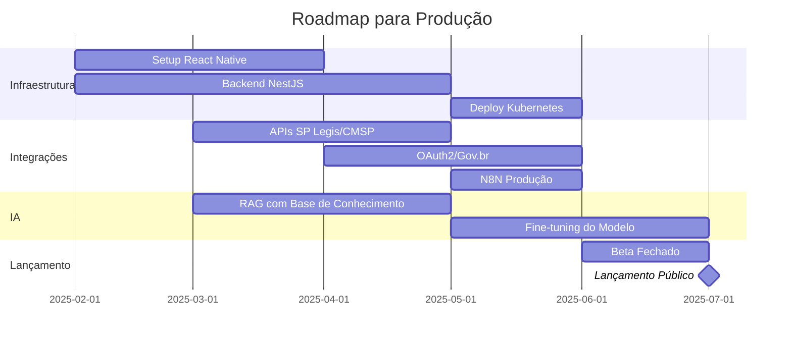

# Documento de Entrega do Protótipo

## Câmara na Mão

**Aplicativo de Participação Cidadã com Inteligência Artificial**

---

| Informação | Valor |
|------------|-------|
| **URL do Protótipo** | [https://cmsp-connect.app-mtechnologia.com/](https://cmsp-connect.app-mtechnologia.com/) |
| **Data de Entrega** | 31 de Dezembro de 2024 |
| **Versão do Protótipo** | 1.0.0 |
| **Natureza** | Protótipo de UX e Validação de Negócio |
| **Stack Tecnológica** | React 18, TypeScript, Vite, Tailwind CSS, Supabase |

---

## Sumário

1. [Sumário Executivo](#1-sumário-executivo)
2. [Catálogo Completo de Rotas](#2-catálogo-completo-de-rotas)
3. [Guia de Navegação por Persona](#3-guia-de-navegação-por-persona)
4. [Funcionalidades Implementadas](#4-funcionalidades-implementadas)
5. [Requisitos Atendidos](#5-requisitos-atendidos)
6. [Limitações do Protótipo](#6-limitações-do-protótipo)
7. [Instruções para Validação](#7-instruções-para-validação)
8. [Próximos Passos](#8-próximos-passos)

---

## 1. Sumário Executivo

### O que foi construído

O **Câmara na Mão** é um protótipo funcional de aplicativo móvel-first que demonstra uma nova forma de interação entre cidadãos e a Câmara Municipal de São Paulo. O sistema utiliza um **assistente de IA conversacional** como interface principal, permitindo que moradores relatem problemas urbanos, avaliem serviços públicos, acompanhem audiências e se conectem com vereadores — tudo através de linguagem natural.

### Principais Entregas

- ✅ **Assistente de IA Conversacional** - Interface unificada para todas as interações
- ✅ **Sistema de Manifestações** - Relatos urbanos, transporte e avaliações de serviço
- ✅ **Mapa de Serviços Públicos** - Geolocalização e busca de UBS, escolas, hospitais
- ✅ **Módulo de Audiências Públicas** - Consulta, inscrição e participação
- ✅ **Área Institucional** - Vereadores, notícias, agenda e educação legislativa
- ✅ **Dashboards Analíticos** - Visualização de dados e insights
- ✅ **Área Administrativa** - Gestão de manifestações, usuários e integrações

### Escopo do Protótipo vs. Produção

| Aspecto | Protótipo | Produção |
|---------|-----------|----------|
| **Plataforma** | Web responsiva (PWA) | React Native (iOS/Android) |
| **Dados** | Mockados + Supabase | APIs reais (SP Legis, CMSP) |
| **IA** | Modelo simplificado | Modelo otimizado com RAG |
| **Autenticação** | Email/senha | OAuth2 + Gov.br |
| **Integrações** | Parciais/simuladas | Completas (N8N, webhooks) |

---

## 2. Catálogo Completo de Rotas

### 2.1 Rotas Públicas (Pré-autenticação)

| Rota | URL Completa | Descrição |
|------|--------------|-----------|
| `/welcome` | [https://cmsp-connect.app-mtechnologia.com/welcome](https://cmsp-connect.app-mtechnologia.com/welcome) | Tela de boas-vindas com carrossel explicativo |
| `/login` | [https://cmsp-connect.app-mtechnologia.com/login](https://cmsp-connect.app-mtechnologia.com/login) | Autenticação de usuários existentes |
| `/register` | [https://cmsp-connect.app-mtechnologia.com/register](https://cmsp-connect.app-mtechnologia.com/register) | Cadastro de novos usuários em 3 etapas |
| `/reset-password` | [https://cmsp-connect.app-mtechnologia.com/reset-password](https://cmsp-connect.app-mtechnologia.com/reset-password) | Recuperação de senha por email |
| `/docs/overview` | [https://cmsp-connect.app-mtechnologia.com/docs/overview](https://cmsp-connect.app-mtechnologia.com/docs/overview) | Documentação pública do sistema |

---

### 2.2 Rotas do Cidadão (Pós-autenticação)

#### Home e Assistente de IA

| Rota | URL Completa | Descrição |
|------|--------------|-----------|
| `/` | [https://cmsp-connect.app-mtechnologia.com/](https://cmsp-connect.app-mtechnologia.com/) | **Home Principal** - Assistente de IA conversacional |
| `/conversas` | [https://cmsp-connect.app-mtechnologia.com/conversas](https://cmsp-connect.app-mtechnologia.com/conversas) | Histórico de conversas com o assistente |

#### Perfil e Configurações

| Rota | URL Completa | Descrição |
|------|--------------|-----------|
| `/perfil` | [https://cmsp-connect.app-mtechnologia.com/perfil](https://cmsp-connect.app-mtechnologia.com/perfil) | Página principal do perfil do usuário |
| `/perfil/dados-pessoais` | [https://cmsp-connect.app-mtechnologia.com/perfil/dados-pessoais](https://cmsp-connect.app-mtechnologia.com/perfil/dados-pessoais) | Edição de nome, telefone e foto |
| `/perfil/interesses` | [https://cmsp-connect.app-mtechnologia.com/perfil/interesses](https://cmsp-connect.app-mtechnologia.com/perfil/interesses) | Configuração de temas de interesse |
| `/perfil/dados-demograficos` | [https://cmsp-connect.app-mtechnologia.com/perfil/dados-demograficos](https://cmsp-connect.app-mtechnologia.com/perfil/dados-demograficos) | Dados demográficos (opcional) |
| `/perfil/endereco` | [https://cmsp-connect.app-mtechnologia.com/perfil/endereco](https://cmsp-connect.app-mtechnologia.com/perfil/endereco) | Endereço residencial |
| `/perfil/preferencias` | [https://cmsp-connect.app-mtechnologia.com/perfil/preferencias](https://cmsp-connect.app-mtechnologia.com/perfil/preferencias) | Preferências de notificação e privacidade |

#### Utilitários

| Rota | URL Completa | Descrição |
|------|--------------|-----------|
| `/favoritos` | [https://cmsp-connect.app-mtechnologia.com/favoritos](https://cmsp-connect.app-mtechnologia.com/favoritos) | Itens favoritados (serviços, audiências) |
| `/notificacoes` | [https://cmsp-connect.app-mtechnologia.com/notificacoes](https://cmsp-connect.app-mtechnologia.com/notificacoes) | Central de notificações |
| `/busca` | [https://cmsp-connect.app-mtechnologia.com/busca](https://cmsp-connect.app-mtechnologia.com/busca) | Busca global em todo o sistema |
| `/configuracoes/acessibilidade` | [https://cmsp-connect.app-mtechnologia.com/configuracoes/acessibilidade](https://cmsp-connect.app-mtechnologia.com/configuracoes/acessibilidade) | Ajustes de acessibilidade |

---

### 2.3 Rotas de Manifestações

#### Relatos Urbanos

| Rota | URL Completa | Descrição |
|------|--------------|-----------|
| `/relato-urbano` | [https://cmsp-connect.app-mtechnologia.com/relato-urbano](https://cmsp-connect.app-mtechnologia.com/relato-urbano) | Hub de relatos urbanos (opções de entrada) |
| `/relato-urbano/manual` | [https://cmsp-connect.app-mtechnologia.com/relato-urbano/manual](https://cmsp-connect.app-mtechnologia.com/relato-urbano/manual) | Formulário manual de relato |
| `/relato-urbano/historico` | [https://cmsp-connect.app-mtechnologia.com/relato-urbano/historico](https://cmsp-connect.app-mtechnologia.com/relato-urbano/historico) | Histórico de relatos do usuário |

#### Diagnóstico de Transporte

| Rota | URL Completa | Descrição |
|------|--------------|-----------|
| `/transporte` | [https://cmsp-connect.app-mtechnologia.com/transporte](https://cmsp-connect.app-mtechnologia.com/transporte) | Hub de diagnóstico de transporte |
| `/transporte/novo` | [https://cmsp-connect.app-mtechnologia.com/transporte/novo](https://cmsp-connect.app-mtechnologia.com/transporte/novo) | Novo relato de problema de transporte |
| `/transporte/padroes` | [https://cmsp-connect.app-mtechnologia.com/transporte/padroes](https://cmsp-connect.app-mtechnologia.com/transporte/padroes) | Padrões de problemas detectados pela IA |
| `/transporte/meus-relatos` | [https://cmsp-connect.app-mtechnologia.com/transporte/meus-relatos](https://cmsp-connect.app-mtechnologia.com/transporte/meus-relatos) | Meus relatos de transporte |

---

### 2.4 Rotas de Serviços Públicos

| Rota | URL Completa | Descrição |
|------|--------------|-----------|
| `/servicos-proximos` | [https://cmsp-connect.app-mtechnologia.com/servicos-proximos](https://cmsp-connect.app-mtechnologia.com/servicos-proximos) | Mapa de serviços públicos próximos |
| `/servico/:id` | [https://cmsp-connect.app-mtechnologia.com/servico/1](https://cmsp-connect.app-mtechnologia.com/servico/1) | Detalhe de um serviço específico |
| `/avaliar` | [https://cmsp-connect.app-mtechnologia.com/avaliar](https://cmsp-connect.app-mtechnologia.com/avaliar) | Avaliação de serviço (via chat) |
| `/avaliar/:visitId` | [https://cmsp-connect.app-mtechnologia.com/avaliar/abc123](https://cmsp-connect.app-mtechnologia.com/avaliar/abc123) | Avaliação de visita específica |

---

### 2.5 Rotas de Audiências Públicas

| Rota | URL Completa | Descrição |
|------|--------------|-----------|
| `/audiencias` | [https://cmsp-connect.app-mtechnologia.com/audiencias](https://cmsp-connect.app-mtechnologia.com/audiencias) | Lista de audiências públicas com filtros |
| `/audiencias/:id` | [https://cmsp-connect.app-mtechnologia.com/audiencias/1](https://cmsp-connect.app-mtechnologia.com/audiencias/1) | Detalhe da audiência (tema, data, local) |
| `/audiencias/:id/participar` | [https://cmsp-connect.app-mtechnologia.com/audiencias/1/participar](https://cmsp-connect.app-mtechnologia.com/audiencias/1/participar) | Tela de participação/inscrição |

---

### 2.6 Rotas Institucionais

| Rota | URL Completa | Descrição |
|------|--------------|-----------|
| `/institucional/agenda` | [https://cmsp-connect.app-mtechnologia.com/institucional/agenda](https://cmsp-connect.app-mtechnologia.com/institucional/agenda) | Agenda da Câmara Municipal |
| `/institucional/vereadores` | [https://cmsp-connect.app-mtechnologia.com/institucional/vereadores](https://cmsp-connect.app-mtechnologia.com/institucional/vereadores) | Lista de vereadores com filtros |
| `/institucional/vereadores/:id` | [https://cmsp-connect.app-mtechnologia.com/institucional/vereadores/vereador-1](https://cmsp-connect.app-mtechnologia.com/institucional/vereadores/vereador-1) | Perfil do vereador |
| `/institucional/conheca-camara` | [https://cmsp-connect.app-mtechnologia.com/institucional/conheca-camara](https://cmsp-connect.app-mtechnologia.com/institucional/conheca-camara) | Sobre a Câmara Municipal |
| `/institucional/camara-explica` | [https://cmsp-connect.app-mtechnologia.com/institucional/camara-explica](https://cmsp-connect.app-mtechnologia.com/institucional/camara-explica) | Educação legislativa (como funciona) |
| `/institucional/escola-parlamento` | [https://cmsp-connect.app-mtechnologia.com/institucional/escola-parlamento](https://cmsp-connect.app-mtechnologia.com/institucional/escola-parlamento) | Escola do Parlamento |
| `/institucional/noticias` | [https://cmsp-connect.app-mtechnologia.com/institucional/noticias](https://cmsp-connect.app-mtechnologia.com/institucional/noticias) | Notícias legislativas |
| `/institucional/noticias/:id` | [https://cmsp-connect.app-mtechnologia.com/institucional/noticias/1](https://cmsp-connect.app-mtechnologia.com/institucional/noticias/1) | Detalhe da notícia |

---

### 2.7 Rotas de Analytics (Cidadão)

| Rota | URL Completa | Descrição |
|------|--------------|-----------|
| `/paineis` | [https://cmsp-connect.app-mtechnologia.com/paineis](https://cmsp-connect.app-mtechnologia.com/paineis) | Dashboard público de indicadores |
| `/paineis/avancado` | [https://cmsp-connect.app-mtechnologia.com/paineis/avancado](https://cmsp-connect.app-mtechnologia.com/paineis/avancado) | Analytics avançado |
| `/paineis/criar` | [https://cmsp-connect.app-mtechnologia.com/paineis/criar](https://cmsp-connect.app-mtechnologia.com/paineis/criar) | Criador de dashboards personalizados |

---

### 2.8 Rotas Administrativas

> **Acesso restrito** a usuários com role `admin` ou `gestor`.

#### Dashboard e Gestão

| Rota | URL Completa | Descrição |
|------|--------------|-----------|
| `/admin` | [https://cmsp-connect.app-mtechnologia.com/admin](https://cmsp-connect.app-mtechnologia.com/admin) | Dashboard administrativo principal |
| `/admin/users` | [https://cmsp-connect.app-mtechnologia.com/admin/users](https://cmsp-connect.app-mtechnologia.com/admin/users) | Gestão de usuários e roles |
| `/admin/reports` | [https://cmsp-connect.app-mtechnologia.com/admin/reports](https://cmsp-connect.app-mtechnologia.com/admin/reports) | Gestão unificada de manifestações |
| `/admin/referrals` | [https://cmsp-connect.app-mtechnologia.com/admin/referrals](https://cmsp-connect.app-mtechnologia.com/admin/referrals) | Gestão de encaminhamentos para vereadores |

#### Analytics Administrativo

| Rota | URL Completa | Descrição |
|------|--------------|-----------|
| `/admin/reports-analytics` | [https://cmsp-connect.app-mtechnologia.com/admin/reports-analytics](https://cmsp-connect.app-mtechnologia.com/admin/reports-analytics) | Analytics de relatos (gráficos e métricas) |
| `/admin/sentiment-analysis` | [https://cmsp-connect.app-mtechnologia.com/admin/sentiment-analysis](https://cmsp-connect.app-mtechnologia.com/admin/sentiment-analysis) | Análise de sentimento das manifestações |

#### Auditoria e Exportação

| Rota | URL Completa | Descrição |
|------|--------------|-----------|
| `/admin/exports` | [https://cmsp-connect.app-mtechnologia.com/admin/exports](https://cmsp-connect.app-mtechnologia.com/admin/exports) | Logs de exportação de dados |
| `/admin/audit-logs` | [https://cmsp-connect.app-mtechnologia.com/admin/audit-logs](https://cmsp-connect.app-mtechnologia.com/admin/audit-logs) | Logs de auditoria do sistema |

#### Configurações do Sistema

| Rota | URL Completa | Descrição |
|------|--------------|-----------|
| `/admin/settings/n8n` | [https://cmsp-connect.app-mtechnologia.com/admin/settings/n8n](https://cmsp-connect.app-mtechnologia.com/admin/settings/n8n) | Configuração de integração N8N |
| `/admin/settings/n8n-monitoring` | [https://cmsp-connect.app-mtechnologia.com/admin/settings/n8n-monitoring](https://cmsp-connect.app-mtechnologia.com/admin/settings/n8n-monitoring) | Monitoramento de workflows N8N |
| `/admin/settings/accessibility` | [https://cmsp-connect.app-mtechnologia.com/admin/settings/accessibility](https://cmsp-connect.app-mtechnologia.com/admin/settings/accessibility) | Configurações de acessibilidade do sistema |

---

## 3. Guia de Navegação por Persona

### 3.1 Persona: Cidadão Comum

**Perfil:** Maria, 45 anos, moradora da Zona Leste, usa celular para WhatsApp e redes sociais. Nunca interagiu com a Câmara Municipal.

#### Jornada de Validação

```
1. BOAS-VINDAS E CADASTRO
   └── Acesse: https://cmsp-connect.app-mtechnologia.com/welcome
   └── Visualize o carrossel explicativo
   └── Clique em "Criar Conta"
   └── Complete o cadastro em 3 etapas:
       ├── Dados básicos (nome, email, senha)
       ├── Interesses (selecione temas)
       └── Localização (CEP)

2. PRIMEIRA INTERAÇÃO COM O ASSISTENTE
   └── Após login, você estará na Home: https://cmsp-connect.app-mtechnologia.com/
   └── Visualize a saudação personalizada
   └── Clique no chip "Relatar problema"
   └── Descreva um problema (ex: "Buraco na rua")
   └── Responda às perguntas do assistente:
       ├── Categoria (confirmação automática)
       ├── Endereço (CEP, rua, número)
       ├── Impacto (nível de risco)
       └── Descrição detalhada
   └── Visualize o resumo e protocolo gerado

3. CONSULTAR HISTÓRICO
   └── Acesse: https://cmsp-connect.app-mtechnologia.com/relato-urbano/historico
   └── Visualize seus relatos anteriores
   └── Clique em um relato para ver detalhes

4. BUSCAR SERVIÇOS PRÓXIMOS
   └── Acesse: https://cmsp-connect.app-mtechnologia.com/servicos-proximos
   └── Permita geolocalização (ou busque por CEP)
   └── Filtre por tipo (UBS, Escola, etc.)
   └── Ajuste o raio de busca
   └── Clique em um serviço para ver detalhes
   └── Veja avaliações de outros usuários

5. CONFIGURAR PERFIL
   └── Acesse: https://cmsp-connect.app-mtechnologia.com/perfil
   └── Atualize foto e dados pessoais
   └── Configure preferências de notificação
```

#### O que validar

- [ ] Cadastro funciona sem erros
- [ ] Assistente responde de forma natural
- [ ] Coleta de dados é guiada e clara
- [ ] Protocolo é gerado corretamente
- [ ] Mapa de serviços carrega e filtra
- [ ] Navegação é intuitiva e fluida

---

### 3.2 Persona: Cidadão Engajado

**Perfil:** Carlos, 32 anos, líder comunitário, acompanha política local, participa de audiências públicas presencialmente.

#### Jornada de Validação

```
1. LOGIN E EXPLORAÇÃO INICIAL
   └── Acesse: https://cmsp-connect.app-mtechnologia.com/login
   └── Faça login com suas credenciais
   └── Explore o feed contextual na Home
   └── Clique no ícone de menu (☰) para ver opções

2. ACOMPANHAR AUDIÊNCIAS PÚBLICAS
   └── Acesse: https://cmsp-connect.app-mtechnologia.com/audiencias
   └── Filtre por tema de interesse (ex: Transporte)
   └── Filtre por status (Agendada, Ao Vivo)
   └── Clique em uma audiência para detalhes
   └── Inscreva-se para participar
   └── Favorite a audiência para acompanhar

3. CONHECER VEREADORES
   └── Acesse: https://cmsp-connect.app-mtechnologia.com/institucional/vereadores
   └── Pesquise por nome ou partido
   └── Clique no perfil de um vereador
   └── Veja áreas de atuação e contato

4. ACOMPANHAR NOTÍCIAS LEGISLATIVAS
   └── Acesse: https://cmsp-connect.app-mtechnologia.com/institucional/noticias
   └── Filtre por categoria
   └── Leia uma notícia completa
   └── Veja notícias relacionadas

5. CONSULTAR DASHBOARDS PÚBLICOS
   └── Acesse: https://cmsp-connect.app-mtechnologia.com/paineis
   └── Visualize KPIs de manifestações
   └── Explore gráficos interativos
   └── Filtre por período e categoria

6. ENCAMINHAR DEMANDA VIA CHAT
   └── Volte para: https://cmsp-connect.app-mtechnologia.com/
   └── Digite: "Quero encaminhar uma demanda para um vereador"
   └── O assistente irá guiar o processo
   └── Selecione o vereador sugerido
```

#### O que validar

- [ ] Filtros de audiências funcionam corretamente
- [ ] Inscrição em audiência é registrada
- [ ] Perfis de vereadores têm informações úteis
- [ ] Notícias carregam com imagens
- [ ] Dashboards exibem dados reais
- [ ] Encaminhamento para vereador funciona

---

### 3.3 Persona: Gestor Público

**Perfil:** Ana, 38 anos, assessora parlamentar, responsável por triar e responder demandas cidadãs.

#### Jornada de Validação

```
1. ACESSO À ÁREA ADMINISTRATIVA
   └── Acesse: https://cmsp-connect.app-mtechnologia.com/login
   └── Login com conta de gestor (role: gestor)
   └── Você será redirecionado para: /admin

2. VISUALIZAR DASHBOARD ADMINISTRATIVO
   └── URL: https://cmsp-connect.app-mtechnologia.com/admin
   └── Visualize KPIs gerais:
       ├── Total de manifestações
       ├── Pendentes de triagem
       ├── Resolvidas no mês
       └── Tempo médio de resposta

3. GERENCIAR MANIFESTAÇÕES
   └── Acesse: https://cmsp-connect.app-mtechnologia.com/admin/reports
   └── Alterne entre visualizações:
       ├── Tabela (padrão)
       └── Kanban (quadro de triagem)
   └── Use as abas para filtrar por tipo:
       ├── Urbanas
       ├── Transporte
       ├── Avaliações
       └── Feedback Câmara
   └── Clique em uma manifestação para abrir o drawer
   └── Visualize detalhes completos:
       ├── Dados do cidadão
       ├── Descrição do problema
       ├── Localização no mapa
       ├── Histórico de interações
       └── Ações disponíveis

4. TRIAGEM NO KANBAN
   └── Alterne para modo Kanban
   └── Arraste cards entre colunas:
       ├── Pendente → Em Análise
       ├── Em Análise → Em Andamento
       └── Em Andamento → Resolvido
   └── Use ações rápidas nos cards:
       ├── Alterar status
       ├── Encaminhar para vereador
       └── Adicionar resposta

5. RESPONDER MANIFESTAÇÃO
   └── No drawer de detalhes
   └── Clique na aba "Respostas"
   └── Digite uma resposta oficial
   └── Selecione se é pública ou interna
   └── Envie a resposta

6. ENCAMINHAR PARA VEREADOR
   └── No drawer de detalhes
   └── Clique em "Encaminhar"
   └── O sistema sugere vereadores por relevância
   └── Selecione um vereador
   └── Adicione observações
   └── Confirme o encaminhamento

7. ANALISAR DADOS
   └── Acesse: https://cmsp-connect.app-mtechnologia.com/admin/reports-analytics
   └── Visualize distribuição por categoria
   └── Analise tendências temporais
   └── Identifique padrões de problemas
   
   └── Acesse: https://cmsp-connect.app-mtechnologia.com/admin/sentiment-analysis
   └── Visualize sentimento geral (positivo/negativo/neutro)
   └── Identifique palavras-chave recorrentes

8. EXPORTAR RELATÓRIOS
   └── Na tela de manifestações
   └── Clique em "Exportar"
   └── Selecione formato (CSV/Excel)
   └── Aplique filtros desejados
   └── Baixe o arquivo
   └── Verifique log em: https://cmsp-connect.app-mtechnologia.com/admin/exports
```

#### O que validar

- [ ] Dashboard mostra métricas corretas
- [ ] Kanban permite arrastar cards
- [ ] Drawer exibe todos os detalhes
- [ ] Respostas são salvas corretamente
- [ ] Encaminhamentos são registrados
- [ ] Exportação gera arquivo válido
- [ ] Filtros funcionam em todas as views

---

### 3.4 Persona: Administrador do Sistema

**Perfil:** Roberto, 50 anos, coordenador de TI da Câmara, responsável pela gestão técnica do sistema.

#### Jornada de Validação

```
1. ACESSO COM PRIVILÉGIOS TOTAIS
   └── Acesse: https://cmsp-connect.app-mtechnologia.com/login
   └── Login com conta admin (role: admin)
   └── Acesse: https://cmsp-connect.app-mtechnologia.com/admin

2. GERENCIAR USUÁRIOS
   └── Acesse: https://cmsp-connect.app-mtechnologia.com/admin/users
   └── Visualize lista de todos os usuários
   └── Filtre por role (admin, gestor, cidadão)
   └── Pesquise por nome ou email
   └── Clique em um usuário para editar:
       ├── Alterar role
       ├── Ativar/desativar conta
       └── Visualizar atividades

3. GERENCIAR ENCAMINHAMENTOS
   └── Acesse: https://cmsp-connect.app-mtechnologia.com/admin/referrals
   └── Visualize todos os encaminhamentos
   └── Filtre por status:
       ├── Pendente
       ├── Enviado
       ├── Reconhecido
       └── Resolvido
   └── Acompanhe tempo de resposta

4. CONSULTAR LOGS DE AUDITORIA
   └── Acesse: https://cmsp-connect.app-mtechnologia.com/admin/audit-logs
   └── Visualize todas as ações do sistema:
       ├── Logins de usuários
       ├── Alterações de dados
       ├── Exclusões
       └── Alterações de permissão
   └── Filtre por período e tipo de ação
   └── Exporte logs se necessário

5. CONFIGURAR INTEGRAÇÃO N8N
   └── Acesse: https://cmsp-connect.app-mtechnologia.com/admin/settings/n8n
   └── Configure URL do webhook
   └── Gere/regenere chave secreta
   └── Selecione eventos a enviar:
       ├── Novos relatos urbanos
       ├── Novos relatos de transporte
       ├── Novas avaliações
       └── Alterações de status
   └── Teste a conexão

6. MONITORAR WORKFLOWS N8N
   └── Acesse: https://cmsp-connect.app-mtechnologia.com/admin/settings/n8n-monitoring
   └── Visualize logs de integração
   └── Identifique erros de envio
   └── Verifique payloads enviados

7. CONFIGURAR ACESSIBILIDADE DO SISTEMA
   └── Acesse: https://cmsp-connect.app-mtechnologia.com/admin/settings/accessibility
   └── Configure opções padrão do sistema
   └── Defina políticas de contraste
```

#### O que validar

- [ ] Usuários podem ter roles alteradas
- [ ] Logs de auditoria registram todas as ações
- [ ] Configuração N8N salva corretamente
- [ ] Teste de webhook funciona
- [ ] Monitoramento mostra logs recentes
- [ ] Acesso administrativo é protegido por role

---

## 4. Funcionalidades Implementadas

### 4.1 Assistente de IA Conversacional

| Funcionalidade | Descrição | Status |
|----------------|-----------|--------|
| Detecção de Intenção | Identifica automaticamente o que o usuário quer fazer | ✅ |
| Coleta Guiada de Dados | Faz perguntas uma a uma para completar manifestações | ✅ |
| Chips de Ação Rápida | Sugestões clicáveis para iniciar jornadas | ✅ |
| Histórico de Conversas | Armazena e permite retomar conversas anteriores | ✅ |
| Tracker de Coleta | Mostra progresso visual da coleta de dados | ✅ |
| Mudança de Contexto | Detecta e confirma quando usuário muda de assunto | ✅ |
| Feed Contextual | Mostra notícias e eventos relevantes | ✅ |
| Modo Offline | Aviso e degradação graceful sem internet | ✅ |

### 4.2 Sistema de Manifestações

| Funcionalidade | Descrição | Status |
|----------------|-----------|--------|
| Relatos Urbanos | 10+ categorias (buracos, iluminação, lixo, etc.) | ✅ |
| Relatos de Transporte | Problemas com ônibus, metrô, acessibilidade | ✅ |
| Avaliações de Serviço | Notas e comentários sobre UBS, escolas, etc. | ✅ |
| Feedback Câmara | Elogios, reclamações, sugestões sobre vereadores | ✅ |
| Protocolo Automático | Geração de código único (URB/TRP-YYYY-NNNNNN) | ✅ |
| Campos de Impacto | Coleta de risco, escopo afetado, urgência | ✅ |
| Geolocalização | Endereço via GPS ou busca por CEP | ✅ |
| Histórico Pessoal | Lista de manifestações do usuário | ✅ |

### 4.3 Mapa de Serviços Públicos

| Funcionalidade | Descrição | Status |
|----------------|-----------|--------|
| Mapa Interativo | Visualização com Mapbox | ✅ |
| Geolocalização Automática | Centraliza no usuário | ✅ |
| Filtros por Tipo | UBS, Escola, Hospital, CEU, Biblioteca | ✅ |
| Ajuste de Raio | 1km a 10km | ✅ |
| Detalhes do Serviço | Endereço, telefone, horários | ✅ |
| Avaliações | Média de notas e comentários | ✅ |
| Rotas | Direções até o serviço | ✅ |
| Favoritos | Salvar serviços frequentes | ✅ |

### 4.4 Audiências Públicas

| Funcionalidade | Descrição | Status |
|----------------|-----------|--------|
| Listagem com Filtros | Por tema, status, data | ✅ |
| Detalhes Completos | Descrição, documentos, local | ✅ |
| Inscrição | Registro de interesse em participar | ✅ |
| Status em Tempo Real | Agendada, Ao Vivo, Encerrada | ✅ |
| Link de Transmissão | Acesso a audiências remotas | ✅ |
| Favoritar | Acompanhar audiências de interesse | ✅ |

### 4.5 Área Institucional

| Funcionalidade | Descrição | Status |
|----------------|-----------|--------|
| Lista de Vereadores | Com foto, partido, contato | ✅ |
| Perfil do Vereador | Áreas de atuação, biografia | ✅ |
| Agenda da Câmara | Eventos e sessões | ✅ |
| Notícias | Feed de notícias legislativas | ✅ |
| Câmara Explica | Educação sobre processo legislativo | ✅ |
| Escola do Parlamento | Cursos e formações | ✅ |
| Conheça a Câmara | História e funcionamento | ✅ |

### 4.6 Dashboards Analíticos

| Funcionalidade | Descrição | Status |
|----------------|-----------|--------|
| KPIs Visuais | Cards com métricas principais | ✅ |
| Gráficos de Barras | Distribuição por categoria | ✅ |
| Gráficos de Pizza | Proporções de status | ✅ |
| Linha Temporal | Tendências ao longo do tempo | ✅ |
| Heatmap | Distribuição geográfica | ✅ |
| Exportação | Download em CSV/Excel | ✅ |
| Criador de Dashboards | Interface drag-and-drop | ✅ |

### 4.7 Área Administrativa

| Funcionalidade | Descrição | Status |
|----------------|-----------|--------|
| Dashboard Gerencial | Visão geral de KPIs | ✅ |
| Gestão de Usuários | CRUD com RBAC | ✅ |
| Gestão de Manifestações | Tabela + Kanban | ✅ |
| Triagem por Kanban | Drag-and-drop de cards | ✅ |
| Respostas a Manifestações | Texto público/interno | ✅ |
| Encaminhamentos | Para vereadores com matching | ✅ |
| Análise de Sentimento | Classificação automática | ✅ |
| Logs de Auditoria | Rastreabilidade completa | ✅ |
| Exportação de Dados | CSV/Excel com filtros | ✅ |
| Integração N8N | Webhooks configuráveis | ✅ |
| Monitoramento N8N | Logs de integração | ✅ |

### 4.8 Recursos de Acessibilidade

| Funcionalidade | Descrição | Status |
|----------------|-----------|--------|
| Ajuste de Fonte | Pequena, Média, Grande, Extra Grande | ✅ |
| Alto Contraste | Modo de contraste aumentado | ✅ |
| Tema Escuro/Claro | Alternância manual ou automática | ✅ |
| Espaçamento de Texto | Maior espaço entre linhas | ✅ |
| Modo Leitura | Foco no conteúdo principal | ✅ |
| Navegação por Teclado | Tab e Enter funcionais | ✅ |

---

## 5. Requisitos Atendidos

### Matriz de Rastreabilidade

| Caso de Uso | Descrição | Rotas Implementadas | Status |
|-------------|-----------|---------------------|--------|
| **CSU001** | Acolhimento Digital com IA | `/`, `/conversas` | ✅ Completo |
| **CSU002** | Audiências Públicas e Gestão de Interesse | `/audiencias`, `/audiencias/:id` | ✅ Completo |
| **CSU003** | Navegação Institucional | `/institucional/*` | ✅ Completo |
| **CSU004** | Avaliação Geolocalizada de Serviços | `/servicos-proximos`, `/servico/:id`, `/avaliar` | ✅ Completo |
| **CSU005** | Diagnóstico de Transporte | `/transporte/*` | ✅ Completo |
| **CSU006** | Análises Multidimensionais | `/paineis/*`, `/admin/reports-analytics` | ✅ Completo |
| **CSU007** | Mapa de Serviços Públicos | `/servicos-proximos` | ✅ Completo |
| **CSU008** | Relatos Urbanos por Chatbot | `/`, `/relato-urbano/*` | ✅ Completo |

### Funcionalidades Transversais

| Requisito | Descrição | Status |
|-----------|-----------|--------|
| **Autenticação** | Login, registro, recuperação de senha | ✅ |
| **Perfil de Usuário** | Dados pessoais, interesses, preferências | ✅ |
| **Notificações** | Central de notificações com tipos | ✅ |
| **Busca Global** | Pesquisa em todo o sistema | ✅ |
| **Favoritos** | Salvar itens de interesse | ✅ |
| **Acessibilidade** | WCAG 2.1 AA parcial | ✅ |
| **Responsividade** | Mobile-first, funciona em desktop | ✅ |
| **Área Admin** | Gestão completa do sistema | ✅ |

---

## 6. Limitações do Protótipo

### 6.1 Dados e Integrações

| Limitação | Descrição | Solução em Produção |
|-----------|-----------|---------------------|
| **Dados Mockados** | Vereadores, notícias e audiências são estáticos | Integração com APIs SP Legis e Portal CMSP |
| **IA Simplificada** | Modelo de linguagem básico via gateway | Modelo otimizado com RAG e fine-tuning |
| **Geolocalização Simulada** | Fallback para coordenadas padrão | GPS nativo do dispositivo |
| **N8N Parcial** | Configuração demonstrativa | Workflows completos de triagem |

### 6.2 Funcionalidades Não Implementadas

| Funcionalidade | Motivo | Prioridade para Produção |
|----------------|--------|--------------------------|
| **Push Notifications** | Requer app nativo | Alta |
| **OAuth2/Gov.br** | Complexidade de integração | Alta |
| **Upload de Fotos em Relatos** | Storage configurado, falta UI | Média |
| **Participação Ao Vivo** | Requer streaming/WebRTC | Média |
| **Notificações por Email** | Requer serviço de email | Média |

### 6.3 Limitações Técnicas

| Aspecto | Limitação | Impacto |
|---------|-----------|---------|
| **Performance** | Não otimizado para milhares de registros | Baixo no protótipo |
| **Testes Automatizados** | Cobertura parcial (E2E) | Não afeta validação |
| **Monitoramento** | Básico via logs | Não afeta validação |
| **Cache/CDN** | Não configurado | Páginas podem ser lentas |

---

## 7. Instruções para Validação

### 7.1 Requisitos de Ambiente

- **Navegador:** Chrome 90+, Firefox 88+, Safari 14+, Edge 90+
- **Dispositivo:** Desktop, tablet ou smartphone
- **Conexão:** Internet estável (dados mockados funcionam offline)
- **Resolução:** Mínimo 320px de largura

### 7.2 Credenciais de Teste

> **Nota:** Crie uma conta nova para testes de cidadão comum. Para testar roles administrativas, entre em contato com a equipe para receber credenciais de gestor/admin.

| Perfil | Como Acessar |
|--------|--------------|
| **Cidadão** | Criar conta em `/register` |
| **Gestor** | Solicitar credenciais à equipe |
| **Admin** | Solicitar credenciais à equipe |

### 7.3 Checklist de Validação

#### Fluxo de Cadastro e Login
- [ ] Acessar `/welcome` e visualizar carrossel
- [ ] Criar conta com email válido
- [ ] Completar as 3 etapas do registro
- [ ] Fazer logout e login novamente
- [ ] Testar recuperação de senha

#### Fluxo de Relato Urbano (via Chat)
- [ ] Na home (`/`), clicar em "Relatar problema"
- [ ] Descrever um problema urbano
- [ ] Responder perguntas do assistente
- [ ] Visualizar tracker de progresso
- [ ] Receber protocolo de confirmação
- [ ] Verificar relato em `/relato-urbano/historico`

#### Fluxo de Serviços Próximos
- [ ] Acessar `/servicos-proximos`
- [ ] Permitir geolocalização (ou buscar CEP)
- [ ] Filtrar por tipo de serviço
- [ ] Ajustar raio de busca
- [ ] Clicar em um serviço para detalhes
- [ ] Visualizar avaliações

#### Fluxo de Audiências
- [ ] Acessar `/audiencias`
- [ ] Filtrar por tema
- [ ] Abrir detalhes de uma audiência
- [ ] Inscrever-se para participar
- [ ] Favoritar uma audiência

#### Fluxo Institucional
- [ ] Acessar `/institucional/vereadores`
- [ ] Pesquisar um vereador
- [ ] Abrir perfil do vereador
- [ ] Acessar `/institucional/noticias`
- [ ] Ler uma notícia completa

#### Fluxo Administrativo (requer role gestor/admin)
- [ ] Acessar `/admin`
- [ ] Visualizar KPIs do dashboard
- [ ] Acessar `/admin/reports`
- [ ] Alternar entre tabela e Kanban
- [ ] Abrir detalhes de uma manifestação
- [ ] Responder uma manifestação
- [ ] Encaminhar para vereador
- [ ] Acessar `/admin/audit-logs`

### 7.4 Problemas Conhecidos

| Problema | Workaround |
|----------|------------|
| Primeira mensagem pode demorar | Aguardar 2-3 segundos para resposta da IA |
| Mapa pode não carregar | Verificar conexão e recarregar página |
| Sessão expira após inatividade | Fazer login novamente |

---

## 8. Próximos Passos

### 8.1 Evolução para Produção



### 8.2 Recomendações Técnicas

1. **Migrar para React Native** usando Expo para iOS e Android
2. **Implementar backend NestJS** com TypeORM e PostgreSQL
3. **Configurar observabilidade** com Grafana, Prometheus e Sentry
4. **Implementar CI/CD** com GitHub Actions e ArgoCD
5. **Configurar WAF e CDN** para proteção e performance
6. **Implementar testes** automatizados com 80%+ de cobertura

### 8.3 Recomendações de Negócio

1. **Validar jornadas** com usuários reais em testes de usabilidade
2. **Definir métricas de sucesso** baseadas em engajamento real
3. **Planejar comunicação** de lançamento com assessoria de imprensa
4. **Treinar equipe** de suporte e gestores para uso do sistema
5. **Estabelecer SLAs** de resposta para manifestações

---

## Conclusão

O protótipo **Câmara na Mão** demonstra a viabilidade técnica e de negócio de uma plataforma de participação cidadã baseada em IA conversacional. Todas as funcionalidades core foram implementadas e estão prontas para validação com stakeholders.

O sistema atende aos requisitos definidos no documento de escopo e estabelece uma base sólida para evolução para ambiente de produção.

---

**Documento gerado em:** 31 de Dezembro de 2024  
**Versão:** 1.0.0  
**Classificação:** Documento de Entrega - Protótipo
