# Câmara na Mão - Documento de Escopo e Arquitetura

**Versão:** 3.0  
**Data:** Dezembro 2025  
**Status:** Aprovado para Desenvolvimento

---

## Sumário

1. [Visão Geral](#1-visão-geral)
2. [Objetivos e Métricas de Sucesso](#2-objetivos-e-métricas-de-sucesso)
3. [Personas e Perfis de Usuário](#3-personas-e-perfis-de-usuário)
4. [Stack Tecnológica](#4-stack-tecnológica)
5. [Arquitetura de Alto Nível](#5-arquitetura-de-alto-nível)
6. [O Orquestrador de IA](#6-o-orquestrador-de-ia)
7. [Módulos Funcionais](#7-módulos-funcionais)
8. [Jornadas do Usuário](#8-jornadas-do-usuário)
9. [Especificação de Dados por Tipo de Manifestação](#9-especificação-de-dados-por-tipo-de-manifestação)
10. [Regras de Negócio](#10-regras-de-negócio)
11. [Integrações Externas](#11-integrações-externas)
12. [Requisitos Não-Funcionais](#12-requisitos-não-funcionais)
13. [Glossário](#13-glossário)

---

## 1. Visão Geral

### 1.1 O que é o Câmara na Mão?

O **Câmara na Mão** é um aplicativo móvel de participação cidadã que utiliza inteligência artificial conversacional para conectar os munícipes de São Paulo à Câmara Municipal, aos vereadores e aos serviços públicos da cidade.

### 1.2 Proposta de Valor

O aplicativo atua como um **canal único e inteligente** onde o cidadão pode:

- **Relatar problemas urbanos** (buracos, iluminação, lixo, etc.)
- **Avaliar serviços públicos** que utilizou (UBS, escolas, hospitais)
- **Reportar problemas de transporte** (atrasos, lotação, acessibilidade)
- **Acompanhar a atividade legislativa** (projetos de lei, votações)
- **Participar de audiências públicas** (inscrição, lembretes, documentos)
- **Receber recomendações personalizadas** de serviços próximos

### 1.3 Diferenciais

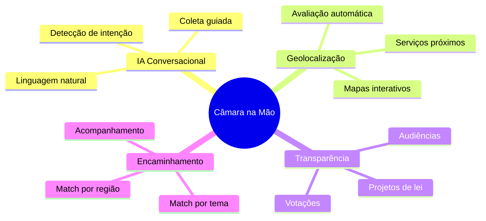

---

## 2. Objetivos e Métricas de Sucesso

### 2.1 Objetivos Estratégicos

| Objetivo                                             | Indicador de Sucesso                                        |
| ---------------------------------------------------- | ----------------------------------------------------------- |
| Aumentar a participação cidadã na política municipal | Aumento no número de interações com conteúdo legislativo    |
| Melhorar a qualidade dos relatos recebidos           | Aumento na taxa de relatos com dados completos e acionáveis |
| Facilitar o acesso a serviços públicos               | Redução no tempo para encontrar e avaliar serviços          |
| Fortalecer o vínculo cidadão-vereador                | Aumento no engajamento com encaminhamentos a vereadores     |
| Aumentar a transparência legislativa                 | Aumento no consumo de conteúdo sobre projetos e votações    |

### 2.2 Indicadores Operacionais

- **Engajamento**: Aumentar sessões por usuário ativo
- **Completude**: Aumentar taxa de relatos completos (todos campos obrigatórios)
- **Satisfação**: Melhorar avaliação média do atendimento da IA
- **Retenção**: Aumentar usuários que retornam após 7 dias
- **Conversão**: Aumentar taxa de visitantes que completam cadastro

---

## 3. Personas e Perfis de Usuário

### 3.1 Personas Primárias

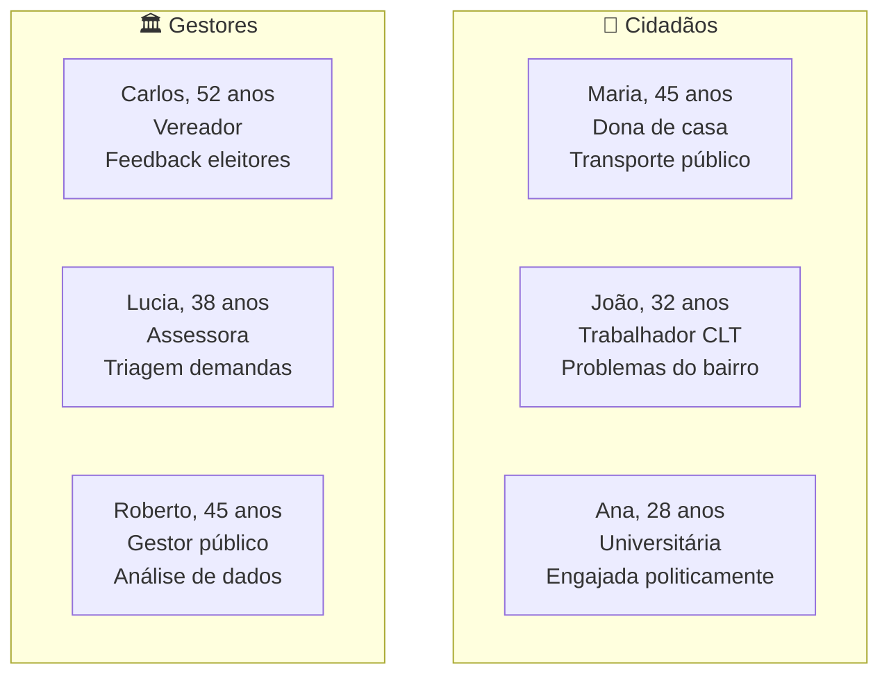

### 3.2 Perfis de Acesso

| Perfil       | Permissões                                                                      |
| ------------ | ------------------------------------------------------------------------------- |
| **Cidadão**  | Criar relatos, avaliar serviços, participar de audiências, receber notificações |
| **Assessor** | Visualizar relatos encaminhados, responder cidadãos, gerar relatórios           |
| **Vereador** | Dashboard próprio, métricas de engajamento, respostas oficiais                  |
| **Gestor**   | Acesso a analytics, exportação de dados, configurações do sistema               |
| **Admin**    | Gestão de usuários, configurações globais, auditoria                            |

---

## 4. Stack Tecnológica

### 4.1 Visão Geral da Stack

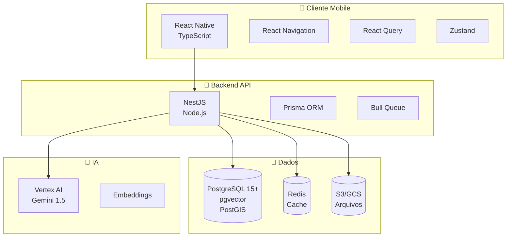

### 4.2 Justificativas de Escolha

#### Frontend Mobile: React Native + TypeScript

| Critério                  | Avaliação                                                                              |
| ------------------------- | -------------------------------------------------------------------------------------- |
| **Por que React Native?** | Código único para iOS/Android, redução de ~40% no custo de desenvolvimento             |
| **Por que não Flutter?**  | Maior ecossistema, mais fácil encontrar desenvolvedores, integração nativa com libs JS |
| **Por que TypeScript?**   | Tipagem estática reduz bugs em produção, melhor DX com autocomplete                    |

#### Backend: NestJS (Node.js + TypeScript)

| Critério                        | Avaliação                                                           |
| ------------------------------- | ------------------------------------------------------------------- |
| **Por que NestJS?**             | Arquitetura modular, dependency injection, excelente para APIs REST |
| **Por que não Python/FastAPI?** | Compartilhamento de tipos com frontend (monorepo TypeScript)        |
| **Por que Prisma?**             | Type-safe queries, migrações automáticas, excelente DX              |

#### Banco de Dados: PostgreSQL 15+

| Critério                 | Avaliação                                                       |
| ------------------------ | --------------------------------------------------------------- |
| **Por que PostgreSQL?**  | Extensões pgvector (IA) e PostGIS (geo), RLS nativo, maturidade |
| **Por que não MongoDB?** | Dados estruturados, relacionamentos complexos, ACID compliance  |
| **Serviço gerenciado**   | AWS RDS ou Google Cloud SQL para menor overhead operacional     |

#### IA: Google Vertex AI (Gemini)

| Critério             | Avaliação                                                          |
| -------------------- | ------------------------------------------------------------------ |
| **Por que Gemini?**  | Custo 50-70% menor que GPT-4, contexto de 1M tokens, região Brasil |
| **Modelo principal** | Gemini 1.5 Flash para respostas rápidas e baixo custo              |
| **Embeddings**       | text-embedding-004 para busca semântica no RAG                     |

### 4.3 Estimativa de Custos Mensais

_Baseado em 50.000 usuários ativos mensais (MAU)_

| Serviço                | Provedor        | Custo Estimado          |
| ---------------------- | --------------- | ----------------------- |
| Kubernetes (3 nodes)   | AWS EKS / GKE   | $500 - $800             |
| PostgreSQL             | RDS / Cloud SQL | $200 - $400             |
| Redis                  | ElastiCache     | $50 - $100              |
| Storage (100GB)        | S3 / GCS        | $20 - $50               |
| AI/LLM (100k requests) | Vertex AI       | $200 - $500             |
| Mapas (50k requests)   | Google Maps     | $0 - $200               |
| Push Notifications     | FCM             | $0                      |
| CDN + WAF              | CloudFront      | $50 - $100              |
| Monitoramento          | Grafana Cloud   | $0 - $50                |
| **Total Estimado**     |                 | **$1.020 - $2.200/mês** |

---

## 5. Arquitetura de Alto Nível

### 5.1 Diagrama de Contexto (C4 - Nível 1)

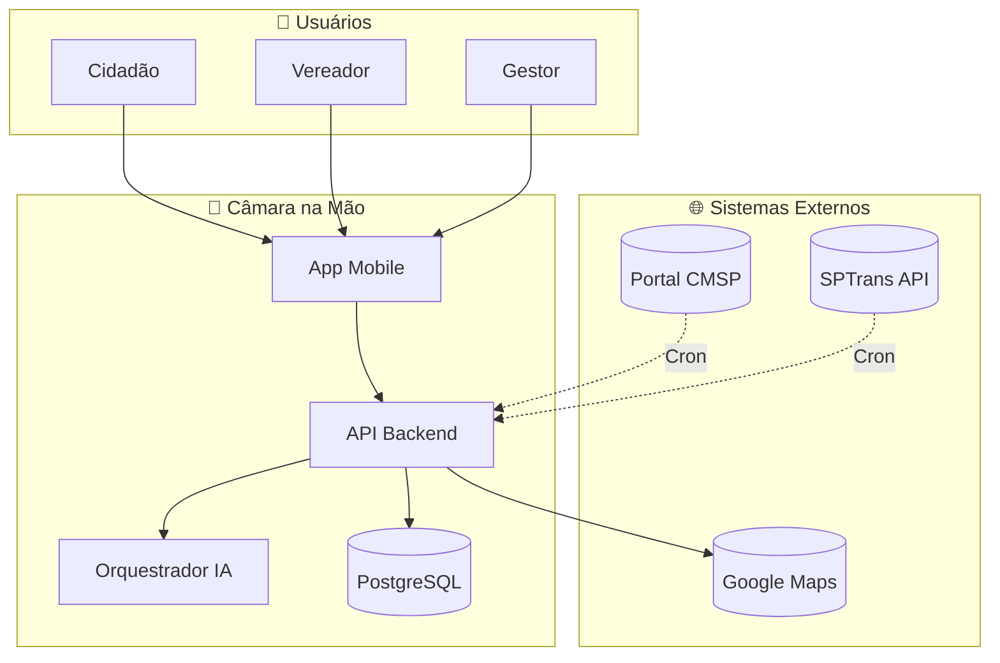

### 5.2 Diagrama de Containers (C4 - Nível 2)

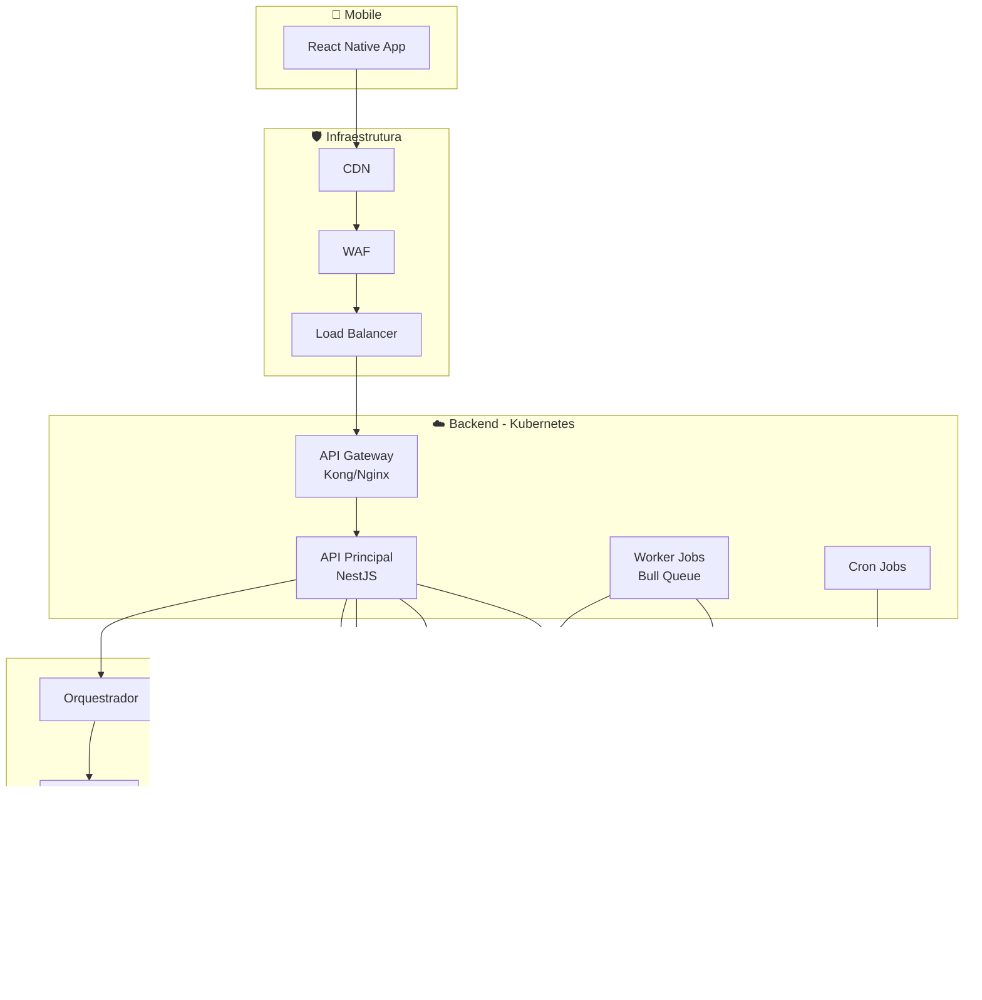

### 5.3 Fluxo de Dados - Relato Urbano

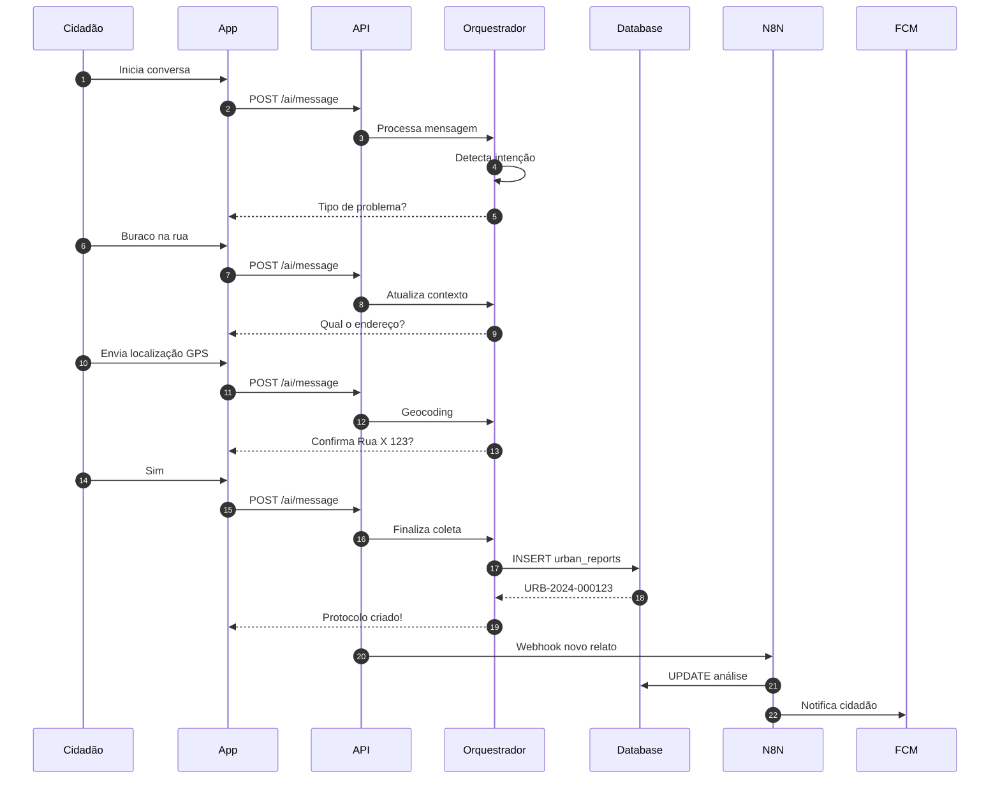

### 5.4 Arquitetura de Observabilidade

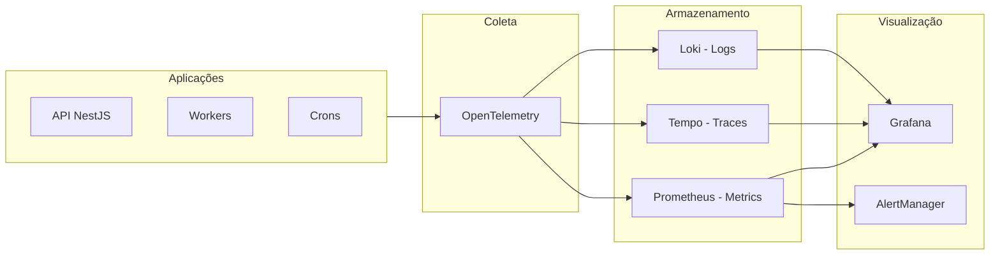

---

## 6. O Orquestrador de IA

### 6.1 Visão Geral

O **Orquestrador de IA** é o componente central que gerencia todas as interações conversacionais do aplicativo. Ele atua como um agente inteligente que:

- Detecta a intenção do usuário em linguagem natural
- Guia a coleta de dados de forma conversacional
- Executa ações no sistema (criar relatos, buscar serviços, etc.)
- Mantém contexto entre mensagens

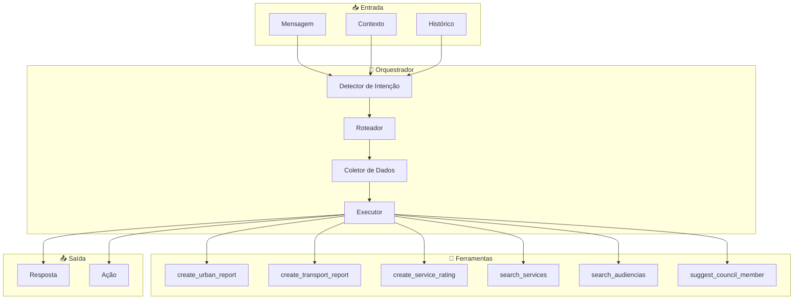

### 6.2 Detector de Intenção

O detector analisa a mensagem do usuário e classifica em uma das intenções suportadas:

| Intenção                 | Gatilhos (exemplos)                                      | Ação                                   |
| ------------------------ | -------------------------------------------------------- | -------------------------------------- |
| `relato_urbano`          | "buraco na rua", "poste sem luz", "lixo acumulado"       | Inicia jornada de relato urbano        |
| `relato_transporte`      | "ônibus atrasado", "metrô lotado", "ponto sem cobertura" | Inicia jornada de relato de transporte |
| `avaliacao_servico`      | "avaliar UBS", "reclamar da escola", "elogiar hospital"  | Inicia jornada de avaliação            |
| `buscar_servico`         | "UBS mais próxima", "escolas perto de mim"               | Busca serviços por geolocalização      |
| `audiencia_publica`      | "audiências esta semana", "quero participar"             | Lista ou inscreve em audiências        |
| `informacao_legislativa` | "projetos de lei", "como funciona votação"               | Busca na base de conhecimento          |
| `encaminhar_vereador`    | "falar com vereador", "quem cuida disso?"                | Sugere vereadores por tema/região      |
| `saudacao`               | "oi", "bom dia", "olá"                                   | Resposta de boas-vindas                |
| `ajuda`                  | "o que você faz?", "como funciona?"                      | Explica capacidades                    |
| `outro`                  | Não identificado                                         | Resposta genérica + sugestões          |

### 6.3 Operação por Jornada

#### 6.3.1 Jornada: Relato Urbano

**Objetivo:** Coletar informações completas sobre um problema urbano.

**Dados obrigatórios:**

- Categoria do problema
- Localização (endereço ou GPS)

**Dados opcionais:**

- Descrição detalhada
- Fotos
- Ponto de referência
- Nível de urgência

**Exemplo de conversa:**

```
👤 Cidadão: Tem um buraco enorme aqui na rua
🤖 Orquestrador: Entendi que você quer relatar um problema de buraco
   na via. Para eu registrar corretamente, pode me informar o
   endereço ou compartilhar sua localização?

👤 Cidadão: [Compartilha GPS]
🤖 Orquestrador: Localizei! Você está na Rua das Flores, 234 -
   Vila Mariana. É esse o local do buraco?

👤 Cidadão: Isso, bem na frente do número 234
🤖 Orquestrador: Perfeito! O buraco está causando algum risco
   imediato, como acidente ou alagamento?

👤 Cidadão: Ontem quase caí de moto
🤖 Orquestrador: Obrigado pela informação. Quer adicionar uma
   foto do buraco? Isso ajuda na análise.

👤 Cidadão: [Envia foto]
🤖 Orquestrador: ✅ Relato registrado com sucesso!

   📋 Protocolo: URB-2024-000456
   📍 Local: Rua das Flores, 234 - Vila Mariana
   🏷️ Categoria: Buraco na via
   ⚠️ Urgência: Alta (risco de acidente)

   Você receberá notificações sobre o andamento.
```

#### 6.3.2 Jornada: Relato de Transporte

**Objetivo:** Coletar informações sobre problemas no transporte público.

**Dados obrigatórios:**

- Tipo de problema
- Linha ou estação afetada
- Data/hora da ocorrência

**Dados opcionais:**

- Descrição do impacto
- Frequência (primeira vez, recorrente)
- Foto

**Exemplo de conversa:**

```
👤 Cidadão: O 875A tá sempre atrasando
🤖 Orquestrador: Entendi que você quer relatar um problema de
   atraso na linha 875A. Quando foi a última vez que isso aconteceu?

👤 Cidadão: Hoje de manhã, esperei 40 minutos
🤖 Orquestrador: Puxa, 40 minutos é muito tempo! Em qual ponto
   você estava esperando?

👤 Cidadão: No ponto da Av. Paulista com Consolação
🤖 Orquestrador: Isso acontece com frequência ou foi a primeira vez?

👤 Cidadão: Todo dia é assim, já perdi a conta
🤖 Orquestrador: ✅ Relato registrado!

   📋 Protocolo: TRP-2024-000789
   🚌 Linha: 875A
   📍 Local: Av. Paulista x Consolação
   🏷️ Problema: Atraso frequente
   ⏱️ Tempo de espera: 40 minutos

   💡 Identificamos que outros 23 cidadãos relataram problemas
   semelhantes nesta linha. Deseja encaminhar para um vereador
   que atua na área de transporte?
```

#### 6.3.3 Jornada: Avaliação de Serviço

**Objetivo:** Coletar avaliação de um serviço público visitado.

**Dados obrigatórios:**

- Serviço avaliado (nome ou localização)
- Nota (1 a 5 estrelas)

**Dados opcionais:**

- Comentário textual
- Aspectos específicos (atendimento, estrutura, tempo de espera)
- Sugestões de melhoria

**Exemplo de conversa:**

```
👤 Cidadão: Quero avaliar a UBS que fui hoje
🤖 Orquestrador: Claro! Qual UBS você visitou? Pode me dizer o
   nome ou compartilhar a localização.

👤 Cidadão: UBS Vila Mariana
🤖 Orquestrador: Encontrei! UBS Vila Mariana - Rua Domingos de
   Morais, 2187. É essa?

👤 Cidadão: Essa mesmo
🤖 Orquestrador: De 1 a 5 estrelas, como você avalia sua
   experiência hoje?

👤 Cidadão: 3 estrelas
🤖 Orquestrador: Entendi, uma experiência mediana. Quer contar
   o que poderia melhorar?

👤 Cidadão: Demorou muito pra ser atendido, mas os médicos
   foram atenciosos
🤖 Orquestrador: ✅ Avaliação registrada!

   🏥 UBS Vila Mariana
   ⭐ Nota: 3/5
   💬 "Demorou muito pra ser atendido, mas os médicos foram
   atenciosos"

   Obrigado por contribuir! Sua avaliação ajuda outros
   cidadãos e a gestão pública.
```

### 6.4 Transição Entre Jornadas

O Orquestrador detecta quando o usuário deseja mudar de contexto e solicita confirmação:

```
👤 Cidadão: [No meio de um relato urbano] Na verdade, meu
   problema maior é o ônibus
🤖 Orquestrador: Percebi que você quer falar sobre transporte.
   Posso:

   1️⃣ Salvar o relato urbano como rascunho e iniciar um novo
      sobre transporte
   2️⃣ Continuar o relato urbano atual

   O que prefere?
```

### 6.5 Tratamento de Erros

| Situação                  | Comportamento                                    |
| ------------------------- | ------------------------------------------------ |
| Intenção não identificada | Pede reformulação com exemplos do que pode fazer |
| Dados incompletos         | Pergunta especificamente o que falta             |
| Localização inválida      | Sugere usar GPS ou digitar endereço completo     |
| Serviço não encontrado    | Lista opções similares ou próximas               |
| Erro de sistema           | Pede desculpas e oferece tentar novamente        |

---

## 7. Módulos Funcionais

### 7.1 Mapa dos Módulos

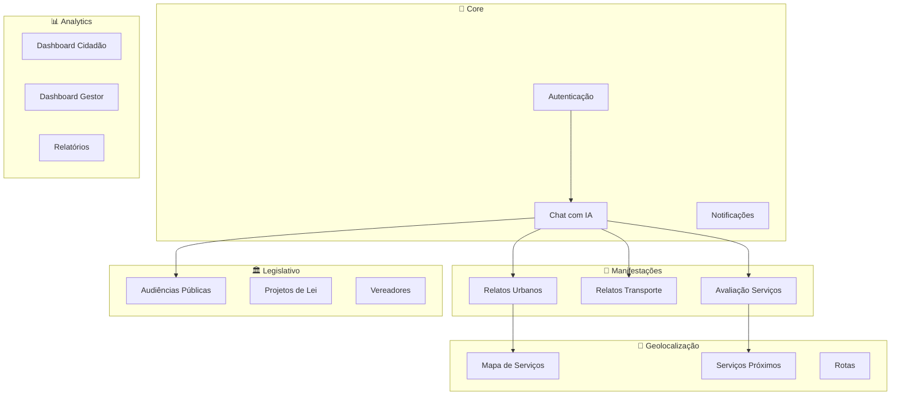

### 7.2 Descrição dos Módulos

| Módulo                            | Descrição                                                         |
| --------------------------------- | ----------------------------------------------------------------- |
| **CSU001 - Autenticação**         | Cadastro com email/telefone, login, perfil com dados demográficos |
| **CSU002 - Chat com IA**          | Interface conversacional principal, histórico, rascunhos          |
| **CSU003 - Relatos Urbanos**      | Categorias de problemas, coleta via chat, fotos, geolocalização   |
| **CSU004 - Relatos Transporte**   | Tipos de problema, integração SPTrans, detecção de padrões        |
| **CSU005 - Avaliação Serviços**   | Detecção por geofence, estrelas, comentários                      |
| **CSU006 - Mapa de Serviços**     | Visualização, filtros, detalhes, rotas                            |
| **CSU007 - Audiências**           | Listagem, filtros, inscrição, lembretes                           |
| **CSU008 - Conteúdo Legislativo** | Notícias, projetos, explicações, busca RAG                        |
| **CSU009 - Encaminhamento**       | Match por tema/região, acompanhamento                             |

---

## 8. Jornadas do Usuário

### 8.1 Jornada: Primeiro Acesso

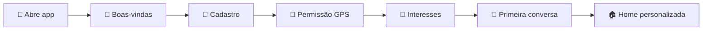

**Descrição detalhada:**

1. **Abre o app pela primeira vez**
   - Usuário baixa e abre o aplicativo
   - Sentimento: Curiosidade

2. **Tela de boas-vindas**
   - Apresentação do Câmara na Mão
   - Carrossel com principais funcionalidades
   - Sentimento: Interesse

3. **Cadastro simplificado**
   - Nome e email (ou telefone)
   - Senha segura
   - Aceite de termos
   - Sentimento: Expectativa

4. **Permissão de localização**
   - Explica benefícios (serviços próximos, relatos geolocalizados)
   - Opção de pular e configurar depois
   - Sentimento: Confiança

5. **Seleção de interesses**
   - Temas: saúde, educação, transporte, segurança, meio ambiente
   - Mínimo de 1, recomendado 3
   - Sentimento: Engajamento

6. **Primeira interação com a IA**
   - Saudação personalizada com nome
   - Sugestões baseadas nos interesses
   - Explicação do que pode fazer
   - Sentimento: Surpresa positiva

7. **Home personalizada**
   - Conteúdo baseado em localização e interesses
   - Ações rápidas sugeridas
   - Sentimento: Satisfação

---

### 8.2 Jornada: Criar Relato Urbano

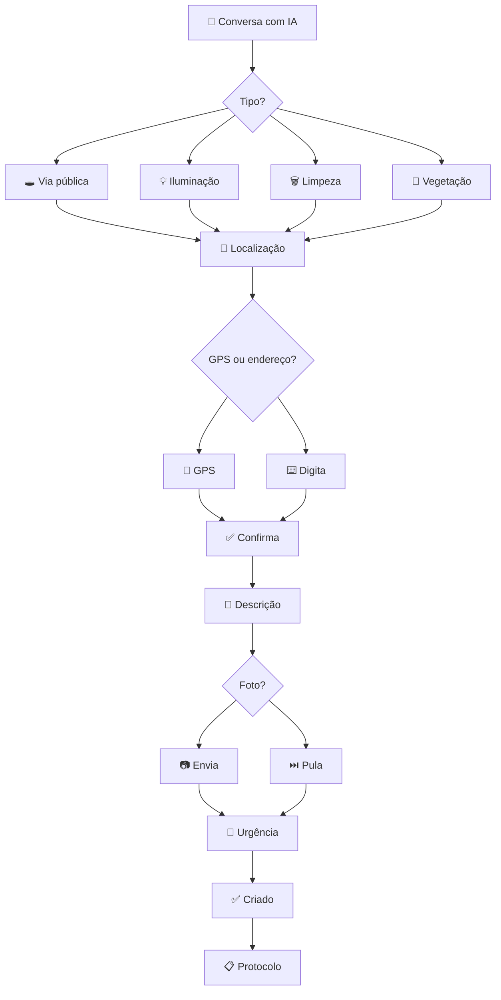

**Descrição detalhada:**

| Etapa | Ação do Usuário       | Resposta do Sistema                    | Sentimento                |
| ----- | --------------------- | -------------------------------------- | ------------------------- |
| 1     | Descreve problema     | Detecta intenção, classifica categoria | Frustração (com problema) |
| 2     | Informa localização   | Confirma endereço via geocoding        | Facilidade                |
| 3     | Adiciona detalhes     | Coleta descrição e referências         | Contribuindo              |
| 4     | Envia foto (opcional) | Processa e armazena                    | Engajado                  |
| 5     | Confirma urgência     | Classifica severidade                  | Cuidado                   |
| 6     | Recebe protocolo      | Mostra resumo e próximos passos        | Alívio, satisfação        |

---

### 8.3 Jornada: Avaliar Serviço Público

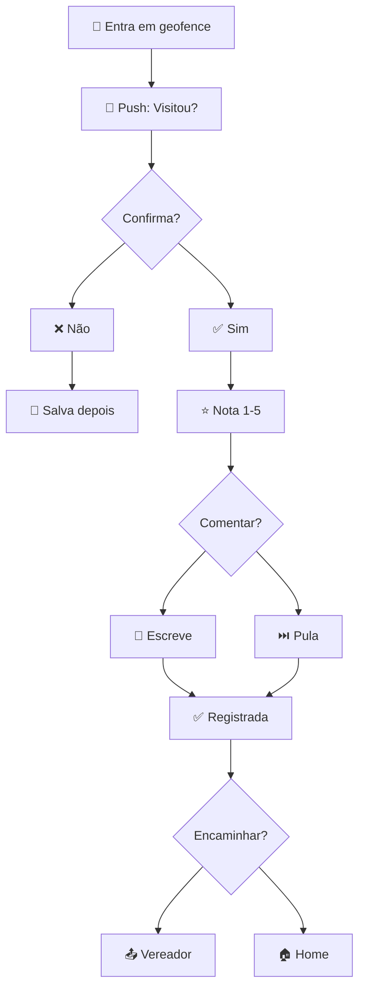

**Descrição detalhada:**

| Etapa | Ação do Sistema                       | Ação do Usuário    | Sentimento         |
| ----- | ------------------------------------- | ------------------ | ------------------ |
| 1     | Detecta visita por geofence (15+ min) | -                  | Neutro             |
| 2     | Envia push após sair do local         | Abre notificação   | Lembrado           |
| 3     | Pergunta se visitou                   | Confirma ou nega   | Respeitado         |
| 4     | Mostra interface de estrelas          | Dá nota            | Opinião valorizada |
| 5     | Pergunta sobre experiência            | Escreve comentário | Voz ativa          |
| 6     | Agradece e confirma                   | Vê impacto         | Contribuição       |
| 7     | Sugere encaminhamento (se nota baixa) | Decide             | Empoderamento      |

---

### 8.4 Jornada: Participar de Audiência

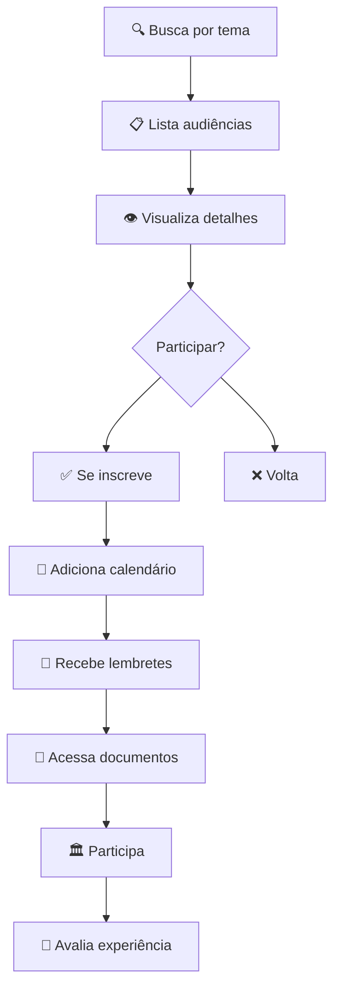

**Descrição detalhada:**

| Etapa | Ação                             | Resultado                       |
| ----- | -------------------------------- | ------------------------------- |
| 1     | Busca por tema, data ou comissão | Lista filtrada                  |
| 2     | Visualiza detalhes               | Data, hora, local, pauta, vagas |
| 3     | Realiza inscrição                | Confirmação imediata            |
| 4     | Recebe lembretes                 | 7 dias, 1 dia, 1 hora antes     |
| 5     | Acessa documentos                | PDFs disponíveis no app         |
| 6     | Participa                        | Presencial ou online            |
| 7     | Avalia experiência               | Feedback para melhoria          |

---

## 9. Especificação de Dados por Tipo de Manifestação

### 9.1 Relato Urbano

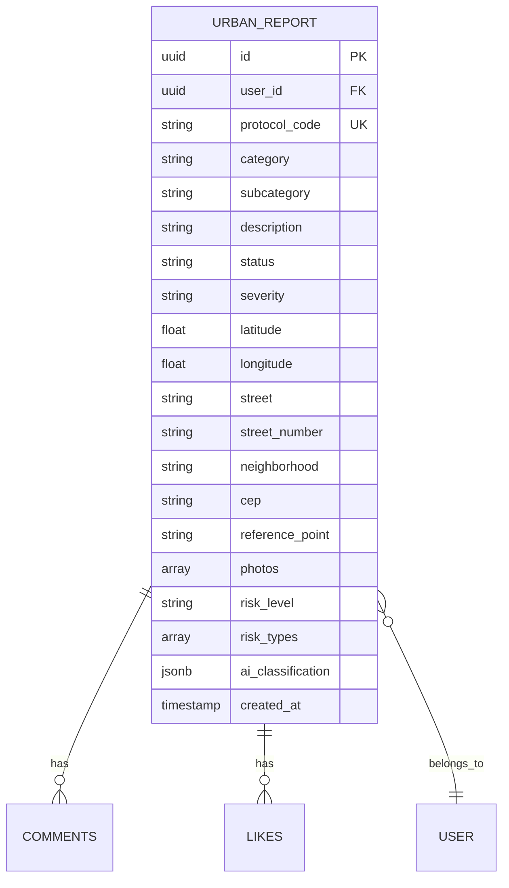

#### Campos e Regras

| Campo                | Tipo   | Obrigatório      | Regra de Coleta                                                                                                                                                      |
| -------------------- | ------ | ---------------- | -------------------------------------------------------------------------------------------------------------------------------------------------------------------- |
| `category`           | enum   | ✅ Sim           | IA classifica automaticamente ou pergunta. Valores: `via_publica`, `iluminacao`, `limpeza`, `vegetacao`, `esgoto`, `higiene_urbana`, `animais`, `poluicao`, `outros` |
| `subcategory`        | string | ❌ Não           | Inferido pela IA com base na descrição                                                                                                                               |
| `description`        | text   | ⚠️ Mín. 20 chars | Coletado em linguagem natural durante conversa                                                                                                                       |
| `latitude/longitude` | float  | ✅ Sim           | GPS do dispositivo ou geocoding do endereço                                                                                                                          |
| `street`             | string | ✅ Sim           | Geocoding reverso do GPS ou digitado pelo usuário                                                                                                                    |
| `street_number`      | string | ❌ Não           | Perguntado se não detectado                                                                                                                                          |
| `neighborhood`       | string | ✅ Sim           | Geocoding reverso                                                                                                                                                    |
| `cep`                | string | ❌ Não           | Geocoding reverso                                                                                                                                                    |
| `reference_point`    | string | ❌ Não           | Perguntado pela IA para facilitar localização                                                                                                                        |
| `photos`             | array  | ❌ Não           | Incentivado, não obrigatório                                                                                                                                         |
| `severity`           | enum   | ✅ Sim           | Inferido pela IA. Valores: `baixa`, `media`, `alta`, `critica`                                                                                                       |
| `risk_level`         | enum   | ⚠️ Condicional   | Obrigatório para categorias de risco                                                                                                                                 |
| `risk_types`         | array  | ❌ Não           | Tipos de risco identificados                                                                                                                                         |
| `status`             | enum   | ✅ Sim           | Default: `pendente`                                                                                                                                                  |

#### Regras de Inferência

| Dado                         | Regra de Inferência                                |
| ---------------------------- | -------------------------------------------------- |
| `severity: alta`             | Menção a acidente, queda, risco, urgente, perigoso |
| `severity: critica`          | Menção a ferido, morte, emergência, imediato       |
| `risk_types: ["acidente"]`   | Palavras: buraco, cratera, desnível, queda         |
| `risk_types: ["alagamento"]` | Palavras: água, enchente, bueiro entupido          |
| `subcategory`                | Extração de entidades da descrição                 |

---

### 9.2 Relato de Transporte

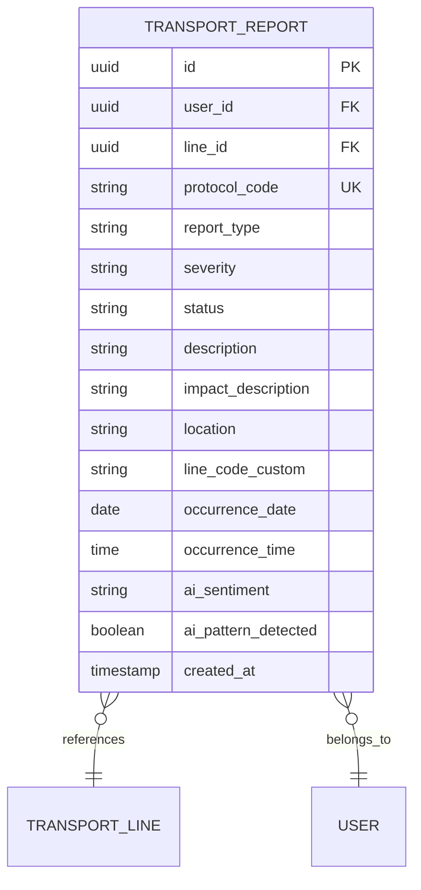

#### Campos e Regras

| Campo                | Tipo   | Obrigatório      | Regra de Coleta                                                                                                  |
| -------------------- | ------ | ---------------- | ---------------------------------------------------------------------------------------------------------------- |
| `report_type`        | enum   | ✅ Sim           | IA classifica. Valores: `atraso`, `lotacao`, `acessibilidade`, `seguranca`, `limpeza`, `comportamento`, `outros` |
| `line_id`            | uuid   | ⚠️ Condicional   | Obrigatório se for sobre linha específica                                                                        |
| `line_code_custom`   | string | ❌ Não           | Se linha não encontrada na base                                                                                  |
| `occurrence_date`    | date   | ✅ Sim           | Perguntado: "Quando aconteceu?" - NÃO assumir "hoje"                                                             |
| `occurrence_time`    | time   | ❌ Não           | Perguntado se relevante                                                                                          |
| `description`        | text   | ⚠️ Mín. 20 chars | Coletado em linguagem natural                                                                                    |
| `impact_description` | text   | ❌ Não           | Perguntado: "Como isso te afetou?"                                                                               |
| `location`           | string | ❌ Não           | Ponto, estação ou trecho                                                                                         |
| `severity`           | enum   | ✅ Sim           | Inferido. Valores: `baixa`, `media`, `alta`                                                                      |

#### Regras de Validação

| Regra              | Descrição                                                     |
| ------------------ | ------------------------------------------------------------- |
| Validação de data  | Sistema NÃO assume data como "hoje" sem confirmação explícita |
| Inferência de tipo | `seguranca` para menções de assédio, roubo, violência         |
| Padrão detectado   | Se 3+ relatos similares na mesma linha em 7 dias              |

---

### 9.3 Avaliação de Serviço

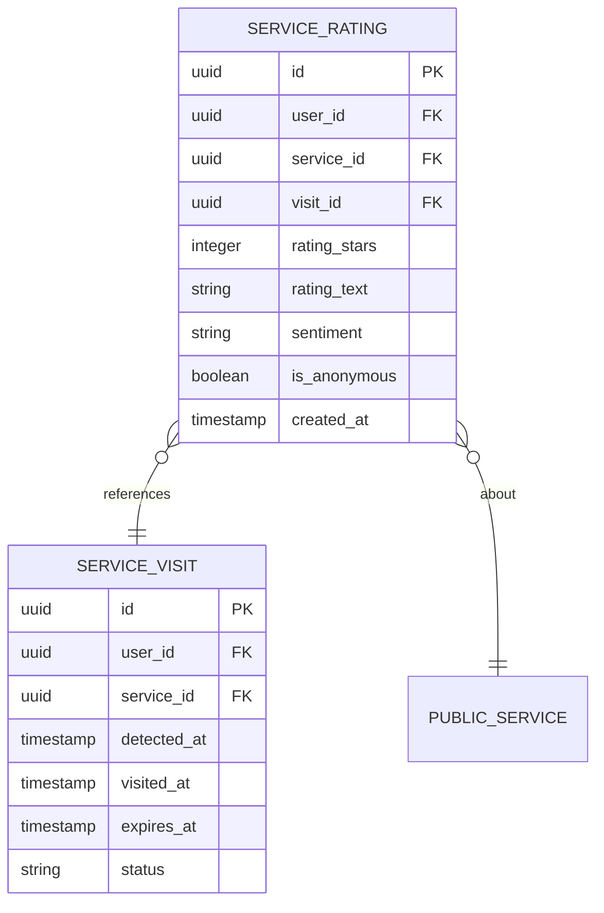

#### Campos e Regras

| Campo          | Tipo    | Obrigatório | Regra de Coleta                           |
| -------------- | ------- | ----------- | ----------------------------------------- |
| `service_id`   | uuid    | ✅ Sim      | Identificado por geofence ou busca manual |
| `visit_id`     | uuid    | ✅ Sim      | Gerado quando visita detectada            |
| `rating_stars` | integer | ✅ Sim      | 1 a 5, perguntado diretamente             |
| `rating_text`  | text    | ❌ Não      | Incentivado após nota                     |
| `sentiment`    | enum    | ❌ Não      | Inferido do texto                         |
| `is_anonymous` | boolean | ❌ Não      | Default: false                            |

#### Regras de Detecção de Visita

| Regra            | Descrição                       |
| ---------------- | ------------------------------- |
| Tempo mínimo     | 15 minutos dentro do geofence   |
| Raio do geofence | 50 metros do endereço           |
| Expiração        | Avaliação em até 48 horas       |
| Limite diário    | Máximo 3 avaliações por serviço |

---

## 10. Regras de Negócio

### 10.1 Regras Gerais

| ID    | Regra                    | Descrição                                              |
| ----- | ------------------------ | ------------------------------------------------------ |
| RN001 | Autenticação obrigatória | Usuário deve estar logado para criar manifestações     |
| RN002 | Protocolo único          | Todo relato/avaliação recebe código único sequencial   |
| RN003 | Formato de protocolo     | URB-YYYY-NNNNNN (urbano), TRP-YYYY-NNNNNN (transporte) |
| RN004 | Geolocalização           | Se GPS indisponível, endereço textual é obrigatório    |
| RN005 | Edição de relatos        | Permitida apenas nas primeiras 24 horas                |
| RN006 | Exclusão de relatos      | Usuário pode solicitar, admin deve aprovar             |
| RN007 | Anonimato                | Avaliações podem ser anônimas, relatos não             |

### 10.2 Regras de Notificação

| ID    | Regra                  | Descrição                                           |
| ----- | ---------------------- | --------------------------------------------------- |
| RN101 | Horário silencioso     | Push não enviado entre 22h e 7h                     |
| RN102 | Lembretes de audiência | 7 dias, 1 dia e 1 hora antes                        |
| RN103 | Atualização de status  | Notificar quando relato mudar de status             |
| RN104 | Padrões detectados     | Notificar quando relato fizer parte de padrão       |
| RN105 | Resposta de vereador   | Notificar imediatamente (exceto horário silencioso) |

### 10.3 Regras de IA

| ID    | Regra                 | Descrição                                           |
| ----- | --------------------- | --------------------------------------------------- |
| RN201 | Fonte citada          | IA deve indicar fonte quando usar dados oficiais    |
| RN202 | Confiança baixa       | Se confiança < 80%, pedir confirmação do usuário    |
| RN203 | Coleta atômica        | Uma pergunta por vez para dados obrigatórios        |
| RN204 | Confirmação explícita | Endereço deve ser confirmado antes de salvar        |
| RN205 | Limite de contexto    | Manter últimas 20 mensagens na memória              |
| RN206 | Política no-guessing  | NÃO assumir dados sem evidência do usuário          |
| RN207 | Description gating    | Se descrição ≥30 chars, pular pergunta de descrição |

### 10.4 Regras de Dados

| ID    | Regra                   | Descrição                                      |
| ----- | ----------------------- | ---------------------------------------------- |
| RN301 | Retenção de localização | GPS descartado após geocoding                  |
| RN302 | Anonimização            | Dados exportados removem identificação pessoal |
| RN303 | Auditoria               | Toda ação de admin gera log de auditoria       |
| RN304 | Backup                  | Dados críticos com retenção de 90 dias         |
| RN305 | LGPD                    | Usuário pode solicitar exclusão de dados       |

---

## 11. Integrações Externas

### 11.1 Mapa de Integrações

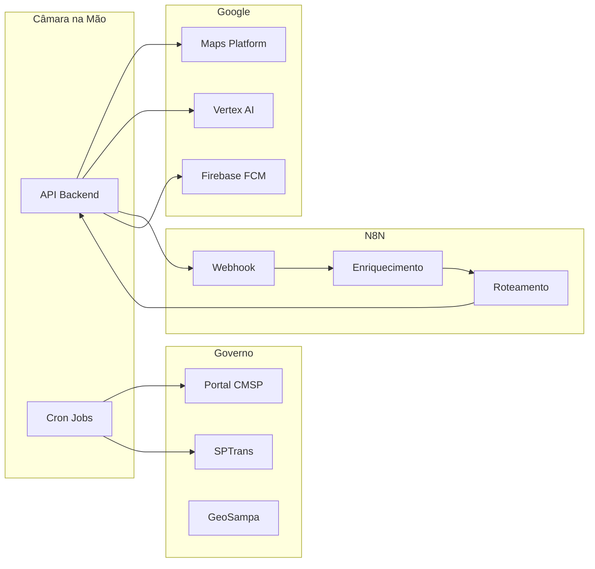

### 11.2 Detalhamento

| Integração           | Propósito                      | Frequência   | Método         |
| -------------------- | ------------------------------ | ------------ | -------------- |
| **Google Maps**      | Geocoding, autocomplete, rotas | Real-time    | REST API       |
| **Google Vertex AI** | LLM (Gemini), embeddings       | Real-time    | REST API       |
| **Firebase FCM**     | Push notifications             | Real-time    | SDK            |
| **Portal CMSP**      | Notícias, projetos, audiências | Cron diário  | Scraping + RSS |
| **SPTrans**          | Linhas, itinerários            | Cron diário  | API GTFS       |
| **GeoSampa**         | Limites de bairros, regiões    | Cron semanal | GeoJSON        |
| **N8N**              | Workflow de enriquecimento     | Webhook      | HTTP           |

---

## 12. Requisitos Não-Funcionais

### 12.1 Performance

| Requisito               | Meta                        |
| ----------------------- | --------------------------- |
| Tempo de resposta (P95) | < 500ms para APIs           |
| Tempo de resposta (P99) | < 1.5s para APIs            |
| Resposta da IA (P95)    | < 3s para primeira resposta |
| Disponibilidade         | > 99.5% uptime mensal       |
| RTO                     | < 4 horas                   |
| RPO                     | < 1 hora                    |

### 12.2 Segurança

| Requisito         | Implementação           |
| ----------------- | ----------------------- |
| Autenticação      | JWT com refresh tokens  |
| Autorização       | RBAC                    |
| Dados em trânsito | TLS 1.3                 |
| Dados em repouso  | AES-256                 |
| Rate limiting     | 100 req/min por usuário |
| WAF               | Proteção OWASP Top 10   |

### 12.3 Acessibilidade

| Requisito             | Padrão               |
| --------------------- | -------------------- |
| Conformidade          | WCAG 2.1 AA          |
| Navegação por teclado | Suportada            |
| Leitores de tela      | VoiceOver e TalkBack |
| Contraste mínimo      | 4.5:1                |
| Tamanho de fonte      | Ajustável            |
| Linguagem             | Simples (nível B1)   |

### 12.4 Escalabilidade

| Requisito        | Estratégia               |
| ---------------- | ------------------------ |
| Pico de usuários | Auto-scaling horizontal  |
| Armazenamento    | Lifecycle policies       |
| Banco de dados   | Particionamento por data |
| Cache            | Redis com TTL            |

---

## 13. Glossário

| Termo            | Definição                                                  |
| ---------------- | ---------------------------------------------------------- |
| **Cidadão**      | Usuário final do aplicativo, munícipe de São Paulo         |
| **Geofence**     | Perímetro virtual em torno de uma localização geográfica   |
| **LLM**          | Large Language Model, modelo de linguagem de grande escala |
| **MAU**          | Monthly Active Users, usuários ativos mensalmente          |
| **Orquestrador** | Componente de IA que gerencia conversas e ações            |
| **Protocolo**    | Código único de identificação de manifestação              |
| **RAG**          | Retrieval-Augmented Generation, busca + geração de texto   |
| **RLS**          | Row Level Security, segurança a nível de linha no banco    |
| **Push**         | Notificação enviada ao dispositivo do usuário              |
| **Manifestação** | Termo genérico para relatos, avaliações e feedback         |

---

_Documento gerado em Dezembro/2024 - Versão 3.0_
