# Câmara na Mão - Documento de Escopo e Arquitetura

**Versão:** 3.0  
**Última Atualização:** Dezembro 2025  
**Status:** Aprovado para Desenvolvimento

---

## Sumário

1. [Visão Geral do Projeto](#1-visão-geral-do-projeto)
2. [Objetivos Estratégicos](#2-objetivos-estratégicos)
3. [Arquitetura do Produto](#3-arquitetura-do-produto)
4. [Stack Tecnológica](#4-stack-tecnológica)
5. [Arquitetura de Alto Nível (C4)](#5-arquitetura-de-alto-nível-c4)
6. [Modelo de Dados Conceitual](#6-modelo-de-dados-conceitual)
7. [Personas e Perfis de Usuário](#7-personas-e-perfis-de-usuário)
8. [Casos de Uso](#8-casos-de-uso)
9. [Mapa do Site](#9-mapa-do-site)
10. [O Orquestrador de IA](#10-o-orquestrador-de-ia)
11. [Jornadas do Usuário](#11-jornadas-do-usuário)
12. [Especificação de Dados por Tipo de Manifestação](#12-especificação-de-dados-por-tipo-de-manifestação)
13. [Requisitos Não-Funcionais](#13-requisitos-não-funcionais)
14. [Requisitos de Segurança e LGPD](#14-requisitos-de-segurança-e-lgpd)
15. [Regras de Negócio](#15-regras-de-negócio)
16. [Estados e Ciclos de Vida](#16-estados-e-ciclos-de-vida)
17. [Fluxos de Integração](#17-fluxos-de-integração)
18. [Cenários de Erro e Contingência](#18-cenários-de-erro-e-contingência)
19. [Protocolos e Formatos](#19-protocolos-e-formatos)
20. [Matriz de Rastreabilidade](#20-matriz-de-rastreabilidade)
21. [Premissas e Restrições](#21-premissas-e-restrições)
22. [Métricas de Sucesso (KPIs)](#22-métricas-de-sucesso-kpis)
23. [Glossário](#23-glossário)

---

## 1. Visão Geral do Projeto

### 1.1 Descrição do Produto

O **Câmara na Mão** é um aplicativo móvel inovador de participação cidadã que utiliza inteligência artificial conversacional para conectar os munícipes de São Paulo com a Câmara Municipal, vereadores e serviços públicos da cidade.

O aplicativo permite que cidadãos:

- **Registrem manifestações** sobre problemas urbanos e de transporte público
- **Avaliem serviços públicos** que utilizam (UBS, escolas, CEUs, etc.)
- **Acompanhem atividades legislativas** da Câmara Municipal
- **Participem de audiências públicas** de forma presencial ou remota
- **Encontrem serviços públicos** próximos com rotas otimizadas

### 1.2 Proposta de Valor

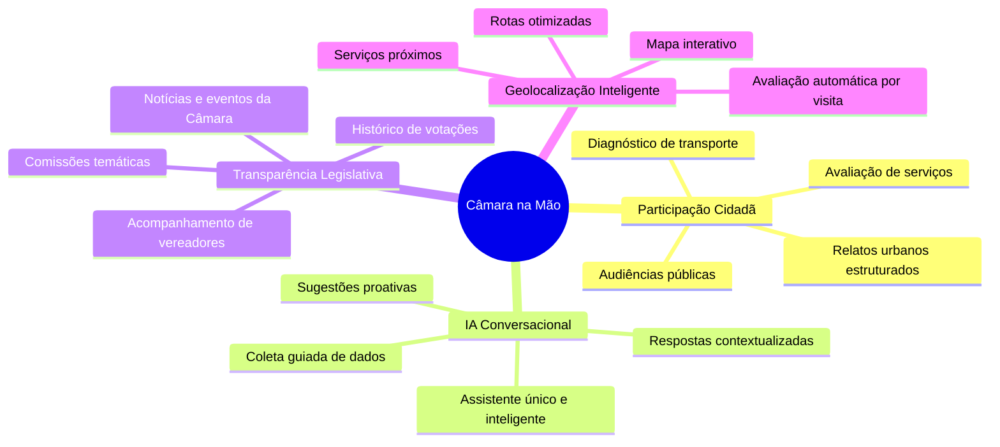

### 1.3 Diferenciais

| Diferencial                    | Descrição                                                                       |
| ------------------------------ | ------------------------------------------------------------------------------- |
| **Assistente Único**           | Um único ponto de contato conversacional que orquestra todas as funcionalidades |
| **Coleta Inteligente**         | IA que guia o cidadão com perguntas atômicas e infere dados do contexto         |
| **Geolocalização Ativa**       | Detecção automática de visitas a serviços públicos para avaliação               |
| **Encaminhamento Inteligente** | Sugestão automática de comissões parlamentares relevantes                       |
| **Modo Offline**               | Funcionamento básico mesmo sem conectividade                                    |

### 1.4 Escopo do Produto

**Incluído:**

- Assistente de IA conversacional unificado
- Módulo de manifestações cidadãs (urbanas, transporte, avaliações)
- Módulo de audiências públicas
- Módulo institucional (vereadores, comissões, notícias)
- Mapa de serviços públicos
- Dashboards analíticos para gestores
- Área administrativa para triagem

**Excluído:**

- Gestão interna de processos legislativos
- Funcionalidades administrativas internas da Câmara
- Integração com sistemas de votação

---

## 2. Objetivos Estratégicos

### 2.1 Objetivos Primários

| Objetivo                                                   | Indicador de Sucesso                               |
| ---------------------------------------------------------- | -------------------------------------------------- |
| Aumentar a participação cidadã nas atividades legislativas | Crescimento no número de manifestações registradas |
| Melhorar a transparência da Câmara Municipal               | Aumento no acesso a informações legislativas       |
| Facilitar o registro e acompanhamento de demandas          | Redução no tempo de registro de manifestações      |
| Aproximar cidadãos e representantes eleitos                | Aumento na taxa de encaminhamentos respondidos     |

### 2.2 Objetivos Secundários

| Objetivo                                       | Indicador de Sucesso                            |
| ---------------------------------------------- | ----------------------------------------------- |
| Democratizar o acesso à informação legislativa | Aumento na diversidade demográfica dos usuários |
| Gerar insights para políticas públicas         | Utilização dos dashboards por gestores          |
| Reduzir barreiras de comunicação               | Melhoria na satisfação do usuário               |
| Promover educação cívica                       | Engajamento com conteúdo educacional            |

### 2.3 Métricas de Acompanhamento

| Categoria       | Indicadores                                                                    |
| --------------- | ------------------------------------------------------------------------------ |
| **Adoção**      | Downloads, usuários ativos, taxa de retenção                                   |
| **Engajamento** | Manifestações por usuário, tempo de sessão, retorno ao app                     |
| **Qualidade**   | Completude das manifestações, taxa de aprovação, satisfação                    |
| **Impacto**     | Manifestações resolvidas, participação em audiências, encaminhamentos efetivos |

---

## 3. Arquitetura do Produto

### 3.1 Conceito do Assistente Único

O Câmara na Mão adota uma arquitetura de **Assistente Orquestrador Único**, onde um agente de IA centraliza todas as interações com o cidadão e coordena as diferentes funcionalidades do sistema.

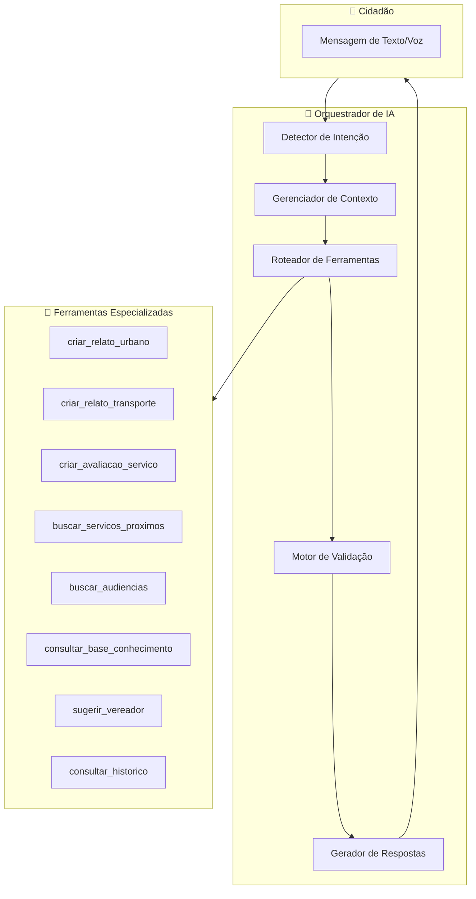

### 3.2 Ferramentas Disponíveis

| Ferramenta                    | Descrição                                     | Jornada                |
| ----------------------------- | --------------------------------------------- | ---------------------- |
| `criar_relato_urbano`         | Registra problemas urbanos com geolocalização | Relato Urbano          |
| `criar_relato_transporte`     | Registra problemas no transporte público      | Diagnóstico Transporte |
| `criar_avaliacao_servico`     | Registra avaliação de serviço público         | Avaliação de Serviço   |
| `buscar_servicos_proximos`    | Localiza serviços públicos próximos           | Mapa de Serviços       |
| `buscar_audiencias`           | Lista audiências públicas por tema/data       | Audiências Públicas    |
| `consultar_base_conhecimento` | Busca semântica em documentos da Câmara       | Consulta RAG           |
| `sugerir_vereador`            | Sugere vereadores/comissões relevantes        | Encaminhamento         |
| `consultar_historico`         | Recupera manifestações anteriores do cidadão  | Histórico              |

### 3.3 Geolocalização Estruturada

Todas as manifestações e avaliações incluem dados de localização estruturados:

```json
{
  "localizacao": {
    "latitude": -23.550520,
    "longitude": -46.633308,
    "endereco_completo": "Viaduto do Chá, 15",
    "logradouro": "Viaduto do Chá",
    "numero": "15",
    "bairro": "Centro",
    "cep": "01002-020",
    "ponto_referencia": "Próximo ao Teatro Municipal",
    "precisao_gps": 10.5
  }
}
```

---

## 4. Stack Tecnológica

### 4.1 Visão Geral

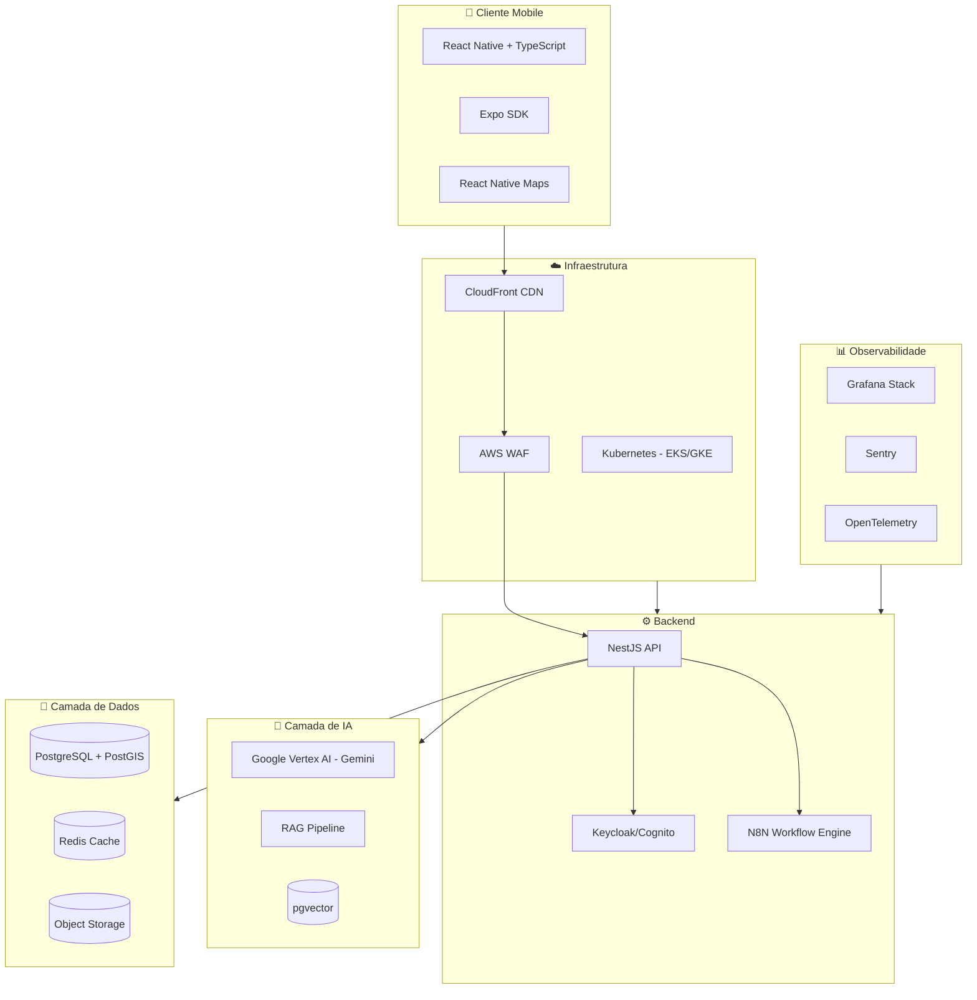

### 4.2 Justificativa das Escolhas

#### 4.2.1 Frontend Mobile: React Native + TypeScript

| Critério             | Justificativa                                        |
| -------------------- | ---------------------------------------------------- |
| **Cross-platform**   | Desenvolvimento único para iOS e Android             |
| **Performance**      | Componentes nativos com bridge otimizado             |
| **Ecossistema**      | Ampla disponibilidade de bibliotecas                 |
| **Manutenibilidade** | TypeScript para tipagem estática                     |
| **Custo**            | Redução de 40-50% vs desenvolvimento nativo separado |

#### 4.2.2 Backend: NestJS + Node.js

| Critério          | Justificativa                               |
| ----------------- | ------------------------------------------- |
| **Arquitetura**   | Modular, testável, escalável                |
| **TypeScript**    | Mesma linguagem do frontend                 |
| **Performance**   | Event loop não-bloqueante                   |
| **Ecossistema**   | Suporte a GraphQL, WebSocket, microservices |
| **Produtividade** | Decorators, DI, módulos prontos             |

#### 4.2.3 Banco de Dados: PostgreSQL + Extensões

| Extensão     | Uso                                         |
| ------------ | ------------------------------------------- |
| **PostGIS**  | Queries geoespaciais para serviços próximos |
| **pgvector** | Busca semântica para RAG                    |
| **pg_trgm**  | Busca fuzzy para autocomplete               |

#### 4.2.4 IA: Google Vertex AI (Gemini)

| Critério            | Justificativa                    |
| ------------------- | -------------------------------- |
| **Multimodal**      | Suporte a texto, imagem, áudio   |
| **Contexto**        | Janela de contexto de 1M+ tokens |
| **Custo-benefício** | Menor custo por token vs GPT-4   |
| **Latência**        | Streaming de respostas           |
| **Compliance**      | Opção de processamento regional  |

#### 4.2.5 Motor de Workflow: N8N (Self-hosted)

| Critério          | Justificativa                       |
| ----------------- | ----------------------------------- |
| **Flexibilidade** | Workflows visuais configuráveis     |
| **Custo**         | Open-source, sem taxas por execução |
| **Integrações**   | 400+ conectores nativos             |
| **Controle**      | Self-hosted para dados sensíveis    |

### 4.3 Estimativa de Custos (Mensal)

| Componente                     | Estimativa             |
| ------------------------------ | ---------------------- |
| Infraestrutura Cloud (EKS/GKE) | R$ 15.000 - 25.000     |
| Banco de Dados Gerenciado      | R$ 3.000 - 8.000       |
| IA (Vertex AI)                 | R$ 5.000 - 15.000      |
| CDN + WAF                      | R$ 1.000 - 3.000       |
| Observabilidade                | R$ 2.000 - 5.000       |
| **Total Estimado**             | **R$ 26.000 - 56.000** |

_Nota: Valores variam conforme escala de uso._

---

## 5. Arquitetura de Alto Nível (C4)

### 5.1 Diagrama de Contexto (Nível 1)

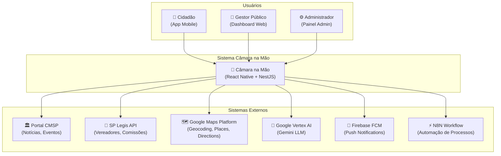

### 5.2 Diagrama de Containers (Nível 2)

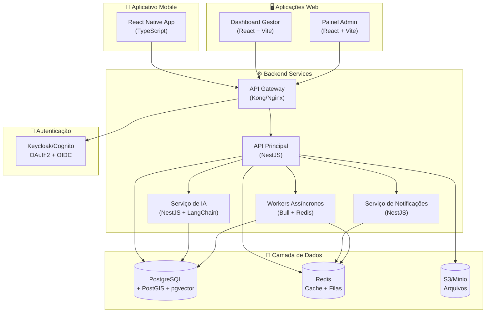

### 5.3 Diagrama de Infraestrutura Cloud

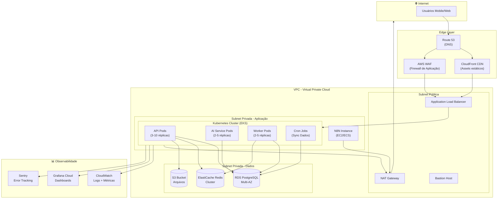

### 5.4 Fluxo de Dados Principal - Relato Urbano

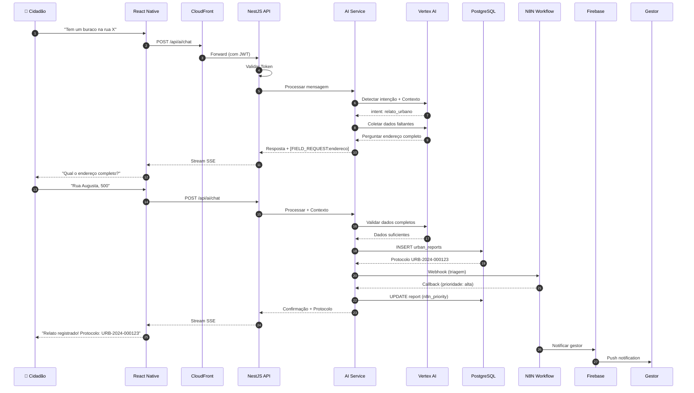

### 5.5 Arquitetura de Observabilidade

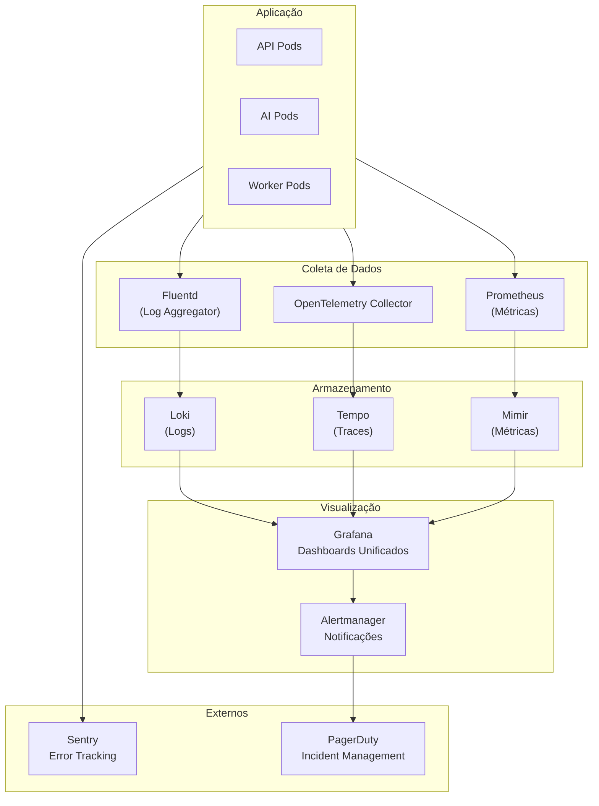

### 5.6 Arquitetura RAG (Retrieval-Augmented Generation)

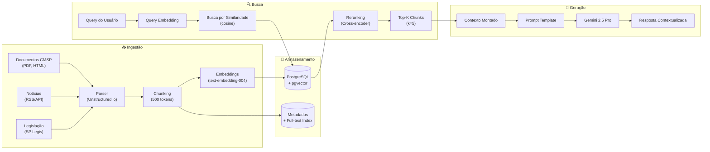

### 5.7 Arquitetura de Crons e Sincronização

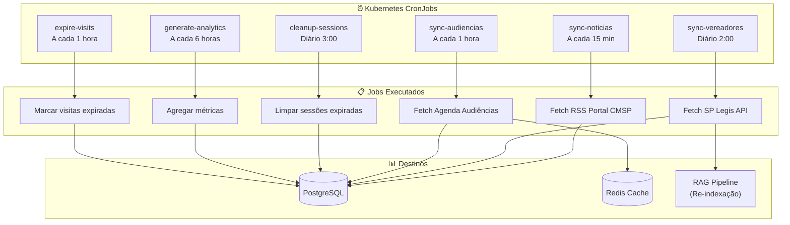

---

## 6. Modelo de Dados Conceitual

### 6.1 Diagrama Entidade-Relacionamento

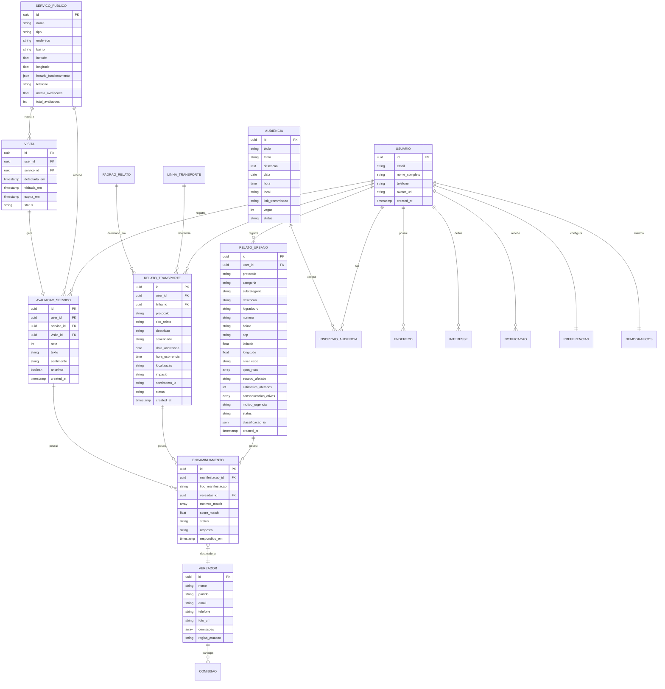

### 6.2 Descrição das Entidades Principais

#### USUARIO

Representa o cidadão cadastrado no sistema.

| Campo                   | Tipo      | Descrição                       |
| ----------------------- | --------- | ------------------------------- |
| id                      | UUID      | Identificador único             |
| email                   | String    | E-mail de login (único)         |
| nome_completo           | String    | Nome para exibição              |
| telefone                | String    | Telefone opcional               |
| avatar_url              | String    | URL da foto de perfil           |
| onboarding_completed_at | Timestamp | Data de conclusão do onboarding |

#### RELATO_URBANO

Manifestação sobre problemas na infraestrutura urbana.

| Campo              | Tipo   | Obrigatório | Descrição                                |
| ------------------ | ------ | ----------- | ---------------------------------------- |
| id                 | UUID   | Sim         | Identificador único                      |
| user_id            | UUID   | Sim         | Referência ao usuário                    |
| protocolo          | String | Sim         | Código único (URB-YYYY-NNNNNN)           |
| categoria          | String | Sim         | Categoria principal do problema          |
| descricao          | String | Sim         | Descrição detalhada (mín. 30 caracteres) |
| logradouro         | String | Sim         | Nome da rua/avenida                      |
| bairro             | String | Sim         | Bairro da ocorrência                     |
| latitude/longitude | Float  | Sim         | Coordenadas GPS                          |
| nivel_risco        | String | Condicional | Obrigatório para categorias de risco     |
| status             | String | Sim         | Estado atual do relato                   |

#### RELATO_TRANSPORTE

Manifestação sobre problemas no transporte público.

| Campo           | Tipo   | Obrigatório | Descrição                                |
| --------------- | ------ | ----------- | ---------------------------------------- |
| id              | UUID   | Sim         | Identificador único                      |
| user_id         | UUID   | Sim         | Referência ao usuário                    |
| protocolo       | String | Sim         | Código único (TRP-YYYY-NNNNNN)           |
| tipo_relato     | String | Sim         | Tipo do problema                         |
| descricao       | String | Sim         | Descrição detalhada (mín. 20 caracteres) |
| data_ocorrencia | Date   | Sim         | Data do ocorrido                         |
| linha_id        | UUID   | Condicional | Linha de ônibus/metrô (se aplicável)     |
| severidade      | String | Sim         | Nível de gravidade                       |

#### AVALIACAO_SERVICO

Avaliação de um serviço público visitado.

| Campo      | Tipo    | Obrigatório | Descrição                    |
| ---------- | ------- | ----------- | ---------------------------- |
| id         | UUID    | Sim         | Identificador único          |
| user_id    | UUID    | Sim         | Referência ao usuário        |
| servico_id | UUID    | Sim         | Serviço avaliado             |
| visita_id  | UUID    | Sim         | Visita que gerou a avaliação |
| nota       | Integer | Sim         | Nota de 1 a 5 estrelas       |
| texto      | String  | Não         | Comentário opcional          |

---

## 7. Personas e Perfis de Usuário

### 7.1 Personas Principais

#### 7.1.1 Cidadão Comum

**Nome:** Maria, 45 anos  
**Ocupação:** Comerciante  
**Perfil Técnico:** Básico - usa smartphone para redes sociais e WhatsApp

**Necessidades:**

- Reportar problemas do bairro de forma simples
- Acompanhar o status das suas reclamações
- Encontrar serviços públicos próximos

**Frustrações:**

- Formulários longos e burocráticos
- Falta de feedback sobre reclamações
- Dificuldade em encontrar o canal correto

**Objetivos no App:**

- Registrar relatos de forma rápida e guiada
- Receber notificações sobre o andamento
- Avaliar serviços que utiliza

#### 7.1.2 Cidadão Engajado

**Nome:** Carlos, 32 anos  
**Ocupação:** Professor universitário  
**Perfil Técnico:** Avançado - acompanha política local ativamente

**Necessidades:**

- Acompanhar atividades dos vereadores
- Participar de audiências públicas
- Entender projetos de lei em discussão

**Frustrações:**

- Informação legislativa fragmentada
- Dificuldade em participar presencialmente
- Falta de transparência nas votações

**Objetivos no App:**

- Receber alertas sobre temas de interesse
- Participar de audiências remotamente
- Encaminhar demandas para vereadores específicos

#### 7.1.3 Gestor Público

**Nome:** Ana, 38 anos  
**Ocupação:** Coordenadora de subprefeitura  
**Perfil Técnico:** Intermediário - usa sistemas de gestão

**Necessidades:**

- Visualizar demandas da região
- Priorizar atendimentos por urgência
- Gerar relatórios para prestação de contas

**Frustrações:**

- Demandas duplicadas ou incompletas
- Falta de geolocalização precisa
- Dificuldade em identificar padrões

**Objetivos no App:**

- Acessar dashboard com KPIs da região
- Responder manifestações de forma ágil
- Identificar problemas recorrentes

#### 7.1.4 Administrador

**Nome:** Roberto, 50 anos  
**Ocupação:** Gerente de TI da Câmara  
**Perfil Técnico:** Avançado - responsável pela operação

**Necessidades:**

- Monitorar saúde do sistema
- Configurar regras de triagem
- Gerenciar usuários e permissões

**Frustrações:**

- Sistemas legados desconectados
- Falta de métricas em tempo real
- Dificuldade em escalar recursos

**Objetivos no App:**

- Configurar workflows de triagem
- Monitorar logs e métricas
- Gerenciar integrações

### 7.2 Matriz de Permissões (RBAC)

| Funcionalidade             | Cidadão | Cidadão Engajado | Gestor | Admin |
| -------------------------- | ------- | ---------------- | ------ | ----- |
| Criar manifestações        | ✅      | ✅               | ✅     | ✅    |
| Ver próprias manifestações | ✅      | ✅               | ✅     | ✅    |
| Avaliar serviços           | ✅      | ✅               | ✅     | ✅    |
| Buscar serviços próximos   | ✅      | ✅               | ✅     | ✅    |
| Inscrever-se em audiências | ✅      | ✅               | ✅     | ✅    |
| Encaminhar para vereador   | ❌      | ✅               | ✅     | ✅    |
| Ver dashboard público      | ❌      | ✅               | ✅     | ✅    |
| Responder manifestações    | ❌      | ❌               | ✅     | ✅    |
| Ver todas manifestações    | ❌      | ❌               | ✅     | ✅    |
| Gerenciar triagem          | ❌      | ❌               | ✅     | ✅    |
| Exportar dados             | ❌      | ❌               | ✅     | ✅    |
| Configurar sistema         | ❌      | ❌               | ❌     | ✅    |
| Gerenciar usuários         | ❌      | ❌               | ❌     | ✅    |
| Acessar logs de auditoria  | ❌      | ❌               | ❌     | ✅    |

---

## 8. Casos de Uso

### 8.1 CSU001 - Acolhimento Digital Personalizado

**Ator Principal:** Cidadão  
**Ferramenta IA:** `detect_user_intent`, `consultar_base_conhecimento`

**Descrição:** O sistema recebe o cidadão com uma saudação personalizada baseada no contexto (horário, localização, histórico) e oferece ações prioritárias.

**Fluxo Principal:**

1. Cidadão abre o aplicativo
2. Sistema detecta contexto (horário, última visita, pendências)
3. Assistente exibe saudação personalizada
4. Sistema mostra ações prioritárias (avaliações pendentes, audiências próximas)
5. Cidadão escolhe uma ação ou inicia conversa livre

**Fluxos Alternativos:**

- **FA1:** Primeiro acesso → Inicia onboarding
- **FA2:** Avaliação pendente detectada → Pergunta se deseja avaliar
- **FA3:** Audiência de interesse próxima → Notifica sobre inscrição

**Pré-condições:** Usuário autenticado  
**Pós-condições:** Contexto de sessão inicializado

### 8.2 CSU002 - Gestão de Interesse em Audiências

**Ator Principal:** Cidadão  
**Ferramenta IA:** `buscar_audiencias`, `consultar_historico`

**Descrição:** O cidadão pode buscar, filtrar e se inscrever em audiências públicas de seu interesse.

**Fluxo Principal:**

1. Cidadão solicita informações sobre audiências
2. Assistente pergunta sobre tema ou período de interesse
3. Sistema busca audiências correspondentes
4. Assistente apresenta lista formatada
5. Cidadão seleciona audiência de interesse
6. Sistema exibe detalhes completos
7. Cidadão confirma inscrição
8. Sistema registra inscrição e agenda notificações

**Fluxos Alternativos:**

- **FA1:** Nenhuma audiência encontrada → Oferece cadastrar alerta
- **FA2:** Vagas esgotadas → Oferece participação remota
- **FA3:** Audiência já inscrito → Informa status atual

**Regras de Negócio:**

- RN-AUD-001: Inscrição até 24h antes do evento
- RN-AUD-002: Limite de 3 inscrições simultâneas
- RN-AUD-003: Notificação 24h e 1h antes

### 8.3 CSU003 - Navegação Institucional

**Ator Principal:** Cidadão  
**Ferramenta IA:** `consultar_base_conhecimento`

**Descrição:** O cidadão acessa informações sobre a Câmara Municipal, vereadores, comissões e projetos de lei.

**Fluxo Principal:**

1. Cidadão solicita informação institucional
2. Assistente identifica o tipo de consulta
3. Sistema busca na base de conhecimento (RAG)
4. Assistente apresenta resposta contextualizada com fontes
5. Cidadão pode solicitar detalhes adicionais

**Fluxos Alternativos:**

- **FA1:** Informação não encontrada → Sugere contato com ouvidoria
- **FA2:** Múltiplos resultados → Apresenta lista para seleção
- **FA3:** Conteúdo desatualizado → Indica data de atualização

### 8.4 CSU004 - Avaliação Geolocalizada de Serviços

**Ator Principal:** Cidadão  
**Ferramenta IA:** `criar_avaliacao_servico`

**Descrição:** O sistema detecta visitas a serviços públicos e solicita avaliação do cidadão.

**Fluxo Principal:**

1. Sistema detecta permanência em serviço público (geofence)
2. Após período mínimo, registra visita potencial
3. Ao sair do local, notifica cidadão sobre avaliação
4. Cidadão abre notificação
5. Assistente pergunta sobre a experiência
6. Cidadão fornece nota (1-5 estrelas)
7. Assistente solicita comentário opcional
8. Sistema registra avaliação e atualiza médias

**Fluxos Alternativos:**

- **FA1:** Cidadão ignora notificação → Reenvia após 2h (máx. 2x)
- **FA2:** Cidadão nega visita → Descarta registro
- **FA3:** Serviço não cadastrado → Sugere cadastro colaborativo

**Regras de Negócio:**

- RN-AVA-001: Permanência mínima de 10 minutos
- RN-AVA-002: Avaliação válida por 48h após visita
- RN-AVA-003: Máximo 1 avaliação por serviço por dia

### 8.5 CSU005 - Diagnóstico de Transporte Público

**Ator Principal:** Cidadão  
**Ferramenta IA:** `criar_relato_transporte`

**Descrição:** O cidadão registra problemas no transporte público de forma estruturada.

**Fluxo Principal:**

1. Cidadão inicia relato sobre transporte
2. Assistente identifica tipo de problema
3. Assistente solicita linha/estação afetada
4. Assistente pergunta data e hora da ocorrência
5. Cidadão descreve o problema
6. Assistente solicita nível de impacto
7. Sistema registra relato com protocolo
8. Sistema detecta padrões e notifica se recorrente

**Fluxos Alternativos:**

- **FA1:** Linha não encontrada → Permite entrada manual
- **FA2:** Problema de segurança → Sugere encaminhamento urgente
- **FA3:** Padrão detectado → Informa sobre recorrência

**Regras de Negócio:**

- RN-TRP-001: Data obrigatória (aceita "hoje", "ontem", etc.)
- RN-TRP-002: Descrição mínima de 20 caracteres
- RN-TRP-003: Detecção automática de padrões (3+ relatos similares em 7 dias)

### 8.6 CSU006 - Dashboard de Análise de Demandas

**Ator Principal:** Gestor Público  
**Ferramenta IA:** N/A (interface direta)

**Descrição:** O gestor acessa dashboards analíticos para visualizar e analisar manifestações.

**Fluxo Principal:**

1. Gestor acessa área de dashboards
2. Sistema carrega visualizações padrão
3. Gestor aplica filtros (período, região, categoria)
4. Sistema atualiza gráficos em tempo real
5. Gestor pode fazer drill-down em métricas específicas
6. Gestor exporta relatório se necessário

**Fluxos Alternativos:**

- **FA1:** Sem dados no período → Exibe mensagem informativa
- **FA2:** Muitos dados → Aplica paginação/agregação
- **FA3:** Exportação grande → Processa em background

### 8.7 CSU007 - Mapa de Serviços Públicos

**Ator Principal:** Cidadão  
**Ferramenta IA:** `buscar_servicos_proximos`

**Descrição:** O cidadão localiza serviços públicos próximos com filtros e rotas.

**Fluxo Principal:**

1. Cidadão solicita serviços próximos
2. Assistente pergunta tipo de serviço desejado
3. Sistema busca serviços por geolocalização
4. Assistente apresenta lista ordenada por distância
5. Cidadão seleciona serviço de interesse
6. Sistema exibe detalhes e avaliações
7. Cidadão pode traçar rota até o local

**Fluxos Alternativos:**

- **FA1:** GPS indisponível → Solicita endereço manual
- **FA2:** Nenhum serviço próximo → Amplia raio de busca
- **FA3:** Serviço fechado → Informa horário de funcionamento

**Regras de Negócio:**

- RN-SRV-001: Raio padrão de 2km, máximo 10km
- RN-SRV-002: Ordenação por distância + avaliação
- RN-SRV-003: Atualização de coordenadas a cada 30 segundos

### 8.8 CSU008 - Relato Urbano Estruturado

**Ator Principal:** Cidadão  
**Ferramenta IA:** `criar_relato_urbano`, `classify_report_category`

**Descrição:** O cidadão registra problemas urbanos de forma guiada e estruturada.

**Fluxo Principal:**

1. Cidadão inicia relato sobre problema urbano
2. Assistente detecta categoria ou pergunta
3. Assistente solicita endereço completo
4. Sistema valida e geocodifica endereço
5. Assistente pergunta sobre número ou ponto de referência
6. Cidadão descreve o problema detalhadamente
7. Assistente faz perguntas de impacto (para categorias de risco)
8. Sistema registra relato com protocolo
9. Sistema envia para triagem via N8N
10. Cidadão recebe confirmação com protocolo

**Fluxos Alternativos:**

- **FA1:** Categoria ambígua → Solicita confirmação
- **FA2:** Endereço inválido → Oferece busca por CEP
- **FA3:** Fora do escopo municipal → Oferece registro como feedback
- **FA4:** Foto anexada → Processa com visão computacional

**Regras de Negócio:**

- RN-URB-001: Descrição mínima de 30 caracteres
- RN-URB-002: Campos de impacto obrigatórios para categorias de risco
- RN-URB-003: Protocolo no formato URB-YYYY-NNNNNN
- RN-URB-004: Geolocalização obrigatória

---

## 9. Mapa do Site

### 9.1 Estrutura Hierárquica

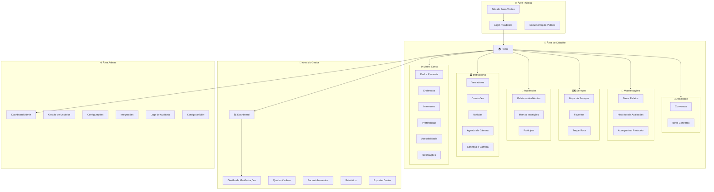

### 9.2 Navegação por Perfil

| Perfil               | Áreas Acessíveis                                                             |
| -------------------- | ---------------------------------------------------------------------------- |
| **Visitante**        | Welcome, Login, Docs                                                         |
| **Cidadão**          | Home, Assistente, Manifestações, Serviços, Audiências, Institucional, Perfil |
| **Cidadão Engajado** | Tudo do Cidadão + Dashboard Público                                          |
| **Gestor**           | Tudo do Cidadão + Dashboard Gestor, Gestão, Kanban, Relatórios               |
| **Admin**            | Acesso completo a todas as áreas                                             |

---

## 10. O Orquestrador de IA

### 10.1 Visão Geral

O Orquestrador de IA é o componente central que processa todas as interações do cidadão, interpreta intenções, gerencia contexto e coordena a execução de ferramentas especializadas.

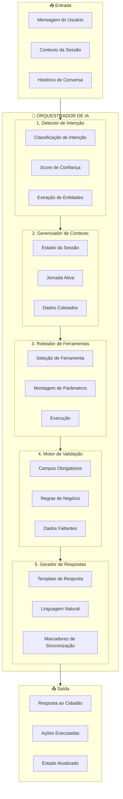

### 10.2 Detector de Intenção

O detector analisa a mensagem do usuário e classifica a intenção com base em padrões semânticos.

#### 10.2.1 Intenções Reconhecidas

| Intenção            | Gatilhos Típicos                                     | Ferramenta Acionada           |
| ------------------- | ---------------------------------------------------- | ----------------------------- |
| `relato_urbano`     | "buraco na rua", "poste apagado", "lixo acumulado"   | `criar_relato_urbano`         |
| `relato_transporte` | "ônibus atrasado", "metrô lotado", "assédio no trem" | `criar_relato_transporte`     |
| `avaliacao_servico` | "quero avaliar", "fui na UBS", "atendimento ruim"    | `criar_avaliacao_servico`     |
| `busca_servico`     | "UBS perto", "escola mais próxima", "onde fica"      | `buscar_servicos_proximos`    |
| `audiencia`         | "audiência pública", "participar de evento"          | `buscar_audiencias`           |
| `consulta_info`     | "quem é o vereador", "o que faz a comissão"          | `consultar_base_conhecimento` |
| `historico`         | "meus relatos", "minhas reclamações"                 | `consultar_historico`         |
| `saudacao`          | "olá", "bom dia", "oi"                               | Resposta contextual           |
| `ajuda`             | "como funciona", "o que você pode fazer"             | Exibe capacidades             |

#### 10.2.2 Fluxo de Classificação

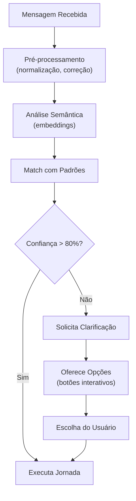

### 10.3 Operação por Jornada

Cada tipo de manifestação segue uma jornada de coleta estruturada com perguntas atômicas.

#### 10.3.1 Jornada: Relato Urbano

**Campos a Coletar:**

1. Categoria (inferida ou confirmada)
2. Endereço (logradouro, número, bairro)
3. CEP (inferido do endereço)
4. Descrição (mínimo 30 caracteres)
5. Nível de risco (se categoria de risco)
6. Tipos de risco (se categoria de risco)
7. Escopo afetado
8. Estimativa de afetados (se alto impacto)
9. Consequências ativas
10. Motivo de urgência (se urgente)

**Exemplo de Conversa:**

```
👤 Cidadão: "Tem um poste apagado aqui na minha rua"

🤖 Assistente: "Entendi que você quer reportar um poste apagado.
Esse é um problema de iluminação pública.

Qual o endereço completo onde o poste está localizado?"
[FIELD_REQUEST:endereco]

👤 Cidadão: "Rua Augusta, 500"

🤖 Assistente: "Perfeito! Rua Augusta, 500.
Em qual bairro fica?"
[FIELD_REQUEST:bairro]

👤 Cidadão: "Consolação"

🤖 Assistente: "Você pode descrever melhor a situação?
Por exemplo: há quanto tempo está apagado, quantos postes são,
se há risco de segurança no local."
[FIELD_REQUEST:descricao]

👤 Cidadão: "O poste está apagado há mais de uma semana,
fica numa esquina escura e já teve assalto aqui"

🤖 Assistente: "Essa situação representa algum risco à segurança
das pessoas que passam pelo local?"
[FIELD_REQUEST:nivel_risco]

👤 Cidadão: "Sim, é perigoso"

🤖 Assistente: "Quais tipos de risco estão presentes?
- Risco de queda
- Risco de acidente de trânsito
- Risco de violência/assalto
- Risco à saúde"
[FIELD_REQUEST:tipos_risco]

👤 Cidadão: "Risco de assalto"

🤖 Assistente: "✅ **Relato registrado com sucesso!**

📋 **Protocolo:** URB-2024-001234

📍 **Local:** Rua Augusta, 500 - Consolação
🏷️ **Categoria:** Iluminação Pública
⚠️ **Nível de Risco:** Alto
🚨 **Tipo de Risco:** Violência/Assalto

Seu relato foi enviado para triagem e você receberá
atualizações sobre o andamento. Deseja fazer mais alguma coisa?"
```

#### 10.3.2 Jornada: Relato de Transporte

**Campos a Coletar:**

1. Tipo de problema (inferido ou perguntado)
2. Linha ou estação
3. Data da ocorrência
4. Hora aproximada (opcional)
5. Descrição (mínimo 20 caracteres)
6. Severidade
7. Impacto pessoal

**Exemplo de Conversa:**

```
👤 Cidadão: "O ônibus 875A tá demorando demais hoje"

🤖 Assistente: "Entendi! Você quer relatar um problema
com a linha 875A.

Quando isso aconteceu? Hoje, ontem, ou em outra data?"
[FIELD_REQUEST:data_ocorrencia]

👤 Cidadão: "Agora de manhã, tipo umas 7h"

🤖 Assistente: "Por volta das 7h de hoje.
Você pode descrever melhor o problema?
Por exemplo: quanto tempo esperou, se o ônibus
passou lotado, etc."
[FIELD_REQUEST:descricao]

👤 Cidadão: "Esperei quase 40 minutos no ponto,
quando o ônibus chegou já tava lotado e não parou"

🤖 Assistente: "Isso é bem frustrante! Como você
classificaria a gravidade desse problema?"
- 🟢 Leve (pequeno inconveniente)
- 🟡 Moderado (atrapalhou meu dia)
- 🔴 Grave (causou prejuízo significativo)
[FIELD_REQUEST:severidade]

👤 Cidadão: "Moderado, cheguei atrasado no trabalho"

🤖 Assistente: "✅ **Relato de transporte registrado!**

📋 **Protocolo:** TRP-2024-005678

🚌 **Linha:** 875A
📅 **Data:** Hoje, 31/12/2024
⏰ **Horário:** ~07:00
📝 **Problema:** Atraso excessivo (40min) e superlotação
⚠️ **Severidade:** Moderada

🔔 Identificamos que esta linha teve 5 relatos similares
esta semana. Seu relato ajuda a mapear o padrão!"
```

#### 10.3.3 Jornada: Avaliação de Serviço

**Campos a Coletar:**

1. Serviço avaliado (detectado por geolocalização ou perguntado)
2. Nota (1-5 estrelas)
3. Comentário (opcional)
4. Aspectos específicos (atendimento, tempo de espera, etc.)

**Exemplo de Conversa:**

```
🤖 Assistente: "Olá! Notei que você visitou a
UBS Vila Mariana hoje por volta das 10h.

Como foi sua experiência?"
[VISIT_DETECTED]

👤 Cidadão: "Foi ok, mas esperei bastante"

🤖 Assistente: "Entendi! De 1 a 5 estrelas,
que nota você daria para o atendimento geral?"
⭐⭐⭐⭐⭐
[FIELD_REQUEST:nota]

👤 Cidadão: "3 estrelas"

🤖 Assistente: "Obrigado! Você mencionou que esperou bastante.
Aproximadamente quanto tempo ficou aguardando?"
[FIELD_REQUEST:tempo_espera]

👤 Cidadão: "Mais de 1 hora"

🤖 Assistente: "Quer deixar algum comentário adicional
sobre sua visita? Isso ajuda outros cidadãos."
[FIELD_REQUEST:comentario]

👤 Cidadão: "Poucos médicos atendendo,
mas quando fui atendido foi bom"

🤖 Assistente: "✅ **Avaliação registrada!**

🏥 **Serviço:** UBS Vila Mariana
⭐ **Nota:** 3/5
⏱️ **Tempo de espera:** >1 hora
💬 **Comentário:** Poucos médicos,
mas atendimento de qualidade

Sua avaliação ajuda a melhorar os serviços públicos!"
```

### 10.4 Transição Entre Jornadas

Quando o cidadão muda de assunto durante uma jornada, o sistema oferece opções claras.

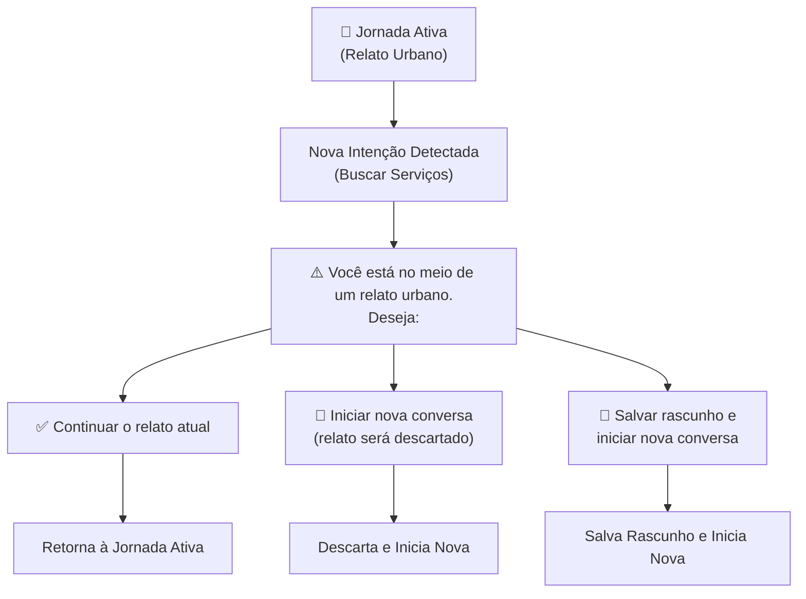

**Exemplo:**

```
👤 Cidadão: [no meio de um relato urbano]
"Na verdade, preciso achar uma UBS primeiro"

🤖 Assistente: "Você está no meio de um relato sobre
iluminação pública (já coletamos endereço e categoria).

O que deseja fazer?

[Continuar o relato] [Buscar UBS (salvar rascunho)] [Buscar UBS (descartar relato)]"
[JOURNEY_SWITCH_PROMPT]
```

### 10.5 Tratamento de Erros

| Erro                         | Comportamento         | Mensagem ao Usuário                                              |
| ---------------------------- | --------------------- | ---------------------------------------------------------------- |
| **Intenção não reconhecida** | Oferece opções comuns | "Não entendi bem. Você quer: [opções]?"                          |
| **Dados insuficientes**      | Pergunta específica   | "Para continuar, preciso saber [campo]."                         |
| **Validação falhou**         | Explica e repergunta  | "O endereço parece incompleto. Pode incluir o número?"           |
| **Erro de API externa**      | Retry + fallback      | "Estou com dificuldades técnicas. Tente novamente em instantes." |
| **Limite de contexto**       | Resumo automático     | Contexto é resumido preservando dados essenciais                 |

### 10.6 Marcadores de Sincronização

O orquestrador injeta marcadores invisíveis para sincronizar o frontend:

| Marcador                     | Função                           |
| ---------------------------- | -------------------------------- |
| `[FIELD_REQUEST:campo]`      | Indica campo sendo solicitado    |
| `[COLLECTION_PROGRESS:json]` | Estado atual da coleta           |
| `[JOURNEY_SWITCH_PROMPT]`    | Oferece opções de transição      |
| `[URBAN_CREATED:id]`         | Relato urbano criado com sucesso |
| `[TRANSPORT_CREATED:id]`     | Relato de transporte criado      |
| `[RATING_CREATED:id]`        | Avaliação registrada             |

---

## 11. Jornadas do Usuário

### 11.1 Jornada: Primeiro Acesso

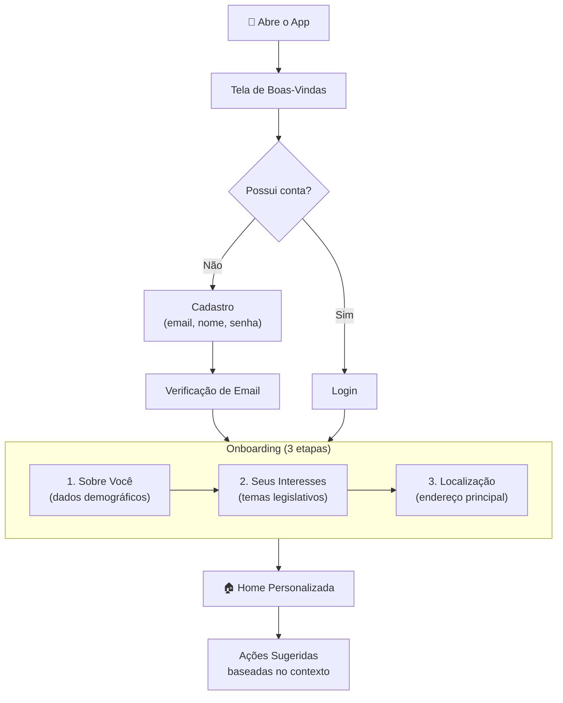

**Descrição Detalhada:**

| Etapa             | Ação do Usuário                | Resposta do Sistema                       | Sentimento |
| ----------------- | ------------------------------ | ----------------------------------------- | ---------- |
| 1. Abre app       | Toca no ícone                  | Exibe tela de boas-vindas com benefícios  | Curioso    |
| 2. Cadastro       | Preenche email e senha         | Valida dados e envia email de confirmação | Neutro     |
| 3. Verifica email | Clica no link recebido         | Confirma e redireciona para app           | Satisfeito |
| 4. Dados pessoais | Informa nome, data nascimento  | Salva e avança (passo opcional)           | Neutro     |
| 5. Interesses     | Seleciona temas                | Personaliza feed de conteúdo              | Engajado   |
| 6. Localização    | Permite GPS ou digita endereço | Configura notificações locais             | Confiante  |
| 7. Conclusão      | Visualiza home                 | Exibe tutorial rápido e sugestões         | Empolgado  |

### 11.2 Jornada: Reportar Problema Urbano

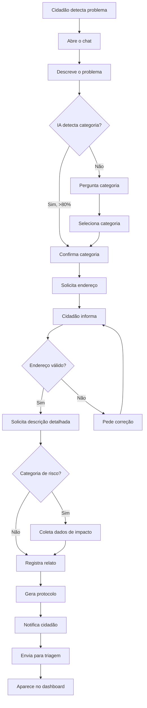

**Descrição Detalhada:**

| Etapa            | Ação do Usuário             | Resposta do Sistema            | Tempo Médio |
| ---------------- | --------------------------- | ------------------------------ | ----------- |
| 1. Inicia relato | "Tem um buraco enorme aqui" | Detecta categoria: via_publica | 2s          |
| 2. Confirma      | Aceita sugestão             | Pergunta endereço              | 1s          |
| 3. Endereço      | "Rua X, 123, Bairro Y"      | Geocodifica e valida           | 3s          |
| 4. Descrição     | Detalha o problema          | Valida mín. 30 chars           | 30s         |
| 5. Impacto       | Responde sobre riscos       | Classifica prioridade          | 15s         |
| 6. Confirmação   | Revisa resumo               | Registra e gera protocolo      | 2s          |
| **Total**        |                             |                                | **~1 min**  |

### 11.3 Jornada: Avaliar Serviço Público

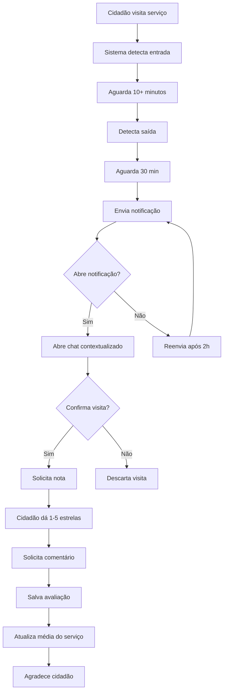

**Descrição Detalhada:**

| Etapa                | Ação do Usuário     | Resposta do Sistema              | Sentimento    |
| -------------------- | ------------------- | -------------------------------- | ------------- |
| 1. Visita serviço    | Permanece 10+ min   | Registra visita potencial        | Ocupado       |
| 2. Sai do local      | Move-se para fora   | Prepara solicitação de avaliação | Neutro        |
| 3. Recebe push       | Vê notificação      | "Como foi sua visita à UBS X?"   | Surpreso      |
| 4. Abre chat         | Toca na notificação | Exibe pergunta contextualizada   | Engajado      |
| 5. Avalia            | Dá nota e comenta   | Registra e agradece              | Participativo |
| 6. Visualiza impacto | Vê mensagem final   | Mostra como ajuda outros         | Satisfeito    |

### 11.4 Jornada: Participar de Audiência Pública

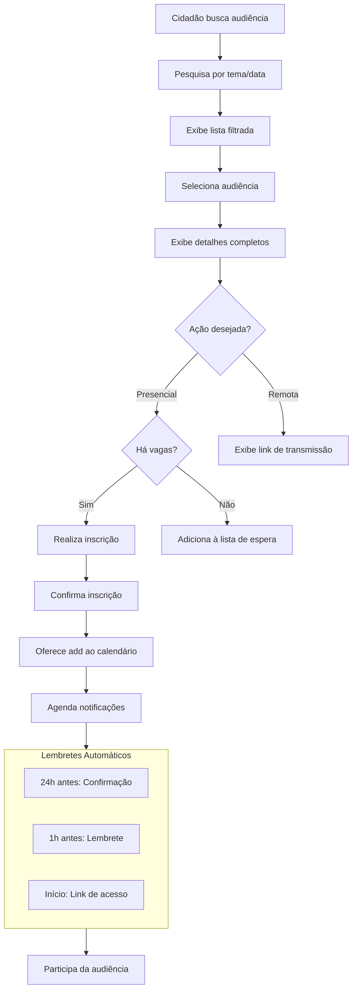

**Descrição Detalhada:**

| Etapa        | Ação do Usuário               | Resposta do Sistema         | Tempo |
| ------------ | ----------------------------- | --------------------------- | ----- |
| 1. Busca     | "audiências sobre transporte" | Lista audiências filtradas  | 3s    |
| 2. Seleciona | Toca em audiência             | Exibe detalhes + documentos | 2s    |
| 3. Inscreve  | Toca "Participar"             | Valida vagas e registra     | 2s    |
| 4. Confirma  | Visualiza confirmação         | Oferece add ao calendário   | 1s    |
| 5. Lembrete  | Recebe notificação            | 24h e 1h antes              | -     |
| 6. Participa | Acessa link/comparece         | Registra participação       | -     |

---

## 12. Especificação de Dados por Tipo de Manifestação

### 12.1 Relato Urbano

#### 12.1.1 Modelo de Dados

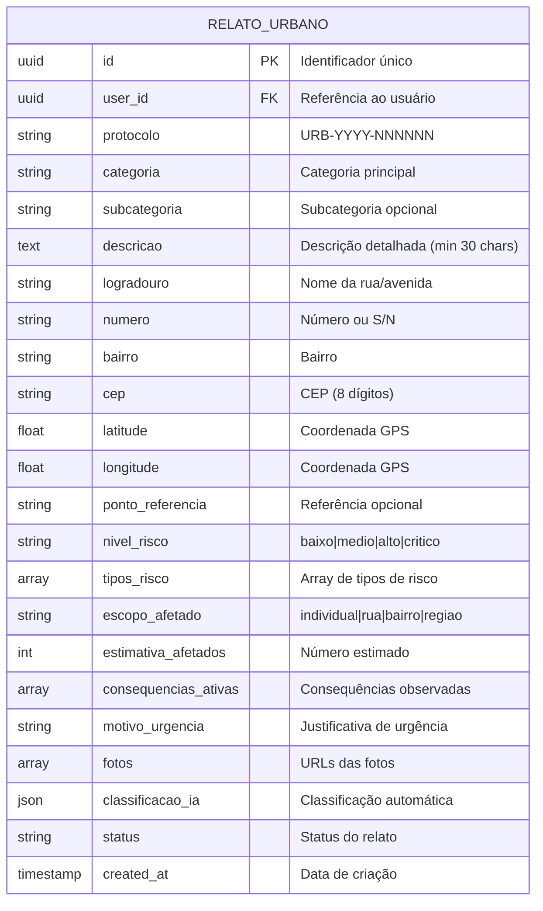

#### 12.1.2 Especificação de Campos

| Campo                    | Tipo    | Obrigatório | Regra de Coleta                     | Validação                        |
| ------------------------ | ------- | ----------- | ----------------------------------- | -------------------------------- |
| **categoria**            | Enum    | Sim         | Inferida da descrição ou perguntada | Lista fixa de categorias         |
| **descricao**            | Text    | Sim         | Pergunta direta                     | Mínimo 30 caracteres             |
| **logradouro**           | String  | Sim         | Pergunta ou Google Places           | Deve existir em SP               |
| **numero**               | String  | Sim\*       | Pergunta após logradouro            | Aceita "S/N" ou ponto_referencia |
| **bairro**               | String  | Sim         | Inferido do endereço ou perguntado  | Deve existir em SP               |
| **cep**                  | String  | Sim         | Inferido via geocoding              | 8 dígitos válidos                |
| **latitude/longitude**   | Float   | Sim         | Via geocoding ou GPS                | Dentro de SP                     |
| **ponto_referencia**     | String  | Não\*       | Alternativa ao número               | Mínimo 5 caracteres              |
| **nivel_risco**          | Enum    | Condicional | Perguntado se categoria de risco    | baixo/medio/alto/critico         |
| **tipos_risco**          | Array   | Condicional | Perguntado se nivel_risco > baixo   | Lista fixa                       |
| **escopo_afetado**       | Enum    | Condicional | Perguntado para alto impacto        | individual/rua/bairro/regiao     |
| **estimativa_afetados**  | Integer | Condicional | Perguntado se escopo > individual   | Número > 0                       |
| **consequencias_ativas** | Array   | Condicional | Perguntado para categorias de risco | Lista fixa                       |
| **motivo_urgencia**      | Text    | Condicional | Perguntado se nivel_risco = critico | Mínimo 10 caracteres             |
| **fotos**                | Array   | Não         | Anexo opcional                      | Máx 5, até 5MB cada              |

\*Número é obrigatório, mas aceita ponto_referencia como alternativa.

#### 12.1.3 Categorias e Subcategorias

| Categoria           | Subcategorias                                     | Campos Adicionais             |
| ------------------- | ------------------------------------------------- | ----------------------------- |
| **via_publica**     | buraco, calçada_danificada, pavimentação          | nivel_risco, tipos_risco      |
| **iluminacao**      | poste_apagado, poste_danificado, falta_iluminacao | nivel_risco, tipos_risco      |
| **limpeza_urbana**  | lixo_acumulado, entulho, descarte_irregular       | escopo_afetado                |
| **esgoto**          | vazamento, bueiro_entupido, mau_cheiro            | nivel_risco, tipos_risco      |
| **area_verde**      | poda_arvore, arvore_caida, mato_alto              | nivel_risco (se arvore_caida) |
| **sinalizacao**     | placa_danificada, semaforo, faixa_apagada         | nivel_risco                   |
| **acessibilidade**  | rampa_faltando, obstrucao, piso_tatil             | escopo_afetado                |
| **animais**         | animal_morto, infestacao, abandono                | nivel_risco (se infestação)   |
| **poluicao**        | sonora, visual, ambiental                         | escopo_afetado                |
| **feedback_camara** | elogio, sugestao, reclamacao                      | -                             |

#### 12.1.4 Regras de Inferência

| Dado                   | Fonte de Inferência | Condição                       | Ação                    |
| ---------------------- | ------------------- | ------------------------------ | ----------------------- |
| **categoria**          | Texto da descrição  | Confiança > 80%                | Confirma com usuário    |
| **categoria**          | Texto da descrição  | Confiança < 80%                | Pergunta explicitamente |
| **bairro**             | Google Geocoding    | Endereço válido                | Extrai do resultado     |
| **cep**                | Google Geocoding    | Endereço válido                | Extrai do resultado     |
| **latitude/longitude** | Google Geocoding    | Endereço válido                | Extrai do resultado     |
| **nivel_risco**        | Palavras-chave      | "perigo", "urgente", "risco"   | Sugere "alto"           |
| **escopo_afetado**     | Descrição           | "toda a rua", "bairro inteiro" | Infere escopo           |

#### 12.1.5 Regras de Negócio

| Código     | Regra                                                                                            |
| ---------- | ------------------------------------------------------------------------------------------------ |
| RN-URB-001 | Descrição deve ter no mínimo 30 caracteres                                                       |
| RN-URB-002 | Endereço deve estar dentro do município de São Paulo                                             |
| RN-URB-003 | Campos de impacto são obrigatórios para categorias: via_publica, iluminacao, esgoto, sinalizacao |
| RN-URB-004 | Protocolo gerado automaticamente no formato URB-YYYY-NNNNNN                                      |
| RN-URB-005 | Fotos devem ter no máximo 5MB cada, formatos: JPG, PNG, HEIC                                     |
| RN-URB-006 | Relatos duplicados (mesmo endereço + categoria em 7 dias) geram alerta                           |
| RN-URB-007 | Relatos de nivel_risco "critico" entram em fila prioritária                                      |

### 12.2 Relato de Transporte

#### 12.2.1 Modelo de Dados

```mermaid
erDiagram
    RELATO_TRANSPORTE {
        uuid id PK "Identificador único"
        uuid user_id FK "Referência ao usuário"
        uuid linha_id FK "Linha de transporte"
        string protocolo "TRP-YYYY-NNNNNN"
        string tipo_relato "Tipo do problema"
        text descricao "Descrição (min 20 chars)"
        string severidade "leve|moderado|grave|critico"
        date data_ocorrencia "Data do ocorrido"
        time hora_ocorrencia "Hora aproximada"
        string localizacao "Local específico"
        string impacto "Impacto pessoal"
        string sentimento_ia "Análise de sentimento"
        string categoria_ia "Categoria inferida"
        boolean padrao_detectado "Padrão identificado"
        string status "Status do relato"
        timestamp created_at "Data de criação"
    }

    LINHA_TRANSPORTE {
        uuid id PK
        string codigo "875A, Linha 4, etc"
        string nome "Nome da linha"
        string tipo "onibus|metro|trem|vlt"
        array regioes "Regiões atendidas"
    }

    RELATO_TRANSPORTE }|--o| LINHA_TRANSPORTE : "referencia"
```

#### 12.2.2 Especificação de Campos

| Campo               | Tipo   | Obrigatório | Regra de Coleta              | Validação                   |
| ------------------- | ------ | ----------- | ---------------------------- | --------------------------- |
| **tipo_relato**     | Enum   | Sim         | Inferido da descrição        | Lista fixa                  |
| **descricao**       | Text   | Sim         | Pergunta direta              | Mínimo 20 caracteres        |
| **linha_id**        | UUID   | Condicional | Pergunta se tipo requer      | Linha deve existir          |
| **data_ocorrencia** | Date   | Sim         | Inferida ou perguntada       | Não pode ser futura         |
| **hora_ocorrencia** | Time   | Não         | Inferida se mencionada       | Formato HH:mm               |
| **severidade**      | Enum   | Sim         | Perguntada                   | leve/moderado/grave/critico |
| **localizacao**     | String | Não         | Perguntada para alguns tipos | Texto livre                 |
| **impacto**         | Text   | Não         | Perguntado ao final          | Texto livre                 |

#### 12.2.3 Tipos de Relato

| Tipo               | Descrição                     | Requer Linha | Campos Específicos |
| ------------------ | ----------------------------- | ------------ | ------------------ |
| **atraso**         | Atraso no serviço             | Sim          | hora_ocorrencia    |
| **superlotacao**   | Veículo lotado                | Sim          | hora_ocorrencia    |
| **falta_veiculo**  | Veículo não passou            | Sim          | hora_ocorrencia    |
| **manutencao**     | Veículo em más condições      | Sim          | -                  |
| **acessibilidade** | Falta de acessibilidade       | Sim          | localizacao        |
| **seguranca**      | Problema de segurança         | Condicional  | localizacao        |
| **assedio**        | Assédio ou importunação       | Não          | localizacao        |
| **limpeza**        | Falta de limpeza              | Sim          | -                  |
| **informacao**     | Informação incorreta/faltante | Condicional  | localizacao        |
| **outro**          | Outros problemas              | Condicional  | -                  |

#### 12.2.4 Regras de Inferência

| Dado                | Fonte de Inferência | Condição                   | Ação               |
| ------------------- | ------------------- | -------------------------- | ------------------ |
| **tipo_relato**     | Texto da descrição  | Palavras-chave             | Infere tipo        |
| **data_ocorrencia** | Texto               | "hoje", "ontem", "segunda" | Converte para data |
| **hora_ocorrencia** | Texto               | "de manhã", "às 7h"        | Converte para hora |
| **severidade**      | Descrição + tipo    | Palavras como "perigo"     | Sugere severidade  |
| **linha_id**        | Texto               | "875A", "linha 4"          | Busca no banco     |

**Exemplos de Inferência de Data:**

| Entrada          | Inferência                                     |
| ---------------- | ---------------------------------------------- |
| "hoje"           | Data atual                                     |
| "ontem"          | Data atual - 1 dia                             |
| "segunda-feira"  | Última segunda-feira                           |
| "semana passada" | Pergunta dia específico                        |
| "dia 25"         | Dia 25 do mês atual (ou anterior se já passou) |
| "25/12"          | 25 de dezembro do ano atual                    |

#### 12.2.5 Regras de Negócio

| Código     | Regra                                                          |
| ---------- | -------------------------------------------------------------- |
| RN-TRP-001 | Descrição deve ter no mínimo 20 caracteres                     |
| RN-TRP-002 | Data de ocorrência não pode ser futura                         |
| RN-TRP-003 | Data de ocorrência não pode ser anterior a 30 dias             |
| RN-TRP-004 | Protocolo gerado no formato TRP-YYYY-NNNNNN                    |
| RN-TRP-005 | Relatos de segurança/assédio têm prioridade máxima             |
| RN-TRP-006 | Sistema detecta padrão se 3+ relatos similares em 7 dias       |
| RN-TRP-007 | IA não pode inferir data como "hoje" sem confirmação explícita |

### 12.3 Avaliação de Serviço

#### 12.3.1 Modelo de Dados

```mermaid
erDiagram
    AVALIACAO_SERVICO {
        uuid id PK "Identificador único"
        uuid user_id FK "Referência ao usuário"
        uuid servico_id FK "Serviço avaliado"
        uuid visita_id FK "Visita que originou"
        int nota "1 a 5 estrelas"
        text texto "Comentário opcional"
        string sentimento "positivo|neutro|negativo"
        boolean anonima "Avaliação anônima"
        int tempo_espera_minutos "Tempo de espera"
        array aspectos_positivos "Aspectos elogiados"
        array aspectos_negativos "Aspectos criticados"
        timestamp created_at "Data de criação"
    }

    SERVICO_PUBLICO {
        uuid id PK
        string nome "Nome do serviço"
        string tipo "ubs|escola|ceu|hospital|biblioteca"
        string endereco "Endereço completo"
        float latitude
        float longitude
        json horario_funcionamento
        float media_avaliacoes "Média das notas"
        int total_avaliacoes "Total de avaliações"
    }

    VISITA {
        uuid id PK
        uuid user_id FK
        uuid servico_id FK
        timestamp detectada_em "Quando detectou entrada"
        timestamp visitada_em "Quando saiu"
        timestamp expira_em "Prazo para avaliar"
        string status "pending|completed|expired|skipped"
    }

    AVALIACAO_SERVICO }|--|| SERVICO_PUBLICO : "avalia"
    AVALIACAO_SERVICO }|--|| VISITA : "origina_de"
    VISITA }|--|| SERVICO_PUBLICO : "visita"
```

#### 12.3.2 Especificação de Campos

| Campo                    | Tipo    | Obrigatório | Regra de Coleta        | Validação             |
| ------------------------ | ------- | ----------- | ---------------------- | --------------------- |
| **servico_id**           | UUID    | Sim         | Detectado por geofence | Serviço deve existir  |
| **visita_id**            | UUID    | Sim         | Criado automaticamente | Visita válida         |
| **nota**                 | Integer | Sim         | Pergunta direta        | 1 a 5                 |
| **texto**                | Text    | Não         | Pergunta após nota     | Máximo 500 caracteres |
| **anonima**              | Boolean | Não         | Pergunta se nota < 3   | Default: false        |
| **tempo_espera_minutos** | Integer | Não         | Inferido ou perguntado | > 0                   |
| **aspectos_positivos**   | Array   | Não         | Inferido do texto      | Lista fixa            |
| **aspectos_negativos**   | Array   | Não         | Inferido do texto      | Lista fixa            |

#### 12.3.3 Aspectos Avaliáveis

| Aspecto              | Categoria | Descrição                       |
| -------------------- | --------- | ------------------------------- |
| **atendimento**      | Ambos     | Qualidade do atendimento humano |
| **tempo_espera**     | Negativo  | Tempo aguardando                |
| **infraestrutura**   | Ambos     | Condições físicas do local      |
| **limpeza**          | Ambos     | Higiene do ambiente             |
| **acessibilidade**   | Ambos     | Facilidade de acesso            |
| **informacao**       | Ambos     | Clareza das informações         |
| **resolutividade**   | Positivo  | Problema foi resolvido          |
| **profissionalismo** | Positivo  | Competência dos funcionários    |

#### 12.3.4 Regras de Inferência

| Dado             | Fonte de Inferência | Condição           | Ação                  |
| ---------------- | ------------------- | ------------------ | --------------------- |
| **servico_id**   | Geolocalização      | Dentro do geofence | Identifica serviço    |
| **sentimento**   | Nota + texto        | Análise combinada  | Classifica sentimento |
| **aspectos**     | Texto do comentário | Palavras-chave     | Extrai aspectos       |
| **tempo_espera** | Texto               | "esperei 1 hora"   | Converte para minutos |

#### 12.3.5 Regras de Negócio

| Código     | Regra                                                 |
| ---------- | ----------------------------------------------------- |
| RN-AVA-001 | Permanência mínima de 10 minutos para detectar visita |
| RN-AVA-002 | Avaliação válida por 48h após visita                  |
| RN-AVA-003 | Máximo 1 avaliação por serviço por dia por usuário    |
| RN-AVA-004 | Avaliações anônimas não exibem nome do usuário        |
| RN-AVA-005 | Avaliações com nota ≤ 2 oferecem encaminhamento       |
| RN-AVA-006 | Média do serviço recalculada a cada nova avaliação    |
| RN-AVA-007 | Notificação de avaliação reenviada no máximo 2 vezes  |

### 12.4 Tabela Comparativa

| Aspecto                   | Relato Urbano     | Relato Transporte | Avaliação Serviço |
| ------------------------- | ----------------- | ----------------- | ----------------- |
| **Gatilho**               | Conversa iniciada | Conversa iniciada | Geolocalização    |
| **Campos Obrigatórios**   | 6-10              | 4-5               | 2-3               |
| **Geolocalização**        | Obrigatória       | Opcional          | Automática        |
| **Protocolo**             | URB-YYYY-NNNNNN   | TRP-YYYY-NNNNNN   | Não tem           |
| **Análise de Sentimento** | Não               | Sim               | Sim               |
| **Detecção de Padrão**    | Por endereço      | Por linha         | Por serviço       |
| **Encaminhamento**        | Sim               | Sim               | Opcional          |
| **Anonimato**             | Não               | Não               | Opcional          |

---

## 13. Requisitos Não-Funcionais

### 13.1 Performance

| Requisito       | Especificação                                                   | Prioridade |
| --------------- | --------------------------------------------------------------- | ---------- |
| **RNF-PER-001** | Tempo de resposta da API < 500ms (p95)                          | Alta       |
| **RNF-PER-002** | Tempo de resposta da IA < 3s para primeira resposta (streaming) | Alta       |
| **RNF-PER-003** | Carregamento inicial do app < 3s em 4G                          | Alta       |
| **RNF-PER-004** | Renderização de mapa < 2s                                       | Média      |
| **RNF-PER-005** | Geocodificação < 1s                                             | Média      |

### 13.2 Disponibilidade e Resiliência

| Requisito       | Especificação                                             | Prioridade |
| --------------- | --------------------------------------------------------- | ---------- |
| **RNF-DIS-001** | Disponibilidade de 99.5% (exceto manutenções programadas) | Alta       |
| **RNF-DIS-002** | RPO (Recovery Point Objective) < 1 hora                   | Alta       |
| **RNF-DIS-003** | RTO (Recovery Time Objective) < 4 horas                   | Alta       |
| **RNF-DIS-004** | Degradação graciosa em caso de falha de serviços externos | Média      |
| **RNF-DIS-005** | Modo offline com sincronização posterior                  | Média      |

### 13.3 Escalabilidade

| Requisito       | Especificação                               | Prioridade |
| --------------- | ------------------------------------------- | ---------- |
| **RNF-ESC-001** | Suportar 10.000 usuários simultâneos        | Alta       |
| **RNF-ESC-002** | Auto-scaling de pods baseado em CPU/memória | Alta       |
| **RNF-ESC-003** | Banco de dados com read replicas            | Média      |
| **RNF-ESC-004** | Cache distribuído para dados frequentes     | Média      |

### 13.4 Segurança

| Requisito       | Especificação                                         | Prioridade |
| --------------- | ----------------------------------------------------- | ---------- |
| **RNF-SEG-001** | Autenticação via OAuth2/OIDC                          | Alta       |
| **RNF-SEG-002** | Comunicação exclusivamente via HTTPS/TLS 1.3          | Alta       |
| **RNF-SEG-003** | Dados sensíveis criptografados em repouso             | Alta       |
| **RNF-SEG-004** | Rate limiting por IP e por usuário                    | Alta       |
| **RNF-SEG-005** | Logs de auditoria para todas as ações administrativas | Alta       |

### 13.5 Usabilidade e Acessibilidade

| Requisito       | Especificação                                    | Prioridade |
| --------------- | ------------------------------------------------ | ---------- |
| **RNF-USA-001** | Conformidade com WCAG 2.1 nível AA               | Alta       |
| **RNF-USA-002** | Suporte a leitores de tela (VoiceOver, TalkBack) | Alta       |
| **RNF-USA-003** | Ajuste de tamanho de fonte (3 níveis)            | Alta       |
| **RNF-USA-004** | Contraste mínimo 4.5:1 para texto                | Alta       |
| **RNF-USA-005** | Navegação completa por teclado/gestos            | Média      |

### 13.6 Compatibilidade

| Requisito       | Especificação                   | Prioridade |
| --------------- | ------------------------------- | ---------- |
| **RNF-COM-001** | iOS 14+ e Android 8+            | Alta       |
| **RNF-COM-002** | Telas de 4.7" a 12.9"           | Alta       |
| **RNF-COM-003** | Conexões 3G, 4G, 5G e Wi-Fi     | Alta       |
| **RNF-COM-004** | Orientação portrait e landscape | Média      |

### 13.7 Observabilidade

| Requisito       | Especificação                          | Prioridade |
| --------------- | -------------------------------------- | ---------- |
| **RNF-OBS-001** | Logs estruturados (JSON) centralizados | Alta       |
| **RNF-OBS-002** | Métricas de negócio em tempo real      | Alta       |
| **RNF-OBS-003** | Tracing distribuído para debugging     | Média      |
| **RNF-OBS-004** | Alertas automáticos para anomalias     | Alta       |
| **RNF-OBS-005** | Dashboards de saúde do sistema         | Alta       |

---

## 14. Requisitos de Segurança e LGPD

### 14.1 Classificação de Dados

| Classificação       | Exemplos                                      | Tratamento                            |
| ------------------- | --------------------------------------------- | ------------------------------------- |
| **Público**         | Notícias, vereadores, audiências              | Cache agressivo, CDN                  |
| **Interno**         | Estatísticas agregadas, padrões               | Acesso autenticado                    |
| **Confidencial**    | Email, telefone, endereço                     | Criptografia, RLS                     |
| **Sensível (LGPD)** | Dados demográficos, localização em tempo real | Consentimento explícito, anonimização |

### 14.2 Conformidade LGPD

#### 14.2.1 Base Legal para Tratamento

| Dado               | Base Legal           | Finalidade                              |
| ------------------ | -------------------- | --------------------------------------- |
| Email, Nome        | Execução de contrato | Identificação e comunicação             |
| Localização        | Consentimento        | Serviços próximos, avaliação automática |
| Dados demográficos | Consentimento        | Personalização, estatísticas            |
| Histórico de uso   | Legítimo interesse   | Melhoria do serviço                     |

#### 14.2.2 Direitos do Titular

| Direito           | Implementação                      |
| ----------------- | ---------------------------------- |
| **Acesso**        | Exportação de dados via perfil     |
| **Retificação**   | Edição de dados pessoais           |
| **Eliminação**    | Exclusão de conta com anonimização |
| **Portabilidade** | Exportação em JSON/CSV             |
| **Revogação**     | Gestão de consentimentos           |

#### 14.2.3 Medidas Técnicas

| Medida                       | Descrição                                    |
| ---------------------------- | -------------------------------------------- |
| **Criptografia em trânsito** | TLS 1.3 obrigatório                          |
| **Criptografia em repouso**  | AES-256 para dados sensíveis                 |
| **Pseudonimização**          | IDs internos desvinculados de dados pessoais |
| **Minimização**              | Coleta apenas de dados necessários           |
| **Retenção limitada**        | Políticas de expiração automática            |

### 14.3 Política de Retenção

| Tipo de Dado                   | Período de Retenção  | Após Expiração           |
| ------------------------------ | -------------------- | ------------------------ |
| Logs de acesso                 | 90 dias              | Exclusão automática      |
| Conversas de chat              | 1 ano                | Anonimização             |
| Manifestações                  | 5 anos               | Anonimização             |
| Avaliações                     | 3 anos               | Anonimização             |
| Dados de localização           | 30 dias              | Exclusão automática      |
| Dados pessoais (conta ativa)   | Enquanto conta ativa | -                        |
| Dados pessoais (conta inativa) | 2 anos               | Exclusão ou anonimização |

### 14.4 Controles de Segurança

```mermaid
flowchart TB
    subgraph Perimetro["🛡️ Perímetro"]
        WAF["AWS WAF<br/>Proteção L7"]
        DDoS["AWS Shield<br/>Proteção DDoS"]
        CDN["CloudFront<br/>Edge Security"]
    end

    subgraph Rede["🔒 Rede"]
        VPC["VPC Isolada"]
        SG["Security Groups"]
        NACL["Network ACLs"]
        PrivateLink["AWS PrivateLink"]
    end

    subgraph Aplicacao["🔐 Aplicação"]
        Auth["Keycloak/Cognito<br/>OAuth2 + MFA"]
        RLS["Row Level Security<br/>PostgreSQL"]
        Encryption["Criptografia<br/>AES-256"]
    end

    subgraph Monitoramento["👁️ Monitoramento"]
        Audit["Audit Logs"]
        SIEM["CloudWatch Logs"]
        Alerts["Alertas de Segurança"]
    end

    Perimetro --> Rede --> Aplicacao
    Aplicacao --> Monitoramento
```

---

## 15. Regras de Negócio

### 15.1 Manifestações

| Código     | Regra                                                                         |
| ---------- | ----------------------------------------------------------------------------- |
| RN-MAN-001 | Toda manifestação deve ter autor identificado (pode ser exibida anonimamente) |
| RN-MAN-002 | Manifestações urbanas requerem geolocalização dentro de São Paulo             |
| RN-MAN-003 | Descrição mínima: 30 caracteres (urbano), 20 caracteres (transporte)          |
| RN-MAN-004 | Protocolo gerado automaticamente no formato TIPO-YYYY-NNNNNN                  |
| RN-MAN-005 | Status inicial sempre "registrado", transições via workflow                   |
| RN-MAN-006 | Manifestação não pode ser editada após 24h da criação                         |
| RN-MAN-007 | Cidadão pode ter máximo 10 manifestações abertas simultaneamente              |

### 15.2 Avaliações

| Código     | Regra                                                            |
| ---------- | ---------------------------------------------------------------- |
| RN-AVA-001 | Avaliação requer visita detectada (permanência mínima 10 min)    |
| RN-AVA-002 | Prazo para avaliar: 48h após saída do local                      |
| RN-AVA-003 | Máximo 1 avaliação por serviço por dia por usuário               |
| RN-AVA-004 | Nota ≤ 2 oferece opção de encaminhamento                         |
| RN-AVA-005 | Avaliação anônima oculta nome mas mantém dados para estatísticas |
| RN-AVA-006 | Média do serviço recalculada em tempo real                       |

### 15.3 Audiências

| Código     | Regra                                                 |
| ---------- | ----------------------------------------------------- |
| RN-AUD-001 | Inscrição presencial encerra 24h antes do evento      |
| RN-AUD-002 | Cidadão pode ter máximo 3 inscrições ativas           |
| RN-AUD-003 | Cancelamento de inscrição libera vaga automaticamente |
| RN-AUD-004 | Notificações enviadas: 24h antes, 1h antes, no início |
| RN-AUD-005 | Participação remota não tem limite de vagas           |

### 15.4 Assistente de IA

| Código    | Regra                                                    |
| --------- | -------------------------------------------------------- |
| RN-IA-001 | Respostas devem citar fonte quando usando RAG            |
| RN-IA-002 | IA não pode inventar dados sobre vereadores ou projetos  |
| RN-IA-003 | Coleta de dados usa perguntas atômicas (1 campo por vez) |
| RN-IA-004 | Mudança de jornada requer confirmação do usuário         |
| RN-IA-005 | Contexto de conversa mantido por 24h de inatividade      |
| RN-IA-006 | Limite de 50 mensagens por conversa                      |

### 15.5 Notificações

| Código     | Regra                                                  |
| ---------- | ------------------------------------------------------ |
| RN-NOT-001 | Respeitar horário de silêncio configurado pelo usuário |
| RN-NOT-002 | Máximo 10 notificações por dia por usuário             |
| RN-NOT-003 | Notificações críticas ignoram limite e horário         |
| RN-NOT-004 | Preferências de canal respeitadas (push, email, SMS)   |

### 15.6 Encaminhamentos

| Código     | Regra                                                         |
| ---------- | ------------------------------------------------------------- |
| RN-ENC-001 | Encaminhamento vai para comissões, não vereadores individuais |
| RN-ENC-002 | Score de match mínimo de 0.5 para sugestão automática         |
| RN-ENC-003 | Cidadão pode escolher comissão diferente da sugerida          |
| RN-ENC-004 | Prazo padrão de resposta: 30 dias                             |
| RN-ENC-005 | Encaminhamento sem resposta em 30 dias gera alerta            |

---

## 16. Estados e Ciclos de Vida

### 16.1 Ciclo de Vida: Relato Urbano

```mermaid
stateDiagram-v2
    [*] --> Registrado: Cidadão submete
    Registrado --> EmTriagem: N8N processa
    EmTriagem --> EmAnalise: Gestor assume
    EmTriagem --> Duplicado: Duplicata detectada
    EmAnalise --> EmAtendimento: Ação iniciada
    EmAnalise --> Improcedente: Fora do escopo
    EmAtendimento --> Resolvido: Problema corrigido
    EmAtendimento --> NaoResolvido: Não foi possível
    Resolvido --> [*]
    NaoResolvido --> [*]
    Duplicado --> [*]
    Improcedente --> [*]

    note right of Registrado
        Protocolo gerado
        N8N notificado
    end note

    note right of EmTriagem
        Prioridade definida
        Categoria validada
    end note
```

### 16.2 Ciclo de Vida: Relato de Transporte

```mermaid
stateDiagram-v2
    [*] --> Registrado: Cidadão submete
    Registrado --> EmAnalise: Triagem automática
    EmAnalise --> PadraoIdentificado: 3+ relatos similares
    EmAnalise --> Encaminhado: Enviado para órgão
    PadraoIdentificado --> Encaminhado: Alerta gerado
    Encaminhado --> Respondido: Órgão responde
    Encaminhado --> SemResposta: Prazo expirado
    Respondido --> [*]
    SemResposta --> [*]

    note right of PadraoIdentificado
        Notifica inscritos
        Gera alerta no dashboard
    end note
```

### 16.3 Ciclo de Vida: Avaliação de Serviço

```mermaid
stateDiagram-v2
    [*] --> VisitaDetectada: Geofence ativado
    VisitaDetectada --> AguardandoAvaliacao: Saída detectada
    AguardandoAvaliacao --> Avaliada: Cidadão avalia
    AguardandoAvaliacao --> Expirada: 48h sem resposta
    AguardandoAvaliacao --> Ignorada: Cidadão recusa
    Avaliada --> Processada: Sentimento analisado
    Processada --> Encaminhada: Nota menor ou igual 2
    Processada --> Concluida: Nota maior que 2
    Encaminhada --> Concluida: Resposta recebida
    Concluida --> [*]
    Expirada --> [*]
    Ignorada --> [*]

    note right of AguardandoAvaliacao
        Notificação enviada
        Máx. 2 lembretes
    end note
```

### 16.4 Ciclo de Vida: Encaminhamento

```mermaid
stateDiagram-v2
    [*] --> Criado: Cidadão solicita
    Criado --> Enviado: Sistema envia
    Enviado --> Visualizado: Destinatário abre
    Enviado --> Expirado: 30 dias sem resposta
    Visualizado --> EmAnalise: Destinatário analisa
    EmAnalise --> Respondido: Resposta enviada
    EmAnalise --> Encaminhado: Redireciona
    Respondido --> Concluido: Cidadão satisfeito
    Respondido --> Reaberto: Cidadão contesta
    Encaminhado --> Enviado: Novo destinatário
    Reaberto --> EmAnalise
    Concluido --> [*]
    Expirado --> [*]

    note right of Expirado
        Gera alerta
        Notifica cidadão
    end note
```

### 16.5 Ciclo de Vida: Inscrição em Audiência

```mermaid
stateDiagram-v2
    [*] --> Solicitada: Cidadão solicita
    Solicitada --> Confirmada: Vaga disponível
    Solicitada --> ListaEspera: Sem vagas
    ListaEspera --> Confirmada: Vaga liberada
    Confirmada --> Participou: Check-in realizado
    Confirmada --> NaoCompareceu: Não fez check-in
    Confirmada --> Cancelada: Cidadão cancela
    ListaEspera --> Expirada: Evento ocorreu
    Participou --> [*]
    NaoCompareceu --> [*]
    Cancelada --> [*]
    Expirada --> [*]

    note right of Confirmada
        Notificações agendadas
        24h e 1h antes
    end note
```

---

## 17. Fluxos de Integração

### 17.1 Estratégia de Integração

| Sistema Externo | Tipo      | Protocolo | Frequência     |
| --------------- | --------- | --------- | -------------- |
| Portal CMSP     | Pull      | REST/RSS  | 15 minutos     |
| SP Legis API    | Pull      | REST      | Diário         |
| Google Maps     | On-demand | REST      | Por requisição |
| Google Places   | On-demand | REST      | Por requisição |
| Firebase FCM    | Push      | REST      | Por evento     |
| N8N             | Webhook   | REST      | Por evento     |

### 17.2 Fluxo: Processamento de Manifestação via N8N

```mermaid
sequenceDiagram
    autonumber
    participant App as 📱 App
    participant API as ⚙️ Backend API
    participant DB as 💾 PostgreSQL
    participant N8N as ⚡ N8N Workflow
    participant Gestor as 👔 Dashboard Gestor

    App->>API: POST /manifestacoes
    API->>DB: INSERT manifestacao
    DB-->>API: ID + Protocolo
    API->>N8N: POST /webhook/nova-manifestacao
    Note over N8N: Processa:<br/>1. Valida categoria<br/>2. Define prioridade<br/>3. Extrai entidades<br/>4. Verifica duplicatas
    N8N->>API: POST /callback/n8n
    API->>DB: UPDATE manifestacao (n8n_data)
    API-->>App: 200 OK + Protocolo

    alt Prioridade Alta
        N8N->>Gestor: Notificação push
    end

    Gestor->>API: GET /manifestacoes
    API->>DB: SELECT (com filtros)
    DB-->>API: Lista de manifestações
    API-->>Gestor: Manifestações com dados N8N
```

### 17.3 Fluxo: Busca de Serviços Próximos

```mermaid
sequenceDiagram
    autonumber
    participant App as 📱 App
    participant API as ⚙️ Backend API
    participant Cache as 🗄️ Redis
    participant DB as 💾 PostgreSQL
    participant Google as 🗺️ Google Places

    App->>API: GET /servicos?lat=X&lng=Y&tipo=ubs
    API->>Cache: GET servicos:ubs:X:Y

    alt Cache Hit
        Cache-->>API: Dados cacheados
    else Cache Miss
        API->>DB: SELECT com PostGIS (ST_DWithin)
        DB-->>API: Serviços no raio

        loop Para cada serviço sem detalhes
            API->>Google: GET /place/details
            Google-->>API: Detalhes atualizados
            API->>DB: UPDATE servico
        end

        API->>Cache: SET servicos:ubs:X:Y (TTL 5min)
    end

    API-->>App: Lista de serviços ordenada
```

### 17.4 Fluxo: Autenticação e Autorização

```mermaid
sequenceDiagram
    autonumber
    participant App as 📱 App
    participant API as ⚙️ Backend API
    participant Auth as 🔐 Keycloak
    participant DB as 💾 PostgreSQL

    App->>Auth: POST /auth/token (email, senha)
    Auth->>Auth: Valida credenciais
    Auth-->>App: Access Token + Refresh Token

    App->>API: GET /api/me (Bearer Token)
    API->>Auth: Valida token
    Auth-->>API: Token válido + Claims
    API->>DB: SELECT perfil WHERE user_id
    DB-->>API: Dados do perfil + roles
    API-->>App: Perfil completo

    Note over App,Auth: Token expira em 15min

    App->>Auth: POST /auth/refresh (Refresh Token)
    Auth-->>App: Novo Access Token
```

### 17.5 Fluxo: Sincronização de Dados Externos

```mermaid
sequenceDiagram
    autonumber
    participant Cron as ⏰ Kubernetes CronJob
    participant API as ⚙️ Backend API
    participant Portal as 🏛️ Portal CMSP
    participant SPLegis as 📜 SP Legis
    participant DB as 💾 PostgreSQL
    participant RAG as 🧠 RAG Pipeline

    Note over Cron: Executa a cada 15 minutos

    Cron->>API: Trigger sync-noticias
    API->>Portal: GET /rss/noticias
    Portal-->>API: Feed RSS
    API->>DB: UPSERT noticias
    API->>RAG: Indexar novos documentos

    Note over Cron: Executa diariamente às 2:00

    Cron->>API: Trigger sync-vereadores
    API->>SPLegis: GET /vereadores
    SPLegis-->>API: Lista atualizada
    API->>DB: UPSERT vereadores
    API->>DB: UPSERT comissoes
    API->>RAG: Re-indexar perfis
```

---

## 18. Cenários de Erro e Contingência

### 18.1 Matriz de Contingência

| Cenário                    | Impacto | Detecção         | Resposta                  | Recuperação                |
| -------------------------- | ------- | ---------------- | ------------------------- | -------------------------- |
| **GPS indisponível**       | Médio   | Timeout 10s      | Solicitar endereço manual | Geocoding por texto        |
| **Sem conexão**            | Alto    | Listener de rede | Ativar modo offline       | Fila local + sync          |
| **API de IA lenta**        | Médio   | Timeout 10s      | Streaming parcial         | Retry com backoff          |
| **API de IA indisponível** | Alto    | Healthcheck      | Mensagem de manutenção    | Fallback para fluxo manual |
| **Banco de dados lento**   | Alto    | Latência > 2s    | Query timeout             | Read replica               |
| **N8N offline**            | Baixo   | Healthcheck      | Fila de eventos           | Reprocessamento            |
| **Google Maps quota**      | Médio   | HTTP 429         | Cache agressivo           | Usar dados cacheados       |
| **FCM indisponível**       | Baixo   | Erro de envio    | Retry exponencial         | Email fallback             |

### 18.2 Modo Offline

```mermaid
flowchart TB
    subgraph Online["🟢 Modo Online"]
        Request["Requisição"]
        API["API Backend"]
        Response["Resposta"]
        Request --> API --> Response
    end

    subgraph Offline["🔴 Modo Offline"]
        LocalRequest["Requisição Local"]
        LocalDB["SQLite Local"]
        Queue["Fila de Sync"]
        LocalRequest --> LocalDB
        LocalRequest --> Queue
    end

    subgraph Sync["🔄 Sincronização"]
        Detect["Detecta conexão"]
        Upload["Upload de pendências"]
        Download["Download de atualizações"]
        Merge["Merge de conflitos"]
        Detect --> Upload --> Download --> Merge
    end

    Online -->|Perda de conexão| Offline
    Offline -->|Conexão restaurada| Sync
    Sync --> Online
```

### 18.3 Funcionalidades Offline

| Funcionalidade                 | Disponível Offline           | Sincronização |
| ------------------------------ | ---------------------------- | ------------- |
| **Ver manifestações próprias** | ✅ Sim                       | Ao reconectar |
| **Criar nova manifestação**    | ✅ Sim (fila local)          | Ao reconectar |
| **Ver serviços favoritos**     | ✅ Sim                       | Cache 24h     |
| **Chat com IA**                | ❌ Não                       | -             |
| **Mapa interativo**            | ⚠️ Parcial (tiles cacheados) | -             |
| **Avaliações pendentes**       | ✅ Sim (notificação local)   | Ao reconectar |
| **Audiências inscritas**       | ✅ Sim                       | Cache 24h     |

---

## 19. Protocolos e Formatos

### 19.1 Formato de Protocolos

| Tipo              | Formato           | Exemplo         |
| ----------------- | ----------------- | --------------- |
| Relato Urbano     | `URB-YYYY-NNNNNN` | URB-2024-001234 |
| Relato Transporte | `TRP-YYYY-NNNNNN` | TRP-2024-005678 |
| Encaminhamento    | `ENC-YYYY-NNNNNN` | ENC-2024-000456 |
| Audiência         | `AUD-YYYY-NNNN`   | AUD-2024-0123   |

### 19.2 Formato de Localização

```json
{
  "latitude": -23.550520,
  "longitude": -46.633308,
  "precisao_metros": 10.5,
  "fonte": "gps|manual|geocoding",
  "endereco": {
    "logradouro": "Viaduto do Chá",
    "numero": "15",
    "complemento": null,
    "bairro": "Centro",
    "cidade": "São Paulo",
    "estado": "SP",
    "cep": "01002-020",
    "ponto_referencia": "Próximo ao Teatro Municipal"
  }
}
```

### 19.3 Formato de Resposta da API

```json
{
  "success": true,
  "data": {
    "id": "uuid",
    "protocolo": "URB-2024-001234",
    "created_at": "2024-12-31T10:30:00Z"
  },
  "meta": {
    "request_id": "uuid",
    "timestamp": "2024-12-31T10:30:00Z"
  }
}
```

### 19.4 Formato de Erro

```json
{
  "success": false,
  "error": {
    "code": "VALIDATION_ERROR",
    "message": "Descrição deve ter no mínimo 30 caracteres",
    "field": "descricao",
    "details": {
      "min_length": 30,
      "current_length": 15
    }
  },
  "meta": {
    "request_id": "uuid",
    "timestamp": "2024-12-31T10:30:00Z"
  }
}
```

### 19.5 Payload do Webhook N8N

```json
{
  "event": "manifestacao.criada",
  "timestamp": "2024-12-31T10:30:00Z",
  "data": {
    "id": "uuid",
    "tipo": "urbano",
    "protocolo": "URB-2024-001234",
    "categoria": "iluminacao",
    "descricao": "Poste apagado há mais de uma semana...",
    "localizacao": {
      "latitude": -23.550520,
      "longitude": -46.633308,
      "bairro": "Consolação",
      "cep": "01310-100"
    },
    "usuario": {
      "id": "uuid",
      "nome": "Maria Silva"
    }
  },
  "callback_url": "https://api.camaranamao.sp.gov.br/webhooks/n8n/callback"
}
```

---

## 20. Matriz de Rastreabilidade

### 20.1 Casos de Uso x Ferramentas de IA

| Caso de Uso                      | Ferramentas Utilizadas                              |
| -------------------------------- | --------------------------------------------------- |
| CSU001 - Acolhimento Digital     | `detect_user_intent`, `consultar_base_conhecimento` |
| CSU002 - Audiências              | `buscar_audiencias`, `consultar_historico`          |
| CSU003 - Navegação Institucional | `consultar_base_conhecimento`                       |
| CSU004 - Avaliação de Serviços   | `criar_avaliacao_servico`                           |
| CSU005 - Diagnóstico Transporte  | `criar_relato_transporte`                           |
| CSU006 - Dashboard Análises      | N/A (interface direta)                              |
| CSU007 - Mapa de Serviços        | `buscar_servicos_proximos`                          |
| CSU008 - Relato Urbano           | `criar_relato_urbano`, `classify_report_category`   |

### 20.2 Personas x Casos de Uso

| Persona          | Casos de Uso                                           |
| ---------------- | ------------------------------------------------------ |
| Cidadão Comum    | CSU001, CSU003, CSU004, CSU007, CSU008                 |
| Cidadão Engajado | CSU001, CSU002, CSU003, CSU004, CSU005, CSU007, CSU008 |
| Gestor Público   | CSU006 + todos anteriores                              |
| Administrador    | Todos + configurações                                  |

### 20.3 Módulos x Integrações

| Módulo               | Integrações Externas             |
| -------------------- | -------------------------------- |
| Assistente IA        | Vertex AI (Gemini), RAG Pipeline |
| Manifestações        | N8N Workflow                     |
| Mapa de Serviços     | Google Maps, Google Places       |
| Audiências           | Portal CMSP (RSS)                |
| Vereadores/Comissões | SP Legis API                     |
| Notificações         | Firebase FCM                     |
| Autenticação         | Keycloak/Cognito                 |

---

## 21. Premissas e Restrições

### 21.1 Premissas

| ID  | Premissa                                                         |
| --- | ---------------------------------------------------------------- |
| P01 | Usuários possuem smartphones com Android 8+ ou iOS 14+           |
| P02 | Maioria dos acessos será via conexão 4G ou Wi-Fi                 |
| P03 | APIs externas (Google, Portal CMSP) estarão disponíveis          |
| P04 | Cidadãos aceitarão compartilhar localização para funcionalidades |
| P05 | Orçamento aprovado para infraestrutura cloud estimada            |
| P06 | Equipe de desenvolvimento disponível conforme cronograma         |
| P07 | Dados de vereadores e comissões disponíveis via SP Legis         |

### 21.2 Restrições Técnicas

| ID   | Restrição                                         |
| ---- | ------------------------------------------------- |
| RT01 | Frontend mobile em React Native (TypeScript)      |
| RT02 | Backend em NestJS (Node.js/TypeScript)            |
| RT03 | Banco de dados PostgreSQL com extensões           |
| RT04 | Infraestrutura em Kubernetes (AWS EKS ou GCP GKE) |
| RT05 | Modelo de IA: Google Gemini via Vertex AI         |
| RT06 | Comunicação via HTTPS/TLS 1.3 obrigatório         |

### 21.3 Restrições Legais

| ID   | Restrição                                    |
| ---- | -------------------------------------------- |
| RL01 | Conformidade com LGPD obrigatória            |
| RL02 | Dados armazenados em território brasileiro   |
| RL03 | Logs de auditoria retidos por 5 anos         |
| RL04 | Consentimento explícito para dados sensíveis |

### 21.4 Restrições Operacionais

| ID   | Restrição                                               |
| ---- | ------------------------------------------------------- |
| RO01 | Disponibilidade mínima de 99.5%                         |
| RO02 | Manutenções programadas apenas em horários de baixo uso |
| RO03 | Suporte bilíngue (PT-BR, EN) para gestores              |
| RO04 | Documentação técnica atualizada continuamente           |

### 21.5 Dependências Externas

| Dependência            | Criticidade | Mitigação                                      |
| ---------------------- | ----------- | ---------------------------------------------- |
| Google Maps/Places API | Alta        | Cache agressivo, fallback para dados locais    |
| Vertex AI (Gemini)     | Alta        | Fallback para fluxo manual, cache de respostas |
| SP Legis API           | Média       | Sincronização diária, dados locais             |
| Portal CMSP RSS        | Baixa       | Cache de 24h, conteúdo estático                |
| Firebase FCM           | Média       | Email como canal alternativo                   |

---

## 22. Métricas de Sucesso (KPIs)

### 22.1 KPIs de Adoção

| Indicador               | Descrição                      | Meta                    |
| ----------------------- | ------------------------------ | ----------------------- |
| Downloads               | Total de instalações nas lojas | Crescimento contínuo    |
| Usuários ativos mensais | Usuários únicos no mês         | Crescimento mês a mês   |
| Taxa de retenção D7     | % que retorna em 7 dias        | Acima da média do setor |
| Taxa de retenção D30    | % que retorna em 30 dias       | Acima da média do setor |

### 22.2 KPIs de Engajamento

| Indicador                  | Descrição                            | Meta                  |
| -------------------------- | ------------------------------------ | --------------------- |
| Manifestações por usuário  | Média de registros por usuário ativo | Aumento progressivo   |
| Avaliações por visita      | % de visitas que geram avaliação     | Aumento progressivo   |
| Tempo médio de sessão      | Duração média por acesso             | Estabilidade saudável |
| Participação em audiências | Inscrições vs capacidade             | Aumento progressivo   |

### 22.3 KPIs de Qualidade

| Indicador                   | Descrição                          | Meta                |
| --------------------------- | ---------------------------------- | ------------------- |
| Completude de manifestações | % com todos os campos obrigatórios | Acima de 90%        |
| Taxa de aprovação           | % que passa pela triagem           | Acima de 85%        |
| Satisfação do usuário (NPS) | Net Promoter Score                 | Positivo (>0)       |
| Tempo até primeira resposta | Tempo médio para resposta inicial  | Redução progressiva |

### 22.4 KPIs Técnicos

| Indicador             | Descrição                      | Meta         |
| --------------------- | ------------------------------ | ------------ |
| Disponibilidade       | Uptime do sistema              | 99.5%        |
| Latência P95          | Tempo de resposta percentil 95 | < 500ms      |
| Taxa de erro          | % de requisições com erro      | < 1%         |
| Tempo de build/deploy | CI/CD completo                 | < 15 minutos |

---

## 23. Glossário

| Termo              | Definição                                                           |
| ------------------ | ------------------------------------------------------------------- |
| **API**            | Application Programming Interface - Interface de programação        |
| **CDN**            | Content Delivery Network - Rede de distribuição de conteúdo         |
| **CMSP**           | Câmara Municipal de São Paulo                                       |
| **Encaminhamento** | Direcionamento de manifestação para comissão parlamentar            |
| **Geofence**       | Perímetro virtual baseado em localização GPS                        |
| **JWT**            | JSON Web Token - Token de autenticação                              |
| **LGPD**           | Lei Geral de Proteção de Dados                                      |
| **Manifestação**   | Registro de cidadão (relato, avaliação, sugestão)                   |
| **N8N**            | Ferramenta de automação de workflows                                |
| **NPS**            | Net Promoter Score - Métrica de satisfação                          |
| **OAuth2**         | Protocolo de autorização                                            |
| **OIDC**           | OpenID Connect - Protocolo de autenticação                          |
| **Orquestrador**   | Componente de IA que gerencia conversas                             |
| **pgvector**       | Extensão PostgreSQL para vetores/embeddings                         |
| **PostGIS**        | Extensão PostgreSQL para dados geoespaciais                         |
| **Protocolo**      | Código único de identificação de manifestação                       |
| **RAG**            | Retrieval-Augmented Generation - Geração aumentada por busca        |
| **RBAC**           | Role-Based Access Control - Controle de acesso por perfil           |
| **RLS**            | Row Level Security - Segurança em nível de linha                    |
| **RPO**            | Recovery Point Objective - Ponto de recuperação                     |
| **RTO**            | Recovery Time Objective - Tempo de recuperação                      |
| **SSE**            | Server-Sent Events - Streaming do servidor                          |
| **Triagem**        | Processo de análise e categorização de manifestações                |
| **WAF**            | Web Application Firewall - Firewall de aplicação                    |
| **WCAG**           | Web Content Accessibility Guidelines - Diretrizes de acessibilidade |

---

**Documento gerado em:** Dezembro 2024  
**Versão:** 3.0  
**Status:** Aprovado para Desenvolvimento
