# CMSP Connect - Documento de Escopo e Arquitetura

**Versão:** 2.0  
**Data:** Dezembro 2024  
**Status:** Em Elaboração

---

## Sumário

1. [Visão Geral do Projeto](#1-visão-geral-do-projeto)
2. [Objetivos Estratégicos](#2-objetivos-estratégicos)
3. [Arquitetura do Produto](#3-arquitetura-do-produto)
4. [Arquitetura de Alto Nível (C4)](#4-arquitetura-de-alto-nível-c4)
5. [Modelo de Dados Conceitual](#5-modelo-de-dados-conceitual)
6. [Personas e Perfis de Usuário](#6-personas-e-perfis-de-usuário)
7. [Casos de Uso](#7-casos-de-uso)
8. [Mapa do Site](#8-mapa-do-site)
9. [Jornadas do Usuário](#9-jornadas-do-usuário)
10. [Requisitos Não-Funcionais](#10-requisitos-não-funcionais)
11. [Requisitos de Segurança e LGPD](#11-requisitos-de-segurança-e-lgpd)
12. [Regras de Negócio](#12-regras-de-negócio)
13. [Estados e Ciclos de Vida](#13-estados-e-ciclos-de-vida)
14. [Fluxos de Integração](#14-fluxos-de-integração)
15. [Cenários de Erro e Contingência](#15-cenários-de-erro-e-contingência)
16. [Protocolos e Formatos](#16-protocolos-e-formatos)
17. [Matriz de Rastreabilidade](#17-matriz-de-rastreabilidade)
18. [Matriz RACI](#18-matriz-raci)
19. [Premissas e Restrições](#19-premissas-e-restrições)
20. [Métricas de Sucesso (KPIs)](#20-métricas-de-sucesso-kpis)
21. [Glossário](#21-glossário)

---

## 1. Visão Geral do Projeto

### 1.1 Contexto

O **CMSP Connect** é um aplicativo móvel inovador de participação cidadã que conecta os munícipes de São Paulo à Câmara Municipal, utilizando inteligência artificial para facilitar o acesso a informações legislativas, registro de demandas urbanas e avaliação de serviços públicos.

### 1.2 Propósito

Democratizar o acesso às informações e serviços da Câmara Municipal de São Paulo, promovendo transparência, participação ativa e aproximação entre cidadãos e poder legislativo.

### 1.3 Escopo do Produto

O aplicativo abrange:

- **Acolhimento Digital com IA**: Assistente virtual inteligente para orientação e registro de demandas
- **Manifestações Cidadãs**: Relatos urbanos, diagnóstico de transporte e avaliação de serviços
- **Audiências Públicas**: Consulta, inscrição e participação em audiências
- **Navegação Institucional**: Acesso a informações da Câmara, vereadores e agenda
- **Análises e Dashboards**: Visualização de dados agregados e insights
- **Mapa de Serviços**: Localização e informações de serviços públicos

### 1.4 Fora do Escopo

- Votação eletrônica em plenário
- Gestão interna de processos legislativos
- Tramitação de projetos de lei
- Folha de pagamento e RH da Câmara
- Sistemas de compras e licitações

---

## 2. Objetivos Estratégicos

### 2.1 Objetivos Primários

| ID | Objetivo | Indicador de Sucesso |
|----|----------|---------------------|
| OE1 | Aumentar a participação cidadã | +40% de interações cidadão-Câmara |
| OE2 | Melhorar a transparência legislativa | 80% das informações acessíveis em linguagem simples |
| OE3 | Agilizar o registro de demandas | Tempo médio de registro < 3 minutos |
| OE4 | Facilitar avaliação de serviços públicos | 50.000 avaliações no primeiro ano |

### 2.2 Objetivos Secundários

| ID | Objetivo | Indicador de Sucesso |
|----|----------|---------------------|
| OS1 | Identificar padrões de problemas urbanos | Detecção automática de clusters |
| OS2 | Conectar cidadãos a vereadores relevantes | 70% de match por área de atuação |
| OS3 | Promover educação cívica | 100.000 acessos à Câmara Explica |

---

## 3. Arquitetura do Produto

### 3.1 Conceito de Orquestrador Único

O CMSP Connect utiliza uma arquitetura de **Assistente Orquestrador Único** que:

- Interpreta a intenção do usuário através de processamento de linguagem natural
- Aciona ferramentas específicas (tools) conforme o contexto
- Mantém o histórico e contexto da conversação
- Guia o usuário de forma conversacional para coleta de dados estruturados

### 3.2 Ferramentas Disponíveis (Tools)

| Ferramenta | Descrição | Caso de Uso |
|------------|-----------|-------------|
| `create_urban_report` | Cria relatos de problemas urbanos | CSU008 |
| `create_transport_report` | Registra diagnósticos de transporte | CSU005 |
| `create_service_rating` | Avalia serviços públicos | CSU004 |
| `search_knowledge_base` | Busca na base de conhecimento (RAG) | CSU003 |
| `find_nearby_services` | Localiza serviços próximos | CSU007 |
| `search_audiencias` | Consulta audiências públicas | CSU002 |
| `suggest_council_member` | Sugere vereadores por tema/região | CSU008 |
| `get_citizen_history` | Recupera histórico do cidadão | CSU001 |

### 3.3 Geolocalização Estruturada

Todas as manifestações incluem dados de localização padronizados:

```
location_point: {
  latitude: number,
  longitude: number,
  address: string,
  neighborhood: string,
  city: "São Paulo",
  state: "SP"
}
```

---

## 4. Arquitetura de Alto Nível (C4)

### 4.1 Diagrama de Contexto (C4 - Nível 1)

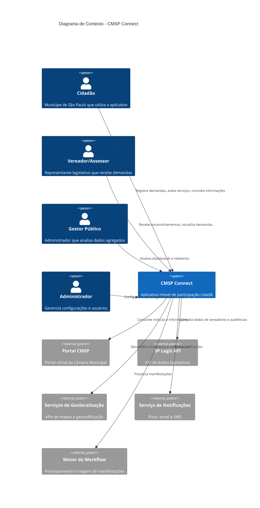
```mermaid
C4Context
    title Diagrama de Contexto - CMSP Connect

    Person(cidadao, "Cidadão", "Munícipe de São Paulo que utiliza o aplicativo")
    Person(vereador, "Vereador/Assessor", "Representante legislativo que recebe demandas")
    Person(gestor, "Gestor Público", "Administrador que analisa dados agregados")
    Person(admin, "Administrador", "Gerencia configurações e usuários")

    System(cmsp_connect, "CMSP Connect", "Aplicativo móvel de participação cidadã")

    System_Ext(portal_cmsp, "Portal CMSP", "Portal oficial da Câmara Municipal")
    System_Ext(sp_legis, "SP Legis API", "API de dados legislativos")
    System_Ext(geo_services, "Serviços de Geolocalização", "APIs de mapas e geocodificação")
    System_Ext(notification_service, "Serviço de Notificações", "Push, email e SMS")
    System_Ext(workflow_engine, "Motor de Workflow", "Processamento e triagem de manifestações")

    Rel(cidadao, cmsp_connect, "Registra demandas, avalia serviços, consulta informações")
    Rel(vereador, cmsp_connect, "Recebe encaminhamentos, visualiza demandas")
    Rel(gestor, cmsp_connect, "Analisa dashboards e relatórios")
    Rel(admin, cmsp_connect, "Configura sistema e gerencia usuários")

    Rel(cmsp_connect, portal_cmsp, "Consome notícias e informações")
    Rel(cmsp_connect, sp_legis, "Consulta dados de vereadores e audiências")
    Rel(cmsp_connect, geo_services, "Geocodifica endereços e exibe mapas")
    Rel(cmsp_connect, notification_service, "Envia notificações")
    Rel(cmsp_connect, workflow_engine, "Processa manifestações")
```

### 4.2 Diagrama de Containers (C4 - Nível 2)

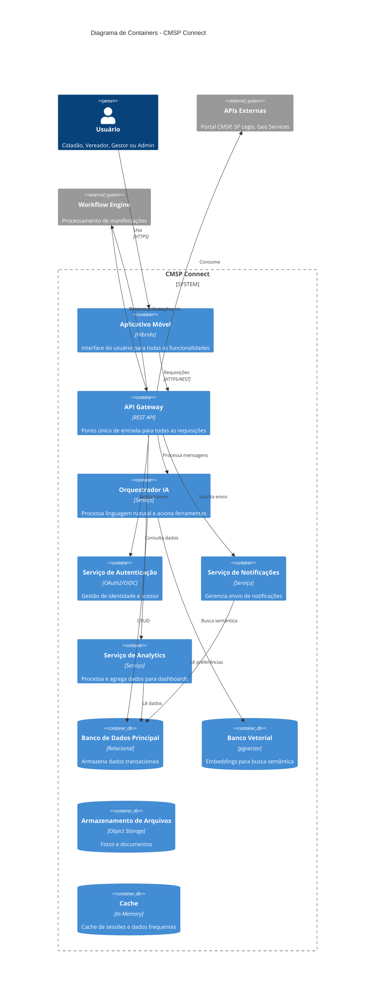
```mermaid
C4Container
    title Diagrama de Containers - CMSP Connect

    Person(user, "Usuário", "Cidadão, Vereador, Gestor ou Admin")

    System_Boundary(cmsp_system, "CMSP Connect") {
        Container(mobile_app, "Aplicativo Móvel", "Híbrido", "Interface do usuário para todas as funcionalidades")
        Container(api_gateway, "API Gateway", "REST API", "Ponto único de entrada para todas as requisições")
        Container(ai_orchestrator, "Orquestrador IA", "Serviço", "Processa linguagem natural e aciona ferramentas")
        Container(auth_service, "Serviço de Autenticação", "OAuth2/OIDC", "Gestão de identidade e acesso")
        Container(notification_service, "Serviço de Notificações", "Serviço", "Gerencia envio de notificações")
        Container(analytics_service, "Serviço de Analytics", "Serviço", "Processa e agrega dados para dashboards")
        
        ContainerDb(main_database, "Banco de Dados Principal", "Relacional", "Armazena dados transacionais")
        ContainerDb(vector_database, "Banco Vetorial", "pgvector", "Embeddings para busca semântica")
        ContainerDb(file_storage, "Armazenamento de Arquivos", "Object Storage", "Fotos e documentos")
        ContainerDb(cache, "Cache", "In-Memory", "Cache de sessões e dados frequentes")
    }

    System_Ext(external_apis, "APIs Externas", "Portal CMSP, SP Legis, Geo Services")
    System_Ext(workflow, "Workflow Engine", "Processamento de manifestações")

    Rel(user, mobile_app, "Usa", "HTTPS")
    Rel(mobile_app, api_gateway, "Requisições", "HTTPS/REST")
    Rel(api_gateway, ai_orchestrator, "Processa mensagens")
    Rel(api_gateway, auth_service, "Valida tokens")
    Rel(api_gateway, notification_service, "Solicita envio")
    Rel(api_gateway, analytics_service, "Consulta dados")
    
    Rel(ai_orchestrator, main_database, "CRUD")
    Rel(ai_orchestrator, vector_database, "Busca semântica")
    Rel(analytics_service, main_database, "Lê dados")
    Rel(notification_service, main_database, "Lê preferências")
    
    Rel(api_gateway, external_apis, "Consome")
    Rel(api_gateway, workflow, "Envia manifestações")
    Rel(workflow, api_gateway, "Retorna processamento")
```

### 4.3 Diagrama de Componentes - Orquestrador IA (C4 - Nível 3)

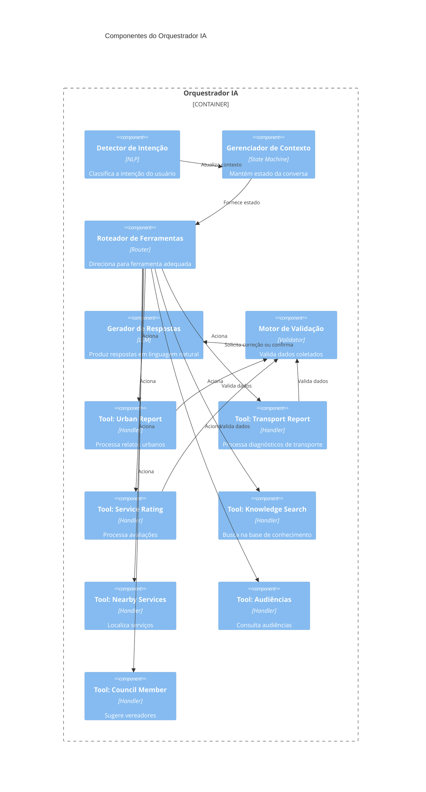
```mermaid
C4Component
    title Componentes do Orquestrador IA

    Container_Boundary(orchestrator, "Orquestrador IA") {
        Component(intent_detector, "Detector de Intenção", "NLP", "Classifica a intenção do usuário")
        Component(context_manager, "Gerenciador de Contexto", "State Machine", "Mantém estado da conversa")
        Component(tool_router, "Roteador de Ferramentas", "Router", "Direciona para ferramenta adequada")
        Component(response_generator, "Gerador de Respostas", "LLM", "Produz respostas em linguagem natural")
        Component(validation_engine, "Motor de Validação", "Validator", "Valida dados coletados")
        
        Component(tool_urban, "Tool: Urban Report", "Handler", "Processa relatos urbanos")
        Component(tool_transport, "Tool: Transport Report", "Handler", "Processa diagnósticos de transporte")
        Component(tool_rating, "Tool: Service Rating", "Handler", "Processa avaliações")
        Component(tool_search, "Tool: Knowledge Search", "Handler", "Busca na base de conhecimento")
        Component(tool_services, "Tool: Nearby Services", "Handler", "Localiza serviços")
        Component(tool_audiencias, "Tool: Audiências", "Handler", "Consulta audiências")
        Component(tool_council, "Tool: Council Member", "Handler", "Sugere vereadores")
    }

    Rel(intent_detector, context_manager, "Atualiza contexto")
    Rel(context_manager, tool_router, "Fornece estado")
    Rel(tool_router, tool_urban, "Aciona")
    Rel(tool_router, tool_transport, "Aciona")
    Rel(tool_router, tool_rating, "Aciona")
    Rel(tool_router, tool_search, "Aciona")
    Rel(tool_router, tool_services, "Aciona")
    Rel(tool_router, tool_audiencias, "Aciona")
    Rel(tool_router, tool_council, "Aciona")
    Rel(tool_urban, validation_engine, "Valida dados")
    Rel(tool_transport, validation_engine, "Valida dados")
    Rel(tool_rating, validation_engine, "Valida dados")
    Rel(validation_engine, response_generator, "Solicita correção ou confirma")
```

### 4.4 Fluxo de Dados Principal

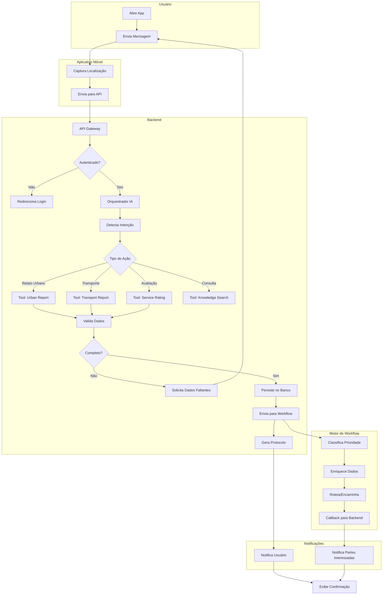
```mermaid
flowchart TD
    subgraph Usuario["Usuário"]
        A[Abre App] --> B[Envia Mensagem]
    end

    subgraph Frontend["Aplicativo Móvel"]
        B --> C[Captura Localização]
        C --> D[Envia para API]
    end

    subgraph Backend["Backend"]
        D --> E[API Gateway]
        E --> F{Autenticado?}
        F -->|Não| G[Redireciona Login]
        F -->|Sim| H[Orquestrador IA]
        
        H --> I[Detecta Intenção]
        I --> J{Tipo de Ação}
        
        J -->|Relato Urbano| K[Tool: Urban Report]
        J -->|Transporte| L[Tool: Transport Report]
        J -->|Avaliação| M[Tool: Service Rating]
        J -->|Consulta| N[Tool: Knowledge Search]
        
        K --> O[Valida Dados]
        L --> O
        M --> O
        
        O --> P{Completo?}
        P -->|Não| Q[Solicita Dados Faltantes]
        P -->|Sim| R[Persiste no Banco]
        
        R --> S[Envia para Workflow]
        S --> T[Gera Protocolo]
    end

    subgraph Workflow["Motor de Workflow"]
        S --> U[Classifica Prioridade]
        U --> V[Enriquece Dados]
        V --> W[Roteia/Encaminha]
        W --> X[Callback para Backend]
    end

    subgraph Notificacao["Notificações"]
        T --> Y[Notifica Usuário]
        X --> Z[Notifica Partes Interessadas]
    end

    Q --> B
    Y --> AA[Exibe Confirmação]
    Z --> AA
```

---

## 5. Modelo de Dados Conceitual

### 5.1 Diagrama Entidade-Relacionamento

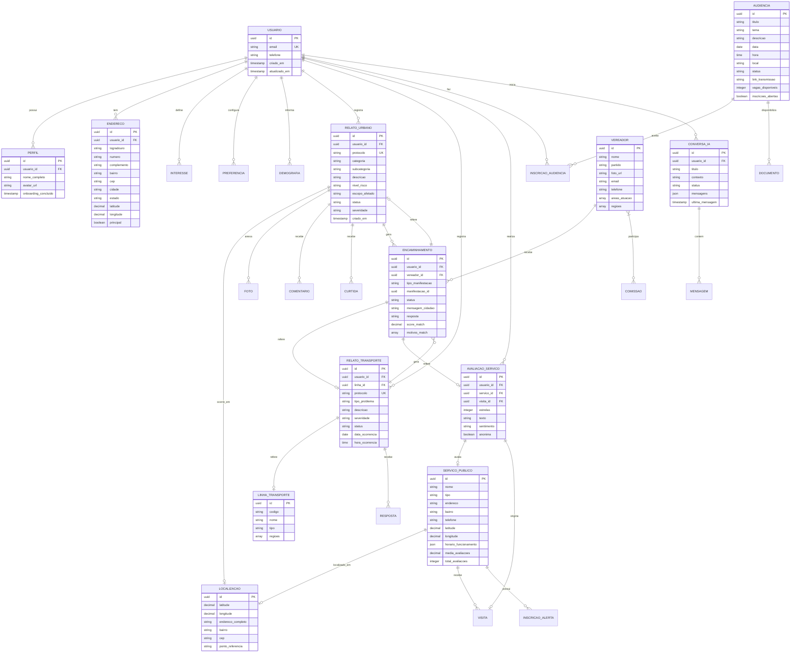
```mermaid
erDiagram
    USUARIO ||--o{ PERFIL : possui
    USUARIO ||--o{ ENDERECO : tem
    USUARIO ||--o{ INTERESSE : define
    USUARIO ||--o{ PREFERENCIA : configura
    USUARIO ||--o{ DEMOGRAFIA : informa
    
    USUARIO ||--o{ RELATO_URBANO : registra
    USUARIO ||--o{ RELATO_TRANSPORTE : registra
    USUARIO ||--o{ AVALIACAO_SERVICO : realiza
    USUARIO ||--o{ INSCRICAO_AUDIENCIA : faz
    
    USUARIO ||--o{ CONVERSA_IA : inicia
    CONVERSA_IA ||--o{ MENSAGEM : contem
    
    RELATO_URBANO ||--o| LOCALIZACAO : ocorre_em
    RELATO_URBANO ||--o{ FOTO : anexa
    RELATO_URBANO ||--o{ COMENTARIO : recebe
    RELATO_URBANO ||--o{ CURTIDA : recebe
    RELATO_URBANO ||--o{ ENCAMINHAMENTO : gera
    
    RELATO_TRANSPORTE ||--o| LINHA_TRANSPORTE : refere
    RELATO_TRANSPORTE ||--o{ ENCAMINHAMENTO : gera
    RELATO_TRANSPORTE ||--o{ RESPOSTA : recebe
    
    AVALIACAO_SERVICO ||--o| SERVICO_PUBLICO : avalia
    AVALIACAO_SERVICO ||--o| VISITA : origina
    
    SERVICO_PUBLICO ||--o| LOCALIZACAO : localizado_em
    SERVICO_PUBLICO ||--o{ VISITA : recebe
    SERVICO_PUBLICO ||--o{ INSCRICAO_ALERTA : possui
    
    AUDIENCIA ||--o{ INSCRICAO_AUDIENCIA : aceita
    AUDIENCIA ||--o{ DOCUMENTO : disponibiliza
    
    VEREADOR ||--o{ ENCAMINHAMENTO : recebe
    VEREADOR }|--o{ COMISSAO : participa
    
    ENCAMINHAMENTO ||--o| RELATO_URBANO : refere
    ENCAMINHAMENTO ||--o| RELATO_TRANSPORTE : refere
    ENCAMINHAMENTO ||--o| AVALIACAO_SERVICO : refere

    USUARIO {
        uuid id PK
        string email UK
        string telefone
        timestamp criado_em
        timestamp atualizado_em
    }

    PERFIL {
        uuid id PK
        uuid usuario_id FK
        string nome_completo
        string avatar_url
        timestamp onboarding_concluido
    }

    ENDERECO {
        uuid id PK
        uuid usuario_id FK
        string logradouro
        string numero
        string complemento
        string bairro
        string cep
        string cidade
        string estado
        decimal latitude
        decimal longitude
        boolean principal
    }

    RELATO_URBANO {
        uuid id PK
        uuid usuario_id FK
        string protocolo UK
        string categoria
        string subcategoria
        string descricao
        string nivel_risco
        string escopo_afetado
        string status
        string severidade
        timestamp criado_em
    }

    LOCALIZACAO {
        uuid id PK
        decimal latitude
        decimal longitude
        string endereco_completo
        string bairro
        string cep
        string ponto_referencia
    }

    RELATO_TRANSPORTE {
        uuid id PK
        uuid usuario_id FK
        uuid linha_id FK
        string protocolo UK
        string tipo_problema
        string descricao
        string severidade
        string status
        date data_ocorrencia
        time hora_ocorrencia
    }

    LINHA_TRANSPORTE {
        uuid id PK
        string codigo
        string nome
        string tipo
        array regioes
    }

    AVALIACAO_SERVICO {
        uuid id PK
        uuid usuario_id FK
        uuid servico_id FK
        uuid visita_id FK
        integer estrelas
        string texto
        string sentimento
        boolean anonima
    }

    SERVICO_PUBLICO {
        uuid id PK
        string nome
        string tipo
        string endereco
        string bairro
        string telefone
        decimal latitude
        decimal longitude
        json horario_funcionamento
        decimal media_avaliacoes
        integer total_avaliacoes
    }

    AUDIENCIA {
        uuid id PK
        string titulo
        string tema
        string descricao
        date data
        time hora
        string local
        string status
        string link_transmissao
        integer vagas_disponiveis
        boolean inscricoes_abertas
    }

    VEREADOR {
        uuid id PK
        string nome
        string partido
        string foto_url
        string email
        string telefone
        array areas_atuacao
        array regioes
    }

    ENCAMINHAMENTO {
        uuid id PK
        uuid usuario_id FK
        uuid vereador_id FK
        string tipo_manifestacao
        uuid manifestacao_id
        string status
        string mensagem_cidadao
        string resposta
        decimal score_match
        array motivos_match
    }

    CONVERSA_IA {
        uuid id PK
        uuid usuario_id FK
        string titulo
        string contexto
        string status
        json mensagens
        timestamp ultima_mensagem
    }
```

### 5.2 Descrição das Entidades Principais

#### 5.2.1 Entidades de Usuário

| Entidade | Descrição | Cardinalidade |
|----------|-----------|---------------|
| USUARIO | Conta principal do cidadão | 1 por pessoa |
| PERFIL | Dados pessoais e avatar | 1:1 com USUARIO |
| ENDERECO | Endereços do usuário | 1:N com USUARIO |
| INTERESSE | Temas de interesse | 1:N com USUARIO |
| PREFERENCIA | Configurações de notificação e privacidade | 1:1 com USUARIO |
| DEMOGRAFIA | Dados demográficos opcionais | 1:1 com USUARIO |

#### 5.2.2 Entidades de Manifestação

| Entidade | Descrição | Dados Obrigatórios |
|----------|-----------|-------------------|
| RELATO_URBANO | Problemas urbanos reportados | categoria, descrição, localização |
| RELATO_TRANSPORTE | Problemas de transporte | tipo, linha/código, data, descrição |
| AVALIACAO_SERVICO | Avaliação de serviço público | serviço, estrelas, visita |
| ENCAMINHAMENTO | Vínculo com vereador | vereador, manifestação |

#### 5.2.3 Entidades de Referência

| Entidade | Descrição | Fonte de Dados |
|----------|-----------|----------------|
| SERVICO_PUBLICO | Serviços como UBS, escolas | Integração CMSP + Crowdsourcing |
| LINHA_TRANSPORTE | Linhas de ônibus/metrô | SPTrans / Metrô |
| AUDIENCIA | Audiências públicas | Portal CMSP |
| VEREADOR | Representantes eleitos | SP Legis API |

---

## 6. Personas e Perfis de Usuário

### 6.1 Personas Principais

#### Cidadão Comum
- **Descrição**: Morador de São Paulo que utiliza serviços públicos
- **Necessidades**: Reportar problemas, avaliar serviços, acompanhar demandas
- **Frequência de Uso**: Eventual (quando há necessidade)
- **Nível Técnico**: Básico

#### Cidadão Engajado
- **Descrição**: Morador ativo na participação cidadã
- **Necessidades**: Participar de audiências, acompanhar legislação, interagir com vereadores
- **Frequência de Uso**: Semanal
- **Nível Técnico**: Intermediário

#### Gestor Público
- **Descrição**: Servidor que analisa dados agregados
- **Necessidades**: Dashboards, relatórios, identificação de padrões
- **Frequência de Uso**: Diária
- **Nível Técnico**: Intermediário

#### Administrador
- **Descrição**: Responsável pela gestão do sistema
- **Necessidades**: Gerenciar usuários, configurar integrações, monitorar sistema
- **Frequência de Uso**: Diária
- **Nível Técnico**: Avançado

### 6.2 Matriz de Permissões (RBAC)

| Funcionalidade | Cidadão | Cidadão Engajado | Assessor | Vereador | Gestor | Admin |
|----------------|---------|------------------|----------|----------|--------|-------|
| Criar relatos | ✓ | ✓ | ✓ | ✓ | ✓ | ✓ |
| Avaliar serviços | ✓ | ✓ | ✓ | ✓ | ✓ | ✓ |
| Inscrever em audiências | ✓ | ✓ | ✓ | ✓ | ✓ | ✓ |
| Ver próprio histórico | ✓ | ✓ | ✓ | ✓ | ✓ | ✓ |
| Encaminhar para vereador | ✓ | ✓ | ✓ | ✓ | ✓ | ✓ |
| Responder encaminhamentos | ✗ | ✗ | ✓ | ✓ | ✗ | ✓ |
| Ver dashboards públicos | ✓ | ✓ | ✓ | ✓ | ✓ | ✓ |
| Ver dashboards completos | ✗ | ✗ | ✓ | ✓ | ✓ | ✓ |
| Exportar dados | ✗ | ✗ | ✗ | ✗ | ✓ | ✓ |
| Gerenciar manifestações | ✗ | ✗ | ✓ | ✓ | ✓ | ✓ |
| Gerenciar usuários | ✗ | ✗ | ✗ | ✗ | ✗ | ✓ |
| Configurar sistema | ✗ | ✗ | ✗ | ✗ | ✗ | ✓ |
| Ver logs de auditoria | ✗ | ✗ | ✗ | ✗ | ✓ | ✓ |

---

## 7. Casos de Uso

### CSU001 - Acolhimento Digital Personalizado

**Ator Principal**: Cidadão  
**Ferramenta IA**: `get_citizen_history`

**Descrição**: O sistema recebe o cidadão de forma personalizada, considerando seu histórico, preferências e contexto atual (localização, horário).

**Fluxo Principal**:
1. Cidadão abre o aplicativo
2. Sistema identifica usuário autenticado
3. Sistema recupera contexto (histórico, pendências, interesses)
4. Sistema gera saudação personalizada com resumo relevante
5. Sistema apresenta ações prioritárias baseadas no contexto
6. Cidadão escolhe ação ou inicia conversa livre

**Fluxos Alternativos**:
- **FA1**: Primeiro acesso → Inicia onboarding
- **FA2**: Usuário não autenticado → Apresenta opções de login/cadastro
- **FA3**: Pendências urgentes → Destaca notificações prioritárias

**Pós-condições**: Cidadão está contextualizado e pronto para interagir

---

### CSU002 - Gestão de Audiências Públicas

**Ator Principal**: Cidadão  
**Ferramenta IA**: `search_audiencias`

**Descrição**: Permite consultar, filtrar e inscrever-se em audiências públicas da Câmara.

**Fluxo Principal**:
1. Cidadão solicita informações sobre audiências
2. Sistema apresenta audiências futuras filtradas por interesse
3. Cidadão seleciona audiência de interesse
4. Sistema exibe detalhes (tema, data, local, documentos)
5. Cidadão solicita inscrição
6. Sistema valida disponibilidade de vagas
7. Sistema confirma inscrição
8. Sistema agenda notificações de lembrete

**Fluxos Alternativos**:
- **FA1**: Sem vagas → Oferece lista de espera
- **FA2**: Audiência virtual → Fornece link de transmissão
- **FA3**: Conflito de horário → Alerta cidadão

**Pré-condições**: Cidadão autenticado  
**Pós-condições**: Inscrição registrada, lembretes agendados

---

### CSU003 - Navegação Institucional

**Ator Principal**: Cidadão  
**Ferramenta IA**: `search_knowledge_base`

**Descrição**: Acesso a informações institucionais da Câmara em linguagem acessível.

**Fluxo Principal**:
1. Cidadão faz pergunta sobre tema legislativo/institucional
2. Sistema busca na base de conhecimento (RAG)
3. Sistema encontra documentos relevantes
4. Sistema sintetiza resposta em linguagem simples
5. Sistema apresenta fontes oficiais utilizadas
6. Sistema oferece aprofundamento se necessário

**Fluxos Alternativos**:
- **FA1**: Tema não encontrado → Sugere reformulação ou contato
- **FA2**: Baixa confiança → Indica incerteza e sugere verificação
- **FA3**: Tema fora do escopo → Explica limitações e redireciona

**Regras de Negócio**:
- Respostas SEMPRE indicam fonte oficial
- Confiança < 70% gera aviso ao usuário
- Temas fora do escopo legislativo são educadamente recusados

---

### CSU004 - Avaliação de Serviços Públicos

**Ator Principal**: Cidadão  
**Ferramenta IA**: `create_service_rating`

**Descrição**: Avaliação geolocalizada de serviços públicos após visita detectada.

**Fluxo Principal**:
1. Sistema detecta proximidade de serviço público
2. Sistema registra visita potencial
3. Após período (2-24h), sistema solicita avaliação
4. Cidadão classifica experiência (1-5 estrelas)
5. Cidadão descreve experiência (opcional)
6. Sistema analisa sentimento do texto
7. Sistema persiste avaliação
8. Sistema atualiza média do serviço

**Fluxos Alternativos**:
- **FA1**: Avaliação negativa (≤2 estrelas) → Oferece encaminhamento a vereador
- **FA2**: Problema crítico identificado → Sugere relato urbano
- **FA3**: Cidadão não visitou → Permite pular avaliação

**Pré-condições**: Cidadão autenticado, permissão de localização  
**Pós-condições**: Avaliação registrada, métricas atualizadas

---

### CSU005 - Diagnóstico de Transporte Público

**Ator Principal**: Cidadão  
**Ferramenta IA**: `create_transport_report`

**Descrição**: Registro estruturado de problemas no transporte público.

**Fluxo Principal**:
1. Cidadão relata problema de transporte
2. Sistema identifica tipo de problema (atraso, lotação, condição, etc.)
3. Sistema solicita linha/código do veículo
4. Sistema valida linha no cadastro
5. Sistema solicita data/hora da ocorrência
6. Sistema coleta descrição detalhada
7. Sistema detecta padrões similares
8. Sistema persiste relato com protocolo
9. Sistema envia para processamento

**Fluxos Alternativos**:
- **FA1**: Linha não cadastrada → Permite informar código manualmente
- **FA2**: Padrão detectado → Informa cidadão sobre recorrência
- **FA3**: Problema crítico → Oferece encaminhamento prioritário

**Dados Obrigatórios**:
- Tipo de problema
- Linha ou código do veículo
- Data da ocorrência
- Descrição (mínimo 30 caracteres)

---

### CSU006 - Dashboard de Análises

**Ator Principal**: Gestor Público  
**Ferramenta IA**: N/A (consulta analítica)

**Descrição**: Visualização de dados agregados sobre manifestações, serviços e participação.

**Fluxo Principal**:
1. Gestor acessa área de analytics
2. Sistema apresenta KPIs principais
3. Gestor seleciona dimensão de análise (tempo, região, categoria)
4. Sistema renderiza visualizações interativas
5. Gestor aplica filtros e drill-down
6. Sistema atualiza visualizações em tempo real
7. Gestor exporta dados ou relatório

**Funcionalidades Analíticas**:
- **Drill-down**: Detalhar por subcategoria
- **Drill-up**: Agregar por categoria pai
- **Drill-across**: Cruzar dimensões
- **Drill-through**: Acessar registros individuais

---

### CSU007 - Mapa de Serviços Públicos

**Ator Principal**: Cidadão  
**Ferramenta IA**: `find_nearby_services`

**Descrição**: Localização e informações de serviços públicos próximos.

**Fluxo Principal**:
1. Cidadão solicita serviços próximos
2. Sistema obtém localização atual
3. Sistema busca serviços no raio configurado
4. Sistema apresenta mapa com marcadores
5. Cidadão seleciona serviço
6. Sistema exibe detalhes (horário, telefone, avaliações)
7. Cidadão solicita rota ou mais informações

**Fluxos Alternativos**:
- **FA1**: GPS indisponível → Solicita endereço manual
- **FA2**: Sem serviços no raio → Expande busca automaticamente
- **FA3**: Horário fechado → Destaca próximo horário disponível

**Tipos de Serviço**:
- UBS (Unidade Básica de Saúde)
- Escolas Municipais
- CEUs (Centro Educacional Unificado)
- Hospitais
- Bibliotecas
- Centros Esportivos

---

### CSU008 - Relatos Urbanos Estruturados

**Ator Principal**: Cidadão  
**Ferramenta IA**: `create_urban_report`, `suggest_council_member`

**Descrição**: Registro guiado de problemas urbanos com coleta estruturada de dados.

**Fluxo Principal**:
1. Cidadão descreve problema urbano
2. Sistema classifica categoria automaticamente
3. Sistema valida classificação com cidadão se confiança < 80%
4. Sistema coleta localização (GPS ou manual)
5. Sistema solicita descrição detalhada
6. Sistema avalia nível de risco
7. Para riscos moderados/críticos, solicita escopo de afetados
8. Sistema permite anexar fotos
9. Sistema gera protocolo
10. Sistema oferece encaminhamento a vereador
11. Sistema envia para processamento

**Categorias**:
- Via pública (buracos, calçadas)
- Iluminação (postes, lâmpadas)
- Saneamento (esgoto, drenagem)
- Limpeza urbana (lixo, entulho)
- Áreas verdes (poda, praças)
- Animais (infestações, animais mortos)
- Poluição (sonora, visual, atmosférica)

**Fluxos Alternativos**:
- **FA1**: Categoria fora do escopo municipal → Oferece registro como feedback
- **FA2**: Problema já relatado na região → Informa e permite reforçar
- **FA3**: Emergência → Orienta para canais apropriados (SAMU, Bombeiros)

---

## 8. Mapa do Site

```
CMSP Connect
├── Onboarding
│   ├── Boas-vindas
│   ├── Cadastro/Login
│   └── Configuração inicial (interesses, localização)
│
├── Home (Acolhimento)
│   ├── Saudação personalizada
│   ├── Ações prioritárias
│   ├── Feed contextual
│   └── Acesso ao assistente IA
│
├── Assistente IA (Chat)
│   ├── Conversa principal
│   ├── Histórico de conversas
│   └── Rascunhos salvos
│
├── Manifestações
│   ├── Relatos Urbanos
│   │   ├── Novo relato
│   │   ├── Meus relatos
│   │   └── Detalhes do relato
│   ├── Transporte
│   │   ├── Novo diagnóstico
│   │   ├── Meus diagnósticos
│   │   └── Padrões identificados
│   └── Avaliações
│       ├── Pendentes
│       ├── Histórico
│       └── Serviços favoritos
│
├── Audiências Públicas
│   ├── Próximas
│   ├── Minhas inscrições
│   ├── Participação
│   └── Arquivo
│
├── Institucional
│   ├── Conheça a Câmara
│   ├── Vereadores
│   │   ├── Lista
│   │   └── Perfil do vereador
│   ├── Câmara Explica
│   ├── Notícias
│   ├── Agenda
│   └── Escola do Parlamento
│
├── Serviços Próximos
│   ├── Mapa
│   ├── Lista
│   ├── Detalhes do serviço
│   └── Favoritos
│
├── Minha Área
│   ├── Perfil
│   │   ├── Dados pessoais
│   │   ├── Endereços
│   │   ├── Interesses
│   │   └── Dados demográficos
│   ├── Preferências
│   │   ├── Notificações
│   │   ├── Privacidade
│   │   └── Acessibilidade
│   ├── Favoritos
│   └── Notificações
│
├── Analytics (Gestor/Admin)
│   ├── Dashboard principal
│   ├── Análise de sentimento
│   ├── Padrões de relatos
│   └── Exportações
│
└── Administração (Admin)
    ├── Gestão de manifestações
    ├── Gestão de usuários
    ├── Configurações do sistema
    ├── Integrações
    └── Logs de auditoria
```

---

## 9. Jornadas do Usuário

### 9.1 Jornada: Primeiro Acesso

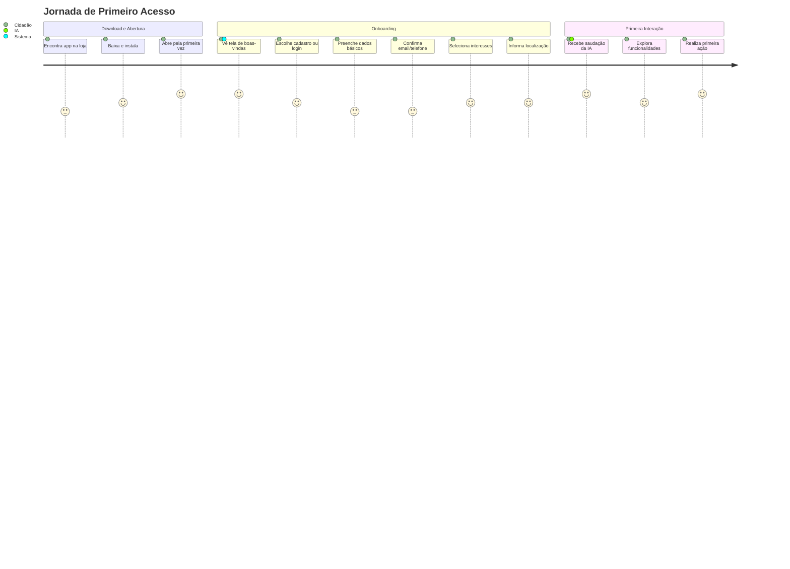
```mermaid
journey
    title Jornada de Primeiro Acesso
    section Download e Abertura
        Encontra app na loja: 3: Cidadão
        Baixa e instala: 4: Cidadão
        Abre pela primeira vez: 5: Cidadão
    section Onboarding
        Vê tela de boas-vindas: 5: Cidadão, Sistema
        Escolhe cadastro ou login: 4: Cidadão
        Preenche dados básicos: 3: Cidadão
        Confirma email/telefone: 3: Cidadão
        Seleciona interesses: 4: Cidadão
        Informa localização: 4: Cidadão
    section Primeira Interação
        Recebe saudação da IA: 5: Cidadão, IA
        Explora funcionalidades: 4: Cidadão
        Realiza primeira ação: 5: Cidadão
```

### 9.2 Jornada: Relato de Problema Urbano


```mermaid
journey
    title Jornada de Relato Urbano
    section Identificação do Problema
        Encontra problema na rua: 2: Cidadão
        Abre o app: 5: Cidadão
        Inicia conversa com IA: 5: Cidadão
    section Registro
        Descreve o problema: 4: Cidadão
        IA classifica categoria: 5: IA
        Confirma localização: 4: Cidadão
        Detalha descrição: 3: Cidadão
        Tira foto (opcional): 4: Cidadão
    section Conclusão
        Recebe protocolo: 5: Sistema
        Vê sugestão de vereador: 4: Sistema
        Decide encaminhar: 4: Cidadão
        Recebe confirmação: 5: Sistema
```

### 9.3 Jornada: Avaliação de Serviço

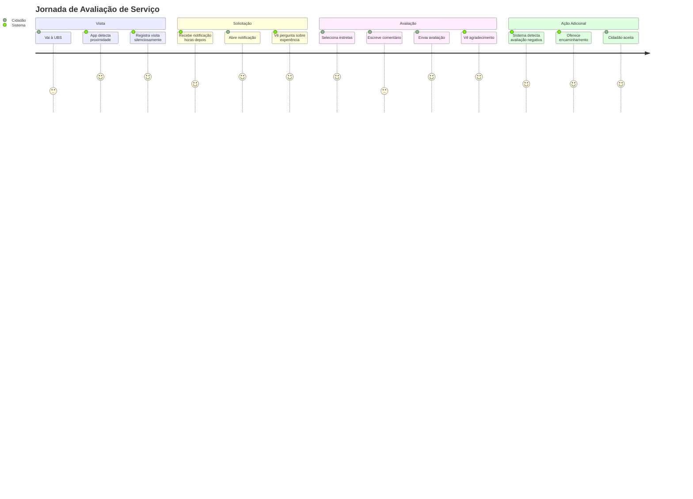
```mermaid
journey
    title Jornada de Avaliação de Serviço
    section Visita
        Vai à UBS: 3: Cidadão
        App detecta proximidade: 5: Sistema
        Registra visita silenciosamente: 5: Sistema
    section Solicitação
        Recebe notificação horas depois: 4: Sistema
        Abre notificação: 5: Cidadão
        Vê pergunta sobre experiência: 5: Sistema
    section Avaliação
        Seleciona estrelas: 5: Cidadão
        Escreve comentário: 3: Cidadão
        Envia avaliação: 5: Cidadão
        Vê agradecimento: 5: Sistema
    section Ação Adicional
        Sistema detecta avaliação negativa: 4: Sistema
        Oferece encaminhamento: 4: Sistema
        Cidadão aceita: 4: Cidadão
```

### 9.4 Jornada: Participação em Audiência


```mermaid
journey
    title Jornada de Audiência Pública
    section Descoberta
        Recebe notificação de audiência: 4: Sistema
        Vê tema de interesse: 5: Cidadão
        Acessa detalhes: 5: Cidadão
    section Inscrição
        Lê descrição e documentos: 4: Cidadão
        Solicita inscrição: 5: Cidadão
        Recebe confirmação: 5: Sistema
        Adiciona ao calendário: 4: Cidadão
    section Participação
        Recebe lembrete no dia: 5: Sistema
        Acessa link ou vai ao local: 4: Cidadão
        Participa da audiência: 4: Cidadão
        Recebe resumo pós-evento: 5: Sistema
```

---

## 10. Requisitos Não-Funcionais

### 10.1 Desempenho

| Requisito | Especificação | Prioridade |
|-----------|--------------|------------|
| RNF-PERF-01 | Tempo de resposta P95 < 200ms para APIs | Alta |
| RNF-PERF-02 | Tempo de resposta P99 < 500ms para APIs | Alta |
| RNF-PERF-03 | Tempo de carregamento inicial do app < 3s | Alta |
| RNF-PERF-04 | Resposta do assistente IA < 5s | Média |
| RNF-PERF-05 | Renderização de mapas < 2s | Média |
| RNF-PERF-06 | Throughput mínimo: 1000 requisições/segundo | Alta |

### 10.2 Disponibilidade e Confiabilidade

| Requisito | Especificação | Prioridade |
|-----------|--------------|------------|
| RNF-DISP-01 | Disponibilidade ≥ 99.5% (≈43h downtime/ano) | Alta |
| RNF-DISP-02 | RPO (Recovery Point Objective) ≤ 1 hora | Alta |
| RNF-DISP-03 | RTO (Recovery Time Objective) ≤ 4 horas | Alta |
| RNF-DISP-04 | Taxa de erro < 0.1% das requisições | Alta |
| RNF-DISP-05 | Failover automático para componentes críticos | Média |

### 10.3 Escalabilidade

| Requisito | Especificação | Prioridade |
|-----------|--------------|------------|
| RNF-ESC-01 | Suportar 100.000 usuários simultâneos | Alta |
| RNF-ESC-02 | Escalar horizontalmente sob demanda | Alta |
| RNF-ESC-03 | Crescimento de dados: 10GB/mês projetado | Média |
| RNF-ESC-04 | Auto-scaling baseado em métricas | Média |

### 10.4 Segurança

| Requisito | Especificação | Prioridade |
|-----------|--------------|------------|
| RNF-SEG-01 | Autenticação via OAuth2/OIDC | Alta |
| RNF-SEG-02 | Tokens JWT com expiração curta e refresh | Alta |
| RNF-SEG-03 | Comunicação via TLS 1.3 | Alta |
| RNF-SEG-04 | Criptografia de dados em repouso (AES-256) | Alta |
| RNF-SEG-05 | Hash de senhas com Argon2id | Alta |
| RNF-SEG-06 | Rate limiting por IP e usuário | Alta |
| RNF-SEG-07 | Logs de auditoria para ações sensíveis | Alta |
| RNF-SEG-08 | Controle de acesso baseado em papéis (RBAC) | Alta |

### 10.5 Usabilidade e Acessibilidade

| Requisito | Especificação | Prioridade |
|-----------|--------------|------------|
| RNF-USA-01 | Conformidade WCAG 2.1 nível AA | Alta |
| RNF-USA-02 | Navegação completa por teclado/gestos | Alta |
| RNF-USA-03 | Ajuste de tamanho de fonte (3 níveis) | Alta |
| RNF-USA-04 | Compatibilidade com leitores de tela | Alta |
| RNF-USA-05 | Contraste mínimo 4.5:1 para texto | Alta |
| RNF-USA-06 | Linguagem simples (nível 8ª série) | Média |
| RNF-USA-07 | Suporte a modo escuro | Média |
| RNF-USA-08 | Modo leitura com espaçamento aumentado | Baixa |

### 10.6 Compatibilidade

| Requisito | Especificação | Prioridade |
|-----------|--------------|------------|
| RNF-COMP-01 | iOS 14+ e Android 10+ | Alta |
| RNF-COMP-02 | Funcionamento em redes 3G/4G/5G/WiFi | Alta |
| RNF-COMP-03 | Modo offline para consultas básicas | Média |
| RNF-COMP-04 | Telas de 4.7" a 12.9" | Alta |

### 10.7 Observabilidade

| Requisito | Especificação | Prioridade |
|-----------|--------------|------------|
| RNF-OBS-01 | Logging estruturado centralizado | Alta |
| RNF-OBS-02 | Métricas de aplicação em tempo real | Alta |
| RNF-OBS-03 | Tracing distribuído para debug | Média |
| RNF-OBS-04 | Alertas automáticos para anomalias | Alta |
| RNF-OBS-05 | Dashboards de monitoramento | Média |

---

## 11. Requisitos de Segurança e LGPD

### 11.1 Classificação de Dados

| Categoria | Exemplos | Nível de Proteção |
|-----------|----------|-------------------|
| Dados Públicos | Informações institucionais, notícias | Baixo |
| Dados Internos | Estatísticas agregadas, padrões | Médio |
| Dados Pessoais | Nome, email, telefone, endereço | Alto |
| Dados Sensíveis | Localização em tempo real, demografia | Muito Alto |

### 11.2 Requisitos LGPD

#### 11.2.1 Base Legal para Tratamento

| Dado | Base Legal | Justificativa |
|------|------------|---------------|
| Dados cadastrais | Consentimento | Necessário para criar conta |
| Localização | Consentimento | Funcionalidade de serviços próximos |
| Manifestações | Interesse público | Registro de demandas cidadãs |
| Dados demográficos | Consentimento | Opcional para análises |

#### 11.2.2 Direitos do Titular

| Direito | Implementação |
|---------|---------------|
| Acesso | Exportação de dados pessoais em formato legível |
| Correção | Edição de perfil e dados cadastrais |
| Exclusão | Anonimização/exclusão mediante solicitação |
| Portabilidade | Exportação em formato interoperável |
| Revogação | Gestão de consentimentos no app |
| Informação | Política de privacidade acessível |

#### 11.2.3 Medidas Técnicas

| Medida | Descrição |
|--------|-----------|
| Anonimização | Dados de localização agregados após 90 dias |
| Pseudonimização | Dados demográficos separados de identificadores |
| Minimização | Coleta apenas de dados necessários |
| Retenção | Política de retenção por tipo de dado |
| Consentimento | Granular e registrado com timestamp |

### 11.3 Política de Retenção de Dados

| Tipo de Dado | Período de Retenção | Ação após Período |
|--------------|---------------------|-------------------|
| Logs de acesso | 90 dias | Exclusão |
| Localização precisa | 24 horas | Agregação/Anonimização |
| Manifestações | 5 anos | Anonimização |
| Dados de conta | Enquanto ativo + 2 anos | Exclusão |
| Avaliações | Indefinido (anonimizado) | N/A |
| Conversas IA | 1 ano | Exclusão |

### 11.4 Controles de Segurança

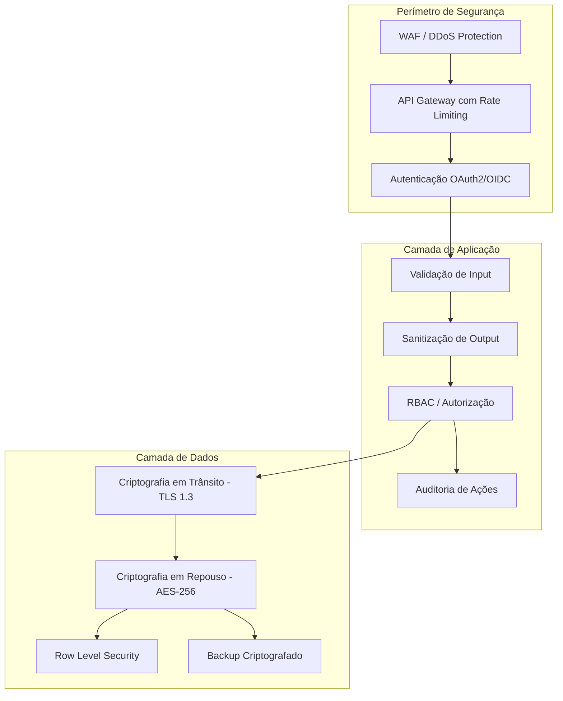
```mermaid
flowchart TD
    subgraph Perímetro["Perímetro de Segurança"]
        A[WAF / DDoS Protection]
        B[API Gateway com Rate Limiting]
        C[Autenticação OAuth2/OIDC]
    end

    subgraph Aplicação["Camada de Aplicação"]
        D[Validação de Input]
        E[Sanitização de Output]
        F[RBAC / Autorização]
        G[Auditoria de Ações]
    end

    subgraph Dados["Camada de Dados"]
        H[Criptografia em Trânsito - TLS 1.3]
        I[Criptografia em Repouso - AES-256]
        J[Row Level Security]
        K[Backup Criptografado]
    end

    A --> B --> C --> D
    D --> E --> F --> G
    F --> H --> I --> J
    I --> K
```

---

## 12. Regras de Negócio

### 12.1 Regras de Manifestações

| ID | Regra | Descrição |
|----|-------|-----------|
| RN-MAN-01 | Descrição mínima | Toda manifestação deve ter descrição ≥ 30 caracteres |
| RN-MAN-02 | Localização obrigatória | Relatos urbanos devem ter coordenadas ou endereço |
| RN-MAN-03 | Protocolo único | Todo registro gera protocolo no formato XXX-YYYY-NNNNNN |
| RN-MAN-04 | Severidade por IA | Prioridade/severidade é definida pelo workflow, não pelo usuário |
| RN-MAN-05 | Campos condicionais | Riscos moderados/críticos exigem escopo de afetados |
| RN-MAN-06 | Imutabilidade parcial | Manifestações enviadas não podem ter categoria alterada pelo usuário |

### 12.2 Regras de Avaliação de Serviços

| ID | Regra | Descrição |
|----|-------|-----------|
| RN-AVA-01 | Visita prévia | Avaliação só pode ser solicitada após detecção de visita |
| RN-AVA-02 | Janela de avaliação | Avaliação expira em 72 horas após visita |
| RN-AVA-03 | Uma avaliação por visita | Cidadão pode avaliar apenas uma vez por visita |
| RN-AVA-04 | Avaliação negativa | Estrelas ≤ 2 disparam oferta de encaminhamento |
| RN-AVA-05 | Atualização de média | Média do serviço é recalculada a cada nova avaliação |

### 12.3 Regras de Audiências

| ID | Regra | Descrição |
|----|-------|-----------|
| RN-AUD-01 | Vagas limitadas | Inscrição só é aceita se houver vagas disponíveis |
| RN-AUD-02 | Uma inscrição por usuário | Cidadão não pode se inscrever duas vezes na mesma audiência |
| RN-AUD-03 | Cancelamento | Inscrição pode ser cancelada até 2h antes do início |
| RN-AUD-04 | Notificações | Lembretes são enviados 24h, 2h e 15min antes |

### 12.4 Regras do Assistente IA

| ID | Regra | Descrição |
|----|-------|-----------|
| RN-IA-01 | Fontes oficiais | Respostas sobre legislação devem citar fonte oficial |
| RN-IA-02 | Limite de confiança | Confiança < 70% gera aviso ao usuário |
| RN-IA-03 | Escopo municipal | Temas fora do escopo são educadamente recusados |
| RN-IA-04 | Coleta estruturada | IA solicita dados faltantes um por vez |
| RN-IA-05 | Validação antes de persistir | Dados são validados antes de salvar no banco |
| RN-IA-06 | Gating inteligente | Se descrição inicial ≥ 30 chars, pula pergunta de descrição |

### 12.5 Regras de Notificação

| ID | Regra | Descrição |
|----|-------|-----------|
| RN-NOT-01 | Horário permitido | Notificações push apenas entre 8h e 21h |
| RN-NOT-02 | Limite diário | Máximo de 5 notificações por dia por usuário |
| RN-NOT-03 | Prioridade | Notificações críticas ignoram limite diário |
| RN-NOT-04 | Preferências | Respeitar preferências de canal do usuário |

### 12.6 Regras de Encaminhamento

| ID | Regra | Descrição |
|----|-------|-----------|
| RN-ENC-01 | Sugestão por match | Vereadores sugeridos por região + área de atuação |
| RN-ENC-02 | Score mínimo | Só sugere vereadores com score ≥ 60% |
| RN-ENC-03 | Um encaminhamento por manifestação | Cidadão escolhe um vereador por manifestação |
| RN-ENC-04 | Status tracking | Encaminhamento passa por: pendente → enviado → reconhecido → resolvido |

---

## 13. Estados e Ciclos de Vida

### 13.1 Ciclo de Vida - Relato Urbano

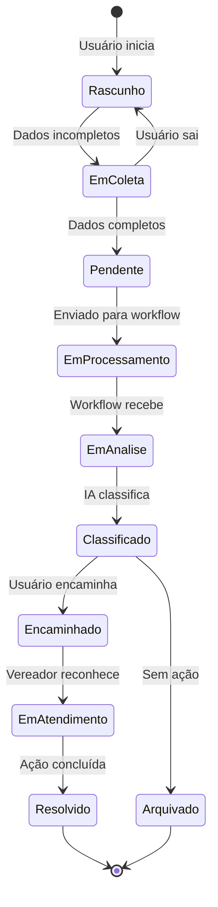
```mermaid
stateDiagram-v2
    [*] --> Rascunho: Usuário inicia
    Rascunho --> EmColeta: Dados incompletos
    EmColeta --> Rascunho: Usuário sai
    EmColeta --> Pendente: Dados completos
    Pendente --> EmProcessamento: Enviado para workflow
    EmProcessamento --> EmAnalise: Workflow recebe
    EmAnalise --> Classificado: IA classifica
    Classificado --> Encaminhado: Usuário encaminha
    Classificado --> Arquivado: Sem ação
    Encaminhado --> EmAtendimento: Vereador reconhece
    EmAtendimento --> Resolvido: Ação concluída
    Resolvido --> [*]
    Arquivado --> [*]
```

### 13.2 Ciclo de Vida - Avaliação de Serviço

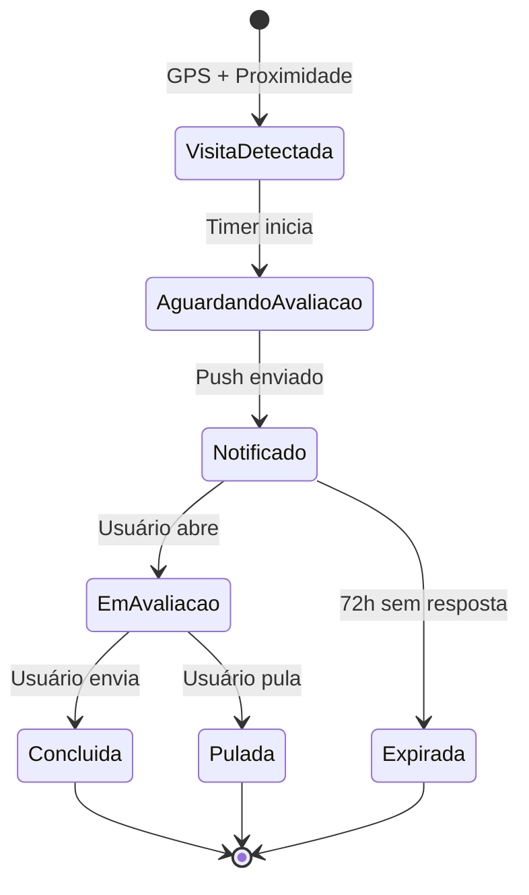
```mermaid
stateDiagram-v2
    [*] --> VisitaDetectada: GPS + Proximidade
    VisitaDetectada --> AguardandoAvaliacao: Timer inicia
    AguardandoAvaliacao --> Notificado: Push enviado
    Notificado --> EmAvaliacao: Usuário abre
    Notificado --> Expirada: 72h sem resposta
    EmAvaliacao --> Concluida: Usuário envia
    EmAvaliacao --> Pulada: Usuário pula
    Concluida --> [*]
    Expirada --> [*]
    Pulada --> [*]
```

### 13.3 Ciclo de Vida - Encaminhamento

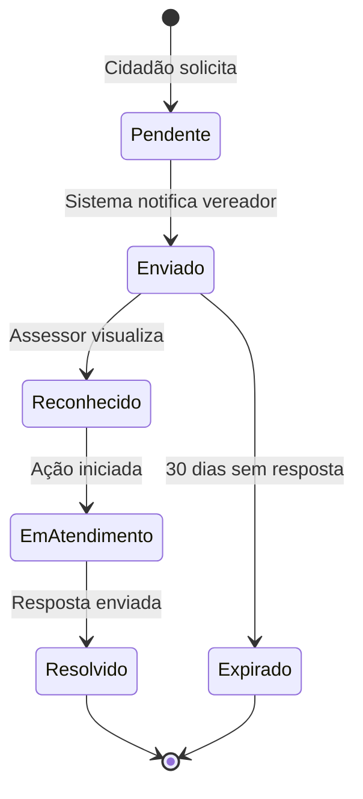
```mermaid
stateDiagram-v2
    [*] --> Pendente: Cidadão solicita
    Pendente --> Enviado: Sistema notifica vereador
    Enviado --> Reconhecido: Assessor visualiza
    Reconhecido --> EmAtendimento: Ação iniciada
    EmAtendimento --> Resolvido: Resposta enviada
    Resolvido --> [*]
    
    Enviado --> Expirado: 30 dias sem resposta
    Expirado --> [*]
```

### 13.4 Ciclo de Vida - Inscrição em Audiência

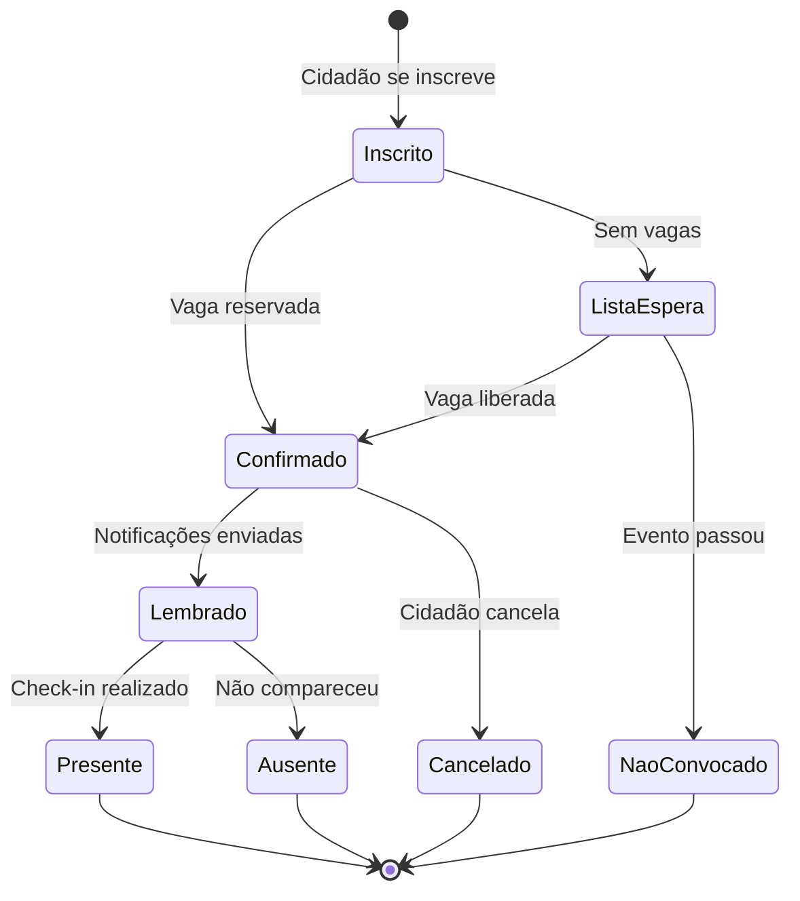
```mermaid
stateDiagram-v2
    [*] --> Inscrito: Cidadão se inscreve
    Inscrito --> Confirmado: Vaga reservada
    Confirmado --> Lembrado: Notificações enviadas
    Lembrado --> Presente: Check-in realizado
    Lembrado --> Ausente: Não compareceu
    Confirmado --> Cancelado: Cidadão cancela
    Inscrito --> ListaEspera: Sem vagas
    ListaEspera --> Confirmado: Vaga liberada
    ListaEspera --> NaoConvocado: Evento passou
    Presente --> [*]
    Ausente --> [*]
    Cancelado --> [*]
    NaoConvocado --> [*]
```

---

## 14. Fluxos de Integração

### 14.1 Visão Geral de Integrações

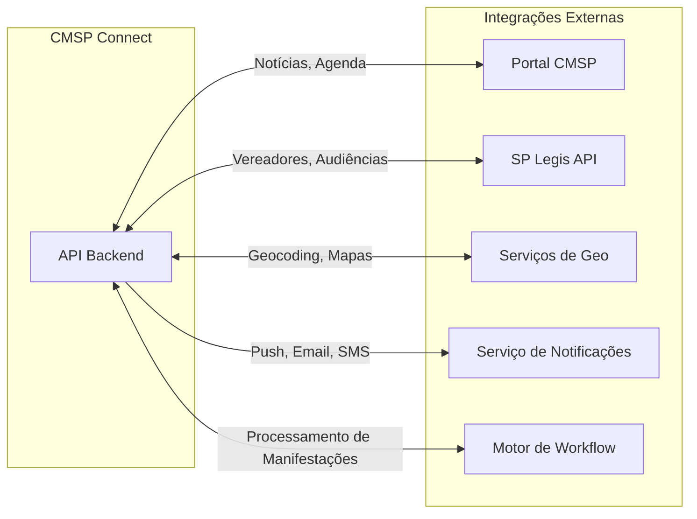
```mermaid
flowchart LR
    subgraph CMSP["CMSP Connect"]
        API[API Backend]
    end

    subgraph Externas["Integrações Externas"]
        Portal[Portal CMSP]
        SPLegis[SP Legis API]
        Geo[Serviços de Geo]
        Notif[Serviço de Notificações]
        Workflow[Motor de Workflow]
    end

    API <-->|Notícias, Agenda| Portal
    API <-->|Vereadores, Audiências| SPLegis
    API <-->|Geocoding, Mapas| Geo
    API -->|Push, Email, SMS| Notif
    API <-->|Processamento de Manifestações| Workflow
```

### 14.2 Fluxo de Integração - Workflow de Manifestações

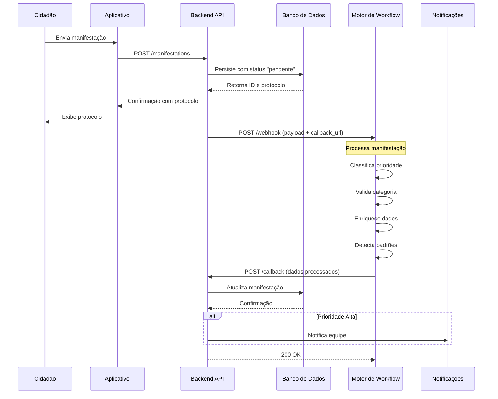
```mermaid
sequenceDiagram
    participant C as Cidadão
    participant App as Aplicativo
    participant API as Backend API
    participant DB as Banco de Dados
    participant WF as Motor de Workflow
    participant N as Notificações

    C->>App: Envia manifestação
    App->>API: POST /manifestations
    API->>DB: Persiste com status "pendente"
    DB-->>API: Retorna ID e protocolo
    API-->>App: Confirmação com protocolo
    App-->>C: Exibe protocolo

    API->>WF: POST /webhook (payload + callback_url)
    Note over WF: Processa manifestação
    WF->>WF: Classifica prioridade
    WF->>WF: Valida categoria
    WF->>WF: Enriquece dados
    WF->>WF: Detecta padrões

    WF->>API: POST /callback (dados processados)
    API->>DB: Atualiza manifestação
    DB-->>API: Confirmação
    
    alt Prioridade Alta
        API->>N: Notifica equipe
    end

    API-->>WF: 200 OK
```

### 14.3 Fluxo de Integração - Busca de Serviços Próximos

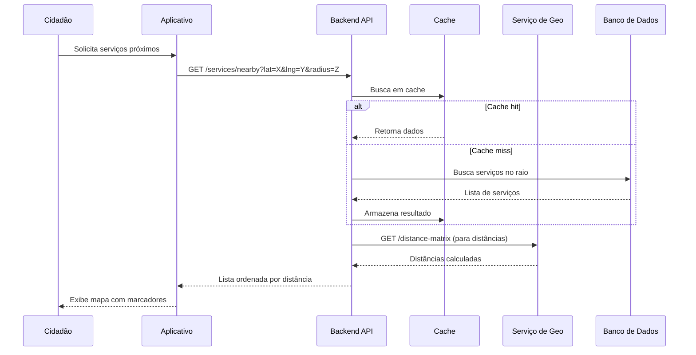
```mermaid
sequenceDiagram
    participant C as Cidadão
    participant App as Aplicativo
    participant API as Backend API
    participant Cache as Cache
    participant Geo as Serviço de Geo
    participant DB as Banco de Dados

    C->>App: Solicita serviços próximos
    App->>API: GET /services/nearby?lat=X&lng=Y&radius=Z

    API->>Cache: Busca em cache
    alt Cache hit
        Cache-->>API: Retorna dados
    else Cache miss
        API->>DB: Busca serviços no raio
        DB-->>API: Lista de serviços
        API->>Cache: Armazena resultado
    end

    API->>Geo: GET /distance-matrix (para distâncias)
    Geo-->>API: Distâncias calculadas

    API-->>App: Lista ordenada por distância
    App-->>C: Exibe mapa com marcadores
```

### 14.4 Fluxo de Integração - Autenticação

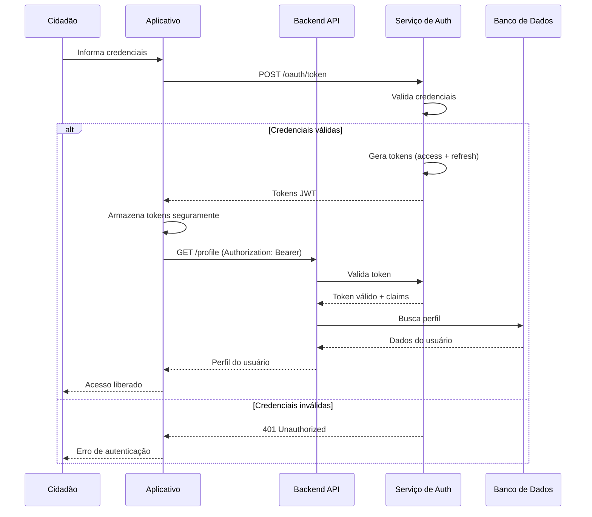
```mermaid
sequenceDiagram
    participant C as Cidadão
    participant App as Aplicativo
    participant API as Backend API
    participant Auth as Serviço de Auth
    participant DB as Banco de Dados

    C->>App: Informa credenciais
    App->>Auth: POST /oauth/token
    Auth->>Auth: Valida credenciais
    
    alt Credenciais válidas
        Auth->>Auth: Gera tokens (access + refresh)
        Auth-->>App: Tokens JWT
        App->>App: Armazena tokens seguramente
        App->>API: GET /profile (Authorization: Bearer)
        API->>Auth: Valida token
        Auth-->>API: Token válido + claims
        API->>DB: Busca perfil
        DB-->>API: Dados do usuário
        API-->>App: Perfil do usuário
        App-->>C: Acesso liberado
    else Credenciais inválidas
        Auth-->>App: 401 Unauthorized
        App-->>C: Erro de autenticação
    end
```

### 14.5 Tratamento de Erros em Integrações

| Integração | Erro | Tratamento | Fallback |
|------------|------|------------|----------|
| Workflow | Timeout | Retry com backoff exponencial (3x) | Fila de reprocessamento |
| Workflow | 5xx | Retry com backoff exponencial (3x) | Marcar como "pendente_manual" |
| Geo | Indisponível | Cache de última localização | Solicitar endereço manual |
| Geo | Quota excedida | Aguardar reset | Cache + entrada manual |
| Portal CMSP | Indisponível | Cache de conteúdo | Exibir dados em cache |
| SP Legis | Timeout | Retry (2x) | Dados em cache |
| Notificações | Falha | Retry + fila | Log para reenvio manual |

---

## 15. Cenários de Erro e Contingência

### 15.1 Matriz de Contingência

| Cenário | Impacto | Detecção | Resposta | Recuperação |
|---------|---------|----------|----------|-------------|
| GPS indisponível | Médio | Timeout API | Solicitar endereço | Geocodificação manual |
| Sem conexão | Alto | Network check | Modo offline | Sincronização posterior |
| API indisponível | Alto | Health check | Cache + retry | Failover automático |
| Workflow falha | Médio | Callback timeout | Fila de retry | Processamento manual |
| Auth service down | Crítico | Health check | Token em cache | Failover para backup |
| Banco indisponível | Crítico | Connection check | Read replica | Failover automático |
| Rate limit atingido | Baixo | 429 response | Backoff | Aguardar reset |

### 15.2 Modo Offline

**Funcionalidades Disponíveis Offline:**
- Visualização de dados em cache (perfil, histórico, favoritos)
- Rascunho de novas manifestações
- Consulta de informações institucionais cacheadas
- Visualização de mapa com tiles em cache

**Funcionalidades Indisponíveis Offline:**
- Envio de manifestações (enfileiradas para sync)
- Busca de serviços em tempo real
- Participação em audiências ao vivo
- Conversas com assistente IA

### 15.3 Fluxo de Sincronização Offline

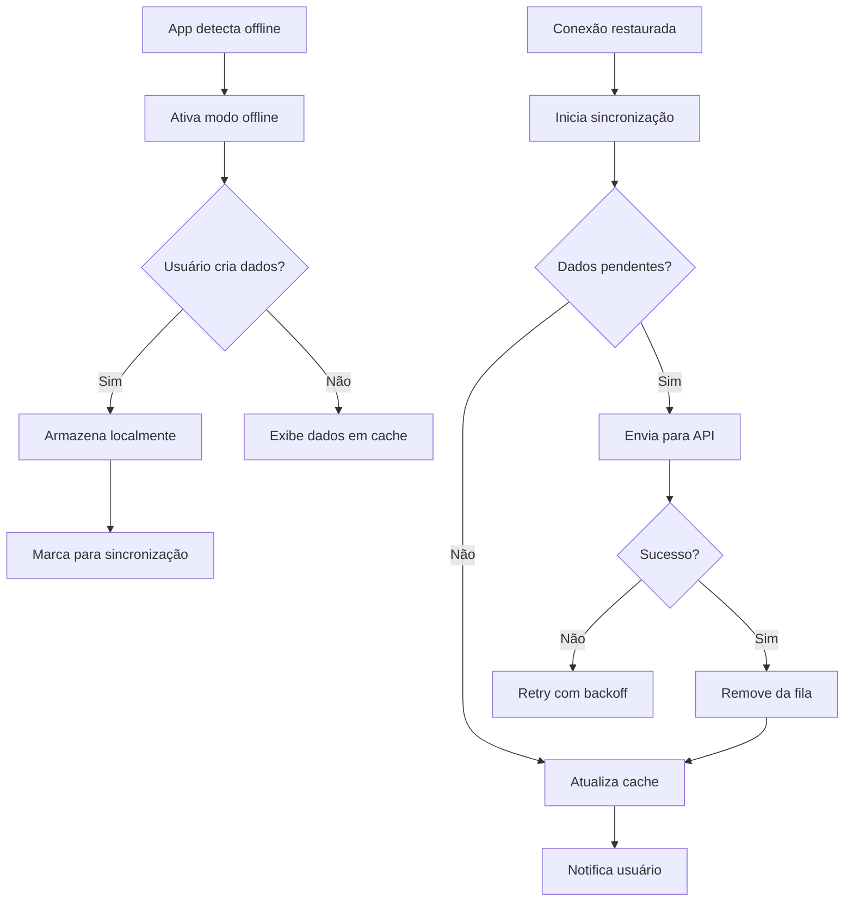
```mermaid
flowchart TD
    A[App detecta offline] --> B[Ativa modo offline]
    B --> C{Usuário cria dados?}
    C -->|Sim| D[Armazena localmente]
    D --> E[Marca para sincronização]
    C -->|Não| F[Exibe dados em cache]
    
    G[Conexão restaurada] --> H[Inicia sincronização]
    H --> I{Dados pendentes?}
    I -->|Sim| J[Envia para API]
    J --> K{Sucesso?}
    K -->|Sim| L[Remove da fila]
    K -->|Não| M[Retry com backoff]
    I -->|Não| N[Atualiza cache]
    L --> N
    N --> O[Notifica usuário]
```

---

## 16. Protocolos e Formatos

### 16.1 Formato de Protocolo

| Tipo | Formato | Exemplo | Descrição |
|------|---------|---------|-----------|
| Relato Urbano | URB-YYYY-NNNNNN | URB-2024-000123 | Sequencial por ano |
| Transporte | TRP-YYYY-NNNNNN | TRP-2024-000456 | Sequencial por ano |
| Avaliação | AVA-YYYY-NNNNNN | AVA-2024-000789 | Sequencial por ano |

### 16.2 Formato de Localização

```json
{
  "location_point": {
    "latitude": -23.550520,
    "longitude": -46.633308,
    "accuracy": 10.5,
    "source": "gps|manual|geocoding"
  },
  "address": {
    "street": "Viaduto Jacareí",
    "number": "100",
    "complement": "Sala 1",
    "neighborhood": "Bela Vista",
    "city": "São Paulo",
    "state": "SP",
    "zip_code": "01319-900",
    "reference_point": "Próximo à estação de metrô"
  }
}
```

### 16.3 Formato de Resposta da API

```json
{
  "success": true,
  "data": { },
  "meta": {
    "timestamp": "2024-12-01T10:30:00Z",
    "request_id": "uuid",
    "pagination": {
      "page": 1,
      "per_page": 20,
      "total": 150,
      "total_pages": 8
    }
  },
  "errors": []
}
```

### 16.4 Formato de Erro

```json
{
  "success": false,
  "data": null,
  "meta": {
    "timestamp": "2024-12-01T10:30:00Z",
    "request_id": "uuid"
  },
  "errors": [
    {
      "code": "VALIDATION_ERROR",
      "field": "description",
      "message": "Descrição deve ter no mínimo 30 caracteres",
      "details": {
        "min_length": 30,
        "current_length": 15
      }
    }
  ]
}
```

### 16.5 Formato de Payload do Workflow

```json
{
  "event": "urban_report_created",
  "version": "2.0",
  "timestamp": "2024-12-01T10:30:00Z",
  "report": {
    "id": "uuid",
    "protocol": "URB-2024-000123",
    "category": "via_publica",
    "subcategory": "buraco",
    "description": "...",
    "location": { },
    "photos": ["url1", "url2"],
    "severity_pending_classification": true
  },
  "user": {
    "id": "uuid",
    "name": "Nome do Cidadão",
    "neighborhood": "Bela Vista"
  },
  "orchestrator": {
    "source_tool": "create_urban_report",
    "conversation_id": "uuid"
  },
  "callback_url": "https://api.example.com/callback",
  "secret_key": "***"
}
```

---

## 17. Matriz de Rastreabilidade

### 17.1 Casos de Uso x Ferramentas IA

| Caso de Uso | Ferramenta Principal | Ferramentas Auxiliares |
|-------------|---------------------|------------------------|
| CSU001 - Acolhimento | get_citizen_history | search_knowledge_base |
| CSU002 - Audiências | search_audiencias | - |
| CSU003 - Navegação | search_knowledge_base | - |
| CSU004 - Avaliação | create_service_rating | find_nearby_services |
| CSU005 - Transporte | create_transport_report | suggest_council_member |
| CSU006 - Dashboard | N/A (consulta analítica) | - |
| CSU007 - Mapa | find_nearby_services | - |
| CSU008 - Relatos | create_urban_report | suggest_council_member |

### 17.2 Personas x Casos de Uso

| Caso de Uso | Cidadão | Engajado | Assessor | Vereador | Gestor | Admin |
|-------------|---------|----------|----------|----------|--------|-------|
| CSU001 | ✓ | ✓ | ✓ | ✓ | ✓ | ✓ |
| CSU002 | ✓ | ✓ | ✓ | ✓ | ✓ | ✓ |
| CSU003 | ✓ | ✓ | ✓ | ✓ | ✓ | ✓ |
| CSU004 | ✓ | ✓ | ✓ | ✓ | ✓ | ✓ |
| CSU005 | ✓ | ✓ | ✓ | ✓ | ✓ | ✓ |
| CSU006 | Parcial | Parcial | ✓ | ✓ | ✓ | ✓ |
| CSU007 | ✓ | ✓ | ✓ | ✓ | ✓ | ✓ |
| CSU008 | ✓ | ✓ | ✓ | ✓ | ✓ | ✓ |

### 17.3 Módulos x Integrações

| Módulo | Portal CMSP | SP Legis | Geo | Workflow | Notif |
|--------|-------------|----------|-----|----------|-------|
| Acolhimento | - | - | - | - | - |
| Relatos Urbanos | - | - | ✓ | ✓ | ✓ |
| Transporte | - | - | - | ✓ | ✓ |
| Avaliações | - | - | ✓ | - | ✓ |
| Audiências | ✓ | ✓ | - | - | ✓ |
| Institucional | ✓ | ✓ | - | - | - |
| Mapa | - | - | ✓ | - | - |
| Analytics | - | - | - | - | - |

---

## 18. Matriz RACI

### 18.1 Atividades de Desenvolvimento

| Atividade | PO | Tech Lead | Dev | QA | Design | Infra |
|-----------|----|-----------|----|----|----|------|
| Definição de requisitos | A | C | I | C | C | I |
| Design de UI/UX | C | C | I | I | R | I |
| Arquitetura técnica | C | A | R | I | I | C |
| Desenvolvimento frontend | I | A | R | C | C | I |
| Desenvolvimento backend | I | A | R | C | I | I |
| Desenvolvimento IA | C | A | R | C | I | I |
| Testes unitários | I | C | R | A | I | I |
| Testes de integração | I | C | C | R | I | I |
| Testes de aceitação | A | I | C | R | C | I |
| Deploy | I | A | C | C | I | R |
| Monitoramento | I | C | I | I | I | R |

**Legenda:**
- **R** = Responsável (executa)
- **A** = Aprovador (autoriza)
- **C** = Consultado
- **I** = Informado

### 18.2 Gestão de Incidentes

| Atividade | Suporte N1 | Suporte N2 | Dev | Infra | PO |
|-----------|-----------|-----------|-----|-------|-----|
| Receber incidente | R | I | I | I | I |
| Triagem inicial | R | I | I | I | I |
| Investigação técnica | C | R | C | C | I |
| Correção de código | I | C | R | I | I |
| Correção de infra | I | C | I | R | I |
| Comunicação ao usuário | R | I | I | I | A |
| Post-mortem | I | R | C | C | A |

---

## 19. Premissas e Restrições

### 19.1 Premissas

| ID | Premissa | Impacto se Falsa |
|----|----------|------------------|
| P1 | Cidadãos possuem smartphones com iOS 14+ ou Android 10+ | Redução de base de usuários |
| P2 | Câmara Municipal fornecerá APIs de integração | Funcionalidades limitadas |
| P3 | Usuários têm acesso à internet (3G mínimo) | Necessidade de modo offline robusto |
| P4 | Dados de serviços públicos são atualizados regularmente | Informações desatualizadas |
| P5 | Vereadores e assessores responderão encaminhamentos | Frustração dos cidadãos |
| P6 | LGPD será mantida na forma atual | Ajustes de compliance |
| P7 | Equipe terá acesso a serviços de geolocalização | Funcionalidade de mapa comprometida |

### 19.2 Restrições

| ID | Restrição | Tipo | Justificativa |
|----|-----------|------|---------------|
| R1 | Aplicativo híbrido (não nativo) | Técnica | Custo e manutenção |
| R2 | Hospedagem em infraestrutura de nuvem | Técnica | Escalabilidade |
| R3 | Conformidade com LGPD | Legal | Obrigação legal |
| R4 | Acessibilidade WCAG 2.1 AA | Legal/UX | Inclusão digital |
| R5 | Disponibilidade 99.5% | Operacional | SLA acordado |
| R6 | Dados sensíveis em território brasileiro | Legal | Soberania de dados |
| R7 | Integração apenas com APIs oficiais CMSP | Política | Dados autorizados |

### 19.3 Dependências Externas

| Dependência | Fornecedor | Criticidade | Plano B |
|-------------|-----------|-------------|---------|
| APIs de notícias e agenda | Portal CMSP | Média | Cache prolongado |
| APIs de vereadores e audiências | SP Legis | Alta | Dados estáticos |
| Serviço de geolocalização | Provedor a definir | Alta | Entrada manual |
| Serviço de mapas | Provedor a definir | Alta | Tiles offline |
| Serviço de notificações push | Provedor a definir | Média | Email fallback |
| Infraestrutura de nuvem | Provedor a definir | Crítica | Multi-cloud |

---

## 20. Métricas de Sucesso (KPIs)

### 20.1 KPIs de Adoção

| Métrica | Meta Ano 1 | Meta Ano 2 | Fonte |
|---------|-----------|-----------|-------|
| Downloads | 100.000 | 300.000 | App stores |
| Usuários ativos mensais (MAU) | 30.000 | 100.000 | Analytics |
| Taxa de retenção D30 | 25% | 35% | Analytics |
| NPS (Net Promoter Score) | 40 | 50 | Pesquisa |

### 20.2 KPIs de Engajamento

| Métrica | Meta | Fonte |
|---------|------|-------|
| Manifestações por mês | 5.000 | Banco de dados |
| Avaliações por mês | 10.000 | Banco de dados |
| Inscrições em audiências | 2.000/ano | Banco de dados |
| Conversas com IA por usuário/mês | 3 | Analytics |

### 20.3 KPIs de Qualidade

| Métrica | Meta | Fonte |
|---------|------|-------|
| Taxa de sucesso de manifestações | 95% | Banco de dados |
| Tempo médio de registro | < 3 min | Analytics |
| Taxa de encaminhamentos respondidos | 70% | Banco de dados |
| Satisfação com respostas IA | 80% positiva | Feedback |

### 20.4 KPIs Técnicos

| Métrica | Meta | Fonte |
|---------|------|-------|
| Disponibilidade | 99.5% | Monitoramento |
| Tempo de resposta P95 | < 200ms | APM |
| Taxa de erro | < 0.1% | Logs |
| Crash-free sessions | 99.9% | Crashlytics |

---

## 21. Glossário

| Termo | Definição |
|-------|-----------|
| **Audiência Pública** | Reunião aberta para discussão de temas legislativos com participação cidadã |
| **Câmara Explica** | Módulo educativo que explica conceitos legislativos em linguagem simples |
| **CMSP** | Câmara Municipal de São Paulo |
| **Drill-down** | Navegação analítica do geral para o específico |
| **Encaminhamento** | Vinculação de uma manifestação a um vereador para acompanhamento |
| **Manifestação** | Registro formal de demanda cidadã (relato, diagnóstico ou avaliação) |
| **Orquestrador** | Sistema de IA que coordena a interação e aciona ferramentas específicas |
| **Protocolo** | Código único de identificação de uma manifestação |
| **RAG** | Retrieval-Augmented Generation - técnica de IA que combina busca com geração |
| **RBAC** | Role-Based Access Control - controle de acesso baseado em papéis |
| **Relato Urbano** | Registro de problema em via pública, infraestrutura ou serviços |
| **RLS** | Row Level Security - controle de acesso a nível de registro no banco |
| **Tool** | Ferramenta específica acionada pelo orquestrador IA |
| **UBS** | Unidade Básica de Saúde |
| **Vereador** | Representante eleito no legislativo municipal |
| **Workflow** | Fluxo automatizado de processamento de manifestações |

---

## Controle de Versões

| Versão | Data | Autor | Alterações |
|--------|------|-------|------------|
| 1.0 | Nov/2024 | Equipe CMSP | Versão inicial |
| 2.0 | Dez/2024 | Equipe CMSP | Adição de arquitetura C4, modelo de dados, RNFs, regras de negócio, fluxos de integração |

---

*Este documento é propriedade da Câmara Municipal de São Paulo e contém informações confidenciais sobre o projeto CMSP Connect.*
