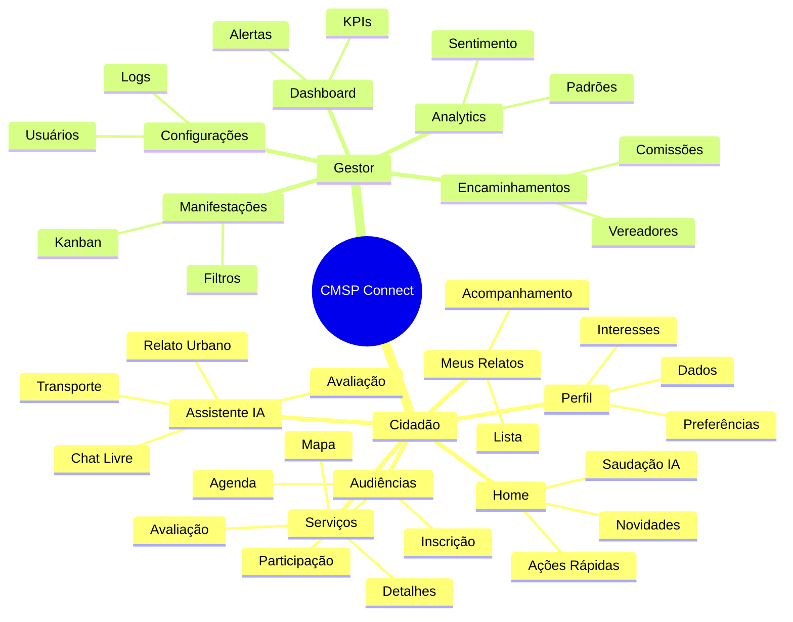
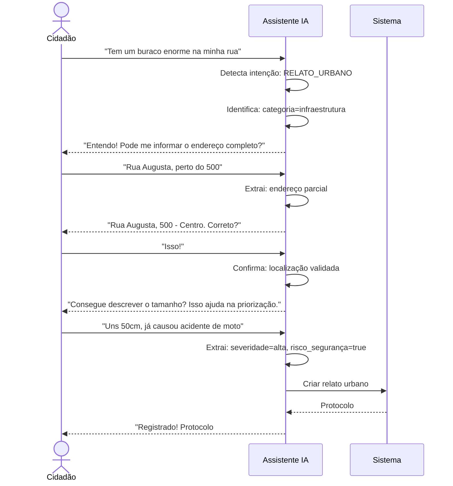
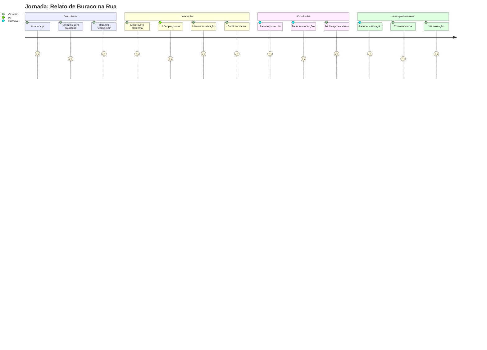
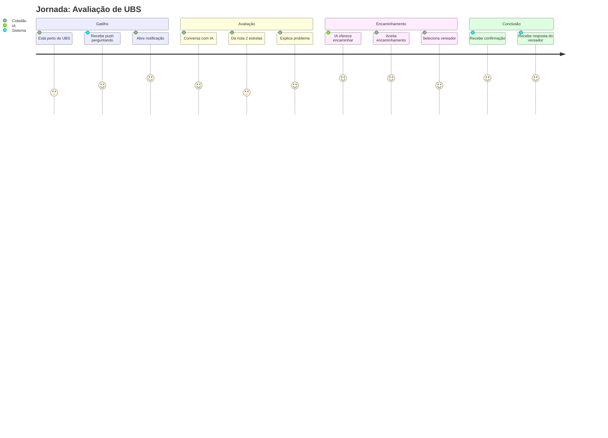
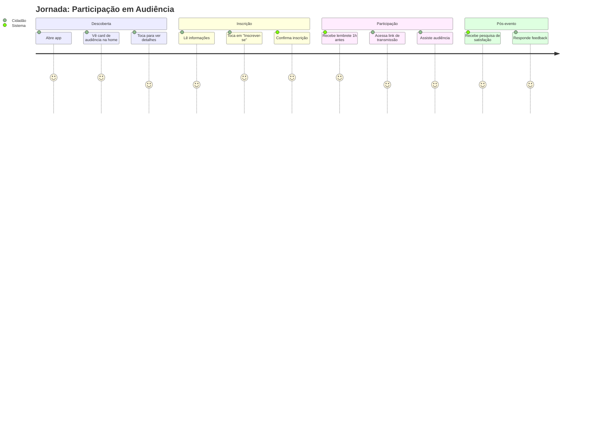
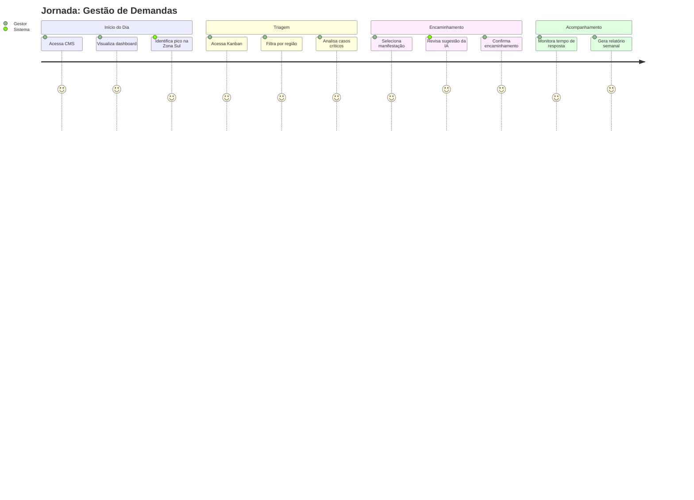
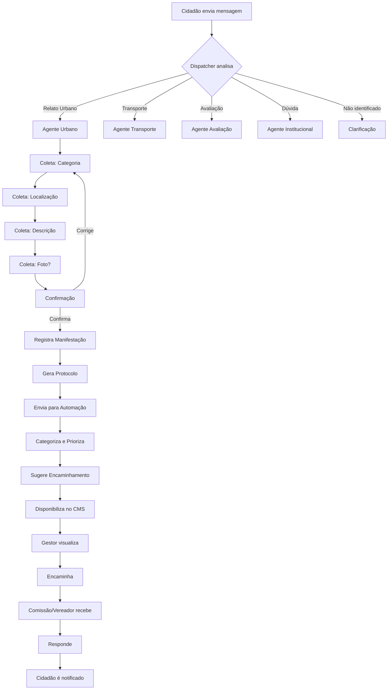
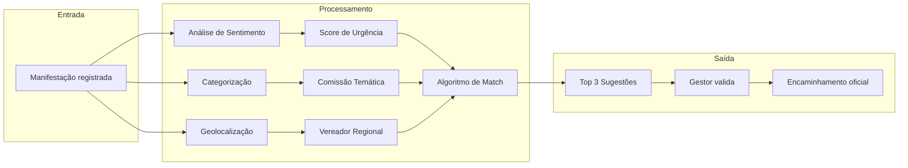
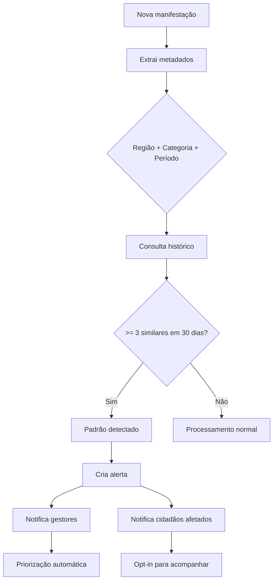

# Especificação de Escopo do Produto
## CMSP Connect - Aplicativo de Participação Cidadã

---

| **Informação** | **Valor** |
|----------------|-----------|
| **Projeto** | CMSP Connect |
| **Cliente** | Câmara Municipal de São Paulo (CMSP) |
| **Versão** | 2.0 |
| **Data** | Dezembro 2025 |
| **Classificação** | Documento de Escopo |
| **Status** | Aprovado para Desenvolvimento |

---

## Sumário

1. [Visão Executiva](#1-visão-executiva)
2. [Objetivos do Projeto](#2-objetivos-do-projeto)
3. [Público-Alvo e Personas](#3-público-alvo-e-personas)
4. [Estrutura do Produto (Sitemap)](#4-estrutura-do-produto-sitemap)
5. [Descrição Funcional dos Módulos](#5-descrição-funcional-dos-módulos)
6. [Jornadas de Usuário](#6-jornadas-de-usuário)
7. [Fluxos de Interação](#7-fluxos-de-interação)
8. [Regras de Negócio](#8-regras-de-negócio)
9. [Requisitos Não Funcionais](#9-requisitos-não-funcionais)
10. [Integrações Externas](#10-integrações-externas)
11. [Premissas e Restrições](#11-premissas-e-restrições)
12. [Critérios de Aceitação](#12-critérios-de-aceitação)
13. [Glossário](#13-glossário)

---

## 1. Visão Executiva

### 1.1 Contexto

A Câmara Municipal de São Paulo (CMSP) é uma das maiores casas legislativas da América Latina, representando mais de **12 milhões de cidadãos**. Historicamente, a comunicação entre munícipes e a instituição enfrenta barreiras significativas:

| Desafio | Impacto |
|---------|---------|
| **Complexidade institucional** | Cidadãos não compreendem o processo legislativo |
| **Fragmentação de canais** | Múltiplos pontos de contato sem integração |
| **Baixo engajamento** | Participação limitada a audiências presenciais |
| **Demandas não rastreáveis** | Relatos e reclamações perdem-se em processos manuais |
| **Ausência de inteligência analítica** | Decisões tomadas sem base em dados agregados |

### 1.2 Definição do Produto

O **CMSP Connect** é uma **plataforma móvel de participação cidadã** que utiliza Inteligência Artificial conversacional como interface principal para:

1. **Informar** — Replicar e consolidar notícias, agendas e conteúdos institucionais
2. **Dar voz** — Permitir expressão de demandas em linguagem natural
3. **Organizar** — Classificar, categorizar e priorizar manifestações automaticamente
4. **Conectar** — Direcionar demandas aos representantes e comissões adequadas
5. **Medir** — Gerar inteligência para tomada de decisão institucional

### 1.3 Proposta de Valor

```
┌─────────────────────────────────────────────────────────────────────────┐
│                          CMSP CONNECT                                    │
│                                                                          │
│   ┌──────────────┐        ┌──────────────────┐        ┌──────────────┐  │
│   │   CIDADÃO    │  ───►  │   ASSISTENTE IA  │  ───►  │    CÂMARA    │  │
│   │              │        │   + AUTOMAÇÃO    │        │   MUNICIPAL  │  │
│   └──────────────┘        └──────────────────┘        └──────────────┘  │
│                                    │                                     │
│                                    ▼                                     │
│                           ┌──────────────────┐                          │
│                           │   CMS GESTÃO     │                          │
│                           │   INTELIGENTE    │                          │
│                           └──────────────────┘                          │
└─────────────────────────────────────────────────────────────────────────┘
```

| Para Cidadãos | Para a Câmara Municipal |
|---------------|-------------------------|
| Comunicação direta e natural via chat | Visão unificada de todas as manifestações |
| Descoberta de serviços públicos próximos | Categorização automática por IA |
| Acompanhamento de demandas em tempo real | Priorização inteligente baseada em dados |
| Acesso simplificado a informações | Encaminhamento sugerido para comissões |
| Transparência do processo legislativo | Métricas de engajamento em tempo real |

### 1.4 Resultados Esperados

| Métrica | Meta | Baseline |
|---------|------|----------|
| Engajamento cidadão | **+300%** | Canais tradicionais |
| Tempo de triagem de manifestações | **-70%** | Processo manual atual |
| Taxa de resoluções efetivas | **+50%** | Encaminhamentos assertivos |
| Rastreabilidade de demandas | **100%** | Atualmente ~20% |
| Satisfação do usuário (NPS) | **≥ 50** | A ser medido |

---

## 2. Objetivos do Projeto

### 2.1 Objetivos de Negócio

| ID | Objetivo | Prioridade | Indicador de Sucesso |
|----|----------|------------|----------------------|
| OBJ-01 | Aumentar a participação cidadã nas atividades legislativas | **Alta** | +300% usuários ativos vs canal atual |
| OBJ-02 | Simplificar o acesso a informações institucionais | **Alta** | Tempo médio de tarefa < 2 min |
| OBJ-03 | Facilitar o registro e acompanhamento de manifestações | **Alta** | 100% rastreabilidade |
| OBJ-04 | Promover transparência nas ações da Câmara | **Alta** | Aumento de consultas legislativas |
| OBJ-05 | Gerar inteligência analítica para tomada de decisão | **Média** | Dashboards operacionais em uso |
| OBJ-06 | Conectar cidadãos a vereadores de forma efetiva | **Média** | Taxa de resposta > 60% |

### 2.2 Objetivos de Experiência do Usuário

| ID | Objetivo | Métrica |
|----|----------|---------|
| UX-01 | Interface conversacional como canal primário | 80% das interações via chat |
| UX-02 | Acessibilidade universal | Conformidade WCAG 2.1 AA |
| UX-03 | Linguagem cidadã | Índice Flesch ≥ 60 |
| UX-04 | Experiência mobile-first | 95% funcionalidades disponíveis |
| UX-05 | Tempo de aprendizado mínimo | Onboarding < 2 minutos |

### 2.3 Objetivos Técnicos

| ID | Objetivo | Especificação |
|----|----------|---------------|
| TEC-01 | Escalabilidade | Suportar 100.000+ usuários simultâneos |
| TEC-02 | Alta disponibilidade | 99.5% uptime mensal |
| TEC-03 | Performance | Tempo de resposta < 2s (P95) |
| TEC-04 | Segurança | Conformidade LGPD e OWASP Top 10 |
| TEC-05 | Extensibilidade | Arquitetura modular para evoluções |

---

## 3. Público-Alvo e Personas

### 3.1 Perfis de Acesso

| Perfil | Descrição | Canal | Permissões |
|--------|-----------|-------|------------|
| **Cidadão** | Munícipe de São Paulo | App Móvel | Criar manifestações, avaliar serviços, acompanhar demandas |
| **Vereador** | Parlamentar eleito | App/Web | Visualizar manifestações da base, responder encaminhamentos |
| **Assessor** | Equipe de apoio parlamentar | App/Web | Apoiar vereador na gestão de demandas |
| **Gestor** | Administrador CMSP | Web | Dashboard, gestão de encaminhamentos, relatórios |
| **Administrador** | Administrador técnico | Web | Configurações, logs, gestão de usuários |

### 3.2 Personas Detalhadas

#### Persona 1: Maria — Cidadã Ativa

| Aspecto | Descrição |
|---------|-----------|
| **Perfil** | 45 anos, moradora da Zona Sul, usa transporte público diariamente |
| **Contexto** | Trabalha como auxiliar administrativa, dois filhos em escola pública |
| **Motivação** | Reportar problemas que afetam sua comunidade de forma rápida |
| **Frustrações** | Formulários complexos, falta de retorno, burocracia |
| **Expectativa** | Interface simples, resposta em linguagem acessível, confirmação de recebimento |
| **Jornada típica** | Relatar buraco na rua → Acompanhar resolução → Avaliar serviço |

#### Persona 2: João — Cidadão Informacional

| Aspecto | Descrição |
|---------|-----------|
| **Perfil** | 28 anos, primeiro apartamento próprio, interesse em política local |
| **Contexto** | Desenvolvedor de software, busca entender como funcionam os serviços públicos |
| **Motivação** | Saber sobre audiências públicas, acompanhar vereadores do bairro |
| **Frustrações** | Não sabe por onde começar, informações fragmentadas |
| **Expectativa** | Conteúdo educativo, notificações relevantes, navegação intuitiva |
| **Jornada típica** | Explorar audiências → Inscrever-se → Participar remotamente |

#### Persona 3: Dr. Carlos — Gestor CMSP

| Aspecto | Descrição |
|---------|-----------|
| **Perfil** | 52 anos, coordenador de atendimento ao cidadão há 8 anos |
| **Contexto** | Recebe centenas de demandas por semana, equipe enxuta |
| **Motivação** | Ter visão consolidada, priorizar casos críticos, medir resultados |
| **Frustrações** | Volume alto, triagem manual, falta de métricas |
| **Expectativa** | Dashboard inteligente, automação de categorização, alertas |
| **Jornada típica** | Visualizar dashboard → Filtrar críticos → Encaminhar → Acompanhar |

#### Persona 4: Vereadora Ana — Parlamentar

| Aspecto | Descrição |
|---------|-----------|
| **Perfil** | 40 anos, primeiro mandato, base na Zona Leste |
| **Contexto** | Deseja ser acessível aos eleitores, agenda cheia |
| **Motivação** | Entender demandas da região, responder de forma ágil |
| **Frustrações** | Demandas chegam por múltiplos canais, difícil consolidar |
| **Expectativa** | Receber encaminhamentos qualificados, métricas da região |
| **Jornada típica** | Receber alerta → Visualizar demanda → Responder → Acompanhar resolução |

---

## 4. Estrutura do Produto (Sitemap)

### 4.1 Mapa Geral de Navegação

```
CMSP Connect
│
├── 🚀 Onboarding (Primeiro Acesso)
│   ├── Slide 1: Bem-vindo
│   ├── Slide 2: Assistente IA
│   ├── Slide 3: Serviços Próximos
│   └── Slide 4: Sua Voz Importa
│
├── 🏠 Home (Acolhimento Digital)
│   ├── Saudação Personalizada
│   ├── Carrossel de Novidades
│   ├── Próxima Audiência de Interesse
│   ├── Botões de Ação Rápida
│   └── Card de Completude do Perfil
│
├── 💬 Assistente IA (Chat)
│   ├── Histórico de Conversas
│   ├── Nova Conversa
│   ├── Jornadas Guiadas
│   │   ├── Relato Urbano
│   │   ├── Avaliação de Serviço
│   │   ├── Diagnóstico Transporte
│   │   └── Dúvidas Institucionais
│   └── Válvula de Escape
│
├── 🗺️ Serviços Públicos
│   ├── Mapa Interativo
│   ├── Lista por Tipo
│   ├── Detalhes do Serviço
│   │   ├── Informações
│   │   ├── Avaliações
│   │   └── Como Chegar
│   └── Avaliação Direta
│
├── 📋 Meus Relatos
│   ├── Lista de Manifestações
│   ├── Filtros (Status, Tipo, Data)
│   ├── Detalhes do Relato
│   │   ├── Histórico
│   │   ├── Atualizações
│   │   └── Comentários
│   └── Novo Relato (Manual)
│
├── 📅 Audiências Públicas
│   ├── Agenda (Futuras)
│   ├── Histórico (Passadas)
│   ├── Filtros (Tema, Data)
│   ├── Detalhes da Audiência
│   │   ├── Descrição
│   │   ├── Documentos
│   │   ├── Inscrição
│   │   └── Transmissão
│   └── Minhas Participações
│
├── 🔔 Notificações
│   ├── Todas
│   ├── Não Lidas
│   └── Configurações
│
├── 👤 Perfil
│   ├── Dados Pessoais
│   ├── Endereço
│   ├── Dados Demográficos (Opcional)
│   ├── Temas de Interesse
│   ├── Preferências de Comunicação
│   └── Configurações de Acessibilidade
│
├── ☰ Menu Institucional
│   ├── Agenda CMSP (→ Portal)
│   ├── Vereadores (→ Portal)
│   ├── Conheça a Câmara (→ Portal)
│   ├── Câmara Explica (→ Portal)
│   ├── Escola do Parlamento (→ Portal)
│   └── Notícias (→ Portal)
│
└── ⚙️ Área Administrativa (Web)
    ├── Dashboard
    │   ├── KPIs Principais
    │   ├── Gráficos de Tendência
    │   └── Alertas
    ├── Gestão de Manifestações
    │   ├── Kanban por Status
    │   ├── Lista com Filtros
    │   ├── Detalhes + Encaminhamento
    │   └── Histórico de Ações
    ├── Analytics
    │   ├── Análise de Sentimento
    │   ├── Padrões e Recorrências
    │   ├── Relatórios por Região
    │   └── Exportações
    ├── Encaminhamentos
    │   ├── Para Comissões
    │   ├── Para Vereadores
    │   └── Acompanhamento
    ├── Gestão de Usuários
    │   ├── Cidadãos
    │   ├── Gestores
    │   └── Permissões
    ├── Configurações
    │   ├── Integrações
    │   ├── Categorias
    │   └── Templates de Resposta
    └── Logs de Auditoria
```

### 4.2 Diagrama Visual do Sitemap



---

## 5. Descrição Funcional dos Módulos

### 5.1 Módulo: Acolhimento Digital (Home)

**Objetivo**: Recepcionar o cidadão de forma personalizada e orientá-lo às funcionalidades mais relevantes.

| Funcionalidade | Descrição | Prioridade |
|----------------|-----------|------------|
| **Saudação Contextual** | Mensagem personalizada baseada em horário e nome do usuário | Alta |
| **Carrossel de Novidades** | Até 3 cards com notícias/eventos legislativos relevantes | Média |
| **Audiência Sugerida** | Card da próxima audiência alinhada aos interesses do usuário | Alta |
| **Ações Rápidas** | Botões para iniciar relato, avaliar serviço, ver mapa, ver audiências | Alta |
| **Completude do Perfil** | Card incentivando preenchimento de dados faltantes | Baixa |
| **Onboarding** | Tutorial de 4 telas no primeiro acesso | Alta |

**Comportamento Esperado**:
- O onboarding é exibido apenas no primeiro acesso e pode ser "pulado"
- A saudação considera o contexto: horário, se há pendências, se há eventos próximos
- Os cards de novidades são atualizados dinamicamente a partir de fonte externa

---

### 5.2 Módulo: Assistente IA (Chatbot)

**Objetivo**: Oferecer interface conversacional natural como canal primário de interação.

> ⚠️ **Requisito de Cliente**: A interface de chat é o ponto central do aplicativo. O cidadão deve poder expressar qualquer demanda em linguagem natural.

#### 5.2.1 Características do Assistente

| Característica | Especificação |
|----------------|---------------|
| **Nome** | Luana (Assistente CMSP) |
| **Tom de Voz** | Empático, claro, institucional porém acessível |
| **Idioma** | Português brasileiro coloquial |
| **Personalidade** | Solícita, paciente, proativa |

#### 5.2.2 Capacidades

| Capacidade | Descrição |
|------------|-----------|
| **Compreensão de Intenção** | Classificar automaticamente o que o cidadão deseja |
| **Coleta Conversacional** | Obter informações via perguntas naturais, não formulários |
| **Contextualização** | Manter histórico da conversa e dados do usuário |
| **Citação de Fontes** | Sempre indicar origem de informações oficiais |
| **Confirmação** | Validar dados antes de registrar manifestações |
| **Válvula de Escape** | Oferecer caminhos alternativos quando não compreender |

#### 5.2.3 Arquitetura de Agentes

O sistema utiliza **múltiplos agentes especializados** para melhor precisão:

```
┌───────────────────────────────────────────────────────────────────┐
│                      DISPATCHER (Classificador)                   │
│        Analisa a mensagem e direciona ao agente correto           │
└───────────────────────────────────────────────────────────────────┘
                                    │
         ┌──────────────┬───────────┼───────────┬──────────────┐
         ▼              ▼           ▼           ▼              ▼
    ┌─────────┐   ┌─────────┐ ┌─────────┐ ┌─────────┐   ┌─────────┐
    │AUDIÊNCIA│   │AVALIAÇÃO│ │ URBANO  │ │TRANSPORT│   │INSTITUT.│
    │         │   │         │ │         │ │         │   │         │
    │Inscriçõs│   │Serviços │ │ Relatos │ │ Ônibus  │   │ Câmara  │
    │Datas    │   │Notas    │ │ Fotos   │ │ Metrô   │   │Vereadors│
    │Temas    │   │Feedback │ │Localiz. │ │ Padrões │   │Comissões│
    └─────────┘   └─────────┘ └─────────┘ └─────────┘   └─────────┘
```

| Agente | Domínio | Gatilhos de Ativação |
|--------|---------|----------------------|
| **Audiências** | Audiências públicas | "audiência", "participar", "evento", "pauta" |
| **Avaliação** | Serviços públicos | "avaliar", "nota", "reclamar de UBS/escola" |
| **Urbano** | Infraestrutura | "buraco", "lixo", "poste", "calçada", "rua" |
| **Transporte** | Mobilidade | "ônibus", "metrô", "lotado", "atrasou" |
| **Institucional** | Câmara Municipal | "vereador", "comissão", "projeto de lei" |

#### 5.2.4 Fluxo de Coleta Conversacional



---

### 5.3 Módulo: Audiências Públicas

**Objetivo**: Conectar cidadãos às audiências públicas da Câmara Municipal.

| Funcionalidade | Descrição | Prioridade |
|----------------|-----------|------------|
| **Listagem** | Exibir audiências futuras e passadas | Alta |
| **Filtros** | Por tema, data, status (aberta/encerrada) | Alta |
| **Detalhes** | Tema, descrição, data/hora, local, documentos | Alta |
| **Inscrição** | Inscrever-se em audiências presenciais | Alta |
| **Transmissão** | Link para acompanhar audiências virtuais | Alta |
| **Notificação** | Lembrete antes de audiências inscritas | Alta |
| **Histórico** | Registro de participações do usuário | Média |

**Dados da Audiência**:
- Título
- Tema/Comissão responsável
- Data e hora
- Local (físico ou virtual)
- Descrição
- Documentos anexos (pauta, apresentações)
- Status (programada, em andamento, encerrada)
- Vagas disponíveis (se presencial)
- Link de transmissão (se virtual)

---

### 5.4 Módulo: Avaliação de Serviços Públicos

**Objetivo**: Coletar feedback estruturado sobre equipamentos públicos.

| Funcionalidade | Descrição | Prioridade |
|----------------|-----------|------------|
| **Avaliação via Chat** | Coletar nota e comentário em conversa | Alta |
| **Escala de Nota** | 1 a 5 estrelas | Alta |
| **Comentário** | Campo livre para feedback | Alta |
| **Análise de Sentimento** | Classificar automaticamente o tom | Alta |
| **Anonimato** | Opção de não identificar o usuário | Alta |
| **Encaminhamento** | Oferecer direcionar a vereador se nota ≤ 2 | Alta |
| **Agregação** | Exibir média de avaliações por serviço | Alta |

**Tipos de Serviço Avaliáveis**:
| Tipo | Descrição |
|------|-----------|
| UBS | Unidade Básica de Saúde |
| Hospital | Hospital municipal |
| Escola Municipal | Ensino fundamental |
| CEU | Centro Educacional Unificado |
| Biblioteca | Biblioteca pública |
| Centro Esportivo | Equipamento de lazer |

---

### 5.5 Módulo: Relatos Urbanos

**Objetivo**: Registrar problemas de infraestrutura urbana de forma guiada.

| Funcionalidade | Descrição | Prioridade |
|----------------|-----------|------------|
| **Registro via Chat** | Coleta conversacional de dados | Alta |
| **Categorização Automática** | IA classifica tipo de problema | Alta |
| **Geolocalização** | Captura automática ou manual | Alta |
| **Fotos** | Anexar imagens (opcional) | Alta |
| **Severidade** | Cálculo automático de prioridade | Alta |
| **Protocolo** | Geração de número único | Alta |
| **Acompanhamento** | Status atualizado em tempo real | Alta |
| **Interações Sociais** | Comentários e apoios de outros cidadãos | Baixa |
| **Formulário Manual** | Alternativa ao chat | Média |

**Categorias de Relatos**:
| Categoria | Exemplos | Comissão Sugerida |
|-----------|----------|-------------------|
| Infraestrutura | Buraco, calçada, obra parada | Política Urbana |
| Iluminação | Poste apagado, lâmpada queimada | Serviços Públicos |
| Limpeza | Lixo, entulho, coleta irregular | Serviços Públicos |
| Meio Ambiente | Poda, poluição, alagamento | Meio Ambiente |
| Segurança | Área perigosa, iluminação precária | Segurança Pública |
| Acessibilidade | Rampa quebrada, falta piso tátil | Direitos Humanos |

---

### 5.6 Módulo: Diagnóstico de Transporte

**Objetivo**: Registrar e analisar problemas do transporte público.

| Funcionalidade | Descrição | Prioridade |
|----------------|-----------|------------|
| **Registro via Chat** | Coleta conversacional | Alta |
| **Identificação de Linha** | Busca por número ou nome | Alta |
| **Tipo de Problema** | Classificação automática | Alta |
| **Horário e Local** | Data, hora e ponto/estação | Alta |
| **Severidade** | Cálculo de impacto | Alta |
| **Detecção de Padrões** | Identificar recorrências | Alta |
| **Alertas** | Notificar usuário sobre padrões | Média |
| **Encaminhamento** | Direcionar à Comissão de Transportes | Alta |

**Tipos de Problema de Transporte**:
| Categoria | Exemplos |
|-----------|----------|
| Atrasos | Ônibus não passou, intervalo longo |
| Lotação | Superlotação, não conseguiu embarcar |
| Infraestrutura | Ponto danificado, falta de abrigo |
| Atendimento | Má conduta do motorista |
| Acessibilidade | Elevador quebrado, rampa indisponível |
| Segurança | Assalto, assédio |

---

### 5.7 Módulo: Mapa de Serviços Públicos

**Objetivo**: Visualizar e descobrir equipamentos públicos próximos.

| Funcionalidade | Descrição | Prioridade |
|----------------|-----------|------------|
| **Mapa Interativo** | Visualização geográfica | Alta |
| **Geolocalização** | Centralizar na posição do usuário | Alta |
| **Raio de Busca** | Configurar distância (500m a 5km) | Alta |
| **Filtros por Tipo** | UBS, escola, hospital, etc. | Alta |
| **Marcadores** | Ícones diferenciados por tipo | Alta |
| **Card de Detalhes** | Nome, endereço, telefone, avaliação | Alta |
| **Rotas** | Traçar caminho até o local | Média |
| **Avaliação Rápida** | Avaliar diretamente do card | Alta |

---

### 5.8 Módulo: Notificações

**Objetivo**: Manter o cidadão informado sobre eventos relevantes.

| Funcionalidade | Descrição | Prioridade |
|----------------|-----------|------------|
| **Push Notifications** | Alertas no dispositivo | Alta |
| **Centro de Notificações** | Lista dentro do app | Alta |
| **Tipos** | Audiências, atualizações de relatos, respostas | Alta |
| **Janela de Horário** | Respeitar período 8h-20h | Alta |
| **Configurações** | Ativar/desativar por categoria | Média |
| **Leitura** | Marcar como lida | Baixa |

**Tipos de Notificação**:
| Tipo | Gatilho |
|------|---------|
| Audiência | Lembrete 24h/1h antes de evento inscrito |
| Relato | Mudança de status da manifestação |
| Resposta | Vereador/comissão respondeu encaminhamento |
| Sistema | Manutenções, novidades do app |

---

### 5.9 Módulo: Perfil do Usuário

**Objetivo**: Gerenciar dados pessoais e preferências.

| Funcionalidade | Descrição | Prioridade |
|----------------|-----------|------------|
| **Dados Pessoais** | Nome, telefone, foto | Alta |
| **Endereço** | CEP, rua, número, bairro | Alta |
| **Dados Demográficos** | Idade, gênero, raça (opcional) | Média |
| **Temas de Interesse** | Seleção múltipla | Alta |
| **Preferências** | Notificações, visibilidade | Média |
| **Acessibilidade** | Alto contraste, fonte grande | Alta |
| **Indicador de Completude** | Barra de progresso | Baixa |

---

### 5.10 Módulo: Área Administrativa (CMS)

**Objetivo**: Gerenciar manifestações e gerar inteligência analítica.

#### 5.10.1 Dashboard

| Componente | Descrição |
|------------|-----------|
| **KPIs Principais** | Total de relatos, taxa de resolução, tempo médio |
| **Gráficos de Tendência** | Evolução temporal de manifestações |
| **Mapa de Calor** | Concentração geográfica de relatos |
| **Alertas** | Padrões detectados, picos de demanda |
| **Sentimento Geral** | Gauge de satisfação média |

#### 5.10.2 Gestão de Manifestações

| Funcionalidade | Descrição |
|----------------|-----------|
| **Kanban** | Visualização por status (Novo, Em Análise, Encaminhado, Resolvido) |
| **Filtros** | Categoria, região, período, severidade, status |
| **Busca** | Por protocolo, texto, usuário |
| **Detalhes** | Histórico completo, anexos, conversas |
| **Ações** | Alterar status, encaminhar, responder |

#### 5.10.3 Analytics

| Relatório | Métricas |
|-----------|----------|
| **Por Categoria** | Distribuição, tendência, resolução |
| **Por Região** | Mapa, ranking de bairros |
| **Por Período** | Comparativo temporal |
| **Sentimento** | Análise de polaridade |
| **Padrões** | Recorrências detectadas |
| **Tempo de Resposta** | SLA por categoria/região |

#### 5.10.4 Encaminhamentos

| Funcionalidade | Descrição |
|----------------|-----------|
| **Sugestão Automática** | IA sugere comissão/vereador |
| **Match Score** | Percentual de aderência |
| **Envio** | Direcionar à comissão ou parlamentar |
| **Acompanhamento** | Status do encaminhamento |
| **Histórico** | Registro de ações anteriores |

#### 5.10.5 Exportações

| Formato | Conteúdo |
|---------|----------|
| CSV | Dados tabulares completos |
| Excel | Relatórios formatados |
| PDF | Relatórios executivos |

---

## 6. Jornadas de Usuário

### 6.1 Jornada 1: Cidadão Reporta Problema Urbano



**Etapas Detalhadas**:

| Etapa | Ator | Ação | Sistema |
|-------|------|------|---------|
| 1 | Cidadão | Abre o app | Exibe home com saudação personalizada |
| 2 | Cidadão | Toca em "Conversar" ou envia mensagem | Ativa assistente IA |
| 3 | Cidadão | "Tem um buraco na minha rua" | IA detecta intenção RELATO_URBANO |
| 4 | IA | Pergunta endereço | Aguarda resposta |
| 5 | Cidadão | Informa "Rua Augusta, 500" | IA extrai e valida localização |
| 6 | IA | Pergunta detalhes | "Consegue descrever o tamanho?" |
| 7 | Cidadão | "50cm, já causou acidente" | IA detecta severidade ALTA |
| 8 | IA | Confirma dados | "Buraco na Rua Augusta, 500. Correto?" |
| 9 | Cidadão | Confirma | Sistema registra manifestação |
| 10 | Sistema | Gera protocolo | Exibe card de sucesso + nº protocolo |
| 11 | Sistema | Processa em background | Categoriza, prioriza, sugere encaminhamento |
| 12 | Cidadão | (Dias depois) | Recebe push de atualização |
| 13 | Cidadão | Abre app, consulta "Meus Relatos" | Visualiza status atualizado |

---

### 6.2 Jornada 2: Cidadão Avalia Serviço Público



**Etapas Detalhadas**:

| Etapa | Ator | Ação | Sistema |
|-------|------|------|---------|
| 1 | Sistema | Detecta proximidade de UBS visitada | Agenda notificação |
| 2 | Sistema | Envia push após saída | "Como foi sua visita à UBS [Nome]?" |
| 3 | Cidadão | Toca na notificação | Abre conversa com contexto |
| 4 | IA | Pergunta como foi | "Me conta: atendimento foi bom?" |
| 5 | Cidadão | "Péssimo, esperei 3 horas" | IA detecta sentimento NEGATIVO |
| 6 | IA | Solicita nota | "De 1 a 5, que nota você dá?" |
| 7 | Cidadão | "2" | Sistema registra avaliação |
| 8 | IA | Oferece encaminhamento | "Quer que eu direcione isso a um vereador?" |
| 9 | Cidadão | "Sim" | Sistema lista vereadores sugeridos |
| 10 | Cidadão | Seleciona vereador | Sistema cria encaminhamento |
| 11 | Sistema | Confirma | "Encaminhado! Você será notificado." |
| 12 | (Futuro) | Vereador responde | Cidadão recebe notificação |

---

### 6.3 Jornada 3: Cidadão Participa de Audiência Pública



---

### 6.4 Jornada 4: Gestor Gerencia Manifestações



---

## 7. Fluxos de Interação

### 7.1 Fluxo Principal: Registro de Manifestação via Chat



### 7.2 Fluxo de Encaminhamento Inteligente



### 7.3 Fluxo de Detecção de Padrões



---

## 8. Regras de Negócio

### 8.1 Regras Gerais

| ID | Regra | Justificativa |
|----|-------|---------------|
| RN-01 | Toda manifestação deve receber protocolo único | Rastreabilidade |
| RN-02 | Manifestações devem ser categorizadas automaticamente | Eficiência operacional |
| RN-03 | Análise de sentimento deve ser executada em todas as manifestações | Priorização |
| RN-04 | Dados devem ser atualizados de fontes externas a cada 15 minutos | Atualidade |
| RN-05 | Logs de auditoria devem registrar todas as ações administrativas | Compliance |

### 8.2 Regras de Atendimento (Chatbot)

| ID | Regra | Especificação |
|----|-------|---------------|
| RN-10 | IA deve citar fontes oficiais | Toda informação institucional deve indicar origem |
| RN-11 | IA deve confirmar dados antes de registrar | Usuário deve aprovar resumo da manifestação |
| RN-12 | IA deve oferecer válvula de escape | Se não compreender após 2 tentativas, oferecer alternativas |
| RN-13 | Respostas devem usar linguagem acessível | Índice Flesch ≥ 60 |
| RN-14 | IA não deve inventar informações | Apenas dados verificáveis de fontes oficiais |

### 8.3 Regras de Encaminhamento

| ID | Regra | Especificação |
|----|-------|---------------|
| RN-20 | Sugestão de encaminhamento deve considerar categoria | Match com comissões temáticas |
| RN-21 | Sugestão deve considerar região do cidadão | Match com vereadores de base |
| RN-22 | Score mínimo de match para sugestão | ≥ 60% de aderência |
| RN-23 | Encaminhamento requer aprovação de gestor | Não é automático |
| RN-24 | Histórico de atuação do vereador influencia match | Parlamentares com histórico na área têm prioridade |

### 8.4 Regras de Dados e Privacidade

| ID | Regra | Especificação |
|----|-------|---------------|
| RN-30 | Dados demográficos são opcionais | Nunca obrigatórios |
| RN-31 | Dados demográficos só para análises agregadas | Nunca expostos individualmente |
| RN-32 | Avaliações podem ser anônimas | Opção do usuário |
| RN-33 | Dados de localização com retenção limitada | Máximo 90 dias para histórico detalhado |
| RN-34 | Consentimento explícito para notificações | Push requer opt-in |

### 8.5 Regras de Notificações

| ID | Regra | Especificação |
|----|-------|---------------|
| RN-40 | Janela de silêncio | Notificações apenas entre 8h e 20h |
| RN-41 | Limite diário | Máximo 10 notificações/dia |
| RN-42 | Urgências ignoram janela | Alertas críticos podem ser enviados a qualquer hora |
| RN-43 | Usuário pode desativar por categoria | Controle granular |

### 8.6 Regras de Priorização

| ID | Regra | Fórmula |
|----|-------|---------|
| RN-50 | Score de prioridade | (Sentimento × 0.25) + (Urgência × 0.30) + (Recorrência × 0.20) + (Impacto × 0.25) |
| RN-51 | Prioridade Crítica | Score ≥ 80 |
| RN-52 | Prioridade Alta | Score 60-79 |
| RN-53 | Prioridade Média | Score 40-59 |
| RN-54 | Prioridade Baixa | Score < 40 |

### 8.7 Regras de Acesso

| ID | Regra | Perfis |
|----|-------|--------|
| RN-60 | Acesso ao app móvel | Cidadão, Vereador, Assessor |
| RN-61 | Acesso ao CMS | Gestor, Administrador |
| RN-62 | Encaminhamento de manifestações | Gestor, Administrador |
| RN-63 | Gestão de usuários | Administrador |
| RN-64 | Visualização de logs de auditoria | Administrador |
| RN-65 | Exportação de dados | Gestor, Administrador |

---

## 9. Requisitos Não Funcionais

### 9.1 Performance

| ID | Requisito | Métrica | Prioridade |
|----|-----------|---------|------------|
| RNF-01 | Tempo de carregamento inicial | ≤ 3s em 4G | Alta |
| RNF-02 | Tempo de resposta de APIs | ≤ 2s (P95) | Alta |
| RNF-03 | Tempo de primeira resposta da IA | ≤ 5s | Alta |
| RNF-04 | Streaming de respostas | Tokens exibidos progressivamente | Alta |
| RNF-05 | Usuários simultâneos | ≥ 100.000 | Alta |

### 9.2 Disponibilidade

| ID | Requisito | Métrica | Prioridade |
|----|-----------|---------|------------|
| RNF-10 | Uptime mensal | ≥ 99.5% | Alta |
| RNF-11 | RTO (Recovery Time Objective) | ≤ 4 horas | Alta |
| RNF-12 | RPO (Recovery Point Objective) | ≤ 1 hora | Alta |
| RNF-13 | Backup de dados | Diário, retenção 30 dias | Alta |

### 9.3 Segurança

| ID | Requisito | Especificação | Prioridade |
|----|-----------|---------------|------------|
| RNF-20 | Criptografia em trânsito | TLS 1.3 | Alta |
| RNF-21 | Criptografia em repouso | AES-256 | Alta |
| RNF-22 | Autenticação | JWT com expiração | Alta |
| RNF-23 | Autorização | RBAC | Alta |
| RNF-24 | Proteção contra OWASP Top 10 | Validações implementadas | Alta |
| RNF-25 | Rate limiting | Por IP e por usuário | Alta |
| RNF-26 | Logs de auditoria | Todas ações administrativas | Alta |

### 9.4 Acessibilidade

| ID | Requisito | Especificação | Prioridade |
|----|-----------|---------------|------------|
| RNF-30 | Conformidade WCAG | 2.1 nível AA | Alta |
| RNF-31 | Contraste de cores | Mínimo 4.5:1 | Alta |
| RNF-32 | Navegação por teclado | 100% funcionalidades | Alta |
| RNF-33 | Leitores de tela | Labels semânticos | Alta |
| RNF-34 | Ajuste de fonte | Suporte a zoom 200% | Alta |
| RNF-35 | Modo escuro | Opcional | Média |

### 9.5 Usabilidade

| ID | Requisito | Especificação | Prioridade |
|----|-----------|---------------|------------|
| RNF-40 | Linguagem | Índice Flesch ≥ 60 | Alta |
| RNF-41 | Onboarding | ≤ 4 telas | Alta |
| RNF-42 | Tarefa principal | ≤ 3 toques | Alta |
| RNF-43 | Mobile-first | Design responsivo | Alta |
| RNF-44 | Offline básico | Cache de dados essenciais | Média |

### 9.6 Compatibilidade

| ID | Requisito | Especificação | Prioridade |
|----|-----------|---------------|------------|
| RNF-50 | Android | Versão 8.0+ | Alta |
| RNF-51 | iOS | Versão 14+ | Alta |
| RNF-52 | Navegadores (CMS) | Chrome, Firefox, Safari, Edge (últimas 2 versões) | Alta |
| RNF-53 | Resolução mínima | 320px (mobile) | Alta |

---

## 10. Integrações Externas

### 10.1 Integrações Obrigatórias

| Sistema | Propósito | Direção | Prioridade |
|---------|-----------|---------|------------|
| **SP Legis API** | Dados legislativos (vereadores, comissões, projetos) | Consumo | Alta |
| **Provedor de Mapas** | Visualização e geolocalização | Consumo | Alta |
| **Provedor de IA** | Processamento de linguagem natural | Consumo | Alta |
| **Orquestrador de Workflows** | Automação de processos e categorização | Bidirecional | Alta |
| **Serviço de Push** | Notificações no dispositivo | Consumo | Alta |
| **WordPress CMSP** | Conteúdo institucional (notícias, eventos) | Consumo | Média |

### 10.2 Especificação de Integrações

#### SP Legis API

| Aspecto | Especificação |
|---------|---------------|
| **Dados consumidos** | Vereadores, comissões, audiências, projetos de lei |
| **Frequência de sync** | A cada 15 minutos |
| **Fallback** | Cache local com TTL de 1 hora |
| **Autenticação** | API Key |

#### Provedor de Mapas

| Aspecto | Especificação |
|---------|---------------|
| **Funcionalidades** | Mapas, geocoding, rotas |
| **Requisitos** | Suporte a tiles, markers customizados |
| **Limite de uso** | Monitorar quota |

#### Provedor de IA

| Aspecto | Especificação |
|---------|---------------|
| **Modelos necessários** | Chat, embeddings, análise de sentimento |
| **Latência máxima** | 5s para primeira resposta |
| **Fallback** | Mensagem padrão + escalonamento |
| **Requisitos** | Suporte a português brasileiro |

#### Orquestrador de Workflows

| Aspecto | Especificação |
|---------|---------------|
| **Eventos enviados** | Criação de manifestação, atualização de status |
| **Eventos recebidos** | Dados enriquecidos, categorização validada |
| **Formato** | JSON via webhooks |
| **Autenticação** | Secret key |

---

## 11. Premissas e Restrições

### 11.1 Premissas

| ID | Premissa | Impacto se Falsa |
|----|----------|------------------|
| P-01 | SP Legis API estará disponível e documentada | Bloqueio de funcionalidades legislativas |
| P-02 | CMSP fornecerá lista atualizada de equipamentos públicos | Mapa incompleto |
| P-03 | Usuários possuem smartphone com internet móvel | Redução de alcance |
| P-04 | CMSP terá equipe para operar o CMS | Manifestações não processadas |
| P-05 | Vereadores/assessores responderão encaminhamentos | Frustração do cidadão |
| P-06 | Orçamento para IA generativa estará disponível | Degradação de UX |

### 11.2 Restrições

| ID | Restrição | Justificativa |
|----|-----------|---------------|
| R-01 | Aplicativo móvel nativo (não PWA) | Garantir notificações e performance |
| R-02 | Hospedagem em nuvem pública com conformidade governamental | Requisitos de compliance |
| R-03 | Chatbot como interface primária | Requisito do cliente |
| R-04 | Integração com orquestrador específico do cliente | Competência existente na equipe |
| R-05 | Conformidade LGPD | Requisito legal |
| R-06 | Acessibilidade WCAG 2.1 AA | Requisito legal e ético |

### 11.3 Exclusões de Escopo

| Item Excluído | Justificativa |
|---------------|---------------|
| Rastreamento GPS contínuo | Privacidade e consumo de bateria |
| Integração direta com SPTrans/Metrô | Complexidade, usar relatos |
| Votação em enquetes | Fora do escopo de MVP |
| Gamificação | Fase posterior |
| Suporte a outros idiomas | MVP apenas português |
| Aplicativo desktop | Mobile-first |

---

## 12. Critérios de Aceitação

### 12.1 Critérios Funcionais

| Módulo | Critério | Teste |
|--------|----------|-------|
| **Chat** | Usuário consegue registrar relato urbano via conversa | E2E: conversa completa |
| **Chat** | IA classifica corretamente 80% das intenções | Testes com corpus de frases |
| **Audiências** | Usuário consegue se inscrever em audiência | E2E: fluxo completo |
| **Mapa** | Serviços são exibidos no raio selecionado | Testes de geolocalização |
| **CMS** | Gestor consegue encaminhar manifestação | E2E: fluxo administrativo |
| **Notificações** | Push é entregue em menos de 1 minuto | Teste de latência |

### 12.2 Critérios de Performance

| Métrica | Critério | Ferramenta |
|---------|----------|------------|
| Carregamento inicial | ≤ 3s (P95) | Lighthouse, WebPageTest |
| Tempo de API | ≤ 2s (P95) | APM, logs |
| Tempo de IA | ≤ 5s primeira resposta | Logs, métricas |

### 12.3 Critérios de Segurança

| Aspecto | Critério | Verificação |
|---------|----------|-------------|
| OWASP Top 10 | Sem vulnerabilidades críticas/altas | Pentest |
| LGPD | Conformidade com checklist | Auditoria |
| Dados sensíveis | Criptografados em repouso | Verificação técnica |

### 12.4 Critérios de Acessibilidade

| Aspecto | Critério | Ferramenta |
|---------|----------|------------|
| WCAG 2.1 AA | 100% conformidade | Axe, WAVE |
| Contraste | Mínimo 4.5:1 | Verificação manual |
| Screen reader | Navegação completa | Testes com NVDA/VoiceOver |

---

## 13. Glossário

| Termo | Definição |
|-------|-----------|
| **Audiência Pública** | Reunião aberta para discussão de temas legislativos com participação cidadã |
| **Comissão Permanente** | Grupo temático de vereadores responsável por área específica |
| **Dispatcher** | Componente que classifica e direciona mensagens aos agentes especializados |
| **Encaminhamento** | Direcionamento de manifestação a vereador ou comissão |
| **Equipamento Público** | Instalação de serviço público (UBS, escola, etc.) |
| **LGPD** | Lei Geral de Proteção de Dados Pessoais (Lei 13.709/2018) |
| **Manifestação** | Registro de demanda cidadã (relato, avaliação, reclamação) |
| **Match Score** | Percentual de aderência entre manifestação e parlamentar/comissão |
| **NPS** | Net Promoter Score - métrica de satisfação |
| **Onboarding** | Processo de introdução ao aplicativo no primeiro acesso |
| **Protocolo** | Número único de identificação de manifestação |
| **RAG** | Retrieval-Augmented Generation - técnica de IA |
| **RLS** | Row Level Security - segurança em nível de linha |
| **SP Legis** | Sistema de informações legislativas da CMSP |
| **Sub-agente** | Módulo especializado de IA para domínio específico |
| **Válvula de Escape** | Mecanismo para oferecer alternativas quando IA não compreende |
| **WCAG** | Web Content Accessibility Guidelines - diretrizes de acessibilidade |

---

## Histórico de Versões

| Versão | Data | Autor | Alterações |
|--------|------|-------|------------|
| 1.0 | Dez/2025 | Equipe CMSP Connect | Versão inicial |
| 2.0 | Dez/2025 | Revisão Técnica | Consolidação e refinamento pós-auditoria |

---

**Fim do Documento**
