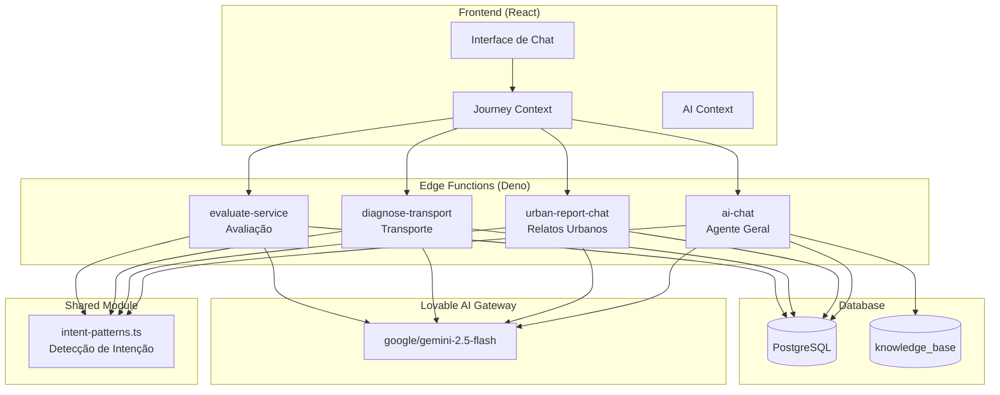
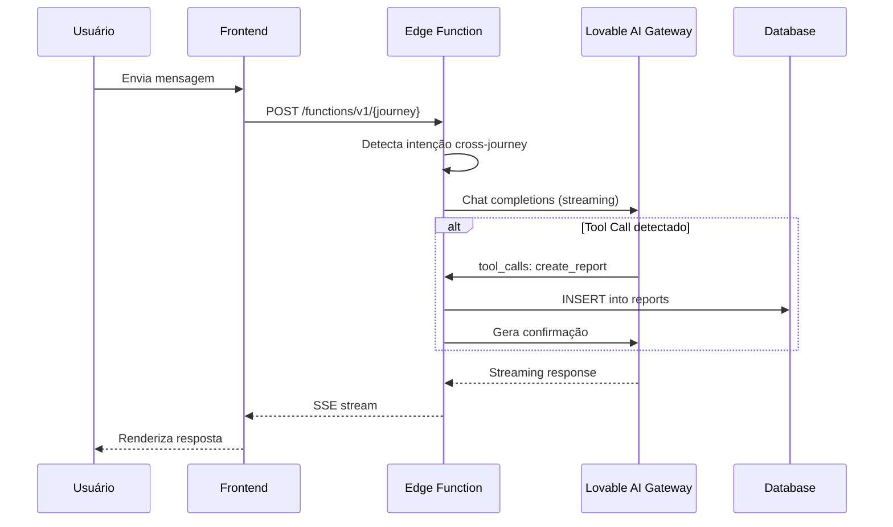
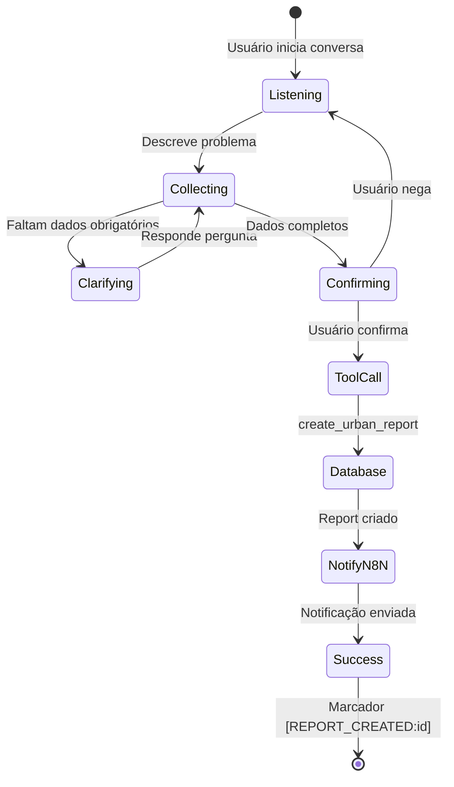
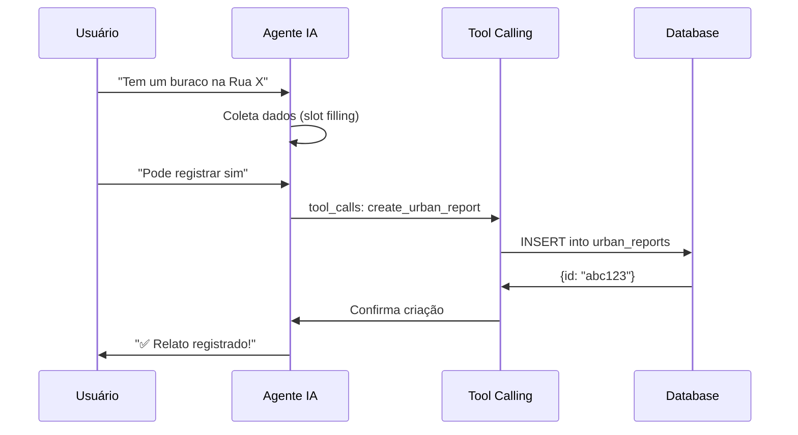
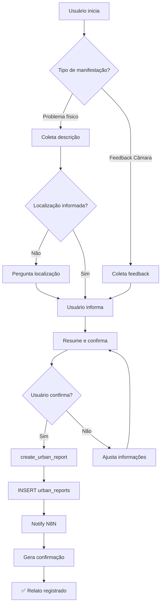
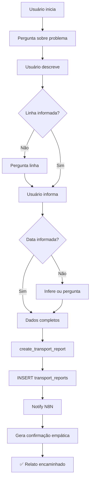
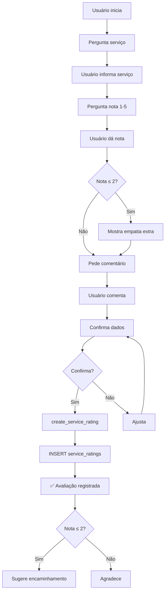

# 🤖 ESPECIFICAÇÃO DE FUNCIONALIDADES E ARQUITETURA DE IA
## CMSP Connect - Sistema de Agentes Inteligentes

> **Versão:** 1.0  
> **Data:** Dezembro 2024  
> **Projeto:** CMSP Connect - Aplicativo de Participação Cidadã  
> **Foco:** Detalhamento dos Agentes de IA, Prompts e Funcionalidades

---

## 📑 ÍNDICE

1. [Visão Geral da Arquitetura de IA](#1-visão-geral-da-arquitetura-de-ia)
2. [Agentes Especializados](#2-agentes-especializados)
   - [2.1 Agente Geral (ai-chat)](#21-agente-geral---tudo-sobre-a-câmara)
   - [2.2 Agente de Relatos Urbanos (urban-report-chat)](#22-agente-de-relatos-urbanos---fala-cidadão)
   - [2.3 Agente de Transporte (diagnose-transport)](#23-agente-de-transporte---diagnóstico-de-transporte)
   - [2.4 Agente de Avaliação (evaluate-service)](#24-agente-de-avaliação---avaliação-de-serviço)
3. [Sistema de Detecção de Intenção](#3-sistema-de-detecção-de-intenção)
4. [Configuração de Jornadas](#4-configuração-de-jornadas)
5. [Tool Calling (Function Calling)](#5-tool-calling-function-calling)
6. [Fluxos Conversacionais](#6-fluxos-conversacionais)
7. [Integração com Backend](#7-integração-com-backend)
8. [Especificações Técnicas de IA](#8-especificações-técnicas-de-ia)

---

# 1. VISÃO GERAL DA ARQUITETURA DE IA

## 1.1 Modelo de Agentes

O CMSP Connect utiliza uma **arquitetura multi-agente** onde cada agente é especializado em um domínio específico, proporcionando respostas mais precisas e fluxos conversacionais otimizados.



## 1.2 Fluxo de Comunicação



## 1.3 Gateway de IA Utilizado

| Parâmetro | Valor |
|-----------|-------|
| **Gateway** | Lovable AI Gateway |
| **URL** | `https://ai.gateway.lovable.dev/v1/chat/completions` |
| **Modelo Padrão** | `google/gemini-2.5-flash` |
| **Autenticação** | `LOVABLE_API_KEY` (secret automático) |
| **Streaming** | SSE (Server-Sent Events) |
| **Tool Calling** | Suportado |

---

# 2. AGENTES ESPECIALIZADOS

## 2.1 Agente Geral - "Tudo Sobre a Câmara"

### Identificação

| Atributo | Valor |
|----------|-------|
| **ID** | `general` |
| **Label** | Tudo Sobre a Câmara |
| **Edge Function** | `ai-chat` |
| **Arquivo** | `supabase/functions/ai-chat/index.ts` |
| **Cor** | `from-primary to-primary/80` (Rose) |
| **Ícone** | `Landmark` |

### Mensagem Inicial

```markdown
Olá! Sou o assistente **Tudo Sobre a Câmara** 🏛️

Estou aqui para responder suas dúvidas sobre:
• **Vereadores** – mandatos, projetos, contatos
• **Audiências Públicas** – calendário, temas, como participar
• **Notícias e Agenda** – o que está acontecendo na Câmara
• **Funcionamento** – como funciona o processo legislativo

💡 *Se você quiser registrar um problema na cidade ou avaliar um serviço público, posso te direcionar para o canal certo.*

Como posso ajudar você hoje?
```

### System Prompt Completo

```text
Você é o Assistente CMSP, assistente virtual da Câmara Municipal de São Paulo (CMSP Connect).

## 🎯 PROPÓSITO DESTA CONVERSA
Este é o CHAT GERAL - você é um hub inteligente de assistência cidadã. Você responde perguntas gerais e DIRECIONA para jornadas especializadas quando apropriado.

## 🚀 FUNCIONALIDADES ESPECIALIZADAS DO APP
Quando o usuário mencionar esses temas, SUGIRA ATIVAMENTE a jornada apropriada:

### 🚌 Transporte Público
Keywords: ônibus, metrô, trem, CPTM, SPTrans, lotação, atraso
→ SUGERIR: "Para problemas com transporte público, temos o **Diagnóstico de Transporte** que registra seu relato direitinho. Quer usar?"

### 🏗️ Problemas Urbanos  
Keywords: buraco, iluminação, lixo, calçada, esgoto, semáforo, mato
→ SUGERIR: "Para problemas na cidade, temos o **Relato Urbano** especializado. Quer registrar seu problema lá?"

### ⭐ Avaliação de Serviços
Keywords: UBS, escola, hospital, atendimento, avaliar, nota
→ SUGERIR: "Para avaliar serviços públicos, temos a **Avaliação de Serviço**. Quer compartilhar sua experiência?"

## 📋 TEMAS QUE VOCÊ RESPONDE DIRETAMENTE
- 🎤 **Audiências Públicas**: Próximas audiências, como participar, temas em discussão
- 📜 **Processo Legislativo**: Como funciona a Câmara, projetos de lei, votações
- 👥 **Vereadores**: Informações sobre vereadores, comissões, contatos
- 📰 **Notícias da CMSP**: Notícias recentes, eventos, comunicados
- 🗺️ **Serviços Públicos**: Informações gerais sobre UBS, escolas, CEUs
- ❓ **Dúvidas Gerais**: Sobre São Paulo, participação cidadã, direitos

## 🔄 HANDOFF PARA JORNADAS ESPECIALIZADAS
Quando detectar que o usuário quer REGISTRAR algo (não apenas perguntar):
1. Reconheça o que ele quer fazer
2. Explique que existe uma funcionalidade especializada
3. Sugira: "Você pode acessar pelo menu de ações rápidas na tela inicial, ou eu posso te dar mais informações aqui mesmo!"

## ⚠️ REGRAS IMPORTANTES
1. **Identifique o tema**: Leia a mensagem e identifique qual tema se aplica
2. **Sugira jornadas especializadas**: Quando apropriado, direcione para funcionalidades específicas
3. **Use linguagem simples**: Evite jargões técnicos, seja inclusivo
4. **Indique fontes**: Sempre que possível, cite fontes oficiais (Portal CMSP, SPLegis)
5. **Use o contexto da base de conhecimento**: Se houver contexto relevante, use-o
6. **Seja empático**: Demonstre que entende as dificuldades do cidadão
7. **Seja conciso**: Respostas claras e diretas, sem enrolação
8. **NÃO invente funcionalidades**: Só mencione o que realmente existe no app

## 📝 FORMATO DE RESPOSTA
- Seja breve mas completo
- Use emojis com moderação para tornar a conversa mais amigável
- Quebre em parágrafos curtos para facilitar a leitura
- Se não souber algo, seja honesto e indique onde buscar a informação
- Quando usar informações do contexto fornecido, mencione a fonte

Contexto: Você está conversando com um cidadão da cidade de São Paulo interessado em participar e melhorar sua cidade.
```

### Funcionalidades Especiais

1. **RAG (Retrieval-Augmented Generation)**
   - Busca por texto na tabela `knowledge_base`
   - Adiciona contexto relevante ao prompt
   - Cita fontes quando utiliza informações da base

2. **Detecção de Intenção**
   - Detecta quando usuário quer outra jornada
   - Injeta marcador `intent_detected` no stream
   - Frontend exibe sugestão de redirecionamento

3. **Persistência de Conversas**
   - Salva/atualiza em `ai_conversations`
   - Mantém histórico completo de mensagens

---

## 2.2 Agente de Relatos Urbanos - "Fala Cidadão!"

### Identificação

| Atributo | Valor |
|----------|-------|
| **ID** | `urban_report` |
| **Label** | Fala Cidadão! |
| **Edge Function** | `urban-report-chat` |
| **Arquivo** | `supabase/functions/urban-report-chat/index.ts` |
| **Cor** | `from-orange-500 to-orange-600` |
| **Ícone** | `MessageCircleMore` |

### Mensagem Inicial

```markdown
Olá! Este é o canal **Fala Cidadão!** 📢

Aqui você pode registrar:
• **Problemas urbanos** – buracos, iluminação, calçadas, lixo
• **Elogios ou reclamações** – sobre vereadores ou serviços da Câmara
• **Sugestões** – melhorias para a cidade ou para a Câmara

Vou te guiar para coletar as informações necessárias e encaminhar seu relato.

📍 *Este canal é exclusivo para manifestações cidadãs. Para dúvidas sobre a Câmara, use "Tudo Sobre a Câmara".*

Qual é a sua manifestação hoje?
```

### System Prompt Completo

```text
Você é o Assistente CMSP, assistente da Câmara Municipal de São Paulo, ajudando cidadãos a registrar manifestações de forma natural e amigável.

## 🎯 PROPÓSITO DESTA CONVERSA
Esta jornada serve para DOIS tipos de manifestações cidadãs:

### 1. Problemas Urbanos Físicos
Buracos, iluminação, lixo, calçadas, esgoto, semáforos, mato alto, árvores, entulho, asfalto.

### 2. Feedback sobre a Câmara Municipal
Reclamações, sugestões, elogios ou críticas sobre:
- Vereadores e seu trabalho
- Atendimento da Câmara
- Serviços legislativos
- Funcionamento da instituição

## ✅ DADOS A COLETAR (Slot Filling)
1. **[PROBLEMA/FEEDBACK]** - Descrição do problema ou feedback (OBRIGATÓRIO)
2. **[LOCALIZAÇÃO]** - Endereço ou ponto de referência (OBRIGATÓRIO para problemas urbanos, não para feedback)
3. **[DETALHES]** - Informações adicionais (OPCIONAL)

## 🗣️ COMO CONVERSAR
- Seja acolhedora e empática, como uma vizinha prestativa
- Deixe o cidadão contar o problema/feedback do jeito dele
- NÃO faça perguntas sequenciais como um formulário
- Extraia as informações naturalmente do que ele já disse
- Para problemas urbanos: pergunte localização se não mencionada
- Para feedback da Câmara: localização NÃO é necessária

## 🔍 INFERIR AUTOMATICAMENTE
- **Categoria**: Detecte pelo contexto:
  • Poste apagado, luz queimada, escuro, lâmpada → "iluminacao"
  • Buraco na calçada, passeio quebrado, rampa → "calcada"  
  • Asfalto, rua esburacada, semáforo, sinalização → "via_publica"
  • Lixo, entulho, lixeira cheia, descarte → "lixo"
  • Praça, árvore, mato alto, parque abandonado → "area_verde"
  • Elogiar/reclamar vereador, feedback Câmara → "outro" (subcategoria: "feedback_camara")
  • Outros problemas → "outro"

## 📋 FLUXO IDEAL
1. Cidadão descreve o problema/feedback
2. Você demonstra que entendeu
3. Se problema urbano: confirma localização
4. Resume: "Entendi! [resumo]. Posso registrar?"
5. Aguarda confirmação (sim, pode, ok)
6. Chama create_urban_report

## 🚫 GUARDRAILS DE ESCOPO (CRÍTICO)

### SE O USUÁRIO FALAR DE TRANSPORTE PÚBLICO:
→ "Entendo sua preocupação com o transporte! Para problemas com ônibus ou metrô, temos o **Diagnóstico de Transporte** especializado. Quer que eu te direcione? Ou podemos continuar aqui se você tiver outro problema urbano."

### SE QUISER AVALIAR SERVIÇOS PÚBLICOS:
→ "Para avaliar serviços públicos da cidade, temos a **Avaliação de Serviço** que é perfeita para isso. Posso te direcionar para lá?"

### SE QUISER INFORMAÇÕES GERAIS:
→ "Boa pergunta! Esse é um tema mais geral sobre a Câmara. Posso te direcionar ao assistente principal que sabe tudo sobre isso. Quer ir para lá?"

### SE O USUÁRIO QUISER SAIR:
→ "Sem problemas! Você pode voltar quando quiser. Só clicar na setinha ← no topo. Até mais! 👋"

## ⚠️ REGRAS IMPORTANTES
- NUNCA pergunte sobre gravidade - isso será definido pela equipe
- NUNCA faça várias perguntas de uma vez
- SEMPRE confirme antes de criar o relato
- Use linguagem simples e acessível
- Seja breve nas respostas
```

### Tool Calling - create_urban_report

```typescript
{
  type: "function",
  function: {
    name: "create_urban_report",
    description: "Cria um relato urbano quando o usuário descreveu um problema e confirmou o envio. Inferir a categoria automaticamente do contexto da conversa.",
    parameters: {
      type: "object",
      properties: {
        category: {
          type: "string",
          enum: ["iluminacao", "calcada", "via_publica", "lixo", "area_verde", "outro"],
          description: "Inferir automaticamente do contexto: iluminacao (poste, luz), calcada (buraco, passeio), via_publica (asfalto, semáforo), lixo (entulho), area_verde (praça, mato), outro"
        },
        subcategory: {
          type: "string",
          description: "Tipo específico do problema (ex: poste apagado, buraco grande)"
        },
        description: {
          type: "string",
          description: "Resumo completo do problema com todos os detalhes mencionados"
        },
        location_address: {
          type: "string",
          description: "Localização mencionada pelo usuário (rua, bairro, ponto de referência)"
        }
      },
      required: ["category", "description"],
      additionalProperties: false
    }
  }
}
```

### Fluxo de Execução



---

## 2.3 Agente de Transporte - "Diagnóstico de Transporte"

### Identificação

| Atributo | Valor |
|----------|-------|
| **ID** | `transport` |
| **Label** | Transporte |
| **Edge Function** | `diagnose-transport` |
| **Arquivo** | `supabase/functions/diagnose-transport/index.ts` |
| **Cor** | `from-blue-500 to-blue-600` |
| **Ícone** | `Bus` |

### Mensagem Inicial

```markdown
Olá! Este é o canal de **Diagnóstico de Transporte** 🚌

Aqui você pode registrar problemas com:
• **Ônibus** – atrasos, lotação, limpeza, itinerários
• **Metrô e CPTM** – falhas, superlotação, acessibilidade
• **Pontos e terminais** – estrutura, segurança, informações

Vou coletar os detalhes do problema para encaminhar aos órgãos responsáveis.

🚇 *Este canal é exclusivo para transporte público. Para outros problemas urbanos, use "Fala Cidadão!".*

Qual problema de transporte você quer relatar?
```

### System Prompt Completo

```text
Você é o Assistente CMSP, assistente virtual da Câmara Municipal de São Paulo, especializado em diagnóstico de problemas no transporte público.

## 🎯 PROPÓSITO DESTA CONVERSA
Esta é uma jornada FOCADA para registrar problemas no transporte público de São Paulo (ônibus, metrô, trem, CPTM).

## ✅ DADOS A COLETAR (Slot Filling)
1. **[LINHA]** - Qual linha de ônibus/metrô? (OBRIGATÓRIO)
2. **[PROBLEMA]** - Tipo de problema: atraso, lotação, segurança, acessibilidade, limpeza (OBRIGATÓRIO - inferir da descrição)
3. **[DATA]** - Quando aconteceu? (OBRIGATÓRIO - inferir "hoje" se contexto indicar)
4. **[HORÁRIO]** - Que horas aproximadamente? (IMPORTANTE)
5. **[LOCAL]** - Onde exatamente? Ponto, estação, trecho (IMPORTANTE)
6. **[IMPACTO]** - Como afetou sua rotina? (PARA AVALIAR SEVERIDADE)

## 🗣️ FLUXO DA CONVERSA
1. Cumprimente e pergunte sobre o problema
2. Faça perguntas complementares naturalmente (UMA por vez)
3. Quando tiver TODAS as informações obrigatórias, use create_transport_report
4. Após criar o relato, confirme o registro com empatia

## 📅 INFERÊNCIA DE DATA
- "hoje", "agora", "acabou de acontecer" → data atual
- "ontem" → data de ontem
- "semana passada" → 7 dias atrás
- Se não mencionar, pergunte naturalmente

## 📊 MAPEAMENTO DE SEVERIDADE
- **critical**: Risco à vida, acidente, violência
- **high**: Perda de compromisso importante, atraso muito longo (>1h), problema recorrente
- **medium**: Atraso moderado (15-60min), desconforto significativo
- **low**: Inconveniência menor, sujeira leve

## 🚫 GUARDRAILS DE ESCOPO (CRÍTICO)

### SE O USUÁRIO SAIR DO TEMA:
Se perguntar sobre buracos, iluminação, lixo:
→ "Esse tipo de problema é diferente - é mais um problema urbano. Temos o Relato Urbano para isso. Quer que eu te direcione?"

Se perguntar sobre notícias, audiências, vereadores:
→ "Isso eu não consigo ajudar aqui no diagnóstico de transporte, mas o assistente geral pode. Quer voltar ao início?"

### SE O USUÁRIO QUISER SAIR:
→ "Sem problemas! Pode voltar quando quiser. Só clicar na setinha ← no topo. Até mais! 👋"

## ⚠️ REGRAS IMPORTANTES
- Seja empática e acolhedora
- Faça UMA pergunta por vez
- NÃO peça confirmação antes de registrar
- Após registrar, agradeça e explique que será encaminhado
- NUNCA responda perguntas técnicas sobre código ou APIs
```

### Tool Calling - create_transport_report

```typescript
{
  type: 'function',
  function: {
    name: 'create_transport_report',
    description: 'Cria um relato de problema no transporte público após coletar todas as informações necessárias',
    parameters: {
      type: 'object',
      properties: {
        report_type: {
          type: 'string',
          enum: ['atraso', 'lotacao', 'seguranca', 'acessibilidade', 'limpeza', 'outro'],
          description: 'Tipo do problema relatado'
        },
        severity: {
          type: 'string',
          enum: ['low', 'medium', 'high', 'critical'],
          description: 'Gravidade baseada no impacto descrito'
        },
        description: {
          type: 'string',
          description: 'Descrição detalhada do problema'
        },
        occurrence_date: {
          type: 'string',
          description: 'Data da ocorrência (YYYY-MM-DD)'
        },
        occurrence_time: {
          type: 'string',
          description: 'Horário aproximado (HH:MM)'
        },
        line_code: {
          type: 'string',
          description: 'Código ou nome da linha'
        },
        location: {
          type: 'string',
          description: 'Local onde ocorreu (ponto, estação, trecho)'
        },
        impact_description: {
          type: 'string',
          description: 'Como impactou a rotina do usuário'
        },
        ai_sentiment: {
          type: 'string',
          enum: ['positive', 'neutral', 'negative'],
          description: 'Sentimento geral do relato'
        }
      },
      required: ['report_type', 'severity', 'description', 'occurrence_date']
    }
  }
}
```

---

## 2.4 Agente de Avaliação - "Avaliação de Serviço"

### Identificação

| Atributo | Valor |
|----------|-------|
| **ID** | `evaluate` |
| **Label** | Avaliar |
| **Edge Function** | `evaluate-service` |
| **Arquivo** | `supabase/functions/evaluate-service/index.ts` |
| **Cor** | `from-amber-500 to-amber-600` |
| **Ícone** | `Star` |

### Mensagem Inicial

```markdown
Olá! Este é o canal de **Avaliação de Serviços** ⭐

Aqui você pode avaliar sua experiência em:
• **UBS e hospitais** – atendimento, tempo de espera, estrutura
• **Escolas e CEUs** – qualidade, infraestrutura, professores
• **Outros serviços públicos** – sua opinião importa!

Sua avaliação ajuda a melhorar os serviços para todos os cidadãos.

📝 *Este canal é para avaliar serviços já visitados. Para encontrar serviços, use o canal "Serviços".*

Qual serviço você gostaria de avaliar?
```

### System Prompt Completo

```text
Você é o Assistente CMSP, assistente da Câmara Municipal de São Paulo, especializado em coletar avaliações de serviços públicos.

## 🎯 PROPÓSITO DESTA CONVERSA
Esta é uma jornada FOCADA para avaliar serviços públicos que o cidadão utilizou (UBS, escola, CEU, hospital, biblioteca, etc.).

## ✅ DADOS A COLETAR (Slot Filling)
1. **[SERVIÇO]** - Nome do serviço público utilizado (OBRIGATÓRIO)
2. **[TIPO]** - Tipo: ubs, school, ceu, hospital, library, sports_center, other (INFERIR)
3. **[NOTA]** - Avaliação de 1 a 5 estrelas (OBRIGATÓRIO)
4. **[COMENTÁRIO]** - Detalhes sobre a experiência (OBRIGATÓRIO)
5. **[SENTIMENTO]** - Positive, neutral, negative (INFERIR do tom)

## 🗣️ FLUXO DA CONVERSA
1. Pergunte qual serviço público o cidadão utilizou
2. Peça uma nota de 1 a 5 estrelas
3. Peça detalhes: O que foi bom? O que poderia melhorar?
4. Confirme as informações antes de salvar
5. Após confirmação, use create_service_rating

## ⭐ COMPORTAMENTO ESPECIAL PARA AVALIAÇÕES NEGATIVAS
Se a nota for ≤ 2 estrelas:
→ Mostre empatia extra: "Lamento que sua experiência não tenha sido boa..."
→ Pergunte se deseja encaminhar a um vereador
→ "Gostaria de encaminhar esse feedback para um vereador acompanhar?"

## 🚫 GUARDRAILS DE ESCOPO

### SE SAIR DO TEMA:
Se perguntar sobre transporte:
→ "Isso é mais um assunto de transporte! Temos um canal específico. Quer que eu te direcione?"

Se perguntar sobre problemas urbanos:
→ "Esse tipo de problema seria um relato urbano. Posso te direcionar para lá."

### SE QUISER SAIR:
→ "Sem problemas! Pode voltar quando quiser. Até mais! 👋"

## ⚠️ REGRAS IMPORTANTES
- Seja empática e educada
- Faça perguntas claras, UMA por vez
- Analise o sentimento automaticamente
- SEMPRE confirme antes de salvar
```

### Tool Calling - create_service_rating

```typescript
{
  type: 'function',
  function: {
    name: 'create_service_rating',
    description: 'Cria uma avaliação de serviço público quando todas as informações foram coletadas e confirmadas',
    parameters: {
      type: 'object',
      properties: {
        service_name: {
          type: 'string',
          description: 'Nome do serviço público avaliado'
        },
        service_type: {
          type: 'string',
          enum: ['ubs', 'school', 'ceu', 'hospital', 'library', 'sports_center', 'other'],
          description: 'Tipo do serviço público'
        },
        rating_stars: {
          type: 'integer',
          minimum: 1,
          maximum: 5,
          description: 'Nota de 1 a 5 estrelas'
        },
        rating_text: {
          type: 'string',
          description: 'Comentário detalhado da avaliação'
        },
        sentiment: {
          type: 'string',
          enum: ['positive', 'neutral', 'negative'],
          description: 'Sentimento geral da avaliação'
        }
      },
      required: ['service_name', 'service_type', 'rating_stars', 'rating_text', 'sentiment'],
      additionalProperties: false
    }
  }
}
```

---

# 3. SISTEMA DE DETECÇÃO DE INTENÇÃO

## 3.1 Arquitetura

O sistema utiliza um módulo compartilhado (`supabase/functions/shared/intent-patterns.ts`) que implementa detecção de intenção em dois níveis:

1. **Detecção por Frase Completa** → Alta confiança (0.95)
2. **Detecção por Palavras-chave** → Média confiança (0.6-0.85)

## 3.2 Padrões de Frase (Alta Confiança)

```typescript
export const PHRASE_PATTERNS: Record<string, string[]> = {
  general: [
    'como funciona a câmara',
    'próxima audiência',
    'projeto de lei',
    'agenda da câmara',
    'notícias da câmara',
    'sessão plenária',
  ],
  urban_report: [
    'buraco na rua', 'buraco na calçada',
    'poste sem luz', 'poste apagado',
    'lixo na calçada', 'lixo na rua',
    'esgoto aberto', 'mato alto',
    'elogiar vereador', 'reclamar da câmara',
    'fazer uma reclamação', 'quero relatar',
    'fazer um elogio', 'fazer uma sugestão',
  ],
  transport: [
    'problema com ônibus', 'problema de transporte',
    'atraso de metrô', 'atraso de ônibus',
    'ônibus lotado', 'metrô cheio',
    'reclamar do ônibus', 'denunciar transporte',
  ],
  evaluate: [
    'avaliar a ubs', 'avaliar a escola',
    'avaliar o hospital', 'avaliar o ceu',
    'dar nota para', 'avaliar atendimento',
    'fazer uma avaliação', 'dar minha opinião',
  ],
  services: [
    'serviços perto', 'ubs mais próxima',
    'escola mais próxima', 'hospital mais próximo',
    'onde fica a ubs', 'serviços próximos',
    'encontrar serviços', 'buscar serviços',
  ],
};
```

## 3.3 Padrões de Palavras-chave (Média Confiança)

```typescript
export const INTENT_PATTERNS: Record<string, string[]> = {
  general: [
    'notícia', 'audiência', 'comissão', 'legislativo',
    'projeto de lei', 'sessão', 'plenária', 'votação',
  ],
  urban_report: [
    'buraco', 'iluminação', 'poste', 'lixo', 'entulho',
    'calçada', 'esgoto', 'semáforo', 'asfalto', 'mato',
    'vereador', 'reclamação', 'elogio', 'sugestão',
  ],
  transport: [
    'transporte', 'ônibus', 'metrô', 'trem', 'cptm',
    'sptrans', 'lotação', 'terminal', 'estação', 'atraso',
  ],
  evaluate: [
    'avaliar', 'avaliação', 'nota', 'estrelas',
    'ubs', 'hospital', 'escola', 'ceu', 'atendimento',
  ],
  services: [
    'perto', 'próximo', 'localização', 'endereço',
    'distância', 'como chegar', 'mapa', 'rota',
  ],
};
```

## 3.4 Funções de Detecção

### detectIntent (Chat Geral)

```typescript
export function detectIntent(message: string): { 
  journey: string | null; 
  confidence: number 
} {
  const lowerMessage = message.toLowerCase();
  
  // 1. Detecção por frase (alta confiança)
  for (const [journey, phrases] of Object.entries(PHRASE_PATTERNS)) {
    const phraseMatch = phrases.some(phrase => lowerMessage.includes(phrase));
    if (phraseMatch) {
      return { journey, confidence: 0.95 };
    }
  }
  
  // 2. Detecção por palavras-chave
  for (const [journey, keywords] of Object.entries(INTENT_PATTERNS)) {
    const matches = keywords.filter(keyword => lowerMessage.includes(keyword));
    if (matches.length >= 2) return { journey, confidence: 0.85 };
    if (matches.length === 1) return { journey, confidence: 0.6 };
  }
  
  return { journey: null, confidence: 0 };
}
```

### detectCrossIntent (Jornadas Especializadas)

```typescript
export function detectCrossIntent(
  message: string, 
  currentJourney: string
): { journey: string | null; confidence: number } {
  // Mesmo algoritmo, mas exclui a jornada atual
  // Evita falsos positivos dentro da mesma jornada
}
```

## 3.5 Níveis de Confiança

| Confiança | Trigger | Comportamento |
|-----------|---------|---------------|
| **≥ 0.9** | Frase completa | Sugere PROATIVAMENTE com alta certeza |
| **0.6 - 0.89** | 2+ keywords | Menciona casualmente a funcionalidade |
| **< 0.6** | 1 keyword | Apenas monitora, não sugere |

---

# 4. CONFIGURAÇÃO DE JORNADAS

## 4.1 Arquivo de Configuração

**Localização:** `src/config/aiJourneys.ts`

```typescript
export const AI_JOURNEYS: Record<string, JourneyType> = {
  general: {
    id: 'general',
    label: 'Tudo Sobre a Câmara',
    edgeFunction: 'ai-chat',
    initialMessage: `Olá! Sou o assistente...`,
    color: 'from-primary to-primary/80',
    icon: 'Landmark',
  },
  
  urban_report: {
    id: 'urban_report',
    label: 'Fala Cidadão!',
    edgeFunction: 'urban-report-chat',
    initialMessage: `Olá! Este é o canal...`,
    color: 'from-orange-500 to-orange-600',
    icon: 'MessageCircleMore',
  },
  
  transport: {
    id: 'transport',
    label: 'Transporte',
    edgeFunction: 'diagnose-transport',
    initialMessage: `Olá! Este é o canal...`,
    color: 'from-blue-500 to-blue-600',
    icon: 'Bus',
  },
  
  services: {
    id: 'services',
    label: 'Serviços',
    edgeFunction: 'ai-chat', // Usa o mesmo agente geral
    initialMessage: `Olá! Este é o canal...`,
    color: 'from-purple-500 to-purple-600',
    icon: 'MapPin',
  },
  
  evaluate: {
    id: 'evaluate',
    label: 'Avaliar',
    edgeFunction: 'evaluate-service',
    initialMessage: `Olá! Este é o canal...`,
    color: 'from-amber-500 to-amber-600',
    icon: 'Star',
  },
};
```

## 4.2 Interface JourneyType

```typescript
interface JourneyType {
  id: string;           // Identificador único
  label: string;        // Nome amigável exibido na UI
  edgeFunction: string; // Nome da edge function a ser chamada
  initialMessage: string; // Mensagem de boas-vindas
  color: string;        // Classes Tailwind de gradiente
  icon: string;         // Nome do ícone Lucide
}
```

## 4.3 Contexto de Jornada (AIJourneyContext)

```typescript
interface AIJourneyContextType {
  currentJourney: JourneyType | null;
  currentConversationId: string | null;
  activeConversationId: string | null;
  backgroundConversation: {
    journeyId: string;
    conversationId: string;
  } | null;
  journeyContext: string | null;
  
  setJourney: (journey: JourneyType, conversationId?: string) => void;
  setActiveConversationId: (id: string | null) => void;
  clearJourney: () => void;
  minimizeToBackground: () => void;
  restoreFromBackground: () => void;
  clearBackground: () => void;
}
```

---

# 5. TOOL CALLING (FUNCTION CALLING)

## 5.1 Visão Geral

O sistema utiliza **Tool Calling** (Function Calling) para executar ações no banco de dados quando o agente detecta que o usuário deseja criar um registro.



## 5.2 Tools Disponíveis

| Tool | Edge Function | Tabela | Descrição |
|------|---------------|--------|-----------|
| `create_urban_report` | `urban-report-chat` | `urban_reports` | Cria relato urbano |
| `create_transport_report` | `diagnose-transport` | `transport_reports` | Cria relato de transporte |
| `create_service_rating` | `evaluate-service` | `service_ratings` | Cria avaliação de serviço |

## 5.3 Fluxo de Processamento

1. **Primeira chamada sem streaming**: Verifica se há tool calls
2. **Se tool_calls presente**:
   - Parse dos argumentos JSON
   - Execução do INSERT no banco
   - Notificação ao N8N (opcional)
   - Segunda chamada para gerar confirmação (com streaming)
3. **Se não há tool_calls**: Streaming direto da resposta

## 5.4 Marcadores de Sucesso

Após criar um registro, um marcador é injetado no stream:

| Jornada | Marcador |
|---------|----------|
| Urban Report | `[REPORT_CREATED:{id}]` |
| Transport | `[TRANSPORT_CREATED:{id}]` |
| Evaluation | `[RATING_CREATED:{id}]` |

O frontend detecta esses marcadores para exibir animações de sucesso e atualizar o estado.

---

# 6. FLUXOS CONVERSACIONAIS

## 6.1 Fluxo de Relato Urbano



## 6.2 Fluxo de Diagnóstico de Transporte



## 6.3 Fluxo de Avaliação de Serviço



---

# 7. INTEGRAÇÃO COM BACKEND

## 7.1 Tabelas Utilizadas pelos Agentes

| Tabela | Agente | Operação |
|--------|--------|----------|
| `ai_conversations` | ai-chat | SELECT, INSERT, UPDATE |
| `knowledge_base` | ai-chat | SELECT (RAG) |
| `urban_reports` | urban-report-chat | INSERT |
| `transport_reports` | diagnose-transport | INSERT |
| `service_ratings` | evaluate-service | INSERT |
| `service_visits` | evaluate-service | INSERT |
| `public_services` | evaluate-service | SELECT, INSERT |

## 7.2 Notificação N8N

Após criar um relato, o sistema notifica o N8N para automação:

```typescript
await supabase.functions.invoke('notify-n8n', {
  body: {
    event: 'urban_report_created',
    report_id: report.id,
    report_type: 'urban',
    report_data: {
      category: reportData.category,
      subcategory: reportData.subcategory,
      description: reportData.description,
      location_address: reportData.location_address
    },
    user_id: userId
  }
});
```

## 7.3 Campos Salvos por Jornada

### Urban Reports

```sql
INSERT INTO urban_reports (
  user_id,
  category,        -- iluminacao, calcada, via_publica, lixo, area_verde, outro
  subcategory,     -- ex: "poste apagado"
  description,     -- texto completo do problema
  severity,        -- 'media' (padrão, será avaliado pela equipe)
  location_address,
  status,          -- 'pending'
  ai_classification -- { collected_via: 'chat', tool_call: true, ... }
)
```

### Transport Reports

```sql
INSERT INTO transport_reports (
  user_id,
  report_type,     -- atraso, lotacao, seguranca, acessibilidade, limpeza, outro
  severity,        -- low, medium, high, critical
  description,
  occurrence_date,
  occurrence_time,
  line_code_custom,
  location,
  impact_description,
  ai_sentiment,    -- positive, neutral, negative
  ai_category,
  status           -- 'pending'
)
```

### Service Ratings

```sql
INSERT INTO service_ratings (
  user_id,
  service_id,
  visit_id,
  rating_stars,    -- 1 a 5
  rating_text,
  sentiment        -- positive, neutral, negative
)
```

---

# 8. ESPECIFICAÇÕES TÉCNICAS DE IA

## 8.1 Modelo Utilizado

| Parâmetro | Valor |
|-----------|-------|
| **Modelo** | `google/gemini-2.5-flash` |
| **Gateway** | Lovable AI Gateway |
| **Streaming** | SSE (Server-Sent Events) |
| **Tool Choice** | `auto` |
| **Contexto Máximo** | 200K tokens |

## 8.2 Parâmetros de Chamada

```typescript
const response = await fetch('https://ai.gateway.lovable.dev/v1/chat/completions', {
  method: 'POST',
  headers: {
    'Authorization': `Bearer ${LOVABLE_API_KEY}`,
    'Content-Type': 'application/json',
  },
  body: JSON.stringify({
    model: 'google/gemini-2.5-flash',
    messages: [
      { role: 'system', content: systemPrompt },
      ...messages
    ],
    tools: [...], // Se aplicável
    tool_choice: 'auto',
    stream: true,
  }),
});
```

## 8.3 Tratamento de Erros

| Status | Erro | Tratamento |
|--------|------|------------|
| 429 | Rate Limit | Retorna mensagem amigável, sugere aguardar |
| 402 | Créditos | Retorna mensagem sobre créditos |
| 500 | Erro interno | Retry com backoff (até 3 tentativas) |

## 8.4 Streaming SSE

O frontend processa eventos SSE linha por linha:

```typescript
// Formato do evento
data: {"choices":[{"delta":{"content":"token aqui"}}]}

// Final do stream
data: [DONE]

// Marcador de intenção (opcional)
data: {"intent_detected":true,"journey":"transport","confidence":0.95}

// Marcador de sucesso (após tool call)
data: {"choices":[{"delta":{"content":"[REPORT_CREATED:abc123]"}}]}
```

## 8.5 Boas Práticas Implementadas

1. **Slot Filling Conversacional**: Coleta dados naturalmente sem parecer formulário
2. **Inferência Automática**: Categoria, sentimento e severidade são inferidos
3. **Guardrails de Escopo**: Cada agente redireciona para jornada apropriada
4. **Confirmação Explícita**: Sempre confirma antes de criar registros
5. **Feedback Empático**: Respostas humanizadas e acolhedoras
6. **Detecção Cross-Journey**: Sugere outras jornadas quando apropriado
7. **RAG para Contexto**: Chat geral usa base de conhecimento
8. **Persistência de Conversas**: Histórico salvo para continuidade

---

# 📎 APÊNDICES

## A. Mapeamento de Categorias Urbanas

| Input do Usuário | Categoria | Subcategoria |
|------------------|-----------|--------------|
| poste apagado, sem luz, lâmpada queimada | iluminacao | poste_apagado |
| buraco na calçada, passeio quebrado | calcada | buraco |
| asfalto com buraco, rua esburacada | via_publica | buraco_asfalto |
| semáforo quebrado, sinal apagado | via_publica | semaforo |
| lixo na rua, entulho, lixeira cheia | lixo | descarte_irregular |
| mato alto, praça abandonada | area_verde | mato_alto |
| elogio ao vereador, sugestão | outro | feedback_camara |

## B. Mapeamento de Severidade (Transporte)

| Descrição | Severidade | Critério |
|-----------|------------|----------|
| Acidente, violência, risco à vida | critical | Emergencial |
| Perdi entrevista, consulta médica | high | Alto impacto |
| Atraso de 30min, lotação extrema | high | Problema grave |
| Atraso de 15min, sujeira | medium | Incômodo |
| Ônibus sujo, banco quebrado | low | Inconveniência |

## C. Nomes de Jornadas (UI)

```typescript
export const JOURNEY_NAMES: Record<string, string> = {
  general: 'Tudo Sobre a Câmara',
  urban_report: 'Fala Cidadão!',
  transport: 'Diagnóstico de Transporte',
  evaluate: 'Avaliação de Serviço',
  services: 'Serviços Próximos',
};
```

---

# 📝 HISTÓRICO DE VERSÕES

| Versão | Data | Descrição |
|--------|------|-----------|
| 1.0 | Dez/2024 | Documentação inicial completa |

---

> **Documento gerado para especificação técnica dos agentes de IA do CMSP Connect.**
> 
> Para atualizações nos prompts ou funcionalidades, consulte a equipe de desenvolvimento.
