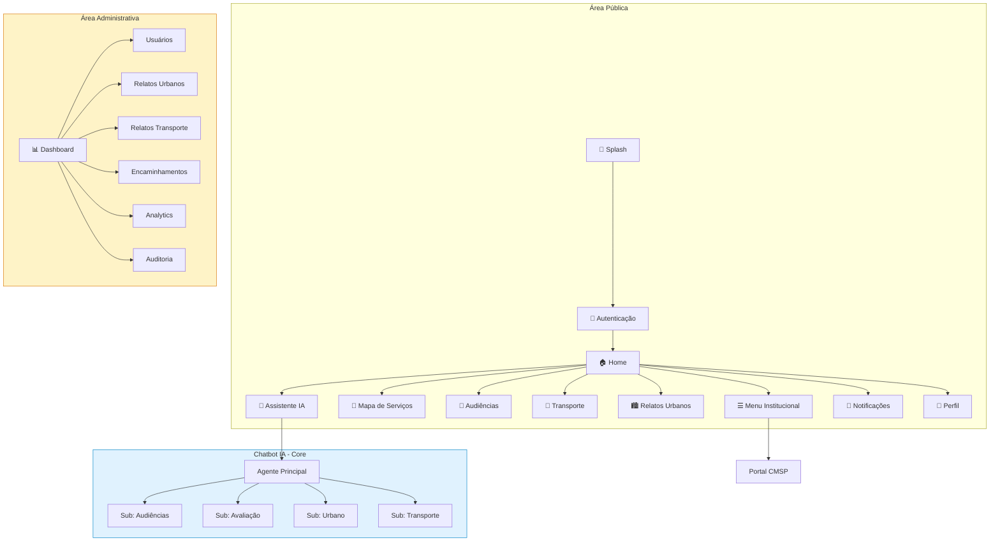
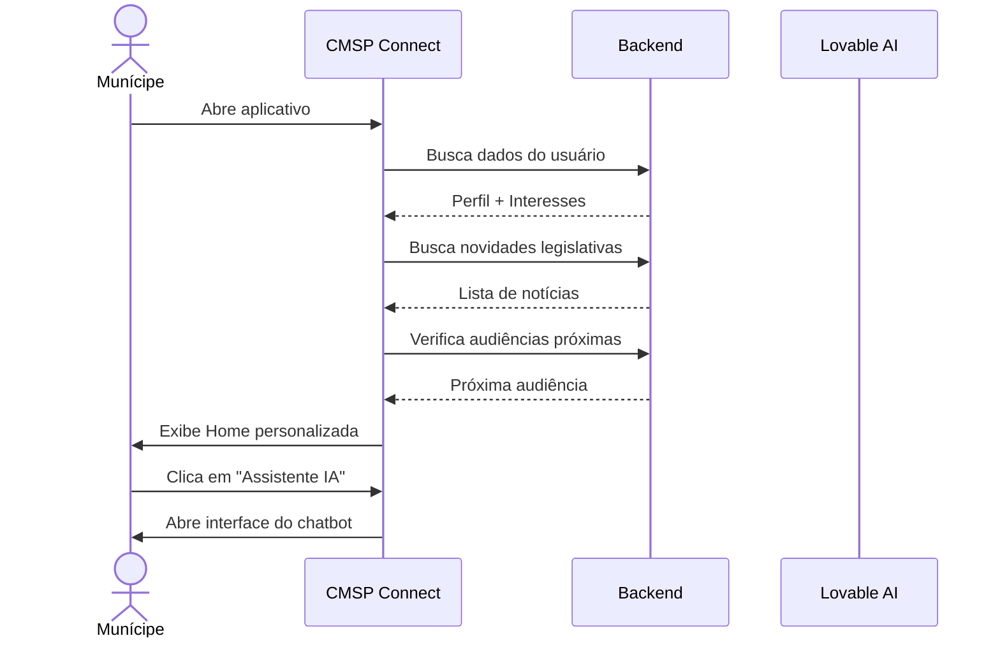
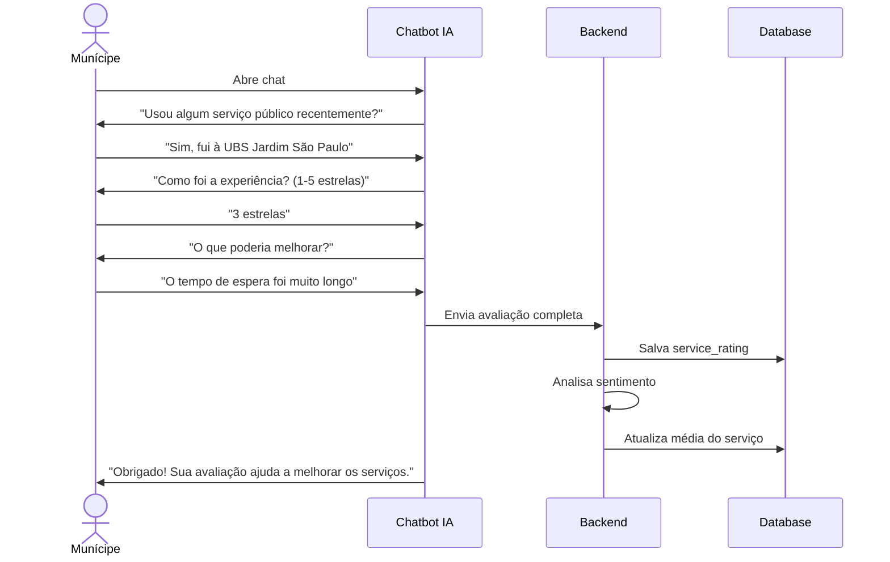
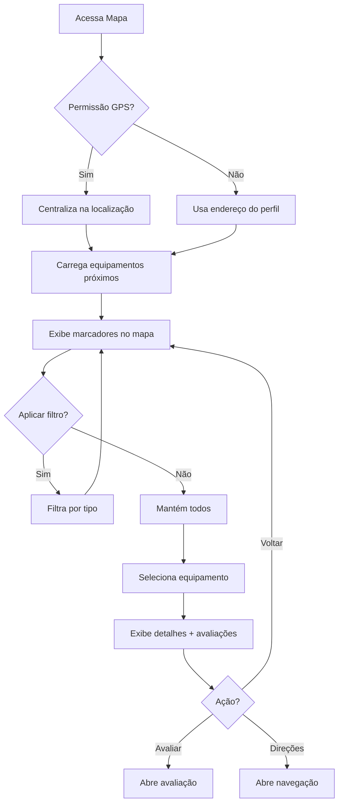
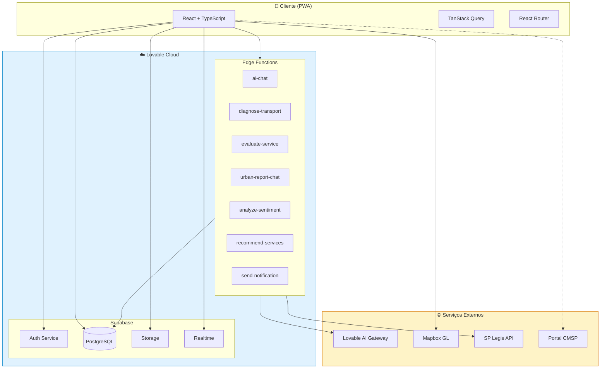
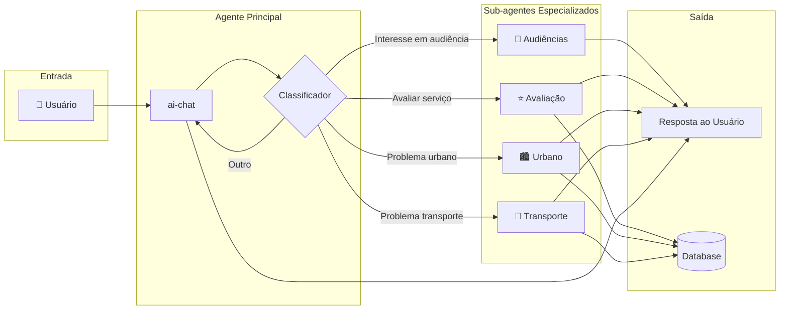
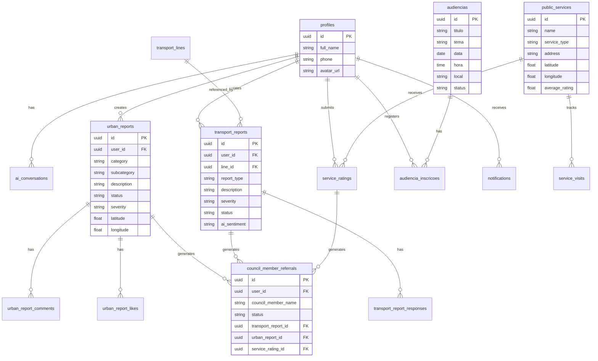
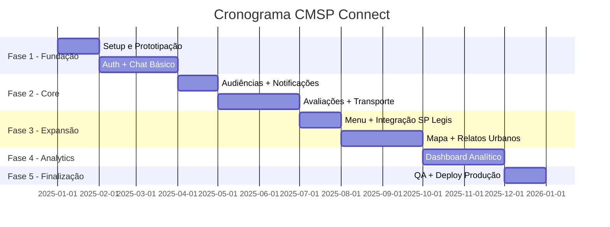

# 📋 ESPECIFICAÇÃO DE REQUISITOS DE SOFTWARE
## CMSP Connect - Aplicativo de Participação Cidadã

**Versão:** 2.0 (Refinada)  
**Data:** 27 de Novembro de 2025  
**Status:** Aprovado para execução

---

## 📑 SUMÁRIO

1. [Visão Geral do Projeto](#1-visão-geral-do-projeto)
2. [Sitemap do Sistema](#2-sitemap-do-sistema)
3. [Casos de Uso](#3-casos-de-uso)
4. [Regras de Negócio](#4-regras-de-negócio)
5. [Escopo Técnico](#5-escopo-técnico)
6. [Arquitetura do Sistema](#6-arquitetura-do-sistema)
7. [Requisitos Não-Funcionais](#7-requisitos-não-funcionais)
8. [Matriz de Rastreabilidade](#8-matriz-de-rastreabilidade)
9. [Complexidades Excluídas](#9-complexidades-excluídas)
10. [Cronograma de Entregas](#10-cronograma-de-entregas)

---

## 1. VISÃO GERAL DO PROJETO

### 1.1 Objetivo

O **CMSP Connect** é um aplicativo móvel de participação cidadã que utiliza inteligência artificial para conectar munícipes, vereadores e serviços públicos da cidade de São Paulo, promovendo transparência legislativa e facilitando o engajamento cívico.

### 1.2 Escopo Aprovado

O sistema contempla as seguintes capacidades principais:

| Capacidade | Descrição |
|------------|-----------|
| **Acolhimento Digital** | Interface conversacional com IA como ponto central de interação |
| **Audiências Públicas** | Gestão de interesse e participação em audiências da CMSP |
| **Avaliação de Serviços** | Coleta de feedback sobre serviços públicos utilizados |
| **Relatos Urbanos** | Registro de problemas urbanos via chatbot |
| **Diagnóstico de Transporte** | Relatos de problemas no transporte público |
| **Mapa de Serviços** | Visualização geolocalizada de equipamentos públicos |
| **Dashboard Analítico** | Painel para análise de dados (acesso administrativo) |

### 1.3 Público-Alvo

| Perfil | Descrição |
|--------|-----------|
| **Cidadão** | Munícipes de São Paulo que desejam participar ativamente da gestão pública |
| **Vereador** | Parlamentares que acompanham demandas da população |
| **Assessor** | Equipe de apoio aos vereadores |
| **Gestor** | Administradores do sistema na CMSP |
| **Admin** | Administradores técnicos com acesso total |

---

## 2. SITEMAP DO SISTEMA

### 2.1 Estrutura de Navegação

```
CMSP Connect
│
├── 🚀 Splash Screen
│   └── Animação de entrada → Redirecionamento automático
│
├── 🔐 Autenticação
│   ├── Login (email/senha)
│   ├── Cadastro
│   └── Recuperação de senha
│
├── 🏠 Home (Acolhimento Digital)
│   ├── Saudação personalizada por horário
│   ├── Carrossel de novidades legislativas
│   ├── Próxima audiência de interesse
│   ├── Botões de ação rápida
│   │   ├── → Assistente IA
│   │   ├── → Relato Urbano
│   │   ├── → Transporte
│   │   └── → Mapa de Serviços
│   └── Card de completude do perfil
│
├── 💬 Assistente IA (Core da Aplicação)
│   ├── Agente Principal (Classificador/Dispatcher)
│   ├── Sub-agente: Audiências Públicas
│   ├── Sub-agente: Avaliação de Serviços
│   ├── Sub-agente: Relatos Urbanos
│   ├── Sub-agente: Transporte
│   └── Histórico de conversas
│
├── 📍 Mapa de Serviços
│   ├── Visualização geolocalizada
│   ├── Filtros por tipo de serviço
│   │   ├── UBS
│   │   ├── Escolas
│   │   ├── CEUs
│   │   ├── Hospitais
│   │   ├── Bibliotecas
│   │   └── Centros Esportivos
│   ├── Detalhes do equipamento
│   ├── Avaliações do local
│   └── Rotas e direções
│
├── 📢 Audiências Públicas
│   ├── Lista de audiências
│   ├── Filtros (tema, data, status)
│   ├── Detalhes da audiência
│   ├── Inscrição/Participação
│   └── Histórico de participações
│
├── 🚌 Transporte
│   ├── Novo Relato (via chatbot)
│   ├── Meus Relatos
│   ├── Padrões Identificados
│   └── Encaminhamentos à Comissão
│
├── 🏙️ Relatos Urbanos
│   ├── Novo Relato (via chatbot)
│   ├── Relato Manual (formulário)
│   └── Histórico de Relatos
│
├── ☰ Menu Institucional
│   ├── Agenda da CMSP → [Redirect Portal]
│   ├── Vereadores → [Redirect Portal]
│   ├── Conheça a Câmara → [Redirect Portal]
│   ├── Câmara Explica → [Redirect Portal]
│   ├── Escola do Parlamento → [Redirect Portal]
│   └── Notícias → [Redirect Portal]
│
├── 🔔 Notificações
│   ├── Audiências de interesse
│   ├── Atualizações de relatos
│   ├── Respostas de encaminhamentos
│   └── Novidades legislativas
│
├── 👤 Perfil do Usuário
│   ├── Dados pessoais
│   ├── Dados demográficos
│   ├── Endereço principal
│   ├── Interesses temáticos
│   ├── Preferências de comunicação
│   └── Favoritos
│
└── 📊 Área Administrativa (Acesso Restrito)
    ├── Dashboard Geral
    ├── Gestão de Usuários
    ├── Relatos Urbanos (Kanban)
    ├── Relatos de Transporte (Kanban)
    ├── Encaminhamentos às Comissões
    ├── Analytics e Sentimento
    ├── Logs de Auditoria
    └── Configurações do Sistema
```

### 2.2 Diagrama Visual do Sitemap



---

## 3. CASOS DE USO

### 3.1 CSU001 - Acolhimento Digital Personalizado com IA

**Identificador:** CSU001  
**Nome:** Acolhimento Digital Personalizado com IA  
**Ator Principal:** Munícipe  
**Prioridade:** Alta

#### Descrição
O sistema oferece uma experiência de acolhimento personalizada quando o munícipe acessa o aplicativo, com saudação contextual, resumo de informações relevantes e acesso rápido às principais funcionalidades.

#### Pré-condições
- Usuário autenticado no sistema

#### Fluxo Principal
1. Munícipe abre o aplicativo
2. Sistema identifica horário e exibe saudação contextual (Bom dia/Boa tarde/Boa noite)
3. Sistema exibe carrossel com até 3 novidades legislativas relevantes
4. Sistema verifica se há audiência próxima de interesse do usuário
5. Sistema exibe botões de ação rápida para principais funcionalidades
6. Sistema exibe card de completude do perfil (se aplicável)
7. Munícipe pode interagir com qualquer elemento da tela

#### Fluxos Alternativos
- **FA01:** Se primeiro acesso, sistema exibe tutorial de onboarding
- **FA02:** Se há avaliações pendentes, sistema exibe banner de solicitação

#### Pós-condições
- Usuário visualiza tela inicial personalizada
- Interações são registradas para melhorar personalização futura

#### Diagrama de Fluxo



---

### 3.2 CSU002 - Engajamento em Audiências Públicas

**Identificador:** CSU002  
**Nome:** Engajamento em Audiências Públicas  
**Ator Principal:** Munícipe  
**Prioridade:** Alta

#### Descrição
O sistema permite que munícipes descubram, acompanhem e participem de audiências públicas da Câmara Municipal, com notificações personalizadas baseadas em seus interesses.

#### Pré-condições
- Usuário autenticado no sistema

#### Fluxo Principal
1. Munícipe acessa a seção de Audiências Públicas
2. Sistema exibe lista de audiências filtráveis por tema, data e status
3. Munícipe seleciona uma audiência de interesse
4. Sistema exibe detalhes completos (tema, data, local, descrição, documentos)
5. Munícipe solicita inscrição na audiência
6. Sistema confirma inscrição e agenda notificação
7. Munícipe recebe lembrete antes da audiência

#### Fluxos Alternativos
- **FA01:** Audiência virtual → Sistema exibe link de transmissão
- **FA02:** Vagas esgotadas → Sistema oferece lista de espera
- **FA03:** Via chatbot → Usuário pode se inscrever conversando com a IA

#### Pós-condições
- Inscrição registrada no sistema
- Notificação agendada para o usuário

#### Regras de Negócio Aplicáveis
- RN-G05: Notificações entre 8h e 20h
- RN-E03: Fonte de dados via SP Legis

---

### 3.3 CSU003 - Navegação Institucional Simplificada

**Identificador:** CSU003  
**Nome:** Navegação Institucional Simplificada  
**Ator Principal:** Munícipe  
**Prioridade:** Média

#### Descrição
O sistema oferece acesso simplificado às informações institucionais da Câmara Municipal, redirecionando para o Portal CMSP quando necessário, evitando duplicação de conteúdo.

#### Pré-condições
- Nenhuma (funcionalidade pública)

#### Fluxo Principal
1. Munícipe acessa o Menu (drawer lateral)
2. Sistema exibe opções de navegação institucional
3. Munícipe seleciona uma opção (ex: "Vereadores")
4. Sistema abre link externo para o Portal CMSP na seção correspondente

#### Itens do Menu
| Item | Destino |
|------|---------|
| Agenda da CMSP | Portal CMSP - Agenda |
| Vereadores | Portal CMSP - Vereadores |
| Conheça a Câmara | Portal CMSP - Institucional |
| Câmara Explica | Portal CMSP - Educativo |
| Escola do Parlamento | Portal CMSP - Escola |
| Notícias | Portal CMSP - Notícias |

#### Pós-condições
- Usuário redirecionado para Portal CMSP

---

### 3.4 CSU004 - Avaliação de Serviços Públicos

**Identificador:** CSU004  
**Nome:** Avaliação de Serviços Públicos  
**Ator Principal:** Munícipe  
**Prioridade:** Alta

#### Descrição
O sistema coleta feedback sobre serviços públicos utilizados pelo munícipe através de conversa natural com o chatbot, sem necessidade de formulários complexos.

#### Pré-condições
- Usuário autenticado no sistema

#### Fluxo Principal
1. Munícipe abre o aplicativo ou acessa o Assistente IA
2. Chatbot pergunta proativamente: "Você utilizou algum serviço público recentemente?"
3. Munícipe informa qual serviço utilizou
4. Chatbot conduz avaliação conversacional:
   - Solicita nota geral (1-5 estrelas)
   - Pergunta sobre aspectos específicos (atendimento, tempo de espera, infraestrutura)
   - Coleta comentários adicionais
5. Sistema analisa sentimento do feedback
6. Sistema classifica automaticamente por Comissão temática
7. Avaliação é agregada ao dashboard
8. Chatbot agradece e oferece opções adicionais

#### Fluxos Alternativos
- **FA01:** Avaliação muito negativa (≤2 estrelas) → Chatbot oferece encaminhamento à Comissão
- **FA02:** Via Mapa de Serviços → Usuário pode avaliar diretamente pelo card do equipamento

#### Pós-condições
- Avaliação registrada no sistema
- Dados agregados disponíveis no dashboard
- Sentimento analisado e categorizado

#### Diagrama de Fluxo



---

### 3.5 CSU005 - Diagnóstico de Transporte Público

**Identificador:** CSU005  
**Nome:** Diagnóstico de Transporte Público  
**Ator Principal:** Munícipe  
**Prioridade:** Alta

#### Descrição
O sistema permite que munícipes reportem problemas no transporte público através de conversa natural com o chatbot, com direcionamento automático à Comissão de Transportes da CMSP.

#### Pré-condições
- Usuário autenticado no sistema

#### Fluxo Principal
1. Munícipe acessa sub-agente de transporte (via Home ou Menu)
2. Chatbot inicia coleta conversacional:
   - Tipo de transporte (ônibus, metrô, trem, etc.)
   - Linha/Número do veículo
   - Horário da ocorrência
   - Tipo de problema
   - Descrição do impacto
3. Sistema classifica severidade automaticamente
4. Sistema analisa sentimento do relato
5. Relato é registrado e direcionado à Comissão de Transportes
6. Chatbot confirma registro e fornece protocolo
7. Munícipe recebe notificação de atualizações

#### Tipos de Problema Suportados
| Categoria | Exemplos |
|-----------|----------|
| Atrasos | Ônibus não passou, intervalo longo |
| Lotação | Superlotação, impossibilidade de embarque |
| Infraestrutura | Ponto de ônibus danificado, falta de abrigo |
| Atendimento | Má conduta do motorista/cobrador |
| Acessibilidade | Elevador quebrado, rampa indisponível |
| Segurança | Assalto, assédio, iluminação precária |

#### Fluxos Alternativos
- **FA01:** Relato urgente → Sistema prioriza no dashboard
- **FA02:** Padrão detectado → Sistema notifica sobre recorrência

#### Pós-condições
- Relato registrado com protocolo único
- Encaminhamento à Comissão de Transportes
- Dados agregados para análise de padrões

---

### 3.6 CSU006 - Dashboard Analítico Multidimensional

**Identificador:** CSU006  
**Nome:** Dashboard Analítico Multidimensional  
**Ator Principal:** Vereador, Assessor, Gestor  
**Prioridade:** Alta

#### Descrição
O sistema oferece um painel analítico com visualização de dados agregados sobre relatos, avaliações e participação cidadã, com filtros por Comissão, região, período e categoria.

#### Pré-condições
- Usuário com perfil administrativo (vereador, assessor, gestor, admin)

#### Fluxo Principal
1. Usuário acessa área administrativa
2. Sistema exibe dashboard com KPIs principais:
   - Total de relatos por período
   - Distribuição por categoria
   - Análise de sentimento agregada
   - Tempo médio de resposta
3. Usuário aplica filtros desejados:
   - Por Comissão da Câmara
   - Por região/distrito
   - Por período (data inicial/final)
   - Por categoria de relato
4. Sistema atualiza visualizações em tempo real
5. Usuário pode exportar dados (CSV/XLS)

#### Visualizações Disponíveis
| Tipo | Descrição |
|------|-----------|
| KPI Cards | Métricas principais em destaque |
| Gráfico de Barras | Distribuição por categoria |
| Gráfico de Pizza | Proporção de sentimentos |
| Mapa de Calor | Concentração geográfica |
| Linha do Tempo | Evolução temporal |
| Tabela Detalhada | Drill-through para dados brutos |

#### Pós-condições
- Usuário visualiza dados filtrados
- Exportação disponível conforme limites

---

### 3.7 CSU007 - Mapa de Serviços Públicos

**Identificador:** CSU007  
**Nome:** Mapa de Serviços Públicos  
**Ator Principal:** Munícipe  
**Prioridade:** Alta

#### Descrição
O sistema exibe um mapa interativo com equipamentos públicos da cidade, permitindo busca, filtros e visualização de avaliações.

#### Pré-condições
- Nenhuma (funcionalidade com acesso público, avaliação requer autenticação)

#### Fluxo Principal
1. Munícipe acessa o Mapa de Serviços
2. Sistema solicita permissão de localização (uma única vez)
3. Sistema exibe mapa centrado na localização do usuário
4. Sistema carrega equipamentos públicos próximos (raio configurável)
5. Munícipe pode filtrar por tipo de serviço
6. Munícipe seleciona um equipamento
7. Sistema exibe detalhes: nome, endereço, avaliação média, telefone
8. Munícipe pode solicitar rotas/direções

#### Tipos de Equipamento
| Tipo | Ícone |
|------|-------|
| UBS | 🏥 |
| Escola | 🏫 |
| CEU | 🎭 |
| Hospital | 🏨 |
| Biblioteca | 📚 |
| Centro Esportivo | ⚽ |

#### Fluxos Alternativos
- **FA01:** Localização negada → Sistema usa endereço do perfil
- **FA02:** Equipamento não encontrado → Usuário pode sugerir correção
- **FA03:** Integração externa falha → Sistema usa base interna

#### Pós-condições
- Usuário visualiza equipamentos disponíveis
- Interações registradas para analytics

#### Diagrama de Fluxo



---

### 3.8 CSU008 - Relatos Urbanos via Chatbot

**Identificador:** CSU008  
**Nome:** Relatos Urbanos via Chatbot  
**Ator Principal:** Munícipe  
**Prioridade:** Alta

#### Descrição
O sistema permite que munícipes registrem problemas urbanos através de conversa natural com o chatbot, que infere categoria e detalhes automaticamente.

#### Pré-condições
- Usuário autenticado no sistema

#### Fluxo Principal
1. Munícipe acessa sub-agente de relatos urbanos
2. Chatbot (Luana) inicia com tom empático e acolhedor
3. Munícipe descreve o problema em linguagem natural
4. Chatbot infere automaticamente:
   - Categoria (iluminação, buracos, lixo, etc.)
   - Subcategoria específica
   - Severidade estimada (padrão: média)
5. Chatbot solicita localização do problema
6. Chatbot confirma informações com o munícipe
7. Sistema registra relato e gera protocolo
8. Chatbot agradece e informa próximos passos

#### Categorias de Relato
| Categoria | Subcategorias |
|-----------|---------------|
| Iluminação | Lâmpada queimada, poste danificado, falta de iluminação |
| Vias | Buraco, rachadura, calçada irregular |
| Limpeza | Lixo acumulado, entulho, poda de árvore |
| Sinalização | Placa danificada, semáforo quebrado |
| Drenagem | Bueiro entupido, alagamento |
| Outros | Demais situações |

#### Fluxos Alternativos
- **FA01:** Munícipe prefere formulário → Redireciona para relato manual
- **FA02:** Localização automática disponível → Chatbot sugere endereço

#### Pós-condições
- Relato registrado com protocolo único
- Classificação automática por Comissão
- Munícipe pode acompanhar status

---

## 4. REGRAS DE NEGÓCIO

### 4.1 Regras Gerais

| ID | Regra | Descrição | Justificativa |
|----|-------|-----------|---------------|
| RN-G01 | Atualização de dados legislativos | Sistema deve sincronizar informações do SP Legis a cada 15 minutos | Manter dados atualizados |
| RN-G02 | Transparência da IA | Toda resposta da IA deve indicar a fonte da informação (SP Legis, base municipal, conhecimento geral) | Prevenir desinformação |
| RN-G03 | Tempo de resposta | Tempo máximo de resposta do sistema: 3 segundos para operações síncronas | Experiência do usuário |
| RN-G04 | Anonimização de dados | Dados de localização devem ser anonimizados após processamento para descoberta de serviços | Conformidade LGPD |
| RN-G05 | Janela de notificações | Notificações push devem ser enviadas apenas entre 8h e 20h | Respeito ao usuário |
| RN-G06 | Confirmação de email | Auto-confirmação de email habilitada para novos cadastros | Reduzir fricção no onboarding |

### 4.2 Regras de Encaminhamento

| ID | Regra | Descrição | Justificativa |
|----|-------|-----------|---------------|
| RN-E01 | Encaminhamento institucional | Relatos e avaliações devem ser encaminhados para Comissões da Câmara, não para vereadores individuais | Evitar conflitos políticos |
| RN-E02 | Classificação automática | Sistema deve classificar automaticamente relatos por tema e direcionar à Comissão correspondente | Eficiência operacional |
| RN-E03 | Fonte única de vereadores | Lista de vereadores e comissões deve ser obtida exclusivamente via SP Legis API | Garantir atualização automática |
| RN-E04 | Notificação de status | Cidadão deve ser notificado quando status do encaminhamento mudar | Transparência no processo |

### 4.3 Regras do Chatbot/IA

| ID | Regra | Descrição | Justificativa |
|----|-------|-----------|---------------|
| RN-C01 | Interface conversacional | A interface conversacional (chatbot) é o core da experiência do usuário | Simplicidade e acessibilidade |
| RN-C02 | Sub-agentes especializados | Cada domínio (transporte, urbano, avaliações) deve ter prompt especializado | Qualidade das respostas |
| RN-C03 | Agente classificador | O agente principal deve classificar a intenção e redirecionar para sub-agente adequado | Organização do fluxo |
| RN-C04 | Tom empático | Chatbot deve manter tom empático, educativo e nunca burocrático | Experiência cidadã positiva |
| RN-C05 | Coleta natural | Informações devem ser coletadas de forma conversacional, não como formulário | Reduzir fricção |
| RN-C06 | Inferência automática | Sistema deve inferir categoria, subcategoria e severidade a partir da descrição do usuário | Facilitar o relato |

### 4.4 Regras de Dados

| ID | Regra | Descrição | Justificativa |
|----|-------|-----------|---------------|
| RN-D01 | Contingência de dados | Base interna de equipamentos públicos deve servir como contingência se integração externa falhar | Independência operacional |
| RN-D02 | Limites de exportação | Exportação limitada a 1M linhas (XLS) ou 5M linhas (CSV) | Performance do sistema |
| RN-D03 | Anonimização em dashboards | Dashboards públicos não devem exibir dados que identifiquem cidadãos | Conformidade LGPD |
| RN-D04 | Retenção de localização | Dados de localização bruta devem ser retidos por no máximo 24 horas | Conformidade LGPD |
| RN-D05 | Logs de auditoria | Todas as ações administrativas devem ser registradas em log de auditoria | Rastreabilidade |

### 4.5 Regras de Acesso

| ID | Regra | Descrição | Justificativa |
|----|-------|-----------|---------------|
| RN-A01 | Perfis de acesso | Sistema deve suportar perfis: cidadão, vereador, assessor, gestor, admin | Controle de acesso |
| RN-A02 | Dashboard restrito | Área administrativa acessível apenas para perfis não-cidadão | Segurança da informação |
| RN-A03 | RLS obrigatório | Todas as tabelas com dados de usuário devem ter Row Level Security ativo | Segurança dos dados |

---

## 5. ESCOPO TÉCNICO

### 5.1 Stack Tecnológico

#### Frontend

| Tecnologia | Versão | Finalidade |
|------------|--------|------------|
| React | 18.3+ | Framework de UI |
| TypeScript | 5.x | Tipagem estática |
| Vite | 5.x | Build tool |
| Tailwind CSS | 3.x | Estilização |
| Radix UI | Latest | Componentes acessíveis |
| shadcn/ui | Latest | Design system |
| Framer Motion | 12.x | Animações |
| React Router | 6.x | Roteamento |
| TanStack Query | 5.x | Gerenciamento de estado servidor |
| React Hook Form | 7.x | Formulários |
| Zod | 3.x | Validação de schemas |

#### Mobile

| Tecnologia | Finalidade |
|------------|------------|
| PWA (Progressive Web App) | Aplicativo instalável sem app stores |
| Service Workers | Cache offline e push notifications |
| Web App Manifest | Configuração de instalação |

#### Backend (Lovable Cloud)

| Tecnologia | Finalidade |
|------------|------------|
| Supabase (PostgreSQL) | Banco de dados relacional |
| Supabase Auth | Autenticação e autorização |
| Supabase Storage | Armazenamento de arquivos |
| Supabase Realtime | Atualizações em tempo real |
| Edge Functions (Deno) | Lógica de negócio serverless |
| Row Level Security | Segurança a nível de linha |

#### Inteligência Artificial

| Tecnologia | Finalidade |
|------------|------------|
| Lovable AI Gateway | Gateway para modelos LLM |
| Google Gemini 2.5 Flash | Modelo padrão para chat |
| Google Gemini 2.5 Pro | Modelo para análises complexas |

#### Integrações Externas

| Serviço | Finalidade |
|---------|------------|
| Mapbox GL | Mapas e geolocalização |
| SP Legis API | Dados de vereadores e comissões |
| Portal CMSP | Redirecionamento institucional |

### 5.2 Estrutura de Diretórios

```
cmsp-connect/
├── src/
│   ├── assets/              # Imagens e recursos estáticos
│   ├── components/          # Componentes React
│   │   ├── admin/          # Componentes administrativos
│   │   ├── ai/             # Componentes do chatbot
│   │   ├── analytics/      # Componentes de dashboard
│   │   ├── audiencias/     # Componentes de audiências
│   │   ├── evaluation/     # Componentes de avaliação
│   │   ├── map/            # Componentes do mapa
│   │   ├── transport/      # Componentes de transporte
│   │   ├── urban/          # Componentes de relatos urbanos
│   │   └── ui/             # Componentes base (shadcn)
│   ├── contexts/           # Contextos React
│   ├── hooks/              # Hooks customizados
│   ├── integrations/       # Integrações (Supabase)
│   ├── layouts/            # Layouts de página
│   ├── lib/                # Utilitários
│   ├── pages/              # Páginas da aplicação
│   │   ├── admin/          # Páginas administrativas
│   │   ├── analytics/      # Páginas de analytics
│   │   ├── audiencias/     # Páginas de audiências
│   │   ├── institucional/  # Páginas institucionais
│   │   ├── profile/        # Páginas de perfil
│   │   ├── transport/      # Páginas de transporte
│   │   └── urban/          # Páginas de relatos
│   ├── services/           # Serviços de API
│   └── types/              # Tipos TypeScript
├── supabase/
│   ├── functions/          # Edge Functions
│   │   ├── ai-chat/        # Chat principal
│   │   ├── diagnose-transport/  # Sub-agente transporte
│   │   ├── evaluate-service/    # Sub-agente avaliação
│   │   ├── urban-report-chat/   # Sub-agente urbano
│   │   ├── analyze-sentiment/   # Análise de sentimento
│   │   ├── recommend-services/  # Recomendações
│   │   └── send-notification/   # Notificações
│   └── config.toml         # Configuração Supabase
├── public/                 # Arquivos públicos
└── docs/                   # Documentação
```

---

## 6. ARQUITETURA DO SISTEMA

### 6.1 Visão Geral da Arquitetura



### 6.2 Arquitetura do Chatbot (Dispatcher Pattern)



### 6.3 Modelo de Dados (Principais Entidades)



---

## 7. REQUISITOS NÃO-FUNCIONAIS

### 7.1 Performance

| ID | Requisito | Métrica | Valor |
|----|-----------|---------|-------|
| RNF-P01 | Tempo de carregamento inicial | First Contentful Paint | < 2s |
| RNF-P02 | Tempo de resposta da API | Latência P95 | < 500ms |
| RNF-P03 | Tempo de resposta do chatbot | Primeiro token | < 1s |
| RNF-P04 | Suporte a usuários simultâneos | Conexões concorrentes | 10.000 |

### 7.2 Segurança

| ID | Requisito | Descrição |
|----|-----------|-----------|
| RNF-S01 | Criptografia em trânsito | TLS 1.3 para todas as conexões |
| RNF-S02 | Criptografia em repouso | AES-256 para dados sensíveis |
| RNF-S03 | Autenticação | JWT com expiração de 1 hora |
| RNF-S04 | Autorização | Row Level Security em todas as tabelas |
| RNF-S05 | Proteção CSRF | Tokens anti-CSRF em formulários |
| RNF-S06 | Rate Limiting | Máximo 100 req/min por usuário |

### 7.3 Disponibilidade

| ID | Requisito | Descrição |
|----|-----------|-----------|
| RNF-D01 | Uptime | 99.5% de disponibilidade mensal |
| RNF-D02 | Backup | Backup automático diário (7 dias de retenção) |
| RNF-D03 | Recuperação | RTO < 4 horas, RPO < 1 hora |

### 7.4 Usabilidade e Acessibilidade

| ID | Requisito | Descrição |
|----|-----------|-----------|
| RNF-U01 | Responsividade | Suporte a telas de 320px a 2560px |
| RNF-U02 | Acessibilidade | Conformidade WCAG 2.1 nível AA |
| RNF-U03 | Navegação por teclado | Todas as funcionalidades acessíveis via teclado |
| RNF-U04 | Contraste | Ratio mínimo de 4.5:1 para texto |
| RNF-U05 | Leitores de tela | Compatibilidade com NVDA, VoiceOver, TalkBack |

### 7.5 Compatibilidade

| ID | Requisito | Descrição |
|----|-----------|-----------|
| RNF-C01 | Navegadores | Chrome 90+, Firefox 88+, Safari 14+, Edge 90+ |
| RNF-C02 | Dispositivos móveis | iOS 14+, Android 10+ |
| RNF-C03 | Resolução mínima | 320x568 (iPhone SE) |

---

## 8. MATRIZ DE RASTREABILIDADE

### 8.1 Casos de Uso x Regras de Negócio

| Caso de Uso | Regras Aplicáveis |
|-------------|-------------------|
| CSU001 - Acolhimento Digital | RN-G01, RN-G03, RN-C01 |
| CSU002 - Audiências Públicas | RN-G05, RN-E03, RN-A01 |
| CSU003 - Navegação Institucional | - |
| CSU004 - Avaliação de Serviços | RN-G04, RN-C01, RN-C04, RN-C05, RN-E01, RN-E02 |
| CSU005 - Diagnóstico Transporte | RN-G02, RN-C01, RN-C05, RN-C06, RN-E01, RN-E02 |
| CSU006 - Dashboard Analítico | RN-D02, RN-D03, RN-D05, RN-A02 |
| CSU007 - Mapa de Serviços | RN-G04, RN-D01, RN-D04 |
| CSU008 - Relatos Urbanos | RN-G02, RN-C01, RN-C04, RN-C05, RN-C06, RN-E01, RN-E02 |

### 8.2 Casos de Uso x Componentes Técnicos

| Caso de Uso | Edge Functions | Tabelas Principais |
|-------------|----------------|-------------------|
| CSU001 | ai-chat | profiles, noticias, audiencias |
| CSU002 | ai-chat | audiencias, audiencia_inscricoes, notifications |
| CSU003 | - | - (redirect externo) |
| CSU004 | evaluate-service, analyze-sentiment | service_ratings, public_services, council_member_referrals |
| CSU005 | diagnose-transport, analyze-sentiment | transport_reports, transport_lines, council_member_referrals |
| CSU006 | - | urban_reports, transport_reports, service_ratings |
| CSU007 | recommend-services | public_services, service_ratings |
| CSU008 | urban-report-chat | urban_reports, council_member_referrals |

---

## 9. COMPLEXIDADES EXCLUÍDAS

Esta seção documenta explicitamente as funcionalidades e complexidades que foram **excluídas do escopo** do projeto, conforme refinamento realizado.

### 9.1 Funcionalidades Removidas

| Funcionalidade | Motivo da Exclusão | Alternativa Implementada |
|----------------|-------------------|--------------------------|
| Rastreamento GPS 24/7 | Complexidade técnica + LGPD | Pergunta proativa quando app é aberto |
| Agentes específicos para UPA, SPTrans, etc. | Complexidade de integração | Chatbot genérico com classificação automática |
| Disponibilidade em tempo real de serviços | Requer integração complexa com prefeitura | Base interna de equipamentos |
| Consulta de tempo real de transporte | Integração não disponível | Relato e encaminhamento à Comissão |
| Moderação colaborativa de conteúdo | Risco de manipulação | Revisão manual por gestores |
| App nativo iOS/Android | Custo e tempo de desenvolvimento | PWA instalável |
| CSU009 - Alocação Inteligente | Requer modelos preditivos complexos | Adiado para fase 2 |
| Streaming de voz avançado | Complexidade técnica | Text-to-speech básico |

### 9.2 Integrações Simplificadas

| Integração Original | Simplificação |
|---------------------|---------------|
| API completa da Prefeitura | Base interna + sugestões de correção |
| Sistema de transporte em tempo real | Relatos manuais + padrões identificados |
| Múltiplas APIs de vereadores | Fonte única: SP Legis |
| Conteúdo institucional completo | Redirect para Portal CMSP |

### 9.3 Justificativas Técnicas

1. **Evitar dependência de terceiros:** Manter funcionamento mesmo se APIs externas falharem
2. **Conformidade LGPD:** Minimizar coleta e retenção de dados de localização
3. **Reduzir tempo de desenvolvimento:** Focar em funcionalidades de alto valor
4. **Garantir manutenibilidade:** Arquitetura simples e documentada

---

## 10. CRONOGRAMA DE ENTREGAS

### 10.1 Visão Geral (12 Meses)



### 10.2 Detalhamento por Ordem de Serviço

| OS | Período | Entregas | Profissionais |
|----|---------|----------|---------------|
| OS-01 | Mês 1 | Protótipo navegável, Modelo de dados, Setup infraestrutura | UX Designer, DBA, DevOps |
| OS-02 | Mês 2-3 | CSU001 (Acolhimento), Autenticação, Chat básico com IA | Frontend, Backend, IA |
| OS-03 | Mês 4 | CSU002 (Audiências), Sistema de notificações | Frontend, Backend |
| OS-04 | Mês 5-6 | CSU004 (Avaliações), CSU005 (Transporte), Análise de sentimento | Frontend, Backend, IA |
| OS-05 | Mês 7 | CSU003 (Menu institucional), Integração SP Legis | Frontend, Backend |
| OS-06 | Mês 8-9 | CSU007 (Mapa), CSU008 (Relatos Urbanos) | Frontend, Backend, IA |
| OS-07 | Mês 10-11 | CSU006 (Dashboard), Exportações, Analytics | Frontend, BI |
| OS-08 | Mês 12 | Testes, Ajustes, Deploy produção, Documentação | QA, DevOps, Todos |

### 10.3 Critérios de Aceite por OS

Cada Ordem de Serviço deve incluir:

- ✅ Funcionalidades implementadas conforme especificação
- ✅ Código fonte com histórico de commits no repositório
- ✅ Testes automatizados para fluxos críticos
- ✅ Preview funcional para validação
- ✅ Documentação técnica atualizada
- ✅ Declaração de horas (IPP)

---

## 11. GLOSSÁRIO

| Termo | Definição |
|-------|-----------|
| **Comissão** | Grupo temático de vereadores responsável por determinado assunto na CMSP |
| **Edge Function** | Função serverless executada próxima ao usuário para baixa latência |
| **LGPD** | Lei Geral de Proteção de Dados Pessoais (Lei nº 13.709/2018) |
| **LLM** | Large Language Model - modelo de linguagem de grande escala |
| **PWA** | Progressive Web App - aplicativo web instalável |
| **RLS** | Row Level Security - segurança a nível de linha no banco de dados |
| **SP Legis** | Sistema de informações legislativas da cidade de São Paulo |
| **Sub-agente** | Instância especializada do chatbot para domínio específico |

---

## 12. ANEXOS

### Anexo A - Edge Functions Existentes

| Função | Descrição | Autenticação |
|--------|-----------|--------------|
| ai-chat | Agente principal do chatbot | Requerida |
| diagnose-transport | Sub-agente de transporte | Requerida |
| evaluate-service | Sub-agente de avaliação | Requerida |
| urban-report-chat | Sub-agente de relatos urbanos | Requerida |
| analyze-sentiment | Análise de sentimento | Requerida |
| recommend-services | Recomendação de serviços | Requerida |
| send-notification | Envio de notificações | Interna |
| suggest-council-members | Sugestão de comissões | Requerida |

### Anexo B - Tabelas do Banco de Dados

| Tabela | Descrição | RLS |
|--------|-----------|-----|
| profiles | Perfis de usuários | ✅ |
| ai_conversations | Histórico de conversas com IA | ✅ |
| audiencias | Audiências públicas | ✅ |
| audiencia_inscricoes | Inscrições em audiências | ✅ |
| urban_reports | Relatos urbanos | ✅ |
| transport_reports | Relatos de transporte | ✅ |
| transport_lines | Linhas de transporte | Público |
| public_services | Equipamentos públicos | Público |
| service_ratings | Avaliações de serviços | ✅ |
| service_visits | Visitas a serviços | ✅ |
| council_member_referrals | Encaminhamentos às comissões | ✅ |
| notifications | Notificações do usuário | ✅ |
| user_roles | Perfis de acesso | ✅ |

---

**Documento elaborado por:** Equipe de Produto CMSP Connect  
**Aprovado por:** [Pendente]  
**Data de aprovação:** [Pendente]

---

*Este documento é parte integrante da Ordem de Serviço para desenvolvimento do CMSP Connect e deve ser utilizado como referência técnica para todas as entregas do projeto.*
