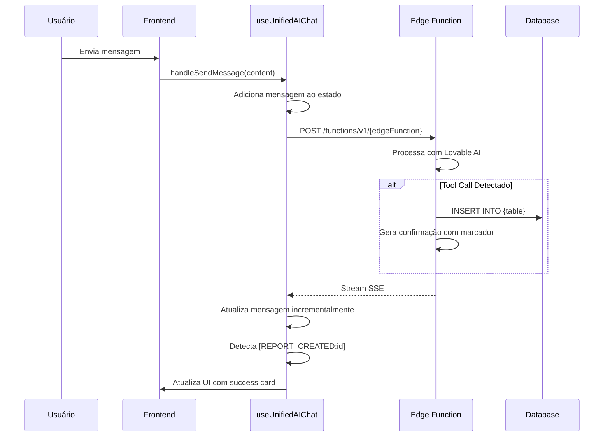

# Arquitetura de Jornadas Conversacionais - CMSP Connect

Este documento descreve a arquitetura técnica das jornadas conversacionais do CMSP Connect, incluindo especificações de cada jornada, guardrails de escopo e padrões de implementação.

## 1. Visão Geral

O CMSP Connect utiliza uma **abordagem híbrida** para interações via chat:

- **Chat Geral** (`ai-chat`): Hub inteligente que responde perguntas gerais e **detecta intenções** para sugerir jornadas especializadas
- **Jornadas Especializadas**: Edge Functions dedicadas com prompts focados e coleta estruturada de dados

### Diagrama de Arquitetura

```
┌─────────────────────────────────────────────────────────────┐
│                     Frontend (React)                        │
│  ┌─────────────────────────────────────────────────────┐   │
│  │                  AgentChatArea                       │   │
│  │  ┌─────────────────────────────────────────────┐    │   │
│  │  │      JourneyProgressTracker (visual)        │    │   │
│  │  └─────────────────────────────────────────────┘    │   │
│  │  ┌─────────────────────────────────────────────┐    │   │
│  │  │           ChatMessageBubble                  │    │   │
│  │  └─────────────────────────────────────────────┘    │   │
│  │  ┌─────────────────────────────────────────────┐    │   │
│  │  │        EscapeValveDialog (modal)            │    │   │
│  │  └─────────────────────────────────────────────┘    │   │
│  └─────────────────────────────────────────────────────┘   │
└─────────────────────────────────────────────────────────────┘
                              │
                              ▼
┌─────────────────────────────────────────────────────────────┐
│                   useUnifiedAIChat (Hook)                   │
│  - Gerencia estado de mensagens                             │
│  - Detecta marcadores de criação de relatos                 │
│  - Roteia para Edge Function correta                        │
└─────────────────────────────────────────────────────────────┘
                              │
                              ▼
┌─────────────────────────────────────────────────────────────┐
│                    Edge Functions (Deno)                    │
│  ┌──────────────┐ ┌──────────────┐ ┌──────────────┐       │
│  │   ai-chat    │ │ urban-report │ │  diagnose-   │       │
│  │   (geral)    │ │    -chat     │ │  transport   │       │
│  └──────────────┘ └──────────────┘ └──────────────┘       │
│  ┌──────────────┐                                          │
│  │  evaluate-   │                                          │
│  │   service    │                                          │
│  └──────────────┘                                          │
└─────────────────────────────────────────────────────────────┘
```

## 2. Tipos de Jornadas

### 2.1 Jornadas de Coleta Estruturada

Estas jornadas coletam dados específicos e salvam no banco de dados:

| ID | Edge Function | Tabela | Dados Coletados |
|----|--------------|--------|-----------------|
| `urban_report` | `urban-report-chat` | `urban_reports` | categoria, descrição, localização |
| `transport` | `diagnose-transport` | `transport_reports` | tipo, linha, data, severidade |
| `evaluate` | `evaluate-service` | `service_ratings` | serviço, nota, comentário |

### 2.2 Jornadas Informacionais

Estas jornadas usam o chat geral e não persistem dados estruturados:

| ID | Propósito |
|----|-----------|
| `general` | Perguntas gerais sobre a CMSP |
| `services` | Informações sobre serviços públicos |
| `audiencias` | Informações sobre audiências públicas |
| `vereadores` | Informações sobre vereadores |
| `plan` | Planejamento de roteiros |
| `favorites` | Gerenciamento de favoritos |

## 3. Especificações por Jornada

### 3.1 Relato Urbano (`urban_report`)

**Propósito**: Registrar problemas urbanos na cidade de São Paulo

**Slots de Dados**:
| Slot | Label | Obrigatório | Detecção |
|------|-------|-------------|----------|
| `problem` | Problema | ✅ | Palavras-chave de problemas urbanos |
| `location` | Local | ✅ | Endereços, CEP, pontos de referência |
| `details` | Detalhes | ❌ | Descritivos adicionais |

**Categorias Inferidas**:
- `iluminacao`: poste, luz, lâmpada, escuro
- `calcada`: buraco, calçada, passeio, rampa
- `via_publica`: asfalto, rua, sinalização, semáforo
- `lixo`: lixo, entulho, descarte, lixeira
- `area_verde`: praça, árvore, mato, parque
- `outro`: demais casos

**Guardrails de Escopo**:
- Transporte → Sugerir Diagnóstico de Transporte
- Notícias/Audiências → Sugerir Chat Geral
- Solicitação de saída → Orientar sobre botão de voltar

### 3.2 Diagnóstico de Transporte (`transport`)

**Propósito**: Registrar problemas no transporte público

**Slots de Dados**:
| Slot | Label | Obrigatório | Detecção |
|------|-------|-------------|----------|
| `line` | Linha | ✅ | Números de linha, metrô, trem |
| `problem` | Problema | ✅ | Atraso, lotação, segurança |
| `date` | Data | ✅ | Datas, "hoje", "ontem" |
| `time` | Horário | ❌ | Horários, períodos do dia |
| `location` | Local | ❌ | Pontos, estações, terminais |

**Mapeamento de Severidade**:
- `critical`: Risco à vida, acidente, violência
- `high`: Atraso >1h, compromisso perdido, recorrente
- `medium`: Atraso 15-60min, desconforto
- `low`: Inconveniência menor

**Guardrails de Escopo**:
- Problemas urbanos → Sugerir Relato Urbano
- Notícias/Audiências → Sugerir Chat Geral

### 3.3 Avaliação de Serviço (`evaluate`)

**Propósito**: Coletar feedback sobre serviços públicos

**Slots de Dados**:
| Slot | Label | Obrigatório | Detecção |
|------|-------|-------------|----------|
| `service` | Serviço | ✅ | UBS, escola, hospital, etc. |
| `rating` | Nota | ✅ | Números 1-5, adjetivos |
| `comment` | Comentário | ✅ | Texto com >30 caracteres |

**Comportamento Especial**:
- Nota ≤ 2: Mostrar empatia extra, oferecer encaminhamento a vereador

**Guardrails de Escopo**:
- Transporte → Sugerir Diagnóstico de Transporte
- Problemas urbanos → Sugerir Relato Urbano

### 3.4 Chat Geral (`general`)

**Propósito**: Hub de assistência cidadã

**Capacidades**:
- Responder perguntas sobre audiências públicas
- Explicar processo legislativo
- Fornecer informações sobre vereadores
- Usar RAG para buscar na base de conhecimento

**Detecção de Intenção**:
O chat geral detecta automaticamente quando o usuário quer usar uma jornada especializada:

```typescript
const INTENT_PATTERNS = {
  transport: ['ônibus', 'metrô', 'lotação', 'atraso'],
  urban_report: ['buraco', 'iluminação', 'lixo', 'calçada'],
  evaluate: ['avaliar', 'UBS', 'hospital', 'nota']
};
```

Quando detectado com alta confiança (≥2 keywords), sugere proativamente:
> "Parece que você quer relatar um problema no transporte público. Temos um canal especializado para isso! Quer que eu te direcione?"

## 4. Componentes de UX

### 4.1 JourneyProgressTracker

Indicador visual de progresso da coleta de dados:

```tsx
<JourneyProgressTracker 
  journeyId="urban_report"
  messages={messages}
/>
```

**Estados**:
- ✅ Verde: Slot preenchido
- 🔄 Amarelo (animado): Slot em coleta
- ⚪ Cinza: Slot pendente

### 4.2 JourneySuggestionCard

Card de sugestão que aparece no chat geral quando a IA detecta intenção de usar uma jornada especializada.

**Localização**: `src/components/ai/JourneySuggestionCard.tsx`

**Comportamento**:
- Aparece após resposta da IA quando `intent_detected` é `true`
- Exibe ícone, título e descrição da jornada sugerida
- Badge "Recomendado" para alta confiança (≥90%)
- Botões: "Usar esta funcionalidade" (aceitar) e X (dispensar)
- Animação de entrada/saída suave com Framer Motion

**Jornadas Suportadas**:
| Jornada | Ícone | Cor | Descrição |
|---------|-------|-----|-----------|
| `transport` | Bus | Azul | Diagnóstico de Transporte |
| `urban_report` | MapPin | Âmbar | Relato Urbano |
| `evaluate` | Star | Verde | Avaliação de Serviço |

**Fluxo**:
1. Usuário envia mensagem no chat geral
2. Edge function detecta intent via keywords
3. Marcador `intent_detected` é injetado no stream SSE
4. Frontend exibe JourneySuggestionCard
5. Usuário aceita → navega para jornada especializada
6. Usuário dispensa → card desaparece

### 4.3 EscapeValveDialog

Modal apresentado quando o usuário tenta sair de uma jornada estruturada:

**Opções**:
1. **Continuar conversa**: Volta ao chat
2. **Salvar e sair**: Preserva no histórico para continuar depois
3. **Descartar e sair**: Abandona a conversa

### 4.4 AgentHeader

Header dinâmico que muda conforme o estado:

- **Hub**: Menu hamburger, título "Câmara SP", notificações
- **Jornada ativa**: Botão voltar, ícone + label da jornada, menu kebab

## 5. Fluxo de Dados

### 5.1 Envio de Mensagem



### 5.2 Marcadores de Criação

Quando um relato é criado, o backend injeta um marcador no final da resposta:

- `[REPORT_CREATED:{uuid}]` - Relato urbano
- `[TRANSPORT_CREATED:{uuid}]` - Relato de transporte
- `[RATING_CREATED:{uuid}]` - Avaliação de serviço

O frontend detecta esses marcadores, remove da exibição e mostra o card de sucesso.

## 6. Guardrails de Prompt

### 6.1 Estrutura do System Prompt

```markdown
## 🎯 PROPÓSITO DESTA CONVERSA
[Descrição focada do objetivo]

## ✅ DADOS A COLETAR (Slot Filling)
[Lista de slots com obrigatoriedade]

## 🗣️ COMO CONVERSAR
[Diretrizes de tom e abordagem]

## 🚫 GUARDRAILS DE ESCOPO (CRÍTICO)

### SE O USUÁRIO SAIR DO TEMA:
[Respostas padrão para desvios]

### SE O USUÁRIO QUISER SAIR:
[Orientação sobre escape valve]

## ⚠️ REGRAS IMPORTANTES
[Constraints críticos]
```

### 6.2 Padrões de Redirecionamento

**Redirecionamento Gentil**:
> "Isso é mais um assunto de [outro tema]! Temos um canal específico para isso. Quer que eu te direcione? Ou podemos continuar aqui se preferir."

**Confirmação de Saída**:
> "Sem problemas! Você pode voltar quando quiser. Só clicar na setinha ← no topo para ir ao início. Até mais! 👋"

## 7. Manutenção

### 7.1 Adicionando Nova Jornada

1. Criar Edge Function em `supabase/functions/{nome}/index.ts`
2. Adicionar ao `AI_JOURNEYS` em `src/config/aiJourneys.ts`
3. Se tiver coleta estruturada:
   - Adicionar slots em `JOURNEY_SLOTS` no `JourneyProgressTracker`
   - Adicionar padrões de detecção em `SLOT_DETECTION_PATTERNS`
   - Adicionar ao array `STRUCTURED_JOURNEYS`
4. Atualizar este documento

### 7.2 Ajustando Guardrails

Os guardrails são definidos no system prompt de cada Edge Function. Para ajustar:

1. Localizar a seção `## 🚫 GUARDRAILS DE ESCOPO`
2. Modificar as condições e respostas padrão
3. Testar com cenários de desvio de escopo

### 7.3 Debug de Conversas

Logs úteis nas Edge Functions:
- `console.log('Tool call detected: {name}')` - Quando IA chama uma tool
- `console.log('Report created with ID: {id}')` - Quando relato é salvo
- `console.error('Database error:', error)` - Erros de banco

## 8. Considerações de Segurança

- Todos os endpoints requerem autenticação via JWT
- User ID é extraído do token, não pode ser falsificado
- Dados sensíveis (LOVABLE_API_KEY) ficam apenas no backend
- RLS policies protegem acesso aos dados no Supabase

---

*Última atualização: Dezembro 2024*
