# Modelo de Dados - CMSP Connect

## Documento de Especificação do Modelo de Dados

**Versão:** 1.0  
**Data:** Dezembro 2025  
**Projeto:** CMSP Connect - Aplicativo de Participação Cidadã  
**Cliente:** Câmara Municipal de São Paulo

---

## Índice

1. [Visão Geral](#1-visão-geral)
2. [Diagrama Entidade-Relacionamento](#2-diagrama-entidade-relacionamento)
3. [Dicionário de Dados](#3-dicionário-de-dados)
4. [Regras de Negócio por Entidade](#4-regras-de-negócio-por-entidade)
5. [Fluxo de Dados por Jornada](#5-fluxo-de-dados-por-jornada)
6. [Dados Sensíveis e LGPD](#6-dados-sensíveis-e-lgpd)
7. [Dados de Sistemas Terceiros](#7-dados-de-sistemas-terceiros)
8. [Enumerações e Tipos](#8-enumerações-e-tipos)
9. [Triggers e Funções](#9-triggers-e-funções)
10. [Índices e Performance](#10-índices-e-performance)
11. [Anexos](#11-anexos)

---

## 1. Visão Geral

### 1.1 Introdução

Este documento especifica o modelo de dados completo do CMSP Connect, incluindo todas as entidades, relacionamentos, regras de negócio e fluxos de dados. O modelo foi projetado para suportar as funcionalidades de participação cidadã, manifestações urbanas, avaliação de serviços públicos e integração com sistemas legislativos.

### 1.2 Estatísticas do Modelo

| Métrica | Valor |
|---------|-------|
| Total de Tabelas | 33 |
| Domínios Funcionais | 7 |
| Enumerações | 4 |
| Relacionamentos | 28 |
| Triggers Automáticos | 8 |
| Funções de Banco | 6 |

### 1.3 Diagrama de Domínios

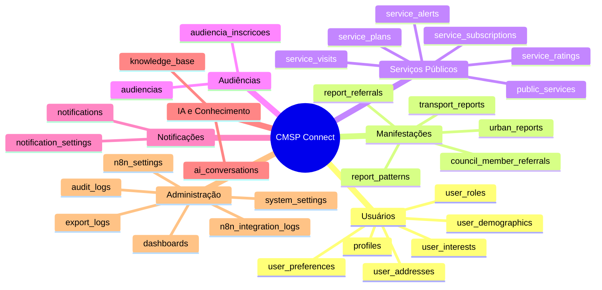
```mermaid
mindmap
  root((CMSP Connect))
    Usuários
      profiles
      user_roles
      user_addresses
      user_demographics
      user_interests
      user_preferences
    Manifestações
      urban_reports
      transport_reports
      council_member_referrals
      report_referrals
      report_patterns
    Serviços Públicos
      public_services
      service_visits
      service_ratings
      service_subscriptions
      service_alerts
      service_plans
    Audiências
      audiencias
      audiencia_inscricoes
    Notificações
      notifications
      notification_settings
    IA e Conhecimento
      ai_conversations
      knowledge_base
    Administração
      audit_logs
      export_logs
      system_settings
      dashboards
      n8n_settings
      n8n_integration_logs
```

---

## 2. Diagrama Entidade-Relacionamento

### 2.1 ERD - Domínio de Usuários

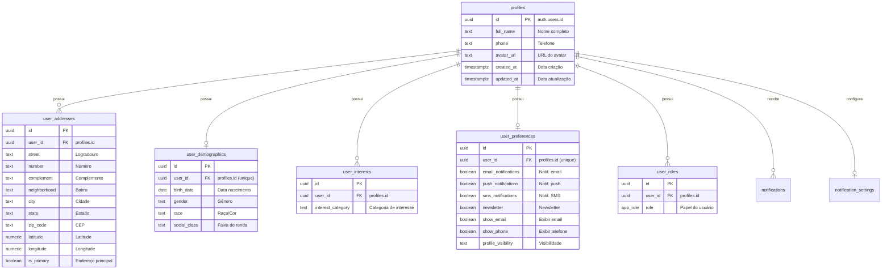
```mermaid
erDiagram
    profiles ||--o{ user_addresses : "possui"
    profiles ||--o| user_demographics : "possui"
    profiles ||--o{ user_interests : "possui"
    profiles ||--o| user_preferences : "possui"
    profiles ||--o{ user_roles : "possui"
    profiles ||--o{ notifications : "recebe"
    profiles ||--o| notification_settings : "configura"

    profiles {
        uuid id PK "auth.users.id"
        text full_name "Nome completo"
        text phone "Telefone"
        text avatar_url "URL do avatar"
        timestamptz created_at "Data criação"
        timestamptz updated_at "Data atualização"
    }

    user_addresses {
        uuid id PK
        uuid user_id FK "profiles.id"
        text street "Logradouro"
        text number "Número"
        text complement "Complemento"
        text neighborhood "Bairro"
        text city "Cidade"
        text state "Estado"
        text zip_code "CEP"
        numeric latitude "Latitude"
        numeric longitude "Longitude"
        boolean is_primary "Endereço principal"
    }

    user_demographics {
        uuid id PK
        uuid user_id FK "profiles.id (unique)"
        date birth_date "Data nascimento"
        text gender "Gênero"
        text race "Raça/Cor"
        text social_class "Faixa de renda"
    }

    user_interests {
        uuid id PK
        uuid user_id FK "profiles.id"
        text interest_category "Categoria de interesse"
    }

    user_preferences {
        uuid id PK
        uuid user_id FK "profiles.id (unique)"
        boolean email_notifications "Notif. email"
        boolean push_notifications "Notif. push"
        boolean sms_notifications "Notif. SMS"
        boolean newsletter "Newsletter"
        boolean show_email "Exibir email"
        boolean show_phone "Exibir telefone"
        text profile_visibility "Visibilidade"
    }

    user_roles {
        uuid id PK
        uuid user_id FK "profiles.id"
        app_role role "Papel do usuário"
    }
```

### 2.2 ERD - Domínio de Manifestações

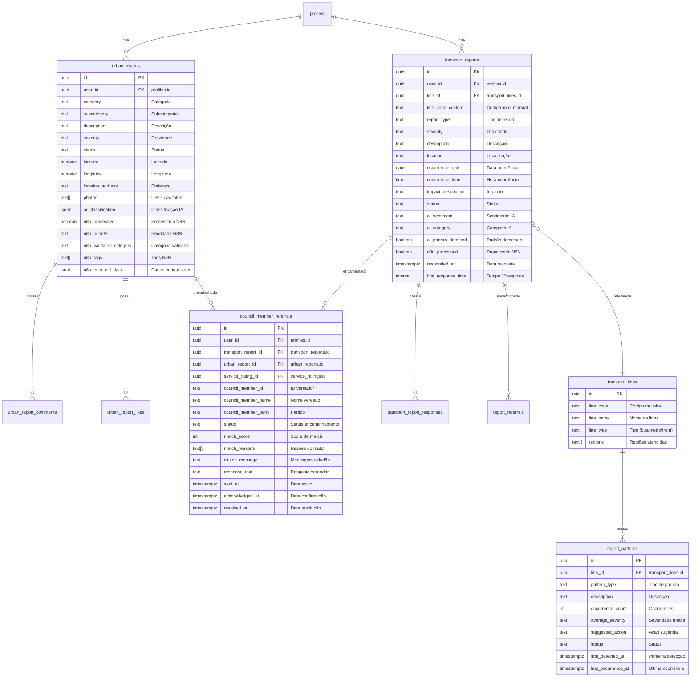
```mermaid
erDiagram
    profiles ||--o{ urban_reports : "cria"
    profiles ||--o{ transport_reports : "cria"
    urban_reports ||--o{ urban_report_comments : "possui"
    urban_reports ||--o{ urban_report_likes : "possui"
    urban_reports ||--o{ council_member_referrals : "encaminhado"
    transport_reports ||--o{ transport_report_responses : "possui"
    transport_reports ||--o{ council_member_referrals : "encaminhado"
    transport_reports ||--o{ report_referrals : "encaminhado"
    transport_reports }o--|| transport_lines : "referencia"
    transport_lines ||--o{ report_patterns : "possui"

    urban_reports {
        uuid id PK
        uuid user_id FK "profiles.id"
        text category "Categoria"
        text subcategory "Subcategoria"
        text description "Descrição"
        text severity "Gravidade"
        text status "Status"
        numeric latitude "Latitude"
        numeric longitude "Longitude"
        text location_address "Endereço"
        text[] photos "URLs das fotos"
        jsonb ai_classification "Classificação IA"
        boolean n8n_processed "Processado N8N"
        text n8n_priority "Prioridade N8N"
        text n8n_validated_category "Categoria validada"
        text[] n8n_tags "Tags N8N"
        jsonb n8n_enriched_data "Dados enriquecidos"
    }

    transport_reports {
        uuid id PK
        uuid user_id FK "profiles.id"
        uuid line_id FK "transport_lines.id"
        text line_code_custom "Código linha manual"
        text report_type "Tipo de relato"
        text severity "Gravidade"
        text description "Descrição"
        text location "Localização"
        date occurrence_date "Data ocorrência"
        time occurrence_time "Hora ocorrência"
        text impact_description "Impacto"
        text status "Status"
        text ai_sentiment "Sentimento IA"
        text ai_category "Categoria IA"
        boolean ai_pattern_detected "Padrão detectado"
        boolean n8n_processed "Processado N8N"
        timestamptz responded_at "Data resposta"
        interval first_response_time "Tempo 1ª resposta"
    }

    transport_lines {
        uuid id PK
        text line_code "Código da linha"
        text line_name "Nome da linha"
        text line_type "Tipo (bus/metro/trem)"
        text[] regions "Regiões atendidas"
    }

    report_patterns {
        uuid id PK
        uuid line_id FK "transport_lines.id"
        text pattern_type "Tipo de padrão"
        text description "Descrição"
        int occurrence_count "Ocorrências"
        text average_severity "Severidade média"
        text suggested_action "Ação sugerida"
        text status "Status"
        timestamptz first_detected_at "Primeira detecção"
        timestamptz last_occurrence_at "Última ocorrência"
    }

    council_member_referrals {
        uuid id PK
        uuid user_id FK "profiles.id"
        uuid transport_report_id FK "transport_reports.id"
        uuid urban_report_id FK "urban_reports.id"
        uuid service_rating_id FK "service_ratings.id"
        text council_member_id "ID vereador"
        text council_member_name "Nome vereador"
        text council_member_party "Partido"
        text status "Status encaminhamento"
        int match_score "Score de match"
        text[] match_reasons "Razões do match"
        text citizen_message "Mensagem cidadão"
        text response_text "Resposta vereador"
        timestamptz sent_at "Data envio"
        timestamptz acknowledged_at "Data confirmação"
        timestamptz resolved_at "Data resolução"
    }
```

### 2.3 ERD - Domínio de Serviços Públicos

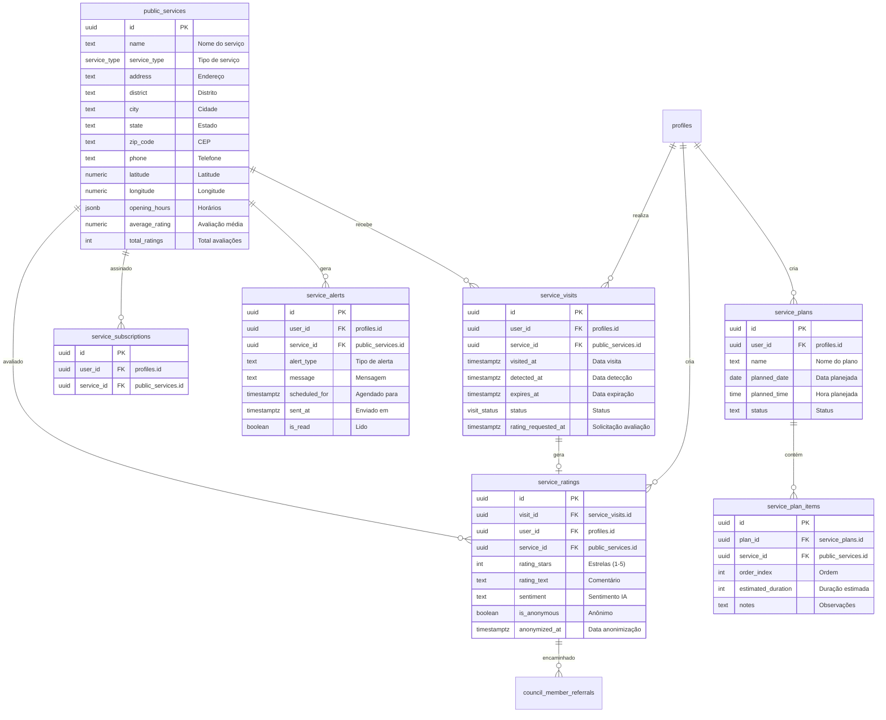
```mermaid
erDiagram
    public_services ||--o{ service_visits : "recebe"
    public_services ||--o{ service_ratings : "avaliado"
    public_services ||--o{ service_subscriptions : "assinado"
    public_services ||--o{ service_alerts : "gera"
    service_visits ||--o| service_ratings : "gera"
    service_ratings ||--o{ council_member_referrals : "encaminhado"
    profiles ||--o{ service_visits : "realiza"
    profiles ||--o{ service_ratings : "cria"
    profiles ||--o{ service_plans : "cria"
    service_plans ||--o{ service_plan_items : "contém"

    public_services {
        uuid id PK
        text name "Nome do serviço"
        service_type service_type "Tipo de serviço"
        text address "Endereço"
        text district "Distrito"
        text city "Cidade"
        text state "Estado"
        text zip_code "CEP"
        text phone "Telefone"
        numeric latitude "Latitude"
        numeric longitude "Longitude"
        jsonb opening_hours "Horários"
        numeric average_rating "Avaliação média"
        int total_ratings "Total avaliações"
    }

    service_visits {
        uuid id PK
        uuid user_id FK "profiles.id"
        uuid service_id FK "public_services.id"
        timestamptz visited_at "Data visita"
        timestamptz detected_at "Data detecção"
        timestamptz expires_at "Data expiração"
        visit_status status "Status"
        timestamptz rating_requested_at "Solicitação avaliação"
    }

    service_ratings {
        uuid id PK
        uuid visit_id FK "service_visits.id"
        uuid user_id FK "profiles.id"
        uuid service_id FK "public_services.id"
        int rating_stars "Estrelas (1-5)"
        text rating_text "Comentário"
        text sentiment "Sentimento IA"
        boolean is_anonymous "Anônimo"
        timestamptz anonymized_at "Data anonimização"
    }

    service_subscriptions {
        uuid id PK
        uuid user_id FK "profiles.id"
        uuid service_id FK "public_services.id"
    }

    service_alerts {
        uuid id PK
        uuid user_id FK "profiles.id"
        uuid service_id FK "public_services.id"
        text alert_type "Tipo de alerta"
        text message "Mensagem"
        timestamptz scheduled_for "Agendado para"
        timestamptz sent_at "Enviado em"
        boolean is_read "Lido"
    }

    service_plans {
        uuid id PK
        uuid user_id FK "profiles.id"
        text name "Nome do plano"
        date planned_date "Data planejada"
        time planned_time "Hora planejada"
        text status "Status"
    }

    service_plan_items {
        uuid id PK
        uuid plan_id FK "service_plans.id"
        uuid service_id FK "public_services.id"
        int order_index "Ordem"
        int estimated_duration "Duração estimada"
        text notes "Observações"
    }
```

### 2.4 ERD - Domínio de Audiências

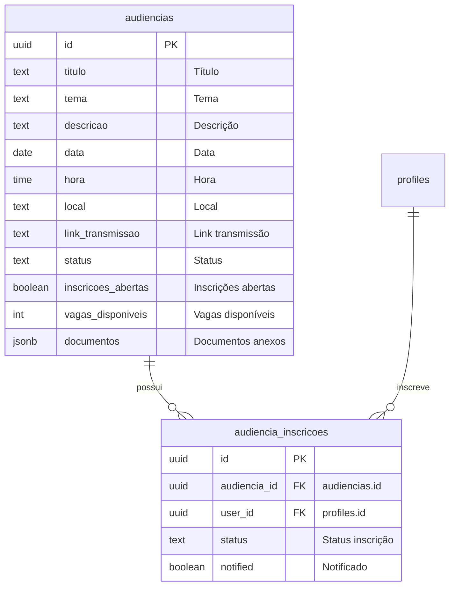
```mermaid
erDiagram
    audiencias ||--o{ audiencia_inscricoes : "possui"
    profiles ||--o{ audiencia_inscricoes : "inscreve"

    audiencias {
        uuid id PK
        text titulo "Título"
        text tema "Tema"
        text descricao "Descrição"
        date data "Data"
        time hora "Hora"
        text local "Local"
        text link_transmissao "Link transmissão"
        text status "Status"
        boolean inscricoes_abertas "Inscrições abertas"
        int vagas_disponiveis "Vagas disponíveis"
        jsonb documentos "Documentos anexos"
    }

    audiencia_inscricoes {
        uuid id PK
        uuid audiencia_id FK "audiencias.id"
        uuid user_id FK "profiles.id"
        text status "Status inscrição"
        boolean notified "Notificado"
    }
```

### 2.5 ERD - Domínio de IA e Conhecimento

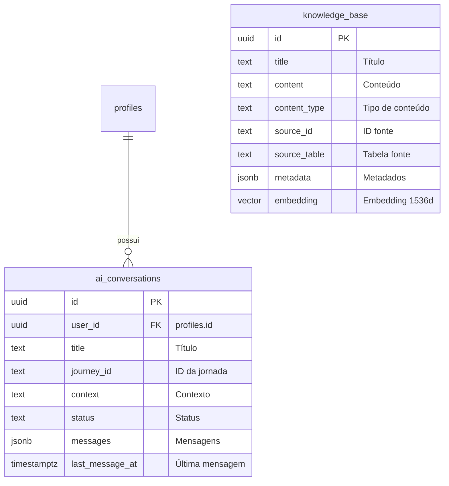
```mermaid
erDiagram
    profiles ||--o{ ai_conversations : "possui"

    ai_conversations {
        uuid id PK
        uuid user_id FK "profiles.id"
        text title "Título"
        text journey_id "ID da jornada"
        text context "Contexto"
        text status "Status"
        jsonb messages "Mensagens"
        timestamptz last_message_at "Última mensagem"
    }

    knowledge_base {
        uuid id PK
        text title "Título"
        text content "Conteúdo"
        text content_type "Tipo de conteúdo"
        text source_id "ID fonte"
        text source_table "Tabela fonte"
        jsonb metadata "Metadados"
        vector embedding "Embedding 1536d"
    }
```

### 2.6 ERD Completo Consolidado

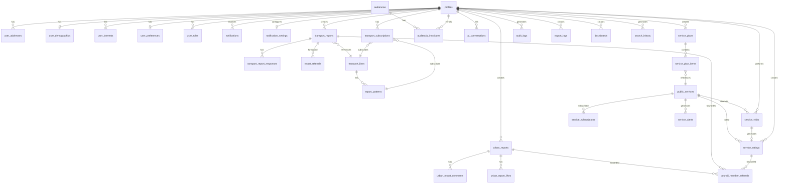
```mermaid
erDiagram
    %% Usuários
    profiles ||--o{ user_addresses : has
    profiles ||--o| user_demographics : has
    profiles ||--o{ user_interests : has
    profiles ||--o| user_preferences : has
    profiles ||--o{ user_roles : has
    profiles ||--o{ notifications : receives
    profiles ||--o| notification_settings : configures
    
    %% Manifestações
    profiles ||--o{ urban_reports : creates
    profiles ||--o{ transport_reports : creates
    urban_reports ||--o{ urban_report_comments : has
    urban_reports ||--o{ urban_report_likes : has
    urban_reports ||--o{ council_member_referrals : forwarded
    transport_reports ||--o{ transport_report_responses : has
    transport_reports ||--o{ council_member_referrals : forwarded
    transport_reports ||--o{ report_referrals : forwarded
    transport_reports }o--|| transport_lines : references
    transport_lines ||--o{ report_patterns : has
    
    %% Serviços
    public_services ||--o{ service_visits : receives
    public_services ||--o{ service_ratings : rated
    public_services ||--o{ service_subscriptions : subscribed
    public_services ||--o{ service_alerts : generates
    service_visits ||--o| service_ratings : generates
    service_ratings ||--o{ council_member_referrals : forwarded
    profiles ||--o{ service_visits : performs
    profiles ||--o{ service_ratings : creates
    profiles ||--o{ service_plans : creates
    service_plans ||--o{ service_plan_items : contains
    service_plan_items }o--|| public_services : references
    
    %% Audiências
    audiencias ||--o{ audiencia_inscricoes : has
    profiles ||--o{ audiencia_inscricoes : enrolls
    
    %% IA
    profiles ||--o{ ai_conversations : has
    
    %% Transporte
    profiles ||--o{ transport_subscriptions : has
    transport_subscriptions }o--|| transport_lines : subscribes
    transport_subscriptions }o--|| report_patterns : subscribes
    
    %% Admin
    profiles ||--o{ audit_logs : generates
    profiles ||--o{ export_logs : creates
    profiles ||--o{ dashboards : creates
    profiles ||--o{ search_history : generates
```

---

## 3. Dicionário de Dados

### 3.1 Tabela: profiles

**Descrição:** Perfis de usuários do sistema, criados automaticamente após registro via auth.users.

| Coluna | Tipo | Nulo | Default | Descrição |
|--------|------|------|---------|-----------|
| id | uuid | Não | - | PK, referencia auth.users.id |
| full_name | text | Não | - | Nome completo do usuário |
| phone | text | Sim | NULL | Telefone de contato |
| avatar_url | text | Sim | NULL | URL da imagem de perfil |
| created_at | timestamptz | Não | now() | Data de criação |
| updated_at | timestamptz | Não | now() | Data de atualização |

**Índices:**
- PRIMARY KEY (id)

**Triggers:**
- `handle_new_user`: Cria perfil automaticamente quando usuário registra em auth.users
- `initialize_user_preferences`: Inicializa preferências padrão do usuário

---

### 3.2 Tabela: user_addresses

**Descrição:** Endereços dos usuários, suportando múltiplos endereços por usuário.

| Coluna | Tipo | Nulo | Default | Descrição |
|--------|------|------|---------|-----------|
| id | uuid | Não | uuid_generate_v4() | PK |
| user_id | uuid | Não | - | FK profiles.id |
| street | text | Não | - | Logradouro |
| number | text | Não | - | Número |
| complement | text | Sim | NULL | Complemento |
| neighborhood | text | Não | - | Bairro |
| city | text | Não | - | Cidade |
| state | text | Não | - | Estado (UF) |
| zip_code | text | Não | - | CEP |
| latitude | numeric | Sim | NULL | Latitude geocodificada |
| longitude | numeric | Sim | NULL | Longitude geocodificada |
| is_primary | boolean | Não | false | Indica endereço principal |
| created_at | timestamptz | Não | now() | Data de criação |
| updated_at | timestamptz | Não | now() | Data de atualização |

**Índices:**
- PRIMARY KEY (id)
- INDEX (user_id)
- INDEX (neighborhood)
- INDEX (zip_code)

**Regras:**
- Apenas um endereço pode ser `is_primary = true` por usuário
- CEP deve ter formato válido (8 dígitos)

---

### 3.3 Tabela: user_demographics

**Descrição:** Dados demográficos opcionais do usuário (LGPD - dados sensíveis).

| Coluna | Tipo | Nulo | Default | Descrição |
|--------|------|------|---------|-----------|
| id | uuid | Não | uuid_generate_v4() | PK |
| user_id | uuid | Não | - | FK profiles.id (UNIQUE) |
| birth_date | date | Sim | NULL | Data de nascimento |
| gender | text | Sim | NULL | Gênero |
| race | text | Sim | NULL | Raça/Cor autodeclarada |
| social_class | text | Sim | NULL | Faixa de renda |
| created_at | timestamptz | Não | now() | Data de criação |
| updated_at | timestamptz | Não | now() | Data de atualização |

**Índices:**
- PRIMARY KEY (id)
- UNIQUE (user_id)

**Regras:**
- Todos os campos são opcionais
- Dados sensíveis conforme LGPD Art. 5º, II
- Requer consentimento explícito para coleta

---

### 3.4 Tabela: user_interests

**Descrição:** Categorias de interesse selecionadas pelo usuário.

| Coluna | Tipo | Nulo | Default | Descrição |
|--------|------|------|---------|-----------|
| id | uuid | Não | uuid_generate_v4() | PK |
| user_id | uuid | Não | - | FK profiles.id |
| interest_category | text | Não | - | Categoria de interesse |
| created_at | timestamptz | Não | now() | Data de criação |

**Categorias válidas:**
- `saude` - Saúde
- `educacao` - Educação
- `transporte` - Transporte
- `seguranca` - Segurança
- `meio_ambiente` - Meio Ambiente
- `cultura` - Cultura
- `esportes` - Esportes
- `assistencia_social` - Assistência Social
- `urbanismo` - Urbanismo
- `transparencia` - Transparência

---

### 3.5 Tabela: user_preferences

**Descrição:** Preferências de notificação e privacidade do usuário.

| Coluna | Tipo | Nulo | Default | Descrição |
|--------|------|------|---------|-----------|
| id | uuid | Não | gen_random_uuid() | PK |
| user_id | uuid | Não | - | FK profiles.id (UNIQUE) |
| email_notifications | boolean | Não | true | Receber notificações por email |
| push_notifications | boolean | Não | true | Receber notificações push |
| sms_notifications | boolean | Não | false | Receber notificações SMS |
| newsletter | boolean | Não | false | Receber newsletter |
| show_email | boolean | Não | false | Exibir email publicamente |
| show_phone | boolean | Não | false | Exibir telefone publicamente |
| profile_visibility | text | Não | 'public' | Visibilidade do perfil |
| created_at | timestamptz | Não | now() | Data de criação |
| updated_at | timestamptz | Não | now() | Data de atualização |

**Valores válidos para profile_visibility:**
- `public` - Perfil público
- `private` - Perfil privado
- `contacts` - Apenas contatos

---

### 3.6 Tabela: user_roles

**Descrição:** Papéis/funções atribuídas aos usuários no sistema.

| Coluna | Tipo | Nulo | Default | Descrição |
|--------|------|------|---------|-----------|
| id | uuid | Não | gen_random_uuid() | PK |
| user_id | uuid | Não | - | FK profiles.id |
| role | app_role | Não | - | Papel do usuário |
| created_at | timestamptz | Sim | now() | Data de criação |

**Enum app_role:**
- `admin` - Administrador do sistema
- `gestor` - Gestor da Câmara
- `vereador` - Vereador
- `assessor` - Assessor parlamentar
- `cidadao` - Cidadão comum

---

### 3.7 Tabela: urban_reports

**Descrição:** Relatos urbanos registrados pelos cidadãos.

| Coluna | Tipo | Nulo | Default | Descrição |
|--------|------|------|---------|-----------|
| id | uuid | Não | gen_random_uuid() | PK |
| user_id | uuid | Não | - | FK profiles.id |
| category | text | Não | - | Categoria do relato |
| subcategory | text | Sim | NULL | Subcategoria |
| description | text | Sim | NULL | Descrição detalhada |
| severity | text | Sim | 'media' | Gravidade |
| status | text | Sim | 'pending' | Status do relato |
| latitude | numeric | Sim | NULL | Latitude |
| longitude | numeric | Sim | NULL | Longitude |
| location_address | text | Sim | NULL | Endereço textual |
| photos | text[] | Sim | NULL | URLs das fotos |
| ai_classification | jsonb | Sim | NULL | Classificação por IA |
| n8n_processed | boolean | Sim | false | Processado pelo N8N |
| n8n_processed_at | timestamptz | Sim | NULL | Data processamento N8N |
| n8n_priority | text | Sim | NULL | Prioridade N8N |
| n8n_validated_category | text | Sim | NULL | Categoria validada |
| n8n_tags | text[] | Sim | NULL | Tags do N8N |
| n8n_enriched_data | jsonb | Sim | NULL | Dados enriquecidos |
| n8n_workflow_id | text | Sim | NULL | ID do workflow N8N |
| created_at | timestamptz | Sim | now() | Data de criação |
| updated_at | timestamptz | Sim | now() | Data de atualização |

**Categorias válidas:**
- `infraestrutura` - Problemas de infraestrutura
- `iluminacao` - Iluminação pública
- `limpeza` - Limpeza urbana
- `transito` - Trânsito e sinalização
- `areas_verdes` - Áreas verdes e praças
- `acessibilidade` - Acessibilidade
- `feedback_camara` - Feedback sobre a Câmara
- `outros` - Outros

**Status válidos:**
- `pending` - Pendente
- `in_progress` - Em andamento
- `resolved` - Resolvido
- `rejected` - Rejeitado

**Severidades válidas:**
- `baixa` - Baixa urgência
- `media` - Média urgência
- `alta` - Alta urgência
- `critica` - Crítica

---

### 3.8 Tabela: urban_report_comments

**Descrição:** Comentários em relatos urbanos.

| Coluna | Tipo | Nulo | Default | Descrição |
|--------|------|------|---------|-----------|
| id | uuid | Não | gen_random_uuid() | PK |
| report_id | uuid | Não | - | FK urban_reports.id |
| user_id | uuid | Não | - | FK profiles.id |
| comment_text | text | Não | - | Texto do comentário |
| created_at | timestamptz | Não | now() | Data de criação |
| updated_at | timestamptz | Não | now() | Data de atualização |

---

### 3.9 Tabela: urban_report_likes

**Descrição:** Curtidas/apoios em relatos urbanos.

| Coluna | Tipo | Nulo | Default | Descrição |
|--------|------|------|---------|-----------|
| id | uuid | Não | gen_random_uuid() | PK |
| report_id | uuid | Não | - | FK urban_reports.id |
| user_id | uuid | Não | - | FK profiles.id |
| created_at | timestamptz | Não | now() | Data de criação |

**Regras:**
- UNIQUE (report_id, user_id) - Um usuário só pode curtir uma vez

---

### 3.10 Tabela: transport_reports

**Descrição:** Relatos de problemas no transporte público.

| Coluna | Tipo | Nulo | Default | Descrição |
|--------|------|------|---------|-----------|
| id | uuid | Não | gen_random_uuid() | PK |
| user_id | uuid | Não | - | FK profiles.id |
| line_id | uuid | Sim | NULL | FK transport_lines.id |
| line_code_custom | text | Sim | NULL | Código da linha manual |
| report_type | text | Não | - | Tipo do relato |
| severity | text | Não | 'medium' | Gravidade |
| description | text | Sim | NULL | Descrição detalhada |
| location | text | Sim | NULL | Localização |
| impact_description | text | Sim | NULL | Descrição do impacto |
| occurrence_date | date | Não | - | Data da ocorrência |
| occurrence_time | time | Sim | NULL | Hora da ocorrência |
| status | text | Não | 'pending' | Status do relato |
| ai_sentiment | text | Sim | NULL | Sentimento detectado |
| ai_category | text | Sim | NULL | Categoria IA |
| ai_pattern_detected | boolean | Sim | false | Padrão detectado |
| n8n_processed | boolean | Sim | false | Processado N8N |
| n8n_processed_at | timestamptz | Sim | NULL | Data processamento |
| n8n_priority | text | Sim | NULL | Prioridade N8N |
| n8n_validated_category | text | Sim | NULL | Categoria validada |
| n8n_tags | text[] | Sim | NULL | Tags N8N |
| n8n_enriched_data | jsonb | Sim | NULL | Dados enriquecidos |
| n8n_workflow_id | text | Sim | NULL | ID workflow N8N |
| responded_at | timestamptz | Sim | NULL | Data da resposta |
| first_response_time | interval | Sim | NULL | Tempo 1ª resposta |
| created_at | timestamptz | Sim | now() | Data de criação |
| updated_at | timestamptz | Sim | now() | Data de atualização |

**Tipos de relato válidos:**
- `atraso` - Atraso
- `lotacao` - Superlotação
- `seguranca` - Segurança
- `limpeza` - Limpeza
- `acessibilidade` - Acessibilidade
- `conduta` - Conduta do motorista
- `ar_condicionado` - Ar condicionado
- `outros` - Outros

---

### 3.11 Tabela: transport_lines

**Descrição:** Linhas de transporte público cadastradas.

| Coluna | Tipo | Nulo | Default | Descrição |
|--------|------|------|---------|-----------|
| id | uuid | Não | gen_random_uuid() | PK |
| line_code | text | Não | - | Código da linha |
| line_name | text | Não | - | Nome da linha |
| line_type | text | Não | 'bus' | Tipo de transporte |
| regions | text[] | Sim | '{}' | Regiões atendidas |
| created_at | timestamptz | Sim | now() | Data de criação |

**Tipos de linha válidos:**
- `bus` - Ônibus
- `metro` - Metrô
- `trem` - Trem
- `vlt` - VLT

---

### 3.12 Tabela: transport_report_responses

**Descrição:** Respostas oficiais aos relatos de transporte.

| Coluna | Tipo | Nulo | Default | Descrição |
|--------|------|------|---------|-----------|
| id | uuid | Não | gen_random_uuid() | PK |
| report_id | uuid | Não | - | FK transport_reports.id |
| responder_id | uuid | Não | - | ID do respondente |
| response_text | text | Não | - | Texto da resposta |
| response_type | text | Não | 'answer' | Tipo de resposta |
| is_public | boolean | Sim | true | Resposta pública |
| created_at | timestamptz | Sim | now() | Data de criação |
| updated_at | timestamptz | Sim | now() | Data de atualização |

---

### 3.13 Tabela: report_patterns

**Descrição:** Padrões detectados automaticamente em relatos.

| Coluna | Tipo | Nulo | Default | Descrição |
|--------|------|------|---------|-----------|
| id | uuid | Não | gen_random_uuid() | PK |
| line_id | uuid | Sim | NULL | FK transport_lines.id |
| pattern_type | text | Não | - | Tipo de padrão |
| description | text | Não | - | Descrição do padrão |
| occurrence_count | int | Sim | 1 | Contagem de ocorrências |
| average_severity | text | Sim | NULL | Severidade média |
| suggested_action | text | Sim | NULL | Ação sugerida |
| status | text | Sim | 'active' | Status do padrão |
| first_detected_at | timestamptz | Sim | now() | Primeira detecção |
| last_occurrence_at | timestamptz | Sim | now() | Última ocorrência |

---

### 3.14 Tabela: council_member_referrals

**Descrição:** Encaminhamentos de manifestações para vereadores.

| Coluna | Tipo | Nulo | Default | Descrição |
|--------|------|------|---------|-----------|
| id | uuid | Não | gen_random_uuid() | PK |
| user_id | uuid | Não | - | FK profiles.id |
| transport_report_id | uuid | Sim | NULL | FK transport_reports.id |
| urban_report_id | uuid | Sim | NULL | FK urban_reports.id |
| service_rating_id | uuid | Sim | NULL | FK service_ratings.id |
| council_member_id | text | Não | - | ID do vereador |
| council_member_name | text | Não | - | Nome do vereador |
| council_member_party | text | Sim | NULL | Partido do vereador |
| status | text | Não | 'pending' | Status do encaminhamento |
| match_score | int | Sim | 0 | Score de compatibilidade |
| match_reasons | text[] | Sim | NULL | Razões do match |
| citizen_message | text | Sim | NULL | Mensagem do cidadão |
| response_text | text | Sim | NULL | Resposta do vereador |
| sent_at | timestamptz | Sim | NULL | Data de envio |
| acknowledged_at | timestamptz | Sim | NULL | Data de confirmação |
| resolved_at | timestamptz | Sim | NULL | Data de resolução |
| created_at | timestamptz | Sim | now() | Data de criação |
| updated_at | timestamptz | Sim | now() | Data de atualização |

**Status válidos (referral_status enum):**
- `pending` - Pendente
- `sent` - Enviado
- `acknowledged` - Confirmado
- `resolved` - Resolvido

---

### 3.15 Tabela: public_services

**Descrição:** Serviços públicos cadastrados (UBS, escolas, etc.).

| Coluna | Tipo | Nulo | Default | Descrição |
|--------|------|------|---------|-----------|
| id | uuid | Não | gen_random_uuid() | PK |
| name | text | Não | - | Nome do serviço |
| service_type | service_type | Não | - | Tipo de serviço |
| address | text | Não | - | Endereço completo |
| district | text | Não | - | Distrito |
| city | text | Não | 'São Paulo' | Cidade |
| state | text | Não | 'SP' | Estado |
| zip_code | text | Sim | NULL | CEP |
| phone | text | Sim | NULL | Telefone |
| latitude | numeric | Não | - | Latitude |
| longitude | numeric | Não | - | Longitude |
| opening_hours | jsonb | Sim | NULL | Horários de funcionamento |
| average_rating | numeric | Sim | 0 | Avaliação média |
| total_ratings | int | Sim | 0 | Total de avaliações |
| created_at | timestamptz | Sim | now() | Data de criação |
| updated_at | timestamptz | Sim | now() | Data de atualização |

**Enum service_type:**
- `ubs` - Unidade Básica de Saúde
- `school` - Escola
- `ceu` - Centro Educacional Unificado
- `hospital` - Hospital
- `library` - Biblioteca
- `sports_center` - Centro Esportivo
- `other` - Outros

---

### 3.16 Tabela: service_visits

**Descrição:** Visitas detectadas a serviços públicos.

| Coluna | Tipo | Nulo | Default | Descrição |
|--------|------|------|---------|-----------|
| id | uuid | Não | gen_random_uuid() | PK |
| user_id | uuid | Não | - | FK profiles.id |
| service_id | uuid | Não | - | FK public_services.id |
| visited_at | timestamptz | Não | now() | Data/hora da visita |
| detected_at | timestamptz | Não | now() | Data/hora da detecção |
| expires_at | timestamptz | Não | - | Expiração para avaliação |
| status | visit_status | Não | 'pending' | Status da visita |
| rating_requested_at | timestamptz | Sim | NULL | Solicitação de avaliação |
| created_at | timestamptz | Sim | now() | Data de criação |
| updated_at | timestamptz | Sim | now() | Data de atualização |

**Enum visit_status:**
- `pending` - Avaliação pendente
- `completed` - Avaliação completa
- `expired` - Expirada
- `skipped` - Pulada

---

### 3.17 Tabela: service_ratings

**Descrição:** Avaliações de serviços públicos.

| Coluna | Tipo | Nulo | Default | Descrição |
|--------|------|------|---------|-----------|
| id | uuid | Não | gen_random_uuid() | PK |
| visit_id | uuid | Não | - | FK service_visits.id |
| user_id | uuid | Não | - | FK profiles.id |
| service_id | uuid | Não | - | FK public_services.id |
| rating_stars | int | Não | - | Avaliação (1-5) |
| rating_text | text | Sim | NULL | Comentário |
| sentiment | text | Sim | NULL | Sentimento detectado |
| is_anonymous | boolean | Sim | false | Avaliação anônima |
| anonymized_at | timestamptz | Sim | NULL | Data anonimização |
| created_at | timestamptz | Sim | now() | Data de criação |
| updated_at | timestamptz | Sim | now() | Data de atualização |

**Regras:**
- `rating_stars` deve estar entre 1 e 5
- Trigger atualiza `average_rating` em `public_services`

---

### 3.18 Tabela: audiencias

**Descrição:** Audiências públicas da Câmara.

| Coluna | Tipo | Nulo | Default | Descrição |
|--------|------|------|---------|-----------|
| id | uuid | Não | gen_random_uuid() | PK |
| titulo | text | Não | - | Título da audiência |
| tema | text | Não | - | Tema principal |
| descricao | text | Sim | NULL | Descrição detalhada |
| data | date | Não | - | Data da audiência |
| hora | time | Não | - | Hora de início |
| local | text | Não | - | Local físico |
| link_transmissao | text | Sim | NULL | Link para transmissão |
| status | text | Não | 'agendada' | Status |
| inscricoes_abertas | boolean | Sim | true | Inscrições abertas |
| vagas_disponiveis | int | Sim | NULL | Vagas presenciais |
| documentos | jsonb | Sim | '[]' | Documentos anexos |
| created_at | timestamptz | Não | now() | Data de criação |
| updated_at | timestamptz | Não | now() | Data de atualização |

**Status válidos:**
- `agendada` - Agendada
- `em_andamento` - Em andamento
- `concluida` - Concluída
- `cancelada` - Cancelada

---

### 3.19 Tabela: audiencia_inscricoes

**Descrição:** Inscrições de cidadãos em audiências.

| Coluna | Tipo | Nulo | Default | Descrição |
|--------|------|------|---------|-----------|
| id | uuid | Não | gen_random_uuid() | PK |
| audiencia_id | uuid | Não | - | FK audiencias.id |
| user_id | uuid | Não | - | FK profiles.id |
| status | text | Não | 'confirmada' | Status da inscrição |
| notified | boolean | Sim | false | Notificado |
| created_at | timestamptz | Não | now() | Data de criação |

**Status válidos:**
- `confirmada` - Confirmada
- `cancelada` - Cancelada
- `lista_espera` - Lista de espera

---

### 3.20 Tabela: ai_conversations

**Descrição:** Conversas dos usuários com o assistente de IA.

| Coluna | Tipo | Nulo | Default | Descrição |
|--------|------|------|---------|-----------|
| id | uuid | Não | gen_random_uuid() | PK |
| user_id | uuid | Não | - | FK profiles.id |
| title | text | Sim | NULL | Título da conversa |
| journey_id | text | Sim | 'general' | ID da jornada |
| context | text | Sim | NULL | Contexto adicional |
| status | text | Sim | 'active' | Status |
| messages | jsonb | Não | '[]' | Array de mensagens |
| last_message_at | timestamptz | Não | now() | Última mensagem |
| created_at | timestamptz | Não | now() | Data de criação |
| updated_at | timestamptz | Não | now() | Data de atualização |

**Jornadas válidas:**
- `general` - Tudo sobre a Câmara
- `urban_report` - Fala Cidadão!
- `transport` - Transporte
- `services` - Serviços
- `evaluate` - Avaliar

**Estrutura de messages (jsonb):**
```json
[
  {
    "id": "uuid",
    "role": "user|assistant",
    "content": "texto da mensagem",
    "timestamp": "ISO 8601"
  }
]
```

---

### 3.21 Tabela: knowledge_base

**Descrição:** Base de conhecimento para RAG (Retrieval-Augmented Generation).

| Coluna | Tipo | Nulo | Default | Descrição |
|--------|------|------|---------|-----------|
| id | uuid | Não | gen_random_uuid() | PK |
| title | text | Sim | NULL | Título do documento |
| content | text | Não | - | Conteúdo textual |
| content_type | text | Não | - | Tipo de conteúdo |
| source_id | text | Sim | NULL | ID na fonte original |
| source_table | text | Sim | NULL | Tabela/fonte de origem |
| metadata | jsonb | Sim | '{}' | Metadados adicionais |
| embedding | vector(1536) | Sim | NULL | Vetor de embedding |
| created_at | timestamptz | Sim | now() | Data de criação |
| updated_at | timestamptz | Sim | now() | Data de atualização |

**Tipos de conteúdo válidos:**
- `noticia` - Notícias
- `audiencia` - Audiências
- `vereador` - Vereadores
- `comissao` - Comissões
- `legislativo` - Conteúdo legislativo
- `institucional` - Conteúdo institucional
- `faq` - Perguntas frequentes
- `evento` - Eventos

---

### 3.22 Tabela: notifications

**Descrição:** Notificações enviadas aos usuários.

| Coluna | Tipo | Nulo | Default | Descrição |
|--------|------|------|---------|-----------|
| id | uuid | Não | gen_random_uuid() | PK |
| user_id | uuid | Não | - | FK profiles.id |
| title | text | Não | - | Título |
| message | text | Não | - | Mensagem |
| type | text | Não | 'general' | Tipo de notificação |
| priority | text | Não | 'normal' | Prioridade |
| action_url | text | Sim | NULL | URL de ação |
| metadata | jsonb | Sim | '{}' | Metadados |
| is_read | boolean | Não | false | Lida |
| read_at | timestamptz | Sim | NULL | Data de leitura |
| created_at | timestamptz | Não | now() | Data de criação |

**Tipos de notificação:**
- `general` - Geral
- `legislativa` - Legislativa
- `servico` - Serviço
- `transporte` - Transporte
- `urbano` - Urbano
- `referral` - Encaminhamento
- `audiencia` - Audiência
- `referral_update` - Atualização de encaminhamento

---

### 3.23 Tabela: notification_settings

**Descrição:** Configurações de notificação por usuário.

| Coluna | Tipo | Nulo | Default | Descrição |
|--------|------|------|---------|-----------|
| id | uuid | Não | gen_random_uuid() | PK |
| user_id | uuid | Não | - | FK profiles.id (UNIQUE) |
| push_enabled | boolean | Sim | true | Push habilitado |
| email_enabled | boolean | Sim | true | Email habilitado |
| sms_enabled | boolean | Sim | false | SMS habilitado |
| newsletter_enabled | boolean | Sim | false | Newsletter |
| quiet_hours_start | time | Sim | NULL | Início horário silencioso |
| quiet_hours_end | time | Sim | NULL | Fim horário silencioso |
| max_daily_notifications | int | Sim | 10 | Máximo diário |
| categories_enabled | text[] | Sim | Array padrão | Categorias habilitadas |
| created_at | timestamptz | Não | now() | Data de criação |
| updated_at | timestamptz | Não | now() | Data de atualização |

---

### 3.24 Tabela: audit_logs

**Descrição:** Logs de auditoria de ações no sistema.

| Coluna | Tipo | Nulo | Default | Descrição |
|--------|------|------|---------|-----------|
| id | uuid | Não | gen_random_uuid() | PK |
| user_id | uuid | Sim | NULL | FK profiles.id |
| action | text | Não | - | Ação executada |
| entity_type | text | Não | - | Tipo de entidade |
| entity_id | uuid | Sim | NULL | ID da entidade |
| old_values | jsonb | Sim | NULL | Valores anteriores |
| new_values | jsonb | Sim | NULL | Novos valores |
| metadata | jsonb | Sim | '{}' | Metadados |
| ip_address | text | Sim | NULL | Endereço IP |
| user_agent | text | Sim | NULL | User Agent |
| created_at | timestamptz | Não | now() | Data de criação |

---

### 3.25 Tabela: dashboards

**Descrição:** Dashboards personalizados criados por usuários.

| Coluna | Tipo | Nulo | Default | Descrição |
|--------|------|------|---------|-----------|
| id | uuid | Não | gen_random_uuid() | PK |
| user_id | uuid | Não | - | FK profiles.id |
| title | text | Não | - | Título |
| description | text | Sim | NULL | Descrição |
| config | jsonb | Não | '{}' | Configuração do dashboard |
| is_public | boolean | Sim | false | Dashboard público |
| is_approved | boolean | Sim | false | Aprovado para público |
| created_at | timestamptz | Sim | now() | Data de criação |
| updated_at | timestamptz | Sim | now() | Data de atualização |

---

### 3.26 Tabela: noticias

**Descrição:** Notícias da Câmara (cache de dados externos).

| Coluna | Tipo | Nulo | Default | Descrição |
|--------|------|------|---------|-----------|
| id | uuid | Não | gen_random_uuid() | PK |
| titulo | text | Não | - | Título |
| conteudo | text | Não | - | Conteúdo completo |
| resumo | text | Sim | NULL | Resumo |
| imagem_url | text | Sim | NULL | URL da imagem |
| categoria | text | Não | - | Categoria |
| autor | text | Sim | NULL | Autor |
| fonte | text | Sim | 'Portal CMSP' | Fonte |
| tags | text[] | Sim | '{}' | Tags |
| data_publicacao | timestamptz | Não | now() | Data publicação |
| destaque | boolean | Sim | false | Em destaque |
| created_at | timestamptz | Não | now() | Data de criação |

---

### 3.27 Tabelas Adicionais

As seguintes tabelas complementam o modelo:

| Tabela | Descrição |
|--------|-----------|
| `search_history` | Histórico de buscas do usuário |
| `service_subscriptions` | Assinaturas de alertas de serviços |
| `service_alerts` | Alertas de serviços |
| `service_plans` | Planos de visita a serviços |
| `service_plan_items` | Itens dos planos de visita |
| `service_corrections` | Correções sugeridas para serviços |
| `report_referrals` | Encaminhamentos de relatos de transporte |
| `rating_referrals` | Encaminhamentos de avaliações |
| `transport_subscriptions` | Assinaturas de alertas de transporte |
| `profile_completion_progress` | Progresso de completude do perfil |
| `export_logs` | Logs de exportação de dados |
| `system_settings` | Configurações do sistema |
| `n8n_settings` | Configurações de integração N8N |
| `n8n_integration_logs` | Logs de integração N8N |

---

## 4. Regras de Negócio por Entidade

### 4.1 Manifestações Urbanas (urban_reports)

| Código | Regra | Descrição |
|--------|-------|-----------|
| RN-URB-001 | Categoria obrigatória | Todo relato deve ter categoria definida |
| RN-URB-002 | Localização recomendada | Sistema solicita localização para melhor encaminhamento |
| RN-URB-003 | Severidade padrão | Severidade default é 'media' se não especificada |
| RN-URB-004 | Status inicial | Todo relato inicia com status 'pending' |
| RN-URB-005 | Classificação IA | Sistema classifica automaticamente via IA |
| RN-URB-006 | Processamento N8N | Relatos são enviados ao N8N para enriquecimento |
| RN-URB-007 | Notificação de status | Usuário é notificado a cada mudança de status |
| RN-URB-008 | Fotos opcionais | Máximo de 5 fotos por relato |
| RN-URB-009 | Edição limitada | Usuário só pode editar relatos com status 'pending' |
| RN-URB-010 | Encaminhamento | Relatos podem ser encaminhados a vereadores |

### 4.2 Relatos de Transporte (transport_reports)

| Código | Regra | Descrição |
|--------|-------|-----------|
| RN-TRA-001 | Data obrigatória | Data de ocorrência é obrigatória |
| RN-TRA-002 | Linha de transporte | Preferencialmente associado a linha cadastrada |
| RN-TRA-003 | Tipo de relato | Tipo deve ser válido conforme enum |
| RN-TRA-004 | Detecção de padrões | Sistema detecta padrões recorrentes |
| RN-TRA-005 | Tempo de resposta | Sistema calcula tempo até primeira resposta |
| RN-TRA-006 | Sentimento IA | IA analisa sentimento do relato |
| RN-TRA-007 | Respostas oficiais | Apenas admins/gestores podem responder |

### 4.3 Avaliações de Serviço (service_ratings)

| Código | Regra | Descrição |
|--------|-------|-----------|
| RN-RAT-001 | Visita prévia | Avaliação requer visita detectada |
| RN-RAT-002 | Prazo de avaliação | Visita expira em 7 dias para avaliação |
| RN-RAT-003 | Escala de estrelas | Avaliação de 1 a 5 estrelas |
| RN-RAT-004 | Anonimato | Usuário pode optar por anonimato |
| RN-RAT-005 | Atualização média | Trigger atualiza média do serviço |
| RN-RAT-006 | Sentimento IA | IA analisa sentimento do comentário |
| RN-RAT-007 | Uma avaliação por visita | Não permite duplicar avaliação |

### 4.4 Audiências Públicas (audiencias)

| Código | Regra | Descrição |
|--------|-------|-----------|
| RN-AUD-001 | Vagas limitadas | Controle de vagas presenciais |
| RN-AUD-002 | Inscrição única | Usuário só pode se inscrever uma vez |
| RN-AUD-003 | Notificação prévia | Notificação 24h antes da audiência |
| RN-AUD-004 | Cancelamento | Usuário pode cancelar inscrição |
| RN-AUD-005 | Status automático | Status atualiza automaticamente por data |

### 4.5 Encaminhamentos (council_member_referrals)

| Código | Regra | Descrição |
|--------|-------|-----------|
| RN-REF-001 | Origem única | Um encaminhamento por manifestação |
| RN-REF-002 | Score de match | IA calcula compatibilidade vereador |
| RN-REF-003 | Notificação cidadão | Cidadão notificado em cada mudança |
| RN-REF-004 | Fluxo de status | pending → sent → acknowledged → resolved |
| RN-REF-005 | Resposta vereador | Vereador pode responder ao cidadão |

---

## 5. Fluxo de Dados por Jornada

### 5.1 Jornada: Cadastro de Usuário

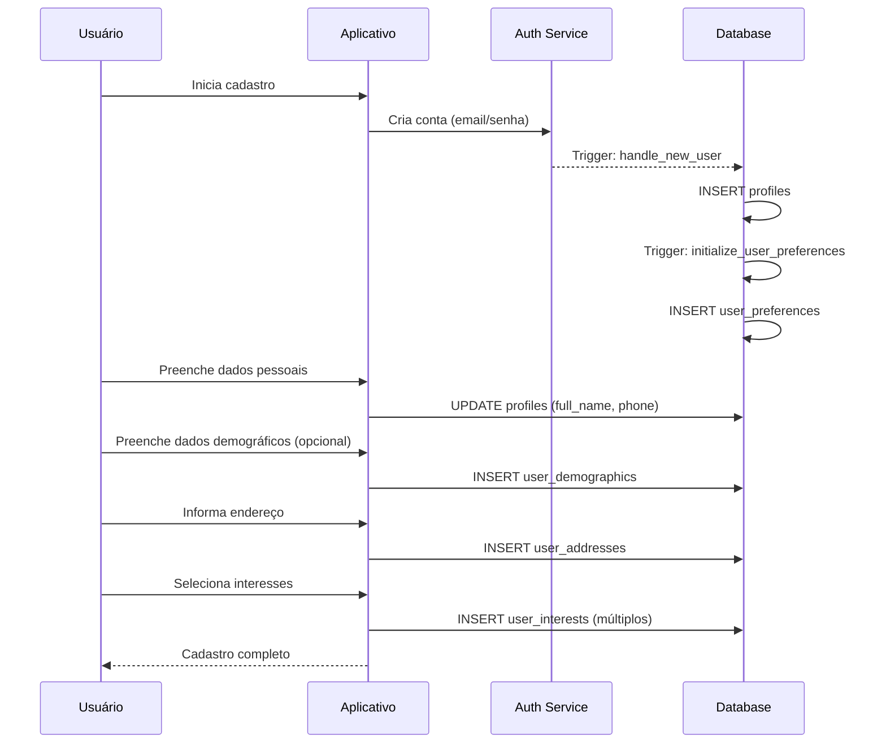
```mermaid
sequenceDiagram
    participant U as Usuário
    participant App as Aplicativo
    participant Auth as Auth Service
    participant DB as Database

    U->>App: Inicia cadastro
    App->>Auth: Cria conta (email/senha)
    Auth-->>DB: Trigger: handle_new_user
    DB->>DB: INSERT profiles
    DB->>DB: Trigger: initialize_user_preferences
    DB->>DB: INSERT user_preferences
    
    U->>App: Preenche dados pessoais
    App->>DB: UPDATE profiles (full_name, phone)
    
    U->>App: Preenche dados demográficos (opcional)
    App->>DB: INSERT user_demographics
    
    U->>App: Informa endereço
    App->>DB: INSERT user_addresses
    
    U->>App: Seleciona interesses
    App->>DB: INSERT user_interests (múltiplos)
    
    App-->>U: Cadastro completo
```

**Dados Coletados no Cadastro:**

| Etapa | Tabela | Campos | Obrigatório |
|-------|--------|--------|-------------|
| 1. Credenciais | auth.users | email, password | Sim |
| 2. Perfil básico | profiles | full_name, phone | full_name: Sim |
| 3. Demografia | user_demographics | birth_date, gender, race, social_class | Não |
| 4. Endereço | user_addresses | street, number, neighborhood, city, state, zip_code, complement, lat/lng | Não |
| 5. Interesses | user_interests | interest_category (múltiplos) | Não |

---

### 5.2 Jornada: Relato Urbano (Fala Cidadão!)

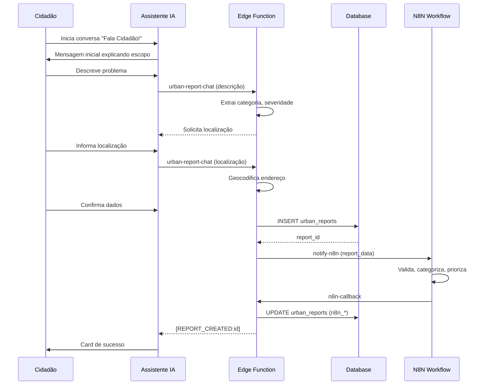
```mermaid
sequenceDiagram
    participant U as Cidadão
    participant Chat as Assistente IA
    participant Edge as Edge Function
    participant DB as Database
    participant N8N as N8N Workflow

    U->>Chat: Inicia conversa "Fala Cidadão!"
    Chat->>U: Mensagem inicial explicando escopo
    
    U->>Chat: Descreve problema
    Chat->>Edge: urban-report-chat (descrição)
    Edge->>Edge: Extrai categoria, severidade
    Edge-->>Chat: Solicita localização
    
    U->>Chat: Informa localização
    Chat->>Edge: urban-report-chat (localização)
    Edge->>Edge: Geocodifica endereço
    
    U->>Chat: Confirma dados
    Edge->>DB: INSERT urban_reports
    DB-->>Edge: report_id
    
    Edge->>N8N: notify-n8n (report_data)
    N8N->>N8N: Valida, categoriza, prioriza
    N8N->>Edge: n8n-callback
    Edge->>DB: UPDATE urban_reports (n8n_*)
    
    Edge-->>Chat: [REPORT_CREATED:id]
    Chat->>U: Card de sucesso
```

**Dados Coletados no Relato Urbano:**

| Campo | Fonte | Método de Coleta | Obrigatório |
|-------|-------|------------------|-------------|
| user_id | Sessão | Automático | Sim |
| category | IA | Inferência de descrição | Sim |
| subcategory | IA | Inferência de descrição | Não |
| description | Usuário | Conversa natural | Sim |
| severity | IA | Inferência (default: media) | Sim |
| latitude/longitude | Usuário | Conversa + geocoding | Não |
| location_address | Usuário | Conversa natural | Não |
| photos | Usuário | Upload opcional | Não |
| ai_classification | IA | Processamento automático | Sim |

---

### 5.3 Jornada: Diagnóstico de Transporte

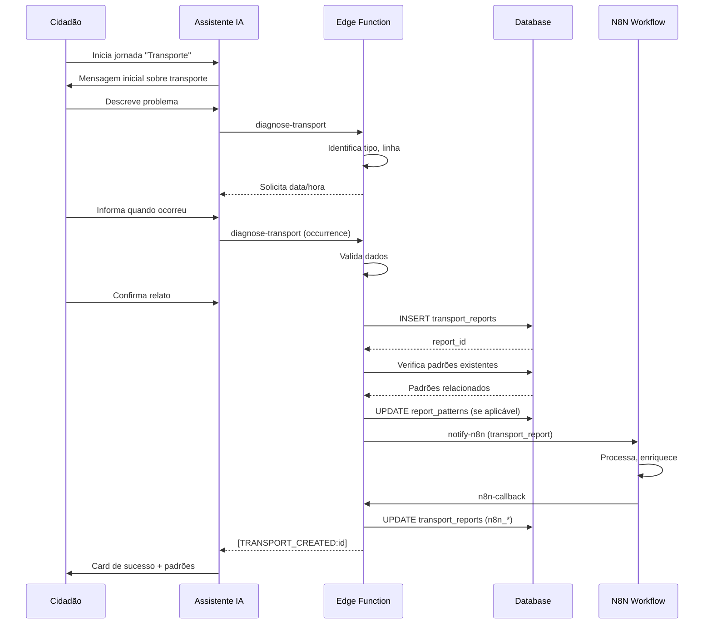
```mermaid
sequenceDiagram
    participant U as Cidadão
    participant Chat as Assistente IA
    participant Edge as Edge Function
    participant DB as Database
    participant N8N as N8N Workflow

    U->>Chat: Inicia jornada "Transporte"
    Chat->>U: Mensagem inicial sobre transporte
    
    U->>Chat: Descreve problema
    Chat->>Edge: diagnose-transport
    Edge->>Edge: Identifica tipo, linha
    Edge-->>Chat: Solicita data/hora
    
    U->>Chat: Informa quando ocorreu
    Chat->>Edge: diagnose-transport (occurrence)
    Edge->>Edge: Valida dados
    
    U->>Chat: Confirma relato
    Edge->>DB: INSERT transport_reports
    DB-->>Edge: report_id
    
    Edge->>DB: Verifica padrões existentes
    DB-->>Edge: Padrões relacionados
    Edge->>DB: UPDATE report_patterns (se aplicável)
    
    Edge->>N8N: notify-n8n (transport_report)
    N8N->>N8N: Processa, enriquece
    N8N->>Edge: n8n-callback
    Edge->>DB: UPDATE transport_reports (n8n_*)
    
    Edge-->>Chat: [TRANSPORT_CREATED:id]
    Chat->>U: Card de sucesso + padrões
```

**Dados Coletados no Diagnóstico de Transporte:**

| Campo | Fonte | Método de Coleta | Obrigatório |
|-------|-------|------------------|-------------|
| user_id | Sessão | Automático | Sim |
| report_type | IA | Inferência | Sim |
| line_id/line_code_custom | Usuário | Conversa natural | Não |
| description | Usuário | Conversa natural | Não |
| severity | IA | Inferência | Sim |
| location | Usuário | Conversa natural | Não |
| occurrence_date | Usuário | Conversa natural | Sim |
| occurrence_time | Usuário | Conversa natural | Não |
| impact_description | Usuário | Conversa natural | Não |
| ai_sentiment | IA | Análise de sentimento | Sim |
| ai_category | IA | Classificação | Sim |

---

### 5.4 Jornada: Avaliação de Serviço

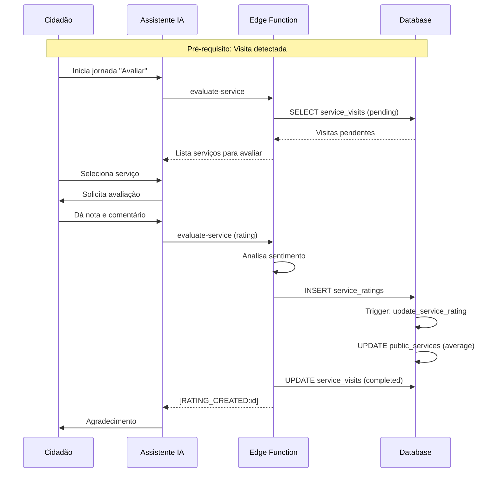
```mermaid
sequenceDiagram
    participant U as Cidadão
    participant Chat as Assistente IA
    participant Edge as Edge Function
    participant DB as Database

    Note over U,DB: Pré-requisito: Visita detectada
    
    U->>Chat: Inicia jornada "Avaliar"
    Chat->>Edge: evaluate-service
    Edge->>DB: SELECT service_visits (pending)
    DB-->>Edge: Visitas pendentes
    Edge-->>Chat: Lista serviços para avaliar
    
    U->>Chat: Seleciona serviço
    Chat->>U: Solicita avaliação
    
    U->>Chat: Dá nota e comentário
    Chat->>Edge: evaluate-service (rating)
    Edge->>Edge: Analisa sentimento
    Edge->>DB: INSERT service_ratings
    DB->>DB: Trigger: update_service_rating
    DB->>DB: UPDATE public_services (average)
    Edge->>DB: UPDATE service_visits (completed)
    
    Edge-->>Chat: [RATING_CREATED:id]
    Chat->>U: Agradecimento
```

**Dados Coletados na Avaliação:**

| Campo | Fonte | Método de Coleta | Obrigatório |
|-------|-------|------------------|-------------|
| visit_id | Sistema | Automático | Sim |
| user_id | Sessão | Automático | Sim |
| service_id | Seleção | Escolha do usuário | Sim |
| rating_stars | Usuário | Conversa natural | Sim |
| rating_text | Usuário | Conversa natural | Não |
| sentiment | IA | Análise automática | Sim |
| is_anonymous | Usuário | Pergunta opcional | Não |

---

### 5.5 Jornada: Inscrição em Audiência

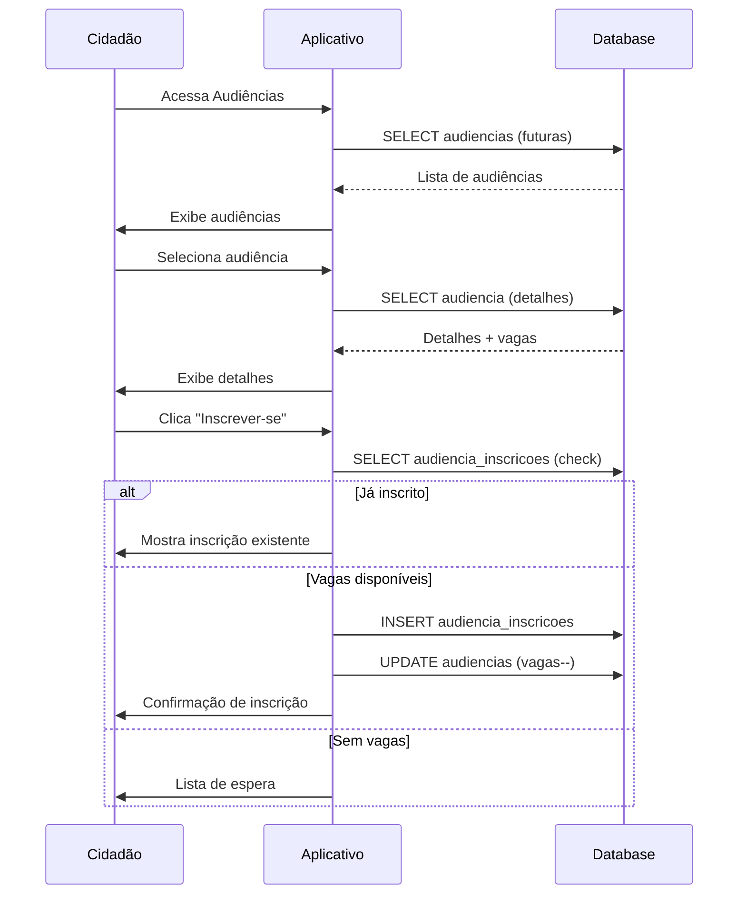
```mermaid
sequenceDiagram
    participant U as Cidadão
    participant App as Aplicativo
    participant DB as Database

    U->>App: Acessa Audiências
    App->>DB: SELECT audiencias (futuras)
    DB-->>App: Lista de audiências
    App->>U: Exibe audiências
    
    U->>App: Seleciona audiência
    App->>DB: SELECT audiencia (detalhes)
    DB-->>App: Detalhes + vagas
    App->>U: Exibe detalhes
    
    U->>App: Clica "Inscrever-se"
    App->>DB: SELECT audiencia_inscricoes (check)
    
    alt Já inscrito
        App->>U: Mostra inscrição existente
    else Vagas disponíveis
        App->>DB: INSERT audiencia_inscricoes
        App->>DB: UPDATE audiencias (vagas--)
        App->>U: Confirmação de inscrição
    else Sem vagas
        App->>U: Lista de espera
    end
```

**Dados Coletados na Inscrição:**

| Campo | Fonte | Método de Coleta | Obrigatório |
|-------|-------|------------------|-------------|
| audiencia_id | Seleção | Escolha do usuário | Sim |
| user_id | Sessão | Automático | Sim |
| status | Sistema | Automático (confirmada) | Sim |

---

## 6. Dados Sensíveis e LGPD

### 6.1 Classificação de Dados por Sensibilidade

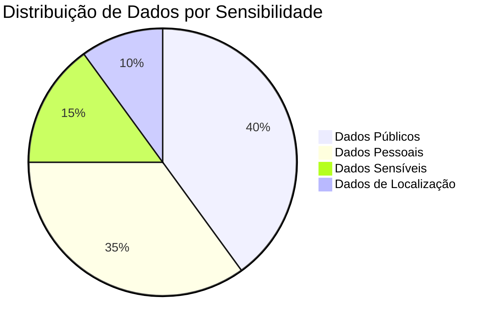
```mermaid
pie title Distribuição de Dados por Sensibilidade
    "Dados Públicos" : 40
    "Dados Pessoais" : 35
    "Dados Sensíveis" : 15
    "Dados de Localização" : 10
```

### 6.2 Inventário de Dados LGPD

#### 6.2.1 Dados Pessoais (LGPD Art. 5º, I)

| Tabela | Campo | Categoria | Base Legal | Finalidade |
|--------|-------|-----------|------------|------------|
| profiles | full_name | Identificação | Consentimento | Identificação do usuário |
| profiles | phone | Contato | Consentimento | Comunicação |
| profiles | avatar_url | Imagem | Consentimento | Personalização |
| user_addresses | street, number, etc. | Localização | Consentimento | Serviços por região |
| auth.users | email | Identificação | Execução contrato | Autenticação |

#### 6.2.2 Dados Sensíveis (LGPD Art. 5º, II)

| Tabela | Campo | Categoria | Base Legal | Finalidade |
|--------|-------|-----------|------------|------------|
| user_demographics | birth_date | Idade | Consentimento específico | Análise demográfica |
| user_demographics | gender | Gênero | Consentimento específico | Análise demográfica |
| user_demographics | race | Raça/Etnia | Consentimento específico | Políticas públicas |
| user_demographics | social_class | Renda | Consentimento específico | Análise socioeconômica |

#### 6.2.3 Dados de Geolocalização

| Tabela | Campo | Categoria | Base Legal | Finalidade |
|--------|-------|-----------|------------|------------|
| user_addresses | latitude, longitude | Localização precisa | Consentimento | Serviços próximos |
| urban_reports | latitude, longitude | Localização precisa | Consentimento | Localização do problema |
| service_visits | detected_at + service_id | Localização inferida | Consentimento | Detecção de visita |

#### 6.2.4 Dados de Auditoria

| Tabela | Campo | Categoria | Base Legal | Finalidade |
|--------|-------|-----------|------------|------------|
| audit_logs | ip_address | Identificação | Interesse legítimo | Segurança |
| audit_logs | user_agent | Técnico | Interesse legítimo | Segurança |

### 6.3 Medidas de Proteção Implementadas

#### 6.3.1 Criptografia

```
┌─────────────────────────────────────────────────────────────┐
│                    CAMADAS DE CRIPTOGRAFIA                   │
├─────────────────────────────────────────────────────────────┤
│  Em Trânsito                                                 │
│  • TLS 1.3 para todas as conexões                           │
│  • Certificate pinning no app móvel                         │
├─────────────────────────────────────────────────────────────┤
│  Em Repouso                                                  │
│  • AES-256 para banco de dados                              │
│  • Criptografia de backups                                  │
│  • Secrets em vault seguro                                  │
├─────────────────────────────────────────────────────────────┤
│  Campos Específicos                                          │
│  • Hash bcrypt para senhas (auth.users)                     │
│  • Anonimização de IPs após 90 dias                         │
└─────────────────────────────────────────────────────────────┘
```

#### 6.3.2 Anonimização e Pseudonimização

| Processo | Dados | Prazo | Método |
|----------|-------|-------|--------|
| Anonimização de avaliações | service_ratings | Sob demanda | Remoção de user_id |
| Anonimização de logs | audit_logs.ip_address | 90 dias | Hash irreversível |
| Pseudonimização de relatos | urban_reports | Exportação | Substituição de IDs |

#### 6.3.3 Minimização de Dados

| Princípio | Implementação |
|-----------|---------------|
| Coleta mínima | Campos demográficos opcionais |
| Retenção limitada | Logs de 1 ano, dados de localização 90 dias |
| Acesso restrito | RLS por usuário, roles administrativos |

### 6.4 Direitos dos Titulares (LGPD Art. 18)

| Direito | Implementação | Endpoint/Funcionalidade |
|---------|---------------|------------------------|
| Acesso | Exportação de dados pessoais | Perfil > Exportar meus dados |
| Correção | Edição de perfil | Perfil > Editar |
| Eliminação | Exclusão de conta | Perfil > Excluir conta |
| Portabilidade | Export JSON/CSV | Perfil > Exportar meus dados |
| Revogação | Gerenciamento de consentimento | Configurações > Privacidade |
| Informação | Política de privacidade | Termos de uso |

### 6.5 Retenção de Dados

| Categoria | Prazo de Retenção | Justificativa |
|-----------|-------------------|---------------|
| Dados de perfil | Enquanto conta ativa | Necessário para serviço |
| Dados demográficos | Enquanto conta ativa | Consentimento explícito |
| Relatos urbanos | 5 anos | Interesse público |
| Avaliações de serviço | 3 anos | Análise estatística |
| Logs de auditoria | 1 ano | Requisito legal |
| Dados de localização | 90 dias | Minimização |
| Conversas IA | 1 ano | Melhoria do serviço |

---

## 7. Dados de Sistemas Terceiros

### 7.1 Visão Geral das Integrações

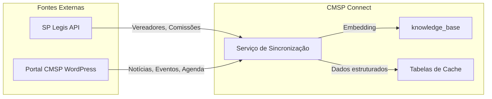
```mermaid
flowchart LR
    subgraph Fontes Externas
        SPL[SP Legis API]
        CMSP[Portal CMSP WordPress]
    end
    
    subgraph CMSP Connect
        SYNC[Serviço de Sincronização]
        KB[knowledge_base]
        CACHE[Tabelas de Cache]
    end
    
    SPL -->|Vereadores, Comissões| SYNC
    CMSP -->|Notícias, Eventos, Agenda| SYNC
    SYNC -->|Embedding| KB
    SYNC -->|Dados estruturados| CACHE
```

### 7.2 Mapeamento de Dados Externos

| Sistema Fonte | Tipo de Dado | Endpoint | Frequência | Tabela Destino |
|---------------|--------------|----------|------------|----------------|
| SP Legis | Vereadores | /api/v1/vereadores | 24h | knowledge_base |
| SP Legis | Comissões | /api/v1/comissoes | 24h | knowledge_base |
| SP Legis | Projetos de Lei | /api/v1/projetos | 6h | knowledge_base |
| Portal CMSP | Notícias | /wp-json/wp/v2/posts | 1h | noticias |
| Portal CMSP | Eventos | /wp-json/wp/v2/eventos | 6h | knowledge_base |
| Portal CMSP | Audiências | /wp-json/wp/v2/audiencias | 1h | audiencias |
| Portal CMSP | Institucional | /wp-json/wp/v2/pages | 24h | knowledge_base |

### 7.3 Estrutura de Dados por Fonte

#### 7.3.1 SP Legis API - Vereadores

**Endpoint:** `GET /api/v1/vereadores`

**Resposta Esperada:**
```json
{
  "data": [
    {
      "id": "string",
      "nome": "string",
      "nome_parlamentar": "string",
      "partido": "string",
      "email": "string",
      "telefone": "string",
      "foto_url": "string",
      "biografia": "string",
      "comissoes": ["string"],
      "mandatos": [
        {
          "legislatura": "number",
          "inicio": "date",
          "fim": "date"
        }
      ],
      "redes_sociais": {
        "instagram": "string",
        "twitter": "string",
        "facebook": "string"
      }
    }
  ],
  "meta": {
    "total": "number",
    "pagina": "number",
    "por_pagina": "number"
  }
}
```

**Mapeamento para knowledge_base:**

| Campo Origem | Campo Destino | Transformação |
|--------------|---------------|---------------|
| id | source_id | Direto |
| - | source_table | 'vereadores' |
| nome_parlamentar | title | Direto |
| biografia + comissoes | content | Concatenação |
| - | content_type | 'vereador' |
| partido, email, etc. | metadata | JSON object |

#### 7.3.2 SP Legis API - Comissões

**Endpoint:** `GET /api/v1/comissoes`

**Resposta Esperada:**
```json
{
  "data": [
    {
      "id": "string",
      "nome": "string",
      "sigla": "string",
      "tipo": "permanente|temporaria|especial",
      "descricao": "string",
      "presidente": {
        "id": "string",
        "nome": "string"
      },
      "membros": [
        {
          "id": "string",
          "nome": "string",
          "cargo": "string"
        }
      ],
      "temas": ["string"],
      "reunioes_agendadas": "number"
    }
  ]
}
```

#### 7.3.3 Portal CMSP WordPress - Notícias

**Endpoint:** `GET /wp-json/wp/v2/posts`

**Parâmetros:**
- `per_page`: 100
- `orderby`: date
- `order`: desc
- `categories`: ID da categoria "Notícias"

**Resposta WordPress:**
```json
[
  {
    "id": "number",
    "date": "datetime",
    "modified": "datetime",
    "slug": "string",
    "status": "publish",
    "title": {
      "rendered": "string"
    },
    "content": {
      "rendered": "string"
    },
    "excerpt": {
      "rendered": "string"
    },
    "author": "number",
    "featured_media": "number",
    "categories": ["number"],
    "tags": ["number"],
    "_embedded": {
      "author": [{"name": "string"}],
      "wp:featuredmedia": [{"source_url": "string"}]
    }
  }
]
```

**Mapeamento para noticias:**

| Campo WordPress | Campo noticias | Transformação |
|-----------------|----------------|---------------|
| id | source_id (metadata) | String |
| title.rendered | titulo | HTML decode |
| content.rendered | conteudo | HTML sanitize |
| excerpt.rendered | resumo | HTML strip |
| date | data_publicacao | ISO parse |
| _embedded.author[0].name | autor | Direto |
| _embedded.wp:featuredmedia[0].source_url | imagem_url | Direto |
| categories | categoria | Lookup table |
| tags | tags | Lookup table |

#### 7.3.4 Portal CMSP WordPress - Audiências

**Endpoint:** `GET /wp-json/wp/v2/audiencias` (Custom Post Type)

**Resposta Esperada:**
```json
[
  {
    "id": "number",
    "title": {"rendered": "string"},
    "content": {"rendered": "string"},
    "acf": {
      "data": "date",
      "hora": "time",
      "local": "string",
      "tema": "string",
      "link_transmissao": "string",
      "vagas": "number",
      "documentos": [
        {
          "titulo": "string",
          "arquivo": "url"
        }
      ]
    }
  }
]
```

**Mapeamento para audiencias:**

| Campo WordPress | Campo audiencias | Transformação |
|-----------------|------------------|---------------|
| id | source_id (metadata) | String |
| title.rendered | titulo | HTML decode |
| content.rendered | descricao | HTML sanitize |
| acf.data | data | Date parse |
| acf.hora | hora | Time parse |
| acf.local | local | Direto |
| acf.tema | tema | Direto |
| acf.link_transmissao | link_transmissao | Direto |
| acf.vagas | vagas_disponiveis | Integer |
| acf.documentos | documentos | JSON array |

### 7.4 Política de Cache e Sincronização

#### 7.4.1 Estratégia de Sincronização

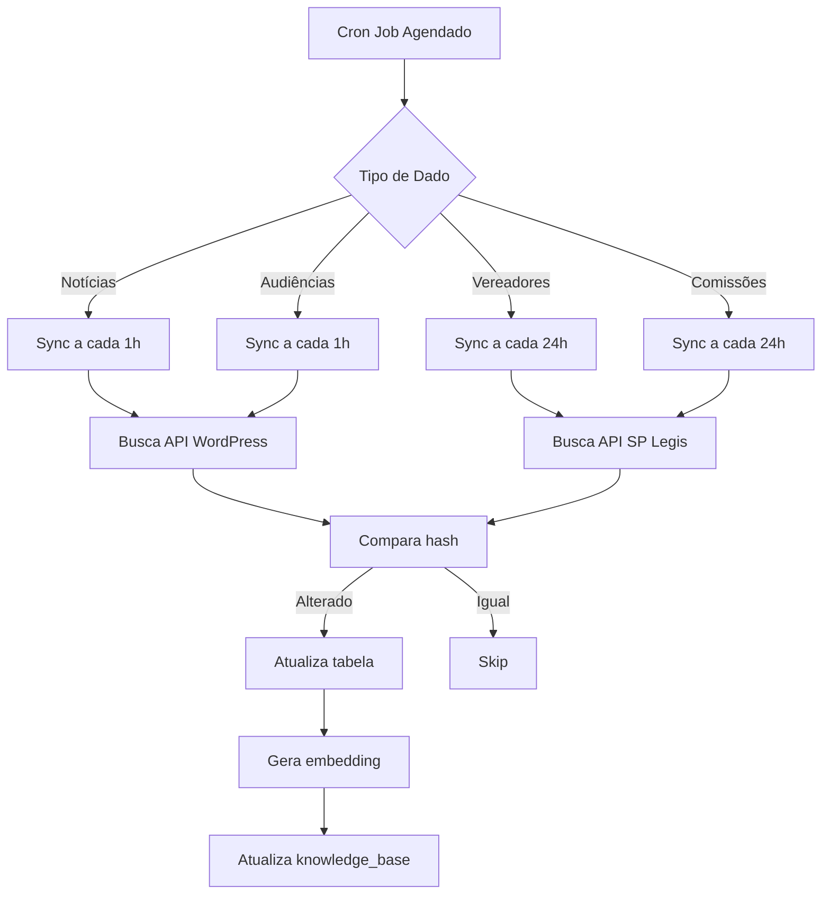
```mermaid
flowchart TD
    A[Cron Job Agendado] --> B{Tipo de Dado}
    B -->|Notícias| C[Sync a cada 1h]
    B -->|Audiências| D[Sync a cada 1h]
    B -->|Vereadores| E[Sync a cada 24h]
    B -->|Comissões| F[Sync a cada 24h]
    
    C --> G[Busca API WordPress]
    D --> G
    E --> H[Busca API SP Legis]
    F --> H
    
    G --> I[Compara hash]
    H --> I
    
    I -->|Alterado| J[Atualiza tabela]
    I -->|Igual| K[Skip]
    
    J --> L[Gera embedding]
    L --> M[Atualiza knowledge_base]
```

#### 7.4.2 TTLs de Cache

| Tipo de Dado | TTL Cache App | TTL Cache CDN | TTL Database |
|--------------|---------------|---------------|--------------|
| Notícias | 15 min | 5 min | 1 hora |
| Audiências | 30 min | 15 min | 1 hora |
| Vereadores | 1 hora | 30 min | 24 horas |
| Comissões | 1 hora | 30 min | 24 horas |
| Institucional | 2 horas | 1 hora | 24 horas |

#### 7.4.3 Fallback e Resiliência

| Cenário | Ação | Dados Utilizados |
|---------|------|------------------|
| API indisponível | Retry com backoff | Cache existente |
| Timeout (>10s) | Cancelar e usar cache | Cache existente |
| Dados corrompidos | Rejeitar atualização | Cache anterior |
| Cache vazio + API down | Dados estáticos | Snapshot manual |

### 7.5 Tabela de Integrações

| Sistema | Protocolo | Autenticação | Rate Limit | SLA |
|---------|-----------|--------------|------------|-----|
| SP Legis | REST/JSON | API Key | 100 req/min | 99.5% |
| Portal CMSP | REST/JSON | Público | 60 req/min | 99% |
| Mapbox | REST/JSON | Token | 100K req/mês | 99.9% |
| FCM | REST/JSON | Service Account | Ilimitado* | 99.95% |

---

## 8. Enumerações e Tipos

### 8.1 Enum: app_role

```sql
CREATE TYPE app_role AS ENUM (
  'admin',      -- Administrador do sistema
  'gestor',     -- Gestor da Câmara
  'vereador',   -- Vereador
  'assessor',   -- Assessor parlamentar
  'cidadao'     -- Cidadão comum
);
```

**Permissões por Role:**

| Role | Manifestações | Usuários | Dashboards | Configurações |
|------|---------------|----------|------------|---------------|
| admin | CRUD total | CRUD total | CRUD total | CRUD total |
| gestor | Read/Update | Read | CRUD próprios | Read |
| vereador | Read próprios | - | Read públicos | - |
| assessor | Read próprios | - | Read públicos | - |
| cidadao | CRUD próprios | - | Read públicos | - |

### 8.2 Enum: service_type

```sql
CREATE TYPE service_type AS ENUM (
  'ubs',           -- Unidade Básica de Saúde
  'school',        -- Escola
  'ceu',           -- Centro Educacional Unificado
  'hospital',      -- Hospital
  'library',       -- Biblioteca
  'sports_center', -- Centro Esportivo
  'other'          -- Outros
);
```

### 8.3 Enum: visit_status

```sql
CREATE TYPE visit_status AS ENUM (
  'pending',    -- Avaliação pendente
  'completed',  -- Avaliação realizada
  'expired',    -- Prazo expirado
  'skipped'     -- Usuário pulou
);
```

### 8.4 Enum: referral_status

```sql
CREATE TYPE referral_status AS ENUM (
  'pending',      -- Aguardando envio
  'sent',         -- Enviado ao vereador
  'acknowledged', -- Confirmado recebimento
  'resolved'      -- Resolvido
);
```

---

## 9. Triggers e Funções

### 9.1 Triggers Automáticos

| Trigger | Tabela | Evento | Função | Descrição |
|---------|--------|--------|--------|-----------|
| on_auth_user_created | auth.users | AFTER INSERT | handle_new_user | Cria perfil automaticamente |
| on_profile_created | profiles | AFTER INSERT | initialize_user_preferences | Inicializa preferências |
| on_rating_created | service_ratings | AFTER INSERT | update_service_rating | Atualiza média do serviço |
| on_urban_status_change | urban_reports | AFTER UPDATE | notify_urban_report_status_change | Notifica mudança de status |
| on_transport_status_change | transport_reports | AFTER UPDATE | notify_transport_report_status_change | Notifica mudança de status |
| on_transport_response | transport_report_responses | AFTER INSERT | notify_transport_response | Notifica resposta |
| on_urban_comment | urban_report_comments | AFTER INSERT | notify_urban_report_comment | Notifica comentário |
| on_referral_created | council_member_referrals | AFTER INSERT | notify_citizen_on_referral | Notifica encaminhamento |
| on_referral_updated | council_member_referrals | AFTER UPDATE | notify_citizen_on_referral_update | Notifica atualização |

### 9.2 Funções Principais

#### 9.2.1 handle_new_user()

```sql
CREATE OR REPLACE FUNCTION public.handle_new_user()
RETURNS trigger
LANGUAGE plpgsql
SECURITY DEFINER SET search_path = 'public'
AS $$
BEGIN
  INSERT INTO public.profiles (id, full_name, phone)
  VALUES (
    NEW.id,
    COALESCE(NEW.raw_user_meta_data->>'full_name', ''),
    COALESCE(NEW.raw_user_meta_data->>'phone', '')
  );
  RETURN NEW;
END;
$$;
```

#### 9.2.2 update_service_rating()

```sql
CREATE OR REPLACE FUNCTION public.update_service_rating()
RETURNS trigger
LANGUAGE plpgsql
SECURITY DEFINER SET search_path = 'public'
AS $$
BEGIN
  UPDATE public.public_services
  SET 
    average_rating = (
      SELECT COALESCE(AVG(rating_stars), 0)
      FROM public.service_ratings
      WHERE service_id = NEW.service_id
    ),
    total_ratings = (
      SELECT COUNT(*)
      FROM public.service_ratings
      WHERE service_id = NEW.service_id
    )
  WHERE id = NEW.service_id;
  RETURN NEW;
END;
$$;
```

#### 9.2.3 match_documents() - RAG

```sql
CREATE OR REPLACE FUNCTION public.match_documents(
  query_embedding vector,
  match_threshold float DEFAULT 0.7,
  match_count int DEFAULT 5,
  filter_content_type text DEFAULT NULL
)
RETURNS TABLE (
  id uuid,
  content text,
  content_type text,
  title text,
  source_id uuid,
  source_table text,
  metadata jsonb,
  similarity float
)
LANGUAGE plpgsql
SECURITY DEFINER SET search_path = 'public'
AS $$
BEGIN
  RETURN QUERY
  SELECT 
    kb.id,
    kb.content,
    kb.content_type,
    kb.title,
    kb.source_id,
    kb.source_table,
    kb.metadata,
    1 - (kb.embedding <=> query_embedding) AS similarity
  FROM public.knowledge_base kb
  WHERE 
    kb.embedding IS NOT NULL
    AND 1 - (kb.embedding <=> query_embedding) > match_threshold
    AND (filter_content_type IS NULL OR kb.content_type = filter_content_type)
  ORDER BY kb.embedding <=> query_embedding
  LIMIT match_count;
END;
$$;
```

#### 9.2.4 has_role()

```sql
CREATE OR REPLACE FUNCTION public.has_role(_user_id uuid, _role app_role)
RETURNS boolean
LANGUAGE sql
STABLE SECURITY DEFINER SET search_path = 'public'
AS $$
  SELECT EXISTS (
    SELECT 1
    FROM public.user_roles
    WHERE user_id = _user_id AND role = _role
  )
$$;
```

---

## 10. Índices e Performance

### 10.1 Índices Primários

Todas as tabelas possuem índice PRIMARY KEY em suas colunas `id`.

### 10.2 Índices de Busca

| Tabela | Índice | Colunas | Tipo | Propósito |
|--------|--------|---------|------|-----------|
| urban_reports | idx_urban_user | user_id | btree | Filtro por usuário |
| urban_reports | idx_urban_status | status | btree | Filtro por status |
| urban_reports | idx_urban_category | category | btree | Filtro por categoria |
| urban_reports | idx_urban_created | created_at | btree | Ordenação temporal |
| transport_reports | idx_transport_user | user_id | btree | Filtro por usuário |
| transport_reports | idx_transport_line | line_id | btree | Filtro por linha |
| transport_reports | idx_transport_date | occurrence_date | btree | Filtro por data |
| public_services | idx_services_type | service_type | btree | Filtro por tipo |
| public_services | idx_services_district | district | btree | Filtro por distrito |
| notifications | idx_notif_user_read | user_id, is_read | btree | Listagem não lidas |
| knowledge_base | idx_kb_embedding | embedding | ivfflat | Busca vetorial |
| knowledge_base | idx_kb_content_type | content_type | btree | Filtro por tipo |

### 10.3 Índices Geoespaciais

```sql
-- Para buscas por proximidade (futuro com PostGIS)
CREATE INDEX idx_services_location 
ON public_services USING gist (
  ST_SetSRID(ST_MakePoint(longitude, latitude), 4326)
);

CREATE INDEX idx_urban_location 
ON urban_reports USING gist (
  ST_SetSRID(ST_MakePoint(longitude, latitude), 4326)
);
```

### 10.4 Índice Vetorial (pgvector)

```sql
-- Índice IVFFlat para busca aproximada de vizinhos
CREATE INDEX idx_knowledge_embedding 
ON knowledge_base 
USING ivfflat (embedding vector_cosine_ops)
WITH (lists = 100);
```

---

## 11. Anexos

### 11.1 Script DDL Completo

O script DDL completo está disponível nas migrações do Supabase em:
- `supabase/migrations/`

### 11.2 Diagrama ER de Alta Resolução

Para visualização em alta resolução, os diagramas Mermaid podem ser exportados para PNG/SVG usando ferramentas como:
- Mermaid Live Editor (https://mermaid.live)
- VS Code com extensão Mermaid

### 11.3 Matriz de Rastreabilidade

| Requisito | Tabela(s) | Campos Principais |
|-----------|-----------|-------------------|
| RF-001: Cadastro | profiles, user_* | Todos dados pessoais |
| RF-002: Relato Urbano | urban_reports | category, description, location |
| RF-003: Transporte | transport_reports | report_type, line_id, occurrence_date |
| RF-004: Avaliação | service_ratings | rating_stars, rating_text |
| RF-005: Audiências | audiencias, audiencia_inscricoes | titulo, data, user_id |
| RF-006: Chat IA | ai_conversations | messages, journey_id |
| RF-007: Encaminhamento | council_member_referrals | council_member_id, status |
| RF-008: Notificações | notifications | title, message, type |
| RNF-001: LGPD | user_demographics | Todos campos sensíveis |
| RNF-002: Auditoria | audit_logs | action, entity_type, old/new_values |

---

## Controle de Versão

| Versão | Data | Autor | Descrição |
|--------|------|-------|-----------|
| 1.0 | Dez/2025 | Equipe CMSP Connect | Versão inicial |

---

*Documento gerado como parte da especificação técnica do projeto CMSP Connect.*
