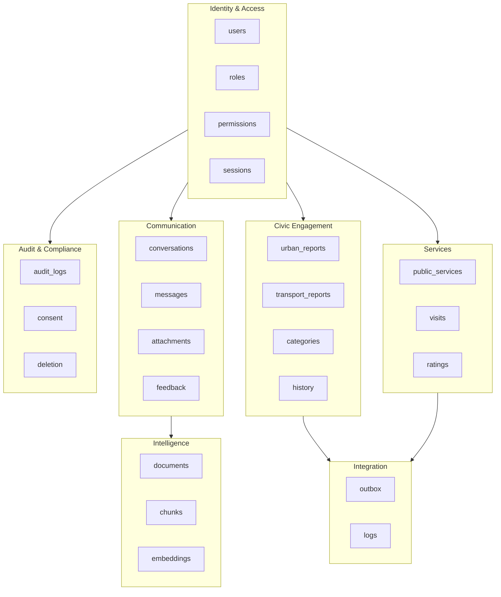

# CMSP Connect - Modelo de Dados Relacional v2.0

## Documento de Arquitetura de Dados

**Versão:** 2.0  
**Classificação:** Interno - Equipe de Engenharia e DBA  
**Última Atualização:** Dezembro 2024  
**Banco de Dados:** PostgreSQL 15+ com extensões PostGIS 3.4 e pgvector 0.5

---

## 1. Convenções e Padrões

### 1.1 Nomenclatura

| Elemento | Convenção | Exemplo |
|----------|-----------|---------|
| Tabelas | snake_case, plural | `urban_reports`, `service_ratings` |
| Colunas | snake_case, singular | `created_at`, `user_id` |
| Chaves Primárias | `id` (sempre) | `id UUID PRIMARY KEY` |
| Chaves Estrangeiras | `{tabela_singular}_id` | `user_id`, `report_id` |
| Índices | `idx_{tabela}_{colunas}` | `idx_messages_conversation_id` |
| Constraints | `chk_{tabela}_{regra}` | `chk_ratings_stars_range` |
| Triggers | `trg_{tabela}_{acao}` | `trg_users_updated_at` |

### 1.2 Estratégia de Chaves Primárias

**Escolha:** `UUID v7` (time-ordered UUID)

**Justificativa Técnica:**
- UUID v7 mantém ordenação temporal, eliminando fragmentação de índice B-Tree
- Performance comparável a BIGSERIAL para range scans
- Evita colisões em sistemas distribuídos
- Não expõe contagem de registros (segurança)

```sql
-- Extensão necessária
CREATE EXTENSION IF NOT EXISTS pgcrypto;

-- Função para gerar UUID v7
CREATE OR REPLACE FUNCTION generate_uuid_v7()
RETURNS UUID AS $$
DECLARE
    unix_ts_ms BIGINT;
    uuid_bytes BYTEA;
BEGIN
    unix_ts_ms := (EXTRACT(EPOCH FROM clock_timestamp()) * 1000)::BIGINT;
    uuid_bytes := decode(
        lpad(to_hex(unix_ts_ms), 12, '0') ||
        lpad(to_hex((random() * 65535)::INT), 4, '0') ||
        '7' || lpad(to_hex((random() * 4095)::INT), 3, '0') ||
        lpad(to_hex((random() * 1099511627775)::BIGINT), 12, '0'),
        'hex'
    );
    RETURN encode(uuid_bytes, 'hex')::UUID;
END;
$$ LANGUAGE plpgsql VOLATILE;
```

### 1.3 Timestamps Padrão

Todas as tabelas DEVEM incluir:

| Coluna | Tipo | Descrição |
|--------|------|-----------|
| `created_at` | `TIMESTAMPTZ NOT NULL DEFAULT NOW()` | Criação do registro |
| `updated_at` | `TIMESTAMPTZ NOT NULL DEFAULT NOW()` | Última modificação |
| `deleted_at` | `TIMESTAMPTZ NULL` | Soft delete (quando aplicável) |

**Trigger de Atualização Automática:**

```sql
CREATE OR REPLACE FUNCTION update_updated_at_column()
RETURNS TRIGGER AS $$
BEGIN
    NEW.updated_at = NOW();
    RETURN NEW;
END;
$$ LANGUAGE plpgsql;

-- Aplicar em cada tabela
CREATE TRIGGER trg_users_updated_at
    BEFORE UPDATE ON users
    FOR EACH ROW
    EXECUTE FUNCTION update_updated_at_column();
```

### 1.4 Uso de JSONB (Restrito)

**PERMITIDO apenas para:**
- Metadados de integração (`integration_metadata`)
- Payloads brutos de APIs externas (`raw_payload`)
- Configurações dinâmicas de sistema (`settings_json`)

**PROIBIDO para:**
- Histórico de mensagens
- Propriedades de entidades de negócio
- Dados que precisam de JOIN ou agregação

---

## 2. Diagrama Entidade-Relacionamento

### 2.1 Visão Geral dos Domínios

```mermaid
erDiagram
    %% ==========================================
    %% DOMAIN: IDENTITY & ACCESS MANAGEMENT
    %% ==========================================
    
    users ||--o{ user_roles : "1:N"
    users ||--o{ user_profiles : "1:1"
    users ||--o{ user_addresses : "1:N"
    users ||--o{ user_sessions : "1:N"
    roles ||--o{ user_roles : "1:N"
    roles ||--o{ role_permissions : "N:N"
    permissions ||--o{ role_permissions : "N:N"

    users {
        uuid id PK "UUID v7"
        varchar email UK "NOT NULL, max 255"
        varchar password_hash "NOT NULL, Argon2id"
        varchar phone "E.164 format"
        boolean is_active "DEFAULT true"
        boolean email_verified "DEFAULT false"
        timestamptz last_login_at
        timestamptz created_at
        timestamptz updated_at
        timestamptz deleted_at
    }

    user_profiles {
        uuid id PK
        uuid user_id FK UK "NOT NULL"
        varchar full_name "NOT NULL, max 150"
        varchar display_name "max 50"
        varchar avatar_url
        date birth_date
        varchar gender "ENUM"
        varchar race "ENUM, IBGE"
        timestamptz created_at
        timestamptz updated_at
    }

    user_addresses {
        uuid id PK
        uuid user_id FK "NOT NULL"
        varchar street "NOT NULL"
        varchar number "NOT NULL"
        varchar complement
        varchar neighborhood "NOT NULL"
        varchar city "NOT NULL"
        char state "2 chars"
        char zip_code "8 digits"
        geography location "Point, 4326"
        boolean is_primary "DEFAULT false"
        timestamptz created_at
        timestamptz updated_at
    }

    roles {
        uuid id PK
        varchar name UK "NOT NULL"
        varchar description
        boolean is_system "DEFAULT false"
        timestamptz created_at
    }

    user_roles {
        uuid id PK
        uuid user_id FK "NOT NULL"
        uuid role_id FK "NOT NULL"
        timestamptz granted_at
        uuid granted_by FK
        timestamptz expires_at
    }

    permissions {
        uuid id PK
        varchar resource "NOT NULL"
        varchar action "NOT NULL"
        varchar description
    }

    role_permissions {
        uuid role_id FK PK
        uuid permission_id FK PK
    }

    user_sessions {
        uuid id PK
        uuid user_id FK "NOT NULL"
        varchar refresh_token_hash UK
        varchar device_fingerprint
        inet ip_address
        varchar user_agent
        timestamptz expires_at
        timestamptz created_at
        timestamptz revoked_at
    }

    %% ==========================================
    %% DOMAIN: COMMUNICATION (CHAT)
    %% ==========================================

    users ||--o{ conversations : "1:N"
    conversations ||--o{ messages : "1:N"
    messages ||--o{ message_attachments : "1:N"
    messages ||--o{ message_feedback : "1:N"
    messages }o--o{ message_entities : "1:N"

    conversations {
        uuid id PK
        uuid user_id FK "NOT NULL"
        varchar title "max 200"
        varchar status "active|archived|closed"
        varchar context_type "report|rating|general"
        uuid context_reference_id
        jsonb ai_context "Session memory"
        timestamptz last_message_at
        timestamptz created_at
        timestamptz updated_at
        timestamptz archived_at
    }

    messages {
        uuid id PK
        uuid conversation_id FK "NOT NULL"
        varchar role "user|assistant|system"
        text content "NOT NULL"
        decimal confidence_score "0.00-1.00"
        varchar intent_detected "max 100"
        integer tokens_input
        integer tokens_output
        integer latency_ms
        varchar model_version
        timestamptz created_at
    }

    message_attachments {
        uuid id PK
        uuid message_id FK "NOT NULL"
        varchar file_type "image|audio|document"
        varchar file_url "NOT NULL"
        varchar file_name
        bigint file_size_bytes
        varchar mime_type
        timestamptz created_at
    }

    message_entities {
        uuid id PK
        uuid message_id FK "NOT NULL"
        varchar entity_type "location|date|service|line"
        varchar entity_value "NOT NULL"
        integer start_offset
        integer end_offset
        decimal confidence "0.00-1.00"
    }

    message_feedback {
        uuid id PK
        uuid message_id FK "NOT NULL"
        uuid user_id FK "NOT NULL"
        varchar feedback_type "helpful|not_helpful|report"
        text feedback_text
        timestamptz created_at
    }

    %% ==========================================
    %% DOMAIN: CIVIC ENGAGEMENT (MANIFESTATIONS)
    %% ==========================================

    users ||--o{ urban_reports : "1:N"
    urban_reports ||--o{ report_history : "1:N audit"
    urban_reports ||--o{ report_attachments : "1:N"
    urban_reports ||--o{ report_comments : "1:N"
    urban_reports }o--|| categories : "N:1"
    urban_reports }o--|| subcategories : "N:1"
    categories ||--o{ subcategories : "1:N"

    urban_reports {
        uuid id PK
        uuid user_id FK "NOT NULL"
        uuid category_id FK "NOT NULL"
        uuid subcategory_id FK
        text description "NOT NULL"
        geography location "Point, 4326, NOT NULL"
        varchar address_formatted
        varchar status "pending|triaged|in_progress|resolved|closed"
        varchar severity "low|medium|high|critical"
        varchar priority_score "Calculated"
        varchar integration_status "pending|synced|error"
        timestamptz last_synced_at
        varchar external_id "Sistema legado"
        jsonb integration_metadata "Raw payload N8N"
        timestamptz resolved_at
        timestamptz created_at
        timestamptz updated_at
        timestamptz deleted_at
    }

    report_history {
        uuid id PK
        uuid report_id FK "NOT NULL"
        uuid changed_by FK "NOT NULL"
        varchar previous_status
        varchar new_status "NOT NULL"
        text change_reason
        jsonb metadata
        timestamptz created_at
    }

    report_attachments {
        uuid id PK
        uuid report_id FK "NOT NULL"
        varchar file_url "NOT NULL"
        varchar file_type "image|video|document"
        varchar mime_type
        bigint file_size_bytes
        geography capture_location "Point, 4326"
        timestamptz captured_at
        timestamptz created_at
    }

    report_comments {
        uuid id PK
        uuid report_id FK "NOT NULL"
        uuid user_id FK "NOT NULL"
        uuid parent_id FK "Thread support"
        text content "NOT NULL"
        boolean is_official "DEFAULT false"
        timestamptz created_at
        timestamptz updated_at
        timestamptz deleted_at
    }

    categories {
        uuid id PK
        varchar name UK "NOT NULL"
        varchar slug UK "NOT NULL"
        varchar icon
        varchar color_hex
        boolean is_active "DEFAULT true"
        integer display_order
        timestamptz created_at
    }

    subcategories {
        uuid id PK
        uuid category_id FK "NOT NULL"
        varchar name "NOT NULL"
        varchar slug "NOT NULL"
        boolean is_active "DEFAULT true"
        timestamptz created_at
    }

    %% ==========================================
    %% DOMAIN: TRANSPORT
    %% ==========================================

    users ||--o{ transport_reports : "1:N"
    transport_reports }o--|| transport_lines : "N:1"
    transport_reports ||--o{ transport_report_history : "1:N"

    transport_lines {
        uuid id PK
        varchar line_code UK "NOT NULL"
        varchar line_name "NOT NULL"
        varchar line_type "bus|metro|train|brt"
        varchar operator
        text[] regions
        boolean is_active "DEFAULT true"
        timestamptz created_at
        timestamptz updated_at
    }

    transport_reports {
        uuid id PK
        uuid user_id FK "NOT NULL"
        uuid line_id FK
        varchar line_code_custom "Se linha nao cadastrada"
        varchar report_type "NOT NULL"
        varchar severity "low|medium|high|critical"
        text description
        date occurrence_date "NOT NULL"
        time occurrence_time
        varchar location_description
        geography location "Point, 4326"
        varchar status "pending|acknowledged|resolved"
        varchar integration_status "pending|synced|error"
        timestamptz last_synced_at
        jsonb integration_metadata
        timestamptz created_at
        timestamptz updated_at
    }

    transport_report_history {
        uuid id PK
        uuid report_id FK "NOT NULL"
        uuid changed_by FK
        varchar previous_status
        varchar new_status "NOT NULL"
        text notes
        timestamptz created_at
    }

    %% ==========================================
    %% DOMAIN: SERVICES & FEEDBACK
    %% ==========================================

    public_services ||--o{ service_visits : "1:N"
    service_visits ||--o| service_ratings : "1:0..1"
    users ||--o{ service_visits : "1:N"
    public_services }o--|| service_types : "N:1"
    service_ratings ||--o{ rating_anonymous_tokens : "1:1"

    service_types {
        uuid id PK
        varchar name UK "NOT NULL"
        varchar slug UK "NOT NULL"
        varchar icon
        timestamptz created_at
    }

    public_services {
        uuid id PK
        uuid service_type_id FK "NOT NULL"
        varchar name "NOT NULL"
        varchar official_code UK
        geography location "Point, 4326, NOT NULL"
        varchar address "NOT NULL"
        varchar neighborhood "NOT NULL"
        varchar city "DEFAULT Sao Paulo"
        char state "DEFAULT SP"
        char zip_code
        varchar phone
        jsonb opening_hours "Structured schedule"
        decimal avg_rating "0.0-5.0"
        integer total_ratings "DEFAULT 0"
        boolean is_active "DEFAULT true"
        timestamptz created_at
        timestamptz updated_at
    }

    service_visits {
        uuid id PK
        uuid user_id FK "NOT NULL"
        uuid service_id FK "NOT NULL"
        geography check_in_location "Point, 4326"
        timestamptz visited_at "NOT NULL"
        timestamptz detected_at
        varchar detection_method "gps|manual|beacon"
        timestamptz rating_expires_at
        varchar status "pending|rated|expired|skipped"
        timestamptz created_at
    }

    service_ratings {
        uuid id PK
        uuid visit_id FK UK "NOT NULL"
        uuid service_id FK "NOT NULL"
        smallint stars "1-5, NOT NULL"
        text review_text
        varchar sentiment "positive|neutral|negative"
        boolean is_anonymous "NOT NULL"
        varchar anonymous_token_hash "Se anonimo"
        varchar integration_status "pending|synced|error"
        timestamptz created_at
        timestamptz updated_at
    }

    rating_anonymous_tokens {
        uuid id PK
        uuid rating_id FK UK "NOT NULL"
        varchar token_hash UK "SHA256(user_id + daily_salt)"
        date token_date "NOT NULL"
        timestamptz created_at
    }

    %% ==========================================
    %% DOMAIN: INTELLIGENCE (RAG)
    %% ==========================================

    knowledge_documents ||--o{ knowledge_chunks : "1:N"
    knowledge_chunks ||--|| knowledge_embeddings : "1:1"

    knowledge_documents {
        uuid id PK
        varchar source_type "legislation|regimento|ata|manual"
        varchar title "NOT NULL"
        varchar source_url
        varchar source_reference "Lei X, Art Y"
        date publication_date
        text full_content
        varchar processing_status "pending|chunked|embedded|error"
        integer total_chunks
        timestamptz processed_at
        timestamptz created_at
        timestamptz updated_at
    }

    knowledge_chunks {
        uuid id PK
        uuid document_id FK "NOT NULL"
        integer chunk_index "NOT NULL"
        text chunk_content "NOT NULL"
        integer token_count
        varchar section_title
        jsonb metadata "Artigo, Inciso, etc"
        timestamptz created_at
    }

    knowledge_embeddings {
        uuid id PK
        uuid chunk_id FK UK "NOT NULL"
        vector embedding "1536 dims, NOT NULL"
        varchar model_version "text-embedding-3-small"
        timestamptz created_at
    }

    %% ==========================================
    %% DOMAIN: INTEGRATION (OUTBOX)
    %% ==========================================

    integration_outbox {
        uuid id PK
        varchar aggregate_type "NOT NULL"
        uuid aggregate_id "NOT NULL"
        varchar event_type "NOT NULL"
        jsonb payload "NOT NULL"
        varchar status "pending|processing|completed|failed"
        integer retry_count "DEFAULT 0"
        text last_error
        timestamptz processed_at
        timestamptz created_at
    }

    integration_logs {
        uuid id PK
        uuid outbox_id FK
        varchar direction "inbound|outbound"
        varchar endpoint
        integer http_status
        jsonb request_payload
        jsonb response_payload
        integer latency_ms
        timestamptz created_at
    }

    %% ==========================================
    %% DOMAIN: AUDIT & COMPLIANCE
    %% ==========================================

    audit_logs {
        uuid id PK
        uuid user_id FK
        varchar action "NOT NULL"
        varchar entity_type "NOT NULL"
        uuid entity_id
        jsonb old_values
        jsonb new_values
        inet ip_address
        varchar user_agent
        timestamptz created_at
    }

    consent_records {
        uuid id PK
        uuid user_id FK "NOT NULL"
        varchar consent_type "terms|privacy|marketing"
        varchar policy_version "NOT NULL"
        boolean consented "NOT NULL"
        inet ip_address
        timestamptz consented_at
        timestamptz revoked_at
    }

    data_deletion_requests {
        uuid id PK
        uuid user_id FK "NOT NULL"
        varchar status "pending|processing|completed|rejected"
        text reason
        uuid processed_by FK
        timestamptz requested_at
        timestamptz processed_at
        timestamptz completed_at
    }
```

### 2.2 Diagrama de Domínios Simplificado



---

## 3. Detalhamento das Tabelas Críticas

### 3.1 Tabela: `users`

**Propósito:** Identidade central do cidadão no sistema.

```sql
CREATE TABLE users (
    id UUID PRIMARY KEY DEFAULT generate_uuid_v7(),
    email VARCHAR(255) NOT NULL,
    password_hash VARCHAR(255) NOT NULL,
    phone VARCHAR(20),
    is_active BOOLEAN NOT NULL DEFAULT true,
    email_verified BOOLEAN NOT NULL DEFAULT false,
    last_login_at TIMESTAMPTZ,
    created_at TIMESTAMPTZ NOT NULL DEFAULT NOW(),
    updated_at TIMESTAMPTZ NOT NULL DEFAULT NOW(),
    deleted_at TIMESTAMPTZ,
    
    CONSTRAINT uq_users_email UNIQUE (email),
    CONSTRAINT chk_users_email_format CHECK (email ~* '^[A-Za-z0-9._%+-]+@[A-Za-z0-9.-]+\.[A-Za-z]{2,}$'),
    CONSTRAINT chk_users_phone_format CHECK (phone IS NULL OR phone ~ '^\+[1-9]\d{1,14}$')
);

-- Índices
CREATE INDEX idx_users_email ON users (email) WHERE deleted_at IS NULL;
CREATE INDEX idx_users_created_at ON users (created_at DESC);
CREATE INDEX idx_users_deleted_at ON users (deleted_at) WHERE deleted_at IS NOT NULL;
```

**Justificativa de Design:**
- Email como identificador único (padrão OAuth/OIDC)
- Phone em formato E.164 para integração com SMS
- Soft delete para compliance LGPD (direito ao esquecimento com auditoria)
- Índice parcial em `deleted_at` para queries de usuários ativos

**Estratégia de Índices:**
- B-Tree em `email` para login
- B-Tree parcial excluindo deletados

---

### 3.2 Tabela: `messages`

**Propósito:** Armazenamento normalizado de mensagens do chat com IA.

```sql
CREATE TABLE messages (
    id UUID PRIMARY KEY DEFAULT generate_uuid_v7(),
    conversation_id UUID NOT NULL REFERENCES conversations(id) ON DELETE CASCADE,
    role VARCHAR(20) NOT NULL,
    content TEXT NOT NULL,
    confidence_score DECIMAL(3,2),
    intent_detected VARCHAR(100),
    tokens_input INTEGER,
    tokens_output INTEGER,
    latency_ms INTEGER,
    model_version VARCHAR(50),
    created_at TIMESTAMPTZ NOT NULL DEFAULT NOW(),
    
    CONSTRAINT chk_messages_role CHECK (role IN ('user', 'assistant', 'system')),
    CONSTRAINT chk_messages_confidence CHECK (confidence_score IS NULL OR (confidence_score >= 0 AND confidence_score <= 1))
) PARTITION BY RANGE (created_at);

-- Partições mensais
CREATE TABLE messages_2024_01 PARTITION OF messages
    FOR VALUES FROM ('2024-01-01') TO ('2024-02-01');
CREATE TABLE messages_2024_02 PARTITION OF messages
    FOR VALUES FROM ('2024-02-01') TO ('2024-03-01');
-- ... criar partições automaticamente via pg_cron

-- Índices em cada partição
CREATE INDEX idx_messages_conversation_id ON messages (conversation_id);
CREATE INDEX idx_messages_created_at ON messages (created_at DESC);
CREATE INDEX idx_messages_intent ON messages (intent_detected) WHERE intent_detected IS NOT NULL;
```

**Justificativa de Design:**
- **Particionamento por mês:** Queries de histórico são limitadas temporalmente. Partições aceleram range scans e permitem arquivamento.
- **Sem JSONB para conteúdo:** Permite `SELECT content FROM messages WHERE intent_detected = 'relato_urbano'` sem parsing.
- **Métricas de IA:** `tokens_*` e `latency_ms` para análise de custo e performance.

**Estratégia de Índices:**
- B-Tree em `conversation_id` para carregamento de histórico
- B-Tree em `created_at` para ordenação
- B-Tree parcial em `intent_detected` para analytics

---

### 3.3 Tabela: `urban_reports`

**Propósito:** Manifestações urbanas dos cidadãos com geolocalização.

```sql
CREATE TABLE urban_reports (
    id UUID PRIMARY KEY DEFAULT generate_uuid_v7(),
    user_id UUID NOT NULL REFERENCES users(id),
    category_id UUID NOT NULL REFERENCES categories(id),
    subcategory_id UUID REFERENCES subcategories(id),
    description TEXT NOT NULL,
    location GEOGRAPHY(Point, 4326) NOT NULL,
    address_formatted VARCHAR(500),
    status VARCHAR(20) NOT NULL DEFAULT 'pending',
    severity VARCHAR(10) NOT NULL DEFAULT 'medium',
    priority_score SMALLINT,
    
    -- Campos de integração N8N (Transactional Outbox Pattern)
    integration_status VARCHAR(20) NOT NULL DEFAULT 'pending',
    last_synced_at TIMESTAMPTZ,
    external_id VARCHAR(100),
    integration_metadata JSONB,
    
    resolved_at TIMESTAMPTZ,
    created_at TIMESTAMPTZ NOT NULL DEFAULT NOW(),
    updated_at TIMESTAMPTZ NOT NULL DEFAULT NOW(),
    deleted_at TIMESTAMPTZ,
    
    CONSTRAINT chk_reports_status CHECK (status IN ('pending', 'triaged', 'in_progress', 'resolved', 'closed')),
    CONSTRAINT chk_reports_severity CHECK (severity IN ('low', 'medium', 'high', 'critical')),
    CONSTRAINT chk_reports_integration CHECK (integration_status IN ('pending', 'processing', 'synced', 'error')),
    CONSTRAINT chk_reports_priority CHECK (priority_score IS NULL OR (priority_score >= 0 AND priority_score <= 100))
);

-- Índices
CREATE INDEX idx_reports_user_id ON urban_reports (user_id);
CREATE INDEX idx_reports_status ON urban_reports (status) WHERE deleted_at IS NULL;
CREATE INDEX idx_reports_category ON urban_reports (category_id);
CREATE INDEX idx_reports_created_at ON urban_reports (created_at DESC);
CREATE INDEX idx_reports_integration ON urban_reports (integration_status) 
    WHERE integration_status IN ('pending', 'error');

-- Índice espacial GiST para queries geográficas
CREATE INDEX idx_reports_location ON urban_reports USING GIST (location);

-- Índice para busca textual
CREATE INDEX idx_reports_description_gin ON urban_reports 
    USING GIN (to_tsvector('portuguese', description));
```

**Justificativa de Design:**
- **GEOGRAPHY vs GEOMETRY:** Geography usa coordenadas esféricas (graus), ideal para distâncias reais em metros.
- **Transactional Outbox:** Colunas `integration_*` permitem que N8N consulte `WHERE integration_status = 'pending'` sem lock na tabela principal.
- **JSONB apenas para `integration_metadata`:** Payloads brutos de sistemas externos, não consultados por SQL.

**Estratégia de Índices:**
- GiST em `location` para `ST_DWithin()` (busca por raio)
- GIN em `description` para busca full-text em português
- B-Tree parcial em `integration_status` para polling do N8N

---

### 3.4 Tabela: `service_ratings` (Modelo Anonimizado)

**Propósito:** Avaliações de serviços públicos com suporte a anonimato real.

```sql
CREATE TABLE service_ratings (
    id UUID PRIMARY KEY DEFAULT generate_uuid_v7(),
    visit_id UUID NOT NULL REFERENCES service_visits(id),
    service_id UUID NOT NULL REFERENCES public_services(id),
    stars SMALLINT NOT NULL,
    review_text TEXT,
    sentiment VARCHAR(10),
    is_anonymous BOOLEAN NOT NULL DEFAULT false,
    anonymous_token_hash VARCHAR(64), -- SHA-256
    integration_status VARCHAR(20) NOT NULL DEFAULT 'pending',
    created_at TIMESTAMPTZ NOT NULL DEFAULT NOW(),
    updated_at TIMESTAMPTZ NOT NULL DEFAULT NOW(),
    
    CONSTRAINT uq_ratings_visit UNIQUE (visit_id),
    CONSTRAINT chk_ratings_stars CHECK (stars >= 1 AND stars <= 5),
    CONSTRAINT chk_ratings_sentiment CHECK (sentiment IS NULL OR sentiment IN ('positive', 'neutral', 'negative')),
    CONSTRAINT chk_ratings_anonymous CHECK (
        (is_anonymous = false) OR 
        (is_anonymous = true AND anonymous_token_hash IS NOT NULL)
    )
);

-- Tabela de tokens anônimos (anti-spam sem revelar identidade)
CREATE TABLE rating_anonymous_tokens (
    id UUID PRIMARY KEY DEFAULT generate_uuid_v7(),
    rating_id UUID NOT NULL REFERENCES service_ratings(id) ON DELETE CASCADE,
    token_hash VARCHAR(64) NOT NULL, -- SHA-256(user_id || daily_salt)
    token_date DATE NOT NULL,
    created_at TIMESTAMPTZ NOT NULL DEFAULT NOW(),
    
    CONSTRAINT uq_tokens_rating UNIQUE (rating_id),
    CONSTRAINT uq_tokens_hash_date UNIQUE (token_hash, token_date)
);

-- Índices
CREATE INDEX idx_ratings_service ON service_ratings (service_id);
CREATE INDEX idx_ratings_created_at ON service_ratings (created_at DESC);
CREATE INDEX idx_ratings_sentiment ON service_ratings (sentiment) WHERE sentiment IS NOT NULL;
```

**Justificativa de Design - Anonimato Real:**

1. **Problema:** Se `service_ratings` tiver FK para `users`, o DBA pode trivialmente identificar quem avaliou.

2. **Solução:** Para avaliações anônimas:
   - O `user_id` **NÃO** é armazenado em `service_ratings`
   - Um hash irreversível `SHA256(user_id + daily_salt)` é armazenado em `rating_anonymous_tokens`
   - O salt diário impede rainbow tables
   - A constraint `UNIQUE(token_hash, token_date)` impede múltiplas avaliações do mesmo usuário no mesmo dia

3. **Verificação de anti-spam:**
   ```sql
   -- Antes de permitir nova avaliação anônima
   SELECT EXISTS (
       SELECT 1 FROM rating_anonymous_tokens
       WHERE token_hash = SHA256($user_id || $daily_salt)
       AND token_date = CURRENT_DATE
   );
   ```

---

### 3.5 Tabela: `knowledge_embeddings` (RAG)

**Propósito:** Vetores para busca semântica na base de conhecimento.

```sql
-- Extensão pgvector
CREATE EXTENSION IF NOT EXISTS vector;

CREATE TABLE knowledge_embeddings (
    id UUID PRIMARY KEY DEFAULT generate_uuid_v7(),
    chunk_id UUID NOT NULL REFERENCES knowledge_chunks(id) ON DELETE CASCADE,
    embedding VECTOR(1536) NOT NULL, -- OpenAI text-embedding-3-small
    model_version VARCHAR(50) NOT NULL DEFAULT 'text-embedding-3-small',
    created_at TIMESTAMPTZ NOT NULL DEFAULT NOW(),
    
    CONSTRAINT uq_embeddings_chunk UNIQUE (chunk_id)
);

-- Índice HNSW para busca aproximada (melhor performance que IVFFlat)
CREATE INDEX idx_embeddings_vector ON knowledge_embeddings 
    USING hnsw (embedding vector_cosine_ops)
    WITH (m = 16, ef_construction = 64);
```

**Justificativa de Design:**
- **HNSW vs IVFFlat:** HNSW tem melhor recall e não precisa de treinamento periódico.
- **1536 dimensões:** Padrão do modelo `text-embedding-3-small` da OpenAI.
- **Cosine ops:** Similaridade de cosseno é padrão para embeddings de texto.

**Query de Busca Semântica:**
```sql
SELECT 
    kc.chunk_content,
    kd.title,
    kd.source_reference,
    1 - (ke.embedding <=> $query_embedding) AS similarity
FROM knowledge_embeddings ke
JOIN knowledge_chunks kc ON ke.chunk_id = kc.id
JOIN knowledge_documents kd ON kc.document_id = kd.id
WHERE 1 - (ke.embedding <=> $query_embedding) > 0.75
ORDER BY ke.embedding <=> $query_embedding
LIMIT 5;
```

---

### 3.6 Tabela: `integration_outbox` (Transactional Outbox Pattern)

**Propósito:** Garantir entrega confiável de eventos para o N8N.

```sql
CREATE TABLE integration_outbox (
    id UUID PRIMARY KEY DEFAULT generate_uuid_v7(),
    aggregate_type VARCHAR(50) NOT NULL, -- 'urban_report', 'service_rating'
    aggregate_id UUID NOT NULL,
    event_type VARCHAR(50) NOT NULL, -- 'created', 'status_changed'
    payload JSONB NOT NULL,
    status VARCHAR(20) NOT NULL DEFAULT 'pending',
    retry_count SMALLINT NOT NULL DEFAULT 0,
    max_retries SMALLINT NOT NULL DEFAULT 3,
    last_error TEXT,
    next_retry_at TIMESTAMPTZ,
    processed_at TIMESTAMPTZ,
    created_at TIMESTAMPTZ NOT NULL DEFAULT NOW(),
    
    CONSTRAINT chk_outbox_status CHECK (status IN ('pending', 'processing', 'completed', 'failed', 'dead_letter'))
);

-- Índice para polling do N8N (apenas eventos pendentes)
CREATE INDEX idx_outbox_pending ON integration_outbox (created_at)
    WHERE status = 'pending';

-- Índice para retries
CREATE INDEX idx_outbox_retry ON integration_outbox (next_retry_at)
    WHERE status = 'pending' AND retry_count > 0;
```

**Fluxo de Uso:**
1. Transação insere `urban_report` + evento no `outbox` atomicamente
2. N8N faz polling: `SELECT * FROM outbox WHERE status = 'pending' ORDER BY created_at LIMIT 100`
3. N8N processa e atualiza: `UPDATE outbox SET status = 'completed' WHERE id = $1`
4. Em caso de erro: incrementa `retry_count`, calcula `next_retry_at` com backoff exponencial

---

## 4. Estratégia de Privacidade (LGPD)

### 4.1 Classificação de Dados

| Categoria | Exemplos | Tratamento |
|-----------|----------|------------|
| **PII Direta** | Nome, email, telefone, CPF | Schema isolado + criptografia |
| **PII Indireta** | Endereço, localização | Anonimização após 30 dias |
| **Dados Sensíveis** | Raça, gênero | Coleta opcional, criptografia |
| **Dados Públicos** | Avaliações públicas, relatos | Sem restrição |

### 4.2 Isolamento de PII

```sql
-- Schema separado para dados pessoais
CREATE SCHEMA pii;

-- Mover tabelas sensíveis
ALTER TABLE user_profiles SET SCHEMA pii;
ALTER TABLE user_addresses SET SCHEMA pii;
ALTER TABLE user_demographics SET SCHEMA pii;

-- RLS restritivo no schema PII
ALTER TABLE pii.user_profiles ENABLE ROW LEVEL SECURITY;

CREATE POLICY pii_self_access ON pii.user_profiles
    FOR ALL
    USING (user_id = current_setting('app.current_user_id')::UUID);

-- Apenas admins com role específica podem acessar
CREATE POLICY pii_admin_access ON pii.user_profiles
    FOR SELECT
    USING (has_role(current_setting('app.current_user_id')::UUID, 'dpo'));
```

### 4.3 Criptografia de Colunas Sensíveis

```sql
-- Extensão para criptografia
CREATE EXTENSION IF NOT EXISTS pgcrypto;

-- Função para criptografar
CREATE OR REPLACE FUNCTION encrypt_pii(plain_text TEXT, key_id TEXT)
RETURNS BYTEA AS $$
BEGIN
    RETURN pgp_sym_encrypt(
        plain_text, 
        current_setting('app.encryption_key_' || key_id)
    );
END;
$$ LANGUAGE plpgsql SECURITY DEFINER;

-- Função para descriptografar
CREATE OR REPLACE FUNCTION decrypt_pii(encrypted_data BYTEA, key_id TEXT)
RETURNS TEXT AS $$
BEGIN
    RETURN pgp_sym_decrypt(
        encrypted_data, 
        current_setting('app.encryption_key_' || key_id)
    );
END;
$$ LANGUAGE plpgsql SECURITY DEFINER;

-- Uso em tabela
ALTER TABLE pii.user_profiles 
    ADD COLUMN cpf_encrypted BYTEA;
```

### 4.4 Direito ao Esquecimento

```sql
CREATE OR REPLACE FUNCTION process_data_deletion(p_user_id UUID)
RETURNS VOID AS $$
BEGIN
    -- 1. Anonimizar dados em tabelas de histórico
    UPDATE urban_reports 
    SET user_id = '00000000-0000-0000-0000-000000000000',
        deleted_at = NOW()
    WHERE user_id = p_user_id;
    
    -- 2. Anonimizar mensagens (manter para análise agregada)
    UPDATE messages m
    SET content = '[CONTEÚDO REMOVIDO - LGPD]'
    FROM conversations c
    WHERE m.conversation_id = c.id 
    AND c.user_id = p_user_id;
    
    -- 3. Deletar dados PII definitivamente
    DELETE FROM pii.user_profiles WHERE user_id = p_user_id;
    DELETE FROM pii.user_addresses WHERE user_id = p_user_id;
    
    -- 4. Soft delete do usuário
    UPDATE users 
    SET email = 'deleted_' || id || '@deleted.local',
        password_hash = 'DELETED',
        phone = NULL,
        deleted_at = NOW()
    WHERE id = p_user_id;
    
    -- 5. Log de auditoria
    INSERT INTO audit_logs (user_id, action, entity_type, entity_id)
    VALUES (p_user_id, 'DATA_DELETION_COMPLETED', 'user', p_user_id);
END;
$$ LANGUAGE plpgsql SECURITY DEFINER;
```

---

## 5. Procedimentos de Manutenção

### 5.1 Particionamento Automático

```sql
-- Função para criar partição do próximo mês
CREATE OR REPLACE FUNCTION create_next_month_partition()
RETURNS VOID AS $$
DECLARE
    next_month DATE := DATE_TRUNC('month', NOW() + INTERVAL '1 month');
    partition_name TEXT;
    start_date TEXT;
    end_date TEXT;
BEGIN
    partition_name := 'messages_' || TO_CHAR(next_month, 'YYYY_MM');
    start_date := TO_CHAR(next_month, 'YYYY-MM-DD');
    end_date := TO_CHAR(next_month + INTERVAL '1 month', 'YYYY-MM-DD');
    
    EXECUTE format(
        'CREATE TABLE IF NOT EXISTS %I PARTITION OF messages
         FOR VALUES FROM (%L) TO (%L)',
        partition_name, start_date, end_date
    );
    
    -- Criar índices na nova partição
    EXECUTE format(
        'CREATE INDEX IF NOT EXISTS idx_%s_conversation_id ON %I (conversation_id)',
        partition_name, partition_name
    );
END;
$$ LANGUAGE plpgsql;

-- Agendar via pg_cron (executar dia 25 de cada mês)
SELECT cron.schedule('create_partitions', '0 3 25 * *', 'SELECT create_next_month_partition()');
```

### 5.2 Políticas de Retenção

| Tabela | Retenção | Ação |
|--------|----------|------|
| `messages` | 2 anos | Arquivar em cold storage |
| `audit_logs` | 5 anos | Requisito legal |
| `integration_outbox` (completed) | 30 dias | DELETE |
| `integration_logs` | 90 dias | DELETE |
| `user_sessions` (expired) | 7 dias | DELETE |

```sql
-- Job de limpeza diária
CREATE OR REPLACE FUNCTION cleanup_old_data()
RETURNS VOID AS $$
BEGIN
    -- Limpar outbox concluído
    DELETE FROM integration_outbox 
    WHERE status = 'completed' 
    AND processed_at < NOW() - INTERVAL '30 days';
    
    -- Limpar logs de integração
    DELETE FROM integration_logs 
    WHERE created_at < NOW() - INTERVAL '90 days';
    
    -- Limpar sessões expiradas
    DELETE FROM user_sessions 
    WHERE expires_at < NOW() - INTERVAL '7 days';
    
    -- Vacuum para recuperar espaço
    VACUUM (VERBOSE, ANALYZE) integration_outbox;
    VACUUM (VERBOSE, ANALYZE) integration_logs;
END;
$$ LANGUAGE plpgsql;

-- Agendar limpeza diária às 4h
SELECT cron.schedule('cleanup_job', '0 4 * * *', 'SELECT cleanup_old_data()');
```

### 5.3 Monitoramento de Performance

```sql
-- View para monitorar tabelas grandes
CREATE VIEW v_table_sizes AS
SELECT 
    schemaname,
    tablename,
    pg_size_pretty(pg_total_relation_size(schemaname || '.' || tablename)) AS total_size,
    pg_size_pretty(pg_relation_size(schemaname || '.' || tablename)) AS table_size,
    pg_size_pretty(pg_indexes_size(schemaname || '.' || tablename)) AS index_size,
    n_live_tup AS row_count,
    n_dead_tup AS dead_rows,
    last_vacuum,
    last_autovacuum
FROM pg_stat_user_tables
ORDER BY pg_total_relation_size(schemaname || '.' || tablename) DESC;

-- View para queries lentas
CREATE VIEW v_slow_queries AS
SELECT 
    calls,
    ROUND(total_exec_time::NUMERIC, 2) AS total_time_ms,
    ROUND(mean_exec_time::NUMERIC, 2) AS avg_time_ms,
    ROUND((100 * total_exec_time / SUM(total_exec_time) OVER ())::NUMERIC, 2) AS pct,
    LEFT(query, 100) AS query_preview
FROM pg_stat_statements
ORDER BY mean_exec_time DESC
LIMIT 20;
```

---

## 6. Anexos

### 6.1 Scripts de Migração Inicial

Disponíveis em: `migrations/V1__initial_schema.sql`

### 6.2 Seed Data para Desenvolvimento

Disponíveis em: `migrations/V2__seed_categories.sql`

### 6.3 Checklist de Revisão de Schema

- [ ] Todas as tabelas têm `created_at`, `updated_at`
- [ ] Soft delete implementado onde necessário
- [ ] RLS habilitado em todas as tabelas com dados de usuário
- [ ] Índices criados para todas as FKs
- [ ] Índices espaciais em colunas GEOGRAPHY
- [ ] Particionamento configurado para tabelas de alto volume
- [ ] Constraints CHECK para enums
- [ ] Triggers de updated_at funcionando

---

**Documento Técnico - Uso Interno**  
**Equipe de Arquitetura de Dados - CMSP Connect**
