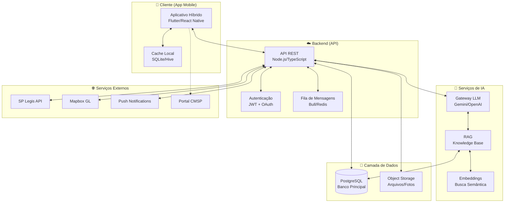
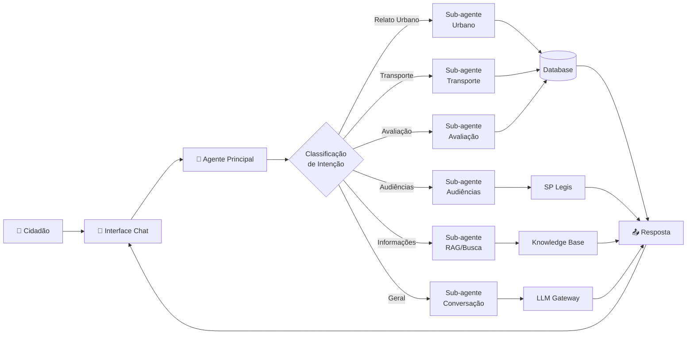
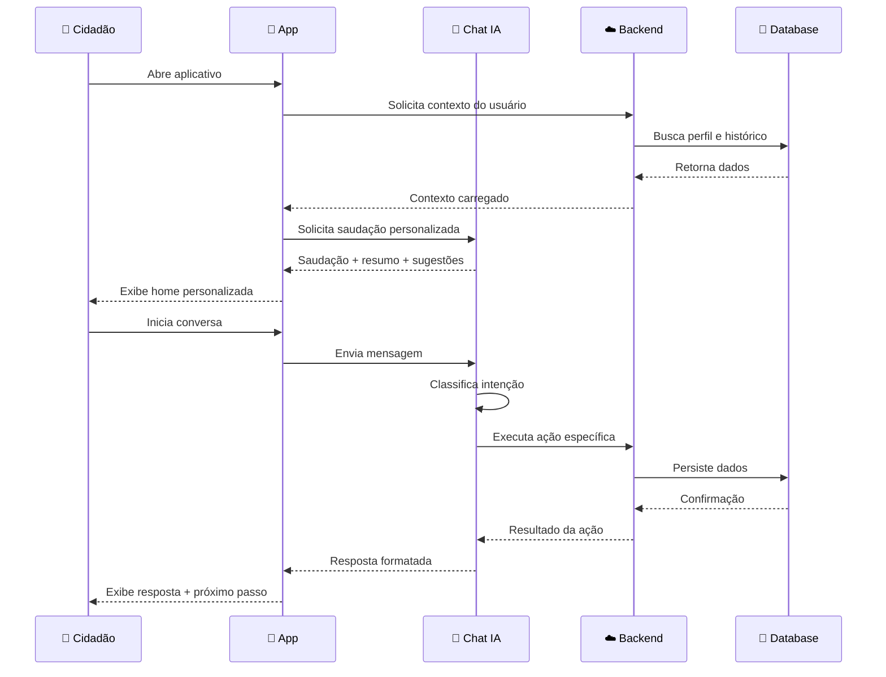
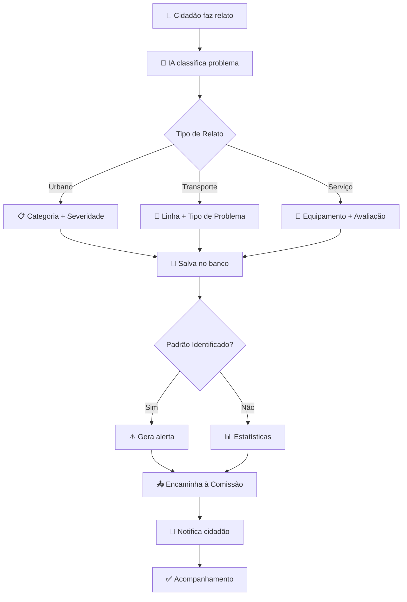
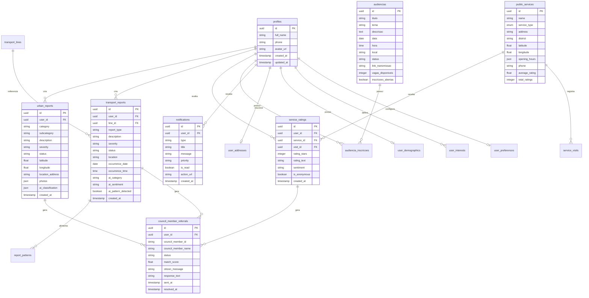
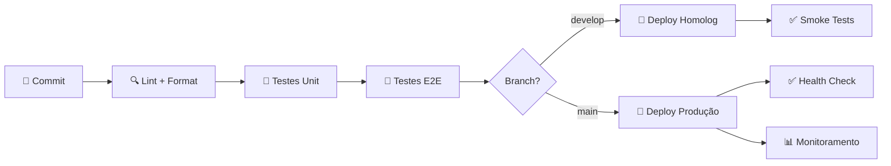
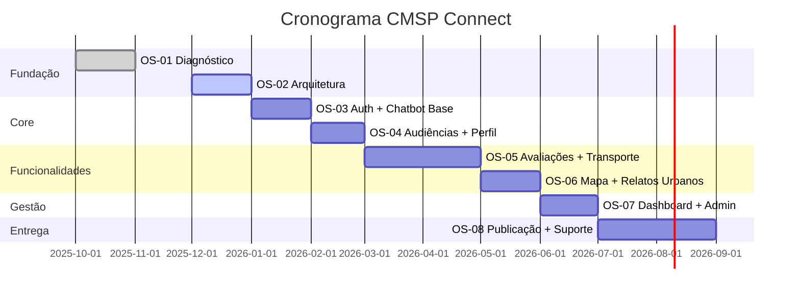

# DIAGNÓSTICO DE TECNOLOGIA E PLANEJAMENTO DE SOFTWARE WEB E MOBILE

## CMSP CONNECT — Aplicativo de Participação Cidadã

---

**Documento:** OS 01/2025 — Diagnóstico Técnico  
**Cliente:** Câmara Municipal de São Paulo (CMSP)  
**Elaboração:** M-TECH Soluções em Tecnologia  
**Data:** Outubro/2025  
**Versão:** 1.0  

---

## SUMÁRIO

1. [Sumário Executivo](#1-sumário-executivo)
2. [Contexto e Objetivo](#2-contexto-e-objetivo)
3. [Visão Geral da Solução](#3-visão-geral-da-solução)
4. [Arquitetura do Sistema](#4-arquitetura-do-sistema)
5. [Casos de Uso Principais](#5-casos-de-uso-principais)
6. [Fluxos de Usuário](#6-fluxos-de-usuário)
7. [Stack Tecnológica Recomendada](#7-stack-tecnológica-recomendada)
8. [Modelo de Dados Conceitual](#8-modelo-de-dados-conceitual)
9. [Requisitos Não-Funcionais](#9-requisitos-não-funcionais)
10. [Integrações Sugeridas](#10-integrações-sugeridas)
11. [DevOps e Qualidade](#11-devops-e-qualidade)
12. [Governança e Papéis](#12-governança-e-papéis)
13. [Roadmap Proposto](#13-roadmap-proposto)
14. [Riscos e Mitigações](#14-riscos-e-mitigações)
15. [Indicadores de Sucesso (KPIs)](#15-indicadores-de-sucesso-kpis)
16. [Artefatos do Diagnóstico](#16-artefatos-do-diagnóstico)
17. [Conclusões e Próximos Passos](#17-conclusões-e-próximos-passos)

---

## 1. SUMÁRIO EXECUTIVO

### 1.1 Apresentação

O **CMSP Connect** é um aplicativo móvel de participação cidadã que utiliza inteligência artificial para conectar munícipes, vereadores e serviços públicos da cidade de São Paulo. A solução promove transparência legislativa, facilita a avaliação de serviços públicos e transforma dados em decisões estratégicas para a gestão municipal.

### 1.2 Como Funciona

O aplicativo opera em 5 etapas principais:

```
┌─────────────────────────────────────────────────────────────────────────┐
│  1. ACOLHIMENTO     →  Saudação personalizada com contexto do usuário   │
│  2. CONVERSA        →  Chatbot IA como interface principal              │
│  3. AÇÃO            →  Relato, avaliação, inscrição ou consulta         │
│  4. ENCAMINHAMENTO  →  Direcionamento às Comissões Temáticas da CMSP    │
│  5. ACOMPANHAMENTO  →  Notificações e histórico de interações           │
└─────────────────────────────────────────────────────────────────────────┘
```

### 1.3 Benefícios Esperados

| Benefício | Descrição |
|-----------|-----------|
| **Cidadão mais conectado** | Canal único e intuitivo para interação com a Câmara |
| **Transparência ampliada** | Acesso simplificado a audiências, notícias e dados legislativos |
| **Inteligência de dados** | Análises que transformam relatos em políticas públicas |
| **Participação efetiva** | Engajamento facilitado em audiências e consultas públicas |
| **Acessibilidade** | Interface inclusiva seguindo padrões WCAG 2.1 AA |

### 1.4 Escopo desta OS

Este documento apresenta o **diagnóstico técnico completo** para desenvolvimento do CMSP Connect, incluindo arquitetura, modelo de dados, integrações e roadmap de implementação.

---

## 2. CONTEXTO E OBJETIVO

### 2.1 Situação Atual

A Câmara Municipal de São Paulo enfrenta desafios na comunicação com os cidadãos:

- **Dispersão de canais**: Informações fragmentadas entre portal, redes sociais e atendimento presencial
- **Baixo engajamento**: Participação limitada em audiências públicas e consultas
- **Dados não estruturados**: Dificuldade em transformar manifestações em inteligência estratégica
- **Barreiras de acesso**: Linguagem técnica e processos burocráticos

### 2.2 Solução Proposta

O CMSP Connect resolve esses desafios através de:

- **Interface conversacional**: Chatbot com IA que traduz linguagem técnica para linguagem cidadã
- **Experiência unificada**: Todos os serviços acessíveis via um único aplicativo
- **Personalização**: Conteúdo adaptado ao perfil, interesses e localização do usuário
- **Dados acionáveis**: Relatórios e dashboards para tomada de decisão

### 2.3 Objetivo do Documento

Fornecer base técnica sólida para o desenvolvimento do aplicativo, definindo:

- Arquitetura tecnológica e padrões de desenvolvimento
- Modelo de dados e relacionamentos
- Integrações necessárias com sistemas da CMSP
- Cronograma de entregas organizadas em Ordens de Serviço

---

## 3. VISÃO GERAL DA SOLUÇÃO

### 3.1 Formato da Aplicação

O CMSP Connect será desenvolvido como **aplicativo móvel híbrido**, utilizando tecnologia cross-platform que permite:

- Publicação simultânea na App Store (iOS) e Google Play (Android)
- Código único mantido por uma equipe
- Performance nativa com desenvolvimento acelerado
- Atualizações sincronizadas entre plataformas

**Tecnologias candidatas:** Flutter ou React Native (definição na fase de arquitetura)

### 3.2 Módulos do Sistema

#### 3.2.1 Módulo Cidadão (App Mobile)

| Capacidade | Descrição |
|------------|-----------|
| **Acolhimento Digital** | Saudação personalizada com resumo legislativo e sugestões contextuais |
| **Audiências Públicas** | Consulta, inscrição e acompanhamento de audiências |
| **Mapa de Serviços** | Localização de UBS, escolas, CEUs e outros equipamentos públicos |
| **Avaliação de Serviços** | Feedback estruturado sobre serviços utilizados |
| **Diagnóstico de Transporte** | Relatos sobre problemas no transporte público |
| **Relatos Urbanos** | Registro de ocorrências urbanas via chatbot |
| **Notificações** | Alertas personalizados sobre temas de interesse |
| **Perfil do Cidadão** | Dados pessoais, endereço, preferências e interesses |

#### 3.2.2 Módulo Administrativo (Web)

| Capacidade | Descrição |
|------------|-----------|
| **Dashboard Analítico** | Visão consolidada de métricas e indicadores |
| **Gestão de Relatos** | Triagem, encaminhamento e acompanhamento de manifestações |
| **Analytics Avançado** | Drill-down, drill-across e exportação de dados |
| **Gestão de Usuários** | Administração de perfis e permissões |
| **Logs de Auditoria** | Histórico de ações para transparência e compliance |

### 3.3 Sitemap do Aplicativo

```
CMSP Connect
├── Splash Screen
├── Onboarding (primeiro acesso)
├── Login / Cadastro
├── Home (Hub Principal)
│   ├── Saudação personalizada
│   ├── Resumo legislativo
│   ├── Carrossel de notícias
│   └── Ações rápidas
│
├── Chat IA (Interface Principal)
│   ├── Conversa livre
│   ├── Jornadas guiadas
│   │   ├── Relato Urbano
│   │   ├── Diagnóstico Transporte
│   │   ├── Avaliação de Serviço
│   │   ├── Audiências Públicas
│   │   └── Informações Legislativas
│   └── Histórico de conversas
│
├── Audiências Públicas
│   ├── Lista de audiências
│   ├── Filtros (tema, data, status)
│   ├── Detalhes da audiência
│   └── Inscrição e participação
│
├── Mapa de Serviços
│   ├── Visualização por mapa
│   ├── Filtros por tipo de serviço
│   ├── Detalhes do equipamento
│   └── Navegação/rotas
│
├── Minhas Atividades
│   ├── Meus relatos (urbanos e transporte)
│   ├── Minhas avaliações
│   ├── Minhas inscrições (audiências)
│   └── Favoritos
│
├── Notificações
│   └── Lista de alertas
│
├── Perfil
│   ├── Dados pessoais
│   ├── Endereço
│   ├── Interesses
│   ├── Preferências
│   └── Acessibilidade
│
└── Menu Institucional
    ├── Conheça a Câmara → Portal CMSP
    ├── Vereadores → Portal CMSP
    ├── Câmara Explica → Portal CMSP
    └── Escola do Parlamento → Portal CMSP
```

---

## 4. ARQUITETURA DO SISTEMA

### 4.1 Visão Geral da Arquitetura

O sistema adota arquitetura em três camadas com separação clara de responsabilidades:



### 4.2 Arquitetura do Chatbot

O chatbot utiliza padrão **Dispatcher** com agente principal que classifica a intenção do usuário e direciona para sub-agentes especializados:



### 4.3 Padrões Arquiteturais

| Padrão | Aplicação |
|--------|-----------|
| **REST API** | Comunicação cliente-servidor |
| **JWT + Refresh Token** | Autenticação stateless |
| **Repository Pattern** | Abstração de acesso a dados |
| **CQRS simplificado** | Separação de leitura/escrita para analytics |
| **Event Sourcing** | Logs de auditoria imutáveis |
| **RAG** | Respostas da IA fundamentadas em documentos oficiais |

### 4.4 Segurança

- **TLS 1.3** em todas as comunicações
- **Row Level Security (RLS)** para isolamento de dados por usuário
- **Sanitização de inputs** contra SQL Injection e XSS
- **Rate limiting** para proteção contra abuso
- **Anonimização** de dados pessoais após processamento
- **Conformidade LGPD** com termos de consentimento explícitos

---

## 5. CASOS DE USO PRINCIPAIS

### CSU001 — Acolhimento Digital Personalizado com IA

| Atributo | Descrição |
|----------|-----------|
| **Ator Principal** | Cidadão |
| **Prioridade** | Alta |
| **Descrição** | Sistema saúda o usuário de forma personalizada, exibe resumo legislativo do dia e sugere ações contextuais baseadas no perfil e localização. |

**Fluxo Principal:**
1. Cidadão abre o aplicativo
2. Sistema identifica contexto (horário, localização, histórico)
3. IA gera saudação personalizada
4. Sistema exibe resumo legislativo (audiências, votações, notícias)
5. Sistema sugere ações rápidas contextuais

**Regras de Negócio:**
- Resumos atualizados a cada 15 minutos
- Linguagem adaptada ao perfil do usuário (simplificada por padrão)
- Fontes oficiais sempre citadas nas informações

---

### CSU002 — Engajamento em Audiências Públicas

| Atributo | Descrição |
|----------|-----------|
| **Ator Principal** | Cidadão |
| **Prioridade** | Alta |
| **Descrição** | Cidadão consulta audiências públicas, filtra por temas de interesse, inscreve-se e recebe notificações. |

**Fluxo Principal:**
1. Cidadão acessa seção de Audiências
2. Sistema lista audiências disponíveis
3. Cidadão aplica filtros (tema, data, status)
4. Cidadão visualiza detalhes da audiência
5. Cidadão realiza inscrição
6. Sistema confirma e agenda notificações

**Regras de Negócio:**
- Dados de audiências provenientes do SP Legis
- Notificações enviadas 24h e 1h antes do evento
- Inscrição requer autenticação

---

### CSU003 — Navegação Institucional Simplificada

| Atributo | Descrição |
|----------|-----------|
| **Ator Principal** | Cidadão |
| **Prioridade** | Média |
| **Descrição** | Cidadão acessa informações institucionais da Câmara via redirecionamento para o Portal CMSP. |

**Fluxo Principal:**
1. Cidadão acessa menu institucional
2. Sistema exibe opções de conteúdo
3. Cidadão seleciona tema de interesse
4. Sistema redireciona para página específica do Portal CMSP

**Conteúdos Disponíveis:**
- Conheça a Câmara
- Lista de Vereadores
- Câmara Explica (educação legislativa)
- Escola do Parlamento

---

### CSU004 — Avaliação Geolocalizada de Serviços Públicos

| Atributo | Descrição |
|----------|-----------|
| **Ator Principal** | Cidadão |
| **Prioridade** | Alta |
| **Descrição** | Sistema detecta proximidade de equipamentos públicos e solicita avaliação, coletando feedback de forma conversacional. |

**Fluxo Principal:**
1. Sistema detecta proximidade de serviço público (GPS)
2. Após período de permanência, solicita avaliação
3. Cidadão inicia conversa de avaliação
4. Chatbot coleta: estrelas, descrição, pontos positivos/negativos
5. Sistema classifica sentimento automaticamente
6. Avaliação é salva e pode gerar encaminhamento

**Tipos de Serviços:**
- UBS (Unidades Básicas de Saúde)
- Escolas Municipais
- CEUs (Centros Educacionais Unificados)
- Hospitais
- Bibliotecas
- Centros Esportivos

**Regras de Negócio:**
- Detecção de visita requer permanência mínima de 10 minutos
- Solicitação de avaliação válida por 48 horas
- Dados de localização anonimizados após processamento

---

### CSU005 — Diagnóstico de Transporte Público

| Atributo | Descrição |
|----------|-----------|
| **Ator Principal** | Cidadão |
| **Prioridade** | Alta |
| **Descrição** | Cidadão registra problemas no transporte público através de relato estruturado, com identificação de linha e tipo de ocorrência. |

**Fluxo Principal:**
1. Cidadão inicia relato de transporte (via chat ou direto)
2. Chatbot solicita identificação da linha
3. Cidadão descreve o problema
4. Sistema classifica tipo e severidade
5. Sistema verifica padrões recorrentes
6. Relato é salvo e encaminhado

**Tipos de Problemas:**
- Atraso/Intervalo excessivo
- Superlotação
- Problemas no veículo
- Acessibilidade
- Segurança
- Comportamento do motorista/cobrador

**Regras de Negócio:**
- Relatos com padrão identificado geram alertas automáticos
- Encaminhamento à Comissão de Trânsito, Transporte e Atividade Econômica
- Feedback da resolução enviado ao cidadão

---

### CSU006 — Dashboard Analítico Multidimensional

| Atributo | Descrição |
|----------|-----------|
| **Ator Principal** | Gestor/Admin |
| **Prioridade** | Alta |
| **Descrição** | Gestores acessam dashboards com indicadores, gráficos e capacidade de análise dimensional (drill-down, drill-across, drill-up, drill-through). |

**Capacidades Analíticas:**

| Operação | Descrição | Exemplo |
|----------|-----------|---------|
| **Drill-Down** | Detalhar em níveis inferiores | Cidade → Região → Bairro |
| **Drill-Up** | Agregar em níveis superiores | Bairro → Região → Cidade |
| **Drill-Across** | Cruzar dimensões | Relatos por Categoria × Região |
| **Drill-Through** | Acessar registro individual | Detalhes de relato específico |

**Indicadores Principais:**
- Volume de relatos por período/categoria/região
- Tempo médio de resposta
- Análise de sentimento agregada
- Padrões recorrentes identificados
- Engajamento em audiências

---

### CSU007 — Mapa de Serviços Públicos

| Atributo | Descrição |
|----------|-----------|
| **Ator Principal** | Cidadão |
| **Prioridade** | Alta |
| **Descrição** | Cidadão visualiza equipamentos públicos no mapa, filtra por tipo e obtém informações de contato e rotas. |

**Fluxo Principal:**
1. Cidadão acessa Mapa de Serviços
2. Sistema exibe mapa com localização atual
3. Cidadão aplica filtros (tipo, distância)
4. Sistema exibe marcadores dos equipamentos
5. Cidadão seleciona equipamento
6. Sistema exibe detalhes (endereço, horário, avaliação média)
7. Cidadão pode traçar rota de navegação

**Funcionalidades:**
- Filtro por raio de distância (500m, 1km, 2km, 5km)
- Visualização de avaliação média
- Integração com app de navegação nativo
- Sugestão de equipamento mais adequado (via IA)

---

### CSU008 — Relatos Urbanos via Chatbot

| Atributo | Descrição |
|----------|-----------|
| **Ator Principal** | Cidadão |
| **Prioridade** | Alta |
| **Descrição** | Cidadão registra problemas urbanos através de conversa natural com o chatbot, que coleta informações e classifica automaticamente. |

**Fluxo Principal:**
1. Cidadão inicia conversa sobre problema urbano
2. Chatbot solicita descrição do problema
3. Cidadão descreve a situação
4. Sistema infere categoria automaticamente
5. Chatbot solicita localização (GPS ou texto)
6. Cidadão pode anexar foto
7. Sistema salva relato e confirma

**Categorias de Relatos:**
- Iluminação pública
- Buracos e pavimentação
- Limpeza urbana
- Áreas verdes
- Sinalização
- Calçadas e acessibilidade
- Drenagem e alagamentos
- Outros

**Regras de Negócio:**
- Classificação automática por IA (sem formulário)
- Severidade padrão: média (ajustável pela IA)
- Tom empático e acolhedor (persona Luana)
- Encaminhamento à Comissão temática apropriada

---

## 6. FLUXOS DE USUÁRIO

### 6.1 Jornada do Cidadão



### 6.2 Fluxo de Relato com Encaminhamento



---

## 7. STACK TECNOLÓGICA RECOMENDADA

### 7.1 Visão Geral

| Camada | Tecnologia | Justificativa |
|--------|------------|---------------|
| **Mobile** | Flutter ou React Native | Cross-platform com performance nativa |
| **Backend/API** | Node.js + TypeScript | Tipagem forte, ecossistema maduro |
| **Banco de Dados** | PostgreSQL | Robusto, extensões para geo e vetores |
| **Autenticação** | JWT + OAuth 2.0 | Padrão de mercado, integração social |
| **IA/LLM** | Gateway (Gemini/OpenAI) | Modelos de última geração |
| **Embeddings** | pgvector + text-embedding | Busca semântica no banco |
| **Mapas** | Mapbox GL | Qualidade e customização |
| **Push** | Firebase Cloud Messaging | iOS e Android unificados |
| **Infraestrutura** | Cloud (AWS/Azure/GCP) | Escalabilidade e disponibilidade |

### 7.2 Detalhamento por Componente

#### Frontend Mobile

```
├── Framework: Flutter 3.x ou React Native 0.7x
├── Gerenciamento de Estado: Riverpod/BLoC ou Redux/Zustand
├── Navegação: Go Router ou React Navigation
├── HTTP Client: Dio ou Axios
├── Cache Local: Hive/SQLite ou AsyncStorage/MMKV
├── Mapas: mapbox_gl ou @rnmapbox/maps
└── Testes: Flutter Test ou Jest + Detox
```

#### Backend API

```
├── Runtime: Node.js 20 LTS
├── Framework: Express ou Fastify
├── Linguagem: TypeScript 5.x
├── ORM: Prisma ou TypeORM
├── Validação: Zod ou Joi
├── Autenticação: Passport.js + JWT
├── Documentação: OpenAPI/Swagger
└── Testes: Jest + Supertest
```

#### Banco de Dados

```
├── SGBD: PostgreSQL 15+
├── Extensões:
│   ├── pgvector (embeddings)
│   ├── PostGIS (geolocalização)
│   └── pg_trgm (busca textual)
├── Migrations: Prisma Migrate ou Flyway
└── Backup: Point-in-Time Recovery
```

#### Inteligência Artificial

```
├── Gateway LLM: Endpoint unificado
├── Modelos:
│   ├── Google Gemini 2.5 Flash (conversação)
│   ├── Google Gemini 2.5 Pro (tarefas complexas)
│   └── text-embedding-3-small (embeddings)
├── RAG: Knowledge base com busca vetorial
└── Classificação: Zero-shot via prompt engineering
```

---

## 8. MODELO DE DADOS CONCEITUAL

### 8.1 Diagrama Entidade-Relacionamento



### 8.2 Tabelas Principais

| Tabela | Descrição | RLS |
|--------|-----------|-----|
| `profiles` | Dados do perfil do usuário | Sim |
| `urban_reports` | Relatos de problemas urbanos | Sim |
| `transport_reports` | Relatos de transporte público | Sim |
| `service_ratings` | Avaliações de serviços públicos | Sim |
| `public_services` | Cadastro de equipamentos públicos | Não |
| `audiencias` | Audiências públicas (cache do SP Legis) | Não |
| `audiencia_inscricoes` | Inscrições em audiências | Sim |
| `transport_lines` | Linhas de transporte | Não |
| `report_patterns` | Padrões identificados por IA | Não |
| `council_member_referrals` | Encaminhamentos a Comissões | Sim |
| `notifications` | Notificações aos usuários | Sim |
| `knowledge_base` | Base de conhecimento para RAG | Não |
| `audit_logs` | Logs de auditoria | Não |

---

## 9. REQUISITOS NÃO-FUNCIONAIS

### 9.1 Performance

| Métrica | Requisito |
|---------|-----------|
| Tempo de carregamento inicial | < 3 segundos |
| Resposta de API (p95) | < 500ms |
| Resposta do chatbot (p95) | < 3 segundos |
| Taxa de frames (animações) | ≥ 60 FPS |

### 9.2 Segurança

| Requisito | Implementação |
|-----------|---------------|
| Comunicação | TLS 1.3 obrigatório |
| Autenticação | JWT com refresh token (15min/7dias) |
| Autorização | RLS por usuário no banco |
| Dados sensíveis | Criptografia AES-256 |
| LGPD | Consentimento explícito, anonimização |

### 9.3 Disponibilidade

| Métrica | Requisito |
|---------|-----------|
| Uptime | 99.5% |
| RPO (Recovery Point Objective) | 1 hora |
| RTO (Recovery Time Objective) | 4 horas |
| Backup | Diário com retenção de 30 dias |

### 9.4 Acessibilidade

| Padrão | Nível |
|--------|-------|
| WCAG | 2.1 AA |
| Navegação por teclado | Suportada |
| Leitor de tela | Compatível |
| Ajuste de fonte | 50% - 200% |
| Contraste mínimo | 4.5:1 |

### 9.5 Compatibilidade

| Plataforma | Versão Mínima |
|------------|---------------|
| iOS | 14.0+ |
| Android | 10.0+ (API 29) |
| Tamanho do app | < 50 MB |

---

## 10. INTEGRAÇÕES SUGERIDAS

### 10.1 Integrações Primárias

| Sistema | Finalidade | Tipo |
|---------|------------|------|
| **SP Legis API** | Vereadores, comissões, audiências, votações | REST API |
| **Mapbox GL** | Mapas, geolocalização, rotas | SDK |
| **Firebase Cloud Messaging** | Notificações push iOS/Android | SDK |
| **Portal CMSP** | Redirecionamento para conteúdo institucional | Deep Link |

### 10.2 Integrações Secundárias (Fase 2)

| Sistema | Finalidade | Status |
|---------|------------|--------|
| SPTrans (Olho Vivo) | Dados em tempo real de ônibus | Avaliação |
| GeoSampa | Camadas geográficas oficiais | Avaliação |
| SEI (Sistema Eletrônico de Informações) | Acompanhamento de processos | Avaliação |

### 10.3 Estratégia de Contingência

O sistema mantém **base interna de dados** como contingência para garantir funcionamento mesmo quando integrações externas estiverem indisponíveis:

- Cache local de vereadores e comissões
- Base própria de equipamentos públicos
- Linhas de transporte cadastradas internamente
- Sincronização periódica com fontes oficiais

---

## 11. DEVOPS E QUALIDADE

### 11.1 Pipeline CI/CD



### 11.2 Ambientes

| Ambiente | Finalidade | Atualização |
|----------|------------|-------------|
| **Desenvolvimento** | Testes do time | Contínua |
| **Homologação** | Validação com cliente | Por sprint |
| **Produção** | Usuários finais | Releases aprovadas |

### 11.3 Qualidade de Código

| Prática | Ferramenta |
|---------|------------|
| Linting | ESLint / Dart Analyzer |
| Formatação | Prettier / dart format |
| Testes unitários | Jest / Flutter Test |
| Testes E2E | Detox / Patrol |
| Code Review | Pull Requests obrigatórios |
| Cobertura mínima | 70% |

### 11.4 Monitoramento

| Aspecto | Ferramenta Sugerida |
|---------|---------------------|
| APM (Application Performance) | Sentry / Datadog |
| Logs centralizados | CloudWatch / Papertrail |
| Métricas de negócio | Mixpanel / Amplitude |
| Alertas | PagerDuty / Opsgenie |

---

## 12. GOVERNANÇA E PAPÉIS

### 12.1 Perfis de Acesso no Sistema

| Perfil | Permissões |
|--------|------------|
| **Cidadão** | Criar relatos, avaliar, inscrever-se, ver próprio histórico |
| **Vereador** | Visualizar encaminhamentos do gabinete |
| **Assessor** | Responder encaminhamentos, visualizar métricas do gabinete |
| **Gestor** | Dashboard analítico, gestão de relatos, exportação |
| **Admin** | Todas as permissões + gestão de usuários e sistema |

### 12.2 Estrutura do Projeto

| Papel | Responsabilidade |
|-------|------------------|
| **Product Owner (CMSP)** | Definição de prioridades e aceite de entregas |
| **Coordenação Técnica (M-TECH)** | Arquitetura, qualidade e gestão técnica |
| **Tech Lead** | Decisões técnicas e code review |
| **Desenvolvedores** | Implementação e testes |
| **UX Designer** | Protótipos e validação de usabilidade |
| **QA** | Testes e homologação |

### 12.3 Cerimônias

| Cerimônia | Frequência | Participantes |
|-----------|------------|---------------|
| Daily | Diária | Time técnico |
| Sprint Planning | Quinzenal | PO + Time |
| Sprint Review | Quinzenal | PO + Stakeholders + Time |
| Retrospectiva | Quinzenal | Time técnico |

---

## 13. ROADMAP PROPOSTO

### 13.1 Visão Geral (12 meses)



### 13.2 Detalhamento por OS

#### OS-01: Diagnóstico Técnico (Out-Nov/2025) ✅
- Levantamento de requisitos
- Análise de sistemas existentes
- Definição de escopo
- **Entrega:** Este documento

#### OS-02: Arquitetura e Fundação (Dez/2025 - Jan/2026)
- Definição de stack tecnológica
- Setup de infraestrutura
- Modelagem de dados
- Protótipo de navegação
- **Entrega:** Ambiente configurado + Protótipo navegável

#### OS-03: Autenticação e Chatbot Base (Jan-Fev/2026)
- Sistema de login/cadastro
- Perfil básico do usuário
- Chatbot com conversação geral
- Integração com LLM
- **Entrega:** App com auth + chat funcional

#### OS-04: Audiências e Gestão de Perfil (Fev-Mar/2026)
- Listagem de audiências (SP Legis)
- Inscrição em audiências
- Notificações
- Perfil completo (endereço, interesses, preferências)
- **Entrega:** Módulo de audiências + perfil completo

#### OS-05: Avaliações e Transporte (Mar-Mai/2026)
- Detecção de visitas a serviços
- Avaliação conversacional
- Relatos de transporte
- Identificação de padrões
- **Entrega:** Avaliações + diagnóstico de transporte

#### OS-06: Mapa e Relatos Urbanos (Mai-Jun/2026)
- Mapa de serviços públicos
- Filtros e navegação
- Relatos urbanos via chat
- Classificação automática
- **Entrega:** Mapa interativo + relatos urbanos

#### OS-07: Dashboard e Administração (Jun-Jul/2026)
- Dashboard analítico
- Gestão de relatos
- Encaminhamentos a Comissões
- Logs de auditoria
- Exportação de dados
- **Entrega:** Área administrativa completa

#### OS-08: Publicação e Acompanhamento (Jul-Set/2026)
- Publicação nas lojas (App Store + Play Store)
- Monitoramento de produção
- Correções e ajustes
- Documentação técnica
- Treinamento de usuários
- **Entrega:** App em produção + documentação

---

## 14. RISCOS E MITIGAÇÕES

| Risco | Probabilidade | Impacto | Mitigação |
|-------|---------------|---------|-----------|
| **Indisponibilidade de APIs externas** | Média | Alto | Base interna como contingência |
| **Complexidade de integrações** | Média | Médio | Escopo simplificado, integrações faseadas |
| **Encaminhamento político sensível** | Alta | Alto | Encaminhamento a Comissões (não a vereadores individuais) |
| **Conformidade LGPD** | Média | Alto | Anonimização, retenção limitada, consentimento explícito |
| **Performance do LLM** | Baixa | Médio | Cache de respostas, fallback para templates |
| **Adoção pelos cidadãos** | Média | Alto | UX simplificada, onboarding guiado, divulgação |
| **Mudanças de requisitos** | Alta | Médio | Metodologia ágil, sprints curtos, comunicação frequente |

---

## 15. INDICADORES DE SUCESSO (KPIs)

### 15.1 Adoção

| Indicador | Meta (6 meses) | Meta (12 meses) |
|-----------|----------------|-----------------|
| Downloads do app | 10.000 | 50.000 |
| Usuários ativos mensais | 3.000 | 15.000 |
| Taxa de retenção (D30) | 20% | 30% |

### 15.2 Engajamento

| Indicador | Meta Mensal |
|-----------|-------------|
| Relatos urbanos | 500 |
| Relatos de transporte | 300 |
| Avaliações de serviços | 200 |
| Inscrições em audiências | 100 |
| Conversas com chatbot | 5.000 |

### 15.3 Qualidade

| Indicador | Meta |
|-----------|------|
| NPS do aplicativo | > 40 |
| Avaliação nas lojas | > 4.0 |
| Taxa de erros | < 1% |
| Tempo médio de resposta | < 500ms |

### 15.4 Operacional

| Indicador | Meta |
|-----------|------|
| Uptime | 99.5% |
| Tempo de resolução de bugs críticos | < 24h |
| Cobertura de testes | > 70% |

---

## 16. ARTEFATOS DO DIAGNÓSTICO

### 16.1 Documentos Entregues

| Artefato | Descrição | Formato |
|----------|-----------|---------|
| Diagnóstico Técnico | Este documento | Markdown/PDF |
| Especificação Refinada | Casos de uso detalhados | Markdown |
| Protótipo Navegável | Validação de UX | Aplicação web |

### 16.2 Diagramas Incluídos

| Diagrama | Seção |
|----------|-------|
| Arquitetura Lógica | 4.1 |
| Arquitetura do Chatbot | 4.2 |
| Modelo de Dados (ERD) | 8.1 |
| Jornada do Cidadão | 6.1 |
| Fluxo de Relatos | 6.2 |
| Pipeline CI/CD | 11.1 |
| Cronograma/Roadmap | 13.1 |

---

## 17. CONCLUSÕES E PRÓXIMOS PASSOS

### 17.1 Resumo

O **CMSP Connect** representa uma evolução significativa na forma como a Câmara Municipal de São Paulo se relaciona com os cidadãos. Através de uma interface conversacional inteligente, o aplicativo:

- **Democratiza o acesso** à informação legislativa
- **Simplifica a participação** em audiências públicas
- **Estrutura o feedback** sobre serviços e problemas urbanos
- **Transforma dados** em inteligência para políticas públicas
- **Conecta cidadãos** às Comissões temáticas da Câmara

### 17.2 Diferenciais Técnicos

- **IA Conversacional** como interface principal (não formulários)
- **Classificação automática** de relatos e avaliações
- **Encaminhamento institucional** para Comissões
- **Dashboard analítico** com capacidades multidimensionais
- **Arquitetura escalável** para milhões de usuários

### 17.3 Próximos Passos

1. **Aprovação do diagnóstico** pelo cliente
2. **Início da OS-02** (Arquitetura e Fundação)
3. **Definição final de stack** (Flutter vs React Native)
4. **Setup de ambientes** de desenvolvimento
5. **Kick-off do desenvolvimento** com sprint planning

---

**Documento elaborado por:**  
M-TECH Soluções em Tecnologia

**Aprovado por:**  
________________________________  
Câmara Municipal de São Paulo

**Data de aprovação:**  
___/___/______

---

*Este documento é parte integrante da OS 01/2025 - Diagnóstico de Tecnologia e Planejamento de Software Web e Mobile — CMSP Connect.*
