# CMSP Connect - Overview da Plataforma

**Versão:** 1.0  
**Data:** Dezembro 2025  
**Status:** Documento Executivo

---

## Sumário

1. [Visão Executiva](#1-visão-executiva)
2. [O Cérebro do Projeto: IA + N8N](#2-o-cérebro-do-projeto-ia--n8n)
3. [Pilares de Usabilidade](#3-pilares-de-usabilidade)
4. [Arquitetura Sistêmica](#4-arquitetura-sistêmica)
5. [Jornadas do Cidadão](#5-jornadas-do-cidadão)
6. [CMS Administrativo](#6-cms-administrativo)
7. [Métricas de Sucesso](#7-métricas-de-sucesso)
8. [Segurança e Conformidade LGPD](#8-segurança-e-conformidade-lgpd)
9. [Glossário](#9-glossário)

---

## 1. Visão Executiva

### 1.1 Contexto

A Câmara Municipal de São Paulo (CMSP) é uma das maiores casas legislativas da América Latina, responsável por representar mais de 12 milhões de cidadãos. Historicamente, a comunicação entre munícipes e seus representantes enfrenta barreiras significativas:

- **Complexidade institucional**: Cidadãos não compreendem como funciona o processo legislativo
- **Fragmentação de canais**: Múltiplos pontos de contato sem integração
- **Baixo engajamento**: Participação cidadã limitada a audiências presenciais
- **Demandas não rastreáveis**: Relatos e reclamações se perdem em processos manuais

### 1.2 A Solução: CMSP Connect

O **CMSP Connect** é uma plataforma digital de participação cidadã que utiliza **Inteligência Artificial** para conectar munícipes, vereadores e serviços públicos de forma inteligente, acessível e transparente.

```
┌─────────────────────────────────────────────────────────────────┐
│                        CMSP CONNECT                              │
│                                                                  │
│   ┌──────────┐      ┌──────────────┐      ┌──────────────┐     │
│   │ CIDADÃO  │ ───► │  ASSISTENTE  │ ───► │   CÂMARA     │     │
│   │          │      │   IA + N8N   │      │   MUNICIPAL  │     │
│   └──────────┘      └──────────────┘      └──────────────┘     │
│                            │                                    │
│                            ▼                                    │
│                    ┌──────────────┐                             │
│                    │     CMS      │                             │
│                    │ GESTÃO INTEL.│                             │
│                    └──────────────┘                             │
└─────────────────────────────────────────────────────────────────┘
```

### 1.3 Proposta de Valor

| Para Cidadãos | Para a Câmara Municipal |
|---------------|-------------------------|
| Comunicação direta e natural via chat | Visão unificada de todas as manifestações |
| Descoberta de serviços próximos | Categorização automática por IA |
| Acompanhamento de demandas | Priorização inteligente |
| Acesso simplificado a informações | Encaminhamento sugerido para comissões |
| Transparência do processo legislativo | Métricas de engajamento em tempo real |

### 1.4 Resultados Esperados

- **+300%** de engajamento cidadão comparado a canais tradicionais
- **-70%** no tempo de triagem manual de manifestações
- **+50%** de resoluções efetivas através de encaminhamentos assertivos
- **100%** de rastreabilidade das demandas cidadãs

---

## 2. O Cérebro do Projeto: IA + N8N

O diferencial central do CMSP Connect está em seu **sistema de inteligência** que combina processamento de linguagem natural, análise de sentimento, categorização automática e workflows de automação para transformar manifestações cidadãs em ações concretas.

### 2.1 Visão Geral do Pipeline Inteligente

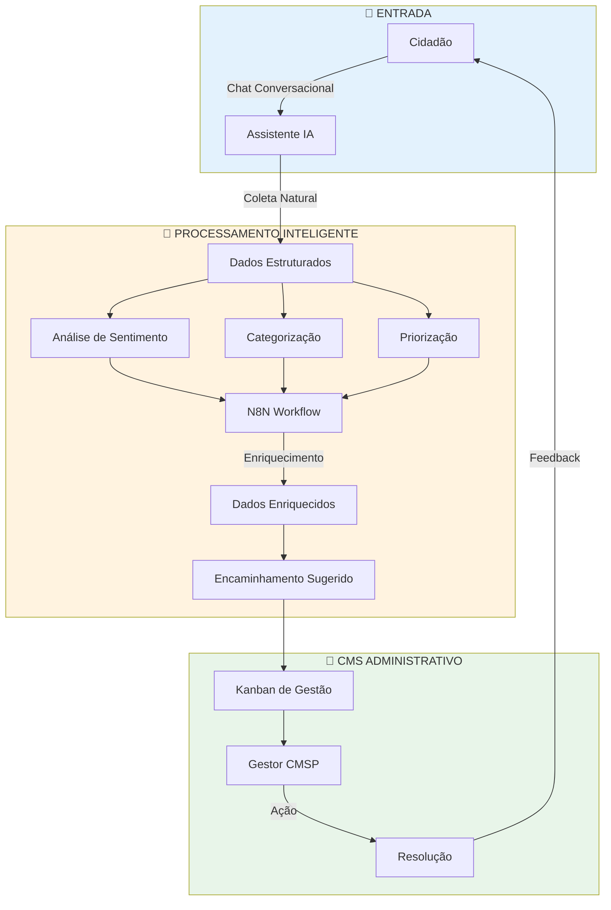

### 2.2 Coleta Conversacional Inteligente

O Assistente CMSP não utiliza formulários rígidos. Em vez disso, conduz uma **conversa natural** que extrai informações estruturadas enquanto mantém uma experiência fluida para o cidadão.

**Exemplo de Interação:**

```
👤 Cidadão: "Tem um buraco enorme na Rua Augusta que tá causando 
            acidentes de moto toda semana"

🤖 Assistente: "Entendo sua preocupação com a segurança! Para 
               registrar esse problema, pode me informar em que 
               altura da Rua Augusta você viu o buraco?"

👤 Cidadão: "Perto do número 500, quase esquina com a Paulista"

🤖 Assistente: "Perfeito! E você consegue me dizer mais ou menos 
               o tamanho do buraco? Isso ajuda na priorização."
```

**Dados Extraídos Automaticamente:**

| Campo | Valor Inferido | Método |
|-------|----------------|--------|
| Categoria | Infraestrutura | Keyword "buraco" |
| Subcategoria | Pavimentação | Contexto |
| Localização | Rua Augusta, 500 | Extração de endereço |
| Referência | Esq. Av. Paulista | Contexto |
| Severidade | Alta | "acidentes toda semana" |
| Urgência | Alta | Risco de segurança |

### 2.3 Análise de Sentimento

Cada manifestação passa por uma **análise de sentimento** que avalia o tom emocional do cidadão e ajuda a priorizar demandas que exigem atenção imediata.

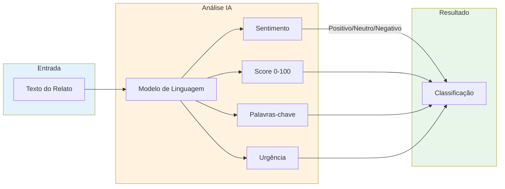

**Escala de Sentimento:**

| Score | Classificação | Interpretação |
|-------|---------------|---------------|
| 0-30 | 🔴 Negativo | Cidadão frustrado, requer atenção prioritária |
| 31-60 | 🟡 Neutro | Relato objetivo, triagem normal |
| 61-100 | 🟢 Positivo | Elogio ou sugestão construtiva |

**Exemplo de Análise:**

```json
{
  "texto": "Estou indignado! Faz 3 meses que ligo pro 156 e 
            ninguém resolve o esgoto estourado na minha rua!",
  "resultado": {
    "sentimento": "negativo",
    "score": 15,
    "urgencia": "alta",
    "palavras_chave": ["indignado", "esgoto", "3 meses", "não resolve"],
    "categoria_inferida": "saneamento"
  }
}
```

### 2.4 Categorização Automática

O sistema categoriza automaticamente cada manifestação para direcionar às **Comissões Permanentes** corretas da Câmara Municipal.

**Mapeamento de Categorias para Comissões:**

| Categoria | Comissão Sugerida | Palavras-Chave Típicas |
|-----------|-------------------|------------------------|
| 🏗️ Infraestrutura | Política Urbana | buraco, calçada, obra, asfalto |
| 🚌 Transporte | Trânsito e Transporte | ônibus, metrô, lotação, atraso |
| 🏥 Saúde | Saúde e Assistência | UBS, hospital, fila, medicamento |
| 📚 Educação | Educação e Cultura | escola, creche, professor, vaga |
| 🌳 Meio Ambiente | Meio Ambiente | poda, lixo, poluição, árvore |
| 💡 Iluminação | Serviços Públicos | luz, poste, escuro, lâmpada |
| 🧹 Limpeza | Serviços Públicos | lixo, entulho, coleta, sujeira |
| 🔒 Segurança | Segurança Pública | roubo, assalto, policiamento |

### 2.5 Priorização Inteligente

O sistema calcula um **score de prioridade** baseado em múltiplos fatores:

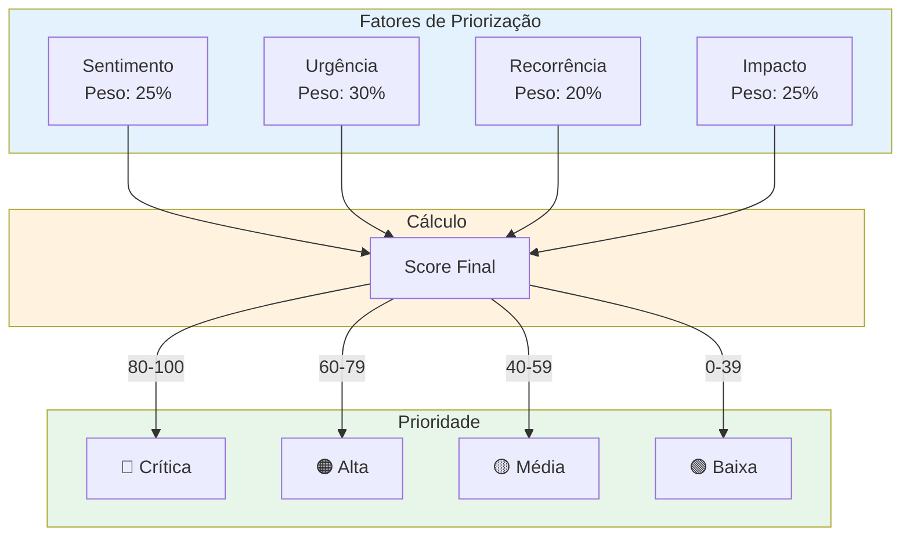

**Critérios de Priorização:**

| Fator | Descrição | Exemplos de Alta Pontuação |
|-------|-----------|----------------------------|
| **Sentimento** | Tom emocional do cidadão | Frustração, indignação, desespero |
| **Urgência** | Risco imediato à população | Acidentes, saúde pública, segurança |
| **Recorrência** | Padrão detectado pelo sistema | Múltiplos relatos da mesma região |
| **Impacto** | Quantidade de pessoas afetadas | Ruas movimentadas, serviços essenciais |

### 2.6 Encaminhamento Sugerido

O sistema sugere **vereadores e comissões** mais adequados para cada manifestação baseado em:

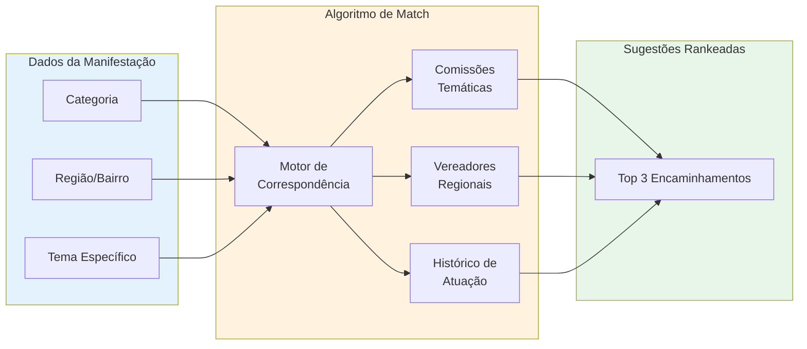

**Exemplo de Sugestão:**

```
📋 Manifestação: Buraco perigoso na Zona Sul

🎯 Encaminhamentos Sugeridos:

1. Comissão de Política Urbana (95% match)
   - Razão: Categoria infraestrutura/pavimentação
   
2. Vereador José Silva (87% match)
   - Razão: Base eleitoral na região
   - Histórico: 15 intervenções similares resolvidas
   
3. Subprefeitura Santo Amaro (82% match)
   - Razão: Jurisdição territorial
```

### 2.7 Integração N8N - Workflow de Automação

O **N8N** atua como orquestrador de workflows, permitindo automações complexas que enriquecem os dados e disparam ações externas.

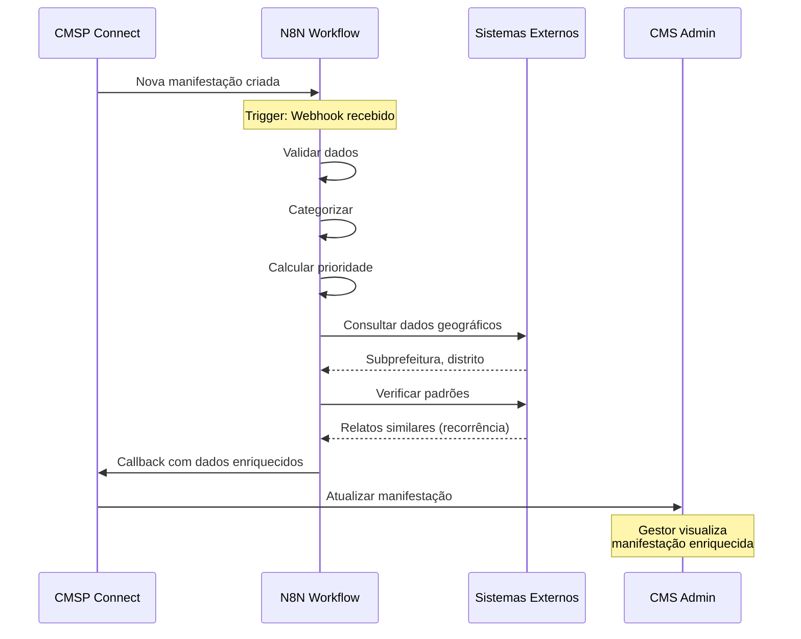

**Payload de Entrada (CMSP → N8N):**

```json
{
  "event_type": "urban_report.created",
  "report": {
    "id": "uuid-123",
    "category": "infraestrutura",
    "description": "Buraco na Rua Augusta",
    "location_address": "Rua Augusta, 500",
    "latitude": -23.5505,
    "longitude": -46.6333
  },
  "user_context": {
    "region": "Centro",
    "interests": ["transporte", "infraestrutura"]
  },
  "callback_url": "https://api.cmspconnect.com/n8n-callback"
}
```

**Payload de Retorno (N8N → CMSP):**

```json
{
  "report_id": "uuid-123",
  "n8n_priority": "high",
  "n8n_validated_category": "infraestrutura_viaria",
  "n8n_tags": ["buraco", "risco_acidentes", "zona_central"],
  "n8n_enriched_data": {
    "subprefeitura": "Sé",
    "distrito": "Consolação",
    "densidade_populacional": "alta",
    "relatos_similares_30dias": 3,
    "tempo_medio_resolucao": "15 dias"
  }
}
```

### 2.8 Visão Consolidada: O Pipeline Completo

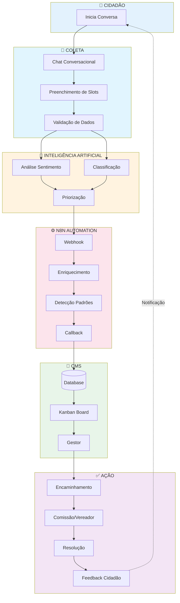

---

## 3. Pilares de Usabilidade

O CMSP Connect foi projetado para ser acessível a **todos os cidadãos**, independentemente de idade, escolaridade ou familiaridade com tecnologia.

### 3.1 Acessibilidade (WCAG 2.1 AA)

| Recurso | Implementação |
|---------|---------------|
| **Contraste** | Razão mínima 4.5:1 para texto |
| **Navegação por Teclado** | 100% das funções acessíveis |
| **Leitores de Tela** | Labels semânticos em todos elementos |
| **Ajuste de Fonte** | Suporte a zoom até 200% |
| **Modo Escuro** | Alternância automática por preferência do sistema |

### 3.2 Design Conversacional

Em vez de formulários complexos, o cidadão interage com um **assistente inteligente** que:

- Conduz diálogos naturais em português brasileiro
- Faz perguntas uma de cada vez
- Confirma informações antes de registrar
- Oferece ajuda contextual quando detecta hesitação
- Sugere jornadas alternativas quando apropriado

```
┌─────────────────────────────────────────┐
│  ❌ Formulário Tradicional              │
├─────────────────────────────────────────┤
│  Nome: ____________                     │
│  CPF: _____________                     │
│  Categoria: [Dropdown com 15 opções]    │
│  Subcategoria: [Dropdown com 30 opções] │
│  Descrição: [Campo obrigatório 500 car] │
│  Endereço: ____________                 │
│  CEP: ____________                      │
│  [ENVIAR]                               │
└─────────────────────────────────────────┘

┌─────────────────────────────────────────┐
│  ✅ Chat Conversacional                 │
├─────────────────────────────────────────┤
│  🤖 "Olá! O que você gostaria de        │
│      relatar hoje?"                     │
│                                         │
│  👤 "Tem um buraco enorme na minha rua" │
│                                         │
│  🤖 "Entendi! Pode me dizer qual rua    │
│      e o número mais próximo?"          │
│                                         │
│  👤 "Rua das Flores, 123"               │
│                                         │
│  🤖 "Perfeito! Registrei seu relato.    │
│      Você receberá atualizações."       │
└─────────────────────────────────────────┘
```

### 3.3 Mobile First

O aplicativo foi projetado **primeiro para smartphones**, garantindo:

- Interface otimizada para telas pequenas
- Gestos nativos (swipe, pull-to-refresh)
- Carregamento progressivo de conteúdo
- Funcionamento em redes instáveis (3G/4G)

### 3.4 Linguagem Cidadã

Todo conteúdo utiliza **linguagem simples**:

| Termo Técnico | Linguagem Cidadã |
|---------------|------------------|
| "Protocolar demanda" | "Registrar seu pedido" |
| "Tramitação legislativa" | "Andamento do projeto" |
| "Comissão temática" | "Grupo de vereadores especialistas" |
| "Audiência pública" | "Reunião aberta para todos" |

### 3.5 Transparência

Toda resposta do assistente indica suas **fontes de informação**:

```
🤖 "De acordo com a Lei Orgânica do Município (Art. 45), 
    os vereadores podem propor..."
    
    📎 Fonte: Portal CMSP - Lei Orgânica
```

---

## 4. Arquitetura Sistêmica

### 4.1 Visão de Alto Nível

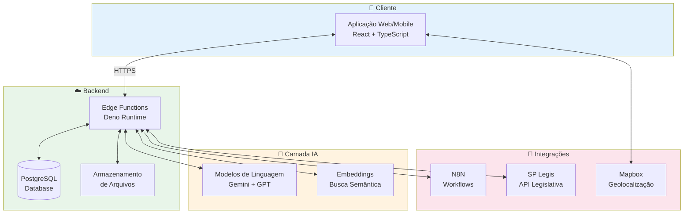

### 4.2 Stack Tecnológico

| Camada | Tecnologia | Justificativa |
|--------|------------|---------------|
| **Frontend** | React 18 + TypeScript | Componentização, tipagem forte |
| **Estilização** | Tailwind CSS | Design system consistente |
| **Componentes** | shadcn/ui + Radix | Acessibilidade nativa |
| **Estado** | TanStack Query | Cache inteligente, sync automático |
| **Backend** | Edge Functions (Deno) | Baixa latência, serverless |
| **Banco de Dados** | PostgreSQL | Robustez, RLS nativo |
| **IA** | Gemini 2.5 + GPT-4 | Processamento de linguagem |
| **Automação** | N8N | Workflows visuais |
| **Mapas** | Mapbox GL | Performance, customização |

### 4.3 Edge Functions Principais

| Função | Propósito |
|--------|-----------|
| `ai-chat` | Chatbot principal com detecção de intenção |
| `urban-report-chat` | Jornada especializada para relatos urbanos |
| `diagnose-transport` | Diagnóstico de problemas de transporte |
| `evaluate-service` | Avaliação de serviços públicos |
| `analyze-sentiment` | Análise de sentimento em lote |
| `suggest-council-members` | Sugestão de encaminhamentos |
| `notify-n8n` | Integração com workflows N8N |
| `n8n-callback` | Recebimento de dados enriquecidos |
| `recommend-services` | Recomendação de serviços próximos |

### 4.4 Modelo de Dados Simplificado

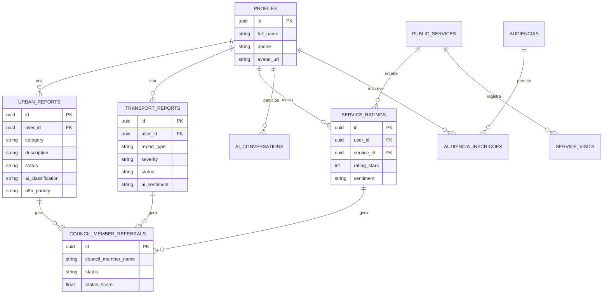

---

## 5. Jornadas do Cidadão

O CMSP Connect oferece **5 jornadas especializadas**, cada uma otimizada para um tipo específico de interação cidadã.

### 5.1 Tudo Sobre a Câmara (Jornada Geral)

**Objetivo:** Responder dúvidas sobre funcionamento da Câmara, projetos de lei, vereadores e processo legislativo.

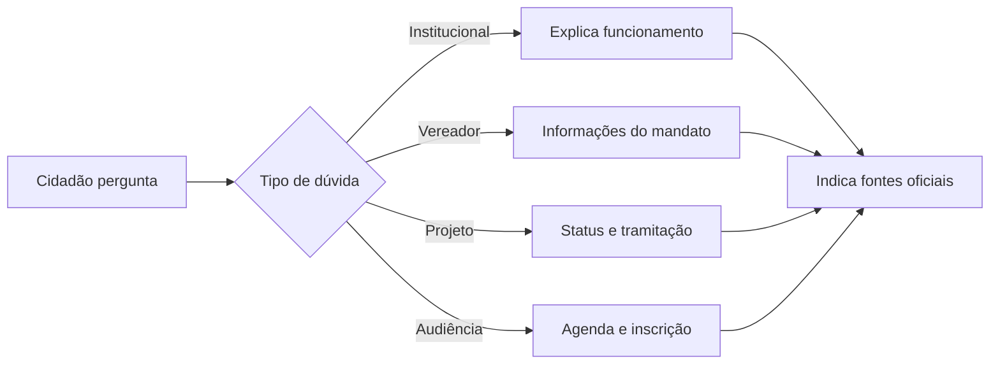

**Exemplos de Interação:**
- "Como funciona a votação de um projeto de lei?"
- "Quem é o vereador do meu bairro?"
- "Quais audiências públicas estão abertas?"

### 5.2 Fala Cidadão! (Relatos Urbanos)

**Objetivo:** Registrar problemas urbanos e feedback sobre a Câmara Municipal.

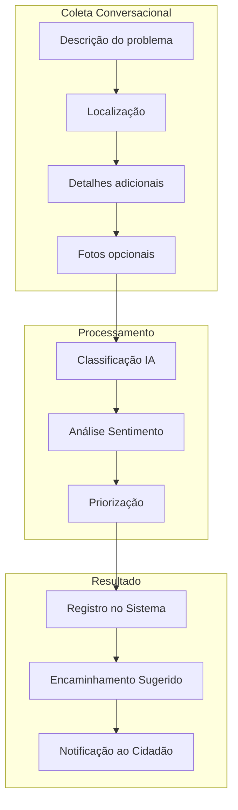

**Categorias Cobertas:**
- 🏗️ Infraestrutura (buracos, calçadas, obras)
- 💡 Iluminação pública
- 🧹 Limpeza urbana
- 🌳 Meio ambiente
- 🔒 Segurança
- 💬 Feedback sobre a Câmara

### 5.3 Transporte (Diagnóstico)

**Objetivo:** Reportar problemas no transporte público municipal.

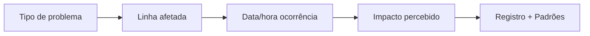

**Tipos de Problemas:**
- Atraso excessivo
- Superlotação
- Falta de acessibilidade
- Comportamento do motorista
- Condições do veículo
- Alteração de itinerário

### 5.4 Serviços (Descoberta Geolocalizada)

**Objetivo:** Encontrar serviços públicos próximos à localização do cidadão.

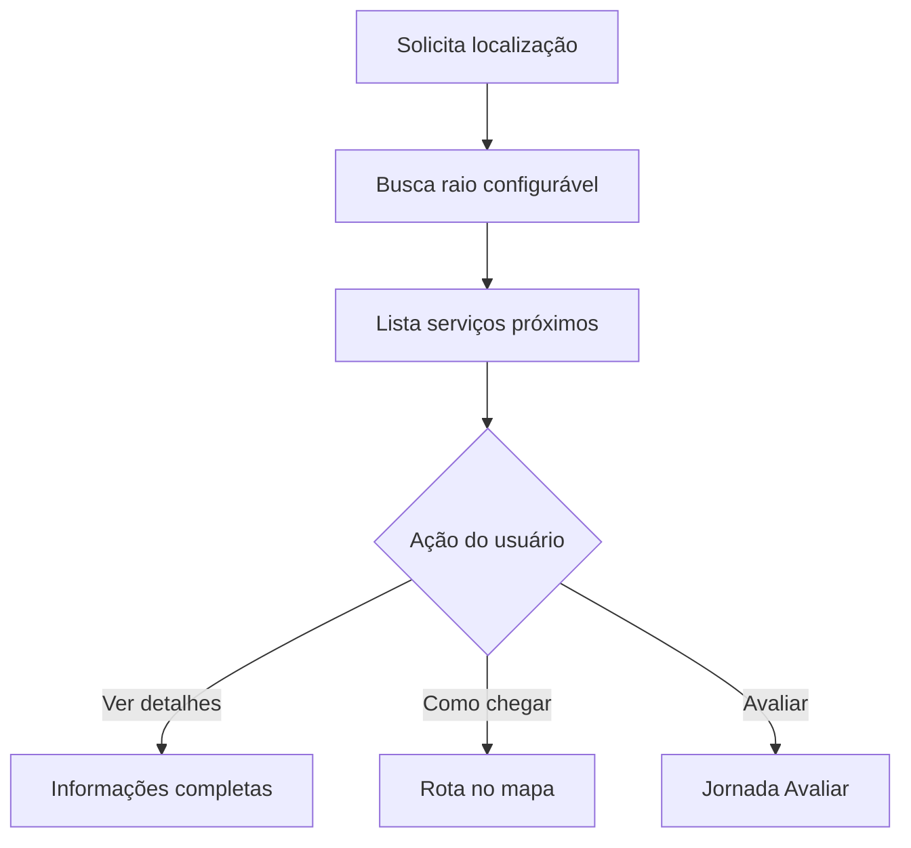

**Tipos de Serviços:**
- 🏥 UBS e Hospitais
- 📚 Escolas e CEUs
- 📖 Bibliotecas
- 🏃 Centros Esportivos

### 5.5 Avaliar (Feedback de Serviços)

**Objetivo:** Coletar avaliações sobre serviços públicos visitados.

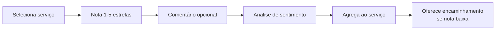

---

## 6. CMS Administrativo

O painel administrativo permite que gestores da Câmara Municipal gerenciem todas as manifestações cidadãs de forma inteligente.

### 6.1 Dashboard de KPIs

```
┌─────────────────────────────────────────────────────────────────┐
│  📊 DASHBOARD CMSP CONNECT                                      │
├─────────────────────────────────────────────────────────────────┤
│                                                                  │
│  ┌──────────┐  ┌──────────┐  ┌──────────┐  ┌──────────┐        │
│  │   245    │  │   89%    │  │   4.2    │  │   12h    │        │
│  │ Manifest.│  │ Resolução│  │ Sentim.  │  │ Resp.Méd │        │
│  │  Novas   │  │  Mensal  │  │  Médio   │  │  1ª Resp │        │
│  └──────────┘  └──────────┘  └──────────┘  └──────────┘        │
│                                                                  │
│  ┌─────────────────────────────────────────────────────────┐   │
│  │  📈 Tendência de Manifestações (30 dias)                │   │
│  │  ▄▄▄█████▄▄▄███████▄▄▄▄▄████████▄▄▄▄████▄▄▄▄▄████████  │   │
│  └─────────────────────────────────────────────────────────┘   │
│                                                                  │
│  ┌─────────────────────┐  ┌─────────────────────────────────┐  │
│  │  🏷️ Por Categoria   │  │  🗺️ Por Região                  │  │
│  │  ████ Infraestrutura│  │  [Mapa de calor de SP]         │  │
│  │  ███ Transporte     │  │                                  │  │
│  │  ██ Iluminação      │  │                                  │  │
│  │  █ Outros           │  │                                  │  │
│  └─────────────────────┘  └─────────────────────────────────┘  │
└─────────────────────────────────────────────────────────────────┘
```

### 6.2 Gestão Unificada de Manifestações

O CMS consolida **4 tipos de manifestações** em uma única interface:

| Tipo | Fonte | Ações Disponíveis |
|------|-------|-------------------|
| 🏙️ **Urbanas** | Jornada "Fala Cidadão!" | Encaminhar, Responder, Atualizar Status |
| 🚌 **Transporte** | Jornada "Transporte" | Encaminhar, Responder, Ver Padrões |
| ⭐ **Avaliações** | Jornada "Avaliar" | Ver Serviço, Encaminhar |
| 💬 **Feedback Câmara** | Jornada "Fala Cidadão!" | Encaminhar, Responder |

### 6.3 Kanban Workflow

Interface visual de **arrastar e soltar** para gestão de status:

```
┌─────────────┬─────────────┬─────────────┬─────────────┐
│   NOVOS     │ EM ANÁLISE  │ ENCAMINHADO │  RESOLVIDO  │
├─────────────┼─────────────┼─────────────┼─────────────┤
│ ┌─────────┐ │ ┌─────────┐ │ ┌─────────┐ │ ┌─────────┐ │
│ │ Buraco  │ │ │ Ônibus  │ │ │ Poste   │ │ │ Lixo    │ │
│ │ 🔴 Alta │ │ │ 🟡 Média│ │ │ 🟢 Baixa│ │ │ ✅ Feito │ │
│ └─────────┘ │ └─────────┘ │ └─────────┘ │ └─────────┘ │
│ ┌─────────┐ │ ┌─────────┐ │             │ ┌─────────┐ │
│ │ Calçada │ │ │ UBS fila│ │             │ │ Árvore  │ │
│ │ 🟠 Alta │ │ │ 🔴 Críti│ │             │ │ ✅ Feito │ │
│ └─────────┘ │ └─────────┘ │             │ └─────────┘ │
└─────────────┴─────────────┴─────────────┴─────────────┘
```

### 6.4 Análise de Sentimento (Painel)

Dashboard dedicado à análise do **humor cidadão**:

- Gauge de sentimento geral (0-100)
- Distribuição por categoria
- Tendência temporal
- Nuvem de palavras-chave
- Drivers de sentimento negativo
- Insights gerados por IA

### 6.5 Sistema de Encaminhamentos

Gestão completa do ciclo de encaminhamentos:

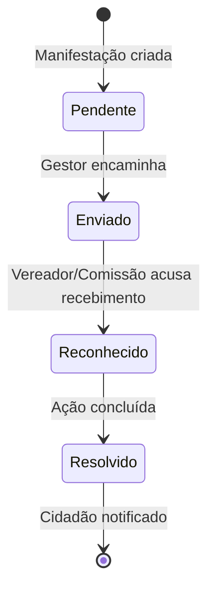

### 6.6 Gestão de Usuários

Controle de acesso baseado em **perfis**:

| Perfil | Permissões |
|--------|------------|
| **Admin** | Acesso total, gestão de usuários |
| **Gestor** | Gestão de manifestações, encaminhamentos |
| **Vereador** | Visualização de encaminhamentos próprios |
| **Assessor** | Suporte a vereadores |
| **Cidadão** | Acesso apenas ao app |

### 6.7 Logs de Auditoria

Rastreabilidade completa de ações:

- Login/logout de usuários
- Alterações de status de manifestações
- Encaminhamentos realizados
- Exportações de dados
- Mudanças de permissões

---

## 7. Métricas de Sucesso

### 7.1 KPIs de Engajamento

| Métrica | Meta | Descrição |
|---------|------|-----------|
| **Usuários Ativos Mensais** | 10.000+ | Cidadãos únicos que usam o app |
| **Manifestações/Mês** | 500+ | Volume de relatos e feedback |
| **Taxa de Conclusão de Jornada** | >70% | Usuários que completam um fluxo |
| **NPS (Net Promoter Score)** | >50 | Satisfação geral com a plataforma |

### 7.2 KPIs Operacionais

| Métrica | Meta | Descrição |
|---------|------|-----------|
| **Tempo Médio de 1ª Resposta** | <24h | Velocidade de triagem inicial |
| **Taxa de Resolução** | >60% | Manifestações efetivamente resolvidas |
| **Precisão da Categorização IA** | >90% | Assertividade da classificação automática |
| **Uptime da Plataforma** | >99.5% | Disponibilidade do sistema |

### 7.3 KPIs de Impacto Social

| Métrica | Meta | Descrição |
|---------|------|-----------|
| **Encaminhamentos Resolvidos** | >50% | Demandas que chegam a uma solução |
| **Participação em Audiências** | +100% | Aumento vs. período anterior |
| **Diversidade Geográfica** | Todas regiões | Cobertura de todas as subprefeituras |
| **Inclusão Digital** | +20% novos | Cidadãos usando gov digital pela 1ª vez |

---

## 8. Segurança e Conformidade LGPD

### 8.1 Dados Sensíveis e Proteção

| Dado | Classificação | Proteção |
|------|---------------|----------|
| Nome, telefone | Pessoal | Criptografia em repouso |
| Localização | Sensível | Anonimização após uso |
| Gênero, raça, renda | Sensível opcional | Minimização, consentimento |
| Relatos e feedback | Conteúdo | RLS por usuário |
| Histórico de chat | Comportamental | Retenção limitada |

### 8.2 Políticas de Anonimização

- **Localização**: Coordenadas GPS são usadas apenas para descoberta de serviços, não são armazenadas permanentemente
- **Demografias**: Dados agregados para relatórios, nunca individualizados
- **Relatos públicos**: Opção de anonimato ao cidadão

### 8.3 Retenção de Dados

| Tipo de Dado | Período de Retenção |
|--------------|---------------------|
| Conversas de chat | 90 dias |
| Manifestações ativas | Até resolução + 1 ano |
| Manifestações resolvidas | 5 anos (arquivo) |
| Logs de auditoria | 5 anos |
| Dados de analytics | Agregados indefinidamente |

### 8.4 Direitos do Titular (LGPD)

O sistema implementa todos os direitos previstos na LGPD:

- ✅ **Acesso**: Cidadão pode ver todos seus dados
- ✅ **Correção**: Atualização de informações pessoais
- ✅ **Exclusão**: Remoção de conta e dados
- ✅ **Portabilidade**: Exportação em formato aberto
- ✅ **Oposição**: Opt-out de comunicações

### 8.5 Auditoria e Compliance

- Logs imutáveis de todas as ações
- Trilha de auditoria exportável
- Relatórios de acesso a dados sensíveis
- Notificação automática de incidentes

---

## 9. Glossário

| Termo | Definição |
|-------|-----------|
| **Audiência Pública** | Reunião aberta onde cidadãos podem participar de discussões sobre projetos de lei e políticas públicas |
| **Comissão Permanente** | Grupo de vereadores especializado em uma área temática (ex: Saúde, Educação, Transporte) |
| **Edge Function** | Função serverless que executa lógica de backend próxima ao usuário |
| **Encaminhamento** | Direcionamento de uma manifestação cidadã para um vereador ou comissão específica |
| **Jornada** | Fluxo conversacional especializado para um tipo de interação (ex: relato urbano, avaliação) |
| **Kanban** | Metodologia visual de gestão de tarefas com colunas representando status |
| **LGPD** | Lei Geral de Proteção de Dados - legislação brasileira de privacidade |
| **Manifestação** | Qualquer tipo de comunicação cidadã (relato, reclamação, sugestão, elogio) |
| **N8N** | Plataforma de automação de workflows que integra sistemas |
| **RLS (Row Level Security)** | Política de segurança que restringe acesso a linhas específicas do banco de dados |
| **Sentimento** | Análise do tom emocional de um texto (positivo, neutro, negativo) |
| **SP Legis** | Sistema oficial da Câmara com dados de vereadores, projetos e votações |
| **Subprefeitura** | Divisão administrativa da cidade de São Paulo |
| **Webhook** | Chamada HTTP automática disparada quando um evento ocorre |

---

## Contato

**Câmara Municipal de São Paulo**  
Viaduto Jacareí, 100 - Bela Vista  
São Paulo - SP, 01319-900

📧 cmspconnect@saopaulo.sp.leg.br  
🌐 www.saopaulo.sp.leg.br

---

*Documento gerado em Dezembro 2025*  
*Versão 1.0 - Overview Executivo*
