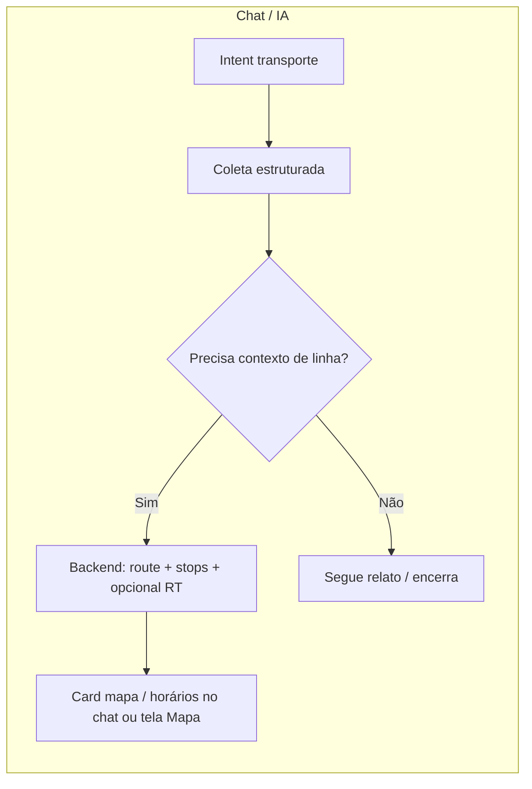

# Proposta: diagnóstico colaborativo de transporte + rastreabilidade de linhas (chatbot)

**Branch:** `feature/diagnostico-transporte-linhas-chatbot`  
**Data:** 2026-04-02  
**Status:** estudo / proposta — ponto crítico de **usabilidade** e **complexidade técnica**

---

## 1. Demanda em uma frase

Entregar um **fluxo completo de diagnóstico colaborativo de transporte via chatbot**, com **visibilidade para o munícipe sobre onde determinada linha de ônibus (e, quando aplicável, outros modos) está** ou **quando deve passar**, alinhado a referências de mercado (ex.: **Moovit** como inspiração de UX, não de stack fechada) e com transparência sobre **limites técnicos e de dados** em São Paulo.

---

## 2. Objetivos

| Objetivo | Descrição |
|----------|-----------|
| **O1 — Diagnóstico colaborativo** | Manter e evoluir o registro estruturado de problemas de transporte (linha, sentido, horário, recorrência, evidências), já iniciado no app e no `ai-orchestrator`. |
| **O2 — Rastreabilidade percebida** | O cidadão consegue **contexto espacial/temporal** da linha: não só “qual linha”, mas **“onde está / quando vem”** dentro do que for viável com dados oficiais e produto. |
| **O3 — Usabilidade (ponto crítico)** | Reduzir fricção na conversa e na leitura de mapas/horários; padrões inspirados em apps de referência (Moovit: mapa + linha + status). |
| **O4 — Honestidade técnica** | Documentar **o que é possível sem API em tempo real**, **o que depende de GTFS-RT / parcerias**, e **custos/latência/privacidade**. |

---

## 3. Estado atual no Câmara na Mão (baseline)

- **Jornada “Diagnóstico de Transporte”** no chat, com coleta determinística via `collectionType === 'transport_report'` no **ai-orchestrator** (`supabase/functions/ai-orchestrator`).
- Campos evolutivos incluem **linha** (`line_code` + `LINE_PICKER`), **horário** (`TIME_PICKER` / `occurrence_time`), **sentido** (`direction`: ida / volta / circular — ver migration `20260407110000_transport_reports_direction.sql`), **recorrência** (`recurrence_frequency`), fotos e resumo antes de `create_transport_report`.
- **Lacuna explícita:** o fluxo **não exibe** posição de veículos em mapa nem ETA alimentada por dados operacionais em tempo real; o munícipe **infere** pelo relato, não por “onde a linha está agora”.

---

## 4. Inspiração Moovit (UX) vs. realidade técnica

### 4.1 O que o Moovit faz bem (heurísticas de produto)

- **Linha como objeto central:** escolho linha → vejo **mapa**, **paradas**, **próximos horários** e, quando há dados, **atraso / veículo a caminho**.
- **Menos texto, mais contexto espacial:** o usuário não precisa “imaginar” o trajeto.
- **Alertas e interrupções** percebidas como confiança (quando a fonte é estável).

### 4.2 O que não copiamos literalmente

- Moovit é **plataforma fechada** com acordos com operadores; **não** há SDK “Moovit dentro do chat” gratuito para o nosso caso.
- A referência é **padrão de interface e expectativa do usuário**, não dependência tecnológica homónima.

### 4.3 Implicação para o nosso chatbot

- **Respostas curtas + componente rico:** após identificar linha/sentido, o ideal é **anexar** (inline ou deep link) **mapa / lista de paradas / próxima janela** — mesmo que em MVP seja **estático** (shape GTFS) ou **horário programado**, não GPS ao vivo.

---

## 5. Rastreabilidade das linhas: o que significa na prática

| Nível | O que o munícipe vê | Fonte de dados típica | Complexidade |
|-------|---------------------|------------------------|--------------|
| **L0 — Identidade da linha** | Código/nome oficial, operador | Tabela interna + validação | Baixa — já parcialmente coberto pelo picker |
| **L1 — Trajeto (shape)** | Polilinha no mapa “por onde a linha passa” | **GTFS estático** (SPTrans / dados abertos, quando licenciados e atualizados) | Média: ingestão, cache, licença de uso |
| **L2 — Horário programado** | Próximas partidas em parada (programado) | GTFS `stop_times` | Média: escolha de parada + timezone |
| **L3 — Atraso / headway** | “Atrasado X min” ou frequência | **GTFS-RT** ou API operador | Alta: streaming, SLA, fallbacks |
| **L4 — Posição do veículo** | Ícone se movendo no mapa | **API Olho Vivo (SPTrans)** ou GTFS-RT, conforme disponibilidade | Para ônibus municipais SPTrans, o **Olho Vivo** cobre posição e previsão; ver §13 |

**Proposta de valor incremental:** entregar **L1 + L2** como **MVP de rastreabilidade percebida**; **L3/L4** para linhas SPTrans podem usar **Olho Vivo** (token já obtido via [API Store](https://apilib.prefeitura.sp.gov.br/store/apis/info?name=OlhoVivo&version=v2.1&provider=admin&tag=SPTrans#tab1)) em chamadas server-side.

---

## 6. Complexidades técnicas (resumo executivo)

1. **Disponibilidade e termos de uso dos dados** (GTFS/GTFS-RT da região metropolitana): verificar **licença**, **atualização** e **ambiente** (produção vs sandbox).
2. **Consistência de IDs:** `line_code` no relato deve mapear para **trip/route_id** do feed — exige **camada de resolução** (normalização, homônimos, linhas noturnas).
3. **Performance:** shapes podem ser pesados; usar **simplificação** + **tiles** ou carregar só bbox do usuário.
4. **Tempo real:** GTFS-RT exige **consumo contínuo** (WebSocket/polling), **deduplicação** e **UI que degrada** quando o feed cai.
5. **Privacidade (LGPD):** rastreio do **usuário** no mapa é opcional; preferir **parada escolhida** ou **centro do mapa** sem gravar trajeto sem consentimento.
6. **Chatbot:** o modelo **não “adivinha”** posição de ônibus; deve **invocar ferramentas** (ex.: `get_line_status`, `get_stop_predictions`) com respostas determinísticas a partir de backend.
7. **Colaboração:** relatos do cidadão podem **cruzar** com atrasos oficiais (ex.: “vários relatos na linha X + feed indica atraso”) — valor analítico para gestão, com cuidado para não confundir **anecdota** com **dado oficial**.

---

## 7. Fluxo alvo (visão)

---

## 8. Estudo de usabilidade (esboço)

**Objetivo:** validar se munícipes entendem **linha + sentido + onde olhar no mapa** sem sobrecarga cognitiva.

| Métrica sugerida | Meta inicial |
|------------------|--------------|
| Tempo até “entendi onde é a linha” | < 60 s em teste moderado |
| Taxa de erro (linha errada) | < 15% |
| SUS / NASA-TLX (opcional) | Baseline após MVP |

**Tarefas exemplo**

1. “Registrar atraso na linha X no sentido Y e ver no mapa por onde ela passa.”
2. “Descobrir a próxima partida programada perto de um ponto.”
3. (Fase RT) “Ver se há atraso oficial para a mesma linha.”

**Protótipo:** Figma ou build com **mapa + chat**; comparar com **Moovit** apenas como **benchmark de clareza**, não de feature parity.

---

## 9. Fases de entrega sugeridas

| Fase | Escopo | Entregáveis |
|------|--------|-------------|
| **F0** | Alinhar proposta | Este documento + revisão com produto/legais |
| **F1 — MVP percepção** | L1 + deep link para mapa interno com shape da linha selecionada | Contrato de API interna, UX no `AgentChatArea` / página mapa |
| **F2** | L2 horários programados | Parada + próximas partidas (GTFS estático) |
| **F3** | L3/L4 tempo real (ônibus SPTrans) | **Olho Vivo** via gateway APILib + `codigoLinha` / parada alinhados ao `LINE_PICKER`; fallback GTFS-RT se necessário |
| **F4** | Analytics colaborativo | Cruzamento relatos × dados oficiais (painel gestão) |

---

## 10. Riscos e dependências

- **Dependência de terceiros** para tempo real (SPTrans / metrô / CPTM cada um com maturidade diferente).
- **Expectativa inflada:** comunicar sempre **“programado”** vs **“tempo real”** na UI.
- **Manutenção:** feeds mudam; necessidade de **alertas de ingestão** e **versão de feed**.

---

## 11. Próximos passos recomendados

1. **Workshop** 90 min: produto + eng + jurídico — validar uso de dados abertos e roadmap F1–F2.
2. **Spike técnico** (2–3 dias): download GTFS SP, parse, uma linha no mapa.
3. **Protocolo de usabilidade** com 5–8 usuários no protótipo F1.

---

## 12. Referências internas

- `docs/DIAGRAMA_ARQUITETURA_FLUXOS.md` — fluxo ai-orchestrator.
- `docs/AI_ORCHESTRATOR_SPECIFICATION.md` — jornadas e ferramentas.
- `supabase/functions/ai-orchestrator/index.ts` — coleta `transport_report`.
- Migrations `transport_reports` (direção, recorrência).

---

## 13. API Olho Vivo (SPTrans) — gateway Prefeitura / API Store

Com **subscrição e token** na [API Store — OlhoVivo v2.1](https://apilib.prefeitura.sp.gov.br/store/apis/info?name=OlhoVivo&version=v2.1&provider=admin&tag=SPTrans#tab1), o acesso passa pelo **gateway HTTPS** (recomendado em produção), com **Authorization: Bearer &lt;access_token&gt;** gerado para a aplicação.

### 13.1 Base URL (produção)

| Ambiente | Base URL |
|----------|----------|
| Gateway APILib (HTTPS) | `https://gateway.apilib.prefeitura.sp.gov.br/sptrans/olhovivo/v2.1` |

*(Sandbox, se existir na Store, usa o mesmo host com política da subscrição — validar no painel.)*

A documentação funcional detalhada (parâmetros, exemplos JSON) continua no guia oficial SPTrans: [Documentação API Olho Vivo](https://www.sptrans.com.br/desenvolvedores/api-do-olho-vivo-guia-de-referencia/documentacao-api/).

### 13.2 Endpoints necessários para o produto (mapa + “onde está” + parada)

Implementação no **backend** (Edge Function ou serviço): **nunca** expor o token no app.

| Finalidade | Categoria na doc SPTrans | Uso no Câmara na Mão |
|------------|---------------------------|----------------------|
| Resolver texto → `codigoLinha` / linha oficial | **Linhas** (buscar por termo, sentido, etc.) | Alinhar escolha do `LINE_PICKER` ao código numérico da API |
| **Posição dos veículos** (L4) | **Posição** — por linha e/ou visão agregada | Mapa com ícones; polling a cada 15–30 s (respeitar termos e carga) |
| **Previsão na parada** (L3) | **Previsão** — parada + linha | “Próximo ônibus em X min” no ponto |
| Paradas próximas / código de parada | **Paradas** | Escolher `codigoParada` para previsão |
| Corredores (opcional) | **Corredores** | Contexto de mapa / filtros |

Os **paths exatos** (ex.: sufixos após `/v2.1`) devem ser copiados do **Swagger** (`/swagger.json`) na API Store após login — a versão v2.1 mantém REST alinhado ao [guia de referência](https://www.sptrans.com.br/desenvolvedores/api-do-olho-vivo-guia-de-referencia/).

### 13.3 Integração técnica (checklist)

1. **Edge Function `sptrans-olhovivo`** (`supabase/functions/sptrans-olhovivo/`) — proxy com `SPTRANS_OLHOVIVO_BEARER_TOKEN`; cliente web: `src/lib/sptransOlhoVivo.ts` (`invokeSptransOlhoVivo`).
2. Mapear `line_code` do relato ↔ **`codigoLinha`** retornado pela busca de linhas (testar homônimos e sentido).
3. Cache curto + **degradação** se a API falhar (mensagem “dados indisponíveis”, sem inventar posição).
4. **Rate limiting** próprio para não estourar cota/uso aceitável.
5. LGPD: posição do **veículo** é dado público operacional; localização do **usuário** continua sujeita a consentimento no app.

---

*Documento vivo: atualizar após spike GTFS e integração Olho Vivo (primeiro `GET` com Bearer no Edge).*
